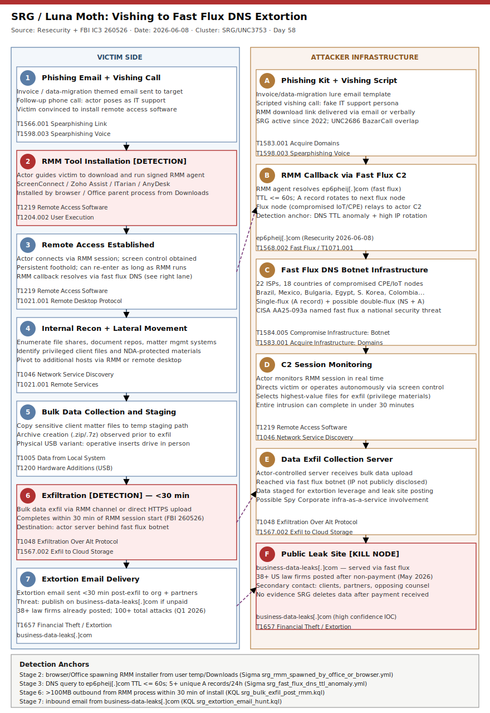

# SRG / Luna Moth Fast Flux DNS Infrastructure: Vishing-to-Extortion Against US Law Firms

## TL;DR

Silent Ransom Group (SRG), tracked also as Luna Moth, Chatty Spider, and UNC3753, pivoted in 2026 to a DNS fast flux botnet — 22 ISPs, 18 countries of compromised IoT/CPE nodes — to mask its command-and-control and leak-site infrastructure behind continuously rotating DNS A records. The group combines vishing-to-RMM initial access (posing as IT support to convince targets to install ScreenConnect or Zoho Assist) with aggressive data exfiltration and extortion delivered within 30 minutes of access, targeting U.S. law firms and their clients' privileged materials. More than 38 firms have had data posted to SRG's public leak site `business-data-leaks[.]com` after declining to pay. The FBI issued IC3 Flash 260526 on 2026-05-26 noting a new in-person physical intrusion variant; Resecurity disclosed the fast flux infrastructure on 2026-06-08, making this the first public documentation of the DNS evasion layer.

## Attribution and confidence

| Field | Value |
|---|---|
| Cluster | Silent Ransom Group (SRG) |
| Aliases | Luna Moth (Unit 42 / Recorded Future), Chatty Spider (CrowdStrike), UNC3753 (Google Mandiant) |
| Active since | 2022 |
| Motivation | Financial — data theft and extortion; no file-encrypting ransomware |
| Attribution confidence | **medium** — FBI Flash 260526 names SRG; Resecurity attributes fast flux domains to SRG with supporting telemetry; actor identity not formally charged by any government |
| Overlap | Partial overlap with UNC2686 (BazarCall campaigns, TrickBot/BazarLoader lineage) per Google GTIG |

No overlap with any prior repo case. Anti-duplicate search against `silent.ransom|luna.moth|chatty.spider|unc3753|srg.dns|fast.flux.srg|ep6pheij|business-data-leaks` yields zero hits in `days/` and `byActor/`. Distinct from Day 51 `FakeInvitation-PhishKit-OTP-RMM` (different actor, different kit, no fast flux, no law firm targeting) and Day 37 `RDNS-ip6arpa-Phishing-Reverse-DNS` (ip6.arpa phishing, different class of DNS abuse, different actor).

## Kill chain — summary table

| Stage | MITRE | Detail |
|---|---|---|
| Resource development | T1583.001, T1584.005 | Register fast flux domains; conscript IoT/CPE devices as flux nodes (22 ISPs, 18 countries) |
| Phishing + vishing | T1566.001, T1598.003 | Invoice/data-migration themed email; follow-up phone call posing as IT support |
| RMM installation | T1219, T1204.002 | Victim convinced to install ScreenConnect, Zoho Assist, ITarian, or AnyDesk |
| Remote access | T1219, T1021.001 | Actor connects via legitimate RMM session; establishes persistent foothold |
| Internal recon | T1046 | Enumerate file servers, document repositories, client data locations |
| Lateral movement | T1021.001, T1005 | Access file shares; collect high-value client matter files |
| Exfiltration | T1048, T1567.002 | Bulk exfil of sensitive data; completed within 30 min of initial access |
| Physical access (variant) | T1200 | Operative inserted in person to plug USB drive where remote fails |
| Impact — extortion | T1657 | Extortion email sent < 30 min post-exfil; non-payers doxxed on leak site |



The left lane traces the victim-side kill chain from the initial phishing email through vishing, RMM installation, and bulk exfiltration. The right lane shows the attacker infrastructure: the fast flux botnet (ep6pheij[.]com rotating across compromised IoT nodes in 22 ISPs) and the public leak site (business-data-leaks[.]com). Cross-lane arrows mark the two detection anchors of highest value: the RMM callback to fast flux infrastructure (where DNS TTL anomaly is detectable) and the extortion delivery stage (where email content and sender IP link to the leak domain).

## Stage-by-stage detail

### Stage 1 — Resource development (T1583.001, T1584.005)

SRG registers dedicated fast flux domains and compromises IoT/CPE devices (routers, modems, gateways) across 18 countries and 22 ISPs to serve as flux nodes. The technique is single-flux at minimum (multiple A records for one domain rotating at TTL ≤ 60 seconds); double-flux variants also rotate NS records, making passive DNS tracking harder.

Known fast flux domains (Resecurity, June 2026):
```
ep6pheij[.]com            # C2 callback domain
business-data-leaks[.]com # Public extortion / leak site
```

The Spy Corporate underground project (emerged May 2026) is assessed by Resecurity as potentially linked to SRG infrastructure provisioning.

### Stage 2 — Phishing + vishing (T1566.001, T1598.003)

Victims receive phishing emails themed around invoices, data migration, or IT security alerts. Actors follow up by phone, impersonating IT support staff ("Your account was flagged; we need to image your device"). The FBI Flash 260526 notes this as the primary initial access vector for 2026 campaigns.

### Stage 3 — RMM installation (T1219, T1204.002)

Actors guide victims to install a legitimate remote access tool. Observed tools:

```
ScreenConnect.WindowsClient.exe
Zoho Assist (zohoassist.exe)
ITarian (ITSPlatform.exe / itarian.exe)
AnyDesk (AnyDesk.exe)
```

Because these are signed, legitimate applications, most EDR products will not alert on the binary itself. Detection requires behavioral correlation: browser or Office process spawning an RMM installer from a user temp or download path.

### Stage 4 — Remote access and recon (T1219, T1046)

Actors use the RMM session to browse file systems, query Active Directory, and locate document repositories (SharePoint, file servers, matter management systems). Lateral movement is primarily through the RMM session itself or via remote desktop to reachable internal hosts.

### Stage 5 — Physical access variant (T1200)

A Spring 2026 development documented in FBI Flash 260526: when remote access fails, SRG dispatches an operative in person to the victim's office. The operative presents a cover story (auditing a suspected phishing link, backup imaging) and physically inserts a USB storage device. Recommended control: disable AutoRun/AutoPlay, restrict USB storage via Group Policy, verify photo ID before granting physical access.

### Stage 6 — Exfiltration (T1048, T1567.002)

Data exfiltration occurs rapidly — FBI notes the actor can complete exfil within 30 minutes of gaining access. Files are staged locally then transferred via the RMM channel or uploaded directly to an actor-controlled server reachable through the fast flux network.

### Stage 7 — Impact / extortion (T1657)

Extortion emails arrive within 30 minutes of exfiltration. SRG threatens to publish data on `business-data-leaks[.]com`. If the victim is unresponsive, actors contact the firm's clients, partners, and opposing counsel directly, maximizing reputational and attorney-client privilege damage. As of May 2026, more than 38 U.S. law firms have had data posted to the public leak site.

## Detection strategy

### Telemetry that matters

| Source | Events / Tables |
|---|---|
| DNS resolver logs | Sysmon EID 22 (DNS query), Windows DNS Server analytic log, network proxy DNS logs |
| Process creation | Sysmon EID 1, Windows Security EID 4688, Defender XDR `DeviceProcessEvents` |
| Network connections | Sysmon EID 3, `DeviceNetworkEvents`, firewall logs |
| Email gateway | `EmailEvents`, mail gateway / SEG logs |
| File activity | Sysmon EID 11, `DeviceFileEvents` (staging prior to exfil) |

### Detection coverage

| Engine | File | Logic |
|---|---|---|
| Sigma | `sigma/srg_rmm_spawned_by_office_or_browser.yml` | Office/browser process spawning RMM installer binary from user temp/download path |
| Sigma | `sigma/srg_fast_flux_dns_ttl_anomaly.yml` | DNS response with TTL ≤ 60s to a domain not in internal zone + high IP-rotation ratio |
| Sigma | `sigma/srg_data_exfil_via_rmm.yml` | High-volume outbound bytes from RMM process within 30 min of installation |
| KQL | `kql/srg_rmm_install_from_browser.kql` | DeviceProcessEvents: RMM binary spawned by browser/Office, user download path |
| KQL | `kql/srg_fast_flux_domain_lookup.kql` | DeviceNetworkEvents + DNS events for ep6pheij and business-data-leaks domains |
| KQL | `kql/srg_bulk_exfil_post_rmm.kql` | Correlate RMM process events with high outbound byte counts < 30 min later |
| KQL | `kql/srg_extortion_email_hunt.kql` | EmailEvents: sender domain matches known SRG leak domains |
| YARA | `yara/srg_fast_flux_domain_strings.yar` | Known SRG fast flux domain strings in memory / PCAP / log artifacts |
| YARA | `yara/srg_extortion_email_template.yar` | SRG extortion email template: characteristic phrases and payment instruction patterns |
| Suricata | `suricata/srg_fast_flux_dns.rules` | DNS A query to ep6pheij[.]com and business-data-leaks[.]com; HTTP traffic to same |

### Threat hunting hypotheses

**H1 (PEAK)**: Hosts in the environment have sent DNS queries to domains with observed fast flux behavior (TTL ≤ 60s, 5+ unique A records per 1h window). See `hunts/peak_h1_fast_flux_dns_beacon.md`.

**H2 (PEAK)**: A workstation received an inbound phone call (via Teams/Zoom caller ID log or VoIP CDR) and within 60 minutes installed a signed RMM binary from a user-writable path. See `hunts/peak_h2_vishing_to_rmm_correlation.md`.

**H3 (PEAK)**: A workstation ran an RMM session followed by high-volume outbound file transfer (>100 MB in 30 min) to a non-corporate destination. See `hunts/peak_h3_rapid_exfil_after_rmm.md`.

## Incident response playbook

### First 60 minutes (triage)

1. Identify all hosts where a non-baseline RMM tool (ScreenConnect, Zoho Assist, ITarian, AnyDesk) was installed or executed in the past 72 hours.
2. Query DNS resolver logs for queries to `ep6pheij[.]com` and `business-data-leaks[.]com`; broaden to any domain with TTL ≤ 60s not on your internal allow-list.
3. Pull outbound NetFlow / proxy logs for the affected hosts for the hour before and after the RMM installation timestamp.
4. Preserve RMM session logs (ScreenConnect stores logs under `%ProgramData%\ScreenConnect Client\`).
5. Verify physical access logs for unexpected visitors on the timeline of the incident (especially if remote RMM vector seems absent).
6. Confirm whether any extortion emails have been received at the organization or at partner/opposing counsel contacts.

### Artifacts to collect

| Artifact | Path | Tool | Why |
|---|---|---|---|
| RMM session logs | `%ProgramData%\ScreenConnect Client\Logs\` | xcopy / MFT | Timestamps of actor commands and file transfers |
| Zoho Assist logs | `%APPDATA%\ZohoMeeting\ZohoAssist\Logs\` | xcopy | Session ID and transferred file list |
| DNS resolver cache | `ipconfig /displaydns` output | cmd | Fast flux domain resolution at time of incident |
| Windows Security EID 4688 / Sysmon EID 1 | EVTX | evtxecmd | RMM process creation and parent chain |
| Network flow logs | Firewall / proxy / NetFlow | SIEM query | Volume of outbound data per process per dest IP |
| USB device history | `HKLM\SYSTEM\CurrentControlSet\Enum\USBSTOR` | Registry / LECmd | Physical access variant: enumerate external storage |
| MFT / INDX | `$MFT`, `$LogFile` | MFTECmd | Recover file names staged for exfiltration |

### IR queries and commands

```powershell
# Enumerate recent RMM installs (last 72h)
Get-WinEvent -LogName Application |
  Where-Object { $_.TimeCreated -gt (Get-Date).AddHours(-72) -and
    $_.Message -match 'ScreenConnect|ZohoAssist|ITarian|AnyDesk' }

# Check DNS cache for fast flux domains
ipconfig /displaydns | Select-String -Pattern 'ep6pheij|business-data-leaks'

# List USB storage devices (physical access check)
Get-ItemProperty 'HKLM:\SYSTEM\CurrentControlSet\Enum\USBSTOR\*\*' |
  Select-Object FriendlyName, ContainerID

# Find large outbound transfers from RMM processes (Sysmon EID 3)
Get-WinEvent -LogName 'Microsoft-Windows-Sysmon/Operational' |
  Where-Object { $_.Id -eq 3 } |
  Where-Object { $_.Message -match 'ScreenConnect|zohoassist|AnyDesk' }
```

```kql
// Rapid exfil after RMM install — Defender XDR
DeviceProcessEvents
| where FileName in~ ("ScreenConnect.WindowsClient.exe","zohoassist.exe","ITSPlatform.exe","AnyDesk.exe")
| where FolderPath has_any (@"Downloads",@"AppData\Local\Temp",@"Users\Public")
| join kind=inner (
    DeviceNetworkEvents
    | where RemoteIPType == "Public"
    | summarize TotalBytes=sum(SentBytes) by DeviceId, bin(Timestamp, 30m)
    | where TotalBytes > 104857600
  ) on DeviceId
| where Timestamp1 between (Timestamp .. (Timestamp + 30m))
```

### Containment, eradication, recovery

**Contain immediately**:
- Isolate affected workstation from network; terminate the RMM session via the management console.
- Revoke any sessions/tokens from the RMM management console for the affected user.
- Block `ep6pheij[.]com`, `business-data-leaks[.]com` at DNS firewall and web proxy (including wildcard subdomains).

**Eradicate**:
- Uninstall the RMM tool (MSI uninstall or forced via MDM).
- Hunt and remove any USB-delivered payload if the physical variant was used.
- Audit Active Directory for any accounts created or modified during the actor's access window.

**Do NOT**:
- Do not pay the ransom — there is no evidence SRG deletes exfiltrated data after payment; multiple firms report secondary extortion.
- Do not delay notification to affected clients; attorney-client privilege breaches may have reporting obligations.

**Recovery validation**:
- Verify no scheduled tasks, startup entries, or services referencing the RMM tool remain.
- Confirm DNS resolution for ep6pheij[.]com is blocked at the resolver.
- Reset passwords for all accounts authenticated during the actor's session window.

### Recovery validation

After containment: run Sigma rule `srg_rmm_spawned_by_office_or_browser.yml` against process creation logs for the next 24 hours to confirm no re-installation. Repeat DNS query hunt for fast flux domains weekly for 30 days.

## IOCs

| Type | Value | Context | Confidence | Source |
|---|---|---|---|---|
| domain | ep6pheij[.]com | SRG fast flux C2 domain; A records rotate every < 60s across 22 ISPs | high | Resecurity 2026-06-08 |
| domain | business-data-leaks[.]com | SRG extortion / data leak site; also served via fast flux infrastructure | high | Resecurity 2026-06-08; SecurityWeek 2026-06-08 |
| string | ScreenConnect.WindowsClient.exe | RMM tool used by SRG for remote access post-vishing | medium | FBI IC3 Flash 260526 |
| string | zohoassist.exe | Zoho Assist — RMM tool used by SRG | medium | FBI IC3 Flash 260526 |
| string | ITSPlatform.exe | ITarian RMM agent — used by SRG | medium | FBI IC3 Flash 260526 |
| string | AnyDesk.exe | AnyDesk — used by SRG | medium | FBI IC3 Flash 260526 |
| note | Fast flux botnet: 22 ISPs, 18 countries | Nodes in Brazil, Mexico, Bulgaria, Egypt, South Korea, Colombia and others; specific IPs not publicly disclosed by Resecurity | medium | Resecurity 2026-06-08 |
| note | Physical access variant | SRG operative in person with USB drive; active since Spring 2026; targets law firm offices | high | FBI IC3 Flash 260526 |
| note | Exfil timeline | Bulk exfil typically completes within 30 minutes of RMM session establishment | high | FBI IC3 Flash 260526 |
| note | Leak site impact | 38+ US law firms had data posted after declining to pay as of May 2026 | high | FBI IC3 Flash 260526; SecurityWeek 2026-06-08 |
| string | Spy Corporate | Underground project emerging May 2026; assessed as potentially linked to SRG infra provisioning | low | Resecurity 2026-06-08 |
| note | SRG UNC2686 overlap | Partial operational overlap with UNC2686 (BazarCall / TrickBot lineage) per Google GTIG | low | Google GTIG 2026 |
| note | Q1 2026 legal sector | Law firms = 4th most targeted industry Q1 2026, ~25% of ransomware-related incidents | high | Resecurity 2026-06-08 |

Full IOC list in `iocs.csv`.

## Secondary findings

- **#3 Ransomware/RaaS — pure data extortion without encryption**: SRG demonstrates that a ransomware-class financial outcome requires neither a locker payload nor code execution at scale. The kill chain terminates at T1657 (Financial Theft / extortion) — no T1486 (Data Encrypted for Impact). This structural shift is strategic: no encrypted-file evidence to present to law enforcement, no forensic timestamp for the locker event, and no dependency on key management or decryptor delivery. Detection and response programs built around "ransomware = encryption" miss this class entirely.

- **#21 Infrastructure abuse / residential proxy networks**: The SRG fast flux botnet operates identically to a residential proxy network — compromised CPE devices relay DNS and HTTP traffic, providing geographic diversity and ISP legitimacy to what is effectively a criminal proxy pool. CISA joint advisory AA25-093a (April 2025) named fast flux a national security threat precisely because compromised ISP-registered IPs are not blocked by IP reputation feeds, and the technique is equally effective for C2 evasion as for botnet operations.

- **#24 CTI tradecraft — fast flux detection methodology**: Passive DNS (pDNS) is the canonical tool for identifying fast flux: a domain name with 5+ unique A records within a 24-hour window, TTL ≤ 60 seconds, and high network diversity of the returned IPs is a strong fast flux signal. Commercial pDNS providers (Farsight DNSDB, DomainTools Iris) and free sources (SecurityTrails, CIRCL.lu pDNS) surface this. Defender-side: Protective DNS (PDNS) services that implement RFC 9694 draft DNS Response Policy Zones (RPZ) can block known fast flux operators at the resolver level without per-domain blocklisting.

## Pedagogical anchors

- **Fast flux survives IP-based blocking because the IP is the point**: Blocking a single IP of a fast flux domain is futile — the domain's A record rotates to the next node within TTL seconds. The correct control is domain-based blocking at the resolver (PDNS / RPZ / DNS firewall), not IP firewall rules. The detection anchor is the domain name and its DNS behavior, not the IP.

- **Vishing bypasses technical MFA because the human is the credential store**: SRG does not need to phish passwords or bypass MFA — the actor convinces the user to voluntarily hand over a pre-authenticated RMM session. FIDO2/passkeys are unphishable but do not prevent an RMM session opened by the legitimate user under social engineering. The complementary control is a sanctioned-RMM allowlist enforced at the endpoint (block any RMM binary not on the approved list).

- **Time-to-exfil < 30 min requires pre-positioned detection, not post-alert investigation**: If SRG completes exfiltration in 30 minutes from first RMM connection, a SIEM alert that triggers 5–10 min after the fact and requires analyst triage before action is structurally insufficient. The detection must be automated-block-capable at the RMM installation event (EDR policy: block non-baseline RMM) or at the DNS fast flux resolution event (PDNS sinkhole).

- **The physical access variant is a tabletop failure mode**: Most incident response plans assume remote initial access. SRG's USB-insertion variant breaks this assumption. Organizations handling privileged materials (law firms, M&A advisors, government contractors) should table-top the scenario "a stranger enters our office and asks to plug in a USB drive" — the FBI's recommended control (verify photo ID, maintain visitor logs, disable USB storage on privileged workstations) costs essentially nothing.

## What's in this folder

| File | Purpose |
|---|---|
| [README.md](./README.md) | This document — full case analysis, IOCs, detection strategy, IR playbook |
| [kill_chain.svg](./kill_chain.svg) | Visual kill chain — two-lane (victim left / attacker-infra right), template A |
| [iocs.csv](./iocs.csv) | Machine-readable IOC list (type, value, context, confidence, source) |
| [sigma/srg_rmm_spawned_by_office_or_browser.yml](./sigma/srg_rmm_spawned_by_office_or_browser.yml) | Sigma rule: Office/browser spawning RMM installer |
| [sigma/srg_fast_flux_dns_ttl_anomaly.yml](./sigma/srg_fast_flux_dns_ttl_anomaly.yml) | Sigma rule: DNS TTL anomaly indicative of fast flux |
| [sigma/srg_data_exfil_via_rmm.yml](./sigma/srg_data_exfil_via_rmm.yml) | Sigma rule: high-volume outbound transfer from RMM process |
| [kql/srg_rmm_install_from_browser.kql](./kql/srg_rmm_install_from_browser.kql) | KQL: RMM binary spawned by browser/Office in user-writable path |
| [kql/srg_fast_flux_domain_lookup.kql](./kql/srg_fast_flux_domain_lookup.kql) | KQL: DNS lookup for known SRG fast flux domains |
| [kql/srg_bulk_exfil_post_rmm.kql](./kql/srg_bulk_exfil_post_rmm.kql) | KQL: high outbound bytes < 30 min after RMM session establishment |
| [kql/srg_extortion_email_hunt.kql](./kql/srg_extortion_email_hunt.kql) | KQL: inbound/outbound email referencing SRG extortion domains |
| [yara/srg_fast_flux_domain_strings.yar](./yara/srg_fast_flux_domain_strings.yar) | YARA: SRG fast flux domain strings in memory/logs |
| [yara/srg_extortion_email_template.yar](./yara/srg_extortion_email_template.yar) | YARA: SRG extortion email template patterns |
| [suricata/srg_fast_flux_dns.rules](./suricata/srg_fast_flux_dns.rules) | Suricata 7.x: DNS/HTTP to SRG fast flux and leak domains |
| [hunts/peak_h1_fast_flux_dns_beacon.md](./hunts/peak_h1_fast_flux_dns_beacon.md) | PEAK hunt H1: fast flux DNS behavior in environment |
| [hunts/peak_h2_vishing_to_rmm_correlation.md](./hunts/peak_h2_vishing_to_rmm_correlation.md) | PEAK hunt H2: vishing-to-RMM timeline correlation |
| [hunts/peak_h3_rapid_exfil_after_rmm.md](./hunts/peak_h3_rapid_exfil_after_rmm.md) | PEAK hunt H3: rapid exfil following RMM session |

## Sources

- [FBI IC3 Flash 260526 — Silent Ransom Group Impersonating IT Personnel](https://www.ic3.gov/CSA/2026/260526.pdf)
- [Resecurity — Silent Ransom Group (SRG): Uncovering DNS Fast Flux Infrastructure (2026-06-08)](https://www.resecurity.com/blog/article/silent-ransom-group-srg-uncovering-dns-fast-flux-infrastructure)
- [SecurityWeek — Silent Ransom Group Uses DNS Fast Flux in Attacks (2026-06-08)](https://www.securityweek.com/silent-ransom-group-uses-dns-fast-flux-in-attacks/)
- [Security Affairs — SRG: Switching To DNS Fast Flux Infrastructure](https://securityaffairs.com/193215/cyber-crime/silent-ransom-group-srg-switching-to-dns-fast-flux-infrastructure.html)
- [BleepingComputer — Silent Ransom Group targets law firms with fake IT support calls](https://www.bleepingcomputer.com/news/security/silent-ransom-group-targets-law-firms-with-fake-it-support-calls/)
- [CISA AA25-093a — Fast Flux: A National Security Threat (2025-04-03)](https://www.cisa.gov/news-events/cybersecurity-advisories/aa25-093a)
- [AHA — FBI Flash TLP:CLEAR 260526 (2026-05-26)](https://www.aha.org/cybersecurity-government-intelligence-reports/2026-05-26-fbi-flash-report-tlp-clear-silent-ransom-group-impersonating-it)
