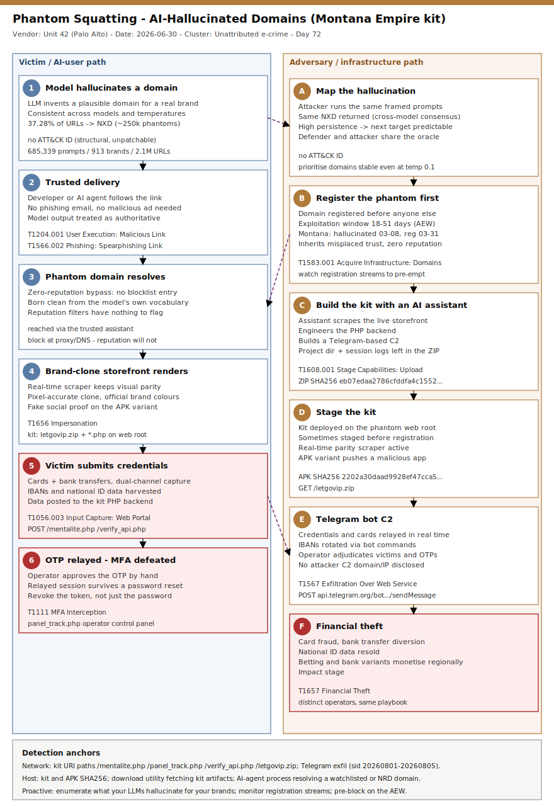

# Phantom Squatting: AI-Hallucinated Domains Weaponised as Phishing Infrastructure (Montana Empire kit)

## TL;DR
Palo Alto Networks Unit 42 published research on **2026-06-30** naming a new adversary technique it calls **phantom squatting**: large language models consistently invent web domains that do not exist, and attackers register those hallucinated domains first to inherit the trust developers and AI assistants place in model output. Across 913 brands and 685,339 prompts to two LLMs, Unit 42 collected 2.1 million URLs, of which ~250,000 pointed to unregistered, squattable domains. The technique is already live: on **2026-03-31** an actor registered a domain the models had hallucinated 23 days earlier and stood up **Montana Empire**, a real-time brand-clone phishing kit for a national postal e-commerce marketplace that steals cards, bank-transfer details, IBANs, national ID data and manually-relayed OTPs via a Telegram C2. It matters today because model output is becoming input - agents act on AI-suggested links before anyone verifies them - and because the vector "exploits a structural property of LLM architectures that remains inherently unpatchable."

## Attribution and confidence
No named threat actor. This is financially motivated e-crime; Unit 42 treats the Montana Empire operator and the Bangladesh-focused betting-site cluster as **distinct** actors that independently arrived at the same phantom-squatting playbook. Attribution confidence is **low** - the value of the research is the *technique class* and its measurement, not a cluster identity.

| Signal | Observation | Weight |
|---|---|---|
| Tooling tell | AI coding-assistant project directory + session logs left inside the kit ZIP (attacker built the kit with an AI assistant) | Method, not identity |
| Infra clustering | Two betting-site phantoms registered 18 minutes apart, identical template, shared registrar/nameserver/privacy shield | Same operator (betting cluster) |
| Targeting | Montana Empire: national postal e-commerce; APK: national postal delivery; others: UAE bank, EU bank, BD betting | Opportunistic brand impersonation |
| Vendor | Unit 42 (Keerthiraj Nagaraj, Diva-Oriane Marty, Beliz Kaleli, Oleksii Starov), 2026-06-30 | Primary |

**Genealogy with previous repo cases.** This is the first repo case anchored on phantom/hallucinated-domain infrastructure. It is the web-domain sibling of **slopsquatting** (hallucinated *package* names), which the tree touches via `mini-shai-hulud`/`shai-hulud` (npm supply chain) and the AI-assisted-operator entries (`tuktuk-ai-generated-framework`, `unattributed-llm-assisted-operator`). It shares the AI-abuse-of-trust theme with the 2026-06-19 GREYVIBE (AI-augmented espionage) and the 2026-07-06 ToddyCat Umbrij (token theft) cases, but the mechanism - the model itself as the delivery vector - is new to the tree.

## Kill chain — summary table
| Stage | MITRE | Detail |
|---|---|---|
| Model hallucinates a domain | (no ATT&CK ID) | LLM invents a plausible domain for a real brand, consistently across temperatures and models |
| Adversary maps the hallucination | (no ATT&CK ID) | Attacker runs the same prompts, finds the same NXD; high THP + cross-model consensus makes the next target predictable |
| Register the phantom domain first | T1583.001 | Domain registered inside the 18-51 day Adversarial Exploitation Window; born clean, zero reputation |
| Build the kit with an AI assistant | T1608.001 | AI coding assistant scrapes the storefront, writes the PHP backend and a Telegram C2 |
| Stage the kit | T1608.001 | `letgovip.zip`, `mentalite.php`, `panel_track.php`, `verify_api.php` on the web root |
| Trusted delivery | T1204.001 / T1566.002 | Developer / AI agent follows the AI-suggested link; no phishing email needed |
| Brand-clone credential capture | T1656 / T1056.003 | Real-time storefront parity; card, bank transfer, IBAN and national ID harvested |
| OTP relay + exfil | T1111 / T1567 | Operator approves OTPs by hand via Telegram; IBANs rotated by bot command |
| Monetisation | T1657 | Financial theft / data resale |



The left lane is the victim/AI-user path (model hallucination -> trusted link -> phantom domain -> credential submission -> OTP); the right lane is the adversary/infrastructure path (map the hallucination -> register first -> build with AI -> stage -> Telegram C2 -> theft). The two lanes converge because attacker and defender reach the same fake domain the same way - by asking an AI. The strongest detection anchors are network/host: the kit URI paths and hashes, and any AI-agent process resolving a newly-registered or watchlisted domain.

## Stage-by-stage detail

### 1. Consistent hallucination (the unpatchable root)
Unit 42 queried two production LLMs - a mini-class enterprise model (released April 2025) and a lite-class frontier model (released June 2025) - both of which shipped **before** the malicious domains existed, proving the domains came from the models' internal language patterns, not memorised training data. 37.28% of generated URLs (809,455) resolved to non-existent domains, collapsing to ~250,000 unique phantom domains. Turning up "creativity" (temperature 1.5) only produced more NXDs (43.10% vs 34.64% at temperature 0.1).

```
Brands analysed        : 913 (tech, finance, healthcare, e-commerce, gov, gambling, logistics)
Prompts / URL queries  : 685,339
URLs produced          : 2,100,000
Already-malicious URLs : 13,229 (0.61%)  -> malware 67.2% / phishing 16.2% / grayware 13.7% / C2 3.0%
Unregistered phantoms  : ~250,000
```

### 2. Adversary maps the same hallucination (T1583.001 - registration)
Because different models invent the *same* fake domain for the same question (cross-model consensus) and do so even at low temperature (Thermal Hallucination Persistence), the attacker's next target is guessable. The attacker runs the same authority-framed prompts, harvests the NXDs, and registers the high-persistence ones. A freshly registered phantom domain **carries no threat-intel history, no reputation score and no blocklist entry** - the zero-reputation bypass.

### 3. Montana Empire: build, stage, deliver (T1608.001, T1204.001, T1656)
On **2026-03-08** Unit 42's pipeline generated 13 hallucinated URLs for a national postal e-commerce marketplace domain, across both model families and every temperature including Precise (high THP). On **2026-03-31** (AEW 23 days) an adversary registered that domain and deployed the kit. Forensics found an AI coding-assistant project directory and session logs *inside* the kit ZIP: the assistant had been used to scrape the live storefront, engineer the PHP backend and build a Telegram-based C2.

```
Kit ZIP  SHA256 : eb07edaa2786cfddfa4c15526168f2200d85300aee0a8f253b32d2462a7b0bcd  (7,958,528 bytes)
Web-root paths  : /letgovip.zip  /mentalite.php  /panel_track.php  /verify_api.php
Login branding  : "MONTANA"  "Enter Access Key"  "ENTER THE EMPIRE"  "User Protocol"  "Lost Access"
Banner          : "Kimseye Guvenme" (Turkish - Trust No One; ASCII-normalized)
```

### 4. Credential capture and OTP relay (T1056.003, T1111, T1567, T1657)
The kit maintains real-time parity with the live storefront (a scraper keeps it visually identical), performs dual-channel interception of credit cards and bank transfers with IBANs rotated via Telegram bot commands, harvests national identity-document data, and exposes an operator control panel for **manual OTP relay and victim adjudication** - the operator approves a victim's one-time passcode by hand, defeating MFA in real time.

### 5. The APK variant (T1608.001)
A second case ran with a 51-day AEW: hallucinated 2026-02-18, domain registered 2026-04-10. The attacker wrapped the phantom domain in a pixel-accurate brand clone (using the brand's official HTML hex colour), fabricated social proof (a 4.8-star rating, "over 2 million users") and pushed a malicious Android APK.

```
APK SHA256 : 2202a30daad9928ef47cca5f4ab04ce083692a94428e386fa01c2dd44557e34b  (12,649,472 bytes)
```

## Detection strategy

### Telemetry that matters
- **Proxy / web gateway:** full-URL logging (kit URI paths); TLS inspection to see paths on HTTPS; SNI as weak corroboration otherwise.
- **DNS (Sysmon EID 22 / resolver logs):** query name + initiating process; the join key against a newly-registered-domain (NRD) feed and a per-brand phantom watchlist.
- **Defender XDR:** `DeviceNetworkEvents` (RemoteUrl), `DeviceFileEvents` (SHA256), `DeviceProcessEvents` (download utilities), `DeviceImageLoadEvents` where relevant.
- **Registration intelligence:** CT logs, WHOIS-change and passive-DNS streams to catch a watchlisted phantom the moment it goes live.

### Detection coverage
| Engine | File | Logic |
|---|---|---|
| Sigma | sigma/phantom_kit_artifact_download.yml | Download utility command line references a kit artifact (letgovip.zip / *.php) |
| Sigma | sigma/phantom_kit_uri_proxy.yml | Proxy `cs-uri-stem` contains a kit endpoint path |
| Sigma | sigma/phantom_ai_agent_dns_query.yml | DNS query by an AI CLI/agent process (join to NRD / watchlist in SIEM) |
| KQL | kql/phantom_kit_hash.kql | DeviceFileEvents SHA256 in the two kit/APK hashes |
| KQL | kql/phantom_kit_uri_access.kql | DeviceNetworkEvents RemoteUrl has a kit path |
| KQL | kql/phantom_ai_agent_nrd.kql | AI-agent process reaching a watchlisted/NRD host (placeholders) |
| KQL | kql/phantom_kit_branding_strings.kql | Kit branding strings in process command lines |
| YARA | yara/phantom_squatting.yar | Kit branding, PHP+Telegram backend, generic Telegram-exfil kit heuristic |
| Suricata | suricata/phantom_squatting.rules | Kit URI paths + Telegram exfil (sid:20260801-20260805) |

### Threat hunting hypotheses
- **H1 - [Proactive phantom watchlist](./hunts/peak_h1_phantom_domain_watchlist.md):** enumerate what our LLMs hallucinate for our brands, monitor registration streams, pre-block on the AEW lead time.
- **H2 - [AI agent reaching an NRD](./hunts/peak_h2_ai_agent_nrd_access.md):** an AI agent followed a hallucinated link to a newly-registered/unreputed domain.
- **H3 - [Montana Empire kit artifacts](./hunts/peak_h3_montana_empire_kit_artifacts.md):** hash/URI/string sweep for the kit and the APK across host, proxy and file telemetry.

## Incident response playbook

### First 60 minutes (triage)
1. Confirm the hit: kit hash, kit URI path, or an AI-agent connection to a watchlisted/NRD domain.
2. Identify the victim user(s) and what they submitted (card, bank, IBAN, national ID, OTP).
3. Block the phantom domain at proxy/DNS/firewall immediately (it has no reputation - nothing else will stop it).
4. If credentials/cards were entered, initiate card reissue and account lockout; assume OTP was relayed and the session may be live.
5. Determine the referral path: did an AI agent or coding assistant route the user/dev to the link?

### Artifacts to collect
| Artifact | Path | Tool | Why |
|---|---|---|---|
| Proxy/URL logs | gateway | SIEM/proxy | Kit URI paths, full destination, timing |
| DNS logs | resolver / Sysmon EID 22 | SIEM | Phantom-domain resolution + initiating process |
| Downloaded kit/APK | user download dirs, web root | EDR / YARA | Hash + branding/backend strings |
| Agent session logs | AI tool config/logs | manual | Whether an agent auto-followed the link |
| Browser history/form data | endpoint | DFIR | Confirm what the victim submitted |

### IR queries and commands
```powershell
# Recent downloads of the kit archive / PHP artifacts on an endpoint
Get-ChildItem -Path $env:USERPROFILE\Downloads -Recurse -Include *.zip,*.php -ErrorAction SilentlyContinue |
  Where-Object { $_.Name -match 'letgovip|mentalite|panel_track|verify_api' } |
  Select-Object FullName, Length, LastWriteTime
```
```bash
# Sweep a web-proxy log (Squid-style) for the kit URI paths
grep -E '/(mentalite|panel_track|verify_api)\.php|/letgovip\.zip' /var/log/squid/access.log
```
```kql
DeviceNetworkEvents
| where RemoteUrl has_any ("/mentalite.php","/panel_track.php","/verify_api.php","/letgovip.zip")
| project Timestamp, DeviceName, InitiatingProcessFileName, RemoteUrl, RemoteIP
```

### Containment, eradication, recovery
- **Contain:** block the phantom domain and its resolved IP; revoke any session/token minted after the victim's submission (an MFA-relayed session survives a password reset).
- **Eradicate:** remove any downloaded kit/APK; reset affected credentials; reissue affected payment instruments.
- **Recover:** restore user access after credential reset and session revocation; add the domain to the org blocklist and the H1 watchlist.
- **What NOT to do:** do not assume MFA saved the user (OTP is relayed by hand); do not trust that "the domain looks new so it is safe" - new *is* the attack; do not rely on reputation/blocklist feeds for a freshly-registered phantom.

### Recovery validation
- Confirm no active session persists for the victim account (sign-in log review, token revocation).
- Confirm the phantom domain is blocked across proxy/DNS and no further resolutions occur.
- Confirm the kit/APK is removed from all endpoints (hash sweep returns clean).

## IOCs
Top indicators (full list in [iocs.csv](./iocs.csv)). Types: `sha256, path, string, cve, note`.

| Type | Value | Context | Confidence | Source |
|---|---|---|---|---|
| sha256 | eb07edaa2786cfddfa4c15526168f2200d85300aee0a8f253b32d2462a7b0bcd | Montana Empire kit ZIP (7,958,528 bytes) | high | Unit 42 (2026-06-30) |
| sha256 | 2202a30daad9928ef47cca5f4ab04ce083692a94428e386fa01c2dd44557e34b | Malicious postal APK (12,649,472 bytes) | high | Unit 42 (2026-06-30) |
| path | /mentalite.php | Kit credential-capture endpoint | high | Unit 42 (2026-06-30) |
| path | /panel_track.php | Kit operator control-panel endpoint | high | Unit 42 (2026-06-30) |
| path | /verify_api.php | Kit verification/API endpoint | high | Unit 42 (2026-06-30) |
| path | /letgovip.zip | Kit archive on the web root | high | Unit 42 (2026-06-30) |
| string | ENTER THE EMPIRE | Kit login button text | high | Unit 42 (2026-06-30) |
| string | Enter Access Key | Kit login prompt | high | Unit 42 (2026-06-30) |
| string | Kimseye Guvenme | Kit banner (ASCII-normalized) | medium | Unit 42 (2026-06-30) |
| note | partially-redacted-domains | Vendor redacted the phantom domains (e.g. `[redacted]post-app[.]com`); not usable as live IOCs | low | Unit 42 (2026-06-30) |

**CVE / KEV status:** none. Phantom squatting abuses LLM hallucination and open domain registration, not a software vulnerability - there is no CVE and therefore **no `kev.md`** for this case. Absence of a CVE is not absence of risk; the vector is, in Unit 42's words, structurally unpatchable.

## Secondary findings
- **This is slopsquatting for the web, not a one-off kit.** Phantom squatting extends the hallucinated-*package* logic (USENIX 2025 study; the PhantomRaven npm campaign - 126 packages, 86,000+ installs) to web infrastructure. The durable defence is the same in both worlds: never act on an AI-generated name or link without independent verification.
- **The Adversarial Exploitation Window is a defender advantage, not just a threat metric.** Unit 42 predicted domains 18-51 days ahead of registration (and, historically, one UAE-bank phantom had already been abused for ~a year). Whoever maps and monitors the hallucination first - defender or attacker - wins the race; the watchlist (H1) turns model consistency against the attacker.
- **The kit was built by an AI assistant, and it shows.** Leftover assistant project files and session logs inside the ZIP are both the attribution tell and a broader signal: AI coding tools are lowering the bar to stand up a real-time brand-clone kit with Telegram C2 and manual OTP relay - capability that used to require a developer.

## Pedagogical anchors
- **New is the attack, not the reassurance.** A zero-reputation domain defeats blocklists and threat feeds *by design*; treat a freshly-registered destination reached via an AI link as hostile until verified, not benign because it is unknown.
- **Model output is becoming input.** Developers, agents and pipelines act on AI-suggested links and package names before verification - insert a human/verification checkpoint between "the model said so" and "the agent fetched it."
- **Detect the structure, not the domain.** With the phantom domain redacted or per-campaign, the durable anchors are the kit's URI paths, its branding/backend strings, its hashes, and AI-agent-to-NRD behaviour - build detections on those.
- **MFA is not a backstop against a real-time relay kit.** Montana Empire's operator approves OTPs by hand; a stolen, relayed session survives a password reset - revoke the session/token, not just the password.
- **Hunt proactively where the root is unpatchable.** You cannot patch hallucination; you can enumerate it. Map what your LLMs invent for your brands and watch the registration stream.

## What's in this folder
| File | Purpose | Link |
|---|---|---|
| README.md | This write-up. | [README.md](./README.md) |
| kill_chain.svg | Two-lane kill chain (victim/AI-user vs adversary/infrastructure). | [kill_chain.svg](./kill_chain.svg) |
| iocs.csv | Hashes, kit URI paths, branding strings, methodology notes. | [iocs.csv](./iocs.csv) |
| sigma/phantom_kit_artifact_download.yml | Download utility fetching a kit artifact. | [file](./sigma/phantom_kit_artifact_download.yml) |
| sigma/phantom_kit_uri_proxy.yml | Proxy access to a kit URI path. | [file](./sigma/phantom_kit_uri_proxy.yml) |
| sigma/phantom_ai_agent_dns_query.yml | DNS query by an AI CLI/agent process. | [file](./sigma/phantom_ai_agent_dns_query.yml) |
| kql/phantom_kit_hash.kql | Kit/APK by SHA256. | [file](./kql/phantom_kit_hash.kql) |
| kql/phantom_kit_uri_access.kql | Access to kit URI paths. | [file](./kql/phantom_kit_uri_access.kql) |
| kql/phantom_ai_agent_nrd.kql | AI-agent process reaching a watchlisted/NRD host. | [file](./kql/phantom_ai_agent_nrd.kql) |
| kql/phantom_kit_branding_strings.kql | Kit branding strings in command lines. | [file](./kql/phantom_kit_branding_strings.kql) |
| yara/phantom_squatting.yar | Kit branding + backend + generic Telegram-exfil kit heuristic. | [file](./yara/phantom_squatting.yar) |
| suricata/phantom_squatting.rules | Kit URI paths + Telegram exfil (5 sids). | [file](./suricata/phantom_squatting.rules) |
| hunts/peak_h1_phantom_domain_watchlist.md | Proactive phantom watchlist hunt. | [file](./hunts/peak_h1_phantom_domain_watchlist.md) |
| hunts/peak_h2_ai_agent_nrd_access.md | AI-agent-to-NRD hunt. | [file](./hunts/peak_h2_ai_agent_nrd_access.md) |
| hunts/peak_h3_montana_empire_kit_artifacts.md | Kit-artifact IOC sweep. | [file](./hunts/peak_h3_montana_empire_kit_artifacts.md) |

## Sources
- [Unit 42 - Phantom Squatting: AI-Hallucinated Domains as a Software Supply Chain Vector](https://unit42.paloaltonetworks.com/phantom-squatting-hallucinated-web-domains/)
- [The Hacker News - Phantom Squatting Uses AI-Hallucinated Domains for Phishing and Malware](https://thehackernews.com/2026/07/phantom-squatting-uses-ai-hallucinated.html)
- [Dark Reading - 'Phantom Squatting': An Emerging AI-Driven Supply Chain Threat](https://www.darkreading.com/endpoint-security/phantom-squatting-ai-driven-supply-chain-threat)
- [Cloud Security Alliance - Phantom Squatting: AI Hallucinated Domains as Phishing Infrastructure](https://labs.cloudsecurityalliance.org/research/csa-research-note-phantom-squatting-ai-hallucinated-domains/)
- [USENIX Security 25 - Spracklen et al., on hallucinated package names (slopsquatting)](https://www.usenix.org/conference/usenixsecurity25/presentation/spracklen)
- [The Hacker News - PhantomRaven malware in 126 npm packages](https://thehackernews.com/2025/10/phantomraven-malware-found-in-126-npm.html)
