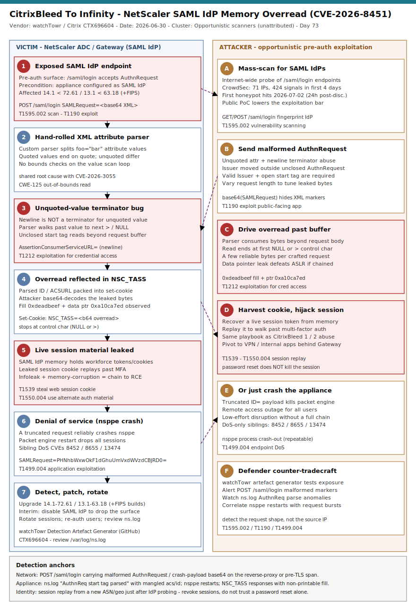

# CitrixBleed To Infinity: NetScaler SAML IdP Pre-Auth Memory Overread (CVE-2026-8451)

## TL;DR

On 2026-06-30 Citrix published CTX696604 and watchTowr released a technical write-up for **CVE-2026-8451** (CVSS 8.8), a pre-authentication memory overread in NetScaler ADC and NetScaler Gateway when the appliance is configured as a **SAML Identity Provider**. A hand-rolled XML attribute parser in the `/saml/login` handler fails to treat a newline as a terminator for an unquoted attribute value, so a malformed `AuthnRequest` walks the parser past the request buffer and reflects adjacent process memory back to the attacker inside the `NSC_TASS` cookie — the CitrixBleed pattern, again. Because a SAML IdP's memory holds live session tokens and cookies for the whole workforce, a leak can enable **session hijack past MFA**; a truncated request also reliably crashes the `nsppe` packet engine for denial of service. watchTowr reported no confirmed in-the-wild breach at disclosure, but CrowdSec observed exploitation attempts against honeypots from 2026-07-02 (71 unique IPs, 424 signals in four days), making this a patch-now edge-appliance exposure — the Thursday supply-chain / edge slot.

## Attribution and confidence

There is **no threat-actor attribution**. This is a coordinated-disclosure vulnerability, not a tracked intrusion. The reporter is **Aliz Hammond of watchTowr Labs**, who found CVE-2026-8451 in late March 2026 while reproducing the earlier CVE-2026-3055 (a related NetScaler SAML IdP overread, CVSS 9.3, same root cause). Citrix credited Hammond alongside Michael Tucker (JPMorgan Chase XOR team) and Maxim Suhanov for the six-CVE bundle. Post-disclosure exploitation attempts are **opportunistic and unattributed** — mass scanning enabled by a public PoC.

| Dimension | Assessment | Confidence |
|---|---|---|
| Vulnerability is real and pre-auth | Confirmed by watchTowr PoC + Citrix advisory | high |
| Configuration precondition (SAML IdP) | Required for exploitation | high |
| In-the-wild exploitation attempts | CrowdSec honeypot signals from 2026-07-02 | high |
| Confirmed breach of a production org | None public at time of writing | low |
| Threat-actor identity | None — opportunistic scanning | n/a |

**Genealogy with previous repo cases.** This extends the repo's memory-disclosure-in-edge-appliance thread: it is a direct sibling of the CitrixBleed class (CVE-2025-5777 "CitrixBleed 2", CVE-2026-3055) and thematically adjacent to the 2026-06-16 Qilin / Check Point IKEv1 edge case and the FortiBleed / appliance-under-siege wave. First repo case anchored on NetScaler, SAML IdP parsing, and CVE-2026-8451 (anti-duplicate check clean: no prior `netscaler|citrix|8451|saml.idp|memory.overread` primary in `days/`).

## Kill chain — summary table

| Stage | MITRE | Detail |
|---|---|---|
| Scan for SAML IdPs | T1595.002 | Internet-wide probing of `/saml/login` and `/saml/metadata` to find NetScalers configured as IdP |
| Send malformed AuthnRequest | T1190 | Base64 `SAMLRequest` with unquoted, newline-terminated attribute + unclosed start tag |
| Trigger the overread | T1212 | Parser reads past the request buffer; bytes reflected in `NSC_TASS` cookie |
| Harvest session material | T1539 | Live session tokens/cookies leaked from IdP process memory |
| Replay stolen session | T1550.004 | Hijack a session past MFA against apps federated to the IdP |
| Or crash the appliance | T1499.004 | Truncated `ID=` AuthnRequest crashes the `nsppe` packet engine (DoS) |



The diagram's left lane is the appliance-internal path (exposed IdP → custom XML parser → terminator bug → `NSC_TASS` reflection → leaked session material → optional crash → remediation); the right lane is the opportunistic attacker (scan → malformed request → overread → session hijack → DoS → defender counter-tradecraft). The detection anchors run along the bottom: `/saml/login` request-shape on the reverse-proxy span, `ns.log` parse anomalies, `nsppe` restarts, and identity-side session replay.

## Stage-by-stage detail

### Stage 1 — Find a NetScaler configured as SAML IdP (T1595.002)

Exploitation only works when the appliance is a **SAML IdP**, so attackers first fingerprint that by hitting the IdP endpoints:

```
POST /saml/login HTTP/1.1
GET  /saml/metadata HTTP/1.1
```

NetScaler is ubiquitous at the enterprise edge (load balancing, SSL offload, VPN gateway), so the exposed population is large. CrowdSec flagged 71 unique source IPs and 424 exploitation signals in the first four days after disclosure, peaking at 127 in a single day. **MITRE T1595.002 — Active Scanning: Vulnerability Scanning.**

### Stage 2 — The hand-rolled XML attribute parser (T1190)

Clients kick off SAML by POSTing a base64 `AuthnRequest` to `/saml/login`. Citrix parses attributes such as `foo="bar"` with custom code rather than a hardened library. watchTowr's decompilation shows the value scanner has **no bounds checks** and handles quoted vs unquoted values differently. This is the same root cause as CVE-2026-3055. **MITRE T1190 — Exploit Public-Facing Application.**

### Stage 3 — Unquoted-value terminator bug drives the overread (T1212)

For a quoted value the parser stops on the closing quote; for an **unquoted** value it only stops on a null byte, a closing `>`, or the matching quote — **a newline is not a terminator**. Feeding an unquoted attribute terminated by a newline, plus an unclosed `AuthnRequest` start tag and a valid `Issuer`, makes the parser read past the intended value and, ultimately, past the end of the request buffer:

```xml
<samlp:AuthnRequest
<saml2:issuer>watchtowr</saml2:issuer>
</samlp:AuthnRequest>
Version="2.0"
id="11"
AssertionConsumerServiceURL=
```

The `ns.log` shows the parser consuming adjacent memory:

```
AuthnReq start tag parsed, id=<>, acs=<...="2.0" id="11"
AssertionConsumerServiceURL="22"...mple.com/demo1/index.php</saml:Issuer>,
forceAuth=<0>, binding=<Unknown>
```

Unlike CVE-2026-3055 (kilobytes leaked), this overread stops at the first control character (NULL or `>`), so it yields a few bytes per crafted request — tuned by varying request length. **MITRE T1212 — Exploitation for Credential Access.**

### Stage 4 — Leaked bytes reflected in NSC_TASS (T1212 → T1539)

The parsed `ID`/`AssertionConsumerServiceURL` values are packed into the `NSC_TASS` set-cookie the IdP returns. The attacker base64-decodes it and reads the overread bytes:

```
Set-Cookie: NSC_TASS=YXNkZgBJRD0m...  ->  decodes to:
00000010  ...41 43 53 55 52 4c 3d f0 0d 90 ef be ad de ...   |ACSURL=........|
```

The `0xdeadbeef` heap-fill pattern and an apparent data pointer (`0xa10ca7ed`) confirm out-of-bounds process memory is leaving the appliance. A valid pointer would upgrade this from information disclosure to an **infoleak primitive** usable in an exploit chain. **MITRE T1539 — Steal Web Session Cookie** (for the workforce session material the IdP memory holds).

### Stage 5 — Session hijack past MFA (T1550.004)

A SAML IdP under constant authentication load holds session tokens and cookies for the whole workforce in memory. Recovering a live one lets an attacker replay it against apps federated to the IdP and **walk past multi-factor authentication** — exactly the CitrixBleed 1/2 abuse pattern. Critically, a password reset does **not** invalidate an existing session; the session must be revoked. **MITRE T1550.004 — Use Alternate Authentication Material: Web Session Cookie.**

### Stage 6 — Denial of service via nsppe crash (T1499.004)

If impact rather than a chain is the goal, a truncated request is enough:

```
SAMLRequest=PHNhbWxwOkF1dGhuUmVxdWVzdCBJRD0%3D   (base64 of "<samlp:AuthnRequest ID=")
```

This crashes the `nsppe` packet-engine process, restarting it and dropping active sessions — a low-effort remote outage. The bundle also contains DoS-only siblings CVE-2026-8452, CVE-2026-8655 and CVE-2026-13474. **MITRE T1499.004 — Endpoint Denial of Service: Application or System Exploitation.**

## Detection strategy

### Telemetry that matters

- **Reverse-proxy / WAF access logs** in front of NetScaler (cleartext view of `/saml/login`, method, body/byte count). NetScaler serves `/saml/login` over TLS, so network detection needs a TLS-terminating span.
- **NetScaler `ns.log`** shipped via syslog: `AuthnReq start tag parsed` lines (parse anomalies) and `nsppe`/`PPE-0`/core-dump/restart events.
- **Sentinel `Syslog`** for the above; **`SigninLogs`** for the identity-side session-replay signal on federated apps.
- **Appliance response** visibility (rare on the wire): `NSC_TASS` set-cookie carrying non-printable fill bytes.

### Detection coverage

| Engine | File | Logic |
|---|---|---|
| Sigma | sigma/netscaler_saml_login_crash_payload.yml | POST `/saml/login` carrying the empty-ID crash base64 fragment (high fidelity, DoS) |
| Sigma | sigma/netscaler_saml_idp_endpoint_probing.yml | External requests to `/saml/login` / `/saml/metadata` (recon lead) |
| Sigma | sigma/netscaler_saml_login_undersized_authnrequest.yml | POST `/saml/login` with an unusually small body (overread-probe heuristic) |
| KQL | kql/netscaler_saml_login_crash_payload.kql | Syslog: `/saml/login` + crash fragment |
| KQL | kql/netscaler_nsppe_crash_after_saml_probe.kql | Join `nsppe` restarts to a preceding `/saml/login` burst |
| KQL | kql/netscaler_saml_authnreq_parse_anomaly.kql | `ns.log` `AuthnReq start tag parsed` with mangled acs/id or `binding=Unknown` |
| KQL | kql/saml_session_replay_new_location.kql | SigninLogs: federated-app session from a new ASN/country in a short window |
| YARA | yara/citrixbleed_infinity_cve_2026_8451.yar | Captured request/PoC/overread artifacts (3 rules) |
| Suricata | suricata/citrixbleed_infinity_cve_2026_8451.rules | `/saml/login` crash payload, undersized body, `NSC_TASS` fill, IdP enumeration (6 sids) |

### Threat hunting hypotheses

- **H1 — `/saml/login` probe burst** ([peak_h1_saml_login_probe_burst.md](./hunts/peak_h1_saml_login_probe_burst.md)): external sources sending crafted/undersized AuthnRequests to the IdP.
- **H2 — nsppe crash + parse anomaly** ([peak_h2_nsppe_crash_and_parse_anomaly.md](./hunts/peak_h2_nsppe_crash_and_parse_anomaly.md)): packet-engine restarts correlated with `/saml/login` activity and mangled `ns.log` parse lines.
- **H3 — session replay after IdP exposure** ([peak_h3_session_replay_after_idp_exposure.md](./hunts/peak_h3_session_replay_after_idp_exposure.md)): stolen session cookie replayed against federated apps from a new source.

## Incident response playbook

### First 60 minutes (triage)

1. Determine whether the appliance is configured as a **SAML IdP** (if not, CVE-2026-8451 is not exploitable — still patch).
2. Confirm firmware: vulnerable if 14.1 < 72.61 or 13.1 < 63.18 (or the FIPS/NDcPP equivalents).
3. Grep centralized `ns.log` for `AuthnReq start tag parsed` anomalies and `nsppe` restarts in the exposure window.
4. Pull `/saml/login` request volume by source IP from the front-proxy logs; look for the crash fragment and undersized bodies.
5. If exploitation is plausible, treat all IdP-issued sessions as suspect and prepare to revoke.

### Artifacts to collect

| Artifact | Path | Tool | Why |
|---|---|---|---|
| Appliance parser log | /var/log/ns.log | scp / syslog | Parse anomalies + nsppe crash evidence |
| Front-proxy access logs | (reverse proxy / WAF) | SIEM export | `/saml/login` request shape, source IPs, byte counts |
| NetScaler config | show ns runningConfig | CLI | Confirm SAML IdP + affected vServers |
| Core dump (if crashed) | /var/core | scp | DoS/exploitation forensics |
| Federated sign-in logs | SigninLogs | Sentinel | Session-replay detection |

### IR queries and commands

```bash
# Confirm SAML IdP configuration and firmware from the NetScaler CLI
show ns version
show authentication samlIdPProfile
```

```powershell
# Pull /saml/login hits from an exported IIS/WAF proxy log (adjust field names)
Select-String -Path .\proxy\*.log -Pattern '/saml/login' |
  Where-Object { $_.Line -match 'PHNhbWxwOkF1dGhuUmVxdWVzdCBJRD0' } |
  Select-Object -First 200
```

```kql
// Parse anomalies in ns.log (see kql/netscaler_saml_authnreq_parse_anomaly.kql)
Syslog
| where TimeGenerated > ago(14d)
| where SyslogMessage has "AuthnReq start tag parsed"
| where SyslogMessage has_any ("binding=<Unknown>", "<saml", "AssertionConsumerServiceURL")
| project TimeGenerated, Computer, SyslogMessage
```

### Containment, eradication, recovery

- **Patch** to 14.1-72.61 / 13.1-63.18 (FIPS 14.1-72.61 FIPS; 13.1-FIPS/NDcPP 13.1-37.272). For CVE-2026-13474 also set `Http2SmallWndTimeout` to 30s if not on an HTTP Strict Profile.
- **Interim:** disable the SAML IdP function to remove the attack surface until you can patch.
- **Revoke sessions** issued by the IdP and force re-authentication. **Do NOT** rely on a password reset — it will not kill an already-stolen session.
- **Exit criteria:** appliance on a fixed build, no new parse anomalies or unexplained `nsppe` restarts, and session/token revocation completed for the exposure window.

### Recovery validation

Re-run the watchTowr Detection Artefact Generator (or your own probe) against the patched appliance and confirm it no longer leaks; verify `ns.log` shows clean `AuthnReq` parsing; confirm no lingering federated-app sessions predate the revocation.

## IOCs

Advisory/PoC-stage case — the anchors below are the CVE identifiers, the pre-auth surface, the base64 crash fragment, and the overread tells; full list in [iocs.csv](./iocs.csv).

| Type | Value | Context | Confidence | Source |
|---|---|---|---|---|
| cve | CVE-2026-8451 | NetScaler SAML IdP memory overread (CVSS 8.8) | high | watchTowr / Citrix |
| path | /saml/login | Pre-auth exploitation endpoint | high | watchTowr |
| string | SAMLRequest= | Carrier of the base64 AuthnRequest | high | watchTowr |
| string | PHNhbWxwOkF1dGhuUmVxdWVzdCBJRD0 | base64 of `<samlp:AuthnRequest ID=` (nsppe crash) | high | watchTowr |
| string | NSC_TASS | Cookie reflecting the overread bytes | high | watchTowr |
| string | AuthnReq start tag parsed | ns.log parse line; mangled acs/id = overread tell | high | watchTowr |
| string | 0xdeadbeef / 0xa10ca7ed | Heap fill + data-pointer leak in PoC output | medium/low | watchTowr |
| url | github.com/watchtowrlabs/watchTowr-vs-Netscaler-CVE-2026-8451 | Public Detection Artefact Generator (PoC) | high | watchTowr |

**CISA KEV.** Per [kev.md](./kev.md), the headline **CVE-2026-8451 is not (yet) on CISA KEV** despite CrowdSec-observed exploitation attempts — a live illustration that KEV absence is not safety. Its close relatives in the same NetScaler overread class already are: **CVE-2026-3055** (added 2026-03-30, remediation due 2026-04-02) and **CVE-2025-5777 / CitrixBleed 2** (added 2025-07-10, remediation due 2025-07-11, known ransomware use). Treat CVE-2026-8451 as patch-now on that pattern; KEV-listed CVEs carry a binding federal deadline (BOD 22-01 / 26-04).

## Secondary findings

- **It is a six-CVE bundle, not one flaw.** CTX696604 also patches CVE-2026-8452, CVE-2026-8655 and CVE-2026-13474 (all DoS), CVE-2026-10816 (unauthenticated arbitrary file read via management-plane path control), and CVE-2026-10817 (TCP-timestamp overread). Patch the appliance, not just the one headline CVE — and note the file-read bug needs no SAML IdP config.
- **Memory management in NetScaler is a recurring structural problem.** watchTowr found CVE-2026-8451 while reproducing CVE-2026-3055, which followed CitrixBleed 2 (CVE-2025-5777) and the original CitrixBleed. Treat "CitrixBleed" as a *class* and assume more instances exist; monitor the SAML IdP surface as a standing risk, not a one-time patch.
- **The DoS is easier than the leak, so expect crashes first.** The single-line `ID=` crash payload is trivial and repeatable, while the overread yields only a few bytes per request. Early exploitation is more likely to look like unexplained `nsppe` restarts than a clean credential theft — instrument for both.

## Pedagogical anchors

- **A bespoke parser on a pre-auth path is a liability.** The whole bug is one missing terminator case (newline for unquoted values) in a hand-rolled XML attribute scanner with no bounds checks. Well-tested libraries exist for exactly this reason.
- **Token theft beats credential theft.** A leaked session cookie replays past MFA and survives a password reset. Defend the session: revoke tokens, not just passwords, and treat a memory-disclosure bug on an IdP as an identity incident.
- **Absence from KEV is not safety.** A newly disclosed, actively-probed edge CVE can precede its KEV listing; drive remediation off exposure and exploitation attempts, not just the catalog.
- **Detect the request shape, not the source IP.** Scanner infrastructure rotates within days; the durable signal is the malformed `/saml/login` request and the `ns.log` parse anomaly.
- **Interim mitigations buy time.** When you cannot patch immediately, disabling the vulnerable feature (here, the SAML IdP role) removes the attack surface — a pattern worth having ready for every edge appliance.

## What's in this folder

| File | Purpose | Link |
|---|---|---|
| README.md | This analysis. | [README.md](./README.md) |
| kill_chain.svg | Two-lane kill chain (template A, edge-network accent). | [kill_chain.svg](./kill_chain.svg) |
| sigma/netscaler_saml_login_crash_payload.yml | Crash-payload detection on `/saml/login`. | [file](./sigma/netscaler_saml_login_crash_payload.yml) |
| sigma/netscaler_saml_idp_endpoint_probing.yml | SAML IdP recon/enumeration. | [file](./sigma/netscaler_saml_idp_endpoint_probing.yml) |
| sigma/netscaler_saml_login_undersized_authnrequest.yml | Undersized-AuthnRequest overread heuristic. | [file](./sigma/netscaler_saml_login_undersized_authnrequest.yml) |
| kql/netscaler_saml_login_crash_payload.kql | Syslog crash-fragment hunt. | [file](./kql/netscaler_saml_login_crash_payload.kql) |
| kql/netscaler_nsppe_crash_after_saml_probe.kql | nsppe restart correlated with probing. | [file](./kql/netscaler_nsppe_crash_after_saml_probe.kql) |
| kql/netscaler_saml_authnreq_parse_anomaly.kql | ns.log parse-anomaly hunt. | [file](./kql/netscaler_saml_authnreq_parse_anomaly.kql) |
| kql/saml_session_replay_new_location.kql | Session-replay on federated apps. | [file](./kql/saml_session_replay_new_location.kql) |
| yara/citrixbleed_infinity_cve_2026_8451.yar | Request/PoC/overread artifact rules (3). | [file](./yara/citrixbleed_infinity_cve_2026_8451.yar) |
| suricata/citrixbleed_infinity_cve_2026_8451.rules | Network detections (6 sids). | [file](./suricata/citrixbleed_infinity_cve_2026_8451.rules) |
| hunts/peak_h1_saml_login_probe_burst.md | PEAK hunt H1. | [file](./hunts/peak_h1_saml_login_probe_burst.md) |
| hunts/peak_h2_nsppe_crash_and_parse_anomaly.md | PEAK hunt H2. | [file](./hunts/peak_h2_nsppe_crash_and_parse_anomaly.md) |
| hunts/peak_h3_session_replay_after_idp_exposure.md | PEAK hunt H3. | [file](./hunts/peak_h3_session_replay_after_idp_exposure.md) |
| iocs.csv | Detection-surface anchors (CVEs, endpoints, payload, tells). | [iocs.csv](./iocs.csv) |
| kev.md | CISA KEV cross-reference for this case's CVEs. | [kev.md](./kev.md) |

## Sources

- [watchTowr Labs — CitrixBleed To Infinity And Beyond (CVE-2026-8451)](https://labs.watchtowr.com/citrixbleed-to-infinity-and-beyond-citrix-netscaler-pre-auth-memory-overread-cve-2026-8451/)
- [Citrix — CTX696604 NetScaler ADC and NetScaler Gateway Security Bulletin](https://support.citrix.com/support-home/kbsearch/article?articleNumber=CTX696604)
- [The Hacker News — Citrix Patches Six NetScaler Flaws Allowing File Read and Denial-of-Service](https://thehackernews.com/2026/07/citrix-patches-six-netscaler-flaws.html)
- [CrowdSec — CVE-2026-8451: Citrix NetScaler SAML Memory Overread Under Active Exploitation](https://www.crowdsec.net/vulntracking-report/cve-2026-8451-citrix-netscaler-saml-memory-overread)
- [CyberScoop — Citrix patches a new NetScaler flaw with echoes of CitrixBleed](https://cyberscoop.com/citrix-netscaler-flaw-cve-2026-8451-citrixbleed/)
- [watchTowr — Detection Artefact Generator (GitHub)](https://github.com/watchtowrlabs/watchTowr-vs-Netscaler-CVE-2026-8451)
