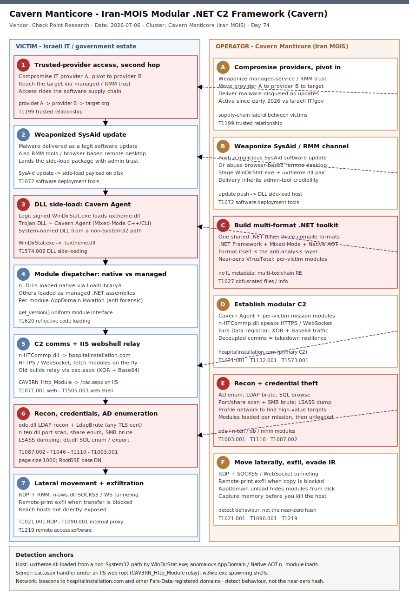

# Cavern Manticore: Iran-MOIS Modular .NET C2 Framework (SysAid Side-Load, Native AOT / Mixed-Mode Anti-RE)

## TL;DR

On 2026-07-06 Check Point Research published an analysis of **Cavern** (aka **Cav3rn**), a previously undocumented modular command-and-control framework used by an Iran-nexus cluster it tracks as **Cavern Manticore**, assessed as Iran's Ministry of Intelligence and Security (MOIS) with tactical overlaps to **MuddyWater** and **Lyceum** (a subgroup within **OilRig**). Active since early 2026 against Israeli IT providers, government and defense, the actor reaches targets by compromising a trusted IT provider, pivoting through a second-hop provider, then weaponizing a **SysAid software-update** to drop a DLL side-loading chain: the legitimate `WinDirStat.exe` loads a trojanized `uxtheme.dll` — the **Cavern Agent** — which pulls a native comms module (`n-HTCommp.dll`) and fetches per-victim post-exploitation modules over HTTPS/WebSocket from `hospitalinstallation[.]com`. The framework's signature trait is a deliberate anti-RE posture: it splits one shared .NET codebase across **three compilation formats** (.NET Framework, Mixed-Mode C++/CLI, and Native AOT), which forces reverse engineers into three different toolchains — the deep-dive angle for the Friday slot. Most samples score zero or near-zero on VirusTotal, so behaviour (DLL side-load, anomalous AppDomain loads, RMM abuse) beats hashes.

## Attribution and confidence

Check Point Research attributes the Cavern framework to **Cavern Manticore**, an **Iran-MOIS** cluster, at **medium** confidence — the assessment rests on tactical and code overlaps with known MOIS-aligned actors and on infrastructure, not on a leaked operator identity. The primary campaign domain, `hospitalinstallation[.]com`, was registered via **Fars Data**, an Iranian hosting provider, and the C2 tradecraft (victim-side proxying, XOR-based obfuscation, fixed per-backdoor HTTP verb set) mirrors **Lyceum**'s historical patterns.

| Vendor / source | Name | Note |
|---|---|---|
| Check Point Research | Cavern Manticore | Iran-MOIS; overlaps MuddyWater + Lyceum; framework named "Cavern" / "Cav3rn" |
| MITRE / community | OilRig (Lyceum subgroup) | Lyceum assessed as an OilRig subgroup; shared TTPs |
| The Hacker News (2026-07-06) | Cavern Manticore | Corroborates MOIS nexus, SysAid side-load, Native AOT modules |
| Infrastructure | Fars Data (registrar) | Iranian hosting provider for the primary C2 domain |

Confidence: **medium** for the Iran-MOIS attribution (tactical overlap + Iranian registrar + Lyceum-style tradecraft); **high** that the Cavern framework and its module set are real and analyzed from samples.

**Genealogy with previous repo cases.** This extends the repo's Iran-MOIS thread — [Black Shadow / Ababil of Minab](../../05/2026-05-31_BlackShadow-AbabilOfMinab-Recovery-Layer-Destruction) (Iran-MOIS recovery-layer destruction, Day 34) and the 2026-06-19 ATG Fuel Monitor Iran-nexus cyber-physical case — and the repo's DLL side-loading thread, most recently the [KongTuke / Mistic](../2026-07-07_KongTuke-Mistic-MTLBackdoor-IAB-ClickFix) side-load (Day 71, signed binary loading a system-named DLL from a non-System32 path). Anti-duplicate check is clean: no prior `cavern|manticore|oilrig|lyceum|cav3rn` primary in `days/` or `byActor/`; the only Iran-MOIS overlaps were tangential mentions in Black Shadow. First repo case anchored on Cavern Manticore, the Cavern/Cav3rn framework, and the OilRig-Lyceum lineage.

## Kill chain — summary table

| Stage | MITRE | Detail |
|---|---|---|
| Compromise a trusted IT provider, pivot second-hop | T1199 | Move from an initial provider through a second provider to reach the target |
| Weaponize a SysAid software update | T1072 | Abuse the SysAid update/RMM channel to deliver the side-load package |
| DLL side-load the Cavern Agent | T1574.002 | Legitimate `WinDirStat.exe` loads trojanized `uxtheme.dll` (Mixed-Mode C++/CLI) |
| Module dispatcher: native vs managed | T1620 | `n-` DLLs via `LoadLibraryA`; managed assemblies via per-module AppDomain isolation |
| C2 over HTTPS/WebSocket + IIS webshell relay | T1071.001, T1505.003 | `n-HTCommp.dll` → `hospitalinstallation[.]com`; `CAV3RN_Http_Module` relays via `cac.aspx` |
| Recon, credential theft, AD enumeration | T1046, T1087.002, T1003.001, T1110 | `n-ten` port/share scan + SMB brute; `ode` LDAP recon + brute; LSASS dumping |
| Lateral movement + exfiltration | T1021.001, T1090.001, T1219 | RDP + SOCKS5/WebSocket tunneling; RMM/browser-RDP; remote-print exfil when transfer blocked |



The left lane is the victim environment: the trusted-provider foothold, the SysAid-delivered side-load, the Cavern Agent and its module dispatcher, then the post-exploitation modules and lateral movement. The right lane is the Cavern Manticore operator building and driving the framework, with the multi-format anti-RE step highlighted. Detection anchors run along the bottom: `WinDirStat.exe` loading `uxtheme.dll` from a non-standard path, anomalous .NET AppDomain / Native-AOT module loads, `cac.aspx` on IIS, and beacons to Fars-Data-registered newly-registered domains.

## Stage-by-stage detail

### Stage 1 — Trusted-relationship access and second-hop pivot (T1199)

Cavern Manticore does not phish the final target directly. Check Point observed the actor moving from an **initial compromised IT provider** to a **second-hop provider** before reaching the intended organization, weaponizing the trust and connectivity that managed-service and RMM relationships carry.

```
IT provider A (compromised)  ->  IT provider B (second hop)  ->  target org
                             via RMM / trusted management channels
```

**MITRE T1199 — Trusted Relationship.**

### Stage 2 — Weaponized SysAid software update (T1072)

At the target, the actor abuses a legitimate management channel — a **SysAid software update** (and, in other intrusions, RMM tools or browser-based remote desktop) — to deliver malware disguised as a legitimate update. This places the side-load package on disk with the credibility of a trusted admin tool.

**MITRE T1072 — Software Deployment Tools.**

### Stage 3 — DLL side-loading the Cavern Agent (T1574.002)

The delivered package pairs a **legitimate, signed `WinDirStat.exe`** with a **trojanized `uxtheme.dll`**. When `WinDirStat.exe` runs, Windows resolves `uxtheme.dll` from the application directory first, loading the attacker DLL — the **Cavern Agent**. The agent itself is a single portable executable that **combines managed .NET with native C++ (Mixed-Mode C++/CLI)**.

```
WinDirStat.exe (legit, signed)
   └─ loads .\uxtheme.dll  (trojanized Cavern Agent, Mixed-Mode C++/CLI)
```

The durable tell is portable and hash-independent: a legitimate signed binary loading a **system-named DLL** (`uxtheme.dll`) from a **non-System32** path. **MITRE T1574.002 — Hijack Execution Flow: DLL Side-Loading.**

### Stage 4 — Unified module dispatcher: native vs managed (T1620)

Embedded in the agent is a dispatcher that classifies each module by name. Modules whose names start with **`n-`** are treated as **native DLLs** and loaded with `LoadLibraryA`; every other module is treated as a **managed .NET assembly** and loaded through **per-module AppDomain isolation**. Every module — regardless of compilation format — honours a uniform interface contract:

```
managed:  get_version(List<string> args)
native:   get_version(wchar_t* args)
```

Per-module AppDomain isolation is an **anti-forensics** measure: unload a module and its assembly leaves the process, so recovering the full toolkit from a single host is infeasible. **MITRE T1620 — Reflective Code Loading.**

### Stage 5 — Three compilation formats as the anti-RE layer (T1027)

The framework's defining trait is that one shared .NET foundation is split across **three compilation targets**:

| Format | Modules | RE friction |
|---|---|---|
| .NET Framework (pure managed) | `mhm.dll`, `db.dll`, `ode.dll` | Standard IL decompilation |
| Mixed-Mode C++/CLI | `uxtheme.dll` (agent) | Managed + native in one PE; IL + native disassembly |
| Native AOT (.NET compiled to native) | `n-HTCommp.dll`, `n-ten.dll`, `n-sws.dll` | No IL metadata; native RE + metadata reconstruction |

As Check Point put it, "the compilation format itself becomes the anti-analysis layer that forces reverse engineers into multiple toolsets and metadata-reconstruction workflows." Most samples score **zero or near-zero on VirusTotal**. **MITRE T1027 — Obfuscated Files or Information.**

### Stage 6 — C2 comms and IIS webshell relay (T1071.001, T1505.003, T1132.001, T1573.001)

The agent loads the native comms module `n-HTCommp.dll`, which reaches the C2 (`hospitalinstallation[.]com`) over **HTTPS or WebSocket** and fetches additional modules on the fly. Older builds used a `CAV3RN_Http_Module` that communicated through a **webshell-style ASP.NET handler (`cac.aspx`)** hosted on a separate IIS server. Traffic blends in via **XOR obfuscation, Base64 encoding, and a fixed HTTP verb set per backdoor**.

```
n-HTCommp.dll  --HTTPS/WSS-->  hospitalinstallation[.]com   (fetch modules)
CAV3RN_Http_Module  -->  https://<iis-host>/cac.aspx        (webshell relay, XOR+Base64)
```

**MITRE T1071.001 — Application Layer Protocol: Web Protocols**; **T1505.003 — Server Software Component: Web Shell**; **T1132.001 — Standard Encoding**; **T1573.001 — Symmetric Cryptography** (XOR).

### Stage 7 — Recon, credential theft and lateral movement (T1046, T1087.002, T1110, T1003.001, T1021.001, T1090.001)

Per-victim modules deliver the mission:

- **`mhm.dll`** — file operations, recursive search, archive handling, bidirectional transfer (T1005, T1560).
- **`db.dll`** — SQL database enumeration, query, export.
- **`ode.dll`** — Active Directory recon and **LDAP brute-force** (`LdapBrute`): reads the LDAP server and base DN from `LDAP://RootDSE` when not supplied, paged searches (page size 1,000), and **always accepts TLS certificates without validation** (T1087.002, T1110).
- **`n-ten.dll`** — network recon, **port scanning**, share enumeration, **SMB brute-force** (T1046, T1110).
- **`n-sws.dll`** — **SOCKS5 proxy and WebSocket tunneling** to reach hosts not directly exposed (T1090.001).

Credentials are harvested via **LSASS dumping** (T1003.001). Lateral movement rides RDP and RMM channels; where clipboard or file-transfer paths are restricted, the actor abuses **remote printing** to exfiltrate data. **MITRE T1021.001 — Remote Desktop Protocol**; **T1219 — Remote Access Software.**

## RE notes

| Component | SHA256 | Lang / format | Role | Notes |
|---|---|---|---|---|
| uxtheme.dll (build 02) | 37e123bd7998af4eae32718ce254776f36365a80ba56952593dab46f536d4066 | Mixed-Mode C++/CLI | Cavern Agent | Side-loaded by `WinDirStat.exe`; module dispatcher |
| uxtheme.dll (build 04) | 92cae0ad7f98f51a14bcc0ee05e372ebdc29ea96ea7bd161bd3f55198767603b | Mixed-Mode C++/CLI | Cavern Agent | Newer build |
| n-HTCommp.dll | a4aa217def4c38f4ecacdf47b1cd687f60cc74c18ab75195be3c4357a790bf41 | Native AOT | Comms module | HTTPS/WebSocket C2 |
| mhm.dll | 8e9425c0b46eeb516610ae913d13f2b3f44a023043cb099277031d4ec38a6134 | .NET Framework | File manager | Recursive search + archive + transfer |
| db.dll | 5394d3b220de4695f731647e3a70545f951a8912ceb0c6585efab8d6842e8b42 | .NET Framework | SQL browser | DB enum / query / export |
| ode.dll | 30cb4679c4b8599eeb3d63a551716475c6332bdc4d4b4e3de0964aadb3092a10 | .NET Framework | LDAP / AD | `LdapBrute`, accepts any TLS cert |
| n-ten.dll | 2cb1ad3b22db8e3666ea138fee88034a87a87cf43db3d3265a675ebf221379b0 | Native AOT | Network recon | Port scan + SMB brute |
| n-sws.dll | 7d586fb7f94182a8e2a0e53c7e4deb898066da029da5cd9972a94a59ca6d255a | Native AOT | Tunnel | SOCKS5 + WebSocket |

Anti-analysis posture: uncommon .NET compilation formats (Mixed-Mode C++/CLI, Native AOT) that deny IL metadata and force native RE + metadata reconstruction, plus per-module AppDomain isolation as an anti-forensics measure. Uniform module interface (`get_version`) and the `n-` naming convention are the reliable structural tells; full hash set (14 SHA256, incl. older `Cav3rn` builds and the `CAV3RN_Http_Module`) is in [iocs.csv](./iocs.csv).

## Detection strategy

### Telemetry that matters

- **Sysmon EID 7 (Image Load)** and **Defender `DeviceImageLoadEvents`**: `uxtheme.dll` (and other system-named DLLs) loaded from a non-System32/WinSxS path — the side-load tell.
- **Sysmon EID 1 / `DeviceProcessEvents`**: `WinDirStat.exe` executing from a non-standard directory, or spawned by a SysAid/RMM process.
- **`.NET` / CLR telemetry**: anomalous **AppDomain** creation and assembly loads in non-development processes; Native-AOT DLLs loaded via `LoadLibraryA` by a mixed-mode host.
- **IIS logs + `DeviceFileEvents`**: creation of / requests to `cac.aspx` under `wwwroot`; `w3wp.exe` spawning shells.
- **`DeviceNetworkEvents` / DNS / proxy**: beacons to `hospitalinstallation[.]com` and other Fars-Data-registered newly-registered domains; WebSocket upgrades to unusual hosts.

### Detection coverage

| Engine | File | Logic |
|---|---|---|
| Sigma | sigma/cavern_uxtheme_sideload.yml | Image load of `uxtheme.dll` from a non-System32 path (side-load) |
| Sigma | sigma/cavern_windirstat_sideload_host.yml | `WinDirStat.exe` running from a non-standard directory / RMM-spawned |
| Sigma | sigma/cavern_iis_aspx_webshell_drop.yml | Creation of `cac.aspx` (Cavern relay handler) under an IIS web root |
| KQL | kql/cavern_uxtheme_sideload.kql | `DeviceImageLoadEvents`: `uxtheme.dll` from non-System32 folder |
| KQL | kql/cavern_windirstat_sideload_host.kql | `DeviceProcessEvents`: `WinDirStat.exe` from unusual path or RMM parent |
| KQL | kql/cavern_c2_beacon.kql | `DeviceNetworkEvents`: connections to the Cavern C2 domain set |
| KQL | kql/cavern_iis_aspx_webshell.kql | `DeviceFileEvents`: `cac.aspx` written under `inetpub`/`wwwroot` |
| YARA | yara/cavern_manticore.yar | Cavern agent / module / webshell string anchors (3 rules) |
| Suricata | suricata/cavern_manticore.rules | C2 DNS + TLS SNI, `cac.aspx` relay, base64 body heuristic (5 sids) |

### Threat hunting hypotheses

- **H1 — DLL side-load of a system-named DLL** ([peak_h1_dll_sideload_uxtheme.md](./hunts/peak_h1_dll_sideload_uxtheme.md)): a signed binary (`WinDirStat.exe`) loading `uxtheme.dll` from a non-standard path.
- **H2 — anomalous .NET module loading** ([peak_h2_dotnet_appdomain_native_module.md](./hunts/peak_h2_dotnet_appdomain_native_module.md)): unexpected AppDomain loads / Native-AOT `n-` DLLs via `LoadLibraryA` in non-dev contexts.
- **H3 — C2 + webshell relay + second-hop lateral** ([peak_h3_c2_beacon_webshell_relay.md](./hunts/peak_h3_c2_beacon_webshell_relay.md)): beacons to Fars-Data NRDs, `cac.aspx` on IIS, and lateral movement from a managed-service provider.

## Incident response playbook

### First 60 minutes (triage)

1. Confirm the side-load: look for `WinDirStat.exe` running from a temp/update/staging directory with a co-located `uxtheme.dll`.
2. Capture volatile memory of the hosting process **before** killing it — modules live in-process behind AppDomain isolation and vanish on unload.
3. Pull DNS/proxy for `hospitalinstallation[.]com` and other recently-registered domains on Iranian registrars (Fars Data).
4. Search IIS web roots for `cac.aspx` and review `w3wp.exe` child processes.
5. Scope the trusted-relationship path: which IT provider / RMM tool has access, and whether a SysAid update was pushed recently.

### Artifacts to collect

| Artifact | Path | Tool | Why |
|---|---|---|---|
| Side-load pair | `<staging>\WinDirStat.exe` + `.\uxtheme.dll` | EDR / triage | Confirms the loader chain and yields agent hash |
| Process memory | hosting process (mixed-mode) | procdump / WinPMEM | Recovers modules held behind AppDomain isolation |
| IIS handler | `%SystemDrive%\inetpub\wwwroot\...\cac.aspx` | file copy | Webshell relay evidence |
| DNS / proxy logs | resolver / proxy | SIEM export | C2 domain contacts, NRD beaconing |
| SysAid / RMM logs | vendor console | export | Establish the delivery channel and blast radius |
| LSASS access events | Sysmon EID 10 / Defender | EDR | Credential-theft confirmation |

### IR queries and commands

```powershell
# Find WinDirStat.exe running from a non-standard directory with a co-located uxtheme.dll
Get-CimInstance Win32_Process -Filter "Name='WinDirStat.exe'" |
  Where-Object { $_.ExecutablePath -notlike 'C:\Program Files*' } |
  ForEach-Object {
    $dir = Split-Path $_.ExecutablePath
    [pscustomobject]@{ PID=$_.ProcessId; Path=$_.ExecutablePath;
      SideloadDLL = (Test-Path (Join-Path $dir 'uxtheme.dll')) }
  }
```

```bash
# Hunt IIS web roots for the Cavern relay handler
grep -RilE 'cac\.aspx|CAV3RN_Http_Module' /inetpub/wwwroot 2>/dev/null
```

```kql
// Beacons to the Cavern C2 domain set (see kql/cavern_c2_beacon.kql)
DeviceNetworkEvents
| where Timestamp > ago(14d)
| where RemoteUrl has "hospitalinstallation.com" or RemoteUrl endswith ".hospitalinstallation.com"
| project Timestamp, DeviceName, InitiatingProcessFileName, RemoteUrl, RemoteIP
```

### Containment, eradication, recovery

- **Isolate** hosts with the confirmed side-load only after memory capture. Revoke the trusted-provider/RMM access path used for delivery.
- **Remove** the side-load pair and any `cac.aspx` relay; rebuild IIS hosts that served the webshell.
- **Rotate** credentials exposed to LSASS dumping and any service/domain accounts reachable from the compromised hosts; assume AD recon succeeded.
- **What NOT to do:** do not kill the mixed-mode host process before dumping memory (you lose the module set), and do not scope by hash alone (samples are near-zero-detection and per-victim).
- **Exit criteria:** no residual side-load pairs or `cac.aspx`, no beacons to the C2 domain set, provider access re-established under least privilege, credentials rotated for the exposure window.

### Recovery validation

Confirm `uxtheme.dll` resolves only from System32 on affected hosts; verify no `WinDirStat.exe` executes from staging paths; validate DNS/proxy show no contact with the C2 domain set; review SysAid/RMM change logs for unauthorized update pushes.

## IOCs

Recently-published campaign (Check Point, 2026-07-06). The hard indicators are the 14 module SHA256 hashes and the C2 domain; note that samples are per-victim and near-zero-detection, so prioritise behaviour. Full list in [iocs.csv](./iocs.csv).

| Type | Value | Context | Confidence | Source |
|---|---|---|---|---|
| sha256 | 37e123bd7998af4eae32718ce254776f36365a80ba56952593dab46f536d4066 | uxtheme.dll — Cavern Agent (build 02) | high | Check Point |
| sha256 | 92cae0ad7f98f51a14bcc0ee05e372ebdc29ea96ea7bd161bd3f55198767603b | uxtheme.dll — Cavern Agent (build 04) | high | Check Point |
| sha256 | a4aa217def4c38f4ecacdf47b1cd687f60cc74c18ab75195be3c4357a790bf41 | n-HTCommp.dll — comms module | high | Check Point |
| sha256 | 30cb4679c4b8599eeb3d63a551716475c6332bdc4d4b4e3de0964aadb3092a10 | ode.dll — LDAP / AD module | high | Check Point |
| sha256 | 7d586fb7f94182a8e2a0e53c7e4deb898066da029da5cd9972a94a59ca6d255a | n-sws.dll — SOCKS5 / WebSocket tunnel | high | Check Point |
| domain | hospitalinstallation[.]com | Primary Cavern C2 (registrar Fars Data, Iran) | high | Check Point / gbhackers |
| string | cac.aspx | IIS webshell relay handler (CAV3RN_Http_Module) | high | Check Point / gbhackers |
| path | uxtheme.dll | System-named DLL side-loaded from a non-System32 path | high | Check Point |
| string | WinDirStat.exe | Legitimate signed side-load host | high | Check Point / gbhackers |
| string | CAV3RN_Http_Module | Older Cavern HTTP module class name | medium | Check Point / gbhackers |
| note | Native AOT `n-` module naming | Dispatcher treats `n-` DLLs as native (LoadLibraryA) | medium | Check Point |

No CVE is associated with this case — Cavern Manticore abuses trusted relationships, a SysAid update channel and DLL side-loading rather than a software vulnerability, so no `kev.md` / CISA KEV cross-reference applies.

## Secondary findings

- **The compilation format is the obfuscation.** Rather than a packer, Cavern uses three .NET build formats (Framework, Mixed-Mode C++/CLI, Native AOT) so a single toolchain never sees the whole framework. Detection and RE must be behaviour- and structure-led (module naming, dispatcher interface, AppDomain isolation), because per-victim compilation defeats hash- and signature-based coverage.
- **Trusted-relationship access is the real initial vector.** The framework matters less than how it arrives: a compromised IT provider, a second-hop provider, and a weaponized SysAid update. RMM and managed-service trust is the attack surface — inventory who can push software into your estate and monitor those channels as privileged.
- **Iran-MOIS tempo tracks the geopolitics.** Cavern Manticore's Israeli IT/government/defense targeting overlaps ongoing Israel-US operations, and parallel MOIS-linked MuddyWater activity has been exploiting internet-exposed CVEs (SmarterMail, n8n, N-central, Langflow, Laravel Livewire) for broad reconnaissance — the same nexus operating both bespoke frameworks and mass CVE scanning.

## Pedagogical anchors

- **Detect the side-load shape, not the hash.** A signed binary (`WinDirStat.exe`) loading a system-named DLL (`uxtheme.dll`) from a non-System32 path is a portable, hash-independent tell for the entire side-load class — the same lesson the KongTuke/Mistic case taught with `version.dll`.
- **Capture memory before you kill.** Per-module AppDomain isolation means modules leave no complete on-disk copy; a live memory image is often the only way to recover the full toolkit. Sequence IR as capture-then-contain for in-memory modular frameworks.
- **Unusual compilation is an anti-RE decision, not an accident.** Native AOT strips IL metadata and Mixed-Mode C++/CLI mixes managed and native in one PE; when you see them together in one toolset, expect deliberate RE friction and budget for native disassembly plus metadata reconstruction.
- **Trusted relationships are privileged access.** Treat IT-provider, RMM and software-update channels as tier-0 paths: inventory them, least-privilege them, and alert on software delivered through them out of band.
- **Near-zero VirusTotal detection is expected, not reassuring.** Per-victim, multi-format .NET modules will score clean on public scanners; drive response off behaviour and infrastructure, and never read a low VT score as safety.

## What's in this folder

| File | Purpose | Link |
|---|---|---|
| README.md | This analysis. | [README.md](./README.md) |
| kill_chain.svg | Two-lane kill chain (template A, malware-re accent). | [kill_chain.svg](./kill_chain.svg) |
| sigma/cavern_uxtheme_sideload.yml | Side-load image-load detection for `uxtheme.dll`. | [file](./sigma/cavern_uxtheme_sideload.yml) |
| sigma/cavern_windirstat_sideload_host.yml | `WinDirStat.exe` from a non-standard path. | [file](./sigma/cavern_windirstat_sideload_host.yml) |
| sigma/cavern_iis_aspx_webshell_drop.yml | `cac.aspx` relay handler creation. | [file](./sigma/cavern_iis_aspx_webshell_drop.yml) |
| kql/cavern_uxtheme_sideload.kql | Image-load side-load hunt. | [file](./kql/cavern_uxtheme_sideload.kql) |
| kql/cavern_windirstat_sideload_host.kql | Loader-host process hunt. | [file](./kql/cavern_windirstat_sideload_host.kql) |
| kql/cavern_c2_beacon.kql | C2 domain-set beacon hunt. | [file](./kql/cavern_c2_beacon.kql) |
| kql/cavern_iis_aspx_webshell.kql | `cac.aspx` file-creation hunt. | [file](./kql/cavern_iis_aspx_webshell.kql) |
| yara/cavern_manticore.yar | Agent / module / webshell string anchors (3 rules). | [file](./yara/cavern_manticore.yar) |
| suricata/cavern_manticore.rules | Network detections (5 sids). | [file](./suricata/cavern_manticore.rules) |
| hunts/peak_h1_dll_sideload_uxtheme.md | PEAK hunt H1. | [file](./hunts/peak_h1_dll_sideload_uxtheme.md) |
| hunts/peak_h2_dotnet_appdomain_native_module.md | PEAK hunt H2. | [file](./hunts/peak_h2_dotnet_appdomain_native_module.md) |
| hunts/peak_h3_c2_beacon_webshell_relay.md | PEAK hunt H3. | [file](./hunts/peak_h3_c2_beacon_webshell_relay.md) |
| iocs.csv | Hashes, C2 domain, side-load + framework anchors. | [iocs.csv](./iocs.csv) |

## Sources

- [Check Point Research — Cavern Manticore: Exposing Iran-Linked Modular C2 Framework](https://research.checkpoint.com/2026/cavern-manticore-exposing-iran-linked-modular-c2-framework/)
- [The Hacker News — Iran-Linked Hackers Use New Cavern C2 Framework to Target Israeli Organizations](https://thehackernews.com/2026/07/iran-linked-hackers-use-new-cavern-c2.html)
- [GBHackers — Cavern Manticore Malware Uses Low-Detection .NET Modules for Reconnaissance and Lateral Movement](https://gbhackers.com/cavern-manticore-malware/)
- [SecurityWeek — Iran-Linked Hackers Using Modular C&C Framework in Cyberattacks](https://www.securityweek.com/iran-linked-hackers-using-modular-cc-framework-in-cyberattacks/)
- [Infosecurity Magazine — New Iran-Nexus Hacking Group Targets Israel Government and IT Sectors](https://www.infosecurity-magazine.com/news/new-iran-hacking-group-targets/)
- [MITRE ATT&CK — T1574.002 DLL Side-Loading](https://attack.mitre.org/techniques/T1574/002/)
- [MITRE ATT&CK — T1199 Trusted Relationship](https://attack.mitre.org/techniques/T1199/)
