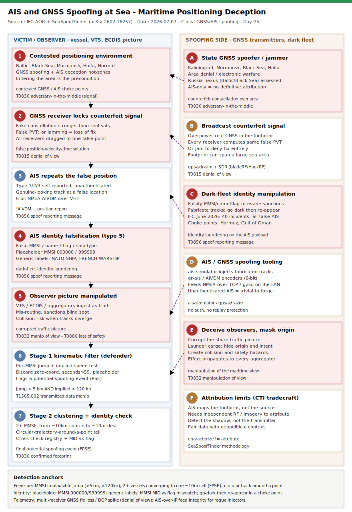

# AIS & GNSS Spoofing at Sea: Maritime Positioning Deception (IFC June-2026 Surge + SeaSpoofFinder)

## TL;DR

Maritime positioning is under sustained attack on two layers at once, and July 2026 gave defenders both a fresh incident count and a concrete detection method. On the **RF layer**, GNSS spoofing broadcasts a counterfeit satellite constellation so that every receiver in the footprint computes a false position; the academic tool **SeaSpoofFinder** (arXiv 2602.16257) shows this can be inferred at scale from public AIS streams, mapping recurrent spoofing footprints over the Baltic (Kaliningrad, St. Petersburg), Murmansk, the Black Sea and the eastern Mediterranean / Haifa. On the **data layer**, vessels deliberately falsify their AIS identity — name, MMSI, flag, ship type — to launder sanctioned cargo and deceive observers: the **Information Fusion Centre (IFC)** reported **40 cyber-security incidents in June 2026, every one a vessel transmitting false AIS information** (published 2026-07-07). AIS has no authentication or replay protection by design, so both attacks succeed against a protocol that trusts whatever it receives. This is the repo's first case in the aviation/maritime (#34) slot; the detection angle is kinematic and cross-check analytics over the AIS feed, not host telemetry.

## Attribution and confidence

This is a **class of activity**, not a single named actor, so attribution is **low** and split by threat mode. **GNSS spoofing** footprints over the Baltic, Black Sea and Murmansk are widely assessed as **Russia-nexus** area-denial/electronic-warfare activity (Lithuanian officials attributed expanded Baltic spoofing to Kaliningrad in May 2026; independent field observations corroborate the Kaliningrad area), while the Haifa / eastern-Mediterranean footprint tracks the Israel-nexus conflict environment. **AIS identity spoofing** is dominated by **sanctions-evasion "dark fleet"** operators and is opportunistic and global. SeaSpoofFinder's authors — including a European Commission GNSS specialist — are explicit that **AIS-only evidence characterises but does not attribute**: it reveals spatial/temporal signatures, not a source transmitter.

| Vendor / source | Scope | Note |
|---|---|---|
| IFC (Information Fusion Centre) | AIS identity deception | 40 CYBSEC incidents June 2026, all false AIS; AOR includes major choke points |
| SeaSpoofFinder (arXiv 2602.16257) | GNSS spoofing via AIS | Two-stage kinematic + clustering detection; footprints Baltic / Black Sea / Murmansk / Haifa |
| EASA / EUROCONTROL | Aviation GNSS interference | March 2026 action plan; ADS-B is the aviation analogue of this AIS method |
| Lithuanian government (open) | Baltic GNSS spoofing | Attributed expanded spoofing to Kaliningrad, May 2026 |

Confidence: **high** that the activity and its signatures are real and measurable; **low** on precise source attribution from AIS alone.

**Genealogy with previous repo cases.** This opens the maritime/aviation vertical and extends the repo's cyber-physical / OT thread: the [ATG Fuel Monitor Iran-nexus cyber-physical case](../../06/2026-06-19_ATGFuelMonitor-IranNexus-CyberPhysical) (manipulation of a physical-world sensor reading), the [Lantronix EDS5000 OT-bridge case](../../06/2026-06-27_Lantronix-EDS5000-BRIDGEBREAK-CVE-2025-67038-OT-Bridge) (the serial-to-IP bridge that carries NMEA-class traffic), and the [Mexico water AI-assisted OT case](../../05/2026-05-10_Mexico-Water-AI-Assisted-OT). Anti-duplicate check is clean: no prior `ais|gnss|spoof|maritime|vessel|ads-b|navigation` primary in `days/` or `byActor/` — only tangential OT mentions. First repo case anchored on maritime positioning deception.

## Kill chain — summary table

| Stage | MITRE | Detail |
|---|---|---|
| Vessel enters a contested positioning environment | T0830 | GNSS-spoofed or AIS-deception hot-zone (Baltic, Black Sea, Hormuz, eastern Med) |
| GNSS receiver locks onto a counterfeit signal | T0830, T0815 | False PVT solution; loss of trustworthy position (denial of true view) |
| AIS broadcasts the false position (type 1/2/3) | T0856 | Self-reported, unauthenticated position report carries the spoofed fix |
| AIS identity falsification (type 5) | T0856 | False MMSI / name / flag / type, or a fabricated track (dark-fleet deception) |
| Observer / VTS / ECDIS ingests false data | T0832 | Manipulation of the traffic picture; collision and mis-routing risk (loss of safety) |
| Stage-1 kinematic filter | T1565.002 | Per-MMSI implausible jump + implied-speed test flags a potential spoofing event |
| Stage-2 clustering + identity cross-check | T0830 | Multi-vessel convergence + registry/MID checks yield a final spoofing event |



The left lane is the affected vessel and the shore-side observer: a ship enters a contested area, its GNSS receiver is captured, its AIS repeats the false position, and (separately) an operator falsifies AIS identity, until the shore observer's picture is manipulated. The right lane is the spoofing side — state GNSS transmitters, dark-fleet identity manipulation, and the SDR/AIS tooling that produces it. Detection anchors run along the bottom: implausible per-MMSI jumps, multi-vessel convergence to one point, placeholder MMSIs and generic labels, and GNSS fix-degradation telemetry.

## Stage-by-stage detail

### Stage 1 — Contested positioning environment (T0830)

GNSS spoofing and AIS deception concentrate in identifiable areas. SeaSpoofFinder's final potential spoofing events (FPSEs) recur over the **Baltic (Kaliningrad, St. Petersburg), Murmansk, Moscow, the Black Sea and the eastern Mediterranean / Haifa**; AIS identity deception concentrates in sanctions choke points — the **Strait of Hormuz, Gulf of Oman, Black Sea, South China Sea**. Entering these areas is the precondition for the rest of the chain. **MITRE ICS T0830 — Adversary-in-the-Middle** (the spoofer interposes on the positioning signal).

### Stage 2 — GNSS receiver captured (T0830, T0815)

A spoofer transmits a counterfeit GNSS constellation stronger than the real satellites; the victim receiver locks onto it and computes a false position-velocity-time (PVT) solution. Because every receiver in the footprint sees the same counterfeit signal, affected vessels are dragged toward the **same** false position — the property SeaSpoofFinder exploits. Where the spoofer only jams, the receiver loses fix entirely (denial of true position). **MITRE ICS T0815 — Denial of View.**

### Stage 3 — AIS repeats the false position (T0856)

AIS position reports (message types 1/2/3) are **self-reported and unauthenticated**: the transponder simply broadcasts whatever position its GNSS feeds it. A spoofed receiver therefore emits a genuine-looking AIS track at a false location. On the wire this is 6-bit ASCII-armored NMEA:

```
!AIVDM,1,1,,A,13aEOK?P00PD2wVMdLDRhgvL289?,0*26   (type 1 position report)
```

**MITRE ICS T0856 — Spoof Reporting Message.**

### Stage 4 — AIS identity falsification (T0856)

Independently of GNSS, an operator can lie in the AIS **static/voyage** record (type 5): a false MMSI, a stolen or fabricated vessel name, a wrong flag or ship type, or an entirely invented track. This is the dark-fleet technique behind the IFC's 40 June-2026 incidents. Tells include MMSIs ending `000000`/`999999`, generic labels such as `NATO SHIP` / `FRENCH WARSHIP`, and a flag that disagrees with the MMSI's Maritime Identification Digits (MID).

```
type 5 static: MMSI=538000000  NAME="NATO SHIP"  FLAG=US  ->  placeholder MMSI + generic label
```

**MITRE ICS T0856 — Spoof Reporting Message** (identity variant).

### Stage 5 — Observer's picture is manipulated (T0832, T0880)

The shore-side VTS, a nearby ship's ECDIS, and every AIS aggregator ingest the false data as truth, corrupting the traffic picture. Consequences range from mis-routing and sanctions blind-spots to **collision risk** where two vessels' displayed positions no longer match reality. **MITRE ICS T0832 — Manipulation of View**; **T0880 — Loss of Safety.**

### Stage 6 — Stage-1 kinematic filter (T1565.002)

The defender inverts the attack: an unauthenticated feed that carries the spoofed position also carries the evidence. Per MMSI, compute the great-circle jump between consecutive fixes and the implied speed; a jump beyond a physical ceiling is a **potential spoofing event (PSE)**. Conservative data-quality filters (zero coordinates, seconds > 59, placeholder MMSIs, axis-aligned bit-error jumps) run first. **MITRE T1565.002 — Transmitted Data Manipulation** (illustrative enterprise mapping).

### Stage 7 — Stage-2 clustering and identity cross-check (T0830)

Single-vessel jumps are noisy; the confirming signal is **spatial**. When **two or more MMSIs jump from a common ~10 km source area to a near-identical ~10 m destination** within a short window, the multi-receiver footprint is a **final potential spoofing event (FPSE)** — hard to explain by anything but a shared spoofing source. In parallel, static records are cross-checked against a registry and the MID-flag table to surface identity spoofing. **MITRE ICS T0830 — Adversary-in-the-Middle** (confirmed footprint).

## Detection strategy

> **Mapping note.** Enterprise ATT&CK does not natively model RF GNSS or VHF AIS spoofing; the **ICS ATT&CK** techniques (T0856, T0830, T0832, T0815, T0880) are the primary mapping, and the enterprise IDs (T1565.002, T1557) are illustrative. All detection here runs on the **AIS feed and positioning telemetry**, not host EDR — the pipeline is: VHF/satellite AIS receiver -> NMEA (AIVDM) decoder (e.g. `pyais`) -> per-MMSI enrichment (jump distance, implied speed, MID-flag check) -> SIEM.

### Telemetry that matters

- **Decoded AIS position feed** (types 1/2/3): MMSI, UTC time, lat/lon, seconds field — the raw material for kinematic analysis (`AisPosition_CL`).
- **Decoded AIS static feed** (type 5): MMSI, name, flag, callsign, ship type — the identity-spoofing surface (`AisStatic_CL`).
- **GNSS receiver / ECDIS / bridge-gateway syslog**: fix-loss events, HDOP/PDOP spikes, position-source-degraded messages — the jamming / denial-of-view signal.
- **AIS-over-IP transport** (NMEA-0183 over TCP 10110, gpsd 2947, aggregator JSON): feed-integrity monitoring for rogue injectors on the LAN.
- **Vessel registry + MID country table**: ground truth for identity cross-check.

### Detection coverage

| Engine | File | Logic |
|---|---|---|
| Sigma | sigma/ais_position_kinematic_jump.yml | Per-MMSI position jump + implied-speed over threshold (Stage-1 PSE) |
| Sigma | sigma/ais_placeholder_mmsi_generic_label.yml | Placeholder MMSI (`000000`/`999999`) or generic vessel label |
| Sigma | sigma/ais_static_identity_mismatch.yml | MID-flag mismatch or spoof-cluster membership (enriched) |
| KQL | kql/ais_kinematic_jump.kql | Consecutive-fix haversine jump + implied knots over `AisPosition_CL` |
| KQL | kql/ais_spoof_cluster_convergence.kql | Two-plus MMSIs converging to a ~10 m cell (Stage-2 FPSE) |
| KQL | kql/ais_identity_spoof_static.kql | Placeholder MMSI / generic name / flag mismatch over `AisStatic_CL` |
| KQL | kql/ais_gnss_fix_degradation.kql | Multi-receiver GNSS fix loss / DOP spike over `Syslog` (denial of view) |
| YARA | yara/ais_gnss_spoofing_tooling.yar | AIS/GNSS spoofing tooling + spoofed-capture identity tells (3 rules) |
| Suricata | suricata/ais_gnss_spoofing.rules | AIS-over-IP feed integrity + decoded-feed identity tells (5 sids) |

### Threat hunting hypotheses

- **H1 — kinematic implausible jump** ([peak_h1_ais_kinematic_jump.md](./hunts/peak_h1_ais_kinematic_jump.md)): per-MMSI jump + implied speed beyond a physical ceiling, with SeaSpoofFinder's data-quality filters.
- **H2 — multi-vessel spoof-cluster convergence** ([peak_h2_spoof_cluster_convergence.md](./hunts/peak_h2_spoof_cluster_convergence.md)): two-plus vessels from a common source to one destination cell, plus the circular-trajectory test.
- **H3 — AIS identity spoofing / dark fleet** ([peak_h3_ais_identity_darkfleet.md](./hunts/peak_h3_ais_identity_darkfleet.md)): placeholder/generic identity, MID-flag mismatch, identity churn and go-dark/re-appear in choke points.

## Incident response playbook

### First 60 minutes (triage)

1. Confirm scope: is this a **GNSS** event (multiple receivers, position jumps, DOP spikes across an area) or an **identity** event (one transponder's static data is false)? The response differs.
2. For a GNSS event, cross-check the AIS-derived FPSE footprint against independent sensors — radar, LRIT, satellite imagery — to confirm the true position.
3. Switch affected own-ship units to **inertial / radar / celestial** navigation fallback; do not steer on GNSS position.
4. Issue a navigation-safety advisory for the affected area and window.
5. For an identity event, pull the suspect MMSI's history (name/flag/track changes) and enrich against the vessel registry.

### Artifacts to collect

| Artifact | Path / source | Tool | Why |
|---|---|---|---|
| Raw AIS capture | AIS receiver / aggregator feed | `pyais` / logger | Decodable evidence of the spoofed track |
| Stage-1 PSE set | `AisPosition_CL` / dataframe | H1 hunt | Per-MMSI jump records for clustering |
| GNSS receiver log | ECDIS / GNSS unit / bridge gateway | syslog export | Fix loss, DOP spikes (denial-of-view proof) |
| Static/voyage records | `AisStatic_CL` | SIEM export | Identity-spoofing evidence (name/flag/MMSI) |
| Registry match | vessel registry + MID table | enrichment | Ground truth for flag/identity cross-check |

### IR queries and commands

```bash
# Decode a raw AIS capture and list per-MMSI position jumps (Python + pyais)
python3 - <<'PY'
from pyais import decode
# feed each !AIVDM line; compute great-circle jump vs the vessel's previous fix,
# discard zero coords / seconds>59 / placeholder MMSIs, flag jumps > 5 km with > 120 kn implied speed
PY
```

```bash
# Grep a decoded/JSON AIS feed capture for identity-spoofing tells
grep -aiE 'NATO SHIP|FRENCH WARSHIP|"?MMSI"?[:=]"?(0{9}|9{9})' ais_feed.jsonl
```

```kql
// Multi-receiver GNSS fix degradation in the last 24h (see kql/ais_gnss_fix_degradation.kql)
Syslog
| where TimeGenerated > ago(24h)
| where SyslogMessage has_any ("GPS fix lost", "position source degraded", "PDOP")
| summarize receivers = dcount(HostName) by bin(TimeGenerated, 10m)
| where receivers >= 2
```

### Containment, eradication, recovery

- **Containment is navigational, not host-based:** stop trusting GNSS position in the affected area; fall back to inertial/radar/visual; hold or re-route as safety requires.
- **Eradication** of the RF source is out of the operator's hands (it is off-ship); the defensive win is **not steering on false data** and rapidly characterising the footprint.
- **For identity spoofing:** flag and share the suspect MMSI; do not accept a port call or cargo manifest on AIS identity alone.
- **What NOT to do:** do not treat a clean GNSS fix as proof of safety inside a known footprint (spoofers produce clean-looking fixes), and do not attribute a source from AIS alone.
- **Exit criteria:** independent sensors agree with GNSS again; DOP and fix telemetry normal across receivers; no residual PSE clustering in the area.

### Recovery validation

Confirm GNSS position agrees with radar/visual and with the vessel's inertial track; verify AIS positions for the area no longer cluster to a single false point; re-check suspect MMSIs against the registry; review bridge-gateway syslog for a return to normal DOP and fix continuity.

## IOCs

Advisory / methodology-class case — the indicators are **detection-surface anchors** (kinematic thresholds, identity tells, geographic footprints, tooling names), not confirmed-malicious hashes. AIS/GNSS spoofing is an RF and data-layer attack, so there is no campaign binary to hash. Full list in [iocs.csv](./iocs.csv).

| Type | Value | Context | Confidence | Source |
|---|---|---|---|---|
| string | !AIVDM | AIS NMEA sentence marker; on an internal IP feed can indicate a rogue injector | medium | NMEA 0183 |
| string | 000000 / 999999 | Placeholder MMSI suffixes discarded as non-authentic | medium | SeaSpoofFinder |
| string | NATO SHIP / FRENCH WARSHIP | Generic non-unique AIS labels tied to spoofed/placeholder records | medium | SeaSpoofFinder |
| string | ais-simulator | AIS transmit/simulator tool able to inject fabricated tracks | medium | tooling |
| string | gps-sdr-sim | GNSS signal generator that fabricates a counterfeit constellation via SDR | medium | tooling |
| note | Baltic / Black Sea / Murmansk / Haifa | Recurrent GNSS spoofing footprints (FPSEs) | medium | SeaSpoofFinder |
| note | Strait of Hormuz / Gulf of Oman / S. China Sea | AIS identity-spoofing / dark-fleet choke points | high | IFC AOR |
| note | jump > 5 km AND implied > 120 kn | Stage-1 PSE kinematic threshold (tune to station) | high | SeaSpoofFinder |
| note | 2+ MMSIs to one ~10 m cell | Stage-2 FPSE clustering criterion | high | SeaSpoofFinder |

No CVE is associated with this case — AIS/GNSS spoofing abuses the absence of authentication in the AIS and civil-GNSS designs, not a software vulnerability, so no `kev.md` / CISA KEV cross-reference applies.

## Secondary findings

- **The aviation twin is already operational.** ADS-B is the aviation analogue of AIS — the same unauthenticated, self-reported broadcast model — and the same GNSS spoofing that drags ships also drags aircraft, which is why EASA/EUROCONTROL published a GNSS-interference action plan (March 2026) and why large-scale ADS-B monitoring predates SeaSpoofFinder. A single positioning attack propagates into both the maritime and aviation pictures.
- **Detection turns the attack's own footprint against it.** The property that makes GNSS spoofing powerful — every receiver in range converging on one false position — is exactly what makes it detectable in aggregate AIS: two vessels landing on the same point is near-impossible by chance. The defender does not need to see the transmitter, only its shadow in the data.
- **AIS trust is the root cause, not any one incident.** No authentication, no replay protection, plaintext VHF, self-reported content: AIS was built for collision-avoidance cooperation, not adversarial integrity. Every mitigation here is a cross-check bolted on around an inherently trusting protocol, which is why cryptographic AIS and multi-sensor fusion are the durable direction.

## Pedagogical anchors

- **Detect the physics, not the payload.** There is no malware to hash; the signal is kinematic (a jump no ship can make) and spatial (many ships on one point). When the artifact is a false measurement, your detections are plausibility and consistency checks, not signatures.
- **Two layers, two responses.** GNSS spoofing is an RF attack on the position source (respond by distrusting GNSS and using fallback nav); AIS identity spoofing is a data-layer lie in the self-reported payload (respond by cross-checking identity against a registry). Diagnosing which one you are facing is the first triage decision.
- **Unauthenticated broadcast protocols age badly.** AIS and ADS-B were designed for cooperative safety, so they trust their inputs; in a contested environment that trust is the vulnerability. Expect the same pattern wherever a legacy protocol assumes a benign transmitter.
- **Aggregate beats single-track.** A lone vessel's jump is noise; a cluster of vessels converging is signal. Push single-sensor alerts up to a correlation layer before you escalate — the same lesson as SIEM aggregation for host rules.
- **AIS evidence characterises, it does not attribute.** You can map a spoofing footprint from AIS with confidence and still not know who transmitted it; claiming attribution from position data alone overreaches. Pair it with independent RF or geopolitical context.

## What's in this folder

| File | Purpose | Link |
|---|---|---|
| README.md | This analysis. | [README.md](./README.md) |
| kill_chain.svg | Two-lane kill chain (template A, ot-ics accent). | [kill_chain.svg](./kill_chain.svg) |
| sigma/ais_position_kinematic_jump.yml | Per-MMSI implausible jump + implied speed (Stage-1 PSE). | [file](./sigma/ais_position_kinematic_jump.yml) |
| sigma/ais_placeholder_mmsi_generic_label.yml | Placeholder MMSI / generic vessel label identity tell. | [file](./sigma/ais_placeholder_mmsi_generic_label.yml) |
| sigma/ais_static_identity_mismatch.yml | MID-flag mismatch or spoof-cluster membership. | [file](./sigma/ais_static_identity_mismatch.yml) |
| kql/ais_kinematic_jump.kql | Consecutive-fix haversine jump + implied knots. | [file](./kql/ais_kinematic_jump.kql) |
| kql/ais_spoof_cluster_convergence.kql | Two-plus vessels converging to one cell (FPSE). | [file](./kql/ais_spoof_cluster_convergence.kql) |
| kql/ais_identity_spoof_static.kql | Placeholder / generic / flag-mismatch static records. | [file](./kql/ais_identity_spoof_static.kql) |
| kql/ais_gnss_fix_degradation.kql | Multi-receiver GNSS fix loss / DOP spike (denial of view). | [file](./kql/ais_gnss_fix_degradation.kql) |
| yara/ais_gnss_spoofing_tooling.yar | AIS/GNSS spoofing tooling + spoofed-capture tells (3 rules). | [file](./yara/ais_gnss_spoofing_tooling.yar) |
| suricata/ais_gnss_spoofing.rules | AIS-over-IP feed integrity + decoded-feed tells (5 sids). | [file](./suricata/ais_gnss_spoofing.rules) |
| hunts/peak_h1_ais_kinematic_jump.md | PEAK hunt H1 (Stage-1 PSE). | [file](./hunts/peak_h1_ais_kinematic_jump.md) |
| hunts/peak_h2_spoof_cluster_convergence.md | PEAK hunt H2 (Stage-2 FPSE clustering). | [file](./hunts/peak_h2_spoof_cluster_convergence.md) |
| hunts/peak_h3_ais_identity_darkfleet.md | PEAK hunt H3 (identity spoofing / dark fleet). | [file](./hunts/peak_h3_ais_identity_darkfleet.md) |
| iocs.csv | Detection-surface anchors: thresholds, identity tells, footprints, tooling. | [iocs.csv](./iocs.csv) |

## Sources

- [IFC: AIS deception drives surge in maritime cyber security incidents (SAFETY4SEA, 2026-07-07)](https://safety4sea.com/ifc-ais-deception-drives-surge-in-maritime-cyber-security-incidents/)
- [SeaSpoofFinder – Potential GNSS Spoofing Event Detection Using AIS (arXiv 2602.16257)](https://arxiv.org/abs/2602.16257)
- [AIS cyber flaws put ships and ports in crosshairs (Maritime Technology Review, 2026-07-01)](https://maritimetechnologyreview.com/2026/07/01/ais-cyber-flaws-put-ships-and-ports-in-crosshairs/)
- [How Big Has GPS Spoofing Become? (New Space Economy, 2026-06-19)](https://newspaceeconomy.ca/2026/06/19/how-big-has-gps-spoofing-become/)
- [AIVDM/AIVDO protocol decoding (gpsd)](https://gpsd.gitlab.io/gpsd/AIVDM.html)
- [MITRE ATT&CK ICS — T0856 Spoof Reporting Message](https://attack.mitre.org/techniques/T0856/)
- [MITRE ATT&CK ICS — T0832 Manipulation of View](https://attack.mitre.org/techniques/T0832/)
- [MITRE ATT&CK ICS — T0815 Denial of View](https://attack.mitre.org/techniques/T0815/)
