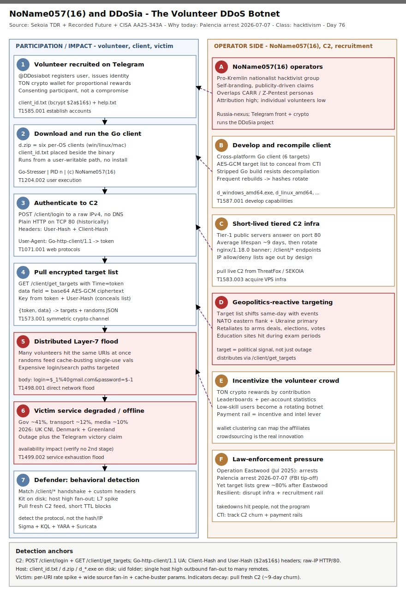

# NoName057(16) & DDoSia: The Volunteer DDoS Botnet (2026 Campaign + Palencia Arrest)

## TL;DR

NoName057(16) is a pro-Russia nationalist hacktivist group that runs **DDoSia**, a crowdsourced DDoS toolkit: instead of compromising machines, it recruits willing **volunteers** on Telegram, pays them in cryptocurrency, and hands them a cross-platform **Go client** ("Go-Stresser") that authenticates to a rotating C2, pulls an encrypted target list, and floods it. The reason to cover it today is a sustained 2026 operational tempo plus a fresh law-enforcement beat: after **Operation Eastwood** (July 2025) the group only grew louder, the UK NCSC warned of DDoSia hitting UK critical infrastructure and local government (Jan 2026), CSIS tracked renewed targeting of **Denmark and Greenland** around the 24-March-2026 snap election, and on **2026-07-07** Spanish police arrested a Palencia man tied to pro-Russia hacktivist groups (CARR / Z-Pentest, acting on behalf of NoName057(16)) after an FBI tip-off. This is the repo's **first case in the hacktivism / influence-ops slot (#17)**; the detection angle is behavioral C2 fingerprinting and volumetric Layer-7 analytics, because the "malware" is a legal-grey tool run by consenting users and its hashes and C2 IPs rotate constantly.

## Attribution and confidence

Attribution to **NoName057(16)** is **high** — this is a self-branding, publicity-driven group that claims its own attacks on Telegram and ships a client stamped `(c) NoName057(16)`. The open question is never "who" but "which volunteers and which C2 today." Europol/Eurojust's Operation Eastwood (2025) publicly linked the operation to individuals in Russia and an affiliated ecosystem (including the **Cyber Army of Russia Reborn / CARR** and **Z-Pentest** personas that overlap in personnel and messaging). The 2026-07-07 Palencia arrest fits that same overlapping-persona picture.

| Alias / related persona | Relationship | Note |
|---|---|---|
| NoName057(16) | Primary | Runs the DDoSia project; Russian + English Telegram channels; crypto rewards |
| DDoSia Project | Toolkit/program | @DDosiabot registration; per-OS Go client; encrypted target list |
| Cyber Army of Russia Reborn (CARR) | Overlapping ecosystem | Shared messaging/personnel; dabbles in OT/HMI defacement |
| Z-Pentest | Overlapping ecosystem | Claims OT/SCADA intrusions; subject of the 2026-07-07 arrest reporting |

Confidence: **high** on group attribution and on the toolkit's mechanics (multiple vendors reproduced the client and C2 protocol); **medium** on any single day's target list and C2 (they rotate); **low** on individual volunteer attribution from network data alone.

**Genealogy with previous repo cases.** This opens the hacktivism / influence-ops vertical and connects to the repo's Russia/Ukraine-war and infrastructure-abuse threads: the [RoboVPN / Vo1d / Popa residential-proxy botnet](../../06/2026-06-28_RoboVPN-Neunative-Vo1d-Popa-Residential-Proxy-Botnet) (the #21 infra-abuse sibling — distributed nodes turned into an attack fabric), the [GREYVIBE PhantomRelay Ukraine relay case](../../06/2026-06-01_GREYVIBE-PhantomRelay-LegionRelay-Ukraine), the [UAC-0057 OYSTERFRESH Ukraine espionage case](../../05/2026-05-25_UAC0057-OYSTERFRESH-Prometheus-Ukraine), and the nationalist-hacktivist [Black Shadow / Ababil-of-Minab wiper case](../../05/2026-05-31_BlackShadow-AbabilOfMinab-Recovery-Layer-Destruction) (self-branding, politically reactive destruction). Anti-duplicate check is clean: no prior `noname|ddosia|z-pentest|hacktiv|carr` primary in `days/` or `byActor/` — only tangential OT/SCADA mentions.

## Kill chain — summary table

| Stage | MITRE | Detail |
|---|---|---|
| Recruit volunteer on Telegram, issue identity | T1585.001 | @DDosiabot registers a user, issues client_id.txt (bcrypt $2a$16$) + TON wallet for crypto rewards |
| Volunteer downloads and runs the client | T1204.002 | d.zip -> per-OS Go-Stresser client; runs from a user-writable path, prints NoName057(16) banner |
| Client authenticates to C2 | T1071.001 | POST /client/login with User-Hash + Client-Hash headers over plain HTTP/80 to a raw IPv4 |
| Client pulls encrypted target list | T1573.001 | GET /client/get_targets returns AES-GCM data field; key derived from token + User-Hash |
| Distributed HTTP flood on the target | T1498.001, T1499.002 | Many volunteers hit the same URIs with cache-busting random values to defeat caching |
| Victim web service degraded / offline | T1499.002 | Government, transport, finance and media sites experience availability impact |
| Operators claim + iterate (geopolitics-reactive) | T1587.001 | Telegram claims, leaderboards; target list shifts with events; client recompiled to evade |



The left lane is the participation/impact chain: a volunteer is recruited and issued an identity, runs the Go client, which authenticates to the C2, pulls the encrypted target list, and floods the victim until the service degrades. The right lane is the operator side: NoName057(16) develops and recompiles DDoSia, stands up short-lived tiered C2 infrastructure, selects targets reactively to geopolitics, incentivizes volunteers with crypto, and absorbs law-enforcement pressure. Detection anchors run along the bottom: the `/client/login` and `/client/get_targets` handshake, the Go-http-client User-Agent and Client-Hash/User-Hash headers, the on-disk kit, and the victim-side rate spike with cache-buster parameters.

## Stage-by-stage detail

### Stage 1 — Volunteer recruitment and identity issuance (T1585.001)

DDoSia is a **program**, not a compromise. Recruitment happens on Telegram (a Russian channel with tens of thousands of subscribers and an English channel). A prospective volunteer messages **@DDosiabot**, supplies a **TON crypto wallet** to receive rewards proportional to their contribution, and receives two files:

```
client_id.txt   # a unique volunteer id, a bcrypt hash beginning $2a$16$
help.txt        # setup instructions + Telegram install tutorials
```

The bot also exposes personal and aggregate attack statistics — gamifying participation. **MITRE T1585.001 — Establish Accounts: Social Media Accounts** (the operators' channel/bot infrastructure that mobilizes the crowd).

### Stage 2 — Client download and execution (T1204.002)

The volunteer downloads **d.zip**, which contains the same client compiled for six targets:

```
d_linux_amd64      d_linux_arm
d_mac_amd64        d_mac_arm64
d_windows_amd64.exe  d_windows_arm64.exe
```

`client_id.txt` must be placed beside the chosen binary. On launch the console prints a banner and begins work:

```
Go-Stresser <version> | PID <n>  (c) NoName057(16)
Authorization passed successfully
Received targets: 54
```

The client creates a sibling **`uid`** folder holding the SHA256 of the machine UID. **MITRE T1204.002 — User Execution: Malicious File** (the user knowingly runs it — the "insider by consent" model).

### Stage 3 — C2 authentication (T1071.001)

The client authenticates over **plain HTTP on TCP/80** to a raw IPv4 Tier-1 C2 (no DNS):

```
POST /client/login HTTP/1.1
Host: 94.140.114.239
User-Agent: Go-http-client/1.1
Client-Hash: <sha256(machine-UID)>:<pid>
User-Hash: $2a$16$xxxxxxxxxxxxxxxxx
Content-Type: application/json
{"location":"UER8zRkg...lQ6i8s="}
```

The C2 replies `200 OK` (historically `Server: nginx/1.18.0 (Ubuntu)`) with a numeric **token**. The `User-Hash` is the content of `client_id.txt`; the `Client-Hash` is generated per host. **MITRE T1071.001 — Application Layer Protocol: Web Protocols.**

### Stage 4 — Encrypted target list retrieval (T1573.001)

The client then pulls targets, echoing the token in a `Time` header:

```
GET /client/get_targets HTTP/1.1
User-Agent: Go-http-client/1.1
Client-Hash: <...>:<pid>
Time: <token>
User-Hash: $2a$16$xxxxxxxxxxxxxxxxx
```

The response is `{"token": <int>, "data": "<base64 AES-GCM>"}`. Since 19 April 2023 the list is **AES-GCM encrypted** to conceal targets from researchers. The derivation (publicly reversed by Sekoia): **key** = integer-divide token by 5, append to `User-Hash`, take the last 32 chars as a hex string; **IV** = first 12 bytes of the base64-decoded ciphertext; **TAG** = last 16 bytes. Decrypted, `data` is JSON with `randoms` and `targets`:

```json
{ "target_id":"...", "host":"id.kyivcity.gov.ua", "ip":"104.18.20.41",
  "type":"http", "method":"POST", "port":443, "use_ssl":true,
  "path":"/login/email",
  "body":{"type":"str","value":"login=$_1%40gmail.com&password=$-1"} }
```

**MITRE T1573.001 — Encrypted Channel: Symmetric Cryptography.**

### Stage 5 — Distributed Layer-7 flood (T1498.001, T1499.002)

Every volunteer client hammers the assigned URIs. The `randoms` config feeds high-entropy single-use values into placeholders like `$_1` / `$-1` in the request body and query — this is a deliberate **cache-busting** measure so a CDN or reverse proxy cannot absorb the flood with cached responses. The result is a broad, distributed HTTP request flood against Layer-7 endpoints (often login or search paths that are expensive to serve). **MITRE T1498.001 — Network Denial of Service: Direct Network Flood** and **T1499.002 — Endpoint Denial of Service: Service Exhaustion Flood.**

### Stage 6 — Impact and operator amplification (T1499.002, T1587.001)

Targeted government, transport, finance and media sites experience latency or outage. NoName057(16) then **claims** the attack on Telegram, publishes "proof," and maintains leaderboards — the influence-operation payload is as much the *claim* as the *outage*. Target selection is strongly **reactive to geopolitics** (e.g., historically switching same-day to Wagner-linked sites during the June-2023 mutiny, or French transport sites after a Macron arms announcement). To stay ahead of the CTI community they **recompile** the client and rotate C2. **MITRE T1587.001 — Develop Capabilities: Malware** (continuous toolkit development).

## RE notes

Public samples exist (the six per-OS clients), so structural signatures are viable even though per-build hashes rotate.

| Component | SHA256 | Lang | Packer | Notes |
|---|---|---|---|---|
| d_windows_amd64.exe | 726c2c2b35cb1adbe59039193030f23e552a28226ecf0b175ec5eba9dbcd336e | Go | none | HISTORICAL 2023 build; C2 URIs + Client-Hash/User-Hash embedded |
| d_linux_amd64 | 761075da6b30bb2bcbb5727420e86895b79f7f6f5cebdf90ec6ca85feb78e926 | Go | none | HISTORICAL 2023 build |
| d_mac_arm64 | 9a1f1c491274cf5e1ecce2f77c1273aafc43440c9a27ec17d63fa21a89e91715 | Go | none | HISTORICAL 2023 build |

Anti-analysis is modest but real: the Go build is **stripped/mangled** enough that standard Go decompilation throws errors, and the **target list is AES-GCM encrypted** with a key derived at runtime from the C2 token and the volunteer `User-Hash`, so a static sample yields no targets without a live token. Detection should key on the **durable protocol strings** (`/client/get_targets`, `Client-Hash`, `Go-Stresser`, `NoName057(16)`) and the kit layout, not a hash.

## Detection strategy

### Telemetry that matters

- **Egress HTTP / proxy / Zeek / Suricata:** URIs `/client/login`, `/client/get_targets`; `Go-http-client/1.1` User-Agent; custom `Client-Hash` / `User-Hash` request headers; raw-IP HTTP on TCP/80 with no prior DNS.
- **Defender XDR:** `DeviceNetworkEvents` (RemoteUrl, InitiatingProcess), `DeviceFileEvents` (kit files), high outbound fan-out.
- **Sysmon:** EID 11 (file create — `client_id.txt`, `d.zip`, `d_*.exe`), EID 1 (process create — client image from user path), EID 3 (network — TCP/80 to raw IP by the client).
- **Victim edge:** IIS `W3CIISLog` / WAF / CDN logs — requests-per-minute per URI, distinct-source-IP fan-in, cache-buster query/body values.

### Detection coverage

| Engine | File | Logic |
|---|---|---|
| Sigma | sigma/ddosia_client_id_file_drop.yml | file_event: creation of `client_id.txt` or `d.zip` (volunteer kit on disk) |
| Sigma | sigma/ddosia_client_process_execution.yml | process_creation: `d_windows_*.exe` from a user-writable path |
| Sigma | sigma/ddosia_c2_beacon_network.yml | network_connection: DDoSia client image to remote TCP/80 |
| KQL | kql/ddosia_c2_handshake.kql | DeviceNetworkEvents: RemoteUrl has `/client/login` or `/client/get_targets` |
| KQL | kql/ddosia_kit_dropped.kql | DeviceFileEvents: per-OS client filenames + `client_id.txt` |
| KQL | kql/ddosia_host_flood_fanout.kql | DeviceNetworkEvents: single host high distinct-remote fan-out (participation) |
| KQL | kql/ddosia_victim_l7_flood.kql | W3CIISLog: per-URI rate spike + wide source-IP spread (victim side) |
| YARA | yara/ddosia_client.yar | Go client protocol strings, decrypted-config fields, kit layout (3 rules) |
| Suricata | suricata/ddosia_c2.rules | `/client/login` + User-Hash, `/client/get_targets`, Client-Hash header, Go agent, historical C2 (5 sids) |

### Threat hunting hypotheses

- **H1 — participant host:** internal host beaconing to a DDoSia C2 (`/client/*`, Go agent, Client-Hash/User-Hash). See [hunts/peak_h1_ddosia_participant_host.md](./hunts/peak_h1_ddosia_participant_host.md).
- **H2 — victim L7 flood:** rate spike to a targeted URI with cache-buster parameters and wide source fan-in. See [hunts/peak_h2_ddosia_victim_l7_flood.md](./hunts/peak_h2_ddosia_victim_l7_flood.md).
- **H3 — C2 infra tracking:** enumerate short-lived Tier-1 C2 and recover the current target list to pre-warn victims. See [hunts/peak_h3_ddosia_c2_infra_tracking.md](./hunts/peak_h3_ddosia_c2_infra_tracking.md).

## Incident response playbook

### First 60 minutes (triage)

1. Decide which side you are: **participant host** (an internal machine beaconing to a DDoSia C2) or **victim** (your public service under flood). They have different playbooks.
2. **Participant:** identify the host/user, confirm `client_id.txt` + `d_*.exe` + `uid` folder, and capture the volunteer id before killing anything.
3. **Victim:** confirm it is a volumetric Layer-7 flood (rate spike, distinct-source fan-in, cache-buster params) and not a masking cover for a second intrusion.
4. Pull the **current** C2 and target list from ThreatFox / SEKOIA Community — do not act on stale IOCs.
5. Engage DDoS mitigation (rate-limit, challenge, upstream scrubbing) for the victim; isolate the host for a participant.

### Artifacts to collect

| Artifact | Path | Tool | Why |
|---|---|---|---|
| Client binary | `<userpath>\d_windows_amd64.exe` (or per-OS) | EDR / disk image | Sample for structural YARA + build tracking |
| Volunteer id | `.\client_id.txt` | file collection | The bcrypt `$2a$16$` id ties the host to the volunteer account |
| Machine-UID hash | `.\uid\` | file collection | Confirms client ran and generated its Client-Hash |
| Egress HTTP | proxy / Zeek / Suricata logs | SIEM | Captures `/client/*` handshake, C2 IP, Go agent |
| Edge access logs | IIS `W3CIISLog` / WAF / CDN | SIEM | Victim-side flood signature and source-IP set |

### IR queries and commands

```powershell
# Participant host: find the DDoSia kit and its identity file
Get-ChildItem -Path C:\Users -Recurse -Include client_id.txt,d.zip,d_windows_amd64.exe,d_windows_arm64.exe -ErrorAction SilentlyContinue |
  Select-Object FullName, Length, LastWriteTime
```

```bash
# Participant host (Linux): confirm the client and its uid artifact
find /home -maxdepth 4 \( -name 'client_id.txt' -o -name 'd_linux_*' -o -name 'd.zip' \) 2>/dev/null
ls -la ./uid 2>/dev/null
```

```kql
// Confirm the C2 handshake for a suspect host
DeviceNetworkEvents
| where DeviceName == "<host>"
| where RemoteUrl has "/client/get_targets" or RemoteUrl has "/client/login"
| project Timestamp, InitiatingProcessFileName, RemoteIP, RemotePort, RemoteUrl
```

### Containment, eradication, recovery

- **Participant:** isolate the host, remove the client + `client_id.txt` + `uid` folder, block the current C2 egress (short TTL — it will rotate), and handle as insider-risk or commodity-malware per policy. **Exit criteria:** no further `/client/*` beacons and no kit on disk.
- **Victim:** keep mitigation engaged through the campaign window; shape by ASN/geo where lawful; ensure origin is shielded behind the scrubbing layer. **Exit criteria:** request rate back to baseline and origin health restored.
- **Do NOT:** treat a stale C2 IP as a durable block (they age out ~9 days); assume the flood is the whole story (verify no second-stage rode the noise); or publicly amplify the group's claims (the influence-op wants the coverage).

### Recovery validation

Confirm the participant host is clean (no kit, no beacons) and re-image if commodity malware delivered the client; for the victim, validate normal latency/error rates and that WAF/scrubbing rules did not break legitimate traffic. Re-pull the C2/target feed to confirm you are no longer on the current list.

## IOCs

Full list in [iocs.csv](./iocs.csv). Top anchors (behavioral first — hashes/IPs are HISTORICAL reference that rotate):

| Type | Value | Context | Confidence | Source |
|---|---|---|---|---|
| url | /client/login | C2 auth endpoint (POST) — durable anchor | high | Sekoia TDR |
| url | /client/get_targets | C2 target-pull endpoint (GET) — durable anchor | high | Sekoia TDR |
| string | Client-Hash | Custom header: sha256(machine-UID):PID | high | Sekoia TDR |
| string | User-Hash / $2a$16$ | Custom header: bcrypt volunteer id | high | Sekoia TDR |
| string | Go-http-client/1.1 | Client default UA on the C2 handshake | medium | Sekoia TDR |
| path | client_id.txt | Volunteer identity file next to the binary | high | Sekoia TDR |
| string | Go-Stresser / NoName057(16) | Client console banner / self-branding | medium | Sekoia TDR |
| sha256 | 726c2c2b...dbcd336e | d_windows_amd64.exe — HISTORICAL 2023 build | medium | Sekoia TDR |
| ipv4 | 94.140.114.239 | Tier-1 C2 — HISTORICAL, decayed (~9-day lifespan), not live | low | Sekoia TDR |

**KEV status:** no CVE is associated with this case — DDoSia abuses volunteer participation and an unauthenticated toolkit protocol, not a software vulnerability — so no `kev.md` is generated. Absence of a CVE here is expected, not a gap.

## Secondary findings

- **The ecosystem dabbles in OT, not just DDoS.** Overlapping personas **CARR** and **Z-Pentest** have claimed intrusions and HMI defacements against internet-exposed OT/SCADA (CISA AA25-343A documents pro-Russia hacktivists manipulating human-machine interfaces at water and energy utilities using basic methods). The 2026-07-07 Palencia arrest was of a suspect tied to exactly these OT-dabbling personas — worth watching whether the crowd model migrates from Layer-7 floods to opportunistic OT tampering. See the repo's OT cases: the Lantronix EDS5000 BRIDGEBREAK OT-bridge write-up and the [Mexico water AI-assisted OT intrusion](../../05/2026-05-10_Mexico-Water-AI-Assisted-OT).
- **Law enforcement disrupts people, not the program.** Operation Eastwood (July 2025: arrests, warrants, 24 searches across six countries) and the July-2026 arrest degrade personnel, yet the published target lists *grew* afterward (Imperva measured an ~80% jump in sites/day in the following weeks). A volunteer botnet with a Telegram front and crypto incentives is resilient by design — takedowns must target infrastructure, recruitment funnels and payment rails, not just individuals.
- **The crypto rail is both incentive and intelligence.** Rewards flow to TON wallets declared to @DDosiabot; that payment layer is a lever (chain analysis, wallet clustering) for mapping the affiliate base — the same weakness that makes the model scalable also makes it traceable.

## Pedagogical anchors

- **Detect the protocol, not the payload.** When the "malware" is a legally-grey tool run by consenting users and recompiled constantly, hashes and C2 IPs are noise. The durable signal is the handshake shape: `/client/login` + `/client/get_targets`, the `Client-Hash`/`User-Hash` headers, and the Go agent.
- **Indicators decay — DDoSia proves it.** Tier-1 C2 lives ~9 days on average and client builds rotate; a static blocklist is stale within a fortnight. Operationalize a *fresh* feed (ThreatFox / SEKOIA Community) with short TTLs instead.
- **Two roles, two playbooks.** A DDoSia event can put you on either side — an internal host that joined the botnet, or a public service under flood. Triage must branch on that first; the artifacts, telemetry and containment differ entirely.
- **The claim is the payload.** For an influence-op hacktivist group, the Telegram victory post can matter more than the outage. Availability impact is real, but don't amplify the narrative, and always check the flood isn't cover for a quieter intrusion.
- **Crowdsourcing is the innovation.** DDoSia's threat is organizational, not technical: Telegram reach + crypto incentives + a friendly client turn thousands of low-skill volunteers into a rotating botnet that survives arrests. Defense and disruption must address the *program*, not just the binary.

## What's in this folder

| File | Purpose | Link |
|---|---|---|
| README.md | This analysis. | [README.md](./README.md) |
| kill_chain.svg | Two-lane kill chain (participation/impact vs operator side) with detection anchors. | [kill_chain.svg](./kill_chain.svg) |
| iocs.csv | Behavioral anchors + historical reference hashes/C2 (rotating), with decay caveats. | [iocs.csv](./iocs.csv) |
| sigma/ddosia_client_id_file_drop.yml | file_event: volunteer kit (`client_id.txt` / `d.zip`) dropped. | [link](./sigma/ddosia_client_id_file_drop.yml) |
| sigma/ddosia_client_process_execution.yml | process_creation: `d_windows_*.exe` from a user path. | [link](./sigma/ddosia_client_process_execution.yml) |
| sigma/ddosia_c2_beacon_network.yml | network_connection: client image to remote TCP/80. | [link](./sigma/ddosia_c2_beacon_network.yml) |
| kql/ddosia_c2_handshake.kql | DeviceNetworkEvents: `/client/login` + `/client/get_targets`. | [link](./kql/ddosia_c2_handshake.kql) |
| kql/ddosia_kit_dropped.kql | DeviceFileEvents: per-OS client filenames + id file. | [link](./kql/ddosia_kit_dropped.kql) |
| kql/ddosia_host_flood_fanout.kql | DeviceNetworkEvents: high outbound fan-out (participation). | [link](./kql/ddosia_host_flood_fanout.kql) |
| kql/ddosia_victim_l7_flood.kql | W3CIISLog: victim-side per-URI rate spike + source fan-in. | [link](./kql/ddosia_victim_l7_flood.kql) |
| yara/ddosia_client.yar | Go client protocol strings, decrypted config, kit layout (3 rules). | [link](./yara/ddosia_client.yar) |
| suricata/ddosia_c2.rules | C2 handshake + participation (5 sids). | [link](./suricata/ddosia_c2.rules) |
| hunts/peak_h1_ddosia_participant_host.md | Hunt: internal host beaconing to DDoSia C2. | [link](./hunts/peak_h1_ddosia_participant_host.md) |
| hunts/peak_h2_ddosia_victim_l7_flood.md | Hunt: victim-side Layer-7 flood characterization. | [link](./hunts/peak_h2_ddosia_victim_l7_flood.md) |
| hunts/peak_h3_ddosia_c2_infra_tracking.md | Hunt: short-lived C2 tracking + target-list recovery. | [link](./hunts/peak_h3_ddosia_c2_infra_tracking.md) |

## Sources

- [Sekoia TDR — Following NoName057(16) DDoSia Project's Targets](https://blog.sekoia.io/following-noname05716-ddosia-projects-targets)
- [Recorded Future — Inside DDoSia: Anatomy of DDoSia](https://www.recordedfuture.com/research/anatomy-of-ddosia)
- [CISA AA25-343A — Pro-Russia Hacktivists Conduct Opportunistic Attacks Against US and Global Critical Infrastructure](https://www.cisa.gov/news-events/cybersecurity-advisories/aa25-343a)
- [Eurojust — Hacktivist group NoName057(16) taken down (Operation Eastwood)](https://www.eurojust.europa.eu/news/hacktivist-group-responsible-cyberattacks-critical-infrastructure-europe-taken-down)
- [The Register — Alleged pro-Russia hacktivist arrested in Palencia (2026-07-07)](https://www.theregister.com/security/2026/07/07/alleged_pro_russia_hacktivist_arrested_in_palencia/)
- [CSIS — DDoSia: Pro-Russian hacktivist operations (Denmark / Greenland 2026)](https://www.csis.com/csis-tech-blog/ddosia-pro-russian-hacktivist-operations)
- [Radware — NoName057(16) pro-Russian hacktivist group](https://www.radware.com/cyberpedia/ddos-attacks/noname057(16)/)
- [Avast Decoded — DDoSia Project: improving DDoS efficiency](https://decoded.avast.io/martinchlumecky/ddosia-project-how-noname05716-is-trying-to-improve-the-efficiency-of-ddos-attacks/)

<sub>Educational / defensive detection engineering. Indicators decay: pull current DDoSia C2 and client hashes from ThreatFox and the SEKOIA-IO/Community repo before blocking. This case involves a politically-motivated hacktivist group; the analysis is neutral and defensive.</sub>
