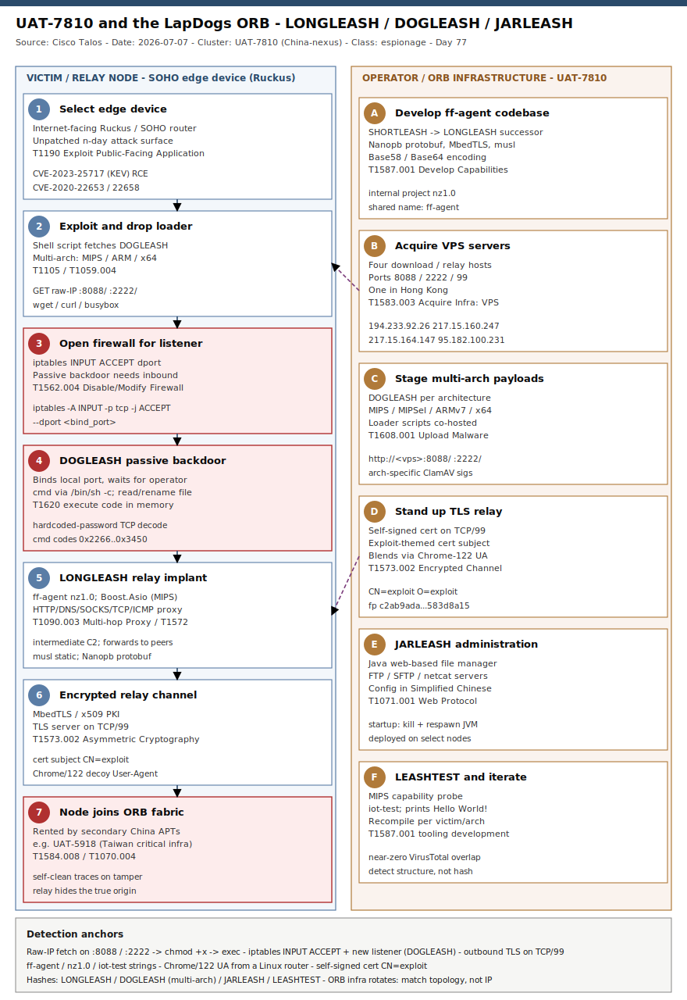

# UAT-7810 & the LapDogs ORB: LONGLEASH, DOGLEASH and JARLEASH

## TL;DR

**UAT-7810** is a China-nexus actor whose job is not to breach the final target but to build the road to it: it compromises unpatched SOHO and embedded networking devices — primarily **Ruckus wireless routers** — and turns them into an **Operational Relay Box (ORB) network** (publicly named **LapDogs**) that *secondary* China-nexus APTs such as UAT-5918 rent to proxy their own operations. On **2026-07-07** Cisco Talos published fresh findings: UAT-7810's implant codebase (internally **"ff-agent"**) has a new version, **LONGLEASH**, alongside two previously unknown families — a C passive backdoor **DOGLEASH** and a Java admin backdoor **JARLEASH** — plus a MIPS test binary **LEASHTEST**. Initial access is n-day exploitation of Ruckus CVEs (and, from the same infrastructure, ASUS AiCloud); the durable detection story is behavioural, because these ELF/JAR payloads are recompiled per architecture and per victim with near-zero shared hashes. This is the repo's first case anchored on **UAT-7810 / LapDogs** and its first ORB-infrastructure deep dive, filed under Monday espionage (slot #1, APT state-nation).

## Attribution and confidence

Talos assesses with **high confidence** that **UAT-7810** is a **China-nexus** threat actor. The assessment rests on two legs: the actor provides ORB infrastructure to known China-nexus APTs (notably **UAT-5918**, which targets critical infrastructure in Taiwan), with open-source reporting showing overlapping tooling; and the **JARLEASH** configuration file carries comments in **Simplified Chinese**, indicating Chinese-speaking operators. Talos nonetheless keeps UAT-7810 and UAT-5918 as **separate** actors with their own objectives — UAT-7810 builds and maintains the relay fabric; the tenants who use it are tracked independently. Confidence is therefore **high** on the China-nexus infrastructure role and the malware suite, and lower on any single downstream operation, since an ORB relay hit does not by itself attribute the operator behind the traffic.

| Alias / related cluster | Relationship | Note |
|---|---|---|
| UAT-7810 | Primary (Talos) | ORB builder/maintainer for the LapDogs network |
| LapDogs | ORB network name | First disclosed by SecurityScorecard (June 2025); ~1,000+ SOHO routers historically |
| UAT-5918 | ORB tenant (China-nexus) | Targets Taiwan critical infra; overlapping tooling but tracked separately |
| ff-agent | Internal project name | Shared codebase of SHORTLEASH and its successor LONGLEASH (project "nz1.0") |

**Genealogy with previous repo cases.** This opens the ORB / relay-infrastructure thread and links to the repo's China-nexus and edge-appliance cases: the China government-espionage case [UAT-8302](../../05/2026-05-11_UAT-8302-China-Government-Espionage) (same China-nexus, government targeting), the edge-appliance auth-bypass case [Cisco SD-WAN / UAT-8616](../../05/2026-05-16_Cisco-SDWAN-vHub-AuthBypass-UAT8616) (network-device exploitation as an entry surface), and the recent edge-device case CitrixBleed-Infinity NetScaler (Day 73, 2026-07-09) which similarly turned an internet-facing appliance into the foothold. It also rhymes with the espionage-tradecraft cluster work in [ToddyCat](../2026-07-06_ToddyCat-Umbrij-STRD-OAuth-Gmail). Anti-duplicate check is clean: no prior `uat-7810|lapdogs|shortleash|longleash|dogleash|jarleash|ruckus|orb` primary in `days/` or `byActor/` — only tangential UAT-* edge mentions.

## Kill chain — summary table

| Stage | MITRE | Detail |
|---|---|---|
| Select unpatched Ruckus / SOHO edge device | T1190 | Recon of internet-facing routers vulnerable to known n-days |
| Exploit Ruckus n-day for RCE | T1190 | CVE-2020-22653 / CVE-2020-22658 / CVE-2023-25717 (also ASUS AiCloud CVE-2025-2492 from same infra) |
| Drop loader shell script | T1105, T1059.004 | Script fetches DOGLEASH (MIPS/ARM/x64) from a VPS on port 8088/2222 |
| Open firewall for passive backdoor | T1562.004 | iptables INPUT ACCEPT for the DOGLEASH bind port |
| Run DOGLEASH passive backdoor | T1620 | Listens locally; decodes inbound TCP; exec via /bin/sh -c or in-memory |
| Deploy LONGLEASH relay implant | T1090.003, T1572 | ff-agent nz1.0: reverse shell, HTTP/DNS/SOCKS/TCP/ICMP/UDP proxy, intermediate C2 |
| Encrypt relay channel | T1573.002 | MbedTLS/x509 PKI; self-signed TLS server on TCP/99 (CN=exploit) |
| JARLEASH admin on select nodes | T1071.001 | Java backdoor: web file manager, FTP/SFTP, netcat |
| Node joins ORB, self-cleans on tamper | T1584.008, T1070.004 | Relay fabric used by secondary APTs; implant wipes traces if tampering detected |



The left lane is the victim/relay-node chain: an internet-facing Ruckus/SOHO device is exploited with a known n-day, a shell loader pulls DOGLEASH from a staging VPS, the loader opens the firewall so the passive backdoor can listen, and the device then also runs the LONGLEASH relay implant — joining the ORB fabric. The right lane is the operator/infrastructure side: UAT-7810 develops the ff-agent codebase, acquires VPS download servers, stages multi-architecture payloads, exposes a port-99 TLS relay with an exploit-themed self-signed certificate, and deploys JARLEASH for administration. Detection anchors run along the bottom: the raw-IP fetch on ports 8088/2222, the iptables inbound-allow, the ff-agent/Chrome-122 decoy strings, and the `CN=exploit` TLS certificate.

## Stage-by-stage detail

### Stage 1 — Initial access: Ruckus n-day exploitation (T1190)

UAT-7810 primarily exploits **known, unpatched vulnerabilities in Ruckus wireless routers**, a tactic it has used since 2025:

```
CVE-2020-22653   Ruckus wireless router
CVE-2020-22658   Ruckus wireless router
CVE-2023-25717   Ruckus wireless router RCE (historically weaponized by AndoryuBot)
```

The same operator infrastructure was also seen exploiting **ASUS AiCloud** routers (`CVE-2025-2492`) in early 2026 from IP `217.15.164[.]147`, indicating UAT-7810 (or an associated actor) is trying to expand the ORB onto AiCloud devices. The common thread: cheap, internet-facing, rarely-patched edge hardware — ideal disposable relay nodes.

### Stage 2 — Payload staging and loader (T1105, T1059.004)

Talos found **four servers** hosting payloads for **MIPS, ARM and x64**, predominantly DOGLEASH plus the accompanying shell scripts that download and execute it:

```
194.233.92[.]26        (ports 8088, 2222; TLS on 99)
217.15.160[.]247       (ports 8088, 2222, 99)
217.15.164[.]147       (ports 99, 8088, 2222; also ASUS AiCloud exploitation)
95.182.100[.]231       (Hong Kong; port 2222)
```

The staging URLs are plain HTTP on non-standard ports, e.g. `http://217.15.160[.]247:8088/` and `:2222/`. A compromised device runs a shell script that downloads the architecture-matched DOGLEASH and executes it.

### Stage 3 — Firewall opening for a passive backdoor (T1562.004)

DOGLEASH is a **passive** (server-side) backdoor: it binds and listens on a hardcoded local TCP port and waits for the operator. Because inbound connections must reach that port, the loader script **adds an iptables rule** allowing TCP to it:

```sh
# conceptual — loader opens the bind port before starting DOGLEASH
iptables -A INPUT -p tcp --dport <bind_port> -j ACCEPT
./dogleash &
```

An `INPUT ... ACCEPT` for a specific `--dport` on a router, followed by a new listener on that exact port, is the highest-signal host artifact of this family.

### Stage 4 — DOGLEASH command handling (T1620)

Any TCP data received on the bind port is decoded with a hardcoded password string; a command code selects the action, each in a new thread:

| Command code | Action |
|---|---|
| 0x2268, 0x2267 | Execute command via `/bin/sh -c` |
| 0x2266 | Read file |
| 0x2271 | Rename file (create a backup) |
| 0x2273, 0x2274 | Close socket listener |
| 0x3450 | Get OS info (release, version, machine HW id, node name) |
| (none of the above) | Execute code in memory |

The in-memory execution path (default branch) is why triage should **capture memory before killing the process** — the operator's most interesting code may never touch disk.

### Stage 5 — LONGLEASH: the relay implant (T1090.001, T1090.003, T1572, T1573.002)

**LONGLEASH** is the new version of the previously disclosed **SHORTLEASH**; both share the internal name **ff-agent**, and the LONGLEASH project is tagged **nz1.0**. The MIPS build uses **Boost.Asio** for high-performance async networking, links **Nanopb** (protobuf) and **MbedTLS** (TLS/x509), and statically links a **musl** libc rather than glibc. Its executor sets up:

```
- Reverse shell to C2
- Proxy servers: HTTP, DNS, SOCKS, TCP, ICMP, UDP
- Packet redirection (TCP/UDP/HTTP)
- SMTP server + client
- Client authorization, message routing through the proxy network, tunnel management
```

Crucially, LONGLEASH can act as an **intermediate C2** — obtaining commands/data from the origin C2 and forwarding to peers — which is exactly the relay behaviour an ORB needs. It embeds a decoy User-Agent to blend with legitimate traffic:

```
Mozilla/5.0 (Windows NT 10.0; Win64; x64) AppleWebKit/537.36 (KHTML, like Gecko) Chrome/122.0.6261.95 Safari/537.36
```

— anomalous when it originates from a Linux router. If it detects a suspicious connection or tampering, LONGLEASH **removes itself and its traces** (T1070.004).

### Stage 6 — JARLEASH and LEASHTEST (T1071.001)

**JARLEASH** is a Java (JAR) backdoor deployed on operator infrastructure and on compromised systems with Java available, for easy administration: a **web-based file manager**, **FTP/SFTP** servers, and a **netcat** server on a specified IP/port. Its startup script first kills any running JARLEASH, then spawns the JVM container; its configuration file carries **Simplified-Chinese** comments — an attribution tell. **LEASHTEST** (internal name **iot-test**) is a non-malicious MIPS test binary that checks basic capabilities (threads, TCP acceptor, child processes, async timer, "Hello World!", exception handling); its presence indicates UAT-7810 is still validating behaviour on MIPS devices — and is itself an indicator of compromise.

## RE notes

| Component | SHA256 | Lang | Packer | Notes |
|---|---|---|---|---|
| LONGLEASH | 755fcee1337a252203002ecfdf673a08cfadeda8d738bef2d518a08e0626aa4f | C/C++ (ELF) | none; static musl | ff-agent nz1.0; Boost.Asio (MIPS), Nanopb, MbedTLS; intermediate C2 |
| DOGLEASH | 604b53f87d6c070bf387e80c70a6df8d272fa3fc143148d41f13e59d52ab1f13 | C (ELF) | none | Passive backdoor; hardcoded-password decode; /bin/sh -c + in-memory exec |
| JARLEASH | 324d95024fc8da5c92b5a1f4825aed5a2a91c9ca8fb6aa52abb332a4c9cf4257 | Java (JAR) | none | Web file mgr, FTP/SFTP, netcat; Simplified-Chinese config comments |
| LEASHTEST | 1b5649b479fd625de5c8120873644b5eb669cc89cd504582c18e0ae350fd8823 | C++ (ELF) | none | iot-test; benign MIPS capability probe; IoC of UAT-7810 presence |

Anti-analysis and structure notes: LONGLEASH statically links **musl** libc (fewer imports, self-contained across busybox routers), uses **protobuf-over-TLS** for C2 rather than plaintext, and self-deletes on tamper. Payloads are compiled **per architecture** (MIPS/MIPSel/MIPS32r2/ARMv7/x64) and per variant, so ClamAV ships arch-specific signatures (e.g. `Unix.Backdoor.Agent_mips32r2`, `_armv7`) rather than one hash. The self-signed TLS server on port 99 uses the deliberately-flagged subject `C=exploit, ST=exploit, L=exploit, O=exploit, OU=exploit, CN=exploit`, a durable network fingerprint (cert SHA256 `c2ab9adaba93ff094b8f3fc37d906014d870582039d276b7bd03e6fd583d8a15`).

## Detection strategy

### Telemetry that matters

Embedded routers rarely run an EDR agent, so this case is detected in three places: (1) **network egress / NetFlow + TLS metadata** from the management and edge segments — outbound TLS on TCP/99, HTTP fetches on 8088/2222, and the `CN=exploit` certificate; (2) **on-device / Linux EDR** where present (Defender for Endpoint Linux `DeviceProcessEvents`, `DeviceNetworkEvents`, `DeviceFileEvents`; auditd `execve`/`bind`/`connect`) — the shell loader, the iptables ACCEPT, the new listener; and (3) **forensic firmware/disk artifacts** — the ELF/JAR hashes and YARA structure hits recovered from an imaged device.

### Detection coverage

| Engine | File | Logic |
|---|---|---|
| Sigma | sigma/dogleash_loader_download_from_raw_ip.yml | Shell downloader fetching from a raw IPv4 on port 8088/2222 (or the four VPS IPs) |
| Sigma | sigma/dogleash_iptables_inbound_backdoor_port.yml | iptables/nft INPUT ACCEPT opening a specific TCP dport (backdoor listener) |
| Sigma | sigma/longleash_tls_relay_outbound_port99.yml | Outbound TLS to port 99 / documented ORB infra from a Linux/edge host |
| KQL | kql/dogleash_loader_download_exec.kql | Defender-for-Endpoint-Linux: wget/curl/tftp to UAT-7810 infra or ports 8088/2222 |
| KQL | kql/dogleash_iptables_backdoor_port.kql | iptables INPUT ACCEPT for a --dport (firewall open for the passive backdoor) |
| KQL | kql/longleash_orb_relay_port99.kql | DeviceNetworkEvents: outbound to port 99 or the four VPS IPs |
| KQL | kql/uat7810_known_malware_hashes.kql | DeviceFileEvents retro-hunt of the LONGLEASH/DOGLEASH/JARLEASH/LEASHTEST hash set |
| YARA | yara/uat7810_leash_suite.yar | ff-agent/nz1.0 + Chrome-122 decoy (LONGLEASH), iot-test (LEASHTEST), CN=exploit + loader scripts |
| Suricata | suricata/uat7810_orb.rules | CN=exploit / O=exploit TLS cert, 8088/2222 fetch, Chrome-122 decoy UA, IP reference anchor |

### Threat hunting hypotheses

- **H1 — ORB relay node:** an internet-facing SOHO/edge device has been turned into a UAT-7810 relay running DOGLEASH/LONGLEASH. See [hunts/peak_h1_orb_relay_node_backdoor.md](./hunts/peak_h1_orb_relay_node_backdoor.md).
- **H2 — DOGLEASH passive backdoor:** a Linux host has an unexpected listener whose port has a dedicated iptables ACCEPT rule. See [hunts/peak_h2_dogleash_passive_backdoor_host.md](./hunts/peak_h2_dogleash_passive_backdoor_host.md).
- **H3 — infrastructure tracking:** pivot on the `CN=exploit` cert and the 99/8088/2222 port topology to find new ORB servers. See [hunts/peak_h3_uat7810_infra_tracking.md](./hunts/peak_h3_uat7810_infra_tracking.md).

## Incident response playbook

### First 60 minutes (triage)

1. Identify whether the alerting asset is an **embedded device** (router/AP) or a **general Linux host** — the evidence-collection path differs sharply.
2. On a router/AP: do **not** reboot or factory-reset yet — LONGLEASH self-cleans on tamper, and a reboot may drop the only forensic copy. Isolate at the switch/upstream instead.
3. Capture **volatile state**: listening sockets (`ss -ltnp`), the running process list, the iptables ruleset, and — where possible — a memory image, before touching the implant.
4. Enumerate outbound sessions to **TCP/99** and to the four documented VPS IPs; note any `CN=exploit` TLS certificate.
5. Confirm the device's firmware/CVE status (Ruckus CVEs, ASUS AiCloud) to establish the entry vector.

### Artifacts to collect

| Artifact | Path | Tool | Why |
|---|---|---|---|
| Listening sockets + owning PID | live | `ss -ltnp` | Reveals the DOGLEASH passive listener |
| Firewall ruleset | live | `iptables -S` / `nft list ruleset` | The added INPUT ACCEPT for the bind port |
| Suspect ELF/JAR | /tmp, /var/tmp, /dev/shm, /data | `cp` + hash | LONGLEASH/DOGLEASH/JARLEASH/LEASHTEST samples |
| Process memory | live | memory acquisition | In-memory command payloads never written to disk |
| Egress/TLS logs | SIEM/NetFlow | query | Port-99 relay, 8088/2222 fetch, cert subject |
| Firmware image | device flash | vendor tooling | Persistence check + reliable hashing |

### IR queries and commands

```bash
# List listeners and owning process (find the DOGLEASH bind port)
ss -ltnp

# Dump the firewall rules; look for a lone INPUT ACCEPT for a high dport
iptables -S | grep -Ei 'INPUT.*ACCEPT.*dport'

# Hash suspect binaries for the UAT-7810 set
find /tmp /var/tmp /dev/shm /data -type f -newermt '-30 days' 2>/dev/null -exec sha256sum {} +
```

```kql
// Fleet-wide: outbound relay traffic to the ORB port
DeviceNetworkEvents
| where Timestamp > ago(14d)
| where RemotePort == 99
| summarize count(), makeset(RemoteIP) by DeviceName, InitiatingProcessFileName
```

### Containment, eradication, recovery

Isolate the device upstream; then, once evidence is preserved, remove the iptables ACCEPT rule and the ELF/JAR, **factory-reset and re-flash** the firmware to a patched version, and rotate all device and management-plane credentials. **Exit criteria:** no listener on the former bind port, no outbound port-99 relay, patched firmware, and clean re-scan. **What NOT to do:** do not merely `kill` the process and delete the file (a passive backdoor + a self-cleaning relay can leave a re-drop mechanism, and you will have destroyed the memory evidence); do not reboot before capturing volatile state; do not treat a cleared relay node as clearing the *downstream* operation that used it.

### Recovery validation

Confirm the firmware version is patched against the Ruckus CVEs (and AiCloud where relevant), verify no unexpected listeners and no port-99/8088/2222 egress over a 72-hour watch window, and add the device's management interface to a monitored allow-list. Re-validate the four documented IPs and the `CN=exploit` cert against fresh scan data before relying on any blocklist entry.

## IOCs

Summary of the top anchors (full set, including all DOGLEASH build hashes and the staging URLs, in [iocs.csv](./iocs.csv)):

| Type | Value | Context | Confidence | Source |
|---|---|---|---|---|
| ipv4 | 194.233.92[.]26 | VPS payload/relay (8088/2222/99) | high | Talos |
| ipv4 | 217.15.160[.]247 | VPS download server (8088/2222/99) | high | Talos |
| ipv4 | 217.15.164[.]147 | VPS; also ASUS AiCloud exploitation | high | Talos |
| ipv4 | 95.182.100[.]231 | Payload host, Hong Kong (2222) | high | Talos |
| sha256 | c2ab9ada…583d8a15 | TLS cert fingerprint (port-99 relay, CN=exploit) | high | Talos |
| string | C=exploit,…,CN=exploit | Self-signed TLS cert subject_dn | high | Talos |
| sha256 | 755fcee1…0626aa4f | LONGLEASH (ff-agent nz1.0) | high | Talos |
| sha256 | 604b53f8…52ab1f13 | DOGLEASH passive backdoor | high | Talos |
| sha256 | 324d9502…c9cf4257 | JARLEASH Java admin backdoor | high | Talos |
| sha256 | 1b5649b4…50fd8823 | LEASHTEST (iot-test) MIPS probe | high | Talos |
| cve | CVE-2023-25717 | Ruckus RCE n-day (primary ORB recruitment vector) | high | Talos |
| cve | CVE-2025-2492 | ASUS AiCloud flaw exploited from UAT-7810 infra | medium | Talos |

**CISA KEV.** CVE-2023-25717 (Ruckus CSRF + RCE) is on the **CISA KEV** catalog (added 2023-05-12, remediation due 2023-06-02; ransomware use unknown, historically weaponized by the AndoryuBot DDoS botnet) — treat it as patch-now. The other three (CVE-2020-22653, CVE-2020-22658, CVE-2025-2492) are **not** currently on KEV, but their absence is not safety: UAT-7810 is actively exploiting all four against unpatched devices. See [kev.md](./kev.md) for the generated cross-reference.

## Secondary findings

- **The relay node is the product, not the target.** UAT-7810's objective is a resilient ORB fabric of disposable edge devices that *other* China-nexus actors (e.g. UAT-5918) rent to proxy operations. A hit on one of these nodes tells you the road is compromised; it does not tell you which convoy used it. Treat relay-node detections as infrastructure intelligence, and drive downstream investigation separately.
- **Passive beats beaconing for stealth.** DOGLEASH does not phone home; it listens behind an operator-added firewall hole. Detection strategies tuned only for outbound C2 beacons miss it entirely — the durable artifact is an unexpected inbound-allow rule plus a new listener, which most router monitoring never inspects.
- **One IP, two campaigns.** `217.15.164[.]147` served both Ruckus ORB payloads and ASUS AiCloud (CVE-2025-2492) exploitation, showing UAT-7810 (or a close partner) probing to expand the relay pool onto new device classes — a reason to hunt the infra topology (port 99 + 8088/2222 + CN=exploit) rather than a single vendor's CVE.

## Pedagogical anchors

- **You cannot hash your way out of an ORB.** Per-architecture, per-variant recompilation means near-zero shared hashes; the resilient selectors are the internal names (ff-agent/nz1.0/iot-test), the TLS cert identity (CN=exploit), and the behaviour (raw-IP fetch on odd ports, firewall-open + listener).
- **Match the topology, not the address.** ORB infrastructure rotates by design; the four VPS IPs are expiring leads. The co-occurrence of a port-99 TLS service, HTTP staging on 8088/2222, and a self-signed exploit-themed cert is what survives rotation.
- **Passive backdoors invert your telemetry.** When the implant waits instead of beacons, the tell moves from egress C2 to a local firewall change and a new listener — instrument inbound-allow rules and listener births on edge devices.
- **Capture memory before you kill.** DOGLEASH's default branch executes code in memory and LONGLEASH self-cleans on tamper; killing the process first destroys the most valuable evidence.
- **Edge hygiene is national-security hygiene.** Cheap, unpatched, internet-facing routers are the raw material of state-scale relay networks. Patch cadence and end-of-life replacement for SOHO/edge gear is an anti-espionage control, not just IT housekeeping.

## What's in this folder

| File | Purpose | Link |
|---|---|---|
| README.md | This analysis. | [README.md](./README.md) |
| kill_chain.svg | Two-lane kill-chain diagram (victim/relay vs operator/infra). | [kill_chain.svg](./kill_chain.svg) |
| iocs.csv | Full IOC set: CVEs, VPS IPs/URLs, TLS cert, and all LONGLEASH/DOGLEASH/JARLEASH/LEASHTEST hashes. | [iocs.csv](./iocs.csv) |
| kev.md | CISA KEV cross-reference for this case's CVEs. | [kev.md](./kev.md) |
| sigma/dogleash_loader_download_from_raw_ip.yml | Shell downloader fetching payload from a raw IP on 8088/2222. | [file](./sigma/dogleash_loader_download_from_raw_ip.yml) |
| sigma/dogleash_iptables_inbound_backdoor_port.yml | iptables INPUT ACCEPT opening the passive-backdoor port. | [file](./sigma/dogleash_iptables_inbound_backdoor_port.yml) |
| sigma/longleash_tls_relay_outbound_port99.yml | Outbound TLS to port 99 / documented ORB infra. | [file](./sigma/longleash_tls_relay_outbound_port99.yml) |
| kql/dogleash_loader_download_exec.kql | Defender-Linux: downloader hitting UAT-7810 infra/ports. | [file](./kql/dogleash_loader_download_exec.kql) |
| kql/dogleash_iptables_backdoor_port.kql | Defender-Linux: iptables ACCEPT for a backdoor dport. | [file](./kql/dogleash_iptables_backdoor_port.kql) |
| kql/longleash_orb_relay_port99.kql | Defender-Linux: outbound to port 99 / ORB IPs. | [file](./kql/longleash_orb_relay_port99.kql) |
| kql/uat7810_known_malware_hashes.kql | Fleet retro-hunt of the UAT-7810 hash set. | [file](./kql/uat7810_known_malware_hashes.kql) |
| yara/uat7810_leash_suite.yar | Structure heuristics for LONGLEASH/LEASHTEST/loader+cert. | [file](./yara/uat7810_leash_suite.yar) |
| suricata/uat7810_orb.rules | TLS cert, staging-port fetch, decoy-UA and IP-anchor rules. | [file](./suricata/uat7810_orb.rules) |
| hunts/peak_h1_orb_relay_node_backdoor.md | Hunt: SOHO/edge device turned into an ORB relay node. | [file](./hunts/peak_h1_orb_relay_node_backdoor.md) |
| hunts/peak_h2_dogleash_passive_backdoor_host.md | Hunt: DOGLEASH passive backdoor on a Linux host. | [file](./hunts/peak_h2_dogleash_passive_backdoor_host.md) |
| hunts/peak_h3_uat7810_infra_tracking.md | Hunt: track UAT-7810 ORB infrastructure by cert/topology. | [file](./hunts/peak_h3_uat7810_infra_tracking.md) |

## Sources

- [Cisco Talos — UAT-7810 continues building ORB networks using new malware (2026-07-07)](https://blog.talosintelligence.com/uat-7810/)
- [The Hacker News — China-Linked UAT-7810 Expands ORB Network With New LONGLEASH Malware](https://thehackernews.com/2026/07/china-linked-uat-7810-expands-orb.html)
- [BleepingComputer — Chinese hackers develop LONGLEASH malware to expand ORB network](https://www.bleepingcomputer.com/news/security/chinese-hackers-develop-longleash-malware-to-expand-orb-network/)
- [SecurityWeek — China-Linked APT Expands Arsenal With New 'Leash' Backdoors](https://www.securityweek.com/china-linked-apt-expands-arsenal-with-new-leash-backdoors/)
- [SecurityScorecard — LapDogs: Inside UAT-7810's Expanding ORB Network](https://securityscorecard.com/resources/strike/lapdogs-is-back-inside-uat-7810s-expanding-orb-network-and-its-new-servers/)
- [Cisco Talos — UAT-5918 targets critical infrastructure in Taiwan](https://blog.talosintelligence.com/uat-5918-targets-critical-infra-in-taiwan/)
- [NVD — CVE-2023-25717 (Ruckus)](https://nvd.nist.gov/vuln/detail/CVE-2023-25717)
- [NVD — CVE-2025-2492 (ASUS AiCloud)](https://nvd.nist.gov/vuln/detail/CVE-2025-2492)
