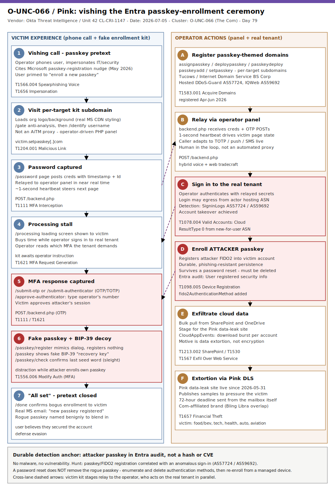

# O-UNC-066 / Pink: vishing the Entra passkey-enrollment ceremony for phishing-resistant persistence

## TL;DR

Since April 2026 a Com-affiliated data-extortion actor tracked by Okta as **O-UNC-066** (Palo Alto Unit 42: **CL-CRI-1147**, DLS brand **Pink**) has run a voice-phishing (vishing) campaign that abuses Microsoft's new passkey-enrollment nudges as a pretext. An operator calls a Microsoft 365 user, tells them they must register a new Entra passkey "for security," and steers them through a real-time, operator-controlled PHP phishing kit that relays their password and MFA response to the legitimate tenant — then **enrolls the attacker's own passkey (FIDO2) into the victim's account**, giving durable, phishing-resistant persistence that survives a password reset. Okta documented the kit and infrastructure on 2026-07-05; BleepingComputer and Unit 42 corroborated the same week. This matters because it turns a phishing-*resistant* control into a persistence primitive by attacking the *enrollment ceremony* rather than the login, and because there is no CVE and no malware hash to chase — the durable detections live entirely in identity logs.

## Attribution and confidence

**Cluster:** O-UNC-066 (Okta Threat Intelligence). **Aliases / overlaps:** CL-CRI-1147 (Palo Alto Networks Unit 42); data-leak-site brand **Pink** (live 2026-05-31). **Affiliation:** The Com (a.k.a. "The Community"), the decentralised e-crime milieu that also contains Scattered Spider, ShinyHunters and LAPSUS$. **Motivation:** data extortion. **Vendor/date:** Okta Threat Intelligence, 2026-07-05; Unit 42 timely-threat-intel, 2026-06-03; BleepingComputer, 2026-07-08. **Confidence: high** for the tradecraft and infrastructure (kit code was extracted and analysed; domains/ASNs enumerated); attribution to a specific human operator is not resolved (a Com brand, not a named individual).

| Overlap | Basis | Confidence |
|---|---|---|
| CL-CRI-1147 == O-UNC-066 | Both describe the Pink DLS + passkey-themed vishing, same April-2026 start | high |
| Com affiliation | Unit 42: techniques overlap Bling Libra (ShinyHunters) and CL-CRI-1116 (BlackFile/Redact) | medium |
| Tradecraft lineage | Operator-driven kit + caller synchronisation matches Okta's Nov-2025 "phishing kits adapt to the script of callers" | high |

**Genealogy with previous repo cases.** This is the repo's first case anchored on O-UNC-066 / Pink and the first on **passkey-enrollment abuse**. It is the identity-fraud sibling of the [BlackFile / UNC6671 / Cordial Spider SaaS-extortion case](../../05/2026-05-27_BlackFile-UNC6671-CordialSpider-SaaS-Extortion/README.md) (Com-adjacent vishing, MFA registration, SharePoint/OneDrive exfil), and it extends the MFA-registration-as-persistence idea from the [Storm-2949 Cloud-Identity SSPR case](../../05/2026-05-20_Storm-2949-Cloud-Identity-SSPR/README.md) from SSPR/MFA rebinding to the FIDO2 passkey ceremony. Unit 42 explicitly ties it to CL-CRI-1116, the actor behind BlackFile.

## Kill chain — summary table

| Stage | MITRE | Detail |
|---|---|---|
| Register passkey-themed domains | T1583.001 | `assignpasskey.com`, `deploypasskey.com`, `passkeydeploy.com`, `passkeyadd.com`, `setpasskey.com`; per-target subdomains on DDoS-Guard / IQWeb |
| Vishing call under passkey pretext | T1566.004, T1656 | Operator phones the user, impersonates IT/security, cites Microsoft's passkey nudge |
| Victim visits operator kit | T1204.001 | `<victim>.<passkeybase>.com`; kit shows `/gate` -> `/identify` -> `/password` |
| Credential + MFA relay | T1111, T1621 | Kit POSTs creds/OTP to `/backend.php`; operator authenticates to real tenant; push number-matching via `/approve-authenticator` |
| Account takeover | T1078.004 | Operator signs in to the legitimate Microsoft 365 tenant with relayed secrets |
| Attacker enrolls own passkey | T1098.005, T1556.006 | Attacker registers their FIDO2 passkey; victim sees fake `/passkey/register` sleight-of-hand + fake BIP-39 "recovery key" |
| Pretext close | (defense evasion) | `/done` "all set" page; passkey named benignly; user gets a real Microsoft "new passkey" email |
| Exfil + extortion | T1213.002, T1530, T1567, T1657 | Bulk SharePoint/OneDrive collection; Pink DLS; 72-hour deadline via the compromised mailbox |



The diagram's left lane is the victim's experience (the phone call and the fake enrollment pages, `/gate` through `/done`); the right lane is what the operator actually does in parallel (relay to `/backend.php`, sign in to the real tenant, and register their own passkey). The critical, durable detection anchor is the cross-lane step where the attacker's passkey lands in Entra — everything the victim sees on the kit is a distraction around that one real directory change.

## Stage-by-stage detail

### 1. Infrastructure: passkey-themed lookalike domains (T1583.001)

O-UNC-066 registers base domains that embed the word *passkey* and stands up a per-target subdomain carrying the victim organisation's own logo and background (pre-staged in the kit's backend; generic Microsoft styling is loaded from Microsoft's real CDN).

```
assignpasskey[.]com   2026-06-14  Internet Domain Service BS Corp.  DDoS-Guard (AS57724)
deploypasskey[.]com   2026-04-21  Tucows                            DDoS-Guard (AS57724)
passkeydeploy[.]com   2026-04-23  Internet Domain Service BS Corp.  DDoS-Guard (AS57724)
passkeyadd[.]com      2026-05-08  Tucows                            DDoS-Guard (AS57724)
setpasskey[.]com      2026-05-23  IQWeb FZ-LLC                      IQWeb (AS59692)

campaign pattern:  <victim>.setpasskey[.]com
```

**MITRE:** T1583.001 — Acquire Infrastructure: Domains.

### 2. The vishing call (T1566.004, T1656)

The operator phones the target and, impersonating internal IT or security, tells them they must enroll a new Entra passkey. The pretext is well-timed: since May 2026 Microsoft admins can run **passkey registration campaigns** that nudge users to enroll at sign-in, and in some tenants these nudges are on by default. A user who has just seen Microsoft ask them to add a passkey is primed to comply.

**MITRE:** T1566.004 — Phishing: Spearphishing Voice; T1656 — Impersonation.

### 3. Operator-controlled kit, not an AiTM proxy (T1204.001, T1111, T1621)

The victim is directed to the per-target subdomain. The kit is **not** a transparent adversary-in-the-middle proxy; it is an operator-controlled PHP panel that steers the victim through fixed stages using a **~1-second heartbeat poll**, so the caller can change what the victim sees in near real time and adapt to whichever MFA the tenant demands:

```
/gate                  anti-analysis checks (loading spinner)
/identify              username capture
/password              password capture -> POST /backend.php (timestamp + Id)
/processing            stall while operator signs in to the real tenant and reads the MFA prompt
/submit-otp            SMS OTP capture      -> POST /backend.php
/submit-authenticator  TOTP capture         -> POST /backend.php
/approve-authenticator push / number-match: victim types operator-supplied number into their app
```

The operator takes the relayed secrets and authenticates to the genuine Microsoft sign-in for the target tenant.

**MITRE:** T1204.001 — User Execution: Malicious Link; T1111 — Multi-Factor Authentication Interception; T1621 — Multi-Factor Authentication Request Generation.

### 4. Account takeover and the real passkey enrollment (T1078.004, T1098.005, T1556.006)

Once inside the victim's session, the operator registers **their own** passkey with Microsoft. In parallel, the kit keeps the victim busy with a *fake* enrollment: `/passkey/register` mimics the system dialog without registering anything; `/passkey` presents an attacker-controlled **BIP-39 seed phrase** as a bogus "recovery key" (seed phrases have no role in Entra passkey enrollment — it is pure sleight of hand); `/passkey/check` asks the victim to confirm the last word.

```
victim sees:   /passkey/register  ->  /passkey (fake BIP-39 recovery key)  ->  /passkey/check  ->  /done
attacker does: register attacker FIDO2 passkey into the victim's Entra account (real directory change)
```

Because a genuine enrollment fires a Microsoft email to the account owner, the operator times the `/done` "all set" page to preserve the story and names the rogue passkey benignly (sometimes echoing the seed-phrase words the victim just chose).

**MITRE:** T1078.004 — Valid Accounts: Cloud Accounts; T1098.005 — Account Manipulation: Device Registration; T1556.006 — Modify Authentication Process: Multi-Factor Authentication.

### 5. Exfiltration and extortion (T1213.002, T1530, T1567, T1657)

With a passkey they control, the operator has durable, phishing-resistant access. Pink's objective is data extortion: after takeover they move quickly to pull data from SharePoint and OneDrive, publish samples on the **Pink** DLS (live since 2026-05-31), and impose a 72-hour deadline communicated through the compromised account itself.

**MITRE:** T1213.002 — Data from Information Repositories: SharePoint; T1530 — Data from Cloud Storage; T1567 — Exfiltration Over Web Service; T1657 — Financial Theft.

## Detection strategy

### Telemetry that matters

- **Entra ID `AuditLogs`** — authentication-method lifecycle: `User registered security info`, `Add passkey (device-bound)`, `fido2AuthenticationMethod` on the user object. This is the single most important source: the attack cannot succeed without one such event.
- **Entra ID `SigninLogs`** — interactive sign-ins with ASN/geo; the takeover login may originate from DDoS-Guard (AS57724) or IQWeb (AS59692) rather than the user's usual network.
- **Proxy / secure web gateway + DNS resolver logs** — resolutions/requests to hosts whose registrable domain contains `passkey`, resolving into the actor ASNs.
- **`CloudAppEvents` / `OfficeActivity`** — post-takeover SharePoint/OneDrive bulk access for exfil staging.
- **No host/EDR telemetry** — there is no implant on any endpoint; this is a pure identity/social-engineering attack. Detections that only watch outbound C2 or process trees will miss it entirely.

### Detection coverage

| Engine | File | Logic |
|---|---|---|
| Sigma (azure/auditlogs) | [01_pink_passkey_authmethod_registered.yml](./sigma/01_pink_passkey_authmethod_registered.yml) | Passkey/FIDO2 authentication-method registration event (join to sign-in in SIEM) |
| Sigma (azure/signinlogs) | [02_pink_signin_from_actor_asn.yml](./sigma/02_pink_signin_from_actor_asn.yml) | Successful interactive sign-in from AS57724 / AS59692 |
| Sigma (proxy) | [03_pink_proxy_passkey_lookalike_kit_path.yml](./sigma/03_pink_proxy_passkey_lookalike_kit_path.yml) | Passkey-themed lookalike domain or fixed kit stage path |
| KQL (AuditLogs) | [passkey_authmethod_registered.kql](./kql/passkey_authmethod_registered.kql) | Enumerate passkey/security-info registrations with initiator IP |
| KQL (SigninLogs+AuditLogs) | [signin_then_passkey_registration_correlation.kql](./kql/signin_then_passkey_registration_correlation.kql) | Anomalous sign-in then passkey registration within 30 min |
| KQL (SigninLogs) | [signin_from_pink_hosting_asn.kql](./kql/signin_from_pink_hosting_asn.kql) | Sign-ins from the Pink hosting ASNs |
| KQL (CloudAppEvents) | [post_takeover_sharepoint_onedrive_exfil.kql](./kql/post_takeover_sharepoint_onedrive_exfil.kql) | Bulk SharePoint/OneDrive access burst |
| YARA (3 rules) | [pink_passkey_phishing_kit.yar](./yara/pink_passkey_phishing_kit.yar) | Kit stage-path set, heartbeat/backend panel, fake BIP-39 recovery page (on captured kit artefacts) |
| Suricata (5 sids) | [pink_passkey_kit.rules](./suricata/pink_passkey_kit.rules) | TLS SNI + DNS for passkey lookalikes; HTTP backend.php / stage paths (needs decrypt) |

### Threat hunting hypotheses

- **H1 — attacker-registered passkey after anomalous sign-in.** A passkey registration closely follows a sign-in from a new-for-user or actor ASN. See [peak_h1_attacker_registered_passkey.md](./hunts/peak_h1_attacker_registered_passkey.md).
- **H2 — per-target passkey lookalike subdomains.** DNS/proxy hits on `<brand>.<passkeybase>.com` resolving into AS57724/AS59692. See [peak_h2_passkey_lookalike_subdomains.md](./hunts/peak_h2_passkey_lookalike_subdomains.md).
- **H3 — post-takeover exfil staged for Pink.** Bulk SharePoint/OneDrive pull after a suspicious passkey registration. See [peak_h3_post_takeover_exfil_extortion.md](./hunts/peak_h3_post_takeover_exfil_extortion.md).

## Incident response playbook

### First 60 minutes (triage)

1. Confirm the suspicious authentication-method registration in `AuditLogs` (who, when, initiator IP/ASN, method type).
2. Contact the user out-of-band (not via the phone number that called them): did they enroll a passkey? Did they receive a call?
3. Pull the preceding sign-in for that UPN; note IP, ASN, device, MFA method used.
4. Check whether a Microsoft "new passkey registered" email exists in the mailbox and whether it was read/deleted.
5. Scope: query all passkey registrations tenant-wide in the last 60 days and all sign-ins from AS57724/AS59692.

### Artifacts to collect

| Artifact | Path | Tool | Why |
|---|---|---|---|
| Auth-method registration events | Entra `AuditLogs` | Sentinel / Graph `auditLogs/directoryAudits` | Proves the rogue passkey and names it |
| User's registered methods | User object | Graph `/users/{id}/authentication/fido2Methods` | Identify and delete the attacker's passkey |
| Sign-in history | Entra `SigninLogs` | Sentinel / Entra portal | Locate the takeover login and its ASN/device |
| Cloud file activity | `CloudAppEvents` / `OfficeActivity` | Defender XDR / Purview | Scope exfil for breach assessment |
| Proxy/DNS records | SWG / resolver logs | SIEM | Confirm the kit host and pivot on ASN |

### IR queries and commands

```powershell
# List FIDO2/passkey methods on the affected user (Microsoft Graph PowerShell)
Connect-MgGraph -Scopes "UserAuthenticationMethod.Read.All"
Get-MgUserAuthenticationFido2Method -UserId "user@contoso.com" |
  Select-Object Id, DisplayName, CreatedDateTime, Model

# Delete the attacker-registered passkey once identified
Remove-MgUserAuthenticationFido2Method -UserId "user@contoso.com" -Fido2AuthenticationMethodId "<methodId>"

# Revoke all refresh tokens / sign-in sessions for the account
Revoke-MgUserSignInSession -UserId "user@contoso.com"
```

```kql
// Tenant-wide passkey registrations in the last 60 days (Sentinel)
AuditLogs
| where TimeGenerated > ago(60d)
| where OperationName has_any ("User registered security info", "Add passkey", "Register passkey")
| project TimeGenerated, OperationName, TargetResources, InitiatedBy
```

### Containment, eradication, recovery

- **Contain:** revoke sessions, block the account, and **delete the rogue passkey** (a password reset alone does NOT remove it — the passkey is an independent credential).
- **Eradicate:** review all authentication methods on the account; remove anything the user does not recognise; check for mailbox rules, OAuth grants and delegation added during the access window.
- **Recover:** re-enroll the user's legitimate strong authenticator from a managed device; require reauthentication.
- **Exit criteria:** no attacker-controlled authentication methods remain; no sign-ins from actor ASNs; exfil scope assessed.
- **What NOT to do:** do not treat a password reset as remediation; do not close the case on the sign-in alone — the passkey is the persistence and must be removed; do not call the user back on the number the attacker used.

### Recovery validation

Re-query `Get-MgUserAuthenticationFido2Method` and confirm only expected passkeys remain; verify no new sign-ins from AS57724/AS59692; confirm the Microsoft passkey-registration email corresponds to a legitimate enrollment; monitor the mailbox for extortion contact.

## IOCs

Top indicators (full list in [iocs.csv](./iocs.csv)). Domains and ASNs decay — validate freshness before blocking. **No CVE:** this campaign abuses the legitimate passkey-enrollment ceremony and helpdesk impersonation, not a software vulnerability, so there is nothing to patch and no `kev.md` for this case.

| Type | Value | Context | Confidence | Source |
|---|---|---|---|---|
| domain | assignpasskey[.]com | Phishing base; per-target subdomains; DDoS-Guard | high | Okta (2026-07-05) |
| domain | deploypasskey[.]com | Phishing base; Tucows / DDoS-Guard | high | Okta (2026-07-05) |
| domain | passkeydeploy[.]com | Phishing base; DDoS-Guard | high | Okta (2026-07-05) |
| domain | passkeyadd[.]com | Phishing base; Tucows / DDoS-Guard | high | Okta (2026-07-05) |
| domain | setpasskey[.]com | Phishing base; `<victim>.setpasskey.com`; IQWeb | high | Okta (2026-07-05) |
| string | AS57724 | DDoS-Guard (Russia) hosting ASN | medium | Okta (2026-07-05) |
| string | AS59692 | IQWeb FZ-LLC (US) hosting ASN | medium | Okta (2026-07-05) |
| path | /backend.php | Operator panel POST endpoint (creds/OTP) | high | Okta (2026-07-05) |
| url | /approve-authenticator | Push/number-match capture stage | high | Okta (2026-07-05) |
| url | /passkey/register | Fake passkey-registration sleight of hand | high | Okta (2026-07-05) |
| note | fido2AuthenticationMethod add | Attacker passkey in Entra audit; core detection anchor | high | Okta (2026-07-05) |

## Secondary findings

- **The pretext rides a real Microsoft security push.** Microsoft's May-2026 passkey registration campaigns (nudges, on by default in some tenants) are a genuine, beneficial control — O-UNC-066 weaponises the user's *unfamiliarity* with the new ceremony. Security rollouts create teachable-moment windows that social engineers exploit; pair every auth-method rollout with clear "we will never call you to do this" guidance.
- **Phishing-resistant does not mean enrollment-resistant.** FIDO2 defeats credential/token replay at login, but the *registration* path is only as strong as the identity-proofing around it. Constrain who can add authenticators, from where, and on what device (Entra authentication-method / Conditional Access + registration policies); alert on every authenticator lifecycle event.
- **Operator-driven kit, not AiTM.** The ~1-second heartbeat panel lets a human caller synchronise the web pages to the phone script and adapt to any MFA type in real time. This hybrid voice+web tradecraft (Okta's "phishing kits adapt to the script of callers") is harder to catch with static URL blocklists and rewards behavioural/identity-side detection.

## Pedagogical anchors

- **Attack the ceremony, not the login.** When the credential is unphishable, the adversary moves one step earlier — to *how the credential gets registered*. Model your authenticators' enrollment flow as an attack surface with its own logs and policies.
- **A passkey survives a password reset.** Incident responders must treat rogue authenticators as the persistence mechanism: enumerate and delete them, or the attacker walks straight back in.
- **No hash, no CVE — hunt the directory change.** With no malware and rotating domains, the durable signal is an Entra authentication-method registration correlated with an anomalous sign-in. Build the join once; it catches this whole class of MFA-registration abuse.
- **Absence from a patch queue is not safety.** There is nothing to patch here; defence is policy (who can enroll, from where) plus monitoring, not a KB number.

## What's in this folder

| File | Purpose | Link |
|---|---|---|
| README.md | This write-up. | [README.md](./README.md) |
| kill_chain.svg | Two-lane kill-chain diagram (victim experience vs operator actions). | [kill_chain.svg](./kill_chain.svg) |
| iocs.csv | Full indicator list (domains, ASNs, kit paths, detection-anchor notes). | [iocs.csv](./iocs.csv) |
| sigma/01_pink_passkey_authmethod_registered.yml | Passkey/FIDO2 registration event. | [file](./sigma/01_pink_passkey_authmethod_registered.yml) |
| sigma/02_pink_signin_from_actor_asn.yml | Sign-in from actor ASN. | [file](./sigma/02_pink_signin_from_actor_asn.yml) |
| sigma/03_pink_proxy_passkey_lookalike_kit_path.yml | Passkey lookalike domain / kit path over proxy. | [file](./sigma/03_pink_proxy_passkey_lookalike_kit_path.yml) |
| kql/passkey_authmethod_registered.kql | Enumerate passkey registrations. | [file](./kql/passkey_authmethod_registered.kql) |
| kql/signin_then_passkey_registration_correlation.kql | Anomalous sign-in then passkey add. | [file](./kql/signin_then_passkey_registration_correlation.kql) |
| kql/signin_from_pink_hosting_asn.kql | Sign-ins from AS57724/AS59692. | [file](./kql/signin_from_pink_hosting_asn.kql) |
| kql/post_takeover_sharepoint_onedrive_exfil.kql | Bulk cloud file access burst. | [file](./kql/post_takeover_sharepoint_onedrive_exfil.kql) |
| yara/pink_passkey_phishing_kit.yar | Kit artefact structure (3 rules). | [file](./yara/pink_passkey_phishing_kit.yar) |
| suricata/pink_passkey_kit.rules | TLS/DNS/HTTP tripwires (5 sids). | [file](./suricata/pink_passkey_kit.rules) |
| hunts/peak_h1_attacker_registered_passkey.md | H1 hunt. | [file](./hunts/peak_h1_attacker_registered_passkey.md) |
| hunts/peak_h2_passkey_lookalike_subdomains.md | H2 hunt. | [file](./hunts/peak_h2_passkey_lookalike_subdomains.md) |
| hunts/peak_h3_post_takeover_exfil_extortion.md | H3 hunt. | [file](./hunts/peak_h3_post_takeover_exfil_extortion.md) |

## Sources

- [Okta Threat Intelligence — Vishing actors target Entra passkey enrollment](https://www.okta.com/blog/threat-intelligence/vishing-actors-target-microsoft-entra-passkey-enrollment-/)
- [BleepingComputer — Entra passkey enrollment vishing targets Microsoft 365 users](https://www.bleepingcomputer.com/news/security/entra-passkey-enrollment-vishing-targets-microsoft-365-users/)
- [The Hacker News — Hackers Use Fake Microsoft Entra Passkey Enrollment to Gain Microsoft 365 Access](https://thehackernews.com/2026/07/hackers-use-fake-microsoft-entra.html)
- [Palo Alto Networks Unit 42 — Pink Extortion Brand Activity (timely threat intel, 2026-06-03)](https://github.com/PaloAltoNetworks/Unit42-timely-threat-intel/blob/main/2026-06-03-Pink-Extortion-Brand-Activity.txt)
- [SecurityWeek — Okta Warns of Vishing Attacks Targeting Microsoft 365 Customers](https://www.securityweek.com/okta-warns-of-vishing-attacks-targeting-microsoft-365-customers/)
- [The Register — Pink is the latest goon squad to use fake helpdesk calls to steal creds](https://www.theregister.com/cyber-crime/2026/06/04/pink-is-the-latest-goon-squad-to-use-fake-helpdesk-calls-to-steal-creds/5251434)
- [Okta — Phishing kits adapt to the script of callers (Nov 2025)](https://www.okta.com/blog/threat-intelligence/phishing-kits-adapt-to-the-script-of-callers/)
- [Microsoft Learn — Passkeys (FIDO2) authentication method in Microsoft Entra ID](https://learn.microsoft.com/en-us/entra/identity/authentication/concept-authentication-passkeys-fido2)
