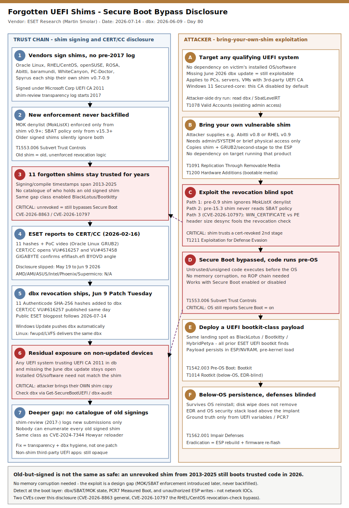

# Forgotten UEFI shims undermining Secure Boot: ESET's 11 Microsoft-signed bootloaders

## TL;DR

On 2026-07-14, ESET Research (Martin Smolar) disclosed that **11 old, Microsoft-signed UEFI shim bootloaders** (mostly shim v0.9 and below, from products such as Oracle Linux 7.2, RHEL/CentOS 7.2, openSUSE, ROSA Linux, Finland's Abitti exam software, baramundi Management Suite, WhiteCanyon/Blancco WipeDrive, Spyrus WTGCreator and PC-Doctor Service Center) let an attacker bypass UEFI Secure Boot on **any** system that trusts the "Microsoft Corporation UEFI CA 2011" third-party certificate — regardless of which OS or software is actually installed, because an attacker can bring their own copy of a vulnerable shim to any qualifying machine. ESET reported the findings to CERT/CC on 2026-02-16; Microsoft revoked the 11 binaries via a dbx update on its 2026-06-09 Patch Tuesday; ESET published the technical write-up five weeks later. Two CVEs cover the case — **CVE-2026-8863** for the general set of forgotten, un-tracked shims, and **CVE-2026-10797** for a decade-old bug specific to the RHEL/CentOS 7.2 shims, where the revocation check and the signature-verification function read the length of an Authenticode signature from two different PE structures, letting an attacker desync them and load a certificate-revoked second-stage bootloader anyway. This matters today because exploitation needs no memory-corruption primitive at all — only an old, still-trusted binary and the same tradecraft that already enabled BlackLotus, Bootkitty and HybridPetya — and because the root cause is structural: pre-2017 shim submissions were never catalogued, so nobody can say how many more forgotten-but-trusted binaries remain.

## Attribution and confidence

**Source:** ESET Research, Martin Smolar; blogpost published 2026-07-14 on WeLiveSecurity. **Coordinating body:** CERT/CC (Vijay Sarvepalli), Vulnerability Note VU#616257 (published 2026-06-09, updated 2026-07-14, "Microsoft-signed UEFI shim bootloaders vulnerable to Secure Boot bypass"). A related, separately tracked CERT/CC note, VU#457458 (published 2026-06-18, updated 2026-06-23, "Vendor-signed UEFI applications found vulnerable to Secure Boot bypass"), covers a BYOVD-style angle on vendor-signed UEFI shell/diagnostic binaries (for example GIGABYTE's `efiflash.efi`, which exposed `mm`/`setvar`/`dmpstore` commands for arbitrary pre-boot memory and NVRAM access); GIGABYTE confirmed its firmware does not embed a shim chain-of-trust but is removing `efiflash.efi` from BIOS packages regardless, since the underlying trust in the same Microsoft certificate remains. AMD, AMI, ASUSTeK, Intel, Phoenix Technologies and Supermicro told CERT/CC they are not affected by VU#457458; roughly 19 additional vendors (Acer, Amazon, Cisco, Dell, ECS, Emdoor, Fsas, Fujitsu, Gamma Tech, GETAC, Google, HPE, HP Inc., Lenovo, LVFS Project, Microsoft, Schenker, Toshiba, Uniwill) remained listed "Unknown" as of publication. **Confidence: high** — this is vendor-disclosed, CERT/CC-coordinated research with a published hash list, a working proof-of-concept video, and a confirmed dbx revocation date; there is no attribution uncertainty because there is no threat actor to attribute — this is a disclosure, not an observed intrusion.

| Overlap | Basis | Confidence |
|---|---|---|
| VU#616257 == CVE-2026-8863 / CVE-2026-10797 | CERT/CC note lists the exact 11 hashes and maps each to its CVE | high |
| VU#457458 relation | Same "Microsoft Corporation UEFI CA 2011" trust root, same coordinated-disclosure window, different binaries (UEFI shell utilities, not shims) | medium |
| Bootkit-deployment lineage | ESET explicitly names BlackLotus, Bootkitty and HybridPetya as the class of payload this bypass class enables | high |

**Genealogy with previous repo cases.** This is the repo's first primary case in slot #8 (supply chain HW/firmware) since the [Secure Boot 2011 certificate expiry / frozen-DBX case](../../06/2026-06-07_SecureBoot-2011-Cert-Expiry-Bootkit-Exposure/README.md) from 2026-06-07 (39 days ago, the longest primary gap of any taxonomy slot in the rotation). The two cases are complementary halves of the same trust-chain story: the June case is about a **calendar-driven** loss of the revocation channel itself (an expiring KEK freezes the dbx deny-list going forward), while this case is about a **historical** blind spot in what was ever added to that deny-list in the first place — old, forgotten, still-Microsoft-signed shims that predate the shim-review transparency process (2017-) and were simply never tracked for revocation. Where the June case's fix is "keep the revocation channel open," this case's fix is "know what needs revoking" — and both converge on the same operational answer: read the UEFI variables directly (db, dbx, SbatLevel), not the OS's "Secure Boot is on" boolean.

## Kill chain — summary table

| Stage | MITRE | Detail |
|---|---|---|
| Pre-condition: pre-2017 signing gap | (n/a — structural) | Vendors fork/sign their own shim (v0.7-0.9) years ago; no shim-review transparency log exists before 2017 |
| Pre-condition: enforcement gaps never backfilled | T1553.006 | MOK denylist (MokListX) enforcement only ships in shim v0.9+; SBAT policy enforcement only ships in shim v15.3+; older signed shims silently ignore both |
| Attacker targets any qualifying system | T1078 | Any UEFI system trusting "Microsoft Corporation UEFI CA 2011" in db, with the June 2026 dbx update missing, is exploitable regardless of installed OS/software |
| Attacker brings their own vulnerable shim | T1091, T1200 | Attacker copies one of the 11 (or any other pre-0.9/pre-15.3) Microsoft-signed shims plus a matching vulnerable second-stage to the target's ESP |
| Revocation blind spot exploited | T1211 | Old shim trusts a certificate-revoked GRUB2/second-stage binary because it never checks MokListX/SBAT (or, for CVE-2026-10797, because a tampered WIN_CERTIFICATE size desyncs the revocation check from the signature-verification function) |
| Secure Boot bypassed pre-OS | T1553.006 | Unsigned or certificate-revoked code executes before the OS with no memory-corruption exploit needed; OS still reports Secure Boot enabled |
| Bootkit deployment + below-OS persistence | T1542.003, T1014 | Same landing spot as BlackLotus, Bootkitty and HybridPetya: implant persists in the ESP/NVRAM, survives OS reinstall, loads before any OS-level control |
| Defense blinding | T1562.001 | EDR and the OS security stack initialize above the implant and cannot observe it |



The diagram's left lane traces the trust-chain and disclosure lifecycle (vendor signing, unpatched enforcement gaps, ESET's report, the dbx revocation, and the residual exposure on any device that has not applied it); the right lane traces what an attacker actually does with that gap — target any qualifying system, bring their own old shim, exploit the MOK/SBAT/CVE-2026-10797 blind spot, bypass Secure Boot, and deploy a bootkit-class payload. The critical anchors (red) are where the shim stays trusted for years without revocation and where the bypass actually executes pre-OS code — both are visible only if you read the UEFI variables directly, never from the OS "Secure Boot enabled" boolean.

## Stage-by-stage detail

### 1. The pre-2017 signing gap and enforcement features never backfilled

Every UEFI shim embeds a Microsoft signature plus a vendor certificate used to validate the next stage (usually GRUB 2). Signing and compilation timestamps across the 11 reported shims span **2013 to 2025**. Two shim security features were added well after many of these binaries were already signed and deployed, and — critically — neither was retroactively enforced against older signed shims:

- **MOK denylist (MokListX) enforcement** only shipped in shim **v0.9** (upstream commit `b8d1bc6`). A shim built before that version ignores MokListX entirely: even if an enterprise revokes a compromised certificate there, a pre-0.9 shim (for example the v0.8 shim signed for Finland's Abitti 1 exam software) still honors the old MOK allowlist and loads the "revoked" binary.
- **SBAT (Secure Boot Advanced Targeting) enforcement** only shipped in shim **v15.3**. Any earlier shim never reads the `SbatLevel` policy or inspects the `.sbat` metadata section of the binaries it loads, so it silently ignores every SBAT-based revocation issued after that shim was built.

Because Microsoft's own shim-signing program only became transparently logged with the **shim-review** repository in **2017**, nobody has a reliable inventory of how many pre-2017 shims remain validly signed and in circulation.

**MITRE:** T1553.006 — Subvert Trust Controls: Code Signing Policy Modification (structural precondition).

### 2. Known shim vulnerability: CVE-2026-10797 (RHEL/CentOS 7.2, shim v0.9)

Beyond the enforcement gaps, ESET documents a specific, previously un-CVE'd bug in shim v0.9 and below, now tracked as **CVE-2026-10797**. A signed PE binary records the length of its Authenticode signature in two places: the PE header's `IMAGE_DIRECTORY_ENTRY_SECURITY` data directory, and the signature's own `WIN_CERTIFICATE` structure. In the affected shims, the **revocation check** trusted the length from `WIN_CERTIFICATE`, while the **signature-verification function** trusted the length from the PE header. Tampering with `WIN_CERTIFICATE` desyncs the two: the revocation check compares dbx/MokListX against bogus data while the actual verification still succeeds against the real, valid — but certificate-revoked — signature. The bug was fixed upstream in shim commit `d241bbb` roughly a decade ago, with no CVE assigned until this report. It applies only to **certificate-based** revocations (not hash-based ones) of a second-stage bootloader signed by a certificate embedded in the shim itself.

**MITRE:** T1211 — Exploitation for Defense Evasion.

### 3. Proof-of-concept: Oracle Linux 7.1 shim + an old, unsigned-code-capable GRUB 2

ESET's demonstrated bypass needs no memory-corruption exploit at all. The Oracle Linux shim trusts binaries signed by an Oracle-issued certificate; one such binary is a GRUB 2 build from the Oracle Linux 7.1 installation ISO that still permits the `multiboot`/`multiboot2` GRUB commands to load an unsigned, arbitrary ELF-style kernel image — a bypass GRUB 2 should refuse in a Secure-Boot-compatible build. The entire exploit is: build a small multiboot2-compliant unsigned kernel image, copy it plus the old shim and old GRUB 2 to the target's EFI System Partition, and issue one GRUB 2 command at boot. ESET demonstrated this working with Secure Boot enabled, on a system without the June 2026 patches applied.

**MITRE:** T1091 — Replication Through Removable Media / T1200 — Hardware Additions (staging the attacker's shim and second-stage on the ESP, typically via bootable media or existing admin access).

### 4. dbx revocation and coordinated disclosure timeline

ESET reported its findings and a proof-of-concept to CERT/CC on **2026-02-16**. The dbx update and public-disclosure date was originally set for **2026-05-19** (Microsoft's May Patch Tuesday), then postponed to **2026-06-09** (June Patch Tuesday), where it ultimately shipped alongside CERT/CC's Vulnerability Note VU#616257. ESET's own technical blogpost followed five weeks later, on **2026-07-14**. Microsoft's UEFI certificate expiry track (Microsoft Corporation UEFI CA 2011 expiring 2026-06-27) does **not** solve this problem on its own: an expired certificate that stays in db and is not explicitly revoked in dbx by hash continues to validate everything it ever signed, which is why Microsoft kept signing new third-party submissions with the old certificate right up to its expiry date.

**MITRE:** (disclosure/remediation lifecycle — no attacker technique).

### 5. Deployment: this is how BlackLotus-class bootkits get in

ESET frames the impact explicitly: successful exploitation of any of these forgotten shims "enables attackers to deploy malicious UEFI bootkits" of the same class as **BlackLotus**, **Bootkitty** (the first UEFI bootkit for Linux) and **HybridPetya** — all prior ESET research. The forgotten-shim bypass is a **delivery mechanism** for that established payload class, not a new payload family in its own right; once pre-OS code execution is achieved, the attacker's next move is standard UEFI-bootkit tradecraft (ESP/NVRAM persistence, disabling OS-level integrity controls before they initialize).

**MITRE:** T1542.003 — Pre-OS Boot: Bootkit; T1014 — Rootkit; T1562.001 — Impair Defenses.

## Detection strategy

### Telemetry that matters

- **UEFI variable state, not the OS boolean.** `Get-SecureBootUEFI dbx` (Windows) or the `uefi-dbx-audit` script (Linux) against the 11 published Authenticode SHA-256 hashes is the only reliable way to confirm a device actually has the June 2026 revocation applied — the OS-reported "Secure Boot is enabled" flag says nothing about which certificates or hashes are trusted.
- **SbatLevel / SBAT policy state.** `HKLM\SYSTEM\CurrentControlSet\Control\SecureBoot\SBAT\SbatLevel` (Windows, read-only copy of the shim-enforced `SbatLevelRT`) shows which component generations are currently blocked; a device whose SBAT policy is stale is exposed to any shim built before that policy shipped.
- **Measured Boot / TPM PCR[7] and Windows System Guard / Secured-core attestation events.** A boot-policy change that a device's own reporting does not explain is the durable, below-OS tell for a successful bypass — the same anchor used against BlackLotus-class implants.
- **ESP write telemetry and new/changed EFI boot entries.** Because actual exploitation requires either physical access or an attacker who already has admin-level ability to write to the EFI System Partition, unauthorized writes to `\EFI\*.efi` and unexpected new Boot Manager entries (`bootmgr`/BCD changes) are the host-side signal — sourced from `Microsoft-Windows-Kernel-Boot` and file/registry auditing on a mounted ESP.
- **No network C2 telemetry applies.** This is a boot-chain trust disclosure, not an active campaign with observed infrastructure — there is nothing to hunt for on the wire beyond the update-channel integrity notes below.

### Detection coverage

| Engine | File | Logic |
|---|---|---|
| Sigma (registry_set) | [01_sbat_secureboot_state_tamper.yml](./sigma/01_sbat_secureboot_state_tamper.yml) | SbatLevel / SecureBoot state registry values changed by a non-servicing process |
| Sigma (file_event) | [02_esp_efi_write_non_servicing.yml](./sigma/02_esp_efi_write_non_servicing.yml) | Write of a shim/bootloader `.efi` component to a mounted ESP by a non-servicing process |
| Sigma (process_creation) | [03_boot_integrity_disable_commands.yml](./sigma/03_boot_integrity_disable_commands.yml) | `bcdedit`/`mokutil` boot-integrity-disable command lines |
| KQL (DeviceFileEvents) | [esp_efi_write_non_servicing.kql](./kql/esp_efi_write_non_servicing.kql) | Non-servicing ESP `.efi` writes across the fleet |
| KQL (DeviceRegistryEvents) | [sbat_secureboot_registry_change.kql](./kql/sbat_secureboot_registry_change.kql) | SbatLevel / SecureBoot registry state changes |
| KQL (DeviceProcessEvents) | [boot_integrity_disable_commandline.kql](./kql/boot_integrity_disable_commandline.kql) | Boot-integrity-disable command lines (bcdedit nointegritychecks/testsigning, mokutil --disable-validation) |
| KQL (SecurityEvent) | [secureboot_state_registry_4657.kql](./kql/secureboot_state_registry_4657.kql) | Sentinel Event ID 4657 registry-value-change fallback for the same state keys |
| YARA (3 rules) | [forgotten_shim_revoked_hashes.yar](./yara/forgotten_shim_revoked_hashes.yar) | Authenticode SHA-256 hash match against the 11 published revoked shims (CVE-2026-8863 set, CVE-2026-10797 set, combined) |
| Suricata (5 sids) | [uefi_dbx_update_channel.rules](./suricata/uefi_dbx_update_channel.rules) | Update-channel integrity notes (fwupd/LVFS cleartext, unsigned `.efi` transfer) — explicitly scoped, no live C2 to signature |

### Threat hunting hypotheses

- **H1 — fleet-wide dbx/SBAT revocation gap.** Enumerate devices missing the June 2026 dbx update or running a stale SBAT policy against the 11 published hashes. See [peak_h1_dbx_sbat_revocation_gap.md](./hunts/peak_h1_dbx_sbat_revocation_gap.md).
- **H2 — unauthorized ESP write followed by a boot-policy change.** Correlate a non-servicing ESP `.efi` write with a subsequent PCR[7]/Measured Boot policy change. See [peak_h2_esp_write_then_pcr7_change.md](./hunts/peak_h2_esp_write_then_pcr7_change.md).
- **H3 — boot-integrity-disable commands on hosts with no known driver-development purpose.** `bcdedit /set nointegritychecks on`, `bcdedit /set testsigning on`, `mokutil --disable-validation` outside an allowlisted developer population. See [peak_h3_boot_integrity_disable_commands.md](./hunts/peak_h3_boot_integrity_disable_commands.md).

## Incident response playbook

### First 60 minutes (triage)

1. Confirm whether the affected device(s) have the June 2026 dbx update applied: run the ESET-published PowerShell hash check (or `uefi-dbx-audit` on Linux) against the 11 Authenticode SHA-256 hashes.
2. If a bypass is suspected (not just a missing-patch audit), do **not** reboot the device — capture the current UEFI variable state (`Get-SecureBootUEFI db`, `dbx`, `KEK`, `SbatLevelRT`) before any further boot cycle can re-arm a staged payload.
3. Inventory the EFI System Partition for unexpected `.efi` files, timestamps inconsistent with the last known-good servicing event, and any shim/GRUB 2 binaries not matching the vendor's current signed release.
4. Check PCR[7] Measured Boot state and any Windows System Guard / Secured-core attestation alerts for the host.
5. Scope: query fleet-wide for devices missing the dbx update, for any hosts running the enumerated affected products (Oracle Linux 7.2, RHEL/CentOS 7.2, openSUSE, ROSA, Abitti, baramundi Management Suite up to 2024R1, WhiteCanyon/Blancco WipeDrive 8.0.0-8.1.3, PC-Doctor Service Center 15/16, Spyrus WTGCreator), and for any host exposing the GIGABYTE `efiflash.efi`-class UEFI shell utility (VU#457458).

### Artifacts to collect

| Artifact | Path | Tool | Why |
|---|---|---|---|
| UEFI dbx/db/KEK/SbatLevel state | UEFI runtime variables | `Get-SecureBootUEFI` (PowerShell), `uefi-dbx-audit` (Linux) | Ground truth — the OS Secure Boot boolean is not sufficient |
| EFI System Partition contents | Mounted ESP, `\EFI\` tree | `mountvol`, file hashing, EZ Tools/forensic imaging | Detect staged/replaced shim, GRUB 2, or bootmgr components |
| SBAT registry state | `HKLM\SYSTEM\CurrentControlSet\Control\SecureBoot\SBAT\SbatLevel` | Registry export | Confirms the enforced SBAT generation floor |
| Measured Boot / PCR log | TPM event log (WBCL) | `tpmtool getdeviceinformation`, PCR7 readout | Below-OS evidence of a boot-policy change |
| Patch/update status | WSUS/Intune/fwupd/LVFS records | Endpoint management console | Confirms whether the June 2026 dbx update reached the device |

### IR queries and commands

```powershell
# ESET's published dbx hash check (run elevated)
$hashes = 'AE75F0D82BA3DF824FBFC69340CC3B4D66C598373B1AB54CDB6C8BFD83A6B961',
  '7B2A3F5C96F95BD8086CE54B0825E300F9C8F11FE3401BB631B3215C8DE9EB10',
  'EB86FA1386FE6E4533B8B938DCC1250616D2F1C14C15E2FCF80834A161018A0A',
  'FD23D6E57DE6F4E1F9D7118DA1C5F31A8AF6BE5E5D9E8170F9493447268D50C5',
  'A0DE9333442C1BF9349A460141AE5E80F911955C6506040FA3D021BF6C1AE3E4',
  '95B6D71FC0C0F8C5E1533A37AEF92CF6B0C961E2CC612A97117FA6759CE5FC06',
  '236A9CB0D71951C36398A32EB660CE2CD4A52CCFA7CF751CC6A35D9DE549E19B',
  '5E594C448760A3135B1A3A83E07A4F2E6FBE49414EF2C7CAB1CBA77F284FA63B',
  '8A964D5F8373948D20A1D4296FB92E545DAD4617A0C810F3B934B53D98AE8963',
  '410260B1B6F5AF5FBEEB9EA3220658435E876CB3247126EE907A437F312DB373',
  '96275DFD6282A522B011177EE049296952AC794832091F937FBBF92869028629'
$dbx = [BitConverter]::ToString((Get-SecureBootUEFI dbx).Bytes) -replace '-'
$notRevoked = $hashes | Where-Object { $dbx -notmatch $_ }
if ($notRevoked) { $notRevoked | ForEach-Object { "Hash not revoked: $_" } } else { "All hashes revoked in dbx!" }

# Read the enforced SBAT policy floor
Get-ItemProperty -Path 'HKLM:\SYSTEM\CurrentControlSet\Control\SecureBoot\SBAT' -Name SbatLevel
```

```bash
# Linux dbx/SBAT audit (companion to the PowerShell check above)
git clone https://github.com/sei-vsarvepalli/uefi-dbx-audit
python3 uefi-dbx-audit/uefi_dbx_audit.py
mokutil --list-enrolled 2>/dev/null | grep -i "abitti\|oracle\|rosa\|opensuse"
```

```kql
// Fleet-wide: devices whose reported Secure Boot state has never confirmed the June 2026 dbx refresh
DeviceTvmSoftwareInventory
| where SoftwareName has_any ("shim", "grub2", "grub-efi")
| project DeviceName, SoftwareName, SoftwareVersion
| join kind=leftouter (DeviceInfo | project DeviceName, OSPlatform) on DeviceName
```

### Containment, eradication, recovery

- **Contain:** isolate any host confirmed to be missing the dbx update AND showing an unexplained ESP write or PCR[7] change; do not reboot a suspected-compromised host before capturing UEFI variable state.
- **Eradicate:** apply the June 2026 dbx update (Windows Update / OEM firmware update / fwupd-LVFS for Linux); if a bypass is confirmed, rebuild the ESP from known-good media **and** re-flash OEM firmware — an OS reimage alone does not remove a below-OS implant.
- **Recover:** re-verify the full db/dbx/KEK/SbatLevel state post-remediation; re-enroll any legitimate custom MOKs the organization depends on with current, non-vulnerable signing tooling.
- **Exit criteria:** `Get-SecureBootUEFI dbx` (or `uefi-dbx-audit`) confirms all 11 hashes revoked; no ESP files fail hash verification against known-good vendor releases; PCR[7] is stable across a clean reboot cycle.
- **What NOT to do:** do not treat "Secure Boot: On" in the OS as evidence of anything — it is not; do not assume a device is safe just because its installed OS/software is unrelated to the 11 named products — the bypass works with an attacker-supplied shim regardless of what is actually installed; do not skip the firmware re-flash step on a confirmed bootkit and call an OS reimage sufficient.

### Recovery validation

Re-run the ESET PowerShell dbx check (or `uefi-dbx-audit`) and confirm `"All hashes revoked in dbx!"`; confirm `SbatLevel` reflects the current shim policy floor; confirm PCR[7] Measured Boot values are stable and expected across a reboot; confirm no `.efi` binary on the ESP fails hash verification against the vendor's current signed release.

## IOCs

Top indicators (full list in [iocs.csv](./iocs.csv)). **No CVE on CISA KEV as of this entry:** neither CVE-2026-8863 nor CVE-2026-10797 appears in the CISA Known Exploited Vulnerabilities catalog (checked live against catalogVersion 2026.07.16; see [kev.md](./kev.md) for the generated cross-reference) — this is a coordinated disclosure with a shipped fix, not a confirmed active-exploitation campaign, so absence from KEV is expected at this stage and should be re-checked, not assumed permanent.

| Type | Value | Context | Confidence | Source |
|---|---|---|---|---|
| cve | CVE-2026-8863 | General case CVE covering the reported forgotten/un-tracked shims | high | ESET (2026-07-14) / CERT/CC VU#616257 |
| cve | CVE-2026-10797 | RHEL/CentOS 7.2 shim v0.9 revocation-check bypass (WIN_CERTIFICATE vs PE header size desync) | high | ESET (2026-07-14) / CERT/CC VU#616257 |
| sha256 | AE75F0D82BA3DF824FBFC69340CC3B4D66C598373B1AB54CDB6C8BFD83A6B961 | Revoked UEFI shim Authenticode hash (Spyrus WTGCreator, shim <=0.7); dbx June 2026 Patch Tuesday | high | ESET / CERT/CC VU#616257 |
| sha256 | 7B2A3F5C96F95BD8086CE54B0825E300F9C8F11FE3401BB631B3215C8DE9EB10 | Revoked UEFI shim Authenticode hash (RHEL 7.2, shim 0.9, CVE-2026-10797); dbx June 2026 Patch Tuesday | high | ESET / CERT/CC VU#616257 |
| sha256 | EB86FA1386FE6E4533B8B938DCC1250616D2F1C14C15E2FCF80834A161018A0A | Revoked UEFI shim Authenticode hash (CentOS 7.2, shim 0.9, CVE-2026-10797); dbx June 2026 Patch Tuesday | high | ESET / CERT/CC VU#616257 |
| sha256 | FD23D6E57DE6F4E1F9D7118DA1C5F31A8AF6BE5E5D9E8170F9493447268D50C5 | Revoked UEFI shim Authenticode hash (baramundi Management Suite up to 2024R1); dbx June 2026 Patch Tuesday | high | ESET / CERT/CC VU#616257 |
| sha256 | A0DE9333442C1BF9349A460141AE5E80F911955C6506040FA3D021BF6C1AE3E4 | Revoked UEFI shim Authenticode hash (WhiteCanyon/Blancco WipeDrive 8.0.0-8.1.3); dbx June 2026 Patch Tuesday | high | ESET / CERT/CC VU#616257 |
| sha256 | 95B6D71FC0C0F8C5E1533A37AEF92CF6B0C961E2CC612A97117FA6759CE5FC06 | Revoked UEFI shim Authenticode hash (Abitti 1, Finland Matriculation Examination Board); dbx June 2026 Patch Tuesday | high | ESET / CERT/CC VU#616257 |
| sha256 | 236A9CB0D71951C36398A32EB660CE2CD4A52CCFA7CF751CC6A35D9DE549E19B | Revoked UEFI shim Authenticode hash (ROSA Linux R10/R9); dbx June 2026 Patch Tuesday | high | ESET / CERT/CC VU#616257 |
| sha256 | 5E594C448760A3135B1A3A83E07A4F2E6FBE49414EF2C7CAB1CBA77F284FA63B | Revoked UEFI shim Authenticode hash (Oracle Linux 7.2); dbx June 2026 Patch Tuesday | high | ESET / CERT/CC VU#616257 |
| sha256 | 8A964D5F8373948D20A1D4296FB92E545DAD4617A0C810F3B934B53D98AE8963 | Revoked UEFI shim Authenticode hash (PC-Doctor Service Center 15/16); dbx June 2026 Patch Tuesday | high | ESET / CERT/CC VU#616257 |
| regkey | HKLM\SYSTEM\CurrentControlSet\Control\SecureBoot\SBAT\SbatLevel | OS-readable copy of the shim-enforced SBAT revocation policy floor | medium | ESET (2026-07-14) |
| path | \EFI\<vendor>\shimx64.efi | Shim location on the ESP; compare hash against vendor's current signed release | high | ESET / CERT/CC VU#616257 |
| note | Full 11-hash set, remaining vendor/product mapping, VU#457458 BYOVD-class binaries, and "no on-the-wire C2" explanation | See iocs.csv for the complete list; this disclosure has no network indicator set | high | ESET / CERT/CC |

## Secondary findings

- **runZero: 7 vulnerabilities in FatFs, a single-maintainer filesystem library embedded across firmware ecosystems** (Espressif ESP-IDF, STMicro STM32Cube, Zephyr, MicroPython, ArduPilot, RT-Thread, Mbed, Samsung TizenRT, SWUpdate). The worst is a FAT32-mount integer overflow (CVSS 7.6, memory corruption/code execution) reachable through some firmware-update flows, not just physical media; six of the seven bugs still have no upstream fix because the maintainer has not responded to runZero or JPCERT/CC outreach. Notably, runZero found these bugs by pointing an AI coding assistant at code it had manually audited in 2017 and found nothing — the same AI-assisted-discovery pattern now surfacing across firmware supply-chain debt.
- **Wiz Research "GhostApproval": a symlink-based approval-dialog bypass across six AI coding assistants** (Amazon Q Developer, Claude Code, Augment, Cursor, Google Antigravity, Windsurf). A malicious repo's symlink makes the approval dialog show a benign filename while the actual write lands on a sensitive file such as `~/.ssh/authorized_keys` or `~/.zshrc`. Three of six vendors shipped fixes; Anthropic disputes the classification as a bug. The same symlink-and-approval pattern was independently found in May by Adversa AI ("SymJack") against a different but overlapping set of agents — two independent research teams finding the same design gap points to a shared class of AI-dev-tooling weakness, not one vendor's slip.
- **AsyncAPI GitHub Actions OIDC compromise (2026-07-14): attacker abused CI trust, not stolen tokens.** An attacker gained push access to four core AsyncAPI repositories and published five trojanized npm packages carrying a "Miasma"-family botnet loader, entirely by pushing commits under a placeholder identity and letting each repository's own legitimate release workflow publish via npm's GitHub OIDC trusted-publisher integration — valid SLSA provenance attestations included. No npm token was ever stolen. This illustrates the same theme as the shim disclosure at a different layer of the stack: trust that was never revisited (an old signed binary; a CI pipeline's publish authority) becomes the attack surface once nobody is actively re-verifying it.

## Pedagogical anchors

- **"Signed" is a point-in-time claim, not an ongoing guarantee.** A binary that was legitimately signed in 2013 is still valid today unless someone explicitly revokes it — and revocation only works against things that were ever catalogued in the first place. Trust chains need an inventory, not just a signature check.
- **No memory corruption needed.** This entire bypass class works because of a *design* gap (enforcement features that were never made retroactive), not a buffer overflow. Detection engineering has to cover logic/trust bugs, not just memory-safety bugs.
- **Read the ground truth, not the summary.** The OS "Secure Boot is on" boolean, like a KEV-absence, tells you nothing about what is actually trusted underneath it. Query the UEFI variables (db, dbx, SbatLevel) directly, the same discipline that applies to checking CISA KEV before assuming "no CVE listed" means "not exploited."
- **A disclosure with a shipped fix still needs an audit, not just a patch note.** The June 2026 dbx update fixes devices that receive it; it does nothing for devices that do not, and does nothing about the transparency gap ESET identifies for pre-2017 shims that were never part of this report at all.

## What's in this folder

| File | Purpose | Link |
|---|---|---|
| README.md | This write-up. | [README.md](./README.md) |
| kill_chain.svg | Two-lane kill-chain diagram (trust-chain/disclosure lifecycle vs attacker exploitation path). | [kill_chain.svg](./kill_chain.svg) |
| kev.md | CISA KEV cross-reference for this case's CVEs. | [kev.md](./kev.md) |
| iocs.csv | Full indicator list (11 Authenticode hashes, 2 CVEs, SBAT/ESP paths, no-C2 notes). | [iocs.csv](./iocs.csv) |
| sigma/01_sbat_secureboot_state_tamper.yml | SbatLevel/SecureBoot registry tamper. | [file](./sigma/01_sbat_secureboot_state_tamper.yml) |
| sigma/02_esp_efi_write_non_servicing.yml | Non-servicing ESP `.efi` write. | [file](./sigma/02_esp_efi_write_non_servicing.yml) |
| sigma/03_boot_integrity_disable_commands.yml | Boot-integrity-disable command lines. | [file](./sigma/03_boot_integrity_disable_commands.yml) |
| kql/esp_efi_write_non_servicing.kql | Fleet-wide non-servicing ESP writes. | [file](./kql/esp_efi_write_non_servicing.kql) |
| kql/sbat_secureboot_registry_change.kql | SbatLevel/SecureBoot registry changes. | [file](./kql/sbat_secureboot_registry_change.kql) |
| kql/boot_integrity_disable_commandline.kql | Boot-integrity-disable command lines. | [file](./kql/boot_integrity_disable_commandline.kql) |
| kql/secureboot_state_registry_4657.kql | Sentinel Event ID 4657 fallback. | [file](./kql/secureboot_state_registry_4657.kql) |
| yara/forgotten_shim_revoked_hashes.yar | Hash-match rules against the 11 revoked shims (3 rules). | [file](./yara/forgotten_shim_revoked_hashes.yar) |
| suricata/uefi_dbx_update_channel.rules | Update-channel integrity notes (5 sids, explicitly scoped). | [file](./suricata/uefi_dbx_update_channel.rules) |
| hunts/peak_h1_dbx_sbat_revocation_gap.md | H1 hunt. | [file](./hunts/peak_h1_dbx_sbat_revocation_gap.md) |
| hunts/peak_h2_esp_write_then_pcr7_change.md | H2 hunt. | [file](./hunts/peak_h2_esp_write_then_pcr7_change.md) |
| hunts/peak_h3_boot_integrity_disable_commands.md | H3 hunt. | [file](./hunts/peak_h3_boot_integrity_disable_commands.md) |

## Sources

- [ESET Research — Forgotten UEFI shims undermining Secure Boot](https://www.welivesecurity.com/en/eset-research/forgotten-uefi-shims-undermining-secure-boot/)
- [CERT/CC — VU#616257: Microsoft-signed UEFI shim bootloaders vulnerable to Secure Boot bypass](https://kb.cert.org/vuls/id/616257)
- [CERT/CC — VU#457458: Vendor-signed UEFI applications found vulnerable to Secure Boot bypass](https://kb.cert.org/vuls/id/457458)
- [The Hacker News — 11 Old Microsoft-Signed Linux UEFI Shims Found Vulnerable to Secure Boot Bypass](https://thehackernews.com/2026/07/11-old-microsoft-signed-linux-uefi.html)
- [The Hacker News — Unpatched Flaws Disclosed in Filesystem Bundled Into Millions of Embedded Devices](https://thehackernews.com/2026/07/unpatched-flaws-disclosed-in-filesystem.html)
- [The Hacker News — GhostApproval Symlink Flaws Could Let Malicious Repos Run Code in AI Coding Agents](https://thehackernews.com/2026/07/ghostapproval-symlink-flaws-could-let.html)
- [The Hacker News — Compromised AsyncAPI npm Packages Deliver Multi-Stage Botnet Malware](https://thehackernews.com/2026/07/compromised-asyncapi-npm-packages.html)
- [ESET — BlackLotus UEFI bootkit: Myth confirmed](https://www.welivesecurity.com/2023/03/01/blacklotus-uefi-bootkit-myth-confirmed/)
- [ESET — Bootkitty: Analyzing the first UEFI bootkit for Linux](https://www.welivesecurity.com/en/eset-research/bootkitty-analyzing-first-uefi-bootkit-linux/)
- [ESET — Introducing HybridPetya: Petya/NotPetya copycat with UEFI Secure Boot bypass](https://www.welivesecurity.com/en/eset-research/introducing-hybridpetya-petya-notpetya-copycat-uefi-secure-boot-bypass/)
