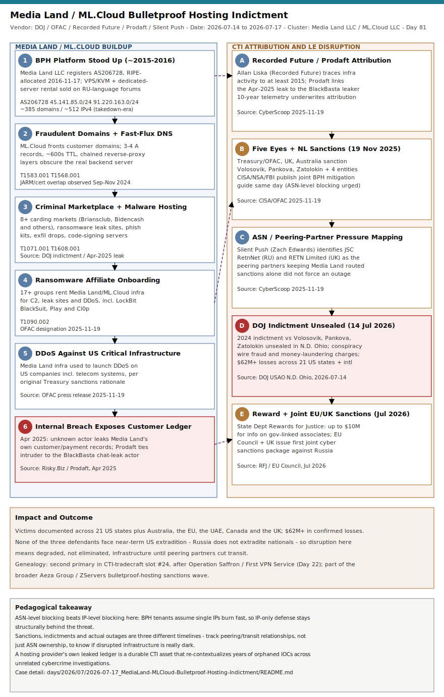

# Yalishanda Unmasked: DOJ Unseals the Media Land / ML.Cloud Bulletproof Hosting Indictment

## TL;DR

On 14 July 2026 the U.S. Department of Justice unsealed a December 2024 indictment against three Russian nationals — Aleksandr Volosovik ("Yalishanda"), Yulia Pankova and Kirill Zatolokin — and their two bulletproof hosting (BPH) companies, Media Land LLC and ML.Cloud LLC, charging conspiracy to commit computer fraud, wire fraud and money laundering tied to more than $62 million in documented losses across 21 U.S. states plus victims in Australia, the EU, the UAE, Canada and the UK. This is a CTI tradecraft case, not an intrusion case: the "kill chain" here is a decade of infrastructure-enablement (VPS rental, fraudulent domain registration, fast-flux DNS, criminal-marketplace hosting) followed by a multi-year attribution and disruption campaign — Recorded Future tracing the operation to at least 2015, an April 2025 internal breach that leaked Media Land's own customer ledger, November 2025 Five Eyes sanctions, and now the unsealed indictment plus a $10M Rewards for Justice bounty. It matters today because Media Land/ML.Cloud (AS206728) is documented as having armed at least 17 ransomware and cybercrime groups — including LockBit, BlackSuit, Play and Cl0p — making this the clearest recent example of the "disrupt the enabler, not just the operator" doctrine that CISA, Treasury and the FBI have been pushing since the November 2025 bulletproof-hosting mitigation guide.

## Attribution and confidence

**Entity: Media Land LLC / ML.Cloud LLC ("Yalishanda" bulletproof hosting cluster).** Confidence: **high** on ownership/operator identity (DOJ indictment, OFAC designation and a corroborating April 2025 data leak all converge); **medium** on the full scope of current live infrastructure (BPH operators rotate ASN/IP space rapidly post-disruption, per Spamhaus).

- **Principals:** Aleksandr Alexandrovich Volosovik (43), alias "Yalishanda" on Russian-language cybercrime forums, general director and owner of Media Land LLC; Yulia Vladimirovna Pankova (29), owner of ML.Cloud LLC, handled legal/financial matters; Kirill Andreevich Zatolokin (34), collected customer payments and coordinated service delivery. All three resided in St. Petersburg, Russia as of the 2024 indictment.
- **Sister entities:** Media Land Technology and Data Center Kirishi (both sanctioned alongside Media Land/ML.Cloud in November 2025).
- **Vendor/date convergence:** Recorded Future (Allan Liska) — infrastructure activity traced back to at least 2015; Prodaft — attributed the April 2025 Media Land internal leak to the same actor who had leaked BlackBasta's internal chat logs in February 2025; U.S. Treasury/OFAC, UK and Australia — joint sanctions 19 November 2025; DOJ (N.D. Ohio, USAO) — indictment unsealed 14 July 2026; U.S. Department of State Rewards for Justice — up to $10M reward announced 14 July 2026; Council of the European Union — joint EU/UK cyber sanctions package, week of 13 July 2026.
- **Overlap table:**

| Vendor/Source | Date | Claim | Confidence contribution |
|---|---|---|---|
| Recorded Future | ongoing (cited Nov 2025) | Infrastructure activity since 2015; used by LockBit, BlackSuit, Play | High — 10-year telemetry history |
| Prodaft | Apr 2025 | Media Land internal leak same actor as BlackBasta chat leak | Medium — inferred from tooling/TTP overlap, not confirmed |
| U.S. Treasury/OFAC + UK + Australia | 19 Nov 2025 | Sanctions naming Volosovik, Pankova, Zatolokin, Media Land, ML.Cloud, Media Land Technology, Data Center Kirishi | High — formal designation |
| DOJ / USAO N.D. Ohio | 14 Jul 2026 | Criminal indictment (originally filed Dec 2024) unsealed; conspiracy/wire fraud/money laundering | High — charging document |
| Silent Push (Zach Edwards) | Nov 2025 | Peering partners JSC RetnNet (RU) and RETN Limited (UK) keep Media Land reachable post-sanctions | Medium — ASN/peering inference |

- **Genealogy with previous repo cases:** This is the repo's second primary in taxonomy slot **#24 CTI tradecraft**, after **Day 22 — [Operation Saffron / First VPN Service takedown](../../05/2026-05-24_OperationSaffron-FirstVPN-Takedown/README.md)** (2026-05-24). Both cases document the same 2025-2026 policy shift toward "disrupt the enabler" — anonymization/hosting infrastructure feeding a broad ransomware customer base — rather than chasing individual ransomware affiliates. Media Land/ML.Cloud is a harder target than First VPN Service: it is a *registered, sanctioned, and now-indicted* Russian commercial entity rather than a single dark-web-marketed VPN, and its principals remain outside U.S. extradition reach. No prior repo case names Media Land, ML.Cloud, Yalishanda, Aeza Group or ZServers specifically — this is the repo's first dedicated bulletproof-hosting-provider case. It sits alongside a broader current pattern of infrastructure-enabler takedowns this repo has tracked in 2026 (RoboVPN/Vo1d-Popa residential proxy botnet, Day 55), though that case targeted consumer-device proxy botnets rather than commercial BPH VPS/reseller infrastructure and shares no actor overlap with Media Land.

## Kill chain — summary table

| Stage | MITRE | Detail |
|---|---|---|
| 1. BPH platform stood up | T1583.003, T1583.004 | Media Land LLC registers AS206728 (RIPE, allocated 2016-11-17); VPS/KVM and dedicated-server bulletproof hosting sold on Russian-language forums from ~2015 |
| 2. Fraudulent domain registration + fast-flux | T1583.001, T1568.001 | ML.Cloud/Media Land register/front domains for customers; rapid A-record rotation and chained reverse proxies obscure true backend location |
| 3. Criminal marketplace + malware hosting | T1071.001, T1608.001 | Media Land servers host 8+ major stolen-card marketplaces (Briansclub, Bidencash and others) plus malware C2, ransomware leak sites, phishing kits and code-signing infrastructure |
| 4. Ransomware affiliate onboarding | T1090.002 | 17+ ransomware/e-crime groups (LockBit, BlackSuit, Play, Cl0p among them) rent Media Land/ML.Cloud infrastructure for C2, DDoS and extortion-site hosting |
| 5. Internal breach exposes customer ledger | — (defender-side event) | April 2025: unknown actor (Prodaft-linked to the BlackBasta chat leaker) exfiltrates Media Land's own internal records — customer identities, services purchased, payment trails |
| 6. Five Eyes sanctions + mitigation guidance | — (disruption action) | 19 Nov 2025: Treasury/OFAC, UK, Australia sanction Volosovik, Pankova, Zatolokin and four entities; CISA/NSA/Five Eyes + Netherlands publish a joint bulletproof-hosting mitigation guide |
| 7. Indictment unsealed + reward + EU sanctions | — (disruption action) | 14 Jul 2026: 2024 indictment unsealed (N.D. Ohio); $10M Rewards for Justice bounty; EU Council + UK issue a joint follow-on sanctions package |



The diagram uses Template B (two-lane + bottom band), because this case is a CTI/law-enforcement disruption narrative rather than a single-victim intrusion: the left lane tracks Media Land's decade-long buildup as a commercial BPH platform, the right lane tracks the parallel attribution-and-disruption effort (Recorded Future/Prodaft telemetry, Five Eyes sanctions, Silent Push peering analysis, the unsealed indictment), and the bottom band summarizes victim scope and the "infrastructure survives sanctions until peering partners cut it off" reality that CTI analysts must track post-action.

## Stage-by-stage detail

### Stage 1 — BPH platform stood up (T1583.003, T1583.004)

Media Land LLC was registered in St. Petersburg and began advertising bulletproof VPS and dedicated-server hosting on Russian-language cybercrime forums around 2015, per Recorded Future's decade-long infrastructure telemetry. Its autonomous system, **AS206728**, was allocated by RIPE NCC on **2016-11-17** and remains registered to "Media Land LLC" as of this writing. As of the takedown period the ASN hosted approximately 385 domains across roughly 512 IPv4 addresses, spread over RPKI-valid netblocks including:

```
45.141.85.0/24    (256 IPs, RPKI valid, Media Land LLC)
91.220.163.0/24   (256 IPs, RPKI valid, Media Land LLC)
```

Sample announced hosts observed in the ASN (Moscow, RU geolocation): `91.220.163.1`, `91.220.163.6`, `45.141.85.1`. Media Land's public-facing brand for VPS/KVM ordering has operated under domains including `ml[.]cloud` (ML.Cloud LLC, Pankova's entity). This is the classic BPH commercial model: rent from Media Land, pay via cryptocurrency or Russian payment processors, receive a VPS with no abuse-report enforcement.

### Stage 2 — Fraudulent domain registration + fast-flux (T1583.001, T1568.001)

Per DOJ and OFAC filings, Media Land and ML.Cloud offered fraudulent domain registration on customers' behalf and "sophisticated fast-flux services that make identifying and tracing IP addresses difficult." This mirrors the broader BPH modus operandi Spamhaus has tracked since 2019: customer domains resolve via 3-4 A records with short (600-second) TTLs, backed by chained reverse-proxy layers so that taking down one front-end IP does almost nothing to the underlying operation. Independent JARM/SSL-certificate-fingerprint research (September-November 2024) found IP addresses across nominally unrelated netblocks sharing identical JARM hashes and certificates, evidence of centralized control consistent with a single BPH operator's reverse-proxy fleet.

### Stage 3 — Criminal marketplace + malware hosting (T1071.001, T1608.001)

DOJ materials describe Media Land's servers as having hosted at least eight major stolen-payment-card marketplaces active in 2023 (Briansclub, Bidencash, Cardhouse, Club2crd, crdclub, Fullzinfo, Swipestore, Verified), alongside malware command-and-control servers, ransomware data-leak sites, phishing kits, data-exfiltration drop servers and "malicious code-signing systems" per the Prodaft-sourced April 2025 leak analysis. None of this required Media Land to write malware itself — it sold the hosting layer that let dozens of unrelated criminal operations stay online.

### Stage 4 — Ransomware affiliate onboarding (T1090.002)

OFAC's designation and the DOJ indictment both name **LockBit, BlackSuit and Play** as ransomware operations that relied on Media Land/ML.Cloud infrastructure; follow-on reporting puts the total customer roster at **17+ ransomware and cybercrime groups**, including Cl0p. Media Land's infrastructure was also used to launch DDoS attacks against U.S. companies and critical infrastructure, including telecommunications systems, per Treasury's original sanctions rationale.

### Stage 5 — Internal breach exposes customer ledger (April 2025)

In April 2025 an unnamed hacker (or group) leaked internal Media Land records — customer identities, services purchased, and in some cases payment trails — dated as recent as February 2025. Threat-intel firm Prodaft assessed the intruder was the same actor who had leaked BlackBasta's internal chat logs roughly two months earlier, though at time of writing it remains unclear whether the BlackBasta compromise led to the Media Land breach or vice versa. Yalishanda confirmed on an underground forum that Media Land was "dealing with a technical issue." This leak is now cited by researchers as a foundational dataset for correlating historical IOCs back to Media Land-hosted infrastructure and de-anonymizing operators across unrelated cybercrime campaigns.

### Stage 6 — Five Eyes sanctions + mitigation guidance (19 November 2025)

The U.S. Treasury (OFAC), UK and Australia jointly sanctioned Volosovik, Pankova, Zatolokin, Media Land LLC, ML.Cloud LLC, Media Land Technology and Data Center Kirishi. The same day, CISA, NSA, the FBI and Five Eyes/Netherlands partners published a joint mitigation guide (*Bulletproof Defense: Mitigating Risks from Bulletproof Hosting Providers*) recommending ASN-level blocklisting (not just IP-level) precisely because BPH operators cycle IP space faster than IP blocklists can keep up. Silent Push's Zach Edwards noted at the time that Media Land's infrastructure would remain reachable until its peering partners — **JSC RetnNet** (Russia-based) and **RETN Limited** (UK-based ISP) — cut transit, illustrating that sanctions alone rarely produce an immediate outage for BPH infrastructure integrated into legitimate transit relationships.

### Stage 7 — Indictment unsealed + reward + EU sanctions (July 2026)

On 14 July 2026, the previously-sealed December 2024 federal indictment was unsealed in the Northern District of Ohio, charging Volosovik, Pankova and Zatolokin with conspiracy to commit and aid computer fraud, conspiracy to commit wire fraud, wire fraud, and conspiracy to commit money laundering. U.S. Attorney David M. Toepfer noted victims spanning banks, schools, government entities, hospitals and media companies across more than 20 states. The State Department's Rewards for Justice program simultaneously announced a reward of up to **$10 million** for information on foreign-government-linked associates of the defendants. That same week, the Council of the European Union announced a joint sanctions package with the UK against Media Land, ML.Cloud and Volosovik — the first joint EU-UK cyber sanctions action against Russia. None of the three defendants are expected to be extradited; Russia does not extradite its nationals, though FBI officials note that high-value suspects have been apprehended when they travel to countries with U.S. extradition agreements.

## Detection strategy

### Telemetry that matters

- **Network:** Sysmon Event ID 3 (network connection), firewall/proxy egress logs, NetFlow/IPFIX records capable of CIDR-based matching against sanctioned netblocks.
- **DNS:** Recursive resolver query logs capable of surfacing short-TTL, multi-A-record fast-flux patterns; passive DNS history for domains that have historically resolved into AS206728 space.
- **Defender XDR / Sentinel:** `DeviceNetworkEvents`, `DeviceProcessEvents` (for tunneling/reverse-proxy tool execution), `DeviceDnsEvents` where available.
- **Cloud/edge:** Proxy and secure web gateway logs capable of flagging HTTP `CONNECT` tunneling toward the sanctioned ranges.

### Detection coverage

| Engine | File | Logic |
|---|---|---|
| Sigma | `sigma/network_connection_medialand_netblock_egress.yml` | Outbound connection from a monitored host to Media Land LLC (AS206728) netblocks `45.141.85.0/24` / `91.220.163.0/24` |
| Sigma | `sigma/network_connection_proxy_tunnel_to_medialand.yml` | Proxy/gateway log connection using CONNECT-style tunneling toward Media Land-associated destination ports (80/443/8080/1080) within the sanctioned netblocks |
| Sigma | `sigma/process_creation_tunnel_binary_preceding_bph_egress.yml` | Execution of common reverse-proxy/tunneling binaries (`stunnel`, `socat`, `frpc`, `ngrok`) on a host shortly before egress toward RU-hosted BPH space |
| Suricata | `suricata/medialand_bph_netblocks.rules` | Network-layer alerts for any traffic (any proto), TLS handshakes, and HTTP CONNECT tunneling to/from the sanctioned netblocks |
| YARA | `yara/medialand_bph_artifacts.yar` | Text/config artifact matching for reverse-proxy configs, fast-flux zone-file automation strings, and "no-logs bulletproof" marketing language recovered from leaked or seized documents — **not malware detection**; there is no Media Land-authored malware sample, only hosting infrastructure |

### Threat hunting hypotheses

- **H1 (linked to `hunts/peak_h1_medialand_netblock_egress.md`):** "If any of our monitored endpoints have ever connected outbound to Media Land/ML.Cloud netblocks (45.141.85.0/24, 91.220.163.0/24), that traffic represents either legitimate-looking front-end content actually backed by BPH infrastructure, or a compromised host beaconing to rented C2." Retrospective proxy/firewall log review, 12-month lookback.
- **H2 (linked to `hunts/peak_h2_fastflux_dns_pattern.md`):** "If a resolved domain shows 3+ A records with sub-600s TTL where any resolved IP falls in AS206728 or historically Media Land-adjacent space, that domain is likely a fast-flux BPH front-end regardless of its apparent content category." DNS log pattern hunt.
- **H3 (linked to `hunts/peak_h3_tunnel_binary_execution.md`):** "If a host executes a reverse-proxy or tunneling binary and then originates new outbound connections to a previously-unseen RU-hosted ASN within the same session, that combination is a higher-confidence indicator of intentional infrastructure bridging than either signal alone." Process + network correlation hunt.

## Incident response playbook

### First 60 minutes (triage)

1. Pull firewall/proxy/NetFlow logs for any historical connections to `45.141.85.0/24` and `91.220.163.0/24`, and cross-check against any known Media Land-associated domains discovered via passive DNS.
2. Identify the process/user context behind any matching connection; do not assume malicious intent from a single hit — Media Land also fronted innocuous-looking content, so corroborate with a second signal (fast-flux DNS pattern, tunneling binary execution, or unexpected data volume).
3. If a host shows sustained or recurring connections, isolate it from the network pending forensic triage (do not power off — preserve volatile memory for potential C2 configuration artifacts).
4. Capture full packet captures (if available) for any live sessions to the sanctioned netblocks before isolation completes.
5. Check whether the connecting host has any legitimate business reason to reach Russian-hosted infrastructure (e.g., a business unit with RU operations) before escalating to full incident status.
6. Notify legal/compliance: any historical financial transaction with Media Land or ML.Cloud may implicate U.S. sanctions-compliance obligations (OFAC), independent of any technical compromise finding.

### Artifacts to collect

| Artifact | Path | Tool | Why |
|---|---|---|---|
| Firewall/proxy egress logs | Perimeter firewall / SWG log store | Native SIEM export | Establish historical connection timeline to sanctioned netblocks |
| DNS resolver query logs | Recursive resolver logs | `dnstop`, SIEM DNS table | Detect fast-flux patterns and domains resolving into AS206728 |
| Process execution history | `Sysmon EID 1`, `Security.evtx` | EvtxECmd / Velociraptor `windows_execution_evidence` | Identify tunneling/reverse-proxy binary execution |
| Network connection history | `Sysmon EID 3` | EvtxECmd | Correlate process to destination IP/port for the sanctioned ranges |
| Passive DNS history | Internal pDNS store or commercial pDNS feed | Farsight/DomainTools/Validin | Determine whether a domain of interest has ever resolved into Media Land space |

### IR queries and commands

```kql
// Hunt for connections to Media Land / ML.Cloud netblocks — Defender XDR
DeviceNetworkEvents
| where RemoteIPType == "Public"
| where ipv4_is_match(RemoteIP, "45.141.85.0/24") or ipv4_is_match(RemoteIP, "91.220.163.0/24")
| project Timestamp, DeviceName, InitiatingProcessFileName, InitiatingProcessCommandLine, RemoteIP, RemotePort
```

```bash
# Retrospective firewall log grep for the sanctioned netblocks (adjust log path/format)
grep -E "45\.141\.85\.[0-9]{1,3}|91\.220\.163\.[0-9]{1,3}" /var/log/firewall/*.log
```

```powershell
# Pull recent outbound TCP connections matching the sanctioned netblocks (live triage)
Get-NetTCPConnection -State Established | Where-Object {
    $_.RemoteAddress -match '^45\.141\.85\.' -or $_.RemoteAddress -match '^91\.220\.163\.'
} | Select-Object LocalAddress, RemoteAddress, RemotePort, OwningProcess
```

### Containment, eradication, recovery

- **Exit criteria:** No monitored host shows further outbound connections to the sanctioned netblocks over a 14-day observation window after remediation; any confirmed-compromised host has been reimaged.
- **What NOT to do:** Do not assume a single connection hit equals compromise — Media Land fronted a wide variety of content over the years and false positives from stale passive-DNS data are common; do not attempt to "hack back" or actively scan the sanctioned infrastructure (OFAC sanctions restrict U.S. persons from transacting with these entities, and offensive scanning could itself create legal exposure); do not rely on IP-only blocklisting long-term — per CISA/Five Eyes guidance, BPH operators cycle IP space faster than IP blocklists refresh, so ASN-level blocking (Spamhaus DROP-style) is the durable control.
- Rotate any credentials that traversed a confirmed-malicious session; review outbound firewall rules to add ASN-level egress blocking for AS206728 where policy allows.

### Recovery validation

Confirm ASN-level block is in place and tested (simulate a connection attempt to a netblock member IP and verify it is dropped); confirm DNS sinkhole or block-list entries exist for any domains confirmed to have resolved into Media Land space during the incident window; re-run the H1/H2/H3 hunts 30 days post-remediation to confirm no recurrence.

## IOCs

| Type | Value | Context | Confidence | Source |
|---|---|---|---|---|
| note | AS206728 | Media Land LLC autonomous system; RIPE-registered, allocated 2016-11-17, hosting-type ASN, ~385 hosted domains and ~512 IPv4 addresses observed | high | ipinfo.io/AS206728 |
| ipv4 | 45.141.85.1 | Sample announced host in Media Land LLC netblock 45.141.85.0/24 (Moscow, RU) | medium | ipinfo.io/AS206728 |
| ipv4 | 91.220.163.1 | Sample announced host in Media Land LLC netblock 91.220.163.0/24 (Moscow, RU) | medium | ipinfo.io/AS206728 |
| ipv4 | 91.220.163.6 | Sample announced host in Media Land LLC netblock 91.220.163.0/24 (Moscow, RU) | medium | ipinfo.io/AS206728 |
| domain | ml.cloud | ML.Cloud LLC (Yulia Pankova) customer-facing bulletproof VPS ordering domain | high | DOJ indictment; BleepingComputer 2026-07-15 |
| note | Media Land LLC / ML.Cloud LLC | Bulletproof hosting providers, St. Petersburg, Russia; principals Aleksandr Volosovik ("Yalishanda"), Yulia Pankova, Kirill Zatolokin | high | DOJ press release 2026-07-14; OFAC designation 2025-11-19 |
| note | Media Land Technology / Data Center Kirishi | Sister companies sanctioned alongside Media Land in the Nov 2025 Five Eyes action | high | OFAC designation 2025-11-19; CyberScoop |
| note | LockBit, BlackSuit, Play, Cl0p (+13 other groups) | Ransomware/e-crime operations documented as Media Land/ML.Cloud customers | high | OFAC designation; DOJ indictment |
| note | JSC RetnNet / RETN Limited | Peering partners identified by Silent Push as key to Media Land's continued internet reachability after the November 2025 sanctions | medium | CyberScoop 2025-11-19 (Silent Push, Zach Edwards) |

No CVE is associated with this case — Media Land/ML.Cloud is a hosting/infrastructure-provider takedown, not a vulnerability exploitation event, so no `kev.md` cross-reference applies here. Full IOC list (identical to the table above; this case has no additional low-priority entries) lives in `iocs.csv`.

## Secondary findings

- **The April 2025 internal Media Land leak is arguably more consequential for defenders than the July 2026 indictment.** Prodaft's assessment that the same actor who leaked BlackBasta's internal chats also breached Media Land suggests a pattern of threat actors turning on their own supply chain — internal ledgers from BPH providers are now a recurring and high-value CTI data source for retroactive IOC-to-operator correlation, independent of whether law enforcement ever acts on the leak.
- **Sanctions and indictments do not equal outage.** Media Land's infrastructure remained partially reachable for well over a year after the November 2025 Five Eyes sanctions specifically because its peering partners (JSC RetnNet, RETN Limited) had no independent legal obligation to disconnect it — a reminder that CTI teams should track peering/transit relationships, not just ASN ownership, when assessing whether a "disrupted" infrastructure cluster is actually offline.
- **This is the first primary case in this repo to explicitly separate "infrastructure enabler" from "ransomware operator" in the kill chain itself** — Media Land never encrypted a single victim file, yet OFAC and DOJ both treat it as a necessary and knowing participant in the resulting harm, a framing increasingly used across the BPH-provider sanctions wave (Aeza Group, ZServers, and now Media Land/ML.Cloud).

## Pedagogical anchors

- ASN-level blocking beats IP-level blocking against bulletproof hosting almost by design: BPH operators are built around the assumption that individual IPs will be burned quickly, so a defense that only reacts at the IP layer is structurally always behind.
- A sanctions designation, an indictment, and an actual infrastructure outage are three different events with three different timelines — track all three separately rather than assuming a sanctions headline means the infrastructure is now dark.
- When a hosting provider's own internal records leak, treat that leak as a durable CTI asset: it retroactively re-contextualizes years of otherwise-orphaned IOCs across unrelated cybercrime investigations, not just the provider itself.
- "The infrastructure enabler is a legitimate target" is the throughline connecting this case to Operation Saffron (Day 22) and the RoboVPN/Vo1d-Popa takedown (Day 55) — expect this pattern (disrupt the platform, not just the tenant) to keep recurring across 2026.
- Genealogy and peering-partner mapping (who routes/transits for whom) is now as load-bearing a CTI skill as IOC collection — the technical disruption of a sanctioned BPH provider depends on network relationships that sanctions lists alone do not capture.

## What's in this folder

| File | Purpose | Link |
|---|---|---|
| README.md | This case writeup | [README.md](./README.md) |
| kill_chain.svg | Template B two-lane + bottom-band diagram of the Media Land buildup vs. the CTI/LE disruption timeline | [kill_chain.svg](./kill_chain.svg) |
| sigma/network_connection_medialand_netblock_egress.yml | Sigma rule for outbound connection to Media Land LLC netblocks | [sigma/network_connection_medialand_netblock_egress.yml](./sigma/network_connection_medialand_netblock_egress.yml) |
| sigma/network_connection_proxy_tunnel_to_medialand.yml | Sigma rule for proxy/gateway CONNECT tunneling toward Media Land space | [sigma/network_connection_proxy_tunnel_to_medialand.yml](./sigma/network_connection_proxy_tunnel_to_medialand.yml) |
| sigma/process_creation_tunnel_binary_preceding_bph_egress.yml | Sigma rule for tunneling-binary execution preceding BPH egress | [sigma/process_creation_tunnel_binary_preceding_bph_egress.yml](./sigma/process_creation_tunnel_binary_preceding_bph_egress.yml) |
| kql/medialand_netblock_egress.kql | Defender XDR hunt for connections to the sanctioned netblocks | [kql/medialand_netblock_egress.kql](./kql/medialand_netblock_egress.kql) |
| kql/tunnel_binary_execution.kql | Defender XDR hunt for tunneling-binary execution | [kql/tunnel_binary_execution.kql](./kql/tunnel_binary_execution.kql) |
| kql/fastflux_dns_pattern.kql | Sentinel hunt for fast-flux DNS resolution patterns | [kql/fastflux_dns_pattern.kql](./kql/fastflux_dns_pattern.kql) |
| yara/medialand_bph_artifacts.yar | Text/config artifact matching for BPH reverse-proxy/fast-flux/marketing artifacts (not malware) | [yara/medialand_bph_artifacts.yar](./yara/medialand_bph_artifacts.yar) |
| suricata/medialand_bph_netblocks.rules | Network-layer rules for traffic to/from the sanctioned netblocks | [suricata/medialand_bph_netblocks.rules](./suricata/medialand_bph_netblocks.rules) |
| hunts/peak_h1_medialand_netblock_egress.md | PEAK hunt H1 — retrospective netblock egress review | [hunts/peak_h1_medialand_netblock_egress.md](./hunts/peak_h1_medialand_netblock_egress.md) |
| hunts/peak_h2_fastflux_dns_pattern.md | PEAK hunt H2 — fast-flux DNS pattern hunt | [hunts/peak_h2_fastflux_dns_pattern.md](./hunts/peak_h2_fastflux_dns_pattern.md) |
| hunts/peak_h3_tunnel_binary_execution.md | PEAK hunt H3 — tunneling-binary + egress correlation hunt | [hunts/peak_h3_tunnel_binary_execution.md](./hunts/peak_h3_tunnel_binary_execution.md) |
| iocs.csv | Full IOC list for this case | [iocs.csv](./iocs.csv) |

## Sources

- [US charges alleged operators of Russian bulletproof hosting service](https://www.bleepingcomputer.com/news/security/us-charges-alleged-russian-bulletproof-hosting-service-operators/) — BleepingComputer, 2026-07-15
- [US charges Russian 'bulletproof' web hosts over cyberattacks that netted $62M from cybercrime victims](https://techcrunch.com/2026/07/15/us-charges-russian-bulletproof-web-hosts-over-cyberattacks-that-netted-62m-from-cybercrime-victims/) — TechCrunch, 2026-07-15
- [Russian trio indicted for allegedly running bulletproof hosting providers that spurred cybercrime](https://cyberscoop.com/russian-nationals-medialand-mlcloud-indicted-bulletproof-hosting/) — CyberScoop, 2026-07-16
- [Five Eyes just made life harder for bulletproof hosting providers](https://cyberscoop.com/bulletproof-hosting-providers-sanctions-mitigation-media-land/) — CyberScoop, 2025-11-19
- [Three Russian Nationals Indicted for International Cybercrimes Resulting in More Than $62M in Losses to Victims](https://www.justice.gov/usao-ndoh/pr/three-russian-nationals-indicted-international-cybercrimes-resulting-more-62m-losses) — U.S. DOJ, USAO N.D. Ohio, 2026-07-14
- [Rewards For Justice offers reward for info on Media Land, ML.Cloud](https://databreaches.net/2026/07/14/rewards-for-justice-offers-reward-for-info-on-media-land-ml-cloud-and-three-individuals-associated-with-it/) — DataBreaches.net, 2026-07-14
- [Risky Bulletin: Hackers leak data from major bulletproof hosting provider](https://news.risky.biz/risky-bulletin-hackers-leak-data-from-major-bulletproof-hosting-provider/) — Risky.Biz / Catalin Cimpanu, 2025-04-09
- [Bulletproof hosting — there's a new kid in town](https://www.spamhaus.org/resource-hub/bulletproof-hosting/bulletproof-hosting-theres-a-new-kid-in-town/) — Spamhaus
- [AS206728 Media Land LLC AS details](https://ipinfo.io/AS206728) — IPinfo.io
- [US charges alleged operators of Russian bulletproof hosting service — related sanctions coverage](https://www.bleepingcomputer.com/news/security/us-sanctions-russian-bulletproof-hosting-provider-media-land-over-ransomware-ties/) — BleepingComputer, 2025-11-19
