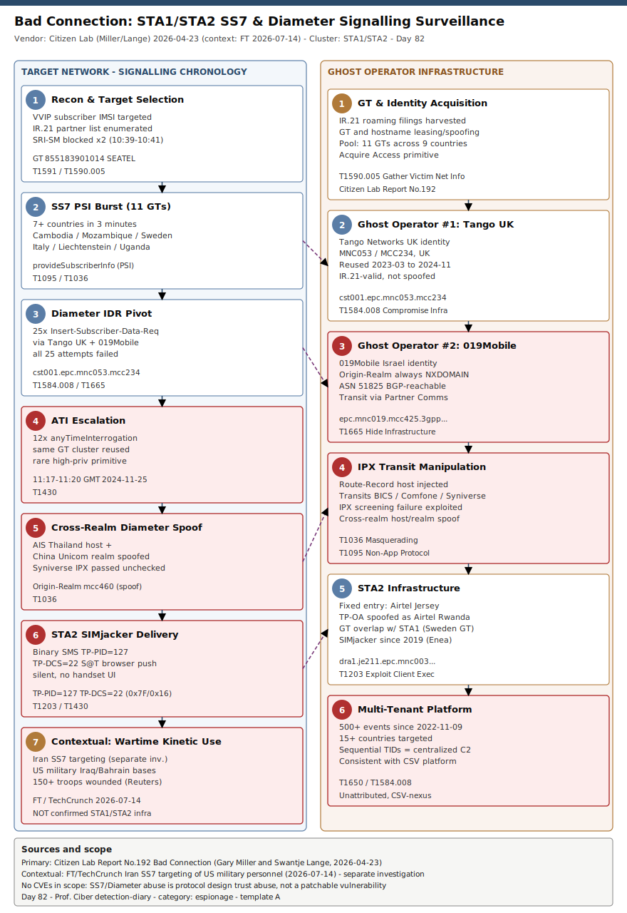

# Bad Connection: STA1/STA2 SS7 and Diameter Signalling Surveillance — and Iran's Wartime Use of the Same Playbook

## TL;DR

Citizen Lab's Report No. 192, "Bad Connection" (Gary Miller and Swantje Lange, 2026-04-23), documents two unattributed commercial-surveillance-class actors — STA1 and STA2 — abusing the legacy SS7 and Diameter telecom signalling protocols to covertly geolocate mobile subscribers across dozens of countries, one campaign for over three years without detection. STA1 rotated across eleven operator identities in nine countries within four hours to track a single "VVIP" subscriber; STA2 combined SS7 reconnaissance with a SIMjacker-class zero-click binary SMS that silently commands a target's SIM card to report its location. Neither actor is attributed to a specific government. Why this matters this week: on 2026-07-14 the Financial Times (via TechCrunch, citing the same lead researcher's Mobile Surveillance Monitor project and anonymous officials) reported that Iran exploited the identical protocol class — SS7 — to locate US military personnel at bases and hotels in Iraq and Bahrain during the build-up to and early days of the Iran War, enabling strikes that wounded more than 150 US troops. This entry uses the Citizen Lab technical findings as the primary, evidence-rich detection anchor and the Iran reporting as the real-world stakes; the two are related by technique class and by researcher, not by confirmed shared infrastructure.

## Attribution and confidence

**STA1 and STA2 (Citizen Lab designations).** Citizen Lab explicitly declines to attribute either campaign to a specific government or company, citing the structural difficulty of telecom-surveillance attribution: signalling identifiers are routinely leased, brokered, or spoofed, so an operator's Global Title or hostname appearing in attack traffic does not imply that operator's complicity. Confidence: **high** on the technical findings (the report is built from multi-year signalling-firewall telemetry provided by Cellusys, corroborated with Telenor Linx, Roaming Audit, and P1 Security data, plus independent IR.21/BGP/DNS validation); **low** on operator identity — the report characterises the tradecraft (centralized C2, multi-tenant targeting across 3+ years, deep GSMA/IR.21 knowledge) as "consistent with a commercially developed telecom surveillance platform supporting government intelligence activities," i.e. a CSV (commercial surveillance vendor) of the type catalogued in the report's own Table 1 (Circles, Cognyte, Rayzone, RCS Lab/Tykelab, Fink Telecom Services).

**Iran / US military targeting (contextual case, separate investigation).** The Financial Times reporting, sourced to Mobile Surveillance Monitor (the same Gary Miller who co-authored the Citizen Lab report) and unnamed government officials, attributes SS7-based location tracking of US military personnel in Iraq and Bahrain to the Iranian government during the Iran War. Confidence: **medium** — two independent cybersecurity experts who reviewed the telemetry described a coordinated campaign, but the FT and TechCrunch both note that further investigation is needed to rule out other intelligence sources (human spotters, personnel's own hotel reviews, social media). **This entry does not claim STA1 or STA2 conducted the Iran campaign.** The link is technique-class (SS7 location-request abuse) and lead-researcher overlap, not shared confirmed infrastructure — treat the STA1/STA2 hostnames/GTs in `## IOCs` as belonging exclusively to the Citizen Lab investigation.

| Overlap axis | STA1 | STA2 | Iran/US-military (contextual) |
|---|---|---|---|
| Protocol class | SS7 + Diameter | SS7 + Diameter + SIM Toolkit (SIMjacker) | SS7 (per FT reporting) |
| Attribution confidence | Low (CSV-nexus, unattributed) | Low (CSV-nexus, unattributed) | Medium (Iran, per FT/anon. officials) |
| Evidence base | Multi-year signalling-firewall telemetry | Multi-year signalling-firewall telemetry + PCAP | Aggregate SS7 request-volume analysis (Mobile Surveillance Monitor) |
| Confirmed shared infra with the other rows | — | GT 467647531812 overlaps with STA1 (see IOCs; genealogy note, not attribution) | None confirmed |

**Genealogy.** First entry in this repo anchored specifically in SS7/Diameter protocol-level signalling abuse (taxonomy slot #23, Telecom/mobile core — previously uncovered). The repo's only other telecom-sector case, [RedLamassu / JFMBackdoor / Showboat](../../05/2026-05-22_RedLamassu-JFMBackdoor-Showboat-Telecom/README.md) (2026-05-22), targeted telecom-sector victims with conventional PE/ELF backdoors — a different technique entirely (host malware vs. protocol abuse) sharing only the target industry. No prior primary in this repo touches SS7, Diameter, IR.21, or GT/interconnect tradecraft.

## Kill chain — summary table

| Stage | MITRE | Detail |
|---|---|---|
| Target selection & recon | T1591, T1590.005 | Target IMSI/MSISDN identified as high-value ("VVIP"); attacker enumerates IR.21 filings to learn valid operator identities and interconnect paths |
| SS7 reconnaissance (SRI-SM) | T1095 | `sendRoutingInfoForSM` sent to resolve MSISDN to IMSI; blocked by the target's signalling firewall (STA1, 2024-11-25 10:39 GMT) |
| SS7 location probing (PSI burst) | T1095, T1036 | Eleven `provideSubscriberInfo` queries from GTs in 7+ countries within 3 minutes, cycling operator identity to find an unblocked path |
| Diameter pivot (IDR burst) | T1584.008, T1665 | 25 `Insert-Subscriber-Data-Request` messages via Tango Networks UK and 019Mobile Ghost Operator identities; 019Mobile's own Origin-Realm domain is deliberately NXDOMAIN-suppressed |
| Escalation (anyTimeInterrogation) | T1430 | After Diameter fails, 12 `anyTimeInterrogation` messages sent from the same GT cluster — a rare, high-privilege SS7 location primitive |
| Cross-realm Diameter spoof | T1036 | Final attempt pairs an AIS Thailand DEA Origin-Host with a spoofed China Unicom Origin-Realm to bypass realm-keyed firewall rules via the Syniverse IPX |
| STA2 zero-click branch (SIMjacker) | T1203, T1430 | Binary SMS (TP-PID=127, TP-DCS=22) silently instructs the SIM's S@T browser to report device location back via SMS (2025-02-11) |
| Persistent multi-tenant infrastructure | T1650, T1584.008 | Same Ghost Operator hostnames reused for 500+ location-tracking events since at least 2022-11-09 against targets in 15+ countries |
| Contextual: wartime kinetic use (Iran) | T1430 | Separate investigation: Iran reportedly used SS7 location data to locate and strike US military personnel in Iraq/Bahrain, Feb-Mar 2026 (150+ wounded) |



The diagram's left lane follows the target-network chronology of the 2024-11-25 STA1 campaign from recon through the ATI escalation and the STA2 SIMjacker branch, closing with the contextual Iran/US-military stage. The right lane is the Ghost Operator infrastructure layer — the leased/spoofed identities, IPX transit manipulation, and the multi-year, multi-tenant platform behind both campaigns. Detection anchors sit at the boundary crossings: the PSI/ATI opcode escalation (left, stage 5) and the Origin-Host/Origin-Realm realm mismatch (right, stage 4) are the two durable signals that survive GT/hostname rotation.

## Stage-by-stage detail

### Target selection and recon (T1591, T1590.005)

STA1's 2024-11-25 campaign began with the target network confirming that the queried IMSI belonged to a "VVIP" subscriber — a company executive — after being alerted to the attack. Building a viable attack requires knowledge of the target operator's roaming-partner topology, which STA1 clearly possessed: every GT used against the target maps to a real operator with a real (if sometimes mismatched) IR.21 filing.

```
Target: single high-profile MSISDN, Middle East mobile operator
Attacker knowledge required: target IMSI/MSISDN, target operator's roaming
  partner list (IR.21), and a pool of at least 11 usable signalling identities
  across 9 countries
```

### SS7 reconnaissance — sendRoutingInfoForSM (T1095)

```
10:39 GMT  SS7 sendRoutingInfoForSM  GT 855183901014  SEATEL (Cambodia)  -> BLOCKED
10:41 GMT  SS7 sendRoutingInfoForSM  GT 855183901014  SEATEL (Cambodia)  -> BLOCKED
```

SRI-SM resolves an MSISDN to the serving MSC/IMSI needed for follow-on location queries. Both attempts were blocked by the target's signalling firewall — the actor did not stop, it pivoted to a different opcode.

### SS7 location probing — provideSubscriberInfo burst (T1095, T1036)

```
10:41-10:44 GMT  provideSubscriberInfo bursts from:
  GT 855180015170  SEATEL (Cambodia)
  GT 25882200300   Tmcel (Mozambique)     -- IR.21 expects Deutsche Telekom, observed via BICS
  GT 85513000755   CADCOMMS/QB (Cambodia) -- IR.21 expects Comfone, observed via Tata Communications
  GT 46764753182   Telenabler AB (Sweden) -- IR.21 expects Comfone, observed via Tata Communications
  GT 393358840745370  TIM (Italy)
  GT 423790105844  FL1 (Liechtenstein)
  GT 25671000036   Utel (Uganda)
```

Eleven operator identities across nine countries in three minutes is not a plausible subscriber roaming pattern; it is a systematic search for a GT the target firewall has not blocked. Several of these transits do not match the querying operator's IR.21-declared interconnect provider (see Attribution/genealogy discussion and Hunt H2).

### Diameter pivot — Insert-Subscriber-Data-Request burst (T1584.008, T1665)

```
10:46-10:50 GMT  6x IDR  cst001.epc.mnc053.mcc234.3gppnetwork.org  (Tango Networks UK)
10:48-11:05 GMT  19x IDR ideabpl1h.epc.mnc019.mcc425.3gppnetwork.org (019Mobile Israel)
```

25 Diameter `Insert-Subscriber-Data-Request` attempts, all failed. The 019Mobile Origin-Realm domain (`epc.mnc019.mcc425.3gppnetwork.org`) returns NXDOMAIN on every authoritative IPX DNS server Citizen Lab queried, yet the underlying IP space (185.24.204.0/29, 185.24.204.8/29, ASN 51825) is live and BGP-reachable via Partner Communications (AS12400, AS-path `12400 -> 51825`). This is a "Ghost Operator": visible and routable in the signalling plane, invisible in DNS.

### Escalation — anyTimeInterrogation (T1430)

```
11:17-11:20 GMT  12x anyTimeInterrogation  (same GT cluster as the PSI burst: Mozambique, Cambodia)
```

`anyTimeInterrogation` is a stronger, less commonly used MAP operation than PSI, typically reserved for value-added or lawful-intercept services. STA1 reached for it only after 25 Diameter attempts failed — a clear behavioural escalation ladder (SRI-SM -> PSI -> IDR -> ATI) that survives rotation of any single identifier.

### Cross-realm Diameter spoof (T1036)

```
13:29 GMT  IDR  Origin-Host: ideabpl1h.dea.epc.mnc003.mcc520.3gppnetwork.org  (AIS Thailand DEA)
                Origin-Realm: epc.mnc001.mcc460.3gppnetwork.org               (China Unicom)
```

Pairing an AIS Thailand Diameter Edge Agent hostname with a China Unicom Origin-Realm violates RFC 6733 (Origin-Host and Origin-Realm must belong to the same network) and GSMA conventions. The Syniverse IPX network, which is expected to screen exactly this kind of mismatch, passed the message unchecked into the target network.

### STA2 zero-click branch — SIMjacker binary SMS (T1203, T1430)

```
2025-02-11 15:41:33  SS7 provideSubscriberInfo   GT 467647531812  Tele2 (Sweden)
2025-02-11 15:45:29  SS7 mt-ForwardSM (binary)    GT 467647531812  Tele2 (Sweden)
                        TP-Originating-Address: 250730091970 (spoofed as Airtel Rwanda)
                        TP-PID = 127 (0x7F): deliver to SIM, not the handset UI
                        TP-DCS = 22 (0x16): treat payload as binary S@T-browser bytecode
```

The binary SMS invokes the SIM's hidden S@T browser (a SIM Toolkit application used legitimately for operator provisioning) and instructs it to retrieve device location and exfiltrate it back via a silent SMS to attacker infrastructure — the device never displays or stores the message. This is the SIMjacker technique Enea first disclosed in 2019, still in active use six years later. Citizen Lab linked STA2's SS7 addresses to operators in Rwanda, Sweden, and Liechtenstein; note GT `467647531812` (Telenabler AB, Sweden) is also present in STA1's 2024-11-25 PSI burst — a shared-identity overlap worth tracking (see IOCs) but not, on its own, proof of a single actor, since GTs can be independently leased from the same broker.

### Persistent multi-tenant infrastructure (T1650, T1584.008)

Historical telemetry shared with Citizen Lab shows the same Tango Networks UK and 019Mobile hostname formats used in over 500 location-tracking events dating back to at least 2022-11-09, against targets in Thailand, South Africa, Norway, Bangladesh, Denmark, Sweden, Malaysia, Montenegro, and multiple Sub-Saharan African countries. Sustained multi-year, multi-country targeting from a stable, small set of infrastructure is consistent with a commercial platform serving several government clients rather than a single operator-run campaign.

### Contextual stage — wartime kinetic use (Iran / US military, separate investigation)

Per FT/TechCrunch (2026-07-14), Iran used SS7 (the same protocol class as STA1, not confirmed shared infrastructure) to geolocate US military personnel at bases and hotels in Iraq and Bahrain in the build-up to and early days of the Iran War, and used that location data to strike them, wounding more than 150 US troops (Reuters, 2026-03-10). Iran also reportedly supplemented SS7 with advertising-technology (ADINT) location data. This stage is included to make explicit why SS7/Diameter detection is not an abstract telecom-hygiene problem: the same query types documented in STA1/STA2 (PSI, ATI, IDR) are, per this reporting, operationally tied to kinetic targeting when the subscriber is military personnel.

## Detection strategy

### Telemetry that matters

This is an identity-and-signalling-layer case with no host EDR visibility: the "device" being attacked is a SIM/MSISDN on someone else's network, not an endpoint you control.

- SS7 signalling-firewall / STP logs (Cellusys, Enea, P1 Security, Mavenir class products) — MAP opcode, source/destination GT, target IMSI/MSISDN, block/pass decision. Ingest via Syslog/CEF into your SIEM.
- Diameter Edge Agent / DRA logs — Origin-Host, Origin-Realm, Route-Record, Session-ID, command code (IDR, AIR, ULR).
- SMSC / SS7-SMS gateway logs — TP-PID, TP-DCS, TP-OA fields for binary/OTA SMS.
- GSMA IR.21 filings (your own and roaming partners') as a reference dataset for expected-vs-observed interconnect provider comparisons.
- BGP/ASN and passive DNS data for the operator identities seen in signalling traffic (confirms or refutes "Ghost Operator" NXDOMAIN-suppression patterns).
- For the enterprise/identity side (protected-personnel programs only): Entra `SigninLogs` / `IdentityLogonEvents`, joined to a maintained MSISDN-to-UPN watchlist.

### Detection coverage

| Engine | File | Logic |
|---|---|---|
| Sigma | `sigma/01_diameter_cross_realm_origin_spoof.yml` | Diameter IDR/AIR/ULR where Origin-Host operator tag != Origin-Realm operator tag, excluding confirmed roaming partners |
| Sigma | `sigma/02_ss7_anytimeinterrogation_escalation.yml` | anyTimeInterrogation within 30 minutes of a PSI/SRI-SM against the same target — recon-to-escalation chain |
| Sigma | `sigma/03_simjacker_binary_sms_stk_push.yml` | mt-ForwardSM with TP-PID=127 and TP-DCS=22, excluding the home network's own OTA platform GT range |
| KQL | `kql/01_diameter_cross_realm_mismatch_syslog.kql` | Sentinel Syslog/CEF version of the Diameter realm-mismatch logic |
| KQL | `kql/02_ss7_ati_escalation_syslog.kql` | Sentinel Syslog/CEF join of PSI/SRI-SM recon to a following ATI within 30 minutes |
| KQL | `kql/03_simjacker_binary_sms_syslog.kql` | Sentinel Syslog/CEF version of the SIMjacker binary-SMS marker |
| KQL | `kql/04_signaling_alert_to_signin_anomaly_correlation.kql` | Joins a signalling-firewall alert on a watchlisted MSISDN to a following anomalous Entra sign-in within 6 hours |
| YARA | `yara/sta1_sta2_telecom_signaling.yar` | Matches STA1 Ghost Operator hostnames, the SRI-SM/PSI-to-ATI opcode/GT sequence, and STA2's SIMjacker PDU markers in exported log/PCAP text — not a binary sample |
| Suricata | `suricata/sta1_sta2_telecom_signaling.rules` | Cleartext Diameter AVP hostname matches (TCP/3868), a coarse SCTP/2905 SIGTRAN tripwire, and a SIMjacker TP-PID/TP-DCS byte match |

### Threat hunting hypotheses

- **H1** — Multi-GT `provideSubscriberInfo` burst against a single subscriber across unrelated countries within minutes (`hunts/peak_h1_multi_gt_psi_burst.md`).
- **H2** — Ghost Operator route mismatch: observed OPC/Route-Record transit provider differs from the operator's own IR.21 filing (`hunts/peak_h2_ghost_operator_route_mismatch.md`).
- **H3** — Telecom-layer alert on a protected-personnel MSISDN followed by an anomalous enterprise sign-in within hours (`hunts/peak_h3_simjacker_alert_to_identity_correlation.md`).

## Incident response playbook

### First 60 minutes (triage)

1. Confirm the alert source (signalling firewall vendor, rule/sid) and pull the raw MAP/Diameter message, including all AVPs — do not act on a summarized alert alone.
2. Identify the target IMSI/MSISDN and check whether it is a designated VVIP/protected-personnel subscriber; if so, notify physical/personnel-security channels immediately, in parallel with the technical investigation (see Contextual stage above on why this matters operationally).
3. Pull the source GT/hostname's IR.21-declared interconnect provider and compare it against the observed transiting OPC/IPX (H2 logic) to establish Ghost Operator likelihood.
4. Check whether the same target IMSI shows other signalling events (PSI/ATI/IDR/SIMjacker) in the preceding 24 hours — establish whether this is an isolated probe or part of an escalation chain.
5. If a binary SMS (TP-PID=127/TP-DCS=22) reached the handset, treat the SIM as potentially compromised for location disclosure; coordinate with the subscriber's home operator on SIM replacement if warranted.

### Artifacts to collect

| Artifact | Path | Tool | Why |
|---|---|---|---|
| Signalling-firewall session log | Vendor-specific (Cellusys/Enea/P1 Security/Mavenir export) | Vendor console / Syslog export | Raw MAP opcode, GT, IMSI, block/pass decision |
| Diameter AVP capture | DRA/DEA packet capture or vendor log export | Vendor console, tshark for PCAP | Origin-Host, Origin-Realm, Route-Record, Session-ID for realm-mismatch confirmation |
| SMSC delivery record | SMSC / SS7-SMS gateway logs | Vendor console | TP-PID, TP-DCS, TP-OA for SIMjacker confirmation |
| IR.21 filing (own + relevant partners) | GSMA IR.21 database | GSMA member portal | Expected interconnect provider for mismatch comparison |
| BGP/ASN routing table snapshot | Route-views / RIR looking glass, internal BGP collector | `bgpq4`, route-views.org | Confirms live reachability of a DNS-suppressed operator identity |
| Passive DNS history for Origin-Realm domains | Internal or commercial pDNS feed | pDNS query tool | Establishes whether NXDOMAIN is new (evasion) or longstanding (misconfiguration) |

### IR queries and commands

```bash
# Pull all SS7/Diameter events for a target MSISDN from Syslog-ingested signalling firewall logs (example: rsyslog flat file)
grep -E "MSISDN[=:].?<target_msisdn>" /var/log/signaling-fw/*.log

# Resolve an Origin-Realm domain and compare against BGP reachability of its declared ASN
dig +short epc.mnc019.mcc425.3gppnetwork.org
whois -h whois.radb.net '!gAS51825'
```

```powershell
# Pull Entra sign-ins for a watchlisted UPN in the 6 hours following a signalling alert (requires AzureAD/Graph module)
Get-MgAuditLogSignIn -Filter "userPrincipalName eq '<upn>' and createdDateTime ge <alert_time>" |
  Select-Object CreatedDateTime, IpAddress, @{n='ASN';e={$_.AutonomousSystemNumber}}, Location
```

```kql
// See kql/04_signaling_alert_to_signin_anomaly_correlation.kql for the full correlation query
Syslog
| where SyslogMessage has "anyTimeInterrogation"
| project TimeGenerated, SyslogMessage
| order by TimeGenerated desc
```

### Containment, eradication, recovery

Containment for a telecom-signalling case is largely out of the victim organization's direct control: the "compromise" is abuse of interconnect trust between operators, not a host you own. Actions available to the target operator/firewall owner: block the offending GT/hostname (short-lived value — expect re-rotation), escalate the IR.21 mismatch to the offending IPX provider (Syniverse in the AIS/China Unicom case) with the evidence in this entry, and file a GSMA fraud/security report. For an enterprise or protected-personnel program that does not own signalling infrastructure: coordinate with the subscriber's mobile operator to request enhanced signalling-firewall protection (GSMA FS.11 category 3 rules) for the specific MSISDN, and treat a confirmed hit as a physical-security event, not solely a data event. **What NOT to do:** do not treat a blocked query as "handled" — STA1's own chronology shows the actor escalating through four different techniques after each block; do not assume absence of a CVE means absence of risk (see IOCs) — these are protocol design abuses, not exploitable software bugs, so there is no patch. Exit criteria: no further signalling events against the target MSISDN for 30 days AND (if a SIMjacker SMS was confirmed delivered) SIM replacement completed.

### Recovery validation

Confirm with the subscriber's operator that enhanced signalling-firewall rules are active for the specific MSISDN (request written confirmation of the rule set, not just an assurance). If a SIM was replaced, confirm the new SIM/IMSI does not appear in any subsequent signalling alert for at least 30 days. For protected-personnel programs, re-baseline the individual's normal sign-in ASN/geo pattern post-incident so future H3 hunts have a clean reference.

## IOCs

No CVEs are in scope for this case: SS7 and Diameter abuse exploits protocol *design* trust assumptions (no authentication, no integrity checking of signalling messages), not a patchable software vulnerability — `generate_kev_overlay.py` correctly produced no `kev.md` for this folder (0 CVE references in this README, verified with `grep -oE 'CVE-[0-9]{4}-[0-9]{4,7}' README.md`).

| Type | Value | Context | Confidence | Source |
|---|---|---|---|---|
| domain | cst001.epc.mnc053.mcc234.3gppnetwork.org | STA1 Tango Networks UK Ghost Operator Diameter Origin-Host, reused 2023-03 to 2024-11 | high | Citizen Lab Report No. 192 |
| domain | ideabpl1h.epc.mnc019.mcc425.3gppnetwork.org | STA1 019Mobile Israel Ghost Operator Diameter Origin-Host | high | Citizen Lab Report No. 192 |
| domain | ideabpl1h.dea.epc.mnc003.mcc520.3gppnetwork.org | STA1 AIS Thailand DEA hostname, paired with spoofed China Unicom realm | high | Citizen Lab Report No. 192 |
| domain | dra1.je211.epc.mnc003.mcc234.3gppnetwork.org | STA2 fixed Airtel Jersey Route-Record entry host | high | Citizen Lab Report No. 192 |
| domain | epc.mnc019.mcc425.3gppnetwork.org | 019Mobile Origin-Realm, NXDOMAIN-suppressed but BGP-reachable via ASN 51825 | high | Citizen Lab Report No. 192 |
| string | GT 855183901014 (SEATEL Cambodia) | STA1 recon/PSI/ATI Global Title | high | Citizen Lab Report No. 192 |
| string | GT 25882200300 (Tmcel Mozambique) | STA1 PSI + ATI Global Title, IR.21 transit mismatch | high | Citizen Lab Report No. 192 |
| string | GT 46764753182 / 467647531812 (Telenabler AB Sweden) | Reused by STA1 and independently by STA2 (genealogy overlap, not proof of shared actor) | medium | Citizen Lab Report No. 192 |
| string | ASN 51825 (Telzar 019 International / 019Mobile) | BGP-confirmed transit for the DNS-suppressed 019Mobile Ghost Operator identity | high | Citizen Lab Report No. 192 |
| string | SS7 opcode anyTimeInterrogation (ATI) | STA1 escalation-tier location primitive, rare in legitimate traffic | high | Citizen Lab Report No. 192 |
| string | Diameter IDR cross-realm Origin-Host/Origin-Realm mismatch | STA1 evasion signature (AIS Thailand host + China Unicom realm) | high | Citizen Lab Report No. 192 |
| note | SIMjacker marker TP-PID=127 / TP-DCS=22 | STA2 zero-click binary SMS SIM Toolkit push signature | high | Citizen Lab Report No. 192; Enea (2019) |
| string | SS7 GT 250730091970 (Airtel Rwanda, spoofed TP-OA) | STA2 SIMjacker delivery SMS sender-field spoof | medium | Citizen Lab Report No. 192 |
| note | Iran SS7 targeting of US military (Iraq/Bahrain), separate investigation | Contextual case; do not treat as confirmed STA1/STA2 infrastructure | medium | FT via TechCrunch 2026-07-14 |

Full list (16 entries) in [`iocs.csv`](./iocs.csv).

## Secondary findings

- **The FCC is investigating the same systemic problem from the regulatory side.** The Record (Recorded Future News) reports the FCC has opened an inquiry into SS7 and Diameter weaknesses, demanding carriers explain their protections and disclose known breaches — the same insecure-by-design gap (no authentication, no integrity checking, spotty TLS/IPsec adoption on Diameter) that STA1 and STA2 both exploited. Regulatory pressure moves slower than a leased GT rotates; treat this as a multi-year tailwind for operator-side fixes, not a near-term mitigation.

- **DNS suppression as an evasion primitive is a reusable CTI pattern beyond telecom.** The 019Mobile finding — a domain that is authoritative-NXDOMAIN everywhere yet its IP space is live and BGP-advertised — is a general technique (T1665, Hide Infrastructure) worth hunting for in any environment where you can compare DNS resolution against independent BGP/routing truth, not just SS7/Diameter.

- **SIMjacker's six-year persistence argues against "old vulnerability, low priority" heuristics.** Enea disclosed SIMjacker in 2019; Citizen Lab observed it reused by STA2 in February 2025. A technique with no software patch (it abuses a legitimate, if obscure, SIM Toolkit feature) does not decay the way a patched CVE does — operator-side STK-command filtering, not time, is what closes this gap.

## Pedagogical anchors

- **Telecom signalling is a trust-based protocol layer with no authentication — treat every GT/hostname as leasable, not owned.** Blocking a specific identifier buys hours, not months; the durable detections in this entry (opcode escalation chains, realm mismatches, DNS/BGP divergence) target behavior and structural inconsistency, not identity.
- **Attribution honesty matters most when the stakes are highest.** This entry deliberately keeps STA1/STA2 (Citizen Lab, unattributed) separate from the Iran/US-military reporting (FT, medium-confidence state attribution) even though they share a technique class and a researcher — collapsing them into one narrative would overstate both the technical case and the geopolitical claim.
- **Absence of a CVE is not absence of risk, and here it is structural, not situational.** SS7/Diameter abuse has no patch because it exploits protocol design assumptions from the 1970s-1990s; the KEV overlay tooling correctly found nothing to catalogue here, and that absence should be read as "this is a design problem," not "this is safe."
- **A detection you cannot act on alone is still worth building if it feeds a correlation.** No single PSI hit is actionable; the escalation chain (H1), the route-mismatch (H2), and the identity correlation (H3) each turn a weak individual signal into a defensible case by joining it with a second, independent data source.
- **When the target is a person, not a server, the IR playbook has a physical-security branch.** The Iraq/Bahrain targeting context is the clearest illustration in this repo of why some IR playbooks must route to force-protection/physical-security teams in parallel with — not after — the technical investigation.

## What's in this folder

| File | Purpose | Link |
|---|---|---|
| README.md | This document | [README.md](./README.md) |
| kill_chain.svg | Two-lane kill chain diagram (target network vs. Ghost Operator infrastructure) | [kill_chain.svg](./kill_chain.svg) |
| sigma/01_diameter_cross_realm_origin_spoof.yml | Diameter Origin-Host/Origin-Realm mismatch detection | [sigma/01_diameter_cross_realm_origin_spoof.yml](./sigma/01_diameter_cross_realm_origin_spoof.yml) |
| sigma/02_ss7_anytimeinterrogation_escalation.yml | SS7 recon-to-ATI escalation detection | [sigma/02_ss7_anytimeinterrogation_escalation.yml](./sigma/02_ss7_anytimeinterrogation_escalation.yml) |
| sigma/03_simjacker_binary_sms_stk_push.yml | SIMjacker binary SMS marker detection | [sigma/03_simjacker_binary_sms_stk_push.yml](./sigma/03_simjacker_binary_sms_stk_push.yml) |
| kql/01_diameter_cross_realm_mismatch_syslog.kql | Sentinel version of the Diameter realm-mismatch logic | [kql/01_diameter_cross_realm_mismatch_syslog.kql](./kql/01_diameter_cross_realm_mismatch_syslog.kql) |
| kql/02_ss7_ati_escalation_syslog.kql | Sentinel version of the recon-to-ATI escalation logic | [kql/02_ss7_ati_escalation_syslog.kql](./kql/02_ss7_ati_escalation_syslog.kql) |
| kql/03_simjacker_binary_sms_syslog.kql | Sentinel version of the SIMjacker marker logic | [kql/03_simjacker_binary_sms_syslog.kql](./kql/03_simjacker_binary_sms_syslog.kql) |
| kql/04_signaling_alert_to_signin_anomaly_correlation.kql | Telecom-alert-to-identity-anomaly correlation query | [kql/04_signaling_alert_to_signin_anomaly_correlation.kql](./kql/04_signaling_alert_to_signin_anomaly_correlation.kql) |
| yara/sta1_sta2_telecom_signaling.yar | Matches Ghost Operator hostnames, opcode sequences, and SIMjacker PDU markers in exported logs/PCAP text | [yara/sta1_sta2_telecom_signaling.yar](./yara/sta1_sta2_telecom_signaling.yar) |
| suricata/sta1_sta2_telecom_signaling.rules | Cleartext Diameter AVP matches, SCTP/SIGTRAN tripwire, SIMjacker PDU byte match | [suricata/sta1_sta2_telecom_signaling.rules](./suricata/sta1_sta2_telecom_signaling.rules) |
| hunts/peak_h1_multi_gt_psi_burst.md | PEAK hunt: multi-GT PSI burst against a single subscriber | [hunts/peak_h1_multi_gt_psi_burst.md](./hunts/peak_h1_multi_gt_psi_burst.md) |
| hunts/peak_h2_ghost_operator_route_mismatch.md | PEAK hunt: IR.21-vs-observed transit mismatch | [hunts/peak_h2_ghost_operator_route_mismatch.md](./hunts/peak_h2_ghost_operator_route_mismatch.md) |
| hunts/peak_h3_simjacker_alert_to_identity_correlation.md | PEAK hunt: telecom alert to identity-anomaly correlation | [hunts/peak_h3_simjacker_alert_to_identity_correlation.md](./hunts/peak_h3_simjacker_alert_to_identity_correlation.md) |
| iocs.csv | Full IOC list (16 entries) | [iocs.csv](./iocs.csv) |

## Sources

- [Bad Connection: Uncovering Global Telecom Exploitation by Covert Surveillance Actors](https://citizenlab.ca/research/uncovering-global-telecom-exploitation-by-covert-surveillance-actors/) — Citizen Lab Report No. 192, Gary Miller and Swantje Lange, 2026-04-23
- [Iran abused mobile networks' vulnerabilities to locate US military in the Middle East, report says](https://techcrunch.com/2026/07/14/iran-abused-mobile-networks-vulnerabilities-to-locate-u-s-military-in-the-middle-east-report-says/) — TechCrunch, Lorenzo Franceschi-Bicchierai, 2026-07-14 (citing Financial Times)
- [FCC to probe 'grave' weaknesses in phone network infrastructure](https://therecord.media/fcc-ss7-diameter-protocols-investigation) — The Record (Recorded Future News)
- [SIMjacker](https://www.enea.com/info/simjacker/) — Enea, original 2019 disclosure
- [Iran Exploited Telecom Flaws to Track US Military Personnel, Researchers Say](https://securityboulevard.com/2026/07/iran-exploited-telecom-flaws-to-track-us-military-personnel-researchers-say/) — Security Boulevard, 2026-07
- [Many, 150 US troops wounded so far in Iran war, sources say](https://www.reuters.com/world/middle-east/many-150-us-troops-wounded-so-far-iran-war-sources-say-2026-03-10/) — Reuters, 2026-03-10
- [An analysis of LightBasin telecommunications attacks](https://www.crowdstrike.com/en-us/blog/an-analysis-of-lightbasin-telecommunications-attacks/) — CrowdStrike (cited in Citizen Lab Table 1, telecom-APT genealogy reference)
- [Understanding Global Titles and GT leasing in telecom](https://www.p1sec.com/blog/understanding-global-titles-and-gt-leasing-in-telecom) — P1 Security
