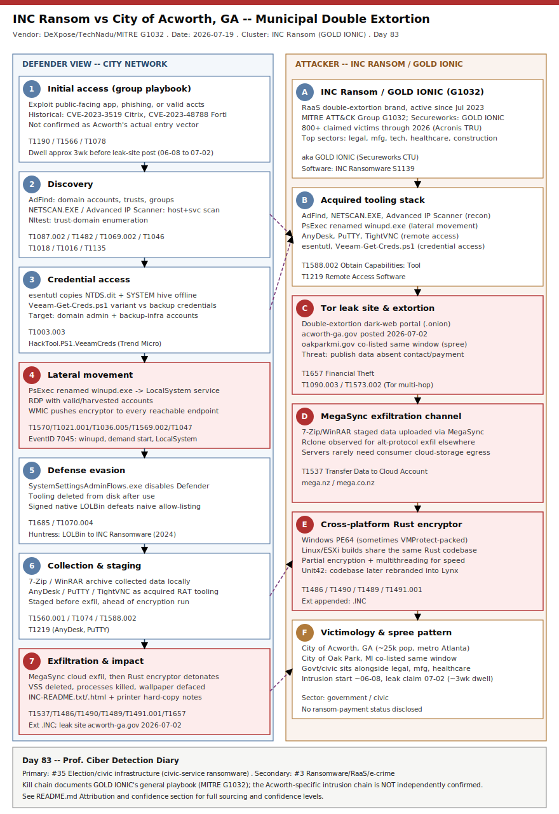

# INC Ransom Hits Georgia's City of Acworth: Municipal Double Extortion and the GOLD IONIC Playbook

## TL;DR

On 2026-07-02 the ransomware-as-a-service (RaaS) operation INC Ransom (tracked by MITRE ATT&CK as G1032 / "GOLD IONIC" by Secureworks) listed the City of Acworth, Georgia (acworth-ga.gov, population ~25,000, metro Atlanta) on its Tor double-extortion leak site, threatening to publish "valuable municipal data" absent contact. The city's own disclosure places the underlying network intrusion around 2026-06-08, roughly three weeks of dwell time before the public leak-site claim, and states systems have since been restored with no disruption to day-to-day operations -- no ransom-payment status has been disclosed. City of Oak Park, Michigan was added to the same leak site in the same posting window, consistent with an opportunistic multi-victim spree rather than a bespoke campaign against Acworth specifically. INC Ransom is one of the most active RaaS brands of 2026 (800+ claimed victims since July 2023 per Acronis), and government/civic targets sit alongside legal services, manufacturing, technology, healthcare and construction in its top-five sectors. No technical root-cause has been published for the Acworth intrusion itself, so this entry documents the group's well-characterized general playbook (initial access through phishing, valid accounts or public-facing exploits; AdFind/NetScan recon; PsExec/RDP lateral movement; MegaSync exfiltration; Rust cross-platform encryptor) and is explicit everywhere that playbook is being applied illustratively rather than confirmed step-by-step for this specific victim.

## Attribution and confidence

**Cluster:** INC Ransom (RaaS brand / leak-site name) = **GOLD IONIC** (Secureworks CTU) = MITRE ATT&CK **Group G1032**, software **INC Ransomware (S1139)**. Active since at least July 2023 per Secureworks/Cybereason/SentinelOne. Confidence on **group identity for this victim is high** -- the claim appears directly on INC Ransom's own Tor leak site (cross-tracked independently by DeXpose and TechNadu leak-site monitoring, and by the ransomware.live/RansomLook aggregators). Confidence on the **specific technical intrusion chain used against Acworth is low** -- the city has not published a root-cause statement, and no vendor IR write-up specific to this victim was found at publication time; the stage-by-stage detail below is the group's *documented general tradecraft*, not a confirmed Acworth timeline.

| Vendor / tracker | Name used | Notes |
|---|---|---|
| MITRE ATT&CK | INC Ransom (G1032) | Canonical group entry, associated group "GOLD IONIC" |
| Secureworks CTU | GOLD IONIC | Original naming; April 2024 blog on Citrix/Fortinet initial access |
| SentinelOne | Inc. Ransom | Anthology entry, TTP + IOC summary |
| SOCRadar | INC Ransom | Dark-web leak-site profile |
| Acronis TRU | INC ransomware | RaaS evolution / affiliate-market analysis |
| Unit 42 (Palo Alto) | -- | Assesses INC's codebase was rebranded into **Lynx** ransomware in 2024 |

**Genealogy with previous repo cases:** this is the repo's first INC Ransom / GOLD IONIC primary. It shares the general RaaS-affiliate double-extortion pattern covered for **DragonForce/RansomHub-class** e-crime in earlier entries, and the printer-ransom-note extortion gimmick echoes the psychological-pressure tactics seen in the **BlackCat** genealogy notes elsewhere in this repo (see `byActor/`), but there is no tooling or infrastructure overlap confirmed between those clusters and INC Ransom.

## Kill chain — summary table

| Stage | MITRE | Detail |
|---|---|---|
| Initial access | T1190 / T1566 / T1078 | Group playbook: exploit public-facing apps (historically CVE-2023-3519 Citrix NetScaler, CVE-2023-48788 FortiClient EMS), spear-phishing, or purchased/valid credentials. Not confirmed for Acworth. |
| Discovery | T1087.002, T1482, T1069.002, T1018, T1016, T1046, T1135 | AdFind for domain accounts/trusts/groups; Nltest for trust discovery; NETSCAN.EXE (SoftPerfect) and Advanced IP Scanner for network-service discovery; native tooling for share discovery. |
| Credential access | T1003.003 | esentutl against NTDS.dit; reported Veeam-Get-Creds.ps1 variant (HackTool.PS1.VeeamCreds) against Veeam Backup & Replication credential stores in recent incidents. |
| Lateral movement | T1570, T1021.001, T1036.005, T1569.002, T1047 | PsExec renamed `winupd.exe` installed as a demand-start LocalSystem service; RDP with valid/harvested accounts; WMIC to push the encryptor fleet-wide. |
| Defense evasion | T1685, T1070.004 | `SystemSettingsAdminFlows.exe` (native LOLBin) used to disable Windows Defender; post-use tool deletion. |
| Collection & staging | T1560.001, T1074, T1588.002 | 7-Zip/WinRAR archiving of collected data; AnyDesk/PuTTY/TightVNC as acquired remote-access tooling. |
| Exfiltration & impact | T1537, T1657, T1486, T1490, T1489, T1491.001 | MegaSync cloud exfiltration; INC Ransomware (Rust, cross-platform, partial+multithreaded encryption); VSS deletion; process/service kill via Restart Manager; wallpaper defacement + `INC-README.txt/.html` notes pushed to networked printers; double-extortion leak-site posting. |



The left lane follows the defender's view of a generic INC Ransom intrusion from initial access through the printer-note extortion finale; the right lane tracks the group's persistent infrastructure -- its Tor leak site, its acquired-tool stack, and the Rust cross-platform encryptor build shared across Windows/Linux/ESXi targets. Badges mark the two stages (lateral movement, exfiltration/impact) with the strongest published detection anchors: the `winupd.exe` PsExec masquerade and the MegaSync egress pattern.

## Stage-by-stage detail

### Initial access (group playbook, not confirmed for Acworth)

SentinelOne and SOCRadar document INC Ransom exploiting **CVE-2023-3519** (Citrix NetScaler ADC/Gateway, unauthenticated RCE) and **CVE-2023-48788** (Fortinet FortiClient EMS, SQLi-to-RCE) for initial access, alongside conventional spear-phishing and IAB-purchased valid accounts (T1078). Neither CVE, nor any specific phishing lure, has been publicly attributed to the Acworth intrusion; the city's disclosure gives only an approximate start date (~2026-06-08) with no technical root cause.

```text
# Illustrative group playbook, T1190 -- Citrix NetScaler pre-auth RCE class (CVE-2023-3519 era)
# Not confirmed for this victim; documented in SentinelOne / SOCRadar INC Ransom profiles.
POST /vpn/../vpns/portal/scripts/newbm.pl HTTP/1.1
Host: <netscaler-gateway>
Content-Type: application/x-www-form-urlencoded
```

### Discovery (T1087.002, T1482, T1069.002, T1018, T1016, T1046, T1135)

AdFind (S0552) is the group's standard domain-recon tool: account, trust, and group enumeration in one static binary, typically staged to `C:\PerfLogs\` or `C:\Windows\Temp\`. NETSCAN.EXE (SoftPerfect Network Scanner) and Advanced IP Scanner cover host/service discovery; Nltest covers trust-domain enumeration.

```text
adfind.exe -f (objectcategory=person) -csv name sAMAccountName mail > ad_users.csv
adfind.exe -sc trustdmp
nltest /domain_trusts /all_trusts
netscan.exe /adapter=all /export=hosts.csv
```

### Credential access (T1003.003)

esentutl.exe is used to copy `NTDS.dit` and the `SYSTEM` registry hive for offline hash extraction. Recent INC Ransom incident telemetry (Trend Micro Ransomware Spotlight) also documents a modified `Veeam-Get-Creds.ps1` variant targeting Veeam Backup & Replication's SQL-backed credential store -- a notable target given how many municipal IT shops rely on Veeam for their only offline-capable backup layer.

```powershell
esentutl.exe /y /vss C:\Windows\NTDS\ntds.dit /d C:\Windows\Temp\ntds.dit
reg.exe save HKLM\SYSTEM C:\Windows\Temp\system.hiv
```

### Lateral movement (T1570, T1021.001, T1036.005, T1569.002, T1047)

The group's signature move, documented by Huntress: PsExec (S0029) is copied to target hosts renamed `winupd.exe` to blend with legitimate Windows Update artifacts, then registered as a demand-start LocalSystem service via the Service Control Manager (Event ID 7045) before pushing the encryptor to every reachable endpoint in rapid succession.

```text
Service Control Manager/7045; winupd,%SystemRoot%\winupd.exe,user mode service,demand start,LocalSystem
wmic.exe /node:@hosts.txt process call create "C:\Windows\Temp\winupd.exe -accepteula -s -d C:\Windows\Temp\enc.exe"
```

### Defense evasion (T1685, T1070.004)

Huntress's "LOLBin to INC Ransomware" write-up documents `SystemSettingsAdminFlows.exe` -- a legitimate, Microsoft-signed Windows utility -- being invoked to flip Windows Defender settings off ahead of the encryption run, then tooling being deleted from disk post-use to slow forensic recovery.

### Collection, staging & exfiltration (T1560.001, T1074, T1588.002, T1537, T1657)

Collected files are archived with 7-Zip or WinRAR, staged locally, then uploaded via MegaSync to attacker-controlled cloud storage before the encryptor runs -- the standard double-extortion sequencing that lets the group threaten a data leak even against victims who restore cleanly from backup, as Acworth reports having done.

### Impact (T1486, T1490, T1489, T1491.001)

INC Ransomware (S1139) is a Windows PE64 payload (Rust-rewritten builds also target Linux/ESXi) that combines partial file encryption with multi-threading for speed, calls `DeviceIoControl` to resize and delete Volume Shadow Copy snapshots (T1490), uses the Restart Manager API to kill processes locking target files (T1489/T1057), changes the desktop wallpaper to the ransom message (T1491.001), and drops `INC-README.txt` / `INC-README.html` in encrypted directories -- with the HTML copy additionally pushed to any networked printer or fax device the payload can enumerate, producing physical hard-copy ransom notes as an escalation tactic documented since the group's earliest campaigns.

## Detection strategy

### Telemetry that matters

- **Sysmon:** Event ID 1 (process creation) for AdFind/NetScan/esentutl/PsExec-as-winupd invocations; Event ID 3 (network connection) for MegaSync/AnyDesk/PuTTY egress; Event ID 11 (file create) for `INC-README.txt`/`.html` drops; Event ID 13 (registry) for Defender tamper keys.
- **Windows Security/System log:** Event ID 7045 (new service installed) for the `winupd` service; Event ID 4688 (process creation, if enabled) as a non-Sysmon fallback.
- **Defender XDR / Sentinel:** `DeviceProcessEvents`, `DeviceNetworkEvents`, `DeviceFileEvents`, `DeviceRegistryEvents` for the tables referenced below.
- **Backup infrastructure logs:** Veeam Backup & Replication SQL/API audit logs, given the group's documented interest in Veeam credential stores.
- **Print server / spooler logs:** unusual print-job volume to unfamiliar document names (`INC-README`) across many printers in a short window is a high-signal, low-noise late-stage indicator.

### Detection coverage

| Engine | File | Logic |
|---|---|---|
| Sigma | `sigma/proc_creation_psexec_winupd_masquerade.yml` | PsExec-class binary launched/installed from a path/name matching `winupd.exe` (T1036.005/T1569.002) |
| Sigma | `sigma/proc_creation_systemsettingsadminflows_defender_tamper.yml` | `SystemSettingsAdminFlows.exe` invoked with Defender-related arguments (T1685) |
| Sigma | `sigma/proc_creation_shadowcopy_deletion.yml` | vssadmin/wmic shadow-copy deletion commands (T1490) |
| Sigma | `sigma/network_megasync_cloud_exfil.yml` | Outbound connection to MegaSync/mega.nz endpoints from server-tier hosts (T1537) |
| KQL | `kql/inc_ransom_psexec_winupd_lateral.kql` | Defender XDR: service-install pattern matching the winupd masquerade |
| KQL | `kql/inc_ransom_netscan_advancedipscanner_recon.kql` | Defender XDR: NETSCAN.EXE / Advanced IP Scanner execution |
| KQL | `kql/inc_ransom_megasync_exfil.kql` | Defender XDR: MegaSync network egress correlated with prior archive-utility execution |
| YARA | `yara/inc_ransomware_note_artifacts.yar` | String/behavioral match on documented INC-README note artifacts and base64 note-decode routine |
| Suricata | `suricata/inc_ransom_c2_exfil.rules` | MegaSync TLS SNI, AnyDesk port/traffic pattern, raw VNC/RFB handshake |

### Threat hunting hypotheses

- **H1** (`hunts/peak_h1_winupd_psexec_masquerade.md`): PsExec-derived services installed under Windows-update-sounding names across the server fleet, independent of any AV/EDR alert firing.
- **H2** (`hunts/peak_h2_archive_then_megasync_egress.md`): Mass 7-Zip/WinRAR archive-creation events followed within a short window by MegaSync/cloud-storage egress from the same host -- the staging-to-exfiltration pattern.
- **H3** (`hunts/peak_h3_defender_tamper_lolbin.md`): `SystemSettingsAdminFlows.exe` or other native LOLBins touching Windows Defender configuration outside scheduled maintenance windows.

## Incident response playbook

### First 60 minutes (triage)

1. Isolate any host showing a newly installed service named `winupd` (or unfamiliar Windows-update-sounding service names) at the network layer before shadow-copy deletion completes elsewhere.
2. Pull Windows Security log Event ID 7045 across the fleet for the last 30 days to scope how many hosts received the lateral-movement service.
3. Check Print Server logs / spooler queues for a burst of `INC-README` print jobs -- this is often the first *visible* signal non-IT staff report.
4. Freeze and snapshot Veeam Backup & Replication credential stores and rotate the service account used by the backup infrastructure.
5. Preserve volatile memory and a forensic image of at least one "patient zero" candidate host before remediation touches it.
6. Stand up an out-of-band communication channel (the group's playbook includes wallpaper/printer messaging specifically to disrupt normal comms).

### Artifacts to collect

| Artifact | Path | Tool | Why |
|---|---|---|---|
| NTDS.dit / SYSTEM hive copies | `C:\Windows\Temp\*.dit`, `*.hiv` | `mftecmd`, `recmd` | Confirms T1003.003 credential-dumping staging |
| Service install records | Security/System Event ID 7045 | `evtxecmd` | Confirms winupd/PsExec lateral movement scope |
| Scheduled tasks | `C:\Windows\System32\Tasks\` | `recmd`, Velociraptor `windows_scheduled_tasks` | INC_Update-style persistence entries |
| Prefetch / execution evidence | `C:\Windows\Prefetch\` | `pecmd` | Confirms AdFind/NetScan/esentutl/PsExec execution timeline |
| Amcache / Shimcache | `C:\Windows\AppCompat\` | `amcache_parser`, `shimcache_parser` | First-execution timestamps for staged tooling |
| Ransom note artifacts | `INC-README.txt`, `INC-README.html` | `bstrings` | Confirms encryptor detonation and note-decode routine |
| Network egress logs | Firewall / proxy | Velociraptor `windows_netstat_enriched` | Confirms MegaSync/AnyDesk/TightVNC egress destinations |

### IR queries and commands

```powershell
# Hunt for winupd-named services fleet-wide (run via remote PS or Velociraptor)
Get-CimInstance -ClassName Win32_Service | Where-Object { $_.PathName -match 'winupd\.exe' -or $_.Name -match '^winupd$' }
```

```powershell
# Confirm Event ID 7045 winupd installs across a domain (requires WinRM/WEF forwarding already in place)
Get-WinEvent -FilterHashtable @{LogName='System'; Id=7045} | Where-Object { $_.Message -match 'winupd' }
```

```bash
# Preserve print spooler queue evidence before service restart clears it
wevtutil epl "Microsoft-Windows-PrintService/Operational" printservice_evidence.evtx
```

```kql
DeviceProcessEvents
| where FileName in~ ("adfind.exe","netscan.exe","AdvancedIPScanner.exe","esentutl.exe")
| where Timestamp > ago(30d)
| project Timestamp, DeviceName, FileName, ProcessCommandLine, InitiatingProcessAccountName
| order by Timestamp asc
```

### Containment, eradication, recovery

Exit criteria for containment: no active `winupd`-class services remain on any domain-joined host, no outbound MegaSync/AnyDesk/TightVNC sessions remain from server-tier subnets, and Veeam credentials have been rotated with the old set revoked. **Do NOT** restore from backup before confirming the backup infrastructure's own credential store was not itself harvested (T1003.003 targeting of Veeam is documented for this group) -- restoring onto a still-compromised backup fabric re-exposes the same credentials to a second encryption run. Do NOT pay before legal/insurance counsel review, and do NOT assume "no ransom paid, data safe" -- INC Ransom's double-extortion model means leak risk persists independent of decryption status, as illustrated by Acworth's own "systems restored" statement carrying no comment on data exposure.

### Recovery validation

Confirm AD account hygiene (forced password reset for all domain accounts touched by AdFind enumeration, not just privileged ones), confirm no residual `INC_Update`-style scheduled tasks remain, confirm printer/fax devices have been power-cycled and their spool queues cleared, and confirm EDR coverage extends to any host that was previously unmanaged or excluded (a common gap in municipal IT environments with legacy/unsupported systems).

## IOCs

| Type | Value | Context | Confidence | Source |
|---|---|---|---|---|
| note | INC Ransom leak-site claim | acworth-ga.gov posted 2026-07-02; intrusion start ~2026-06-08 per city disclosure | high | DeXpose |
| note | Oak Park MI co-listing | Same leak-site posting window as Acworth | medium | TechNadu |
| string | .INC | Encrypted-file extension | high | SentinelOne |
| path | INC-README.txt / .html | Ransom note; HTML copy pushed to printers | high | SentinelOne |
| string | INC_Update | Persistence scheduled-task name | medium | Trend Micro |
| path | %SystemRoot%\winupd.exe | PsExec renamed for lateral movement | high | Huntress |
| string | SystemSettingsAdminFlows.exe | LOLBin used to disable Defender | high | Huntress |
| string | NETSCAN.EXE | SoftPerfect scanner for recon | high | SOCRadar |
| string | Veeam-Get-Creds.ps1 | Veeam credential dumper variant | medium | Trend Micro |
| cve | CVE-2023-3519 | Citrix NetScaler RCE, group playbook (not Acworth-confirmed) | medium | SentinelOne |
| cve | CVE-2023-48788 | Fortinet FortiClient EMS RCE, group playbook (not Acworth-confirmed) | medium | Secureworks |
| note | MegaSync exfil | Cloud exfil channel prior to encryption | high | MITRE G1032 |
| note | Rust cross-platform encryptor | Windows/Linux/ESXi builds, partial+multithreaded encryption | high | Acronis TRU |
| note | Delaware County PA parallel incident | Undisclosed ransomware status, started 2026-06-26 | medium | Broad + Liberty |

Full list in `iocs.csv`. **KEV status:** see `kev.md` -- both playbook CVEs are on the CISA Known Exploited Vulnerabilities catalog: **CVE-2023-3519** (Citrix NetScaler ADC/Gateway code injection, added 2023-07-19, federal remediation due 2023-08-09, ransomware use "Known") and **CVE-2023-48788** (Fortinet FortiClient EMS SQL injection, added 2024-03-25, remediation due 2024-04-15, ransomware use "Known"). Both due dates have long since passed; treat as patch-now priorities wherever still unpatched. Neither CVE is confirmed as this specific incident's entry vector -- see `kev.md` for the full cross-reference.

## Secondary findings

- **Delaware County, PA network intrusion (undisclosed status).** Beginning 2026-06-26, Delaware County disclosed "unauthorized activity" disrupting courthouse, Register of Wills, library and correctional-facility systems; as of 2026-07-15 the county has declined to confirm whether the incident involved ransomware, encryption, or a ransom demand. This is a useful counterpoint to Acworth's relatively fast public disclosure -- defenders should not read "no confirmation" as "no encryption," and should apply known-group playbooks as hypothesis-generation tools regardless of official silence.

- **City of Oak Park, MI co-listed on the same leak site.** TechNadu reports Oak Park, Michigan was added to INC Ransom's dark-web leak site in the same window as Acworth, suggesting the group ran a multi-victim opportunistic push (likely via IAB-purchased access or mass scanning of a shared vulnerability class) rather than a bespoke campaign targeting Acworth specifically -- a pattern worth tracking across future municipal INC Ransom claims for shared initial-access infrastructure.

- **Contested Chinese voter-registration-data claims (2026-07-03 to 2026-07-17).** Separately from any ransomware activity, the White House declassified a cache of election-related intelligence records culminating in a 2026-07-16 presidential address alleging China obtained roughly 220 million U.S. voter registration files across 18 states; DHS and CISA opened a review and CISA has committed to an updated election-infrastructure plan within 30 days. Multiple state election officials (Arizona, Wisconsin) publicly stated they had no evidence their own systems were breached, and fact-checks (Votebeat, CBS News) found the address largely restated previously public information about voter-file commercial availability rather than presenting new evidence of a confirmed technical compromise of authoritative registration systems. This entry treats the claim as **disputed and low-confidence pending independent technical corroboration**, and flags it here only because it falls in the same taxonomy slot (#35, "voter registration leaks") as this entry's civic-ransomware primary -- it is explicitly not adopted as a confirmed finding.

## Pedagogical anchors

- RaaS affiliates target municipalities for the operational leverage of public-records obligations and thin security budgets, not superior tradecraft -- treat "civic-service ransomware" as a distinct risk category from headline-grabbing APT activity, but not a lesser one.
- When a victim organization declines to confirm "ransomware" publicly (Delaware County pattern), do not treat official silence as evidence of absence -- apply the most plausible known-group playbook as a working hypothesis for your own environment regardless.
- LOLBin masquerade (`winupd.exe`, `SystemSettingsAdminFlows.exe`) defeats naive filename/allow-list detection -- anchor detections on parent-child process lineage, code-signing identity, and service-install metadata (Event ID 7045) instead of the executable's name.
- Distinguish "voter data availability" from "voter data breach" precisely: publicly releasable voter-file fields (name, address, party) are not equivalent to compromise of an authoritative registration system -- this distinction matters most exactly when the claim is politically charged and evidence is still developing.
- Group genealogy doesn't stop at a leak-site brand name: Unit 42 assesses INC Ransomware's codebase was rebranded into Lynx -- track TTP/tooling overlap across name changes, not just the current label.

## What's in this folder

| File | Purpose | Link |
|---|---|---|
| README.md | This report | [README.md](./README.md) |
| kill_chain.svg | Two-lane kill-chain diagram (Template A) | [kill_chain.svg](./kill_chain.svg) |
| iocs.csv | Full indicator list (type/value/context/confidence/source) | [iocs.csv](./iocs.csv) |
| kev.md | CISA KEV cross-reference for this case's CVEs | [kev.md](./kev.md) |
| sigma/proc_creation_psexec_winupd_masquerade.yml | Detects PsExec renamed winupd.exe | [sigma/](./sigma/) |
| sigma/proc_creation_systemsettingsadminflows_defender_tamper.yml | Detects Defender-tamper LOLBin usage | [sigma/](./sigma/) |
| sigma/proc_creation_shadowcopy_deletion.yml | Detects VSS deletion commands | [sigma/](./sigma/) |
| sigma/network_megasync_cloud_exfil.yml | Detects MegaSync cloud exfil | [sigma/](./sigma/) |
| kql/inc_ransom_psexec_winupd_lateral.kql | Defender XDR winupd service-install hunt | [kql/](./kql/) |
| kql/inc_ransom_netscan_advancedipscanner_recon.kql | Defender XDR recon-tool execution hunt | [kql/](./kql/) |
| kql/inc_ransom_megasync_exfil.kql | Defender XDR MegaSync egress hunt | [kql/](./kql/) |
| yara/inc_ransomware_note_artifacts.yar | YARA rule on documented INC ransom-note artifacts | [yara/](./yara/) |
| suricata/inc_ransom_c2_exfil.rules | Network rules for MegaSync/AnyDesk/VNC | [suricata/](./suricata/) |
| hunts/peak_h1_winupd_psexec_masquerade.md | PEAK hunt H1 | [hunts/](./hunts/) |
| hunts/peak_h2_archive_then_megasync_egress.md | PEAK hunt H2 | [hunts/](./hunts/) |
| hunts/peak_h3_defender_tamper_lolbin.md | PEAK hunt H3 | [hunts/](./hunts/) |

## Sources

- [Incransom Targets City of Acworth in Ransomware Attack (DeXpose)](https://www.dexpose.io/incransom-targets-city-of-acworth-in-ransomware-attack/)
- [INC Ransom Adds City of Acworth, Georgia, and City of Oak Park, Michigan, to Dark Web Leak Site (TechNadu)](https://www.technadu.com/inc-ransom-adds-city-of-acworth-georgia-and-city-of-oak-park-michigan-to-dark-web-leak-site/630453/)
- [INC Ransom, GOLD IONIC, Group G1032 (MITRE ATT&CK)](https://attack.mitre.org/groups/G1032/)
- [INC Ransomware, Software S1139 (MITRE ATT&CK)](https://attack.mitre.org/software/S1139/)
- [GOLD IONIC Deploys INC Ransomware (Secureworks CTU)](https://www.secureworks.com/blog/gold-ionic-deploys-inc-ransomware)
- [Inc. Ransomware Ransomware: Analysis, Detection, and Mitigation (SentinelOne)](https://www.sentinelone.com/anthology/inc-ransom/)
- [From emerging threat to top-tier ransomware-as-a-service: the evolution of INC ransomware (Acronis TRU)](https://www.acronis.com/en/tru/posts/from-emerging-threat-to-top-tier-ransomware-as-a-service-the-evolution-of-inc-ransomware/)
- [Ransomware Spotlight: INC (Trend Micro)](https://www.trendmicro.com/vinfo/us/security/news/ransomware-spotlight/ransomware-spotlight-inc)
- [Dark Web Profile: INC Ransom (SOCRadar)](https://socradar.io/dark-web-profile-inc-ransom/)
- [Delaware County refuses to say whether cyberattack was ransomware (Broad + Liberty)](https://broadandliberty.com/2026/07/15/delaware-county-refuses-to-say-whether-cyberattack-was-ransomware/)
- ['Zero new facts': Teased as a bombshell, Trump election speech underwhelms election officials (Votebeat)](https://www.votebeat.org/national/2026/07/17/trump-election-speech-china-noncitizen-voters-voting-machine-vunerabilities/)
