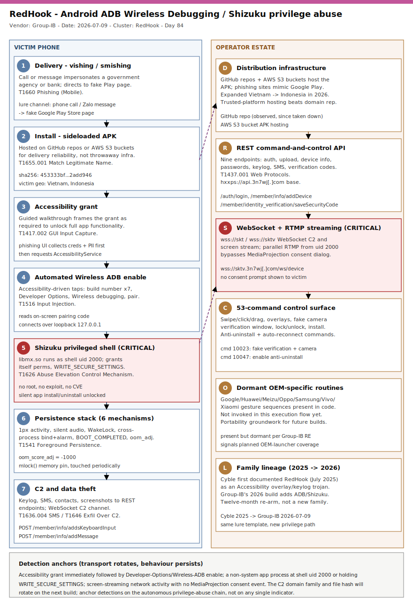

# RedHook Returns: ADB Wireless Debugging and Shizuku Turn Accessibility Abuse into Shell-Level Privilege

## TL;DR

RedHook is an Android Remote Access Trojan first documented by Cyble Research and Intelligence Labs in July 2025 targeting Vietnamese banking customers; Group-IB's report published 2026-07-09 (amplified by BleepingComputer on 2026-07-12) documents a significantly upgraded variant that autonomously abuses Android's Wireless Debugging (Wireless ADB) feature and the open-source Shizuku framework to obtain shell-level privileges (uid 2000) without rooting the device or exploiting any vulnerability. Victims are reached by phone calls or messages impersonating government agencies or financial institutions and are guided into sideloading an APK from a fake Google Play Store page; once the malware's Accessibility service is granted, it autonomously navigates Settings, enables Developer Options, and self-pairs Wireless ADB over the loopback interface, launching a privileged Shizuku-derived server (`libmx.so`) that can silently install or uninstall apps, grant itself further permissions, and stream the screen over RTMP while bypassing the mandatory MediaProjection consent dialog. Distribution has expanded beyond Vietnam into Indonesia, with malicious APKs hosted on GitHub repositories and AWS S3 buckets rather than throwaway domains, for delivery reliability. We cover it today (Monday, Espionage-day rotation, slot #11 Mobile, 37-day gap since the last primary in this slot) because it is the first publicly documented case of Android malware abusing a legitimate developer debugging interface -- not a CVE, not root -- to reach an autonomous privileged shell entirely on-device, a technique class defenders should now treat as a first-class abuse surface alongside Accessibility itself.

## Attribution and confidence

**Cluster:** RedHook -- an Android banking RAT family, named and first documented by Cyble Research and Intelligence Labs in July 2025. Neither Cyble nor Group-IB attach a named threat-actor or group identity; this is tracked as a malware family/campaign, not an attributed group.

**Vendor / date:** Group-IB Threat Intelligence, "RedHook Returns with a Dangerous Upgrade" (analysts Sharmine Low and Ha Thi Thu Nguyen), published 2026-07-09. Corroborated the same week by BleepingComputer (Bill Toulas), 2026-07-12, and picked up by AndroidAuthority, AndroidHeadlines, and PhoneArena.

**Confidence:** **high** on the technical mechanics -- Group-IB's report includes a screen recording of the automated ADB-enable sequence, a full 53-entry command table, and published network/file indicators. **low** on actor attribution -- no named group, nationality, or organisational motive statement is published beyond "financially motivated, Southeast-Asia-focused"; do not read the Vietnamese/Indonesian victim geography as evidence of operator nationality.

| Overlap signal | What it suggests | Strength |
|---|---|---|
| Shared "RedHook" family name and banking-lure template (Cyble, July 2025 -> Group-IB, July 2026) | Same malware lineage, actively maintained and re-armed over roughly 12 months | high |
| Shizuku framework code reuse (legitimate, open-source, not malicious on its own) | Lowers the engineering bar for on-device privilege abuse; a tooling signal, not an actor link | n/a -- tooling |
| GitHub/AWS S3 hosting replacing throwaway domains | Operational maturity: trusted-platform abuse for payload delivery reliability | medium |
| Expansion from Vietnam-only (2025) to Vietnam + Indonesia (2026) | Regional targeting growth, still Southeast-Asia scoped | medium |

**Genealogy with previous repo cases.** RedHook is a direct evolution of the family Cyble first reported in July 2025 (Vietnamese banking customers, Accessibility-based overlay and keylogging). This is the first repo case built around ADB Wireless Debugging plus Shizuku privilege abuse as the core primitive. The closest repo sibling is `2026-06-13_DevilNFC-NFCMultiPay-NFC-Relay` (slot #11, Day 47) -- both start from the same phishing-plus-Accessibility-grant foundation, but where DevilNFC/NFCMultiPay pivot into NFC/HCE card-present relay, RedHook pivots into an autonomous, on-device, shell-level privilege escalation via a legitimate debugging interface, a different "escape the app sandbox" primitive on the same social-engineering base. It also extends the Accessibility-abuse thread opened by `2026-05-09_Albiriox-Android-MaaS-AcVNC` (Accessibility-driven remote control as a malware-as-a-service commodity) one step further: from remote-controlling the app sandbox to escaping it entirely without root.

## Kill chain — summary table

| Stage | MITRE (Mobile) | Detail |
|---|---|---|
| Delivery | T1660 | Phone call or message impersonating a government agency or bank directs the victim to a fake Google Play Store page |
| Install | T1655.001 | Sideloaded APK hosted on GitHub or an AWS S3 bucket, styled after the impersonated organisation |
| Accessibility grant | T1417.002 | Guided walkthrough tricks the victim into granting Accessibility Service "to enable full app functionality" |
| Automated privilege abuse | T1516 | Accessibility-driven taps enable Developer Options and Wireless ADB, then self-pair over `127.0.0.1` |
| Shizuku privileged shell (CRITICAL) | T1626 | `libmx.so` launches under uid 2000; grants itself runtime permissions, `WRITE_SECURE_SETTINGS`, silent install/uninstall |
| Persistence stack | T1541 | One-pixel activity, silent audio, WakeLock, cross-process resurrection, 5-minute watchdog, `BOOT_COMPLETED`, `oom_score_adj=-1000` |
| C2, streaming, exfiltration (CRITICAL) | T1437.001 / T1636.004 / T1646 | WebSocket C2 plus shell-privileged RTMP screen streaming (bypasses MediaProjection consent); keylog/SMS/contact theft to REST endpoints |



The left lane follows the victim's phone from the vishing/smishing lure through Accessibility abuse to autonomous privilege escalation, persistence, and data theft; the right lane covers the operator's distribution infrastructure (GitHub/S3, fake Play Store pages), the REST/WebSocket command-and-control estate, the 53-command control surface, and the dormant OEM-specific enablement code paths. The two critical (red) anchors are the moment the malware obtains the Shizuku-derived shell-level shell (uid 2000) and the WebSocket-plus-RTMP channel that streams the screen without ever showing the MediaProjection consent dialog -- both are the durable behavioural signals, since the C2 domains and file hashes will rotate per build.

## Stage-by-stage detail

### 1. Delivery -- vishing/smishing impersonating a government or bank (T1660)

Group-IB documents attackers initiating contact by phone call or messaging app (Zalo is named in the Vietnamese screenshots), impersonating a trusted organisation or support desk, and persuading the victim that installing an app is a required step to access a service or complete an official procedure. The victim is directed to a phishing site engineered to closely mimic the Google Play Store's visual design.

### 2. Install -- sideloaded APK hosted on trusted developer platforms (T1655.001)

```
Distribution infrastructure (Group-IB, 2026-07-09):
  - GitHub repositories hosting malicious APKs (observed repository since taken down)
  - AWS S3 buckets hosting malicious APKs
  - Phishing sites visually mimicking the Google Play Store
```

Hosting payloads on GitHub and AWS S3 instead of throwaway attacker-registered domains improves delivery reliability and complicates naive domain-reputation blocking, since the hosting platform itself is legitimate.

### 3. Accessibility grant -- phishing UI and guided walkthrough (T1417.002)

RedHook's phishing screens impersonate the visual identity of the spoofed government or financial organisation and first prompt the victim for credentials, personal information, and security codes. The app then walks the victim through enabling the Accessibility service, framed as a requirement to unlock the app's full functionality. This single grant is what makes every subsequent autonomous step possible.

### 4. Automated ADB Wireless Debugging activation (T1516)

Once Accessibility is granted, the malware performs a fully automated, on-screen sequence with no further victim interaction (normally hidden behind a full-screen overlay; Group-IB removed the overlay for their screen recording):

```
Automated Accessibility-driven sequence (Group-IB):
1. Taps the build-number field 7 times -> unlocks Developer Options
2. Settings -> Developer Options -> Wireless debugging -> enable
3. Selects "Use wireless debugging"
4. Selects "Pair device with pairing code"
5. Reads the on-screen pairing code and completes ADB pairing over 127.0.0.1
```

The malware also embeds OEM-specific gesture sequences for Google, Huawei, Meizu, Oppo, Samsung, Vivo, and Xiaomi ROMs to reach the equivalent settings screens on customised launchers. Group-IB observed these routines present in the code but **not currently invoked** in the execution flow -- consistent with future-portability groundwork rather than active use today.

### 5. Shizuku privileged shell -- uid 2000 (T1626) [CRITICAL]

The malware embeds its own ADB client and connects to the device's own ADB daemon over the loopback interface (`127.0.0.1`), so the entire ADB flow runs on-device with no PC or USB cable involved. Once paired, it launches `libmx.so` -- a bundled server derived from the open-source Shizuku project -- under shell uid 2000, a Linux identity Android grants significantly more trust than an ordinary app. Through Binder IPC, the app borrows that identity to:

```
Capabilities unlocked once libmx.so is running as uid 2000:
  - Grant itself arbitrary runtime permissions
  - Execute arbitrary shell commands as uid 2000
  - Capture low-level touch events
  - Grant itself WRITE_SECURE_SETTINGS -> write directly to Settings.Secure
  - Silently install / uninstall applications, no confirmation dialog
```

This is not root and not an exploit -- it is a legitimate debugging interface, self-activated end to end by an app the victim was tricked into trusting.

### 6. Persistence stack (T1541)

RedHook combines six independent mechanisms so its foreground service and C2 channel survive idle periods, OEM battery optimisation, and partial process kills:

- **One-pixel activity** -- launches a near-invisible 1x1 activity when the screen turns off, which Android's process manager classifies as foreground, granting top process priority.
- **Silent audio (MediaSession)** -- plays silent audio to be treated as an active-media, high-priority process.
- **WakeLock** -- held inside a foreground service to prevent the CPU from sleeping and the service being suspended.
- **Cross-process bind and alarm** -- two services in separate processes bind to each other with `BIND_AUTO_CREATE`; if either is killed, the survivor detects the disconnection and relaunches its partner, plus a 5-minute alarm double-checks both are alive.
- **`BOOT_COMPLETED` receiver** -- re-enables Wireless ADB via `Settings.Global`, reloads the stored ADB key, and re-establishes the shell-uid helper within seconds of power-on.
- **OOM score adjustment and memory pinning** -- writes `-1000` to its own `/proc/<pid>/oom_score_adj` and `mlock()`s a small memory block, touched periodically, to resist low-memory process kills.

### 7. Command-and-control, screen streaming, and data theft (T1437.001, T1636.004, T1646)

RedHook uses WebSocket for command-and-control and screen streaming, and dedicated REST endpoints for bulk data upload:

```
wss://skt.3n7wj[.]com                                    - WebSocket C2
wss://sktv.3n7wj[.]com/ws/device?menberId=<id>&deviceId=<id>  - WebSocket screen streaming
hxxps://api.3n7wj[.]com                                  - REST API base
```

| Endpoint | Purpose |
|---|---|
| `/auth/login` | Initial username/password exfiltration |
| `/file/upload` | Screenshot upload |
| `/member/info/addDevice` | Device information upload |
| `/member/info/addDevicePassword` | Password upload |
| `/member/info/addsDevicePassword` | Bulk password upload |
| `/member/info/addsKeyboardInput` | Keylog upload |
| `/member/info/addMessage` | SMS exfiltration |
| `/member/modifyInfo` | User-input information upload |
| `/member/identity_verification/saveSecurityCode` | User-input verification code upload |

Once the shell-privileged server is active, RedHook additionally streams the screen over **RTMP in parallel**, capturing directly with shell privileges -- this bypasses the `MediaProjection` API and its mandatory user-consent dialog entirely, so the absence of a screen-capture consent prompt cannot be treated as evidence that no screen capture occurred.

## RE notes

| Component | SHA256 | Lang | Packer | Notes |
|---|---|---|---|---|
| RedHook APK sample (file indicator) | `453333bffdd1850ea2e0647f7c805530b578919978a01b1e2be52d6eb2add946` | Java/Kotlin (Android APK) + native `libmx.so` (Shizuku-derived) | not disclosed by vendor | Group-IB's only published file indicator; no packer/obfuscation detail released publicly beyond the command table and endpoint list above |

## Detection strategy

### Telemetry that matters

- **MTD/EMM app-install and permission events:** sideloaded installer source, Accessibility Service grant, Developer Options state change, ADB/Wireless-debugging state change, `WRITE_SECURE_SETTINGS` grant to a non-system, non-MDM-managed app.
- **Shell/uid anomalies:** any non-system app process associated with shell uid (2000) activity -- normally exclusive to ADB- or Shizuku-aware power-user tooling deliberately installed by the device owner.
- **MediaProjection-bypass indicator:** screen-capture or streaming network activity with no corresponding `MediaProjection` consent-dialog event in the same session.
- **Network egress:** WebSocket connections to the `3n7wj[.]com` subdomain family, REST calls to `api.3n7wj[.]com` under `/member/*`, and RTMP streams originating from a mobile endpoint.
- **Persistence indicators:** a `BOOT_COMPLETED` receiver that re-enables ADB/Wireless-debugging state; two services bound to each other via `BIND_AUTO_CREATE`; `oom_score_adj` manipulation (requires an MTD/EDR agent with process introspection; not available on stock Android without an agent).

### Detection coverage

| Engine | File | Logic |
|---|---|---|
| Sigma | `sigma/android_wireless_adb_autoenable_accessibility.yml` | mobile_event: Developer Options / Wireless-debugging state enabled by a non-system app shortly after an Accessibility Service grant |
| Sigma | `sigma/android_shell_uid_privileged_process_non_system_app.yml` | mobile_event: non-system app process associated with shell uid (2000), or `WRITE_SECURE_SETTINGS` granted outside MDM |
| Sigma | `sigma/android_mediaprojection_bypass_screen_stream.yml` | mobile_event: screen-capture/streaming network activity with no preceding `MediaProjection` consent event |
| KQL | `kql/redhook_c2_websocket_rest_network.kql` | DeviceNetworkEvents: egress to the `3n7wj[.]com` WebSocket/REST domain family |
| KQL | `kql/redhook_accessibility_adb_enable_chain.kql` | DeviceEvents: Accessibility grant followed by Developer-Options/Wireless-ADB enable within a short window |
| KQL | `kql/redhook_privileged_shell_uid_anomaly.kql` | DeviceEvents: shell-uid (2000) process activity or `WRITE_SECURE_SETTINGS` grant from a non-system app |
| YARA | `yara/redhook_android_rat_privilege_abuse.yar` | `libmx.so`, REST endpoint path strings, and the known SHA256, plus a generic ADB/Shizuku-abuse heuristic |
| Suricata | `suricata/redhook_c2_websocket_rest.rules` | TLS SNI on the `3n7wj[.]com` subdomain family plus REST keylog/exfil URI paths |

### Threat hunting hypotheses

- **H1** (`hunts/peak_h1_accessibility_adb_enable_chain.md`) -- an app that was granted Accessibility Service shortly followed by a Developer-Options-enabled and Wireless-ADB-enabled state change with no corresponding IT/user-initiated developer action. The chain, not any single event, is the lead.
- **H2** (`hunts/peak_h2_shell_uid_writesecuresettings_anomaly.md`) -- a non-system, non-power-user-installed app whose process is associated with shell uid (2000), or that has been granted `WRITE_SECURE_SETTINGS`, outside any known Shizuku/ADB power-user workflow.
- **H3** (`hunts/peak_h3_mediaprojection_bypass_c2_egress.md`) -- devices with sustained outbound WebSocket/RTMP-pattern network activity to unfamiliar domains with no corresponding `MediaProjection` consent-dialog event, especially when paired with egress to the `3n7wj[.]com` domain family.

## Incident response playbook

### First 60 minutes (triage)

1. Determine whether the device is corporate-managed (MDM/MTD-enrolled) or personal (BYOD); isolate corporate-managed devices immediately via MDM.
2. Pull the MTD/EDR mobile app inventory and installer source for the suspected package -- a sideloaded installer combined with a recent Developer-Options-enabled state change is the primary lead.
3. Check the device's settings/audit history for a `WRITE_SECURE_SETTINGS` grant or a Developer-Options state change attributable to a non-system app.
4. If Wireless Debugging is enabled and was not knowingly paired by IT or the user for legitimate development, treat the device as remotely controlled at shell privilege (uid 2000) -- assume screen content, keystrokes, SMS, and contacts have been exposed.
5. Capture the installed-app inventory, granted permissions, and recent network destinations (WebSocket/REST to `3n7wj[.]com`) before remediation.
6. Force credential resets, through a trusted separate channel, for any account whose credentials or OTPs may have transited the device during the compromise window.

### Artifacts to collect

| Artifact | Path | Tool | Why |
|---|---|---|---|
| Malicious APK | `/data/app/<pkg>` or the Downloads directory | `adb pull` / MDM app-pull | hash, package name, manifest, requested permissions |
| Developer Options / ADB state | `Settings.Global` (`development_settings_enabled`, `adb_wifi_enabled`) | `adb shell settings get global <key>` | confirms self-enabled Wireless Debugging |
| Accessibility service grants | `Settings.Secure` (`enabled_accessibility_services`) | `adb shell settings get secure enabled_accessibility_services` | confirms the granted Accessibility service package |
| App inventory + permissions | MTD console / `DeviceTvmSoftwareInventory` | Defender for Endpoint (mobile) / MDM | sideloaded package, granted permissions |
| Network destinations | MTD flow / `DeviceNetworkEvents` | Defender for Endpoint / MTD | `3n7wj[.]com` REST/WebSocket egress |
| Process uid map | analyst-controlled debug environment only | `adb shell ps -A -o UID,PID,NAME` | confirms a non-system process running as shell uid 2000 |

### IR queries and commands

```bash
# Confirm Wireless Debugging / Developer Options / Accessibility state (MDM remote-adb or physical access)
adb shell settings get global development_settings_enabled
adb shell settings get global adb_wifi_enabled
adb shell settings get secure enabled_accessibility_services

# Enumerate sideloaded (non-store) third-party packages and pull the suspected APK
adb shell pm list packages -3
adb pull /data/app/~~<random>/<pkg>-1/base.apk ./redhook_sample.apk
```

```kql
// Managed Android devices reaching the RedHook C2 domain family
DeviceNetworkEvents
| where RemoteUrl has_any ("3n7wj.com", "api.3n7wj.com", "skt.3n7wj.com", "sktv.3n7wj.com")
| project Timestamp, DeviceName, RemoteUrl, RemoteIP, InitiatingProcessFileName
```

```powershell
# Corporate-managed devices: pull MDM compliance / app-inventory state for the suspected package (Intune example)
Get-MgDeviceManagementManagedDevice -Filter "operatingSystem eq 'Android'" |
  Where-Object { $_.DeviceName -in $SuspectDeviceNames } |
  Select-Object DeviceName, ComplianceState, LastSyncDateTime
```

### Containment, eradication, recovery

Isolate the device via MDM, or advise the user to power it off and stop using it. Uninstall the malicious package -- this may require Safe Mode if the anti-uninstall command was issued by the operator -- and revoke Accessibility, `WRITE_SECURE_SETTINGS`, and Developer Options grants. Disable Wireless Debugging and re-lock Developer Options. Reset all credentials, OTP-protected accounts, and any banking session that may have transited the device, through a trusted separate channel. Block the `3n7wj[.]com` domain family and associated infrastructure at network egress. **Exit criteria:** malicious package removed; Developer Options / Wireless Debugging disabled; no residual Accessibility grant to an unrecognised package; no further egress to the `3n7wj[.]com` domain family; affected credentials rotated. **What NOT to do:** do not assume the absence of a `MediaProjection` consent prompt means no screen capture occurred; do not rely on SMS-delivered OTPs on the compromised device as a reset factor; do not treat a "clean" static AID/permission review as sufficient without checking uid-level process behaviour.

### Recovery validation

Re-baseline the device's installed-app inventory and granted permissions (Accessibility, `WRITE_SECURE_SETTINGS`, Developer Options state); confirm no process holds shell-uid (2000) capability outside expected, deliberately-installed ADB/Shizuku power-user tooling; verify no further connections to the `3n7wj[.]com` domain family; confirm the delivery vector (vishing/smishing script, fake Play Store URL) has been briefed to the user so a re-delivery attempt is recognised.

## IOCs

| Type | Value | Context | Confidence | Source |
|---|---|---|---|---|
| note |  | RedHook Android RAT (Group-IB, upgraded variant reported 2026-07-09; original family documented by Cyble, July 2025). No CVE in scope -- this is abuse of a legitimate ADB Wireless Debugging feature via Accessibility-driven automation and the open-source Shizuku framework, not a patchable vulnerability. Domain/endpoint IOCs rotate per build; the durable anchors are the automated Developer-Options/Wireless-ADB-enable behavioural chain and shell-uid (2000) process anomalies. | high | Group-IB |
| sha256 | 453333bffdd1850ea2e0647f7c805530b578919978a01b1e2be52d6eb2add946 | RedHook APK sample | high | Group-IB |
| domain | 3n7wj[.]com | RedHook C2 base domain (api/skt/sktv subdomains) | high | Group-IB |
| url | hxxps://api.3n7wj[.]com | RedHook REST C2 endpoint base | high | Group-IB |
| url | wss://skt.3n7wj[.]com | RedHook WebSocket C2/streaming | high | Group-IB |
| url | wss://sktv.3n7wj[.]com/ws/device | RedHook WebSocket screen-streaming endpoint | high | Group-IB |
| string | libmx.so | RedHook bundled Shizuku-derived privileged server binary | high | Group-IB |
| string | /auth/login | RedHook REST endpoint -- initial credential exfiltration | medium | Group-IB |
| string | /file/upload | RedHook REST endpoint -- screenshot upload | medium | Group-IB |
| string | /member/info/addDevice | RedHook REST endpoint -- device info upload | medium | Group-IB |
| string | /member/info/addsKeyboardInput | RedHook REST endpoint -- keylog upload | medium | Group-IB |
| string | /member/info/addMessage | RedHook REST endpoint -- SMS exfiltration | medium | Group-IB |
| string | /member/identity_verification/saveSecurityCode | RedHook REST endpoint -- verification code theft | medium | Group-IB |
| note |  | Automated Accessibility-driven ADB Wireless Debugging enable chain (tap build number x7, then Developer Options, then Wireless debugging, then pair over 127.0.0.1) is the durable behavioural anchor per Group-IB; not tied to any single hash or domain. | high | Group-IB |
| note |  | Shell-uid (2000) process activity by a non-system, non-Shizuku-installed app, and unexplained WRITE_SECURE_SETTINGS grants, are anomalous on stock (non power-user) Android fleets. | medium | Group-IB |

No CVE is in scope for this case -- RedHook's privilege abuse targets a legitimate debugging feature (ADB Wireless Debugging) and a legitimate open-source framework (Shizuku), not a patchable vulnerability, so no `kev.md` is generated for this case.

Full machine-readable list in [`iocs.csv`](./iocs.csv).

## Secondary findings

- **Rokarolla (Malwarebytes / Infosecurity Magazine, June 2026).** A separately-developed Android banking trojan targeting 217 banking and cryptocurrency apps through a 137-command toolkit, distributed via sites masquerading as TikTok or Chrome with a dropper posing as Google Play Protect to slip a second-stage payload past Android's defenses. A parallel, convergent evolution toward full-device-takeover Accessibility-driven RATs by a different developer group, same target class as RedHook.
- **BITTER-linked hack-for-hire operation (Lookout / Access Now / SMEX, reported 2026-04-08; slot #2 Hack-for-hire adjacency).** An offshoot of the Appin-linked hack-for-hire ecosystem ran ProSpy, Android spyware masquerading as Signal, WhatsApp, ToTok, and Botim, alongside roughly 1,500 phishing domains mimicking iCloud/FaceTime/Apple sign-in, targeting Egyptian and Lebanese journalists and activists between 2023 and 2025. Illustrates the dual-platform (Android app plus iCloud credential) targeting model as a complement to single-platform Android RATs like RedHook.
- **NFCShare (BleepingComputer, June 2026).** GitHub-hosted fake banking-app "update" APKs (56 unique samples tracked since an April 2026 repository creation date) targeting Italian and Spanish bank customers, now shipping deliberately malformed ZIP paths to defeat automated extraction tooling. The same GitHub-as-CDN distribution-reliability abuse RedHook uses for its own payload hosting.

## Pedagogical anchors

- Legitimate debugging and power-user tooling (ADB Wireless Debugging, Shizuku) becomes a first-class privilege-escalation surface the moment Accessibility grants an app the ability to drive the UI on its own -- no CVE, no root, and no exploit are required.
- The consent dialog is not a reliable control once shell-uid access is obtained: RedHook's RTMP shell-privileged stream bypasses the mandatory MediaProjection dialog entirely, so "no consent prompt fired" cannot be read as "no screen capture happened."
- Dormant, OEM-specific code paths (present but unused for Huawei, Samsung, Xiaomi, and others) show operators building for future portability before they need it -- track capability present in the code, not only what the current sample invokes.
- Trusted-platform abuse for delivery (GitHub, AWS S3) instead of throwaway attacker domains raises payload availability and defeats naive domain-reputation blocking -- treat unexpected APK downloads from developer platforms as suspicious regardless of the hosting service's own reputation.
- A malware family documented once is not "done": RedHook shows roughly a twelve-month gap between first documentation (Cyble, 2025) and a substantially more dangerous re-armed variant (Group-IB, 2026) -- track family names over time, not single snapshots.

## What's in this folder

| File | Purpose |
|---|---|
| [`README.md`](./README.md) | This write-up (15 sections). |
| [`kill_chain.svg`](./kill_chain.svg) | Two-lane kill chain (victim phone vs. operator infrastructure and command surface). |
| [`sigma/android_wireless_adb_autoenable_accessibility.yml`](./sigma/android_wireless_adb_autoenable_accessibility.yml) | Accessibility-driven Developer Options / Wireless-ADB enable chain (T1516). |
| [`sigma/android_shell_uid_privileged_process_non_system_app.yml`](./sigma/android_shell_uid_privileged_process_non_system_app.yml) | Non-system app process at shell uid 2000 or unexplained `WRITE_SECURE_SETTINGS` (T1626). |
| [`sigma/android_mediaprojection_bypass_screen_stream.yml`](./sigma/android_mediaprojection_bypass_screen_stream.yml) | Screen-streaming activity with no `MediaProjection` consent event (T1437.001). |
| [`kql/redhook_c2_websocket_rest_network.kql`](./kql/redhook_c2_websocket_rest_network.kql) | Egress to the `3n7wj[.]com` WebSocket/REST domain family. |
| [`kql/redhook_accessibility_adb_enable_chain.kql`](./kql/redhook_accessibility_adb_enable_chain.kql) | Accessibility grant followed by Developer-Options/Wireless-ADB enable. |
| [`kql/redhook_privileged_shell_uid_anomaly.kql`](./kql/redhook_privileged_shell_uid_anomaly.kql) | Shell-uid (2000) process activity or `WRITE_SECURE_SETTINGS` grant anomaly. |
| [`yara/redhook_android_rat_privilege_abuse.yar`](./yara/redhook_android_rat_privilege_abuse.yar) | `libmx.so`, REST endpoint strings, known SHA256, and a generic ADB/Shizuku-abuse heuristic. |
| [`suricata/redhook_c2_websocket_rest.rules`](./suricata/redhook_c2_websocket_rest.rules) | TLS SNI on the `3n7wj[.]com` family plus REST keylog/exfil URI paths. |
| [`hunts/peak_h1_accessibility_adb_enable_chain.md`](./hunts/peak_h1_accessibility_adb_enable_chain.md) | Accessibility-to-ADB-enable behavioural chain hunt. |
| [`hunts/peak_h2_shell_uid_writesecuresettings_anomaly.md`](./hunts/peak_h2_shell_uid_writesecuresettings_anomaly.md) | Shell-uid / `WRITE_SECURE_SETTINGS` anomaly hunt. |
| [`hunts/peak_h3_mediaprojection_bypass_c2_egress.md`](./hunts/peak_h3_mediaprojection_bypass_c2_egress.md) | MediaProjection-bypass streaming plus C2-egress hunt. |
| [`iocs.csv`](./iocs.csv) | Machine-readable IOCs and behavioural anchors. |

## Sources

- [Group-IB Blog -- RedHook Returns with a Dangerous Upgrade (2026-07-09)](https://www.group-ib.com/blog/redhook-android-rat-upgraded/)
- [BleepingComputer -- RedHook Android malware now uses Wireless ADB for shell access (2026-07-12)](https://www.bleepingcomputer.com/news/security/redhook-android-malware-now-uses-wireless-adb-for-shell-access/)
- [Cyble -- RedHook: New Android Banking Trojan Targeting Vietnam (2025)](https://cyble.com/blog/redhook-new-android-banking-targeting-in-vietnam/)
- [Android Authority -- New malware for Android can empty your bank accounts in secret](https://www.androidauthority.com/redhook-android-malware-wireless-adb-3686774/)
- [Android Headlines -- RedHook Malware Just Got Scarier](https://www.androidheadlines.com/2026/07/redhook-malware-just-got-scarier-it-can-now-control-your-android-phone-wirelessly.html)
- [PhoneArena -- This new Android malware doesn't just spy on your phone, it hijacks it](https://www.phonearena.com/news/this-new-android-malware-doesnt-just-spy-on-your-phone-it-hijacks-it_id181825)
- [Shizuku -- open-source privileged-shell framework (GitHub)](https://github.com/RikkaApps/Shizuku)
- [MITRE ATT&CK Mobile -- T1516 Input Injection](https://attack.mitre.org/techniques/T1516/)
- [MITRE ATT&CK Mobile -- T1626 Abuse Elevation Control Mechanism](https://attack.mitre.org/techniques/T1626/)
