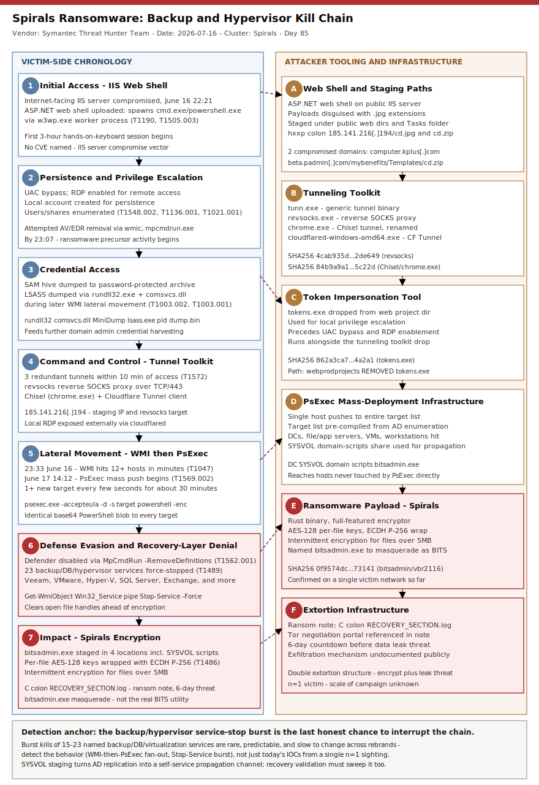

# Spirals ransomware: IIS web shell to full-network encryption in under 24 hours, 23 backup/database/hypervisor services killed on the way

## TL;DR

Symantec's Threat Hunter Team (2026-07-16) disclosed **Spirals**, a previously unseen Rust-based ransomware family deployed against an IT services company in South Asia in June 2026. The operator compromised an internet-facing IIS web server, uploaded an ASP.NET web shell, and moved from that foothold to full-network encryption in **under 24 hours** — a three-hour hands-on-keyboard session on day one (UAC bypass, RDP enable, SAM hive dump, three redundant tunnels) followed by WMI and then PsExec-driven mass lateral movement on day two. Before detonating the payload (disguised as `bitsadmin.exe`), the operator's PowerShell precursor disabled Windows Defender and forcibly stopped **23 backup, database, and virtualization services by name/description pattern** — Veeam, VMware, Hyper-V, Exchange, SQL Server, Oracle, MySQL, PostgreSQL, Acronis, Veritas, Commvault, SAP, Sage, Intuit, Lotus Domino — the textbook pre-ransomware "kill the recovery layer" objective that anchors slot #30 of this repo. The case is fresh (published this week, corroborated by BleepingComputer and Help Net Security) and, unusually for a first-sighting ransomware family, ships full file hashes and network infrastructure from a single confirmed victim, making it a strong primary despite the still-thin (n=1) sample set.

## Attribution and confidence

**Cluster: Spirals** (self-named in the ransom note and Tor negotiation portal; the family name comes directly from the operators, not a vendor-assigned alias). No group or individual identity, nationality, or affiliate-program membership is claimed by Symantec — the actor behind the attack "remains unknown."

- **High confidence** on technical mechanics: Symantec's Threat Hunter Team directly observed the intrusion telemetry (process trees, WMI/PsExec command lines, dropped files) on the victim network and published seven SHA-256 file hashes plus five network indicators tied to a single, fully-reconstructed timeline (2026-06-16 22:21 initial compromise through 2026-06-17 payload deployment).
- **Low confidence** on actor attribution: no nation-state or named e-crime group is attached. Symantec explicitly flags that Spirals has been seen on **only one victim** so far, so it is unclear whether this is a new commodity RaaS family about to scale or a bespoke payload built for this single target. Treat "Spirals" as a malware-family designation, not a threat-actor name.
- **Confidence in the operational pattern (backup/hypervisor service kill before encryption)**: high — this is a directly observed PowerShell command (reproduced verbatim in Stage-by-stage detail below), not an inference.

**Overlap / genealogy with previous repo cases (slot #30 — Backup/DR/hypervisor ransomware):**

| Case | Date | Repo day | Relationship to Spirals |
|---|---|---|---|
| [Kyber dual ESXi+Windows ransomware](../../06/2026-06-09_Kyber-Dual-ESXi-Windows-Backup-Hypervisor-Ransomware/README.md) | 2026-06-09 | Day 43 | Same slot, same "kill backup/hypervisor recovery before encrypting" objective; Kyber ships coordinated ELF+PE encryptors and abuses native `esxcli`/shadow-copy commands, Spirals is Windows-only and stops named services via a `Get-WmiObject Win32_Service` sweep instead. No shared code, infrastructure, or actor overlap — independent convergent evolution toward the same pre-ransomware objective. |
| [Black Shadow / Ababil of Minab recovery-layer destruction](../../05/2026-05-31_BlackShadow-AbabilOfMinab-Recovery-Layer-Destruction/README.md) | 2026-05-31 | Day 34 | Same slot, opposite motive: Black Shadow (Iran-MOIS nexus) *destroys* vCenter VMs and Veeam chains as an end in itself (wiper-adjacent, hacktivist-branded), while Spirals stops backup *services* only as a precondition for its own encryption — recovery denial is a means, not the goal. No actor or infrastructure overlap. |

No prior primary or secondary in this repo mentions "Spirals," `bitsadmin.exe`-as-ransomware, or the `185.141.216[.]194` staging IP (`grep -rliE "spirals" days/ byActor/` returned zero hits before today).

## Kill chain — summary table

| Stage | MITRE | Detail |
|---|---|---|
| Initial access | T1190, T1505.003 | Internet-facing IIS web server compromised; ASP.NET web shell uploaded, used to spawn `cmd.exe`/`powershell.exe` through the IIS worker process |
| Privilege escalation & persistence | T1548.002, T1136.001, T1021.001 | UAC bypass, local account created, RDP enabled — all within the first 3-hour session |
| Credential access | T1003.002, T1003.001 | SAM hive dumped to a password-protected archive; later, LSASS memory dumped via `rundll32.exe` + `comsvcs.dll` during lateral movement |
| Command and control | T1572 | Three redundant tunnels within 10 minutes of initial access: `revsocks` (reverse SOCKS to an external IP on TCP/443), Chisel (renamed `chrome.exe`), and a renamed Cloudflare Tunnel client exposing local RDP externally |
| Lateral movement | T1047, T1569.002 | WMI-based movement to a dozen+ hosts within minutes (2026-06-16 23:33) using domain admin credentials, followed the next day by mass PsExec pushes (`psexec.exe -accepteula -d -s`) of a base64 PowerShell blob, more than one new target every few seconds for ~30 minutes |
| Defense evasion & recovery-layer denial | T1562.001, T1489 | PowerShell payload disabled Windows Defender real-time monitoring + removed threat definitions, then force-stopped every running service matching 23 backup/database/virtualization name patterns (Veeam, VMware, Hyper-V, Exchange, SQL Server, Oracle, MySQL, PostgreSQL, Acronis, Veritas, Commvault, SAP, Sage, Intuit, Lotus Domino) |
| Impact | T1486, T1036.005 | Rust ransomware payload `bitsadmin.exe` (masquerading as the legitimate BITS utility) staged in four locations including the SYSVOL domain-scripts share for domain-wide propagation; per-file AES-128 keys wrapped with an attacker ECDH P-256 public key, intermittent encryption for files >5MB; ransom note `C:\RECOVERY_SECTION.log` threatens a 6-day data leak via a Tor negotiation portal |



The diagram's left lane follows the victim-side chronology from IIS web shell through credential theft, lateral movement, backup/hypervisor service kill, and final encryption; the right lane tracks the attacker's tooling and infrastructure (tunnel toolkit, token-impersonation tool, PsExec staging, the Rust payload itself, and the Tor extortion portal). The cross-lane arrows mark the two moments detection should anchor on: the WMI-to-PsExec handoff (automation signature) and the `Stop-Service` sweep immediately preceding encryption (the last honest chance to interrupt the chain before data loss).

## Stage-by-stage detail

### 1. Initial access — IIS web shell (T1190, T1505.003)

First observed activity: **2026-06-16 22:21 local time**. The attacker compromised an internet-facing IIS web server (Symantec does not name a specific CVE or misconfiguration — the entry vector is described only as "compromising" the server) and uploaded an ASP.NET web shell. The web shell was used to spawn `cmd.exe` and `powershell.exe` through the IIS worker process (`w3wp.exe`), giving the operator an interactive, hands-on-keyboard session without a separate C2 implant for the first three hours.

### 2. Staging and tunneling infrastructure (T1572)

Within the first 10 minutes, three separate tunneling/proxy tools were dropped under a public web production directory and the Windows Tasks folder — locations chosen to blend with legitimate scheduled-task and web-app binaries:

```
CSIDL_PROFILE\public\tunn.exe                                  (SHA256 7f0d49b1...9134b — tunnel binary)
CSIDL_WINDOWS\tasks\tunn.exe                                    (second copy)
CSIDL_WINDOWS\tasks\chrome.exe                                  (Chisel, renamed; SHA256 84b9a9a1...5c22d)
CSIDL_DRIVE_FIXED\webprodprojects\wicapfiles\cloudflared-windows-amd64.exe   (SHA256 b5d598b0...81556)
```

`revsocks.exe` (SHA256 4cab935d...2de649) was also dropped and executed from the same locations, establishing a reverse SOCKS proxy to the attacker's external IP over TCP/443. A token-impersonation tool, `tokens.exe` (SHA256 862a3ca7...4a2a1), ran from a separate web-project directory shortly after, most likely to acquire elevated privileges on the host.

### 3. Privilege escalation, persistence, credential access (T1548.002, T1136.001, T1021.001, T1003.002)

During the same three-hour session the operator: bypassed UAC for local privilege escalation, enabled RDP, created a local account for persistence, enumerated users/shares/installed-program directories, and attempted (unsuccessfully, per Symantec) to uninstall security tools with `wmic` and `mpcmdrun.exe`. Credential material was harvested by dumping the SAM hive to a password-protected archive. By **23:07**, telemetry showed ransomware-precursor activity — further attempts to disable security tooling and download additional utilities.

### 4. Lateral movement, phase 1 — WMI (T1047, T1003.001)

At **23:33** on 2026-06-16, the attacker began WMI-based lateral movement from the initial host, using multiple abused accounts including ones assessed as domain administrator. More than a dozen machines were hit within the first few minutes — a cadence Symantec characterizes as automated rather than manual exploration. LSASS process memory was dumped on multiple machines during this phase via `rundll32.exe` + `comsvcs.dll`, feeding further credential harvesting.

### 5. Lateral movement, phase 2 — PsExec mass push (T1569.002)

On **2026-06-17**, starting around 14:12–14:44, a single compromised host used PsExec to push an identical base64-encoded PowerShell payload to an extensive target list — domain controllers, file servers, application servers, VMs, and workstations — at a rate of more than one new target every few seconds for roughly 30 minutes:

```
CSIDL_WINDOWS\psexec.exe -accepteula -d -s \\<target> powershell -nop -w 1 -enc <base64-payload>
```

The breadth and pace strongly suggest a target list pre-compiled from Active Directory enumeration during the earlier foothold phase, not on-the-fly discovery.

### 6. Defense evasion + recovery-layer denial (T1562.001, T1489)

The decoded PowerShell payload ran two actions in sequence on every target. First, disable Defender:

```powershell
C:\progra~1\window~1\MpCmdRun.exe -RemoveDefinitions -All -DisableRealtimeMonitoring $true -Set-MpPreference -DisableIOAVProtection $true
```

Second, enumerate every running service whose Name, DisplayName, or Description matches 23 backup/database/virtualization name patterns and force-stop it:

```powershell
$p=@("*excha*","*hyper*","*vmms*","*vmcompute*","*virtual*","*veeam*","*backup*","*acronis*","*veritas*","*commvault*","*SQL Server*","*oracle*","*mysql*","*postgre*","*intuit*","*sage*","*sap*","*domino*")
$p|%{$pt=$_;Get-WmiObject Win32_Service|?{($_.Name -like $pt)-or($_.DisplayName -like $pt)-or($_.Description -like $pt)}|?{$_.State -eq 'Running'}|%{Stop-Service -Name $_.Name -Force -EA 0}}
```

This is standard pre-ransomware practice: open file handles held by backup and database engines will otherwise block the encryptor from touching the files those services hold open. The pattern list is broad enough to sweep Hyper-V's own management services (`vmms`, `vmcompute`) alongside third-party backup vendors, meaning the technique degrades both the hypervisor's own recovery tooling and any third-party backup product in one sweep.

### 7. Impact — Spirals encryptor (T1486, T1036.005)

The ransomware payload, `bitsadmin.exe` (SHA256 0f9574dc...73141), was staged in four locations to maximize propagation coverage, including the SYSVOL domain-scripts share hosted on a domain controller — a location replicated domain-wide, letting the payload reach machines never directly touched by the PsExec push:

```
CSIDL_WINDOWS\bitsadmin.exe
CSIDL_PROFILE\desktop\bitsadmin.exe
CSIDL_WINDOWS\sysvol_dfsr\domain\scripts\bitsadmin.exe
\\[REMOVED]\esd\bitsadmin.exe
```

A further copy was dropped as `vbr2116.exe` in a user's Temp directory by a process masquerading as `svchost.exe`. Spirals is a full-featured Rust encryptor: defense evasion, lateral-movement helpers, process termination, obfuscation, and privilege-escalation code are all built in. Each file is encrypted with a per-file AES-128 key wrapped by an attacker-controlled ECDH P-256 public key; files over 5MB use intermittent encryption across jittered chunks to speed the locking cycle. The ransom note `C:\RECOVERY_SECTION.log` directs victims to a Tor negotiation portal and threatens publication of stolen data within six days — a standard double-extortion structure, though Symantec's report does not detail the exfiltration mechanism (staging directory, archive tool, or transfer channel), which is a genuine gap in current public reporting, not an omission on our part.

## Detection strategy

### Telemetry that matters

- **Sysmon**: Event ID 1 (process creation) for `w3wp.exe` spawning `cmd.exe`/`powershell.exe` (web shell execution pattern); Event ID 3 (network connection) for outbound TCP/443 to non-CDN IPs from IIS worker processes; Event ID 11 (file create) for `.exe` binaries dropped into `Tasks`, web production directories, and `SYSVOL\...\scripts`; Event ID 10 (process access) for `rundll32.exe` opening `lsass.exe` with `comsvcs.dll` as the target module.
- **Defender XDR / Microsoft Sentinel**: `DeviceProcessEvents` for `psexec.exe` command lines with `-s -d` against many distinct `<target>` hostnames in a short window; `DeviceNetworkEvents` for WMI (port 135/RPC + dynamic) fan-out from a single source host to a dozen+ destinations within minutes; `DeviceRegistryEvents` / `DeviceFileEvents` for `MpCmdRun.exe -RemoveDefinitions` execution; `DeviceEvents` for `Stop-Service` invoked against backup/virtualization service names in rapid succession.
- **Windows Event Log**: Security 4688 (process creation, if command-line auditing is enabled) for the exact `Get-WmiObject Win32_Service | Stop-Service` one-liner; System log Service Control Manager events (7036/7040) showing a burst of service stops across Veeam/VMware/SQL/Exchange services within seconds of each other — this burst pattern is a stronger and more durable signal than any single service name, because the target list will change release to release.

### Detection coverage

| Engine | File | Logic |
|---|---|---|
| Sigma | `sigma/spirals_iis_webshell_process_spawn.yml` | IIS worker process (`w3wp.exe`) spawning `cmd.exe`/`powershell.exe`/`conhost.exe` |
| Sigma | `sigma/spirals_mass_backup_service_stop.yml` | Rapid sequential `Stop-Service`/SCM stop events against backup, database, or hypervisor-named services from one host |
| Sigma | `sigma/spirals_lsass_dump_comsvcs.yml` | `rundll32.exe` invoking `comsvcs.dll,MiniDump` against `lsass.exe` PID |
| KQL | `kql/spirals_psexec_fanout.kql` | `DeviceProcessEvents` — one source host launching `psexec.exe -s -d` against many distinct remote targets inside a tight time window |
| KQL | `kql/spirals_defender_definitions_removed.kql` | `DeviceProcessEvents` — `MpCmdRun.exe -RemoveDefinitions -All -DisableRealtimeMonitoring` |
| KQL | `kql/spirals_masquerade_bitsadmin_binary.kql` | `DeviceFileEvents`/`DeviceProcessEvents` — a file or process named `bitsadmin.exe` whose path is NOT `%SystemRoot%\System32\bitsadmin.exe` |
| YARA | `yara/spirals_ransomware_family.yar` | Static match on the confirmed Spirals payload (Rust binary strings, ransom-note filename constant, PE section characteristics) plus the confirmed tunneling toolset hashes |
| Suricata | `suricata/spirals_tunnel_c2_infra.rules` | TLS SNI / plaintext HTTP indicators for the confirmed staging IP and the two compromised staging domains; generic reverse-SOCKS-over-443 heuristic |

**No SPL** — retired repo-wide since 2026-05-11.

### Threat hunting hypotheses

- **H1** (PEAK): *If* an internet-facing IIS server is compromised via web shell, *then* the worker process (`w3wp.exe`) will spawn an interactive shell within minutes, followed by tunneling-tool drops in Tasks/web-app directories inside the first 10 minutes. See `hunts/peak_h1_iis_webshell_to_tunnel_drop.md`.
- **H2** (PEAK): *If* an attacker is staging for ransomware deployment, *then* a burst of `Stop-Service` calls against backup/database/hypervisor-named services will precede file encryption by minutes, not hours — this is the last detectable moment before irreversible impact. See `hunts/peak_h2_mass_backup_service_stop_burst.md`.
- **H3** (PEAK): *If* PsExec is used for mass internal deployment, *then* one source host will open many near-simultaneous PsExec sessions carrying an identical base64-encoded PowerShell blob to distinct targets — a signature distinguishable from legitimate PsExec admin usage by fan-out rate and payload identity. See `hunts/peak_h3_psexec_identical_payload_fanout.md`.

## Incident response playbook

### First 60 minutes (triage)

1. Identify and isolate the internet-facing IIS server(s) from the network; preserve IIS logs and the web root before any remediation touches the filesystem.
2. Query EDR/Sentinel for any `w3wp.exe`-spawned `cmd.exe`/`powershell.exe` in the last 72 hours across all internet-facing IIS hosts, not just the one already flagged.
3. Check Service Control Manager logs (System 7036/7040) fleet-wide for a burst of backup/virtualization/database service stops within any single 5-minute window — this is the highest-confidence "are we mid-attack right now" signal.
4. If any host shows the `Stop-Service` burst pattern, immediately snapshot/segment backup infrastructure (Veeam repository server, vCenter/Hyper-V management hosts) from the production network — do not wait for full scope confirmation.
5. Pull domain controller SYSVOL replication logs for any newly-written `.exe` under `scripts\` — a positive hit means domain-wide propagation is already possible even to hosts never touched by PsExec.
6. Disable or rotate credentials for any account observed in WMI/PsExec lateral-movement command lines, prioritizing accounts with domain admin rights.

### Artifacts to collect

| Artifact | Path | Tool | Why |
|---|---|---|---|
| IIS worker process memory | `w3wp.exe` (PID at time of compromise) | Process dump (procdump/EDR) | Recover the web shell payload and any in-memory-only tooling before termination |
| Web shell file | IIS web root (`inetpub\wwwroot\...`) | File collection | Confirm shell type/capability, timestamp for dwell-time calc |
| SAM hive dump archive | Wherever the password-protected archive was staged (Temp, web project dirs) | File collection | Confirms credential-theft scope; feeds password-spray/account-rotation decisions |
| Tunneling binaries | `%PUBLIC%\tunn.exe`, `%WINDIR%\tasks\{tunn,chrome}.exe`, `wicapfiles\cloudflared-windows-amd64.exe` | File collection + hash | Confirm C2 channel(s) still active; block at egress |
| PsExec command-line history | EDR process-creation telemetry / Sysmon EID 1 | SIEM query | Reconstruct full blast radius (every `<target>` hostname touched) |
| SYSVOL scripts share | `\\<DC>\SYSVOL\<domain>\scripts\` | File collection | Confirm/deny domain-wide propagation vector; must be cleaned before any restore |
| Ransom note | `C:\RECOVERY_SECTION.log` on each encrypted host | File collection | Attribution corroboration (family name), Tor portal URL for negotiation/legal |

### IR queries and commands

```powershell
# Hunt for the exact Stop-Service sweep pattern in PowerShell script-block logs (EID 4104)
Get-WinEvent -LogName "Microsoft-Windows-PowerShell/Operational" -FilterXPath \
  "*[System[(EventID=4104)]] and *[EventData[Data[@Name='ScriptBlockText'] and contains(., 'Win32_Service')]]" |
  Where-Object { $_.Message -match 'Stop-Service' -and $_.Message -match 'veeam|vmms|commvault|acronis' }
```

```bash
# Confirm whether the confirmed staging infrastructure has been contacted from egress logs
grep -E "185\.141\.216\.194|computer\.kplus\.com|beta\.padmin\.com" /var/log/proxy/access.log
```

```kql
// Cross-check for the mass PsExec fan-out signature across the fleet before assuming single-host scope
DeviceProcessEvents
| where FileName =~ "PsExec.exe" or FileName =~ "PsExec64.exe"
| where ProcessCommandLine has "-s" and ProcessCommandLine has "-d"
| summarize TargetCount = dcount(DeviceName) by InitiatingProcessAccountName, bin(Timestamp, 30m)
| where TargetCount > 5
```

### Containment, eradication, recovery

Exit criteria for containment: every tunneling binary confirmed removed or blocked at egress, every account seen in lateral-movement telemetry rotated, SYSVOL scripts share confirmed clean, and Defender real-time monitoring confirmed re-enabled fleet-wide (not just on the originally-flagged hosts). **Do not** restore from backup until the SYSVOL propagation vector is closed — a clean restore onto a domain still serving the payload from `scripts\` will simply be re-encrypted. **Do not** assume a single-host `Stop-Service` sweep is contained without checking for the SYSVOL/DFSR copy of the payload, since that copy self-propagates independent of PsExec.

### Recovery validation

Before returning backup/virtualization services to production: confirm the backup catalog (Veeam configuration database, vCenter inventory) was not tampered with during the window the operator had SYSTEM-level PsExec access — restoring a compromised catalog can silently point restores at attacker-controlled or corrupted data. Validate restored file integrity against pre-incident hashes where available, and re-run the H2 hunt (mass service-stop burst) against the restored environment before declaring recovery complete.

## IOCs

| Type | Value | Context | Confidence | Source |
|---|---|---|---|---|
| sha256 | 0f9574dc38e5c34a31153f0bcc603c6ec29cb3bf65c3d25380dbe86d42573141 | Spirals ransomware payload (bitsadmin.exe, vbr2116.exe) | high | Symantec |
| sha256 | 4cab935d0ec400059a3fcdc95b6623efdd51a61dff401fba8d5da244cc2de649 | Revsocks reverse SOCKS proxy (revsocks.exe) | high | Symantec |
| sha256 | 7f0d49b11d0a3697685622ce510c570199bf2dc76515b3f9a6b6735de8c9134b | Tunnel binary (tunn.exe) | high | Symantec |
| sha256 | 83a7e51f3787ac5a8a9884edd0a58ddbef380969aa6529d282a461a1a614a892 | Suspicious file (unclassified by Symantec) | medium | Symantec |
| sha256 | 84b9a9a1668145df04faa3d0e118e2f0acbebd3d9d260baf3a355b44c815c22d | Chisel tunneling tool renamed chrome.exe | high | Symantec |
| sha256 | 862a3ca7e944ccf0ff3a6d556b34faade4b68343015c35a014a43725ac14a2a1 | Token impersonation tool (tokens.exe) | high | Symantec |
| sha256 | b5d598b00cc3a28cabc5812d9f762819334614bae452db4e7f23eefe7b081556 | Cloudflared client (cloudflared-windows-amd64.exe) | high | Symantec |
| ipv4 | 185.141.216.194 | Staging infrastructure; source of payload delivery and revsocks C2 destination | high | Symantec |
| url | hxxp://185.141.216[.]194/cd.jpg | Payload staged with .jpg extension to disguise download | high | Symantec |
| url | hxxp://185.141.216[.]194/cd.zip | Payload archive staging | high | Symantec |
| url | hxxps://computer.kplus[.]com/cd.zip | Compromised domain used for payload hosting | medium | Symantec |
| url | hxxps://beta.padmin[.]com/mybenefits/Templates/cd.zip | Compromised domain used for payload hosting | medium | Symantec |
| path | C:\RECOVERY_SECTION.log | Spirals ransom note filename/path | high | Symantec |
| string | RECOVERY_SECTION.log | Ransom note filename constant, usable as a file-creation detection string | high | Symantec |
| note | Symantec's IOC list does not include the Tor onion address for the negotiation portal in the public writeup; only the .log note path and the domain hosting infra above are public | Coverage gap disclosure | high | Symantec |

Full list (all 15 rows above) in [iocs.csv](./iocs.csv). No CVE is in scope for this case — initial access was via a compromised IIS web server without a named vulnerability, so no `kev.md` cross-reference applies here (verified: zero `CVE-` strings appear anywhere in this README).

## Secondary findings

- **A critical (CVSS 9.4) Veeam Backup & Replication authenticated-RCE flaw**: patched 2026-06-09, with a detailed root-cause writeup published by SecureLayer7 on 2026-07-06 showing the underlying pattern — Veeam's `RestrictedSerializationBinder` runs in blacklist mode over a BinaryFormatter deserialization pipeline, so any `[Serializable]` class not yet enumerated in the denylist (typically a `DataSet` subclass reachable through the same three-call WCF chain abused since a 2024 predecessor flaw) is a fresh RCE. Any authenticated domain user reaches SYSTEM code execution on the Backup Server itself — the same "control the backup infrastructure before ransomware" objective Spirals achieves by killing services from the outside, achieved instead from the inside by owning the Veeam server directly. Organizations should prioritize Veeam's own hardening guidance (workgroup-mode Backup Servers close the whole CVE family at the auth boundary) over chasing each individual denylist patch.
- **Coca-Cola-owned fairlife ransomware attack (disclosed 2026-07-16/17)**: fairlife suspended all US dairy production after a ransomware event affecting production-related systems; Canada operations were unaffected and no group has claimed responsibility as of this writing. No technical indicators are public yet, but the incident is included here as a live reminder of the business-continuity stakes behind slot #30 — a backup/recovery-layer compromise at a company this size translates directly into halted physical production, not just data loss.
- **GodDamn ransomware (Symantec, published 2026-07-09)**: the latest rebrand of the Monster→Beast lineage (developer tracked as "Hyadina"), notable for adopting the PoisonX kernel driver for BYOVD-based EDR killing ahead of encryption. Complements Spirals' approach: where Spirals disables Defender purely through the built-in `MpCmdRun.exe` utility, GodDamn escalates to a signed-but-abusable kernel driver to blind third-party EDR/AV — two different technical routes converging on the identical pre-ransomware requirement of "make the defenses blind before you touch the recovery layer."

## Pedagogical anchors

- **The backup/hypervisor service-stop sweep is a detection gift, not just a risk.** A `Stop-Service` burst against 15-23 named services in a handful of seconds is a rare moment where an attacker's automation *has* to touch a wide, predictable, and slow-changing namespace (Veeam, VMware, Hyper-V, SQL Server rarely change their service names) — building a detection on the burst pattern rather than any single name survives rebrand and re-tooling far better than IOC matching.
- **SYSVOL is a self-service payload distribution channel most defenders never think to monitor.** Placing the encryptor inside `SYSVOL\<domain>\scripts\` turns Active Directory's own replication into propagation infrastructure — any host that pulls domain scripts gets the payload without ever being directly touched by PsExec, which is why recovery validation must include a SYSVOL sweep, not just "was this specific host on the PsExec target list."
- **First-sighting malware families (n=1 victim) still deserve production detections.** Spirals has been seen on exactly one network so far — the temptation is to treat it as a curiosity. But the behaviors it exhibits (WMI-then-PsExec fan-out, named-pattern service kill, Defender self-disable via `MpCmdRun.exe`) are reusable building blocks any RaaS affiliate could adopt tomorrow; detecting the behavior, not the family, is what makes day-one coverage worthwhile.
- **"Double extortion" claimed in a ransom note is not the same as exfiltration confirmed in telemetry.** Symantec's writeup is explicit that no exfiltration mechanism was documented — treat the leak threat as a claim to verify (DLP/proxy logs for large outbound transfers in the attack window) during IR, not as an established fact to report to stakeholders.

## What's in this folder

| File | Purpose | Link |
|---|---|---|
| README.md | This document | [README.md](./README.md) |
| kill_chain.svg | Two-lane kill chain diagram (Template A) | [kill_chain.svg](./kill_chain.svg) |
| sigma/spirals_iis_webshell_process_spawn.yml | Sigma: IIS worker process spawning a shell | [sigma/spirals_iis_webshell_process_spawn.yml](./sigma/spirals_iis_webshell_process_spawn.yml) |
| sigma/spirals_mass_backup_service_stop.yml | Sigma: burst service-stop against backup/DB/hypervisor names | [sigma/spirals_mass_backup_service_stop.yml](./sigma/spirals_mass_backup_service_stop.yml) |
| sigma/spirals_lsass_dump_comsvcs.yml | Sigma: LSASS dump via rundll32+comsvcs.dll | [sigma/spirals_lsass_dump_comsvcs.yml](./sigma/spirals_lsass_dump_comsvcs.yml) |
| kql/spirals_psexec_fanout.kql | KQL: single-host PsExec fan-out to many targets | [kql/spirals_psexec_fanout.kql](./kql/spirals_psexec_fanout.kql) |
| kql/spirals_defender_definitions_removed.kql | KQL: MpCmdRun definition-removal command | [kql/spirals_defender_definitions_removed.kql](./kql/spirals_defender_definitions_removed.kql) |
| kql/spirals_masquerade_bitsadmin_binary.kql | KQL: fake bitsadmin.exe off its legitimate path | [kql/spirals_masquerade_bitsadmin_binary.kql](./kql/spirals_masquerade_bitsadmin_binary.kql) |
| yara/spirals_ransomware_family.yar | YARA: Spirals payload + tunneling toolset hash/string matches | [yara/spirals_ransomware_family.yar](./yara/spirals_ransomware_family.yar) |
| suricata/spirals_tunnel_c2_infra.rules | Suricata: staging IP/domain + reverse-SOCKS-over-443 heuristic | [suricata/spirals_tunnel_c2_infra.rules](./suricata/spirals_tunnel_c2_infra.rules) |
| hunts/peak_h1_iis_webshell_to_tunnel_drop.md | PEAK hunt H1: IIS web shell to tunnel-tool drop | [hunts/peak_h1_iis_webshell_to_tunnel_drop.md](./hunts/peak_h1_iis_webshell_to_tunnel_drop.md) |
| hunts/peak_h2_mass_backup_service_stop_burst.md | PEAK hunt H2: mass backup service-stop burst | [hunts/peak_h2_mass_backup_service_stop_burst.md](./hunts/peak_h2_mass_backup_service_stop_burst.md) |
| hunts/peak_h3_psexec_identical_payload_fanout.md | PEAK hunt H3: PsExec identical-payload fan-out | [hunts/peak_h3_psexec_identical_payload_fanout.md](./hunts/peak_h3_psexec_identical_payload_fanout.md) |
| iocs.csv | Full machine-readable IOC list | [iocs.csv](./iocs.csv) |

## Sources

- [Spirals: New Stealthy Ransomware Deployed Against Asian IT Company (Symantec/Broadcom Threat Hunter Team, 2026-07-16)](https://www.security.com/threat-intelligence/ransomware-spirals-extortion)
- [New Spirals ransomware encrypts victim network in under 24 hours (BleepingComputer, Bill Toulas, 2026-07-16)](https://www.bleepingcomputer.com/news/security/new-spirals-ransomware-encrypts-victim-network-in-under-24-hours/)
- [New Spirals Ransomware Uses IIS Web Shell and PsExec to Encrypt IT Firm in Under 24 Hours (Cyber Security News, 2026-07-18)](https://cybersecuritynews.com/new-spirals-ransomware/)
- [Spirals ransomware locks down victim systems in under 24 hours (Help Net Security, 2026-07-17)](https://www.helpnetsecurity.com/2026/07/17/spirals-ransomware-south-asia/)
- [Veeam Backup & Replication RCE Flaw Lets Domain Users Run Remote Code (The Hacker News, 2026-06-09)](https://thehackernews.com/2026/06/veeam-backup-replication-rce-flaw-lets.html)
- [Ransomware Attack on Coca-Cola-Owned Fairlife Halts Production Across the United States (Cyber Security News, 2026-07-17)](https://cybersecuritynews.com/coca-cola-owned-fairlife-cyberattack/)
- [GodDamn Ransomware: Latest Beast Rebrand Uses Malicious Driver to Disable Defenses (Symantec/Broadcom, 2026-07-09)](https://www.security.com/threat-intelligence/goddamn-ransomware-beast-rebrand)
