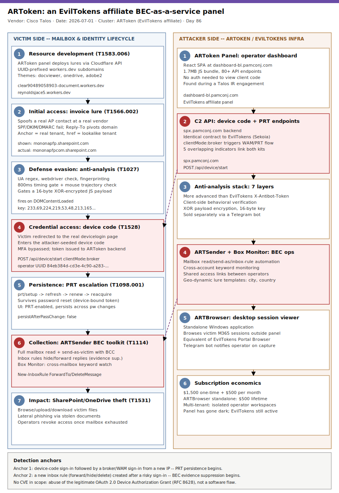

# ARToken: an EvilTokens affiliate panel turns device-code phishing into a full BEC-as-a-service operations platform

## TL;DR

Cisco Talos (2026-07-01, corroborated by CyberScoop the same day, BleepingComputer 2026-07-03, and a fresh healthcare-sector angle from Paubox on 2026-07-17) exposed **ARToken**, a React-based phishing-as-a-service operator panel discovered during an incident-response engagement that shares its API contract, infrastructure model, and Primary Refresh Token (PRT) persistence chain with **EvilTokens**, the device-code phishing PhaaS Sekoia and Microsoft tracked earlier in 2026. What makes ARToken notable is not the device-code theft itself but what happens after: the panel ships a built-in business email compromise toolkit (ARTSender) that reads a victim's Outlook mailbox, sends as the victim, and — critically — programmatically creates inbox rules to hide or forward replies, turning a single token-theft event into a sustained fraud operation that can run for weeks undetected. Talos recovered a live lure that spoofed an accounts-payable contact at a real Wisconsin contractor to target a U.S. life-sciences company's AP department, abusing an actual vendor relationship rather than inventing one. Talos researcher Michael Kelley told CyberScoop the platform is "more mature than a simple device code phishing kit — it is a complete BEC operations environment," and confirmed public-sector victims without ruling out other verticals. This lands squarely in slot #27 (BEC/email fraud), the most overdue Wednesday-compatible slot in this repo at 35 days since its last primary.

## Attribution and confidence

**Cluster: ARToken** — the operator-panel name Talos assigned based on the "ARToken Panel" browser title string; not a self-declared threat-actor name. ARToken operates as a documented **affiliate/derivative of EvilTokens** (first documented by Sekoia in a two-part series, March 2026; scale confirmed by Microsoft in April 2026), not an independent platform.

- **High confidence** on the ARToken-EvilTokens link: Talos documents five independent overlapping technical indicators — an identical `POST /api/device/start` API contract (same `userId`, `clientMode: "broker"`, `login_hint`, `redirect_url` fields), the same non-standard `clientMode: "broker"` parameter that triggers Microsoft's Authentication Broker (WAM) flow for PRT acquisition, an identical PRT lifecycle (`/prt/setup` → `/prt/refresh` → `/prt/renew` → `/prt/reacquire` → `/prt/cookie`), a matching Cloudflare Workers deployment pattern (UUID-prefixed subdomains, overlapping lure themes: Adobe, OneDrive, document viewers), and a shared multi-tenant operational model (isolated operator workspaces, Telegram bot notifications on token capture, subscription billing).
- **High confidence** on the technical mechanics of the panel itself: Talos reverse-engineered a 1.7MB compiled React JavaScript bundle served without authentication by the panel's single-page-application architecture, exposing 80+ API endpoints, a documented 7-layer anti-analysis system, and a recovered phishing lure with full header/authentication-failure detail (SPF/DKIM/DMARC all fail).
- **Low confidence** on actor identity: no group name, nationality, or individual is attributed. Talos states it does not yet have a full picture of ARToken's deployment breadth or which criminal groups use it; the "public sector targeted" observation is explicitly qualified as "unlikely to be the only one."

**Overlap / genealogy with previous repo cases:**

| Case | Date | Repo day | Relationship to ARToken |
|---|---|---|---|
| [Kali365 OAuth device-code PhaaS](../../06/2026-06-10_Kali365-K365-OAuth-DeviceCode-PhaaS/README.md) | 2026-06-10 | Day 44 | Same underlying abuse of Microsoft's OAuth 2.0 Device Authorization Grant (RFC 8628) to bypass MFA, framed there under slot #5 (Cloud/Identity) as an initial-access/account-takeover story. ARToken is a **different, competing PhaaS family** (EvilTokens-affiliate, not Kali365) and today's case is framed under slot #27 (BEC/email fraud) specifically because Talos's discovery documents the full post-compromise BEC toolkit — inbox rule manipulation, mailbox send-as, cross-account keyword monitoring — that Kali365's reporting did not cover in comparable depth. No infrastructure or code overlap between the two kits; both are independent commercial entrants in the same device-code-phishing-as-a-service market. |
| [Fake event-invitation phish kit](../../06/2026-06-17_FakeInvitation-PhishKit-OTP-RMM/README.md) | 2026-06-17 | Day 51 | This repo's first #27 (BEC/email fraud) primary. Different vector entirely — OTP/credential harvesting followed by RMM tool delivery, no OAuth device-code component and no persistent inbox-rule-based BEC toolkit. Confirms slot #27 has now seen two structurally distinct BEC delivery mechanisms in six weeks. |

No prior primary or secondary in this repo mentions "ARToken," "EvilTokens," `pamconj[.]com`, or the operator UUID `84eb384d-cd3e-4c90-a283-c960ce557913` (`grep -rliE "artoken|eviltokens" days/ byActor/` returned zero hits before today).

## Kill chain — summary table

| Stage | MITRE | Detail |
|---|---|---|
| Resource development | T1583.006 | Cloudflare Workers phishing infrastructure deployed via the panel's built-in Cloudflare API integration; UUID-prefixed subdomains under `clear90489058903-document.workers[.]dev` and `reynoldsjace5.workers[.]dev`, themed as document viewers, OneDrive, and Adobe |
| Initial access | T1566.002 | Vendor-impersonation invoice-inquiry email spoofing a real accounts-payable contact at an actual vendor; Reply-To pivots replies away from the spoofed domain; SPF/DKIM(body-hash mismatch)/DMARC(compauth=none) all fail; anchor text shows the vendor's genuine SharePoint tenant while the href points to a look-alike tenant under attacker control |
| Defense evasion | T1027, T1497.001 | 7-layer client-side anti-analysis (User-Agent regex, `navigator.webdriver` check, browser feature fingerprinting, window-dimension analysis, interaction telemetry requiring 3+ mouse moves, 800ms timing gate, mouse-trajectory validation) gates a 16-byte XOR-encrypted JavaScript payload, decrypted only at runtime |
| Credential access | T1528 | Device code phishing: victim redirected to the genuine `microsoft.com/devicelogin`, enters an attacker-seeded user code; Microsoft issues OAuth tokens directly to the ARToken backend via `POST /api/device/start` with `clientMode: "broker"` |
| Persistence | T1098.001, T1550.001 | Captured tokens escalated to a Primary Refresh Token via the `/prt/setup` → `/prt/refresh` → `/prt/renew` → `/prt/reacquire` → `/prt/cookie` chain, explicitly advertised in the panel UI as "PRT-enabled — Persists across password changes"; `persistAfterPassChange: false` in the kit config signals operators must exfiltrate or escalate before the victim resets credentials |
| Collection | T1114.002, T1114.003 | ARTSender module: full Outlook mailbox read access, send-as-victim with BCC batching and configurable inter-send delay, programmatic inbox-rule creation for forwarding/auto-deletion (evidence suppression), cross-mailbox keyword monitoring (Box Monitor) across every compromised account simultaneously |
| Impact | T1531 | Operators manage token lifecycle and revoke their own access deliberately once a mailbox is exhausted or the fraud cycle completes, alongside SharePoint/OneDrive file access, upload, download and permission management for document theft or malicious-file placement enabling further lateral phishing |



The left lane follows the victim-side chronology from the vendor-impersonation lure through device-code token theft, PRT persistence, and sustained BEC mailbox abuse; the right lane tracks the ARToken/EvilTokens infrastructure and tooling — the operator panel itself, the C2 API, Cloudflare Workers lure hosting, the anti-analysis stack, the ARTSender/Box Monitor BEC toolkit, and the ARTBrowser desktop session viewer. The cross-lane arrows mark the two highest-value detection anchors: the device-code-to-broker-signin handoff (PRT escalation signature) and the new-inbox-rule-after-risky-signin pattern that is the single strongest indicator a mailbox has been weaponized for ongoing fraud.

## Stage-by-stage detail

### 1. Resource development — Cloudflare Workers infrastructure (T1583.006)

ARToken's panel integrates directly with Cloudflare's API (authenticating via API token or Global API key) to list deployed Workers, deploy phishing templates from the panel UI, manage allowed origins, and configure device-code proxy servers. Talos observed lure infrastructure deployed to UUID-prefixed subdomains under two Workers accounts:

```
clear90489058903-document.workers[.]dev
  917bedb0-554e-a8b9-79f1-docviewer.clear90489058903-document.workers[.]dev
  321a1392-939d-3bf5-4040-docviewer.clear90489058903-document.workers[.]dev
  98c4c82e-2d81-0837-e3d6-docviewer.clear90489058903-document.workers[.]dev
  112838d8-9a75-2e90-d63b-docviewer.clear90489058903-document.workers[.]dev
  aquaclaude-09494-9099403-docviewer.clear90489058903-document.workers[.]dev
  e5469cec-124a-c84f-abaa-docviewer.clear90489058903-document.workers[.]dev
  50a201fd-dd2d-cf72-5fa6-onedrive.clear90489058903-document.workers[.]dev
reynoldsjace5.workers[.]dev
  50a201fd-dd2d-cf72-5fa6-adobe2.reynoldsjace5.workers[.]dev
```

The naming convention (`{uuid}-docviewer`, `{uuid}-onedrive`, `{uuid}-adobe2`) and lure theming overlap directly with EvilTokens' own documented pattern (`[service]-[random].[target]-s-account.workers.dev`), one of the five technical links Talos used to tie ARToken to the EvilTokens ecosystem.

### 2. Initial access — vendor-impersonation invoice lure (T1566.002)

Talos recovered two near-identical messages sent roughly four minutes apart on 2026-04-20 that initiate the chain. The tradecraft is targeted, not spray-and-pray: the messages spoof an accounts-payable contact at a legitimate Wisconsin contractor, addressed to an accounts-payable recipient at a U.S. life-sciences company — abusing a real, pre-existing vendor relationship rather than inventing a sender identity. The lure theme is an outstanding-invoice inquiry ("the following invoices appear to still be outstanding… advise when this will be processed"), exactly the kind of message AP staff are conditioned to act on quickly.

Notable header/content mechanics:

- **From** shows the vendor's real domain; **Reply-To** quietly redirects to an unrelated domain — a reply-pivot that keeps any victim response away from the spoofed organization.
- **SPF, DKIM (body-hash mismatch), and DMARC (`compauth=none reason=405`)** all fail — the display identity is not authenticated from the sending path.
- Each message carries short random hex strings plus an inline signature image (`pumber.png`), consistent with light per-message mutation intended to defeat exact-match content filters.
- The visible anchor text reads as the vendor's genuine SharePoint tenant (`https[:]//mononapfp.sharepoint[.]com/:f:/document/INV-...`), but the actual `href` points to a near-identical look-alike tenant — the vendor's name with `.com` folded directly into the tenant label — under a separate, attacker-controlled Microsoft 365 workspace (`https[:]//mononapfpcom.sharepoint[.]com/:f:/g/...`). Because the destination is still a genuine `sharepoint.com` host, it inherits SharePoint's clean domain reputation and survives naive URL-reputation filtering.

### 3. Defense evasion — 7-layer anti-analysis and XOR-encrypted payload (T1027, T1497.001)

| Layer | Mechanism | Purpose |
|---|---|---|
| 1 | User-Agent regex | Blocks headless browsers, Selenium, Puppeteer, Playwright, crawlers, wget, curl |
| 2 | `navigator.webdriver` check | Detects automation frameworks |
| 3 | Browser feature fingerprinting | Flags environments missing `window.chrome`, `navigator.vendor`, or touch/mouse APIs |
| 4 | Window dimension analysis | Catches headless defaults reporting 0x0 outer dimensions |
| 5 | Interaction telemetry | Requires 3+ mouse moves or 1+ touch events before enabling the payload |
| 6 | Timing gate | Minimum 800ms elapsed since page load |
| 7 | Movement pattern analysis | Validates mouse-coordinate trajectories for organic (non-linear) motion |

This client-side behavioral gate is notably more sophisticated than the server-side `X-Antibot-Token` mechanism (SHA-256 of secret + timestamp + "antibot", 5-minute validity window) documented in Sekoia's original EvilTokens research — consistent with EvilTokens' known practice of selling anti-bot pages as a separate add-on product through a dedicated Telegram bot, which affiliates like ARToken can swap for a custom module.

Once the gate passes, the payload — delivered XOR-encrypted with a 16-byte key (`[233,69,224,219,53,48,213,165,119,243,77,151,101,148,15,227]`) — decrypts at runtime and fires on `DOMContentLoaded`: it attempts to steal any existing JWT from `localStorage` (key: `artoken_jwt`) for victim session correlation, extracts the victim's email from the URL `?hint=` parameter, and calls the C2 at `/device/start` using a hardcoded operator UUID (`84eb384d-cd3e-4c90-a283-c960ce557913`).

### 4. Credential access — device code phishing (T1528)

The victim is shown a device code with a 900-second countdown and directed to the genuine `microsoft.com/devicelogin`. Because the victim authenticates through Microsoft's own legitimate infrastructure and enters a code Microsoft itself issued, the flow bypasses multi-factor authentication entirely — Microsoft's backend has no way to distinguish "user authorizing their own smart-TV app" from "user authorizing an attacker's device-code request." Microsoft then issues the OAuth access/refresh tokens directly to the ARToken-controlled application rather than to the victim.

```
POST /api/device/start
{"userId": "<victim-derived>", "clientMode": "broker", "login_hint": "<victim-email>", "redirect_url": "<lure-return-url>"}

Response: {"device_code": "...", "user_code": "...", "verification_uri": "https://microsoft.com/devicelogin", "expires_in": 900}
```

The `clientMode: "broker"` field is not a standard OAuth parameter — it is EvilTokens' own signal instructing the backend to use Microsoft's Authentication Broker (WAM) flow specifically for Primary Refresh Token acquisition, one of the strongest of Talos's five ARToken-EvilTokens linkage indicators.

### 5. Persistence — Primary Refresh Token escalation (T1098.001, T1550.001)

Once a token is captured, operators can refresh it, escalate it into a Primary Refresh Token, export/backup tokens in bulk, import tokens harvested by other tools, and share access with other operators via generated links with granular permissions. The PRT chain is:

```
/prt/setup  ->  /prt/refresh  ->  /prt/renew  ->  /prt/reacquire  ->  /prt/cookie
```

The panel UI advertises this directly: **"PRT-enabled — Persists across password changes."** The kit's `persistAfterPassChange: false` configuration flag is an explicit operator-facing signal that refresh tokens are revoked on password reset and the operator must exfiltrate data or escalate to PRT before the victim (or their SOC) responds — this is the single most consequential remediation fact in this case: **a password reset alone does not evict the attacker** once PRT escalation has occurred.

### 6. Collection — ARTSender business email compromise toolkit (T1114.002, T1114.003)

This is the capability that elevates ARToken from a credential-theft kit to, in Talos's words, "a complete BEC operations environment":

- Full Outlook mailbox read access per compromised account.
- Send email **as** the victim, with BCC batch support and configurable inter-send delay (mass-fraud automation while mimicking a human sending cadence).
- **Programmatic inbox-rule creation** for forwarding and auto-deletion — the mechanism that hides any reply related to a fraudulent payment request from the real account holder, the feature that turns a one-time credential-theft event into a sustained, undetected fraud campaign that can run for weeks.
- **Box Monitor**: keyword-based monitoring across every compromised mailbox simultaneously, letting one operator watch dozens of hijacked accounts for terms like "invoice," "wire," or "payment" without manually reading each inbox.
- Email attachment access and bulk download.
- **Shared access links**: operators can share token/mailbox access with other affiliates via role-based permission links — a collaboration feature with no legitimate analog in a simple phishing kit.
- **Geo-dynamic lure templates**: placeholders (`{city}`, `{country_code}`, `{state}`) that resolve based on the victim's geolocation for follow-on lure personalization.

### 7. Impact and cleanup — SharePoint/OneDrive access and account-access management (T1531)

Operators can browse, upload, download, and manage permissions on victim SharePoint sites and OneDrive files directly from the panel, enabling document theft and the placement of malicious files for lateral phishing against the victim's own contacts. A standalone Windows desktop application, ARTBrowser — functionally equivalent to EvilTokens' "Portal Browser" — lets operators browse a victim's live Microsoft 365 session outside the web panel entirely. The platform notifies operators via Telegram bot the moment a token is captured. Pricing: $1,500 one-time plus $500/month subscription, with a standalone ARTBrowser at $500 lifetime — commercial SaaS economics applied to sustained BEC fraud. As of the most recent public reporting the ARToken panel observed by Talos has gone dark, though the underlying EvilTokens platform and its wider affiliate ecosystem remain active.

## Detection strategy

### Telemetry that matters

- **Microsoft Entra sign-in logs**: `AuthenticationProtocol: deviceCode` completions by standard user accounts (not smart-TV, CLI, or kiosk service principals), especially when followed within a short window by a sign-in from `Microsoft Authentication Broker` or a WAM-related client from a different IP/ASN — the PRT-escalation handoff.
- **Exchange Online / Microsoft 365 audit log (Unified Audit Log)**: `New-InboxRule` / `Set-InboxRule` operations creating rules with `ForwardTo`, `RedirectTo`, `DeleteMessage`, or `MoveToFolder` (especially to RSS Feeds/Conversation History, both common hiding spots) actions — the single highest-fidelity indicator a mailbox has been weaponized for BEC, not just accessed once.
- **CloudAppEvents / DeviceNetworkEvents**: egress to `pamconj[.]com` and its subdomains, and to UUID-prefixed `workers[.]dev` hosts matching the `{uuid}-docviewer`/`{uuid}-onedrive`/`{uuid}-adobe2` naming pattern.
- **Exchange message trace / SendAs auditing**: a single mailbox sending an unusually high volume of outbound mail with BCC recipients and near-uniform inter-send delay — the ARTSender batch-send signature.
- **SharePoint/OneDrive audit logs**: file access, download, or permission-change bursts on a mailbox account that has no prior history of bulk SharePoint activity, immediately following a device-code sign-in event.

### Detection coverage

| Engine | File | Logic |
|---|---|---|
| Sigma | `sigma/artoken_entra_device_code_signin_anchor.yml` | Interactive Entra ID sign-in completed via the OAuth 2.0 device authorization grant by a standard user, excluding known input-constrained-device apps |
| Sigma | `sigma/artoken_prt_broker_signin_after_devicecode.yml` | Microsoft Authentication Broker / WAM sign-in from a new device or IP shortly after a device-code completion for the same user — the PRT-escalation anchor |
| Sigma | `sigma/artoken_new_inbox_rule_hide_or_forward.yml` | `New-InboxRule`/`Set-InboxRule` audit events creating forwarding, redirect, or auto-delete/move actions |
| Sigma | `sigma/artoken_mass_sendas_bcc_batch.yml` | Single mailbox sending a high volume of outbound messages with BCC recipients and near-uniform timing — ARTSender batch-send signature |
| KQL | `kql/artoken_devicecode_then_broker_prt_escalation.kql` | `SigninLogs` — join device-code completions to subsequent broker/WAM sign-ins from a different IP/ASN within a tight window |
| KQL | `kql/artoken_new_inbox_rule_forward_or_hide.kql` | `OfficeActivity`/`CloudAppEvents` — new inbox rules with forwarding, redirect, or hide/delete actions |
| KQL | `kql/artoken_workers_dev_uuid_lure_egress.kql` | `DeviceNetworkEvents`/`CloudAppEvents` — egress to `pamconj.com` and UUID-prefixed `workers.dev` lure subdomains |
| YARA | `yara/artoken_phishing_kit_javascript.yar` | Static string match on the ARToken/EvilTokens JavaScript bundle: hardcoded operator UUID, `artoken_jwt` localStorage key, `clientMode":"broker"` parameter, PRT endpoint paths |
| YARA | `yara/artoken_lookalike_sharepoint_lure_html.yar` | Static match on a saved lure HTML page: genuine `sharepoint.com` host plus the outstanding-invoice lure theme or the UUID-prefixed docviewer/onedrive/adobe2 subdomain pattern |
| Suricata | `suricata/artoken_c2_and_lure_infra.rules` | TLS SNI / HTTP Host indicators for `pamconj[.]com` subdomains and the two documented Workers accounts, plus a `POST /api/device/start` broker-mode body-content heuristic |

**No SPL** — retired repo-wide since 2026-05-11.

### Threat hunting hypotheses

- **H1** (PEAK): *If* a standard user completes an OAuth device-code sign-in, *then* a Microsoft Authentication Broker/WAM sign-in for the same user from a new device or IP will follow within minutes to hours as the operator escalates to a Primary Refresh Token — the persistence anchor that survives a password reset. See `hunts/peak_h1_devicecode_to_broker_prt_escalation.md`.
- **H2** (PEAK): *If* a mailbox has been compromised for sustained BEC fraud rather than one-time credential theft, *then* a new inbox rule with a forwarding, redirect, or hide/delete action will be created shortly after the compromising sign-in — the single strongest available signal of ongoing fraud versus a one-off token theft. See `hunts/peak_h2_new_inbox_rule_after_risky_signin.md`.
- **H3** (PEAK): *If* ARTSender is being used to run outbound BEC fraud from a compromised mailbox, *then* that mailbox will show an outbound send volume spike with BCC batching and near-uniform inter-send delay, distinguishable from normal human sending patterns and from bulk marketing tools by its BCC-heavy structure and single-recipient-domain targeting. See `hunts/peak_h3_mass_sendas_bcc_batch_fanout.md`.

## Incident response playbook

### First 60 minutes (triage)

1. Confirm the scope of any device-code sign-in flagged as anomalous: pull the full `SigninLogs` entry (user, app, IP, ASN, device ID, `AuthenticationProtocol`) and check for a subsequent broker/WAM sign-in for the same user within the following hours.
2. Immediately audit the affected mailbox's inbox rules (`Get-InboxRule -Mailbox <user>`) for any rule with a forwarding, redirect, or delete/move action the user did not create — this is the fastest way to confirm active BEC abuse versus a contained credential-theft event.
3. Pull the last 7 days of `SendAs`/message-trace activity for the mailbox looking for outbound volume spikes, BCC-heavy sends, or recipients outside the organization's normal correspondence pattern.
4. Check SharePoint/OneDrive audit logs for the account for any bulk file access, download, or permission-change activity correlated with the sign-in window.
5. Treat any outstanding-invoice or payment-related thread touched by the account during the suspected compromise window as fraudulent until independently verified via a phone call to a previously known contact — not by replying to the email.
6. Do not assume a password reset alone remediates the account: check specifically for PRT issuance (broker sign-in) before declaring the session terminated.

### Artifacts to collect

| Artifact | Path | Tool | Why |
|---|---|---|---|
| Sign-in log entries | Entra ID `SigninLogs` for the affected UPN, 30-day window | Entra admin center / Sentinel KQL | Reconstruct device-code completion, subsequent broker sign-ins, source IPs/ASNs |
| Inbox rules | `Get-InboxRule -Mailbox <user> -IncludeHidden` | Exchange Online PowerShell | Identify forwarding/hide/delete rules created by the attacker for evidence suppression |
| Message trace / SendAs log | Exchange admin center message trace, 7-30 day window | EAC / `Get-MessageTrace` | Quantify fraudulent outbound volume and recipient list for victim notification |
| OAuth app consent grants | Enterprise applications, user + admin consent | Entra admin center | Confirm whether any malicious OAuth app (beyond the device-code broker flow itself) was consented to |
| SharePoint/OneDrive audit | Microsoft Purview audit log, `FileAccessed`/`FileDownloaded`/`PermissionsChanged` | Purview compliance portal | Scope document theft and any malicious file placed for lateral phishing |
| Unified Audit Log export | Full UAL for the account, compromise window +/- 48h | Microsoft Purview / `Search-UnifiedAuditLog` | Comprehensive timeline for legal/insurance/regulatory follow-up |

### IR queries and commands

```powershell
# Enumerate inbox rules with forwarding, redirect, or hide/delete actions for a specific mailbox
Get-InboxRule -Mailbox user@victimorg.com -IncludeHidden | Where-Object {
  $_.ForwardTo -or $_.RedirectTo -or $_.DeleteMessage -eq $true -or $_.MoveToFolder -match 'RSS Feeds|Conversation History'
} | Select-Object Name, ForwardTo, RedirectTo, DeleteMessage, MoveToFolder, Enabled
```

```powershell
# Force-revoke all sessions and refresh tokens for a suspected compromised account (does NOT evict an already-issued PRT by itself -- pair with device/session revocation below)
Revoke-AzureADUserAllRefreshToken -ObjectId <user-object-id>
Get-MgUserRegisteredDevice -UserId <user-object-id> | ForEach-Object { Revoke-MgDeviceSignSession -DeviceId $_.Id }
```

```kql
// Confirm whether a device-code sign-in was followed by a broker/WAM sign-in from a different IP -- the PRT-escalation anchor
SigninLogs
| where AuthenticationProtocol == "deviceCode" and ResultType == 0
| project user = UserPrincipalName, dcTime = TimeGenerated, dcIP = IPAddress
| join kind=inner (
    SigninLogs
    | where AppDisplayName == "Microsoft Authentication Broker"
    | project user = UserPrincipalName, brokerTime = TimeGenerated, brokerIP = IPAddress
) on user
| where brokerTime between (dcTime .. dcTime + 6h) and brokerIP != dcIP
```

### Containment, eradication, recovery

Exit criteria: confirmed removal of every attacker-created inbox rule, confirmed revocation of both refresh tokens **and** any issued Primary Refresh Token/registered device, confirmed rotation of the account password, and a completed message-trace review identifying every fraudulent outbound message sent during the compromise window with victim/vendor notification issued for each. **Do not** consider a password reset sufficient remediation on its own — ARToken's `persistAfterPassChange: false` design assumes operators escalate to PRT specifically because refresh tokens alone do not survive a reset; PRT survives unless the underlying device registration is separately revoked. **Do not** rely on OAuth app consent review alone — the device-code flow does not necessarily register a new visible enterprise application, since tokens are issued to the broker/native client, not a custom-branded OAuth app.

### Recovery validation

After remediation, re-verify inbox rules are clean and re-run message trace for 72 hours post-remediation to confirm no further outbound BEC activity. Notify every vendor/AP contact touched during the compromise window out-of-band (phone, not email) that any payment-detail change requests from the period should be independently re-verified before honoring. Re-run the H2 hunt (new inbox rule after risky sign-in) against the account for at least 30 days post-incident, since ARToken's shared-access-link feature means a second, previously-unknown operator could still hold delegated access if the first remediation pass missed a rule or a stale device registration.

## IOCs

| Type | Value | Context | Confidence | Source |
|---|---|---|---|---|
| domain | pamconj[.]com | ARToken root C2/panel domain | high | Cisco Talos |
| domain | dashboard-bl.pamconj[.]com | ARToken Panel React SPA login host | high | Cisco Talos |
| domain | spx.pamconj[.]com | ARToken C2 API host (device/start, prt/* endpoints) | high | Cisco Talos |
| domain | clear90489058903-document.workers[.]dev | Cloudflare Workers account hosting UUID-prefixed lure subdomains | high | Cisco Talos |
| domain | 917bedb0-554e-a8b9-79f1-docviewer.clear90489058903-document.workers[.]dev | Document-viewer-themed lure page | high | Cisco Talos |
| domain | 50a201fd-dd2d-cf72-5fa6-onedrive.clear90489058903-document.workers[.]dev | OneDrive-themed lure page | high | Cisco Talos |
| domain | reynoldsjace5.workers[.]dev | Second Cloudflare Workers account hosting lure subdomains | high | Cisco Talos |
| domain | 50a201fd-dd2d-cf72-5fa6-adobe2.reynoldsjace5.workers[.]dev | Adobe-themed lure page | high | Cisco Talos |
| ipv4 | 172.67.214.35 | Cloudflare-fronted IP observed in campaign network traffic (shared CDN IP -- corroborate with SNI/Host, not on its own) | medium | Cisco Talos |
| url | hxxps[:]//mononapfpcom.sharepoint[.]com/:f:/g/IgAdH_aaBPMcQbtINZzC1TsLARj3dHj63MnKjvnY-QJrKEc | Actual (malicious) look-alike SharePoint tenant destination behind the lure hyperlink | high | Cisco Talos |
| string | artoken_jwt | localStorage key the payload probes for existing victim session JWTs | high | Cisco Talos |
| string | 84eb384d-cd3e-4c90-a283-c960ce557913 | Hardcoded ARToken operator UUID embedded in the phishing payload | high | Cisco Talos |
| string | clientMode":"broker" | Non-standard OAuth device-code request parameter unique to the EvilTokens/ARToken API contract | high | Cisco Talos |
| note | XOR payload key: [233,69,224,219,53,48,213,165,119,243,77,151,101,148,15,227] (16 bytes) | Runtime-decryption key for the delivered phishing JavaScript payload | high | Cisco Talos |
| note | Pricing: $1,500 one-time + $500/month subscription; standalone ARTBrowser desktop app $500 lifetime | Commercial PhaaS economics; useful for takedown/financial-disruption context | high | Cisco Talos |
| note | ARToken panel (dashboard-bl.pamconj[.]com) had gone dark as of the most recent public reporting; EvilTokens' wider affiliate ecosystem remains active | Indicator freshness/decay warning -- do not treat panel domains as necessarily live without re-validation | high | Cisco Talos |
| cve | none | ARToken/EvilTokens abuse the legitimate OAuth 2.0 Device Authorization Grant (RFC 8628); no software vulnerability is in scope for this case | high | analysis |

Full list (18 rows) in [iocs.csv](./iocs.csv). No CVE is in scope for this case — verified with `grep -oE 'CVE-[0-9]{4}-[0-9]{4,7}' README.md` returning zero matches — so no `kev.md` cross-reference applies here.

## Secondary findings

- **"Payroll Pirates" (Storm-2755/Storm-2657, SRA/BushidoToken, disclosed 2026-06-15)**: a parallel campaign chasing the identical payroll-diversion objective through a completely different technical route — AiTM session-token theft followed by bulk Microsoft Graph API reconnaissance (`/v1.0/users?$top=999` paginated with `$skiptoken`, filtered for `payroll`/`hr`/`finance` keywords in job title and display name) rather than device-code phishing, observed across healthcare, food services, and manufacturing. Confirms that identity-based payroll/HR targeting is converging from multiple independent technique families (device-code + PRT here, AiTM + Graph enumeration there) onto the same fraud objective, which argues for detection built around the fraud pattern (new payment-detail change, new inbox rule) rather than any single initial-access technique.
- **Interpol Operation First Light 2026 (results announced 2026-07-10)**: 5,811 arrests and $293 million seized across 97 countries in a January-April 2026 operation targeting social-engineering fraud including BEC; the operation's I-GRIP (Global Rapid Intervention of Payments) mechanism blocked a live $6.6 million BEC transfer between Singapore and Oman after criminals impersonated a supplier to a commodities trading company — a useful counter-example showing that a fast cross-border payment freeze remains one of the few reliable recovery paths once a fraudulent wire is already in flight, which is precisely the scenario ARToken's inbox-rule evidence suppression is designed to delay discovery of.
- **Abnormal AI's 2026 Attack Landscape Report** (published 2026-04-22, analyzing traffic from July-December 2025): vendor email compromise now accounts for 61% of all BEC attacks industry-wide, corroborating that ARToken's vendor-impersonation invoice lure is not a novel tactic on its own — what is novel is the degree of platform maturity (inbox-rule automation, cross-account keyword monitoring, shared operator access) now packaged as a subscription product around that tactic.

## Pedagogical anchors

- **A password reset is not remediation once Primary Refresh Token escalation has occurred.** Refresh tokens die on password reset; PRTs, by design, do not — they are tied to the registered device, not the credential. Any IR playbook for device-code/OAuth compromise that stops at "reset the password" is incomplete; device/session revocation must be an explicit, separate step.
- **Inbox rule creation is the highest-value detection signal separating "credential stolen once" from "mailbox actively weaponized."** A forwarding or hide/delete rule is not something a legitimate device-code sign-in from a smart TV or CLI tool ever needs to create — building alerting on `New-InboxRule`/`Set-InboxRule` actions in the hours after any risky sign-in catches the pivot point from theft to fraud, regardless of which PhaaS kit was used to steal the token.
- **PhaaS platforms now commoditize the entire fraud lifecycle, not just initial access.** ARTSender's BCC-batch sending, cross-account keyword monitoring, shared operator access, and Telegram capture notifications mean a single $1,500 purchase gives a low-skill affiliate a complete BEC operations console — defenders should assume any successful device-code phish is now a BEC-capable compromise by default, not just a credential-theft event to triage separately.
- **Domain reputation inherited from a legitimate platform (sharepoint.com, workers.dev) defeats naive URL filtering.** Both ARToken's look-alike SharePoint tenant and its Cloudflare Workers lure pages resolve under genuinely trusted second-level domains; detection has to inspect the full path/subdomain structure and behavioral signals, not just the domain's baseline reputation.

## What's in this folder

| File | Purpose | Link |
|---|---|---|
| README.md | This document | [README.md](./README.md) |
| kill_chain.svg | Two-lane kill chain diagram (Template A) | [kill_chain.svg](./kill_chain.svg) |
| sigma/artoken_entra_device_code_signin_anchor.yml | Sigma: device-code sign-in by a standard user | [sigma/artoken_entra_device_code_signin_anchor.yml](./sigma/artoken_entra_device_code_signin_anchor.yml) |
| sigma/artoken_prt_broker_signin_after_devicecode.yml | Sigma: broker/WAM sign-in shortly after a device-code completion | [sigma/artoken_prt_broker_signin_after_devicecode.yml](./sigma/artoken_prt_broker_signin_after_devicecode.yml) |
| sigma/artoken_new_inbox_rule_hide_or_forward.yml | Sigma: new inbox rule with forward/redirect/hide action | [sigma/artoken_new_inbox_rule_hide_or_forward.yml](./sigma/artoken_new_inbox_rule_hide_or_forward.yml) |
| sigma/artoken_mass_sendas_bcc_batch.yml | Sigma: mass send-as with BCC batching from one mailbox | [sigma/artoken_mass_sendas_bcc_batch.yml](./sigma/artoken_mass_sendas_bcc_batch.yml) |
| kql/artoken_devicecode_then_broker_prt_escalation.kql | KQL: device-code sign-in joined to a later broker sign-in from a new IP | [kql/artoken_devicecode_then_broker_prt_escalation.kql](./kql/artoken_devicecode_then_broker_prt_escalation.kql) |
| kql/artoken_new_inbox_rule_forward_or_hide.kql | KQL: new inbox rule with forwarding/hide actions | [kql/artoken_new_inbox_rule_forward_or_hide.kql](./kql/artoken_new_inbox_rule_forward_or_hide.kql) |
| kql/artoken_workers_dev_uuid_lure_egress.kql | KQL: egress to pamconj.com / UUID-prefixed workers.dev lure hosts | [kql/artoken_workers_dev_uuid_lure_egress.kql](./kql/artoken_workers_dev_uuid_lure_egress.kql) |
| yara/artoken_phishing_kit_javascript.yar | YARA: ARToken/EvilTokens JS bundle string signatures | [yara/artoken_phishing_kit_javascript.yar](./yara/artoken_phishing_kit_javascript.yar) |
| yara/artoken_lookalike_sharepoint_lure_html.yar | YARA: saved lure HTML page string/pattern signatures | [yara/artoken_lookalike_sharepoint_lure_html.yar](./yara/artoken_lookalike_sharepoint_lure_html.yar) |
| suricata/artoken_c2_and_lure_infra.rules | Suricata: C2/lure domain indicators + device/start broker-mode heuristic | [suricata/artoken_c2_and_lure_infra.rules](./suricata/artoken_c2_and_lure_infra.rules) |
| hunts/peak_h1_devicecode_to_broker_prt_escalation.md | PEAK hunt H1: device-code-to-broker PRT escalation | [hunts/peak_h1_devicecode_to_broker_prt_escalation.md](./hunts/peak_h1_devicecode_to_broker_prt_escalation.md) |
| hunts/peak_h2_new_inbox_rule_after_risky_signin.md | PEAK hunt H2: new inbox rule after risky sign-in | [hunts/peak_h2_new_inbox_rule_after_risky_signin.md](./hunts/peak_h2_new_inbox_rule_after_risky_signin.md) |
| hunts/peak_h3_mass_sendas_bcc_batch_fanout.md | PEAK hunt H3: mass send-as BCC-batch fan-out | [hunts/peak_h3_mass_sendas_bcc_batch_fanout.md](./hunts/peak_h3_mass_sendas_bcc_batch_fanout.md) |
| iocs.csv | Full machine-readable IOC list | [iocs.csv](./iocs.csv) |

## Sources

- [ARToken: Inside an EvilTokens affiliate panel targeting Microsoft 365 (Cisco Talos, Michael Kelley, 2026-07-01)](https://blog.talosintelligence.com/artoken-inside-an-eviltokens-affiliate-panel-targeting-microsoft-365/)
- [This phishing kit looks more like BEC-as-a-service (CyberScoop, Tim Starks, 2026-07-01)](https://cyberscoop.com/artoken-bec-platform-cisco-talos/)
- [ARToken PhaaS exposes EvilTokens' Microsoft 365 phishing toolkit (BleepingComputer, Lawrence Abrams, 2026-07-03)](https://www.bleepingcomputer.com/news/security/artoken-phaas-exposes-eviltokens-microsoft-365-phishing-toolkit/)
- [BEC phishing kit adds inbox rule manipulation to Microsoft 365 attacks (Paubox, Farah Amod, 2026-07-17)](https://www.paubox.com/blog/bec-phishing-kit-adds-inbox-rule-manipulation-to-microsoft-365-attacks)
- [Cisco-Talos/IOCs: artoken-inside-an-eviltokens-affiliate-panel-targeting-microsoft-365.json](https://github.com/Cisco-Talos/IOCs/blob/main/2026/07/artoken-inside-an-eviltokens-affiliate-panel-targeting-microsoft-365.json)
- [Hackers Use Microsoft Graph Reconnaissance to Target Payroll and HR Employees (Cyber Security News, Tushar Subhra Dutta, 2026-06-15)](https://cybersecuritynews.com/hackers-use-microsoft-graph-reconnaissance/)
- [Over 5,800 arrests, USD 293 million intercepted in global fraud bust (INTERPOL, 2026-07-10)](https://www.interpol.int/en/News-and-Events/News/2026/Over-5-800-arrests-USD-293-million-intercepted-in-global-fraud-bust)
- [Abnormal AI 2026 Attack Landscape Report (Abnormal AI, 2026-04-22)](https://abnormal.ai/about/news/2026-attack-landscape-report)
