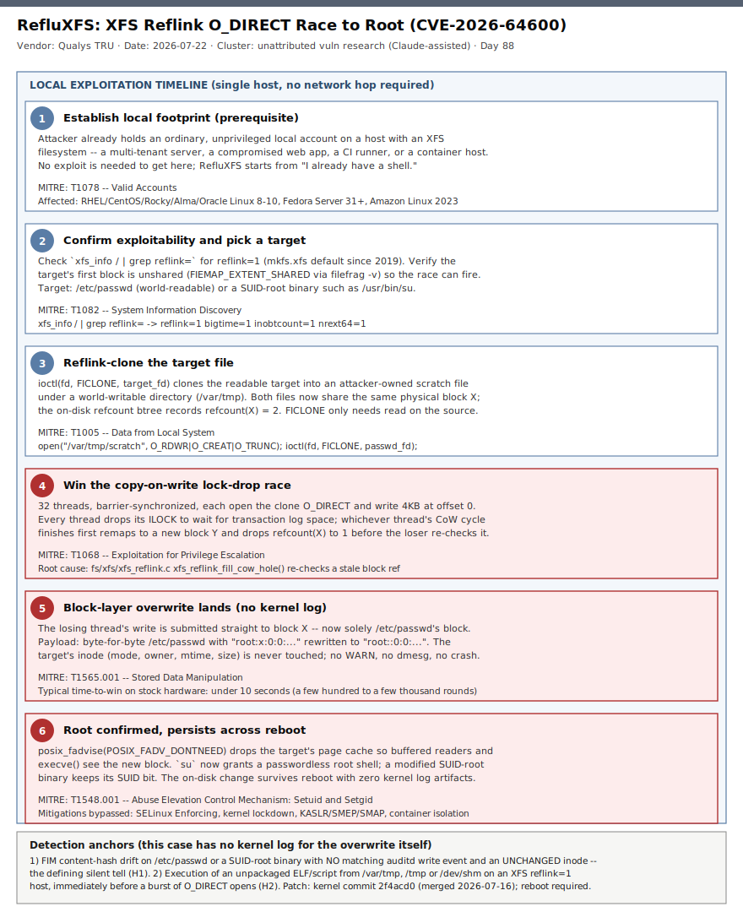

# RefluXFS: XFS Reflink O_DIRECT Race to Root (CVE-2026-64600)

## TL;DR

On 2026-07-22 the Qualys Threat Research Unit disclosed **CVE-2026-64600** ("RefluXFS"), a race condition in the Linux kernel's XFS copy-on-write allocation path that lets an unprivileged local user overwrite any file they can read -- including `/etc/passwd` or a SUID-root binary -- and gain full host root. The bug has existed since kernel 4.11 (February 2017) and affects any XFS filesystem created with reflink support, the `mkfs.xfs` default since 2019; that includes default installations of RHEL, CentOS Stream, Rocky Linux, AlmaLinux, Oracle Linux, CloudLinux, Fedora Server and Amazon Linux 2023 -- an estimated **16.4 million systems**. Exploitation is local-only, highly reliable (under 10 seconds of racing on stock hardware), survives reboot, and produces **zero kernel log output**, so detection has to shift from "watch for the exploit" to "watch for its silent consequences." The kernel fix merged 2026-07-16 and vendor-patched kernels are shipping now -- this is a patch-and-reboot-today case for every multi-tenant or shared Linux host, and today's Friday deep-dive kernel-LPE / memory-corruption slot.

## Attribution and confidence

There is **no threat-actor attribution** -- this is a coordinated vulnerability disclosure, not a tracked intrusion. The finding is credited to the **Qualys Threat Research Unit** (lead: Saeed Abbasi, Head of TRU), and it is notable for its methodology: Qualys tasked **Claude Mythos Preview** -- an Anthropic frontier-model preview used under Qualys's participation in Anthropic's Project Glasswing -- with hunting for a Dirty COW-class race condition in the kernel's `mm/` and `fs/` trees. After iterative prompt refinement narrowing scope to XFS, the model identified the flaw and produced a working proof-of-concept. Qualys researchers then independently reviewed the model's reasoning, reproduced the exploit on a default Fedora Server 44 install, verified every technical claim against kernel source, and coordinated disclosure with the XFS maintainers and the Linux kernel security team (Carlos Maiolino, Greg Kroah-Hartman, Darrick J. Wong, Linus Torvalds and others) before publishing. No public exploit code has been released.

| Dimension | Assessment | Confidence |
|---|---|---|
| Vulnerability is real and reliably reproducible | Qualys PoC demonstrated on RHEL 10.2 and Fedora Server 44 (video published) | high |
| Root cause and affected kernel range | Confirmed by kernel source analysis; introduced by commit `3c68d44a2b49` (Linux 4.11, Feb 2017) | high |
| Scope (~16.4M systems) | Qualys CSAM-based estimate; directional, not a hard census | medium |
| In-the-wild exploitation | None reported -- this is a responsible disclosure, not an active campaign | n/a |
| Public exploit availability | None as of 2026-07-24; the Qualys PoC is unpublished | n/a |

**Genealogy with previous repo cases.** This is the repo's first Linux-kernel-only case in the memory-corruption / exploit-dev slot (#28) and its first XFS/reflink case (anti-duplicate check clean: no prior `refluxfs|CVE-2026-64600|xfs.reflink` primary in `days/`). Its closest thematic sibling is **2026-05-29's MiniPlasma** (a silent-regression Windows kernel driver race, weaponized to SYSTEM via a `cldflt.sys` timing window and WER hijack, tracked under a since-patched 2020-era Microsoft advisory) -- both are "a lock-drop or regression window in a trusted kernel subsystem becomes full-privilege compromise with no crash and minimal logging" cases, one on Windows, one on Linux. It also extends the repo's 2026-07 AI-and-security thread alongside **2026-07-23's ExploitGym** (an AI evaluation agent breaking its own sandbox) -- there the AI was the attacker's tool; here it is the defenders', used to find and responsibly disclose the flaw before it could be found and used offensively.

## Kill chain — summary table

| Stage | MITRE | Detail |
|---|---|---|
| Establish local footprint | T1078 | Attacker already holds an ordinary unprivileged local account on an XFS `reflink=1` host |
| Confirm exploitability, pick target | T1082 | `xfs_info` reflink check; FIEMAP verifies the target's first block is unshared |
| Reflink-clone the target | T1005 | `FICLONE` ioctl clones a readable target (`/etc/passwd` or a SUID binary) into an attacker-owned scratch file |
| Win the CoW lock-drop race | T1068 | 32 threads race concurrent `O_DIRECT` writes against the ILOCK-drop window in `xfs_reflink_fill_cow_hole()` |
| Block-layer overwrite lands | T1565.001 | The losing thread's write lands on the original file's physical block; no inode change, no kernel log |
| Root confirmed, persists | T1548.001 | Page cache dropped via `fadvise`; passwordless root via `su`; survives reboot, SUID bit preserved |



The single lane walks the exploit linearly because RefluXFS has no separate attacker-infrastructure track -- the "attacker" and the "victim system" are the same host. The three red-bordered stages (4-6) are the actual race, the silent overwrite, and the confirmed-root outcome; the detection anchors called out in the footer -- FIM hash drift with no matching audit write, and race-helper execution from world-writable directories -- are deliberately anchored *before and around* the silent middle stage, since the overwrite itself leaves nothing to detect directly.

## Stage-by-stage detail

### Stage 1 -- Establish local footprint (T1078)

RefluXFS requires no initial-access technique of its own: the attacker already holds an ordinary, unprivileged local account. In practice this means any host where untrusted code or users can obtain a shell -- a multi-tenant hosting box, a compromised web application pivoted to a local shell, a CI/CD runner executing untrusted pipeline code, or a container host where a container escape or misconfiguration grants a host-level account. **MITRE T1078 -- Valid Accounts.**

### Stage 2 -- Confirm exploitability and pick a target (T1082)

The attacker checks whether the local XFS filesystem was created with reflink support:

```
$ xfs_info / | grep reflink=
         =                       reflink=1    bigtime=1 inobtcount=1 nrext64=1
```

`reflink=1` has been the `mkfs.xfs` default since xfsprogs 5.1.0 (July 2019); Red Hat backported that default into RHEL 8.0 GA in May 2019. It is a superblock feature fixed at format time -- there is no mount option or sysctl to disable it after the fact. The attacker then picks a high-value, world-readable target (`/etc/passwd`, or a SUID-root binary such as `/usr/bin/su`) and, optionally, checks that its first block is not already shared (`FIEMAP_EXTENT_SHARED` via `filefrag -v`) -- if an admin has already run `cp --reflink /etc/passwd /etc/passwd.bak` (the coreutils >= 9.0 default), the block's refcount starts above 1 and the race cannot fire against it. **MITRE T1082 -- System Information Discovery.**

### Stage 3 -- Reflink-clone the target file (T1005)

```
$ fd = open("/var/tmp/scratch", O_RDWR|O_CREAT|O_TRUNC)
$ ioctl(fd, FICLONE, passwd_fd)
```

`FICLONE` only requires read permission on the source and write permission on the destination -- any unprivileged user can therefore clone `/etc/passwd` (mode 0644) or `/usr/bin/su` (mode 04755) into a file they own, provided both live on the same XFS volume. No data is copied: both files' extent maps now point at the same physical block X, and the on-disk reference-count btree records `refcount(X) = 2`. This is a supported, non-buggy filesystem feature -- the bug is in what happens next. **MITRE T1005 -- Data from Local System.**

### Stage 4 -- Win the copy-on-write lock-drop race (T1068)

When an `O_DIRECT` write targets a reflinked file, XFS's `xfs_direct_write_iomap_begin()` reads the file's data-fork extent map under the inode's ILOCK and hands it to `xfs_reflink_allocate_cow()`. Allocating a copy-on-write block needs a transaction, which may need to wait for log space -- so the kernel **drops the ILOCK**, allocates the transaction, and re-acquires it:

```c
// fs/xfs/xfs_reflink.c -- xfs_reflink_fill_cow_hole()
xfs_iunlock(ip, *lockmode);                                    // lock dropped here
error = xfs_trans_alloc_inode(ip, &M_RES(mp)->tr_write, ...);  // may block on log space
*lockmode = XFS_ILOCK_EXCL;
error = xfs_find_trim_cow_extent(ip, imap, cmap, shared, &found);  // re-checks refcount(X)
```

The re-check at that last line queries the refcount btree at `imap->br_startblock` -- the physical block captured *before* the lock was dropped -- and never re-reads the data fork. Block-aligned `O_DIRECT` writes hold only the coarser IOLOCK in shared mode, so a second writer can run the same path concurrently. The Qualys PoC releases **32 barrier-synchronized threads**, each opening the clone `O_RDWR|O_DIRECT` and writing 4KB at offset 0; whichever thread completes its CoW cycle first remaps the clone to a new block Y and drops `refcount(X)` from 2 to 1, so the second thread's re-check sees `refcount(X) == 1`, wrongly concludes the block is private, and submits its write **directly to block X** -- which by then belongs solely to the original target file. **MITRE T1068 -- Exploitation for Privilege Escalation.**

### Stage 5 -- Block-layer overwrite lands, no kernel log (T1565.001)

The direct-I/O path has no revalidation hook, so the bio is submitted to the stale physical block with no further checks. The payload is a byte-for-byte copy of the original file with one surgical edit -- for `/etc/passwd`, `root:x:0:0:...` becomes `root::0:0:...`, stripping the password hash marker:

```
root::0:0:root:/root:/bin/bash
```

The write is made directly at the block layer: it **persists across reboot**, produces **no WARN, no dmesg, no kernel log entry**, and does not touch the target's own inode (mode, owner, mtime, ctime, size all unchanged) -- so a modified SUID-root binary keeps its SUID bit. On the Qualys test rig the race typically wins in under 10 seconds (a few hundred to a few thousand rounds); eight background threads doing `ftruncate`/`fdatasync` loops on scratch files widen the race window by stalling transaction allocation. **MITRE T1565.001 -- Stored Data Manipulation.**

### Stage 6 -- Root confirmed, persists across reboot (T1548.001)

The target's page cache still holds the old content (the write went through the *clone's* address space, not the target's), so the attacker drops it before the change becomes visible:

```
$ posix_fadvise(target_fd, 0, 0, POSIX_FADV_DONTNEED)
$ su -
# whoami
root
```

With an empty password field, `su` grants an immediate, passwordless root shell. None of the usual defenses intervene: **SELinux in Enforcing mode does not block the path in testing; kernel lockdown places no restriction on `O_DIRECT` or `FICLONE`; KASLR, SMEP and SMAP protect a different attack surface (memory, not block-layer writes); and container isolation, user namespaces and hardened allocators all operate above the filesystem allocation layer where this bug lives.** The change is now permanent until the block is rewritten by something else. **MITRE T1548.001 -- Abuse Elevation Control Mechanism: Setuid and Setgid.**

## Detection strategy

### Telemetry that matters

- **auditd** syscall auditing (`execve`, `openat`, `ioctl`, `write`) forwarded via syslog/rsyslog to your SIEM's `Syslog` table (Sentinel) or equivalent (Wazuh, Elastic).
- **File Integrity Monitoring in content-hash mode** (not mtime/size-only) on root-owned anchor paths -- `/etc/passwd`, `/etc/shadow`, `/usr/bin/su`, `/usr/bin/sudo`, `/usr/bin/passwd`, `/usr/bin/pkexec`. Hash-only comparison is what catches RefluXFS; inode-metadata-only FIM configurations will miss it entirely, since the bug never touches the inode.
- **Filesystem/asset inventory** of `xfs_info reflink=` across the fleet, so you know which hosts are even exposed before you go hunting.
- **SSH authentication logs** and process-execution telemetry for the post-root consequence hunts (Hunt H3), since the exploit itself leaves nothing to correlate against directly.

### Detection coverage

| Engine | File | Logic |
|---|---|---|
| Sigma | sigma/xfs_reflink_recon_and_target_selection.yml | `xfs_info \| grep reflink` or `filefrag -v` against a sensitive path (recon precursor) |
| Sigma | sigma/refluxfs_race_helper_execution_from_writable_dir.yml | Unpackaged binary/script executed from `/var/tmp`, `/tmp` or `/dev/shm` (staging precursor) |
| Sigma | sigma/root_file_hash_drift_without_write_audit.yml | FIM content-hash change on an anchor path with unchanged inode metadata (the silent tell) |
| KQL | kql/xfs_reflink_recon_and_target_selection.kql | Syslog: `xfs_info`/`filefrag` recon pattern |
| KQL | kql/refluxfs_race_helper_execution_from_writable_dir.kql | Syslog/auditd EXECVE from a world-writable directory |
| KQL | kql/root_file_hash_drift_without_write_audit.kql | Left-anti join: FIM hash-change events against auditd write events on the same host+path |
| YARA | yara/refluxfs_poc_artifacts.yar | Compiled ELF or source/script reimplementation strings (2 rules) |
| Suricata | suricata/refluxfs_post_exploit_network_indicators.rules | PoC filename fetch, post-root SSH fan-out, reverse-shell banners, shadow-shaped exfil (5 sids) |

### Threat hunting hypotheses

- **H1 -- Root-file hash drift with no write audit** ([peak_h1_hash_drift_without_write_audit.md](./hunts/peak_h1_hash_drift_without_write_audit.md)): the defining silent tell -- a content-hash change with no matching auditd write event and an unchanged inode.
- **H2 -- O_DIRECT race-helper staging** ([peak_h2_odirect_race_helper_staging.md](./hunts/peak_h2_odirect_race_helper_staging.md)): a fresh binary staged and executed from a world-writable directory on an XFS `reflink=1` host.
- **H3 -- Post-root anomalies with no visible LPE event** ([peak_h3_post_root_lateral_movement_after_silent_lpe.md](./hunts/peak_h3_post_root_lateral_movement_after_silent_lpe.md)): SSH key/sudoers/account changes with no matching admin session, hunting the *consequences* of silent root.

## Incident response playbook

### First 60 minutes (triage)

1. Determine kernel version and whether the host has an XFS filesystem with `reflink=1` (`xfs_info <mount> | grep reflink=` for every XFS mount, not just root).
2. Confirm whether a vendor-patched kernel (post 2026-07-16 upstream merge, commit `2f4acd0`) is installed and whether the host has been **rebooted** since -- an installed-but-unrebooted patch does not close the window.
3. Run the H1 correlation ([kql/root_file_hash_drift_without_write_audit.kql](./kql/root_file_hash_drift_without_write_audit.kql)) against the last 7-14 days for `/etc/passwd`, `/etc/shadow` and known SUID-root binaries.
4. Check `/etc/passwd` for an empty password field on `root` or any account (`root::0:0:...` or similar), and diff current SUID-root binaries against known-good package hashes.
5. If a hit is confirmed, treat the host as **compromised at root since an unknown time in the past** -- there is no log timestamp to anchor a start-of-incident, only the FIM hash-change time as an upper bound.

### Artifacts to collect

| Artifact | Path | Tool | Why |
|---|---|---|---|
| Kernel version and boot time | `uname -r`, `/proc/uptime` | shell | Confirms patch status and whether a reboot has occurred since patching |
| XFS superblock config | `xfs_info <mount>` | shell | Confirms `reflink=` exposure per filesystem |
| Password/shadow files | `/etc/passwd`, `/etc/shadow` | scp / forensic image | Direct evidence of the overwrite payload |
| SUID inventory | `find / -perm -4000 -type f` | shell | Identify alternate overwrite targets and verify their hashes |
| auditd logs | `/var/log/audit/audit.log` | ausearch | Confirms absence of a matching write event for the changed path (the tell) |
| FIM baseline and current hash | (FIM tool database) | Wazuh/AIDE/Tripwire | The hash-drift evidence itself |

### IR queries and commands

```bash
# Confirm reflink exposure and patch/reboot status on a suspect host
xfs_info / | grep -o 'reflink=[01]'
uname -r
uptime -s

# Look for the payload signature and any unexplained SUID drift
grep -n '^root::' /etc/passwd
find / -xdev -perm -4000 -type f -newer /etc/os-release 2>/dev/null

# Pull auditd evidence (or its absence) for a specific anchor path
ausearch -f /etc/passwd -ts recent
```

```kql
// H1 correlation -- see kql/root_file_hash_drift_without_write_audit.kql for the full query
let AnchorPaths = dynamic(["/etc/passwd","/etc/shadow","/usr/bin/su","/usr/bin/sudo"]);
Syslog
| where TimeGenerated > ago(7d)
| where SyslogMessage has "content_hash_changed"
| extend FimPath = extract(@'path=([^\s,]+)', 1, SyslogMessage)
| where FimPath in (AnchorPaths)
| project TimeGenerated, Computer, FimPath, SyslogMessage
```

### Containment, eradication, recovery

- **Patch and reboot.** Apply the distribution's kernel security update carrying commit `2f4acd0` and **reboot to verify** -- an unrebooted patch leaves the vulnerable kernel running.
- **No workaround exists.** SELinux, kernel lockdown, container isolation and memory-protection features do not block this path; there is no mount option or sysctl mitigation, since reflink is a fixed-at-mkfs superblock feature.
- **If a hit is confirmed:** restore `/etc/passwd`/`/etc/shadow` from a known-good backup or package baseline, rotate all credentials and SSH keys on the host, and treat the host as having had an unknown-duration root compromise -- review everything root could have touched, not just the overwritten file.
- **Do NOT** assume the absence of kernel log entries means the absence of exploitation; that absence is the expected, designed behavior of this bug, not evidence of safety.
- **Exit criteria:** patched kernel confirmed running post-reboot (`uname -r` matches the fixed build), H1/H2 hunts clean for the host over a fresh 7-day window, and all anchor-path hashes verified against known-good baselines.

### Recovery validation

Re-run `xfs_info` to confirm the running kernel (post-reboot) is the patched build; re-run the Qualys-documented precondition check to confirm the fix is effective (a patched kernel will not lose the race, however many rounds are attempted); confirm FIM baselines have been re-established for all anchor paths on the host.

## IOCs

This is an advisory/PoC-research case, not a tracked campaign -- there is no C2 infrastructure, malware sample or network IOC for the vulnerability itself (CVSS access vector is local-only). The anchors below are the technical fingerprint of the exploitation technique; full list in [iocs.csv](./iocs.csv).

| Type | Value | Context | Confidence | Source |
|---|---|---|---|---|
| cve | CVE-2026-64600 | RefluXFS -- XFS reflink O_DIRECT race, local unprivileged user to root | high | Qualys TRU |
| string | 3c68d44a2b49 | Kernel commit that introduced the bug (Linux 4.11, Feb 2017) | high | Qualys advisory |
| string | 2f4acd0fcd862e22eab45690ec2c08c80b6ef2e7 | Fix commit merged 2026-07-16 | high | Qualys advisory |
| path | /etc/passwd | Primary demonstrated overwrite target | high | Qualys TRU |
| path | /usr/bin/su | Alternate SUID-root overwrite target (keeps SUID bit) | high | Qualys TRU |
| path | /var/tmp | World-writable staging directory used in the PoC | medium | Qualys TRU |
| string | FICLONE | ioctl used to reflink-clone the target (setup step) | high | Qualys advisory |
| string | xfs_info reflink=1 | Superblock feature flag identifying an exploitable filesystem | high | Qualys advisory |
| string | root::0:0: | Payload signature -- empty password field grants passwordless root | high | Qualys TRU |
| string | O_DIRECT | I/O flag whose direct write bypasses page cache and kernel logging | high | Qualys advisory |
| url | cdn2.qualys.com/advisory/2026/07/22/RefluXFS.txt | Full technical advisory with source-line analysis | high | Qualys TRU |

**CISA KEV.** Per [kev.md](./kev.md), **CVE-2026-64600 is not on CISA KEV** as of 2026-07-24, and no in-the-wild exploitation has been reported -- this is a responsible-disclosure finding, not an active campaign. Per this repo's standing rule, KEV absence here reflects the case's nature (no observed exploitation to trigger a KEV listing), not a lower remediation priority: exploitation is trivial, reliable, and undetectable by design, so treat it as patch-now regardless of KEV status.

## Secondary findings

- **The discovery methodology is itself the story.** An AI model, directed and constrained by expert researchers, found a 9-year-old race condition that had eluded human review across every mainline kernel release since 2017. Qualys frames this explicitly as a demonstration of AI-accelerated, human-verified defensive research -- and a reminder that the same capability, aimed differently, could have found this offensively first.
- **RefluXFS is one entry in a running 2026 series of Linux local-root flaws** -- BleepingComputer's coverage lists it alongside CIFSwitch, PinTheft, Copy Fail, Dirty Frag, Fragnesia, Pack2TheRoot and DirtyDecrypt/DirtyCBC disclosed earlier this year. Treat elevated Linux LPE disclosure cadence as a standing fleet-patching workload, not a one-off event.
- **RHEL 7 is not affected in any configuration** -- its 3.10 kernel predates XFS reflink support, and an in-place RHEL 7-to-8 Leapp upgrade preserves the non-exploitable superblock. Only **fresh** RHEL 8+ (and derivative) installs are exposed, so asset inventory needs install history, not just the current OS version, to scope exposure accurately.

## Pedagogical anchors

- **"No kernel log" is a bug category, not a one-off.** Build file-integrity detection that does not depend on write-audit correlation for any filesystem-allocation-layer bug -- content-hash drift with an unchanged inode is a durable, technique-agnostic signal.
- **Know which layer each defense actually covers.** SELinux, KASLR/SMEP/SMAP, kernel lockdown and container isolation all failed here not because they are broken, but because none of them govern the filesystem block-allocation layer where this bug lives -- map your control stack to the layers it actually protects.
- **Copy-on-write invariants are a durable bug class.** Reflink/dedup/snapshot features across many filesystems (Btrfs, ZFS, XFS) share the same "two writers, one shared block, a lock-drop window" shape; treat CoW allocation races as a standing hunt target, not an XFS-specific footnote.
- **AI-assisted vulnerability research cuts both ways.** The same capability that found and helped close RefluXFS before public exploitation could, in different hands and without responsible-disclosure discipline, find and weaponize the same class of bug -- direction and process are what made this outcome defensive.
- **Patch-fleet automation needs to match disclosure cadence, not calendar cadence.** Qualys reported to maintainers 2026-07-07, the fix merged 2026-07-16, and disclosure landed 2026-07-22 -- fifteen days start to finish. A quarterly patch cycle leaves multi-tenant hosts exposed for most of that window and beyond.

## What's in this folder

| File | Purpose | Link |
|---|---|---|
| README.md | This analysis. | [README.md](./README.md) |
| kill_chain.svg | Single-lane kill chain (template C, malware-re accent). | [kill_chain.svg](./kill_chain.svg) |
| sigma/xfs_reflink_recon_and_target_selection.yml | Recon precursor: `xfs_info`/`filefrag` against a sensitive path. | [file](./sigma/xfs_reflink_recon_and_target_selection.yml) |
| sigma/refluxfs_race_helper_execution_from_writable_dir.yml | Staging precursor: unpackaged binary run from a world-writable dir. | [file](./sigma/refluxfs_race_helper_execution_from_writable_dir.yml) |
| sigma/root_file_hash_drift_without_write_audit.yml | The silent tell: FIM hash drift with unchanged inode. | [file](./sigma/root_file_hash_drift_without_write_audit.yml) |
| kql/xfs_reflink_recon_and_target_selection.kql | Syslog recon hunt. | [file](./kql/xfs_reflink_recon_and_target_selection.kql) |
| kql/refluxfs_race_helper_execution_from_writable_dir.kql | Syslog/auditd staging-execution hunt. | [file](./kql/refluxfs_race_helper_execution_from_writable_dir.kql) |
| kql/root_file_hash_drift_without_write_audit.kql | FIM-vs-auditd left-anti-join correlation. | [file](./kql/root_file_hash_drift_without_write_audit.kql) |
| yara/refluxfs_poc_artifacts.yar | Compiled ELF and source/script PoC-reimplementation rules (2). | [file](./yara/refluxfs_poc_artifacts.yar) |
| suricata/refluxfs_post_exploit_network_indicators.rules | PoC-fetch, SSH fan-out, reverse-shell, exfil indicators (5 sids). | [file](./suricata/refluxfs_post_exploit_network_indicators.rules) |
| hunts/peak_h1_hash_drift_without_write_audit.md | PEAK hunt H1. | [file](./hunts/peak_h1_hash_drift_without_write_audit.md) |
| hunts/peak_h2_odirect_race_helper_staging.md | PEAK hunt H2. | [file](./hunts/peak_h2_odirect_race_helper_staging.md) |
| hunts/peak_h3_post_root_lateral_movement_after_silent_lpe.md | PEAK hunt H3. | [file](./hunts/peak_h3_post_root_lateral_movement_after_silent_lpe.md) |
| iocs.csv | Detection-surface anchors (CVE, commits, paths, payload string). | [iocs.csv](./iocs.csv) |
| kev.md | CISA KEV cross-reference for this case's CVE. | [kev.md](./kev.md) |

## Sources

- [Qualys TRU -- RefluXFS: A Linux Kernel Local Privilege Escalation to Root in XFS (CVE-2026-64600)](https://blog.qualys.com/vulnerabilities-threat-research/2026/07/22/refluxfs-a-linux-kernel-local-privilege-escalation-to-root-in-xfs-cve-2026-64600)
- [Qualys -- Full Technical Advisory (RefluXFS.txt)](https://cdn2.qualys.com/advisory/2026/07/22/RefluXFS.txt)
- [BleepingComputer -- New RefluXFS Linux flaw lets attackers gain root privileges](https://www.bleepingcomputer.com/news/linux/new-refluxfs-linux-flaw-lets-attackers-gain-root-privileges/)
- [The Hacker News -- Nine-Year-Old RefluXFS Linux Flaw Gives Local Users Root on Default RHEL Installs](https://thehackernews.com/2026/07/nine-year-old-refluxfs-linux-flaw-gives.html)
- [SOC Prime -- CVE-2026-64600: RefluXFS Linux Privilege Escalation](https://socprime.com/blog/cve-2026-64600-refluxfs-linux-kernel-flaw-can-lead-to-root-privilege-escalation/)
- [GBHackers -- Critical RefluXFS Linux Kernel Flaw Lets Local Attackers Gain Root Access](https://gbhackers.com/critical-refluxfs-linux-kernel-flaw/)
- [CloudLinux -- RefluXFS (CVE-2026-64600) Local Root Exploit: Release Status Tracker](https://blog.cloudlinux.com/refluxfs-cve-2026-64600-local-root-exploit-release-status-tracker-for-cloudlinux/)
- [oss-security mailing list -- RefluXFS: LPE in the Linux kernel via XFS reflink race (CVE-2026-64600)](https://www.openwall.com/lists/oss-security/2026/07/22/14)
