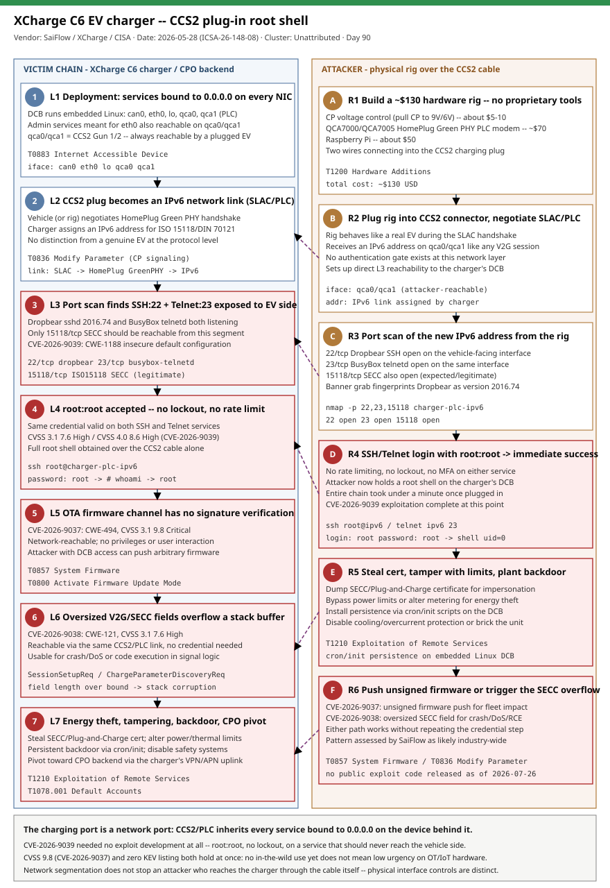

# XCharge C6 EV Chargers: CCS2 Plug-In Root Shell via Exposed SSH/Telnet, Default Credentials, and Firmware Integrity Bypass (CVE-2026-9037, CVE-2026-9038, CVE-2026-9039)

## TL;DR

On 2026-05-28 CISA published ICS advisory **ICSA-26-148-08** covering three vulnerabilities that SaiFlow researcher Lionel R. Saposnik reported for **XCharge's C6** DC fast-charging station: **CVE-2026-9037** (unsigned firmware updates, CVSS 3.1 9.8 Critical), **CVE-2026-9038** (stack-based buffer overflow in the charging controller's signal-processing logic, CVSS 3.1 7.6 High), and **CVE-2026-9039** (default credentials on an exposed management service, CVSS 3.1 7.6 High). SaiFlow's own technical writeup, "The Hidden CCS2 Attack Surface on EV Chargers" (published June 2026 and freshly re-surfaced 2026-07-24 in Hackaday's *This Week In Security* roundup and multiple other outlets), shows that every EV charging port doubles as an IP network port: the CCS2 cable establishes an IPv6 link over HomePlug Green PHY powerline communication between the vehicle and the charger, and on the XCharge C6 that same link exposes Dropbear SSH and BusyBox Telnet with the default credential `root:root`. A roughly $130 hardware rig (Control-Pilot voltage control, a QCA7000 PLC modem, and a Raspberry Pi) gets an attacker a root shell on the charger's DC-charging-board (DCB) with nothing more than physical access to a public charging bay -- no network position, no CSMS compromise, no credentials to guess. Sector impact spans automotive/EV-charging infrastructure and the energy/CPO (Charge Point Operator) backend networks that chargers pivot into; exploitation requires zero prior access and produces root in well under a minute once plugged in. Why today: slot #33 (Automotive/EV) had gone **50 days without a repo primary** -- the single largest gap across the full 35-slot taxonomy as of 2026-07-26, and one of the taxonomy's explicitly-named weekend auto-rebalance verticals -- and this finding is being actively re-disseminated in the security press this week even though the underlying CISA advisory is two months old; the XCharge-confirmed firmware fix (deployed to chargers running versions prior to 2026-05-22) is out, but SaiFlow assesses the underlying anti-pattern is not unique to one vendor.

## Attribution and confidence

There is **no threat-actor attribution** here -- this is a coordinated vulnerability disclosure, not a tracked intrusion. Credit for the finding goes to **SaiFlow** (lead researcher Lionel R. Saposnik), an Israel-based firm specializing in EV-charging and distributed-energy security; **XCharge** is the affected vendor (C6 DC fast-charging station); **CISA ICS-CERT** coordinated the disclosure and published ICSA-26-148-08 on 2026-05-28.

| Dimension | Assessment | Confidence |
|---|---|---|
| Vulnerabilities are real and vendor-confirmed | XCharge confirmed a firmware fix has been deployed to all affected chargers (versions prior to 2026-05-22) | high |
| Exploitation requires only physical/cable access, no credentials to guess | SaiFlow's PoC rig: Control-Pilot voltage control + QCA7000/QCA7005 HomePlug Green PHY PLC modem + Raspberry Pi, ~$130 total, no proprietary tooling | high |
| Pattern is XCharge-specific vs. industry-wide | SaiFlow explicitly assesses that the anti-pattern (services bound to `0.0.0.0`/`[::]`, default credentials, no interface separation) "likely exists across multiple vendors"; not independently confirmed in public sources on a second named vendor as of this writing | medium |
| In-the-wild exploitation | None reported; CISA/SSVC lists Exploitation: none for all three CVEs | n/a |
| Public exploit code | None published; SaiFlow's writeup is a narrative walkthrough with redacted screenshots, no working exploit script released | n/a |

**Genealogy with previous repo cases.** This is the repo's **second** EV-charging case and its **first** to attack the CCS2 physical plug rather than the OCPP backend. Day 40 (2026-06-06)'s OCPP EV-Charging / ABB Terra AC case -- also a SaiFlow finding -- put the spotlight on the WebSocket control-plane side of the same industry (a heap overflow in OCPP `DataTransfer` parsing, plus a wider missing-authentication class across CSMS backends). Today's case shows the same research house pulling on a completely different thread roughly seven weeks later: the vehicle-facing side of the charger, reachable with nothing but a cable and about $130 of hardware, no network position or CSMS compromise required. Read together, the two cases bracket the entire EV-charging trust boundary -- backend protocol (OCPP/WebSocket) on one side, physical interface (CCS2/PLC) on the other -- and both conclude with the same lesson: exposed administrative surface plus weak-or-missing authentication is the dominant failure class in this vertical, regardless of which side of the charger it appears on. Duplicate-guard check against the full `days/` tree, `INDEX.md` and `byActor/` came back clean for "xcharge", "ccs2" and "saiflow" as a slug/case before today -- this is the repo's first case naming XCharge or CCS2 specifically, and slot #33 (Automotive/EV) had gone 50 days since its last primary (Day 40), the single largest gap across all 35 taxonomy slots as of 2026-07-26.

## Kill chain — summary table

| Stage | MITRE | Detail |
|---|---|---|
| Deployment / attack surface | T0883 | XCharge C6's DCB binds administrative services to `0.0.0.0`/`[::]`, reachable from every network interface including the vehicle-facing PLC ports `qca0`/`qca1` |
| Build the attack rig | T1200 | ~$130 total: Control-Pilot voltage control (pull CP to 9V/6V), a QCA7000/QCA7005 HomePlug Green PHY PLC modem, a Raspberry Pi |
| Establish the CCS2 network link | T0836 | Plugging in negotiates SLAC/HomePlug Green PHY; the attacker's rig is assigned an IPv6 address on the charger's PLC segment exactly like a real V2G session |
| Discover exposed admin services | T0883 | A port scan of the newly-acquired IPv6 address finds Dropbear SSH (22/tcp) and BusyBox telnetd (23/tcp) alongside the legitimate ISO 15118 SECC service (15118/tcp) |
| Default-credential login | T0812 | `root:root` is accepted on both SSH and Telnet with no rate limiting or account lockout (CVE-2026-9039) |
| Root shell on the DCB | T0859 | Full administrative control of the charger's DC-charging-board is obtained over the CCS2 cable alone |
| Firmware integrity bypass | T0857 / T0800 | The OTA firmware-update channel performs no cryptographic signature check, so an attacker with DCB access can push arbitrary firmware (CVE-2026-9037) |
| Signal-processing stack overflow | T0836 | Oversized ISO 15118 / V2G message fields overflow a stack buffer in the charging controller's signal-processing logic (CVE-2026-9038), usable for crash/DoS or code execution |
| Impact and pivot | T1210 | Energy theft, safety-parameter tampering (power/thermal limits), SECC/Plug-and-Charge certificate theft, persistent backdoor via cron/init scripts, and a foothold toward the CPO backend via the charger's VPN/APN uplink |



The left lane follows the charger itself from public deployment through compromise to blast-radius impact; the right lane follows the attacker's parallel, entirely physical attack path from a $130 hardware rig to root shell and post-exploitation. The two red-bordered clusters mid-diagram -- default-credential login/root shell on the left, the matching SSH/Telnet login and post-exploitation actions on the right -- mark the actual CVE-2026-9039 exploitation moment; the cross-lane dashed arrows deliberately anchor detection at the interface boundary itself (an inbound connection to an admin port arriving FROM the vehicle-facing segment is never legitimate) rather than deeper inside the compromise, since everything after root is attacker-controlled and effectively unobservable from outside the device.

## Stage-by-stage detail

### Stage 1 -- Deployment and attack surface (T0883)

The XCharge C6 is a CCS2 DC fast-charging station whose DC-charging-board (DCB) runs embedded Linux with multiple network interfaces: `can0` (internal CAN bus), `eth0` (management network), `lo` (loopback), and `qca0`/`qca1` (PLC modems for CCS2 Gun 1 and Gun 2 respectively). SaiFlow's reconnaissance found that administrative services on the DCB are bound to `0.0.0.0`/`[::]` rather than to `eth0` alone, meaning every service meant only for back-office management is also reachable from `qca0`/`qca1` -- the two interfaces a connected vehicle (or an attacker's rig standing in for one) can always reach. **MITRE ICS T0883 -- Internet Accessible Device** (the same "unintentionally exposed on a reachable interface" pattern, here local to the physical interface rather than the public Internet).

### Stage 2 -- Build the attack rig (T1200)

No proprietary equipment is required. SaiFlow's parts list:

```
Control Pilot (CP) voltage control -- pull CP to 9V/6V                 ~$5-10
PLC modem -- HomePlug Green PHY capable (e.g. QCA7000/QCA7005)         ~$70
Mini computer -- Raspberry Pi                                          ~$50
Physical access -- two wires connecting to the CCS2 charging plug
-----------------------------------------------------------------------------
Total hardware cost                                                    ~$130
```

**MITRE Enterprise T1200 -- Hardware Additions** (the closest enterprise analogue for a purpose-built physical implant attached at a peripheral interface).

### Stage 3 -- Establish the CCS2 network link (T0836)

Every time an EV plugs in, the charger and vehicle negotiate SLAC (Signal Level Attenuation Characterization) and bring up a HomePlug Green PHY powerline link, then assign the vehicle side an IPv6 address for ISO 15118/DIN 70121 V2G signaling. The attacker's rig does exactly this -- there is no distinction, from the charger's point of view, between a genuine EV and a rig that speaks the same PLC handshake:

```
Plug in a CCS2 device -> Get an IPv6 address -> Access any exposed service
```

**MITRE ICS T0836 -- Modify Parameter** (the rig manipulates Control Pilot signaling to bring the link into a state that yields network access, not to change a charging setpoint directly).

### Stage 4 -- Discover exposed admin services (T0883)

A port scan of the freshly-assigned IPv6 address on `qca0`/`qca1` reveals:

| Service | Port | Purpose | Should be exposed to the EV? |
|---|---|---|---|
| SSH (Dropbear) | 22/tcp | Remote administration | No -- misconfiguration |
| Telnet (BusyBox) | 23/tcp | Remote administration | No -- misconfiguration |
| V2G (SECC) | 15118/tcp | ISO 15118 / DIN 70121 charging protocol | Yes -- required for charging |

The Dropbear banner fingerprints as `2016.74` -- the exact release that patched the well-known pre-auth RCE format-string bug **CVE-2016-7406**; one version earlier and no credentials at all would have been required. **MITRE ICS T0883 -- Internet Accessible Device.**

### Stage 5 -- Default-credential login (T0812) -- CVE-2026-9039

Both Dropbear SSH and BusyBox telnetd accept the trivially weak credential `root:root` -- one of the most common default passwords in embedded systems, never rotated before deployment -- with no rate limiting, no account lockout, and no MFA:

```
$ ssh root@<charger-plc-ipv6>
root@<charger-plc-ipv6>'s password: root
# whoami
root
```

CISA's advisory (CVE-2026-9039, CWE-1188 -- Initialization of a Resource with an Insecure Default) frames this as "a configuration weakness in the device's remote management service [that] allows an authenticated session to be established over a communication channel intended solely for vehicle-charger signaling... and it accepts a default administrative credential." **MITRE ICS T0812 -- Default Credentials.**

### Stage 6 -- Root shell on the DCB (T0859)

The login above hands the attacker an immediate, fully-privileged root shell on the charger's DCB -- no privilege escalation step is needed because the exposed account already is `root`. From here the attacker has read/write access to the entire embedded filesystem, the charger's process tree, and (per SaiFlow) the network path from the DCB toward the CPO's back-office systems. **MITRE ICS T0859 -- Valid Accounts** (the default credential functions as a permanently "valid" account).

### Stage 7 -- Firmware integrity bypass (T0857 / T0800) -- CVE-2026-9037

Separately, CISA's advisory documents that the charging controller's firmware-update mechanism "fails to validate the authenticity of firmware packages delivered through the device's management interface" (CWE-494 -- Download of Code Without Integrity Check), rated CVSS 3.1 9.8 Critical (AV:N/AC:L/PR:N/UI:N/S:U/C:H/I:H/A:H) -- network-reachable, no privileges or user interaction required. Combined with root access from Stage 6, or independently if the update service is reachable without first compromising SSH/Telnet, an attacker can push arbitrary unsigned firmware to the charger. **MITRE ICS T0857 -- System Firmware** and **T0800 -- Activate Firmware Update Mode.**

### Stage 8 -- Signal-processing stack overflow (T0836) -- CVE-2026-9038

CISA also documents a stack-based buffer overflow (CWE-121) in the charging controller's signal-processing logic: "an attacker with physical access to the charging interface can supply message fields that exceed expected bounds," rated CVSS 3.1 7.6 High (AV:P/AC:L/PR:N/UI:N/S:C/C:H/I:H/A:H). This is reachable over the same CCS2/PLC link used in Stages 3-6 and gives a second, independent path to code execution or denial of service that does not require the default SSH/Telnet credential at all. **MITRE ICS T0836 -- Modify Parameter** (malformed protocol-level message fields, not a legitimate parameter change).

### Stage 9 -- Impact and pivot (T1210)

With root on the DCB, SaiFlow enumerates concrete post-exploitation capabilities: stealing the SECC/Plug-and-Charge certificate to impersonate the charger; bypassing power limits or altering metering (energy theft); installing a persistent backdoor via cron/init scripts; disabling safety systems (cooling, overcurrent protection); bricking the device outright; and -- where the charger's architecture allows it -- pivoting via the charger's VPN/APN backbone connection into the CPO's back-office billing and fleet-management systems. **MITRE Enterprise T1210 -- Exploitation of Remote Services** (for the CPO-network pivot leg) alongside **T1078.001 -- Default Accounts** (the underlying credential weakness that started the chain).

## Detection strategy

### Telemetry that matters

- Charger/DCB syslog, where the vendor supports remote log forwarding -- authentication success/failure lines from Dropbear and BusyBox telnetd.
- CPO backend firewall/IDS logs (`CommonSecurityLog`) covering the segment between the charger fleet and the CSMS/back-office network.
- Passive OT network sensor coverage of the PLC/CCS2 segment where feasible (Zeek `conn.log`, Suricata) -- most deployments do not span a tap across the charging cable itself, so absence of this telemetry is itself a gap worth documenting.
- Periodic authenticated service inventory (`nmap`/`masscan`-class scanning under change control) against the charger fleet's management and, where legally and contractually permitted, PLC-side addresses.
- OTA/firmware-distribution server logs -- every firmware push should have a matching signature-verification log entry; a push without one is the CVE-2026-9037 exploitation signature.

### Detection coverage

| Engine | File | Logic |
|---|---|---|
| Sigma | `xcharge_c6_admin_port_reachable_plc.yml` | Network-connection telemetry showing a session to charger port 22 or 23 originating from a PLC/vehicle-side address range instead of the management VLAN |
| Sigma | `xcharge_c6_default_root_login_syslog.yml` | Device syslog shows a Dropbear/BusyBox authentication SUCCESS for user `root` with no matching maintenance-ticket marker |
| Sigma | `xcharge_c6_ota_unsigned_firmware_push.yml` | OTA distribution server file-transfer event to a charger with no paired signature-verification log line within the expected window |
| Suricata | `xcharge_c6_ccs2_rootshell.rules` | SSH/Telnet banner grabs and a `root` login-success token observed on a charger-management port from a PLC-segment source; oversized V2G/SECC message fields |
| YARA | `xcharge_c6_firmware_heuristics.yar` | Heuristics for extracted firmware images lacking an expected signature-block trailer, and for embedded config/script artifacts referencing the `root:root` credential pair |
| KQL | `k1_admin_port_reachable_from_plc_segment.kql` | `CommonSecurityLog`/`Syslog` -- inbound connection to charger ports 22/23 sourced from the PLC/vehicle-facing address range |
| KQL | `k2_root_login_dropbear_busybox.kql` | `Syslog` -- root authentication success on Dropbear/BusyBox with no correlated change record |
| KQL | `k3_ota_push_without_signature_verification.kql` | `Syslog` -- firmware-push events unmatched to a signature-verification event within a configurable window |

### Threat hunting hypotheses

- **H1 (`hunts/peak_h1_admin_port_exposure_inventory.md`).** One or more chargers in the fleet expose administrative services (SSH/Telnet/HTTP management) on the vehicle-facing PLC interface rather than the management-only interface.
- **H2 (`hunts/peak_h2_default_credential_reuse.md`).** Default or shared credentials (including but not limited to `root:root`) remain valid on any charger in the estate, whether or not a login attempt has yet been observed from the PLC side.
- **H3 (`hunts/peak_h3_unsigned_firmware_push.md`).** A firmware push has reached one or more chargers without a corresponding vendor-signed manifest or signature-verification log entry.

## Incident response playbook

### First 60 minutes (triage)

1. Identify the specific charger unit(s) and firmware version(s) in scope; cross-reference against the XCharge fix (versions prior to 2026-05-22 are affected).
2. Pull the charger's most recent DCB syslog (if forwarded) and look for authentication events on Dropbear/BusyBox around the suspected window.
3. Check whether the charger's admin ports (22/tcp, 23/tcp) are reachable from anything other than the management VLAN -- from the CPO network if possible, and, if a safe test procedure exists, from the vehicle-side PLC segment.
4. Review the CSMS/back-office firewall and VPN/APN concentrator logs for any unexpected inbound session originating from the charger's uplink around the same window.
5. If a compromise is confirmed or suspected, isolate the charger from the CPO backend network (disable the VPN/APN uplink or take the unit offline) before further triage disturbs volatile state.
6. Notify the CPO's security team and XCharge support; confirm firmware version and whether the May 2026 fix has been applied fleet-wide.

### Artifacts to collect

| Artifact | Path | Tool | Why |
|---|---|---|---|
| DCB syslog (if forwarded) | vendor-specific remote-log path or local `/var/log` on the DCB | vendor CLI / SIEM forwarder export | Authentication events, firmware-push events |
| Firmware version and build info | vendor management console / DCB `About`/version endpoint | vendor CLI | Confirm exposure to the pre-2026-05-22 vulnerable range |
| Firewall / IDS logs for the charger segment | CPO network firewall or IDS export | firewall vendor tooling, Suricata | Confirm or rule out anomalous port-22/23 sessions from the PLC side |
| VPN/APN concentrator session logs | CPO backend network | VPN/APN vendor tooling | Detect a pivot attempt from a compromised charger toward back-office systems |
| Network capture of the CCS2/PLC segment (where feasible) | tap on the charging cable's PLC path | packet capture appliance | Confirm SLAC/HomePlug Green PHY negotiation and any admin-port traffic |

### IR queries and commands

```bash
# Confirm charger firmware version via vendor CLI (illustrative; consult XCharge support docs for exact syntax)
ssh svc-account@<charger-mgmt-ip> "cat /etc/xcharge-version"

# From the management network, confirm which interfaces expose SSH/Telnet (authorized testing only)
nmap -p 22,23,15118 <charger-mgmt-ip>
```

```kql
// Quick triage: any inbound connection to charger admin ports from a non-management source in the last 24h
CommonSecurityLog
| where TimeGenerated > ago(24h)
| where DestinationPort in (22, 23)
| where DeviceVendor has "charger" or DeviceProduct has_any ("XCharge","EVSE")
| project TimeGenerated, SourceIP, DestinationIP, DestinationPort, DeviceAction
```

### Containment, eradication, recovery

- **Exit criteria for containment:** the affected charger is removed from the CPO backend network (uplink disabled or unit powered off) until firmware is confirmed at or above the 2026-05-22 fix level and the default credential has been rotated to a unique, per-device value.
- **Eradication:** apply the XCharge firmware update; where the vendor firmware still ships a default credential template, rotate it to a unique per-device secret as part of the update process, not as a follow-up task.
- **What NOT to do:** do not leave the charger reachable on the CPO network "temporarily" while awaiting a maintenance window -- the exposure requires only a cable, not a network position, so normal network segmentation controls do not mitigate it. Do not assume a charger is unaffected solely because no anomalous login has been logged -- most deployments have no syslog forwarding from the DCB at all, so absence of evidence is not evidence of absence.
- **Recovery validation:** confirm the firmware version fleet-wide, confirm the default credential no longer authenticates, and confirm that SSH/Telnet (if still enabled at all) are bound to the management interface only and unreachable from `qca0`/`qca1`.

## IOCs

| Type | Value | Context | Confidence | Source |
|---|---|---|---|---|
| cve | CVE-2026-9037 | Unsigned firmware update path (CWE-494), CVSS 3.1 9.8 Critical | high | CISA ICSA-26-148-08 |
| cve | CVE-2026-9038 | Stack-based buffer overflow in signal-processing logic (CWE-121), CVSS 3.1 7.6 High | high | CISA ICSA-26-148-08 |
| cve | CVE-2026-9039 | Default `root:root` credential on exposed management service (CWE-1188), CVSS 3.1 7.6 High | high | CISA ICSA-26-148-08 / SaiFlow |
| string | root:root | Default Dropbear SSH / BusyBox telnetd administrative credential on the XCharge C6 DCB | high | SaiFlow blog |
| string | Dropbear sshd 2016.74 | Fingerprintable SSH banner; this exact version already patched CVE-2016-7406 | medium | SaiFlow blog |
| path | qca0 | PLC (HomePlug Green PHY) interface for CCS2 Gun 1; bound by SSH/Telnet despite vehicle-side reachability | high | SaiFlow blog |
| path | qca1 | PLC interface for CCS2 Gun 2; same exposure as qca0 | high | SaiFlow blog |
| note | port 22/tcp | Dropbear SSH bound to 0.0.0.0 -- reachable from qca0/qca1 and eth0 | high | SaiFlow blog |
| note | port 23/tcp | BusyBox telnetd bound to 0.0.0.0 -- same exposure as port 22 | high | SaiFlow blog |
| note | port 15118/tcp | ISO 15118 / DIN 70121 SECC (V2G) service -- the only service that should be vehicle-reachable | medium | SaiFlow blog |
| note | Attack rig cost | ~$130 total (CP voltage control ~$5-10; QCA7000/QCA7005 PLC modem ~$70; Raspberry Pi ~$50); no proprietary tooling | high | SaiFlow blog |
| note | No public sample | No public exploit binary or malware sample is associated with this case -- coordinated disclosure, not an observed in-the-wild intrusion | high | analysis |
| cve | CVE-2022-27242 | Historical dependency CVE in OpenV2G 0.9.4 (X.509 parsing buffer overflow, CVSS 9.8) bundled on XCharge C6; not confirmed exploited in this case, flagged as compounding supply-chain risk | medium | SaiFlow blog / NVD |
| cve | CVE-2025-24956 | Second historical dependency CVE in the same OpenV2G 0.9.4 codebase bundled on XCharge C6 (CVSS 9.8); not confirmed exploited in this case | medium | SaiFlow blog / NVD |
| note | Vendor fix | XCharge confirmed the firmware update addressing all three CVEs is deployed to chargers running versions prior to 2026-05-22 | high | CISA ICSA-26-148-08 / SaiFlow |

Full IOC list (15 entries) lives in [`iocs.csv`](./iocs.csv). **KEV status:** per the generated `kev.md`, 6 CVEs are referenced across this README (the three primary XCharge C6 findings CVE-2026-9037/-9038/-9039, plus three historical/dependency references -- CVE-2016-7406 on the Dropbear banner and the two OpenV2G dependency CVEs CVE-2022-27242/CVE-2025-24956) and **0 of the 6 appear on the CISA Known Exploited Vulnerabilities catalog** as of this writing. CISA/SSVC lists "Exploitation: none" for all three primary CVEs, consistent with a coordinated disclosure rather than an active campaign; absence from KEV here reflects no known in-the-wild use, not a lesser technical severity (CVE-2026-9037 alone is CVSS 9.8 Critical).

## Secondary findings

- **Pwn2Own Automotive 2026 (Tokyo, January 2026)** confirmed EV-charging hardware as a mainstream exploitation target well before this disclosure: researchers earned over $1,047,000 across 76 zero-days, including a Synacktiv NFC-based compromise of an Autel MaxiCharger AC Elite Home 40A and a Finland-based team's (Juurin Oy) Time-of-Check-to-Time-of-Use bug against an Alpitronic HYC50 DC fast charger -- three different vendors, three different attack surfaces (NFC, TOCTOU, and now CCS2/PLC), same overall lesson: EV-charging hardware has not yet had the security hardening pass that a decade of enterprise IT received.
- **VicOne's Q1 2026 automotive threat intelligence** recorded 405 automotive cybersecurity incidents in the quarter, with EV-charging incidents tripling quarter-over-quarter and automotive-specific CVE disclosures up 102% year-on-year versus Q1 2025 -- the volume backdrop against which this single-vendor finding sits.
- **Classic key-fob relay and CAN-bus injection theft remain unresolved in parallel with the new charging-infrastructure attack surface**: ADAC (Germany's largest auto club) found roughly 85% of over 800 tested vehicles could still be opened and driven away with inexpensive relay/signal-extension equipment, and Thatcham Research found over 68% of pre-2023 vehicles remain vulnerable to relay theft without added mitigation -- a reminder that slot #33 (Automotive/EV) spans both the vehicle's classic RF attack surface and the rapidly-expanding charging-infrastructure attack surface covered by today's primary.

## Pedagogical anchors

- **A charging port is a network port.** Any interface that establishes an IP link -- CCS2/PLC included -- inherits every service bound to `0.0.0.0` on the device behind it; "it's just a power connector" is a physical-layer assumption that does not hold once IPv6-over-powerline is in the design.
- **Default credentials on embedded/OT devices are not a checklist afterthought -- they are the whole vulnerability.** CVE-2026-9039 required no exploit development at all: `root:root`, no lockout, no rate limiting, on a service that should never have been reachable from that interface in the first place.
- **CVSS severity and KEV listing measure different things.** CVE-2026-9037 is CVSS 9.8 Critical yet absent from KEV because no in-the-wild exploitation has been observed; treat a high CVSS score on embedded/OT hardware as urgent regardless of KEV status, since fleet-wide patch cycles for physical devices are typically much slower than for enterprise IT.
- **Legacy bundled dependencies compound device risk even when they are not the headline finding.** XCharge C6 ships OpenV2G 0.9.4 (from 2020), carrying its own known CVEs (CVE-2022-27242, CVE-2025-24956) -- a reminder to inventory embedded firmware dependencies, not just the vendor's own code, when assessing OT/IoT device risk.
- **Physical-access attack surfaces do not respect network segmentation.** Standard CPO network controls (firewalls, VPN, segmentation of the management VLAN) do nothing to stop an attacker who reaches the charger through the charging cable itself; physical/interface-level controls (binding services to the correct interface, disabling unused services) are a distinct control category from network segmentation and must be assessed separately.

## What's in this folder

| File | Purpose | Link |
|---|---|---|
| README.md | This case writeup (15-section standard) | [README.md](./README.md) |
| kill_chain.svg | Two-lane kill chain diagram (Template A) | [kill_chain.svg](./kill_chain.svg) |
| kev.md | CISA KEV cross-reference for this case's CVEs | [kev.md](./kev.md) |
| sigma/xcharge_c6_admin_port_reachable_plc.yml | Sigma rule -- admin port reachable from PLC/vehicle segment | [sigma/xcharge_c6_admin_port_reachable_plc.yml](./sigma/xcharge_c6_admin_port_reachable_plc.yml) |
| sigma/xcharge_c6_default_root_login_syslog.yml | Sigma rule -- root login via Dropbear/BusyBox in device syslog | [sigma/xcharge_c6_default_root_login_syslog.yml](./sigma/xcharge_c6_default_root_login_syslog.yml) |
| sigma/xcharge_c6_ota_unsigned_firmware_push.yml | Sigma rule -- OTA firmware push without signature verification | [sigma/xcharge_c6_ota_unsigned_firmware_push.yml](./sigma/xcharge_c6_ota_unsigned_firmware_push.yml) |
| kql/k1_admin_port_reachable_from_plc_segment.kql | KQL -- inbound admin-port connection from PLC segment | [kql/k1_admin_port_reachable_from_plc_segment.kql](./kql/k1_admin_port_reachable_from_plc_segment.kql) |
| kql/k2_root_login_dropbear_busybox.kql | KQL -- root authentication success on Dropbear/BusyBox | [kql/k2_root_login_dropbear_busybox.kql](./kql/k2_root_login_dropbear_busybox.kql) |
| kql/k3_ota_push_without_signature_verification.kql | KQL -- firmware push unmatched to signature verification | [kql/k3_ota_push_without_signature_verification.kql](./kql/k3_ota_push_without_signature_verification.kql) |
| yara/xcharge_c6_firmware_heuristics.yar | YARA -- firmware/config artifact heuristics (no public sample exists) | [yara/xcharge_c6_firmware_heuristics.yar](./yara/xcharge_c6_firmware_heuristics.yar) |
| suricata/xcharge_c6_ccs2_rootshell.rules | Suricata -- SSH/Telnet banner and root-login detections on PLC segment | [suricata/xcharge_c6_ccs2_rootshell.rules](./suricata/xcharge_c6_ccs2_rootshell.rules) |
| hunts/peak_h1_admin_port_exposure_inventory.md | PEAK hunt H1 -- admin-port exposure inventory | [hunts/peak_h1_admin_port_exposure_inventory.md](./hunts/peak_h1_admin_port_exposure_inventory.md) |
| hunts/peak_h2_default_credential_reuse.md | PEAK hunt H2 -- default credential reuse | [hunts/peak_h2_default_credential_reuse.md](./hunts/peak_h2_default_credential_reuse.md) |
| hunts/peak_h3_unsigned_firmware_push.md | PEAK hunt H3 -- unsigned firmware push | [hunts/peak_h3_unsigned_firmware_push.md](./hunts/peak_h3_unsigned_firmware_push.md) |
| iocs.csv | Full structured IOC list (15 entries) | [iocs.csv](./iocs.csv) |

## Sources

- [The Hidden CCS2 Attack Surface on EV Chargers -- SaiFlow](https://www.saiflow.com/blog/the-hidden-ccs2-attack-surface-on-ev-chargers)
- [XCharge C6 -- CISA ICS Advisory ICSA-26-148-08](https://www.cisa.gov/news-events/ics-advisories/icsa-26-148-08)
- [CVE-2026-9039 record -- Vulnerability-Lookup / cvelistv5](https://vulnerability.circl.lu/vuln/cve-2026-9039)
- [ICSA-26-148-08 full CSAF record -- Vulnerability-Lookup](https://vulnerability.circl.lu/vuln/icsa-26-148-08)
- [This Week In Security: AI Is A Mess, Hacking Car Chargers, An OpenSSL DoS, And Factories Under Attack -- Hackaday](https://hackaday.com/2026/07/24/this-week-in-security-ai-is-a-mess-hacking-car-chargers-an-openssl-dos-and-factories-under-attack/)
- [Pwn2Own Automotive 2026 uncovers 76 zero-days, pays out more than $1M -- The Register](https://www.theregister.com/2026/01/25/pwn2own_automotive_2026_identifies_76_0days/)
- [Keyless car theft in under a minute -- Help Net Security](https://www.helpnetsecurity.com/2026/06/05/keyless-car-theft-protection/)
- [EV Charging Security Now Demands Infrastructure-Level Thinking -- VicOne](https://vicone.com/blog/ev-charging-security-now-demands-infrastructure-level-thinking)
