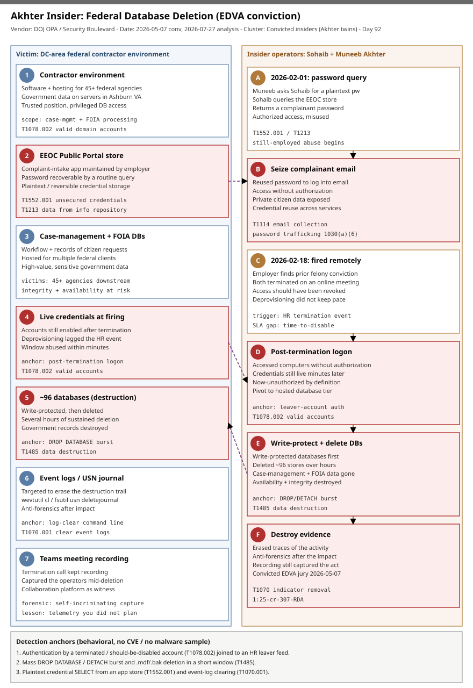

# Akhter Insider Case: Post-Termination Deletion of ~96 U.S. Government Databases

## TL;DR
On 2026-05-07 a federal jury in the Eastern District of Virginia convicted Sohaib Akhter (34, Alexandria VA) of conspiracy to commit computer fraud, password trafficking, and being a felon in possession of firearms. He and his twin brother and co-defendant Muneeb Akhter worked for a Washington, D.C. company that provided software and hosting to more than 45 federal agencies from servers in Ashburn, Virginia. On 2026-02-01, while still employed, they used a routine database query against the EEOC Public Portal store to pull a complainant's plaintext password and reuse it to seize that person's email account; then, minutes after being fired on a remote termination meeting on 2026-02-18, they logged back in on still-live credentials, write-protected and deleted approximately 96 databases holding case-management and FOIA-processing data, and destroyed evidence. This is a Day-92 crime-economy (#20 insider threat) case, surfaced today by a 2026-07-27 legal analysis in Security Boulevard amplifying the DOJ conviction; it is a purely behavioral detection problem with no CVE and no malware sample.

## Attribution and confidence
Primary actors: **Sohaib Akhter** and **Muneeb Akhter** (twin brothers), former employees of an unnamed DC-area federal software/hosting contractor. This is not a tracked threat cluster but a named, convicted insider pair; "attribution" here is a matter of court record rather than telemetry-based clustering.

- **Confidence: high.** Facts come from the U.S. Department of Justice press release (26-463, 2026-05-07) describing court records and evidence at trial, corroborated by The Register, the SBA-OIG announcement, and a 2026-07-27 legal analysis by Mark Rasch (Security Boulevard). Muneeb Akhter separately pleaded guilty in April 2026.
- The brothers were previously convicted in the same district in 2015 (guilty pleas to conspiracy to commit wire fraud and to access State Department and private computer systems), served prison terms, and were nonetheless later rehired into a federal-contractor environment.

| Overlap dimension | Observation | Confidence |
|---|---|---|
| Identity | Named defendants, jury conviction + guilty plea | high |
| Environment | DC-area contractor, 45+ agencies, Ashburn VA hosting | high |
| Recidivism | Same-district 2015 State Dept intrusion convictions | high |
| Technique reuse | Authorized-access abuse then destructive post-termination access | high |

Genealogy with previous repo cases: the only prior #20 insider primary is **Day 57 (2026-06-23) Cloud Insider Recruitment** (Intel 471), an *acquisitive* market where insiders are recruited to sell standing access. Today's case is its destructive mirror image: a *sabotage* insider abusing residual access after termination. It also contrasts with the ransomware-economy cases of this rotation (Day 78 agentic ransomware, Day 85 Spirals backup/hypervisor) in that impact here is manual data destruction by trusted humans, not tooling.

## Kill chain — summary table
| Stage | MITRE | Detail |
|---|---|---|
| Authorized data-repository access | T1213 | Operator queries the EEOC Public Portal backing store |
| Unsecured credential retrieval | T1552.001 | Query returns a complainant's plaintext password |
| Credential reuse to email | T1114 | Password reused to access the victim's email without authorization |
| Valid accounts (post-termination) | T1078.002 | Fired 2026-02-18; log back in on still-live credentials |
| Data destruction | T1485 | Write-protect then delete ~96 government databases over hours |
| Indicator removal | T1070 / T1070.001 | Destroy evidence of the activity |



The left lane is the victim contractor environment (EEOC Public Portal store, case-management and FOIA databases, the ~96 deleted stores, event logs, and the Teams termination-meeting recording that inadvertently captured the act). The right lane is the operator sequence from the 2026-02-01 plaintext-password query through the post-termination logon to mass deletion and evidence destruction. Detection anchors sit on the transitions, not on any static artifact: leaver-account authentication, DROP/DETACH bursts, plaintext-credential SELECTs, and event-log clearing.

## Stage-by-stage detail

### Authorized access to the data repository (T1213)
The Akhters' employer maintained the EEOC Public Portal and hosted its backing store. On 2026-02-01, Muneeb asked Sohaib for the plaintext password of an individual who had submitted an EEOC complaint. Sohaib, whose role granted him database access, ran a query and obtained it. Under *Van Buren v. United States* this was authorized access misused for a forbidden purpose, which is exactly why the destructive post-termination conduct (below) is the stronger criminal hook.

```text
Actor: still-employed DB operator
Action: ad-hoc SELECT against the EEOC Public Portal store
Result: a user password returned in usable (plaintext/reversible) form
```

### Unsecured credential retrieval (T1552.001)
The security-design failure is that a password was retrievable through a routine query at all. Credentials for a public complaint portal should be stored only as slow-KDF hashes (argon2id / bcrypt / scrypt), never in a form a database operator can read back. Detection here is a database-audit problem: interactive SELECTs touching credential columns from anything other than the application service account.

### Credential reuse to seize email (T1114)
The retrieved password was reused to log into the complainant's personal email account without authorization, exposing private citizen data. This is the classic blast-radius multiplier of plaintext storage plus password reuse: one repository read becomes an account takeover on an unrelated system.

### Valid accounts, post-termination (T1078.002)
When the employer discovered Sohaib's prior felony conviction, it terminated both brothers on a remote (online) meeting on 2026-02-18. Deprovisioning did not keep pace with the HR event: minutes later the brothers accessed company computers on credentials that were still live. Any access after termination is unauthorized by definition, and the near-zero gap between "fired" and "logged back in" is the single most detectable transition in the whole chain, provided the SOC has an authoritative leaver feed to join against.

```text
Trigger: termination meeting 2026-02-18
Gap: minutes (credentials not yet disabled)
Pivot: back into the hosted database tier
```

### Data destruction (T1485)
Over the course of several hours the brothers write-protected databases and then deleted approximately 96 databases holding U.S. government information, including case-management and FOIA response-processing data. The write-protect-then-delete pattern gives defenders two vantage points: a burst of `DROP DATABASE` / `sp_detach_db` / `DETACH` at the engine layer, and a burst of `.mdf` / `.ldf` / `.bak` file deletions at the filesystem layer.

```sql
-- illustrative of the destructive verb pattern (not a recovered artifact)
DROP DATABASE [CaseMgmt_AgencyA];
EXEC sp_detach_db 'FOIA_AgencyB';
-- repeated across ~96 targets in a short window
```

### Indicator removal (T1070 / T1070.001)
The brothers destroyed evidence of their activities. In Windows environments this typically surfaces as `wevtutil cl`, `Clear-EventLog`, or `fsutil usn deletejournal`. The irony of this case is that the destruction was still captured out-of-band: the termination meeting on the collaboration platform kept recording and preserved the act (see Secondary findings).

## Detection strategy

### Telemetry that matters
- **Identity / logon:** `IdentityLogonEvents`, `DeviceLogonEvents`, Windows Security 4624/4625/4634, VPN and RDP gateway logs, and database authentication logs, all joined to an authoritative HR leaver feed (UPN -> termination time) or AD account-disable timestamps.
- **Process:** `DeviceProcessEvents` / Sysmon EID 1 for database CLI clients (sqlcmd, osql, mysql, psql, mongosh, sqlite3) and for `wevtutil`, `fsutil`, `Clear-EventLog`.
- **File:** Sysmon FileDelete (EID 23) / `DeviceFileEvents` for `.mdf/.ldf/.ndf/.bak/.trn/.bacpac` deletions.
- **Database audit:** engine-native audit of `DROP`/`DETACH`/`DELETE` and of SELECTs against credential columns.

### Detection coverage
| Engine | File | Logic |
|---|---|---|
| Sigma | sigma/proc_evidence_destruction_eventlog_usn_clear.yml | Event-log / USN-journal clearing via command line (T1070.001) |
| Sigma | sigma/proc_mass_database_drop_cli.yml | Destructive DB verbs passed to CLI clients (T1485) |
| Sigma | sigma/file_database_backup_deletion.yml | Deletion of database / backup files via FileDelete telemetry (T1485) |
| KQL | kql/evidence_destruction_log_clear.kql | Defender XDR: log / USN clearing processes |
| KQL | kql/mass_database_drop_cli.kql | Defender XDR: >=3 DROP/DETACH invocations per actor per hour |
| KQL | kql/post_termination_logon.kql | Defender XDR: authentication by a leaver-list account |
| YARA | yara/insider_destructive_scripts.yar | Destructive DB-drop scripts and anti-forensics wipe scripts |
| Suricata | suricata/insider_db_destruction.rules | Destructive SQL verbs in cleartext DB protocol streams |

### Threat hunting hypotheses
- **H1 (T1078.002):** an account authenticates after its HR termination time. See hunts/peak_h1_post_termination_access.md.
- **H2 (T1485):** one actor drops/detaches databases or deletes DB files across many targets in a short window. See hunts/peak_h2_mass_database_destruction.md.
- **H3 (T1552.001 / T1213):** a human-run query retrieves credential material from an application store. See hunts/peak_h3_plaintext_credential_query.md.

## Incident response playbook

### First 60 minutes (triage)
1. Confirm the actor's employment status and exact termination timestamp from HR; treat any access after it as unauthorized.
2. Disable the account(s) everywhere (AD/Entra, VPN, DB logins, SaaS) and kill live sessions and refresh tokens; do not merely reset the password.
3. Snapshot affected database hosts and preserve DB transaction logs and storage-array delete records before they roll off.
4. Identify the scope of deletion (which databases, which agencies' data) and whether immutable/offline backups exist.
5. Pull collaboration-platform recordings and logs from the termination window; they may contain out-of-band evidence.
6. Engage legal/HR and the relevant OIGs early; this is likely a criminal matter.

### Artifacts to collect
| Artifact | Path | Tool | Why |
|---|---|---|---|
| DB engine audit / error logs | server-specific (e.g. MSSQL ERRORLOG, MySQL general log) | native / KAPE | DROP/DETACH and login history |
| Windows Security + System logs | %SystemRoot%\System32\winevt\Logs\ | EvtxECmd | 4624/4625 logon, 1102 log-clear |
| Sysmon operational log | Microsoft-Windows-Sysmon/Operational | EvtxECmd | process + FileDelete telemetry |
| VPN / RDP gateway logs | gateway appliance / RMM | vendor export | post-termination remote access |
| Storage-array delete events | SAN/NAS audit | vendor tooling | file-level destruction record |
| Collaboration recording | platform cloud store | platform admin export | out-of-band capture of the act |

### IR queries and commands
```powershell
# Recent interactive logons for a suspect account (adjust window)
Get-WinEvent -FilterHashtable @{LogName='Security';Id=4624;StartTime=(Get-Date).AddDays(-3)} |
  Where-Object { $_.Properties[5].Value -eq 'suspectUser' } |
  Select-Object TimeCreated,@{n='LogonType';e={$_.Properties[8].Value}},@{n='Src';e={$_.Properties[18].Value}}
```
```bash
# Look for event-log clearing / USN wipe in collected process telemetry (CSV export)
grep -Ei 'wevtutil.*(cl |clear-log)|Clear-EventLog|fsutil.*usn.*deletejournal' process_events.csv
```
```kql
// Defender XDR: destructive DB CLI activity by a specific actor
DeviceProcessEvents
| where AccountName =~ "suspectUser"
| where FileName in~ ("sqlcmd.exe","osql.exe","mysql.exe","psql.exe","mongosh.exe")
| where ProcessCommandLine has_any ("DROP DATABASE","sp_detach_db","DETACH DATABASE")
| project Timestamp, DeviceName, ProcessCommandLine
```

### Containment, eradication, recovery
- **Exit criteria:** all of the actor's credentials and tokens revoked; no post-termination sessions remain; scope of deleted data enumerated; a clean, integrity-verified backup identified.
- **What NOT to do:** do not reset-and-reuse the account, do not restore over live evidence before snapshots are preserved, and do not assume the collaboration recording is the only copy of what happened.
- Rebuild or restore destroyed databases from immutable/offline backups; verify referential integrity per agency dataset.

### Recovery validation
- Confirm restored databases match a known-good backup checksum/row-count baseline per dataset.
- Confirm the leaver account is disabled across every system and that deprovisioning now fires within the SLA.
- Confirm credential storage for the affected application was migrated to slow-KDF hashing and that no plaintext remains.

## IOCs
This is a domestic insider case with no public malware sample and no network IOCs; the durable indicators are behavioral and organizational. Full list in `iocs.csv`.

| Type | Value | Context | Confidence | Source |
|---|---|---|---|---|
| note | 1:25-cr-307-RDA | EDVA case; Sohaib Akhter convicted 2026-05-07 | high | DOJ OPA 26-463 |
| note | ~96 databases deleted | Case-management + FOIA data destroyed over several hours on 2026-02-18 | high | DOJ OPA 26-463 |
| note | 45+ federal agencies | Blast radius; hosting in Ashburn VA | high | DOJ OPA 26-463 |
| note | plaintext-password-via-query | EEOC Public Portal store returned a usable password on 2026-02-01 | high | DOJ OPA 26-463 |
| string | DROP DATABASE | Core destructive verb; burst execution is the anchor | medium | Behavioral inference |
| string | EEOC Public Portal | Affected federal complaint-intake application | high | DOJ OPA 26-463 |
| cve | none | No software vulnerability in scope (authorized-access abuse + unauthorized post-termination access) | high | Analyst note |

No CVE is in scope, so no `kev.md` is generated for this case; absence from CISA KEV is not evidence of anything here because there is no vulnerability to list.

## Secondary findings
- **Collaboration platform as an unplanned witness.** Multiple outlets (technology.org) report the termination meeting was a video call that kept recording, capturing the brothers as they wiped the databases. The lesson is that incident telemetry sometimes lives in systems you did not design for forensics (meeting recordings, RMM session logs, storage-array audit); inventory them before an incident.
- **Plaintext credential storage in a citizen-facing federal portal.** A password recoverable by routine query enabled an email-account takeover of a member of the public. This is a data-at-rest design defect (reversible credential storage), independent of the insider's intent, and would have been exploitable by any operator with query access.
- **Recidivism and continuous vetting.** Both brothers had prior 2015 EDVA convictions for hacking State Department systems yet were rehired into a 45-agency contractor environment. Point-in-time background checks miss this; continuous evaluation and least-privilege for high-risk roles are the controls that matter.

## Pedagogical anchors
- When the actor is a trusted insider with legitimate credentials, there is no CVE to patch and no hash to block; detection anchors on the *sequence and timing of behavior* (leaver-account auth -> destructive verbs -> log clearing), not on static artifacts.
- Deprovisioning latency is an attack surface. The gap between "terminated" and "credentials disabled" was minutes here; treat time-to-disable as a measured SLA and drive it toward zero for privileged roles.
- Reversible credential storage turns one repository read into an account takeover. Hash with a slow KDF and segregate secrets so no routine query can return them.
- Availability engineering is a security control: immutable/offline backups are what separate "several hours of deletion" from "unrecoverable loss".
- Out-of-band telemetry (meeting recordings, storage audit, RMM logs) can be decisive; know what you have before you need it.

## What's in this folder
| File | Purpose | Link |
|---|---|---|
| README.md | This analysis. | [README.md](./README.md) |
| kill_chain.svg | Two-lane kill-chain diagram (template A, category accent "other"). | [kill_chain.svg](./kill_chain.svg) |
| sigma/proc_evidence_destruction_eventlog_usn_clear.yml | Sigma: event-log / USN-journal clearing (T1070.001). | [file](./sigma/proc_evidence_destruction_eventlog_usn_clear.yml) |
| sigma/proc_mass_database_drop_cli.yml | Sigma: destructive DB verbs via CLI (T1485). | [file](./sigma/proc_mass_database_drop_cli.yml) |
| sigma/file_database_backup_deletion.yml | Sigma: database/backup file deletion (T1485). | [file](./sigma/file_database_backup_deletion.yml) |
| kql/evidence_destruction_log_clear.kql | KQL: log/USN clearing processes. | [file](./kql/evidence_destruction_log_clear.kql) |
| kql/mass_database_drop_cli.kql | KQL: DROP/DETACH burst per actor per hour. | [file](./kql/mass_database_drop_cli.kql) |
| kql/post_termination_logon.kql | KQL: authentication by a leaver-list account. | [file](./kql/post_termination_logon.kql) |
| yara/insider_destructive_scripts.yar | YARA: destructive DB-drop and anti-forensics wipe scripts. | [file](./yara/insider_destructive_scripts.yar) |
| suricata/insider_db_destruction.rules | Suricata: destructive SQL verbs in cleartext DB streams. | [file](./suricata/insider_db_destruction.rules) |
| hunts/peak_h1_post_termination_access.md | PEAK hunt: post-termination authentication. | [file](./hunts/peak_h1_post_termination_access.md) |
| hunts/peak_h2_mass_database_destruction.md | PEAK hunt: mass database destruction burst. | [file](./hunts/peak_h2_mass_database_destruction.md) |
| hunts/peak_h3_plaintext_credential_query.md | PEAK hunt: plaintext credential retrieval. | [file](./hunts/peak_h3_plaintext_credential_query.md) |
| iocs.csv | Behavioral / organizational indicators and MITRE mapping. | [iocs.csv](./iocs.csv) |

## Sources
- [DOJ OPA: Federal Jury Convicts Virgina Man on Charges Relating to the Deletion of U.S. Government Databases (26-463, 2026-05-07)](https://www.justice.gov/opa/pr/federal-jury-convicts-virgina-man-charges-relating-deletion-us-government-databases)
- [Security Boulevard (Mark Rasch): Revenge is Sweet. Conviction is Sweeter (2026-07-27)](https://securityboulevard.com/2026/07/revenge-is-sweet-conviction-is-sweeter/)
- [The Register: Former US contractor convicted in federal database wipe case (2026-05-08)](https://www.theregister.com/cyber-crime/2026/05/08/former-us-contractor-convicted-in-federal-database-wipe-case/5237296)
- [SBA: Federal Jury Convicts Virgina Man on Charges Relating to the Deletion of U.S. Government Databases (2026-05-07)](https://www.sba.gov/article/2026/05/07/federal-jury-convicts-virgina-man-charges-relating-deletion-us-government-databases)
- [technology.org: Fired Twin Hackers Recorded Themselves Wiping 96 Government Databases (2026-05-15)](https://www.technology.org/2026/05/15/akhter-twins-teams-recording-government-databases/)
- [MITRE ATT&CK T1485 Data Destruction](https://attack.mitre.org/techniques/T1485/)
- [MITRE ATT&CK T1552.001 Unsecured Credentials: Credentials In Files](https://attack.mitre.org/techniques/T1552/001/)
