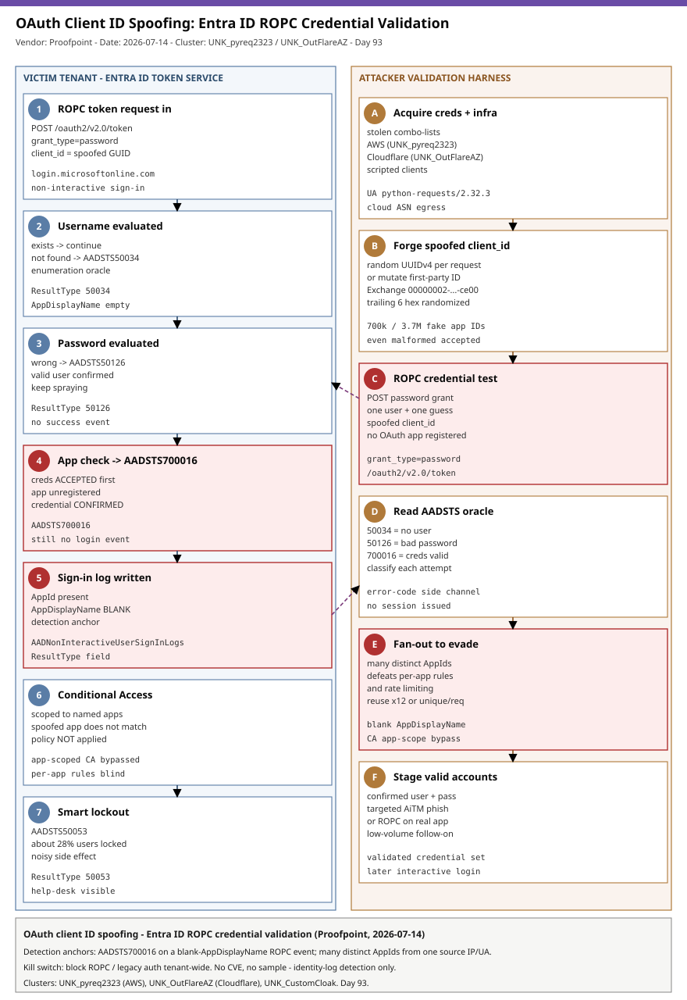

# OAuth Client ID Spoofing: Stealthy Entra ID Credential Validation via ROPC and the AADSTS Error Oracle

## TL;DR
Proofpoint disclosed on 2026-07-14 a novel evasion technique it calls **OAuth client ID spoofing**: attackers POST username/password pairs to Microsoft's Entra ID token endpoint using the Resource Owner Password Credentials (ROPC) flow while supplying a **fake `client_id`** — a syntactically valid GUID that does not map to any registered application. Entra returns a different **AADSTS error code** depending on whether the username exists, whether the password is correct, and whether the app is registered, so an unauthenticated requester can validate a stolen credential list and enumerate accounts **without ever generating a successful sign-in event**. Because a spoofed `client_id` leaves the `AppDisplayName` field blank in the sign-in logs, per-application detections and Conditional Access policies scoped to specific apps miss the activity entirely. Proofpoint tracked two large independent campaigns that adopted the technique at the end of December 2025 — **UNK_pyreq2323** (Jan–Mar 2026, ~700,000 spoofed IDs from AWS, >1M accounts across ~4,000 tenants, ~28% collateral lockouts) and **UNK_OutFlareAZ** (from Dec 2025, ~3.7M random UUIDv4 IDs from Cloudflare, >2M users) — evolving the earlier **UNK_CustomCloak** User-Agent-spoofing tradecraft. This is a Wednesday identity-and-fraud (#5 Cloud/Identity) case: no CVE, no malware sample, a pure identity-telemetry detection problem.

## Attribution and confidence
Primary reporting: **Proofpoint Threat Insight** (Rachel Rabin; response from Yaniv Miron), blog published 2026-07-14, corroborated by Help Net Security (2026-07-13), Infosecurity Magazine, SC Media and The Hacker News. Proofpoint clusters the activity under provisional `UNK_` handles because the actors are defined only by shared tradecraft and infrastructure, not by a named group.

- **Confidence: high** on the technique mechanics and telemetry effect (reproduced against Entra's documented ROPC behaviour and AADSTS reference codes). **Low** on operator attribution — the `UNK_` clusters are provisional and the campaigns are financially/access motivated with no nation-state or crimeware-brand linkage asserted.
- Never treat this as "just password spraying": the differentiator is the **evasion + oracle** combination — the spoofed application identity blinds per-app detections while the error response leaks credential validity.

| Cluster | Distinguishing tradecraft | Infrastructure | Confidence |
|---|---|---|---|
| UNK_CustomCloak | Spoofed User-Agent + abuse of the legacy first-party app "Windows Live Custom Domains" to bypass sign-in restrictions | >4,000 tenants probed | medium |
| UNK_pyreq2323 | Mutates the trailing six hex digits of a known first-party app ID; reuses each spoofed ID across up to 12 users; UA `python-requests/2.32.3` | AWS | high |
| UNK_OutFlareAZ | Fully random UUIDv4 `client_id` unique per request; alphabetical username enumeration | Cloudflare | high |

Genealogy with previous repo cases: this is the identity-recon/credential-validation counterpart to the repo's phishing-kit cases. Day 79 (2026-07-15, O-UNC-066 Pink) abused the passkey-enrollment ceremony for persistence; the PhaaS cases (Kali365, ARToken) steal live sessions via AiTM. Client ID spoofing sits **earlier in the chain** — it is how an actor cheaply confirms which stolen credentials are worth a phishing or ROPC follow-up, and it deliberately defeats the very `SigninLogs`/`AppDisplayName` telemetry those later stages rely on.

## Kill chain — summary table
| Stage | MITRE | Detail |
|---|---|---|
| Acquire credential list + cloud infra | T1586 / T1583.003 | Stolen combo-lists; AWS (UNK_pyreq2323) and Cloudflare (UNK_OutFlareAZ) egress |
| Forge spoofed `client_id` | T1036 | Random UUIDv4, or a known first-party app ID with mutated trailing digits |
| Enumerate valid usernames | T1087.004 | ROPC POST per username; AADSTS50034 = no user, other code = user exists |
| Validate stolen passwords | T1110.004 / T1110.003 | AADSTS50126 = bad password; AADSTS700016 = correct creds, spoofed app |
| Evade per-app telemetry | T1036 | Spoofed app leaves `AppDisplayName` blank; CA scoped to apps does not fire |
| Stage validated accounts | T1078.004 | Confirmed username+password sets reserved for later access/phishing |



The diagram's left lane is the victim tenant's Entra ID token service and its sign-in telemetry; the right lane is the attacker's cloud-hosted validation harness. The critical detection anchors (marked in red) are the **AADSTS700016 response on a blank-`AppDisplayName` ROPC event** — a credential confirmed with no successful login — and the **fan-out of many distinct `AppId` values from one source IP/UA**.

## Stage-by-stage detail

### Forging the spoofed client_id (T1036)
The client ID is the GUID an application passes as `client_id` in an OAuth request. Entra does not require the value to correspond to a real registered app before it begins evaluating the credential. Two forgery styles were observed:

```text
# UNK_pyreq2323 - mutate the trailing digits of a well-known first-party app ID
# Base: Office 365 Exchange Online = 00000002-0000-0ff1-ce00-000000000000
# Spoofed variants randomize the final six hex digits, e.g. 00000002-0000-0ff1-ce00-0000af3b91c2

# UNK_OutFlareAZ - fully random UUIDv4, a new one for every single request
client_id = 7d9f4c1a-6b02-4e88-9a3d-1f5c0e2b7a44   # example shape only
```

Proofpoint notes that even a **malformed** (non-UUIDv4) client ID is not rejected outright, so the error response can still be analysed.

### Enumerating usernames and validating passwords via ROPC (T1087.004, T1110.004)
The request is an HTTP POST to the token endpoint using the ROPC grant, submitting the credential directly:

```http
POST /<tenant>/oauth2/v2.0/token HTTP/1.1
Host: login.microsoftonline.com
Content-Type: application/x-www-form-urlencoded
User-Agent: python-requests/2.32.3

grant_type=password&username=<user>@<tenant>&password=<guess>
&client_id=<spoofed-guid>&scope=https://graph.microsoft.com/.default
```

The AADSTS code in the JSON error body is the oracle:

| AADSTS code | Meaning | What the attacker learns |
|---|---|---|
| AADSTS50034 | User account does not exist in the tenant | Username invalid - drop it |
| AADSTS50126 | Valid username, invalid password | Username valid - keep spraying |
| AADSTS700016 | Application not found in tenant | **Username + password are correct** (creds accepted, only the app is unrecognised) |
| AADSTS50053 | Account locked (smart lockout) | Collateral - ~28% of UNK_pyreq2323 targets |

The prize is **AADSTS700016**: it is only reached once Entra has accepted the credential, so it confirms a working username+password pair while the sign-in logs record **no successful login**.

### Evading per-application telemetry (T1036)
```text
When client_id does not resolve to a registered app, the Entra sign-in event records
the raw AppId GUID but leaves AppDisplayName EMPTY. Detections and Conditional Access
policies scoped to named applications (e.g. "surge against Office 365 Exchange Online")
never match. Fragmenting attempts across thousands of fictional AppIds also defeats
per-application rate limiting and correlation.
```

### Staging validated accounts (T1078.004)
Confirmed username+password pairs are set aside for a later, lower-volume phase — interactive sign-in, an AiTM phishing lure targeted only at accounts known to be live, or a ROPC token grab against a *real* first-party app that permits it. The spoofing phase is reconnaissance that keeps the noisy credential-testing off the defender's per-app dashboards.

## Detection strategy

### Telemetry that matters
The whole case lives in identity logs, not endpoint telemetry. In Microsoft Sentinel: `SigninLogs` and especially `AADNonInteractiveUserSignInLogs` (ROPC is non-interactive). In Defender XDR: `IdentityLogonEvents` and `CloudAppEvents`. The high-value fields are `AppId` / `AppDisplayName` (blank display name with a present AppId), `ResultType` (the numeric AADSTS code: 50034, 50126, 700016, 50053), `AuthenticationProtocol` / `ClientAppUsed` (ROPC / "Other clients"), `IPAddress`, `AutonomousSystemNumber`, and `UserAgent`. Enable and retain non-interactive sign-in logs — many tenants ingest only interactive `SigninLogs` and are blind to ROPC by default.

### Detection coverage
| Engine | File | Logic |
|---|---|---|
| Sigma | sigma/01_entra_ropc_spoofed_clientid_cred_confirmed.yml | Non-interactive ROPC event with blank `AppDisplayName` + ResultType 700016 (credential confirmed, no success) |
| Sigma | sigma/02_entra_clientid_spoofing_enumeration_fanout.yml | ROPC failures (50034/50126) with empty `AppDisplayName` across many distinct AppIds (threshold in SIEM) |
| Sigma | sigma/03_entra_ropc_python_requests_ua.yml | ROPC / non-interactive auth carrying the `python-requests/2.32.3` User-Agent from cloud ASN |
| KQL | kql/entra_ropc_blank_app_cred_confirmed.kql | AADNonInteractiveUserSignInLogs 700016 + empty AppDisplayName |
| KQL | kql/entra_clientid_spoof_fanout_enumeration.kql | Distinct-AppId fan-out per source IP with 50034/50126 |
| KQL | kql/entra_ropc_useragent_asn_spray.kql | python-requests UA + ROPC from AWS/Cloudflare ASN across many users |
| YARA | yara/clientid_spoofing_logs_and_tooling.yar | Exported sign-in JSON with the spoofing signature; ROPC credential-checker tooling |
| Suricata | suricata/entra_clientid_spoofing_ropc.rules | TLS-inspected egress: ROPC form body, python-requests UA, token-endpoint SNI (6 sids) |

No SPL is shipped (retired repo-wide). Convert any Sigma to Splunk with `sigma convert -t splunk -p sysmon <rule>.yml` if required.

### Threat hunting hypotheses
- **H1 — Credential confirmed without a login.** Hunt `AADNonInteractiveUserSignInLogs` for `ResultType == 700016` where `AppDisplayName` is empty; each hit is a candidate confirmed credential. See [hunts/peak_h1_credential_confirmed_no_login.md](./hunts/peak_h1_credential_confirmed_no_login.md).
- **H2 — Spoofed-app fan-out.** Hunt for a single source IP/UA producing many **distinct** `AppId` values with blank display names in a short window. See [hunts/peak_h2_spoofed_appid_fanout.md](./hunts/peak_h2_spoofed_appid_fanout.md).
- **H3 — ROPC from cloud provider ASN.** Baseline legitimate ROPC (should be near-zero in modern tenants) and surface ROPC from AWS/Cloudflare ASNs or the `python-requests` UA. See [hunts/peak_h3_ropc_from_cloud_asn.md](./hunts/peak_h3_ropc_from_cloud_asn.md).

## Incident response playbook

### First 60 minutes (triage)
1. Confirm non-interactive sign-in logging is enabled and query `AADNonInteractiveUserSignInLogs` for `ResultType in (50034, 50126, 700016, 50053)` with empty `AppDisplayName` over the last 30 days.
2. Extract the set of accounts that returned **700016** (or any success) — treat every one as a **confirmed-compromised credential** pending reset.
3. Identify the source IPs / ASNs / User-Agents and the AppId fan-out pattern to scope the campaign.
4. Check `AADSTS50053` volume to size collateral lockout impact on legitimate users.
5. Look for **follow-on interactive sign-ins** from the same accounts/ASNs — that is where actual access begins.

### Artifacts to collect
| Artifact | Path | Tool | Why |
|---|---|---|---|
| Non-interactive sign-in logs | Entra > Monitoring > Sign-in logs (Non-interactive) | Graph API / Log Analytics export | Primary record of the ROPC probing |
| Audit logs | Entra > Monitoring > Audit logs | Graph API | Any auth-method or app-consent changes on confirmed accounts |
| Conditional Access evaluation | SigninLogs `ConditionalAccessStatus` | Sentinel | Verify whether CA fired for spoofed-app events (expected: not applied) |
| Risky users / detections | Entra ID Protection | Graph API | Cross-reference confirmed accounts with risk detections |

### IR queries and commands
```powershell
# Enumerate confirmed-credential accounts (700016 on blank-app ROPC) via Graph
Connect-MgGraph -Scopes "AuditLog.Read.All"
Get-MgAuditLogSignIn -Filter "signInEventTypes/any(t: t eq 'nonInteractiveUser')" -All |
  Where-Object { $_.Status.ErrorCode -eq 700016 -and [string]::IsNullOrEmpty($_.AppDisplayName) } |
  Select-Object CreatedDateTime, UserPrincipalName, AppId, IPAddress |
  Sort-Object CreatedDateTime
```
```bash
# Force-revoke sessions and require password reset for a confirmed account (Graph CLI)
az rest --method POST \
  --url "https://graph.microsoft.com/v1.0/users/<upn>/revokeSignInSessions"
```

### Containment, eradication, recovery
Reset passwords for every confirmed (700016/success) account and revoke refresh tokens; enforce phishing-resistant MFA. **Block the ROPC grant** where it is not required (Conditional Access "Other clients"/legacy auth block, or the ROPC-specific control) — ROPC has near-zero legitimate use in modern tenants and removing it collapses this technique. Do **not** rely on Conditional Access policies scoped to individual application IDs to stop it: spoofed apps never match them. Do **not** assume "no successful sign-in" means "no compromise" — 700016 is the tell. Watch for smart-lockout storms as a secondary denial-of-service side effect.

### Recovery validation
Confirm ROPC/legacy auth is blocked tenant-wide and re-run the H1 hunt to verify zero new 700016-on-blank-app events; confirm all previously-confirmed accounts have reset credentials and revoked sessions with no subsequent interactive sign-in from the actor ASNs.

## IOCs
Behavioral and configuration indicators (no live C2; this is a telemetry/technique case). Full list in [iocs.csv](./iocs.csv).

| Type | Value | Context | Confidence | Source |
|---|---|---|---|---|
| string | python-requests/2.32.3 | UNK_pyreq2323 User-Agent for ROPC probing from AWS | high | Proofpoint 2026-07-14 |
| string | 00000002-0000-0ff1-ce00-000000000000 | Office 365 Exchange Online first-party app ID; spoofed variants mutate the trailing six hex digits | high | Proofpoint 2026-07-14 |
| note | AADSTS700016 | Returned when correct creds meet an unregistered/spoofed app - confirms a working credential with no successful sign-in | high | Proofpoint 2026-07-14 |
| note | AADSTS50034 / 50126 | User-does-not-exist / valid-user-bad-password - the enumeration oracle | high | Microsoft AADSTS reference |
| note | ROPC grant_type=password | POST to login.microsoftonline.com token endpoint with spoofed client_id | high | Proofpoint 2026-07-14 |
| string | Cloudflare egress (UNK_OutFlareAZ) | 3.7M random UUIDv4 client_ids, unique per request, alphabetical enumeration | medium | Proofpoint 2026-07-14 |

No CVE is associated with this technique — it abuses documented Entra ID behaviour (ROPC + AADSTS responses), so nothing appears on the CISA KEV catalog; absence from KEV is expected and is not evidence of low risk.

## Secondary findings
- **UNK_CustomCloak precursor.** Before the client-ID-spoofing evolution, the same tradecraft family bypassed sign-in restrictions by spoofing the User-Agent and abusing the discontinued first-party app **"Windows Live Custom Domains"**, probing passwords across 4,000+ tenants — a reminder that legacy/first-party app IDs are a standing evasion surface.
- **Collateral account lockouts.** UNK_pyreq2323's volume tripped smart lockout on roughly **28%** of the users it touched, so this stealthy technique still produces a noisy, help-desk-visible side effect — lockout storms with no matching app name are themselves a hunting signal.
- **Provider-agnostic risk.** Proofpoint notes the flaw is specific to Microsoft's implementation but assesses other identity providers are "possibly exposed" to analogous error-oracle behaviour; the durable lesson (uniform error responses, log the app identity) generalises.

## Pedagogical anchors
- **Error codes are an oracle.** Any authentication surface that returns *distinguishable* responses for "no user", "bad password" and "good password" leaks credential validity even when it never grants a session. Uniform, timing-safe error responses are a real control, not cosmetics.
- **Absence of success is not absence of compromise.** The whole technique is built to avoid a "successful sign-in" event; hunting only for successful logins or per-app surges is structurally blind to it. Hunt on the error/enumeration side too.
- **Identity of the *caller* matters as much as the *user*.** A blank `AppDisplayName` with a live `AppId` is an anomaly in its own right; app-scoped Conditional Access is bypassable by an actor who simply invents an app.
- **Kill the legacy grant.** ROPC exists for backward compatibility and has almost no legitimate modern use; blocking it removes an entire class of credential-validation and spray tradecraft in one control.

## What's in this folder
| File | Purpose | Link |
|---|---|---|
| README.md | This analysis. | [README.md](./README.md) |
| kill_chain.svg | Two-lane kill-chain diagram (victim tenant vs attacker validation harness). | [kill_chain.svg](./kill_chain.svg) |
| sigma/01_entra_ropc_spoofed_clientid_cred_confirmed.yml | Confirmed credential (700016 + blank app) on ROPC. | [file](./sigma/01_entra_ropc_spoofed_clientid_cred_confirmed.yml) |
| sigma/02_entra_clientid_spoofing_enumeration_fanout.yml | Spoofed-app enumeration fan-out. | [file](./sigma/02_entra_clientid_spoofing_enumeration_fanout.yml) |
| sigma/03_entra_ropc_python_requests_ua.yml | python-requests UA ROPC probing. | [file](./sigma/03_entra_ropc_python_requests_ua.yml) |
| kql/entra_ropc_blank_app_cred_confirmed.kql | 700016 + empty AppDisplayName (Sentinel). | [file](./kql/entra_ropc_blank_app_cred_confirmed.kql) |
| kql/entra_clientid_spoof_fanout_enumeration.kql | Distinct-AppId fan-out per source. | [file](./kql/entra_clientid_spoof_fanout_enumeration.kql) |
| kql/entra_ropc_useragent_asn_spray.kql | UA + ROPC + cloud ASN spray. | [file](./kql/entra_ropc_useragent_asn_spray.kql) |
| yara/clientid_spoofing_logs_and_tooling.yar | Log-export signature + ROPC checker tooling. | [file](./yara/clientid_spoofing_logs_and_tooling.yar) |
| suricata/entra_clientid_spoofing_ropc.rules | TLS-inspected ROPC egress (6 sids). | [file](./suricata/entra_clientid_spoofing_ropc.rules) |
| hunts/peak_h1_credential_confirmed_no_login.md | PEAK hunt: 700016 on blank app. | [file](./hunts/peak_h1_credential_confirmed_no_login.md) |
| hunts/peak_h2_spoofed_appid_fanout.md | PEAK hunt: AppId fan-out. | [file](./hunts/peak_h2_spoofed_appid_fanout.md) |
| hunts/peak_h3_ropc_from_cloud_asn.md | PEAK hunt: ROPC from cloud ASN. | [file](./hunts/peak_h3_ropc_from_cloud_asn.md) |
| iocs.csv | Behavioral/config indicators. | [iocs.csv](./iocs.csv) |

## Sources
- [OAuth Client ID Spoofing: Why Fake Client IDs Are Gaining Traction for Stealthy Enumeration — Proofpoint](https://www.proofpoint.com/us/blog/threat-insight/oauth-client-id-spoofing-why-fake-client-ids-are-gaining-traction-stealthy)
- [OAuth Client ID Spoofing Lets Attackers Validate Stolen Microsoft Entra Credentials — The Hacker News (2026-07-14)](https://thehackernews.com/2026/07/oauth-client-id-spoofing-lets-attackers.html)
- [Fake OAuth client IDs are helping attackers slip past sign-in logs — Help Net Security (2026-07-13)](https://www.helpnetsecurity.com/2026/07/13/entra-id-oauth-client-id-spoofing/)
- [Novel OAuth Client ID Spoofing Technique Targets Cloud Environments — Infosecurity Magazine](https://www.infosecurity-magazine.com/news/novel-spoofing-technique-targets/)
- [Attackers spoofing OAuth client IDs to cloak Entra compromise attempts — Biometric Update](https://www.biometricupdate.com/202607/attackers-spoofing-oauth-client-ids-to-cloak-entra-compromise-attempts-proofpoint)
- [Microsoft Entra authentication and authorization error codes (AADSTS reference)](https://learn.microsoft.com/en-us/entra/identity-platform/reference-error-codes)
- [Microsoft identity platform and OAuth 2.0 Resource Owner Password Credentials (ROPC)](https://learn.microsoft.com/en-us/entra/identity-platform/v2-oauth-ropc)
