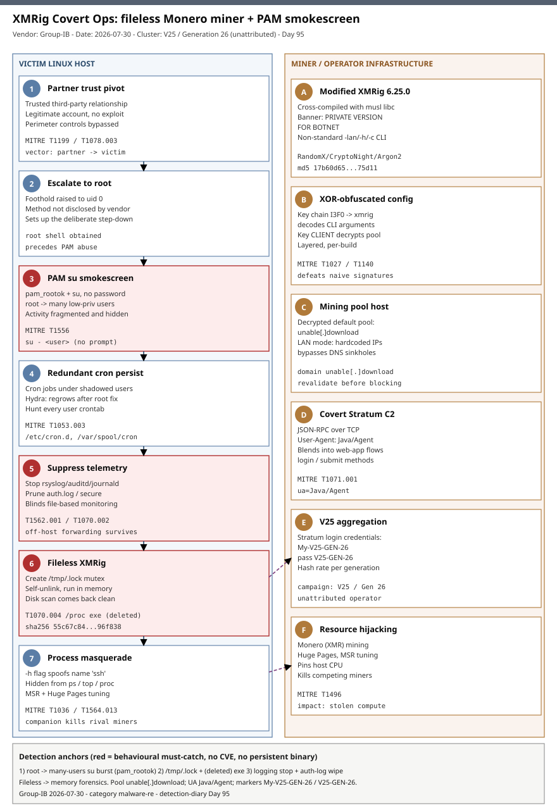

# XMRig Covert Ops: fileless Monero miner abusing Linux PAM (pam_rootok) for a forensic smokescreen

## TL;DR

Group-IB published on 2026-07-30 the analysis of a covert Monero cryptomining campaign (identified in May 2026) that trades loud root activity for a quieter, harder-to-trace posture: after escalating to root it abuses the `pam_rootok` PAM policy with `su` to hop password-less into multiple low-privileged accounts, scattering redundant cron persistence under identities nobody monitors. The payload is a heavily modified **XMRig 6.25.0** cross-compiled with musl libc, internally branded `PRIVATE VERSION FOR BOTNET`, that creates a `/tmp/.lock` mutex, then **self-unlinks and runs entirely in memory** so disk scans come back clean. Initial access was a **trusted third-party relationship** — a partner account walking straight through perimeter controls — and the operators stopped logging services and pruned auth logs to blind file-based monitoring. It matters today because there is no CVE and no persistent binary to block: detection has to move to PAM/log integrity, rapid root-to-user transitions, the transient `/tmp/.lock` artifact, and memory forensics. Campaign markers (`My-V25-GEN-26`) tie it to a broader V25 (Generation 26) botnet lineage.

## Attribution and confidence

Group-IB tracks the activity as part of the **V25 / Generation 26** XMRig botnet family, keyed off the hardcoded Stratum login `My-V25-GEN-26` / password `V25-GEN-26` that the operator uses to aggregate hash rate per generation across thousands of hosts. No named threat actor, geography, or e-crime brand is asserted — attribution to a specific group is **low**; the *clustering* into a single botnet lineage is **medium-to-high** (deterministic hardcoded generation markers plus a consistent custom XMRig fork). This is a financially motivated cryptojacking operation, not espionage or ransomware.

| Overlap axis | Observation | Confidence |
|---|---|---|
| Botnet lineage | `My-V25-GEN-26` login + `V25-GEN-26` password embedded in the XOR-encrypted config | high |
| Tooling | Custom XMRig 6.25.0 fork (musl, `PRIVATE VERSION FOR BOTNET` banner, non-standard `-lan`/`-h`/`-c` CLI) | high |
| Named actor | None asserted by Group-IB | low |

**Genealogy with previous repo cases.** This is the repo's first dedicated **fileless cryptomining / cryptojacking** deep-dive and its first case centred on **PAM (`pam_rootok`) identity-smokescreen** abuse. It is distinct from the repo's other Linux deep-dives: Day 46 `LinkPro-eBPF-Rootkit-MagicPacket-EKS` (2026-06-12) hides via an eBPF kernel rootkit and a magic-packet trigger rather than PAM/account fragmentation; Day 88 `RefluXFS-XFS-Reflink-ODirect-Race` (2026-07-24) is an XFS kernel race for local privilege escalation, not a resource-hijack payload. XMRig has only ever appeared in the repo as an *incidental* post-compromise payload inside the Day (2026-05-16) `Cisco-SDWAN-vHub-AuthBypass-UAT8616` cluster set (Talos clusters 7 and 9) — never as the primary subject with its own RE and detection surface.

## Kill chain — summary table

| Stage | MITRE | Detail |
|---|---|---|
| Initial access via partner | T1199 Trusted Relationship | Pivot from a compromised third-party into the victim using a legitimate account, bypassing perimeter controls. |
| Use of valid account | T1078.003 Valid Accounts: Local Accounts | Operate under legitimate local identities to blend with normal activity. |
| Escalate to root | (unspecified in report) | Foothold escalated to root before the actor deliberately steps back down. |
| PAM identity smokescreen | T1556 Modify Authentication Process | Abuse `pam_rootok` + `su` for password-less root-to-user switching across many accounts. |
| Redundant persistence | T1053.003 Scheduled Task/Job: Cron | Cron jobs planted under multiple low-privileged, unmonitored accounts (hydra persistence). |
| Impair defenses | T1562.001 Disable or Modify Tools | Stop core logging services to blind file-based monitoring. |
| Log tampering | T1070.002 Clear Linux or Mac System Logs | Prune/remove authentication logs to erase the privilege-escalation trail. |
| Hide artifacts | T1564.013 Hide Artifacts (Group-IB mapping) | Conceal process/filesystem artifacts from `ps`, `top`, `/proc`. |
| Process masquerade | T1036 Masquerading | `-h` flag spoofs a legitimate name such as `ssh` in process listings. |
| Config obfuscation | T1027 / T1140 | Layered XOR keys (`I3F0`->`xmrig`, `CLIENT`) hide argument strings and pool identifiers. |
| Self-deletion | T1070.004 Indicator Removal: File Deletion | Binary unlinks itself after taking `/tmp/.lock`, then runs in memory. |
| Recon | T1082 System Information Discovery | Read CPU topology / MSRs; allocate Huge Pages to maximize hash rate. |
| Covert C2 traffic | T1071.001 Application Layer Protocol: Web Protocols | JSON-RPC Stratum disguised behind a `Java/Agent` User-Agent. |
| Resource hijacking | T1496 Resource Hijacking | Monero mining; companion bash script kills competing miners. |



The diagram runs the victim host down the left lane (partner pivot -> root -> PAM identity fan-out -> cron persistence -> log/telemetry suppression) and the miner/operator infrastructure down the right lane (fileless XMRig, XOR-decrypted config, Stratum-over-`Java/Agent`, V25 aggregation). The critical (red) anchors are the `pam_rootok`+`su` identity switch, the `/tmp/.lock`-then-self-unlink sequence, and the log-suppression step — the three places where behavioural detection beats any static IOC.

## Stage-by-stage detail

### 1. Initial access through a trusted third party (T1199, T1078.003)

Group-IB reports the intrusion began by exploiting a **trusted third-party relationship**: the actor pivoted from a partner environment into the victim's network using a **legitimate user account**, which effectively bypassed perimeter controls. There is no exploit or CVE at the door — the trust boundary between organizations was the vulnerability. Once inside, activity looks like a normal local account until the escalation.

### 2. Escalation to root, then a deliberate step down (T1556)

After reaching root, the operators do **not** stay overtly root — that would light up SOC alerting. Instead they abuse the `pam_rootok` PAM policy in combination with `su` to switch **without a password** from root into a set of low-privileged accounts:

```text
# pam_rootok makes pam_unix skip authentication when the caller is already uid 0.
# With root effective uid, `su - <user>` then succeeds with no password prompt.
root# su - webuser        # no password requested
root# su - backupsvc      # activity now attributed to backupsvc, not root
```

`pam_rootok.so` is a legitimate module (it is what lets root run `su` to any account for administration). The tradecraft here is *policy abuse*: using a normal capability to **fragment** malicious activity across many identities so that a responder who cleans the root compromise still leaves implanted accounts behind.

### 3. Redundant cron persistence under shadowed accounts (T1053.003)

Persistence is planted as **cron jobs under multiple standard accounts** rather than a single obvious root entry. Because the accounts are ones nobody was monitoring, remediating root alone leaves the botnet able to regenerate — Group-IB's "hydra-like" model. Hunt every user crontab, not just root's:

```bash
# Enumerate per-user crontabs and system cron drop-ins across all identities
for u in $(cut -f1 -d: /etc/passwd); do
  echo "== $u =="; crontab -l -u "$u" 2>/dev/null
done
ls -la /etc/cron.d/ /etc/cron.*/ /var/spool/cron/ /var/spool/cron/crontabs/ 2>/dev/null
```

### 4. Telemetry suppression and log tampering (T1562.001, T1070.002)

The operators **stop core logging services** and **prune or remove authentication logs**, leaving minimal on-disk trace of both the privilege escalation and the PAM manipulation. Any detection that depends purely on reading `/var/log/auth.log` or `secure` after the fact is blinded — which is exactly why real-time forwarding to a tamper-proof external collector is the control that survives this stage.

### 5. The fileless XMRig payload (T1564.013, T1036, T1070.004)

The miner is a modified **XMRig 6.25.0**, cross-compiled with **musl libc** and internally branded `PRIVATE VERSION FOR BOTNET`. Its startup sequence is built for stealth:

```text
1. Create mutex file /tmp/.lock          # single-instance guard (avoid host instability -> admin notice)
2. Self-unlink own executable            # delete binary from disk, keep running in memory (fileless)
3. Read CPU topology + MSRs, alloc Huge Pages   # maximize hash rate
4. Launch companion bash script          # terminate competing miners to monopolize CPU
```

Its command-line interface diverges from stock XMRig with custom flags: `-lan` (LAN pool mining via hardcoded IPs to bypass DNS sinkholes), `-h` (process **masquerading**, e.g. spoofing `ssh` in `ps`), and `-c` (control cron auto-install). Because the on-disk artifact is gone after step 2, `/tmp/.lock` and RAM are where the evidence lives.

### 6. Obfuscated configuration and covert C2 (T1027, T1140, T1071.001)

Configuration strings are hidden under **layered XOR encryption**. Group-IB recovered the key chain `I3F0` -> `xmrig` (decodes argument strings) and a secondary `CLIENT` key (decrypts mining-pool identifiers and defaults). Decrypted defaults expose the pool host `unable[.]download` and the campaign markers baked into the Stratum credentials (`My-V25-GEN-26` / `V25-GEN-26`). At the network layer the miner's JSON-RPC Stratum traffic wears a **`Java/Agent`** User-Agent to blend into ordinary web-application flows and defeat naive signature matching. The miner supports RandomX, CryptoNight variants and Argon2 profiles, so operators can pivot coins/hardware without redeploying.

## RE notes

| Component | SHA256 | Lang | Packer | Notes |
|---|---|---|---|---|
| Modified XMRig 6.25.0 | 55c67c844258807c4335f40262777a5307bcf5b537c0492cf869b3328796f838 | C/C++ (musl) | None reported (self-unlinks) | Banner `PRIVATE VERSION FOR BOTNET`; custom `-lan`/`-h`/`-c` CLI; XOR-obfuscated config |

Anti-analysis and cipher detail: the sample relies on **operational** anti-forensics rather than a packer — a `/tmp/.lock` mutex followed by immediate **self-unlink** to run memory-resident, so a disk-first triage recovers nothing. Configuration and pool data are protected by **layered XOR**: the `I3F0`->`xmrig` chain decodes CLI/argument strings and the `CLIENT` key decrypts the pool host (`unable[.]download`) and the `My-V25-GEN-26` generation marker. Because the binary is memory-resident, the practical recovery path is RAM acquisition (e.g. `/proc/<pid>/maps` + `/proc/<pid>/mem` carving, or a full memory image) followed by string/XOR carving for the pool host, generation marker, and Stratum credentials. SHA1 `88520bcfc741610591a23592f9d4ecb31e34deb5`, MD5 `17b60d650fc5d1718d7f2ac3a6075d11`.

## Detection strategy

### Telemetry that matters

- **Linux auditd**: `execve` of `su`/`pkexec`; `openat`/`unlink` on `/tmp/.lock`; writes under `/etc/pam.d/`, `/etc/security/`, and `/lib*/security/pam_*.so` (PAM integrity); cron file writes under `/etc/cron.d`, `/var/spool/cron/*`.
- **Process/EDR telemetry**: rapid **root -> low-privileged** `su` transitions, especially a burst hopping across several accounts; a process whose on-disk backing file is deleted while it keeps running (`/proc/<pid>/exe` -> `(deleted)`); `ps`/`comm` name (`ssh`) not matching the executable path.
- **Service/telemetry control**: `systemctl stop`/`mask` or `kill` of `rsyslog`/`syslog-ng`/`auditd`/`systemd-journald`; truncation or deletion of `/var/log/auth.log` and `/var/log/secure`.
- **Network**: outbound Stratum/JSON-RPC carrying a `Java/Agent` User-Agent; connections to `unable[.]download`; long-lived TCP to LAN or external mining pools from a non-interactive service account.

### Detection coverage

| Engine | File | Logic |
|---|---|---|
| Sigma | sigma/pam_rootok_passwordless_su_root_to_user.yml | `su` execve where parent/effective uid is root and target is a non-root local user, in bursts (threshold pushed to SIEM). |
| Sigma | sigma/linux_logging_service_tamper.yml | Stop/mask/kill of `rsyslog`/`syslog-ng`/`auditd`/`journald`, or truncation of auth logs. |
| Sigma | sigma/proc_running_deleted_executable_tmp_lock.yml | Process running from a `(deleted)` executable and/or creation of `/tmp/.lock` mutex. |
| KQL | kql/defender_su_root_to_user_burst.kql | DeviceProcessEvents: root-initiated `su` to multiple distinct local users in a short window. |
| KQL | kql/defender_logging_service_stop_and_authlog_wipe.kql | DeviceProcessEvents/DeviceFileEvents: logging-daemon stop + auth-log deletion/truncation. |
| KQL | kql/defender_deleted_binary_and_mining_ua.kql | Fileless process + `Java/Agent` UA egress / `unable.download` from a non-browser process. |
| YARA | yara/xmrig_v25_private_botnet.yar | Banner/marker strings (`PRIVATE VERSION FOR BOTNET`, `My-V25-GEN-26`, `unable.download`, XOR keys) bound by filesize. |
| Suricata | suricata/xmrig_v25_covert_mining.rules | `Java/Agent` UA on Stratum-like flows; DNS/TLS for `unable[.]download`; JSON-RPC `login`/`submit` method markers. |

### Threat hunting hypotheses

- **H1 (PAM identity smokescreen)** — *If* the actor abuses `pam_rootok`+`su`, *then* auditd/EDR shows a root process spawning `su` to several distinct non-root local users within minutes, with no preceding failed-auth events. Pivot: correlate `su` bursts with subsequent cron writes under those same users. See `hunts/peak_h1_pam_rootok_su_burst.md`.
- **H2 (fileless mutex + self-unlink)** — *If* the miner runs memory-resident, *then* a live host shows a process with `/proc/<pid>/exe` pointing at a `(deleted)` path while `/tmp/.lock` exists, and CPU is pinned with Huge Pages allocated. See `hunts/peak_h2_deleted_exe_tmp_lock.md`.
- **H3 (covert mining egress)** — *If* Stratum traffic is disguised as web-app flows, *then* a `Java/Agent` User-Agent appears on long-lived TCP from a service account, or DNS resolves `unable[.]download`, without any corresponding browser/JVM app footprint. See `hunts/peak_h3_java_agent_stratum_egress.md`.

## Incident response playbook

### First 60 minutes (triage)

1. **Do not reboot** an affected host — the miner is memory-resident and self-unlinked; a reboot destroys the primary evidence. Capture volatile state first.
2. Snapshot process/network state: `ps -ef`, `ls -l /proc/*/exe 2>/dev/null | grep deleted`, `ss -tnp`, and note any process pinned near 100% CPU.
3. Check for the mutex: `test -e /tmp/.lock && stat /tmp/.lock`.
4. Enumerate **all** user crontabs and `/etc/cron.d` (not just root) for regeneration jobs.
5. Verify PAM/logging integrity: hash `/etc/pam.d/*`, `/lib*/security/pam_*.so`; confirm `rsyslog`/`auditd`/`journald` are running and that `auth.log`/`secure` are not truncated.
6. Preserve whatever logs remain by copying them off-host immediately (they may already be pruned).

### Artifacts to collect

| Artifact | Path | Tool | Why |
|---|---|---|---|
| Memory image / process memory | `/proc/<pid>/mem`, full RAM | AVML, LiME, `/proc` dump | Only place the fileless miner + XOR config survive |
| Mutex file | `/tmp/.lock` | `stat`, `cp` | Transient proof of the miner's single-instance guard |
| Per-user crontabs | `/var/spool/cron/*`, `/etc/cron.d/*` | `crontab -l -u`, `cat` | Redundant persistence under shadowed accounts |
| PAM config + modules | `/etc/pam.d/*`, `/lib*/security/pam_*.so` | `sha256sum`, `debsums`/`rpm -V` | Detect PAM policy/module tampering |
| Auth + system logs | `/var/log/auth.log`, `/var/log/secure`, journald | `cp`, `journalctl` | Reconstruct (or prove tampering of) the escalation chain |
| Network captures | egress to pools | `tcpdump`, NetFlow | Stratum-over-`Java/Agent`, `unable[.]download` |

### IR queries and commands

```bash
# Processes running from a deleted on-disk backing file (fileless indicator)
ls -l /proc/*/exe 2>/dev/null | grep -F '(deleted)'

# Root-to-user su transitions in the last day (if auth log survives)
grep -E "session opened for user .* by \(uid=0\)" /var/log/auth.log* 2>/dev/null

# Cross-account cron sweep
for u in $(cut -f1 -d: /etc/passwd); do crontab -l -u "$u" 2>/dev/null | sed "s/^/$u: /"; done

# Integrity check of PAM modules against the package database
rpm -Va 'pam*' 2>/dev/null; debsums -c 2>/dev/null | grep -i pam
```

```kql
// Defender: root-initiated su to multiple distinct local users in 10 minutes
DeviceProcessEvents
| where FileName == "su" and InitiatingProcessAccountName == "root"
| summarize targets = dcount(ProcessCommandLine), users = make_set(ProcessCommandLine, 10)
    by DeviceId, bin(Timestamp, 10m)
| where targets >= 3
```

### Containment, eradication, recovery

- **Contain**: isolate the host at the network layer; revoke and rotate credentials/keys reachable from the compromised third-party trust path and any implanted account. Because persistence is spread across users, disable *every* account with an unexplained cron entry, not just root.
- **Eradicate**: remove all cron drop-ins under shadowed accounts; restore/validate PAM config and modules from known-good; re-enable and re-baseline logging daemons; kill the memory-resident miner (it will not respawn from disk once cron is cleared).
- **Exit criteria**: no process running from a `(deleted)` executable; `/tmp/.lock` absent on reboot; PAM module hashes match vendor; logging daemons running and forwarding; no residual `Java/Agent` mining egress for 72 h.
- **What NOT to do**: do not reboot before memory capture; do not treat a clean disk scan as clean (the binary is gone by design); do not scope remediation to root only — that is exactly the smokescreen the operators built.

### Recovery validation

Confirm hash-verified PAM modules, running-and-forwarding logging services, zero `(deleted)`-backed processes, and no re-creation of `/tmp/.lock` or per-user cron jobs over a monitoring window. Validate that the tamper-proof external log collector is receiving `auth`/`auditd` events in real time so a repeat of the log-pruning stage would be caught live.

## IOCs

| Type | Value | Context | Confidence | Source |
|---|---|---|---|---|
| sha256 | 55c67c844258807c4335f40262777a5307bcf5b537c0492cf869b3328796f838 | Modified XMRig 6.25.0 fileless miner (musl) | high | Group-IB 2026-07-30 |
| sha1 | 88520bcfc741610591a23592f9d4ecb31e34deb5 | Same sample | high | Group-IB 2026-07-30 |
| md5 | 17b60d650fc5d1718d7f2ac3a6075d11 | Same sample | high | Group-IB 2026-07-30 |
| domain | unable[.]download | Decrypted default mining-pool host | high | Group-IB 2026-07-30 |
| string | My-V25-GEN-26 / V25-GEN-26 | Stratum login/password; V25 generation markers | high | Group-IB 2026-07-30 |
| string | PRIVATE VERSION FOR BOTNET | Hardcoded XMRig fork banner | high | Group-IB 2026-07-30 |
| string | Java/Agent | User-Agent disguising Stratum as web traffic | high | Group-IB 2026-07-30 |
| path | /tmp/.lock | Single-instance mutex before self-unlink | high | Group-IB 2026-07-30 |

No CVE is in scope for this case: initial access was a trusted third-party relationship and the rest is native-feature abuse (PAM `pam_rootok`, `su`, cron), not a software vulnerability. Nothing here maps to CISA KEV, and `generate_kev_overlay.py` produces no `kev.md` for this day. Full indicator set (including XOR keys and CLI flags) in [iocs.csv](./iocs.csv).

## Secondary findings

- **Fileless is the new default for Linux miners.** The self-unlink + `/tmp/.lock` pattern means a disk scan returns clean while the miner keeps running; the durable evidence is a `(deleted)`-backed process and RAM. Any Linux triage that starts (and stops) on disk misses this whole class of implant.
- **PAM as a smokescreen, not just a backdoor.** Where PAM abuse usually means a malicious module stealing SSH credentials, here a *legitimate* module (`pam_rootok`) is weaponized purely to **fragment** activity across accounts so remediation of root leaves the botnet alive. The detection pivot is behavioural — root-to-many-users `su` bursts — not a tampered binary.
- **DNS blocking and static signatures are insufficient.** LAN pool mining via hardcoded IPs bypasses DNS sinkholes, per-build XOR obfuscation defeats naive string signatures, and a `Java/Agent` User-Agent hides Stratum in web noise. Continuous PAM/log integrity monitoring and memory forensics are the controls that generalize.

## Pedagogical anchors

- When an actor **downgrades** from root on purpose, treat the *quietness* as the signal: a burst of password-less root-to-user `su` transitions with no failed auths is a stronger indicator than any hash.
- Fileless does not mean invisible — it means you look in a different place. `/proc/<pid>/exe -> (deleted)`, a `/tmp/.lock` mutex, and Huge Pages + pinned CPU are all live-host tells the miner cannot erase from memory.
- Persistence spread across shadowed accounts turns remediation scope into a security control: hunt *every* user's crontab, or the "hydra" grows the head back.
- Real-time, tamper-proof off-host log forwarding is not a compliance checkbox here — it is the one control that survives an actor who stops your logging daemons and prunes `auth.log`.
- Absence from CISA KEV is not absence of risk: this campaign has no CVE at all, yet is actively mining on real victims. Behaviour-first detection covers the gap that a CVE/patch mindset leaves open.

## What's in this folder

| File | Purpose | Link |
|---|---|---|
| README.md | This analysis (15 sections). | [README.md](./README.md) |
| kill_chain.svg | Two-lane kill-chain diagram (victim host vs miner/operator infra). | [kill_chain.svg](./kill_chain.svg) |
| iocs.csv | Full indicator set: hashes, pool host, markers, XOR keys, CLI flags. | [iocs.csv](./iocs.csv) |
| sigma/pam_rootok_passwordless_su_root_to_user.yml | Sigma: root-to-user password-less `su` bursts (PAM smokescreen). | [file](./sigma/pam_rootok_passwordless_su_root_to_user.yml) |
| sigma/linux_logging_service_tamper.yml | Sigma: logging-daemon stop/mask/kill + auth-log truncation. | [file](./sigma/linux_logging_service_tamper.yml) |
| sigma/proc_running_deleted_executable_tmp_lock.yml | Sigma: process from `(deleted)` executable and/or `/tmp/.lock`. | [file](./sigma/proc_running_deleted_executable_tmp_lock.yml) |
| kql/defender_su_root_to_user_burst.kql | KQL: root-initiated `su` to multiple local users in a window. | [file](./kql/defender_su_root_to_user_burst.kql) |
| kql/defender_logging_service_stop_and_authlog_wipe.kql | KQL: logging stop + auth-log wipe correlation. | [file](./kql/defender_logging_service_stop_and_authlog_wipe.kql) |
| kql/defender_deleted_binary_and_mining_ua.kql | KQL: fileless process + `Java/Agent` mining egress. | [file](./kql/defender_deleted_binary_and_mining_ua.kql) |
| yara/xmrig_v25_private_botnet.yar | YARA: XMRig V25 fork banner/marker/pool/XOR-key strings. | [file](./yara/xmrig_v25_private_botnet.yar) |
| suricata/xmrig_v25_covert_mining.rules | Suricata: `Java/Agent` Stratum, `unable[.]download`, JSON-RPC markers. | [file](./suricata/xmrig_v25_covert_mining.rules) |
| hunts/peak_h1_pam_rootok_su_burst.md | PEAK hunt H1: PAM `pam_rootok` `su` burst. | [file](./hunts/peak_h1_pam_rootok_su_burst.md) |
| hunts/peak_h2_deleted_exe_tmp_lock.md | PEAK hunt H2: deleted-executable process + `/tmp/.lock`. | [file](./hunts/peak_h2_deleted_exe_tmp_lock.md) |
| hunts/peak_h3_java_agent_stratum_egress.md | PEAK hunt H3: `Java/Agent` Stratum egress. | [file](./hunts/peak_h3_java_agent_stratum_egress.md) |

## Sources

- [Group-IB — XMRig Covert Ops: The Cryptomining Campaign That Abuses Trusted Access and Deploys Forensic Smokescreens](https://www.group-ib.com/blog/xmrig-covert-linux-pam-abuse/)
- [Infosecurity Magazine — Cryptominer Abuses Linux PAM to Hide From SOC Analysts](https://www.infosecurity-magazine.com/news/xmrig-linux-pam-forensic/)
- [GBHackers — Linux XMRig Botnet Abuses PAM for Fileless Monero Mining and Persistent Access](https://gbhackers.com/linux-xmrig-botnet/)
- [Cyber Press — XMRig Botnet Abuses Linux PAM to Hide Root Activity and Persist Across Accounts](https://cyberpress.org/xmrig-botnet-pam-abuse/)
- [MITRE ATT&CK — T1556 Modify Authentication Process](https://attack.mitre.org/techniques/T1556/)
- [MITRE ATT&CK — T1496 Resource Hijacking](https://attack.mitre.org/techniques/T1496/)
- [MITRE ATT&CK — T1070.004 Indicator Removal: File Deletion](https://attack.mitre.org/techniques/T1070/004/)
