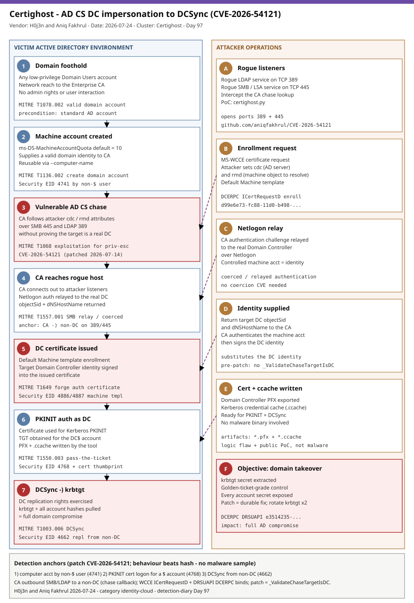

# Certighost: AD CS chase abuse turns any domain user into a Domain Controller (CVE-2026-54121)

## TL;DR

On **2026-07-24** researchers **H0j3n and Aniq Fakhrul** published a full working proof-of-concept for **Certighost / CVE-2026-54121**, an **Active Directory Certificate Services (AD CS)** flaw that Microsoft patched ten days earlier (2026-07-14, improper authorization, CVSS 8.8). A standard, low-privilege **Domain Users** account with network reach to an Enterprise CA can obtain a certificate carrying a **Domain Controller's identity**, authenticate as that DC over **PKINIT**, and then run **DCSync** to pull `krbtgt` and every account hash - full domain compromise with no admin rights and no user interaction. The bug lives in the AD CS enrollment **"chase"** fallback: the CA follows requester-supplied `cdc`/`rmd` targets over SMB/LDAP without first proving they are a real DC. There is no confirmed in-the-wild exploitation as of disclosure, but the exploit is public and the technique is trivially repeatable, so this is a **patch-now** item for every organization running an Enterprise CA. It matters today because the weekend gap analysis surfaces **DFIR Windows / AD** (slot #12) as the longest-uncovered rotation slot with a fresh, non-duplicated, detection-rich case.

## Attribution and confidence

This is a **vulnerability and public research disclosure**, not an intrusion set, so there is **no threat-actor attribution** and none is asserted (confidence **not applicable / low**). The research is credited to **H0j3n** and **Aniq Fakhrul**; Microsoft assigned **CVE-2026-54121** and shipped the fix on 2026-07-14. The public exploit lives at `github.com/aniqfakhrul/CVE-2026-54121` with an accompanying research gist by H0j3n.

| Fact | Detail | Confidence |
|---|---|---|
| Identifier | CVE-2026-54121 ("Certighost"), improper authorization in AD CS, CVSS 8.8 | high |
| Patched | Microsoft security update 2026-07-14 (adds `CRequestInstance::_ValidateChaseTargetIsDC` to `certpdef.dll`) | high |
| Public PoC | H0j3n and Aniq Fakhrul, 2026-07-24 (`github.com/aniqfakhrul/CVE-2026-54121`) | high |
| Exploited in the wild | Not confirmed as of disclosure; Microsoft observed researcher testing only | medium |
| Affected | Windows Server 2012-2025 incl. Server Core; Windows 10 1607/1809 (NVD) | high |

**Genealogy with previous repo cases.** This is the repo's first case on **AD CS certificate-template / enrollment abuse** and its first on the **"chase" (client-DC follow) fallback** specifically. It shares the DCSync end-state and the EID 4662 replication detection with **Day 46's Netlogon DC RCE** (the `2026-06-05_Netlogon-...-DC-RCE` case), but the *initial access* is completely different: Netlogon was an unauthenticated stack overflow that yielded SYSTEM on a DC directly, whereas Certighost is an **authenticated, low-privilege identity abuse** that borrows a DC's identity via a certificate. It also complements the identity-vector cases of the past two weeks (Day 93 OAuth client-ID spoofing on Entra; Day 79 passkey-enrollment vishing) by moving the identity attack **on-premises into AD CS / Kerberos** rather than the cloud IdP.

## Kill chain — summary table

| Stage | MITRE | Detail |
|---|---|---|
| Domain foothold | T1078.002 Valid Accounts: Domain Accounts | Any low-privilege Domain Users account with network reach to the Enterprise CA. |
| Machine account creation | T1136.002 Create Account: Domain Account | Attacker creates (or reuses) a computer account under the default `ms-DS-MachineAccountQuota` of 10 to supply a valid domain identity. |
| AD CS chase exploitation | T1068 Exploitation for Privilege Escalation | The CA follows attacker-supplied `cdc`/`rmd` targets over SMB/LDAP without validating the target is a DC (the CVE-2026-54121 flaw). |
| Coerced / relayed auth | T1557.001 AiTM: LLMNR/NBT-NS Poisoning and SMB Relay | Rogue LDAP/SMB listeners intercept the CA and relay its Netlogon authentication to the real DC. |
| Forge DC certificate | T1649 Steal or Forge Authentication Certificates | The CA signs the **target DC's identity** into a certificate issued on the default Machine template. |
| PKINIT as the DC | T1550.003 Use Alternate Authentication Material: Pass the Ticket | The certificate is used for PKINIT to obtain a TGT for the `DC$` account. |
| DCSync | T1003.006 OS Credential Dumping: DCSync | The DC's replication rights are exercised to pull `krbtgt` and all account hashes - full domain compromise. |



The diagram runs the victim AD environment down the left lane (domain foothold -> machine-account creation -> the vulnerable AD CS chase -> the CA reaching out to the attacker -> DC certificate issuance -> PKINIT as the DC -> DCSync of `krbtgt`) and the attacker operations down the right lane (rogue LDAP/SMB listeners -> MS-WCCE enrollment request with `cdc`/`rmd` -> Netlogon relay -> supplying the target DC identity -> writing the PFX and Kerberos cache -> the domain-takeover objective). The red (critical) anchors are the **vulnerable chase**, the **DC certificate issuance**, and the **DCSync** - the three points where behaviour-based detection matters even without a malware sample.

## Stage-by-stage detail

### 1. Domain foothold and machine-account creation (T1078.002, T1136.002)

The only precondition on the attacker side is a **standard authenticated domain account** and network reachability to the Enterprise CA, plus the CA being reachable back to the attacker's SMB/LDAP listeners. Because `ms-DS-MachineAccountQuota` defaults to **10**, any Domain User can create a computer account:

```text
# Any domain user can add up to 10 computer objects by default (impacket addcomputer / PowerShell)
addcomputer.py -computer-name 'ROGUE01$' -computer-pass 'P@ssw0rd!' domain/user:pass
```

That machine account supplies the **valid domain identity** the CA will authenticate before it signs the target DC's identity into a certificate. The PoC also accepts `--computer-name` to reuse an already-controlled machine account instead of creating one. **Security EID 4741** (a computer account was created) with a `SubjectUserName` that does not end in `$` is the precursor artifact.

### 2. The AD CS "chase" flaw (T1068, CVE-2026-54121)

AD CS enrollment includes a fallback called a **chase**: when the CA cannot obtain an end entity's information itself, the Windows enrollment protocol (MS-WCCE) lets the requester provide `cdc` (the Active Directory server to contact) and `rmd` (the machine object to resolve). The researchers found that a vulnerable CA **followed the requester-supplied `cdc` host over SMB and LDAP without first proving it was a real Domain Controller**:

```text
# Attacker-controlled MS-WCCE request attributes that trigger the chase
cdc = <attacker rogue host / target DC name>
rmd = <target Domain Controller machine object>
```

This is the root cause: the CA trusts an attacker-supplied target and will resolve identity information from it.

### 3. Rogue listeners and Netlogon relay (T1557.001)

The public exploit (`certighost.py`) starts **rogue services on ports 445 (SMB/LSA) and 389 (LDAP)**, submits the enrollment request with the malicious `cdc`/`rmd`, and when the CA connects in, it **relays the CA's authentication challenge to the real Domain Controller over Netlogon**. It then returns the **target Domain Controller's `objectSid` and `dNSHostName`**. The controlled machine account provides the valid domain identity the CA needs to continue; the CA authenticates that machine account and proceeds.

```text
# Public PoC behaviour (github.com/aniqfakhrul/CVE-2026-54121)
[*] Creating computer account (or reusing --computer-name)
[*] Starting rogue listeners on 445 (SMB/LSA) and 389 (LDAP)
[*] Relaying CA authentication to the real DC over Netlogon
[*] Returning target DC objectSid + dNSHostName
[+] Wrote <target-dc>.pfx and <target-dc>.ccache
```

### 4. DC certificate issuance and PKINIT (T1649, T1550.003)

With identity resolution satisfied, the CA **signs the target Domain Controller's identity into a certificate** issued on the default **Machine** template. The tool writes a **PFX** and a Kerberos credential cache and then uses **PKINIT** (Public Key Cryptography for Initial Authentication in Kerberos) to authenticate as the target DC and obtain a TGT. **Security EID 4768** with a populated `CertificateThumbprint` for a `$` (machine) principal, originating from a non-DC host, is the on-DC anchor for this step.

### 5. DCSync and domain compromise (T1003.006)

Domain Controller accounts hold directory-replication rights. Holding a DC's Kerberos credential, the attacker performs **DCSync** (`DS-Replication-Get-Changes` / `-All`) to extract **`krbtgt`** - the master key underpinning Kerberos in the domain - and every account secret. **Security EID 4662** referencing the replication GUIDs from a non-DC principal is the impact anchor. From here the attacker can mint Golden Tickets at will; recovery requires a **double `krbtgt` rotation**.

## RE notes

There is **no malware sample** in this case: Certighost is a **logic flaw plus a public proof-of-concept**, not a packed payload. The durable artifacts are therefore *behavioural and configuration* rather than a binary. Two are worth extracting during IR: the exploit-written **`*.pfx`** (a Domain Controller certificate) and **`*.ccache`** (a Kerberos credential cache) in the operator's working directory, and - on the defender side - the presence or absence of the patch's validation routine **`CRequestInstance::_ValidateChaseTargetIsDC`** in `certpdef.dll`, whose absence indicates an unpatched CA. The patch also rejects IP literals, overlong names and LDAP metacharacters in the chase target, and requires exactly one matching AD computer object whose DNS name matches the target and whose `userAccountControl` carries `SERVER_TRUST_ACCOUNT` (8192), with a later SID comparison blocking object substitution.

## Detection strategy

### Telemetry that matters

- **Domain controllers (Security eventlog):** computer-account creation (**EID 4741**); AD CS certificate request/issuance (**EID 4886/4887**) on the Machine/DC templates; Kerberos TGT issuance with certificate info (**EID 4768** + `CertificateThumbprint`); directory-service access (**EID 4662**) with the DCSync replication GUIDs. Enable "Audit Directory Service Access" (SACL on the domain head) for 4662.
- **Enterprise CA host:** outbound **SMB (445) / LDAP (389)** connections to a host that is **not** a domain controller during enrollment - the chase callback (`DeviceNetworkEvents` / Sysmon EID 3 / firewall).
- **East-west network:** DCERPC binds to the **MS-WCCE** enrollment interfaces (`ICertRequestD`, `ICertRequestD2`) and to **DRSUAPI** (replication); cleartext-LDAP `addRequest` creating computer objects. Most of the chain is encrypted RPC/LDAP/Kerberos, so treat network rules as internal anchors, not perimeter signatures.

### Detection coverage

| Engine | File | Logic |
|---|---|---|
| Sigma | `sigma/sec_4741_computer_account_created_by_user.yml` | Computer account (EID 4741) created by a non-`$` (user) principal. |
| Sigma | `sigma/sec_4768_pkinit_cert_auth_machine_account.yml` | Kerberos TGT (EID 4768) with a certificate thumbprint for a `$` (machine/DC) account. |
| Sigma | `sigma/sec_4662_dcsync_replication_nondc.yml` | DCSync replication rights (EID 4662) exercised by a non-DC principal. |
| KQL | `kql/sentinel_computer_account_created_by_user.kql` | 4741 computer-account creation by a user account (Sentinel `SecurityEvent`). |
| KQL | `kql/sentinel_pkinit_cert_logon_machine_account.kql` | 4768 certificate (PKINIT) logon for a machine/DC account. |
| KQL | `kql/sentinel_dcsync_replication_nondc.kql` | 4662 DCSync replication by a non-DC principal. |
| YARA | `yara/certighost_poc_and_tooling.yar` | Public PoC Python (`cdc`/`rmd`/`CVE-2026-54121`) and the PFX/ccache artifacts. |
| Suricata | `suricata/certighost_adcs_dcsync.rules` | WCCE `ICertRequestD`/`D2` and DRSUAPI DCERPC binds, cleartext-LDAP computer-object add, CA/template recon, Kerberos machine-principal AS-REQ (6 sids). |

### Threat hunting hypotheses

- **H1 (`hunts/peak_h1_computer_account_then_cert_enrollment.md`):** a machine account created by a non-privileged user (4741) followed shortly by an AD CS enrollment tied to that identity (4886/4887).
- **H2 (`hunts/peak_h2_ca_outbound_smb_ldap_to_nondc.md`):** the Enterprise CA initiating SMB/LDAP to a **non-DC** host during enrollment - the chase callback to the attacker's rogue listeners.
- **H3 (`hunts/peak_h3_pkinit_dc_cert_then_dcsync.md`):** a DC account authenticating via **certificate** (PKINIT, 4768) from a non-DC source host, then DCSync replication (4662) by a non-DC principal.

## Incident response playbook

### First 60 minutes (triage)

1. Confirm patch state of every Enterprise CA: is the 2026-07-14 update installed (does `certpdef.dll` contain `_ValidateChaseTargetIsDC`)? If not, the environment is exposed.
2. Pull **Security EID 4662** for the DCSync replication GUIDs and identify any **non-DC** principal - that is the impact event; treat as domain compromise if present.
3. Pull **EID 4768** with a certificate thumbprint for `$` accounts from non-DC source hosts (PKINIT-as-DC).
4. Pull **EID 4741** for computer accounts created by user principals in the window, and **EID 4886/4887** on the Machine/DC templates.
5. On the CA host, review outbound SMB/LDAP to non-DC peers during enrollment (the chase callback) and identify the attacker relay host.

### Artifacts to collect

| Artifact | Path | Tool | Why |
|---|---|---|---|
| DC certificate | operator `*.pfx` / issued-cert store on the CA | certutil / EDR | Proves a DC identity was issued; enables revocation. |
| Kerberos cache | operator `*.ccache` | EDR / manual copy | Evidence of PKINIT-as-DC. |
| CA audit log | Security eventlog (4886/4887) | wevtutil / SIEM | Ties the issued cert to requester + template. |
| DC directory access | Security eventlog (4662) | wevtutil / SIEM | DCSync replication evidence (T1003.006). |
| CA netflow | CA host network telemetry | EDR / firewall | Chase callback to the attacker relay host. |

### IR queries and commands

```powershell
# Is this CA patched? (validation routine added by the July 14 update)
$dll = "$env:SystemRoot\System32\certpdef.dll"
(Get-Item $dll).VersionInfo | Format-List FileVersion, ProductVersion
Select-String -Path $dll -Pattern '_ValidateChaseTargetIsDC' -ErrorAction SilentlyContinue
```

```powershell
# Machine accounts created by user principals (Certighost precursor)
Get-WinEvent -FilterHashtable @{LogName='Security';Id=4741} -MaxEvents 200 |
  Where-Object { $_.Properties[4].Value -notlike '*$' } |
  Select-Object TimeCreated, @{n='NewComputer';e={$_.Properties[0].Value}}, @{n='Creator';e={$_.Properties[4].Value}}
```

```kql
// DCSync replication by a non-DC principal (impact)
SecurityEvent
| where EventID == 4662
| where Properties has_any ("1131f6aa-9c07-11d1-b9c5-00805f88ce4","1131f6ad-9c07-11d1-b9c5-00805f88ce4","89e95b76-444d-4c62-991a-0facbeda640c")
| where not(SubjectUserName endswith "$")
| project TimeGenerated, Computer, SubjectUserName, ObjectName
```

### Containment, eradication, recovery

- **Contain:** install the 2026-07-14 update on all Enterprise CAs immediately. If patching must wait, the researchers documented a **lab-only** workaround that clears the chase EditFlag (`certutil -setreg policy\EditFlags -EDITF_ENABLECHASECLIENTDC` then `Restart-Service CertSvc -Force`) - stage it first, it can break legitimate enrollment.
- **Eradicate:** revoke any Domain Controller certificate issued through the flaw; delete rogue machine accounts created by user principals; identify and remediate the attacker relay host.
- **Recover:** if DCSync occurred, **rotate `krbtgt` twice** (with the appropriate replication interval between rotations), reset the affected DC's credentials, and treat all domain account secrets as exposed.
- **What NOT to do:** do **not** treat absence from CISA KEV as "not exploitable" - the PoC is public; do **not** rely on the EditFlag workaround as a permanent fix; do **not** rotate `krbtgt` only once (a single rotation leaves existing golden tickets valid through one cycle).

### Recovery validation

Confirm every Enterprise CA carries the 2026-07-14 update (`_ValidateChaseTargetIsDC` present), no non-DC principal appears in 4662 replication events, no `$`-account PKINIT logons originate from non-DC hosts, rogue machine accounts are removed, issued DC certificates are revoked, and `krbtgt` has been rotated twice.

## IOCs

Top indicators (full list in `iocs.csv`, 18 rows). This case has **no malware sample and no attacker C2** - the indicators are the CVE, the public PoC, and behavioural/configuration anchors.

| Type | Value | Context | Confidence | Source |
|---|---|---|---|---|
| cve | CVE-2026-54121 | AD CS chase improper authorization; DC impersonation to DCSync (patched 2026-07-14, CVSS 8.8) | high | Microsoft MSRC / NVD |
| url | `github.com/aniqfakhrul/CVE-2026-54121` | Public PoC exploit (offensive tooling if found on an endpoint) | high | The Hacker News 2026-07-24 |
| string | `certighost.py` | Public PoC tool filename | medium | SOC Prime 2026-07-27 |
| string | `_ValidateChaseTargetIsDC` | Patch validation routine in `certpdef.dll`; absence = unpatched CA | high | The Hacker News 2026-07-24 |
| note | `cdc` / `rmd` attributes | Attacker-supplied MS-WCCE request attributes that trigger the chase | high | The Hacker News 2026-07-24 |
| note | Security EID 4768 + cert for `$` account | PKINIT certificate logon as a machine/DC account | high | MITRE ATT&CK T1649 |
| note | Security EID 4662 DS-Replication from non-DC | DCSync of `krbtgt` (impact) | high | MITRE ATT&CK T1003.006 |
| note | DCERPC `ICertRequestD` / DRSUAPI binds | WCCE enrollment + replication RPC interfaces | medium | MS-WCCE / MS-DRSR |

**CISA KEV status.** As of the KEV catalog cross-reference (see `kev.md`), **CVE-2026-54121 is not listed on CISA KEV**. Per the repo's KEV discipline, absence from KEV is **not** evidence of non-exploitation - a public PoC exists and the fix is a federal-grade patch-now item; re-check the catalog, as newly disclosed CVEs are frequently added.

## Secondary findings

- **Default settings are the attack surface.** The chain needs only a standard domain account, the default `ms-DS-MachineAccountQuota` of 10, the default **Machine** certificate template, and an Enterprise CA reachable on the network - no misconfiguration beyond shipping defaults. Hardening the machine-account quota (set to 0 and delegate joins) and restricting who can enroll on machine templates raises the bar even on patched estates.
- **AD CS remains "tier zero."** Like the recurring ESC1-ESC13 family and the ADCS relay classics, Certighost shows that the CA is as security-critical as a domain controller: a single logic gap in enrollment yields DC identity. CA hosts deserve DC-grade isolation, auditing (4886/4887) and network segmentation.
- **Certificate-based auth breaks the "no successful logon = no compromise" assumption.** PKINIT lets an attacker authenticate as a DC without ever cracking or replaying its long-term key; a `$`-account certificate logon (4768 + thumbprint) from a workstation is the tell, not a failed-logon burst.

## Pedagogical anchors

- **A CA that trusts requester-supplied targets is a CA that issues attacker-chosen identities.** The root cause is authorization, not cryptography: the fix (`_ValidateChaseTargetIsDC`) simply proves the chase target is a real DC before following it. When a service resolves identity from attacker-controlled input, expect impersonation.
- **The default machine-account quota is an offensive primitive.** `ms-DS-MachineAccountQuota = 10` recurs across AD attacks (Certifried, resource-based constrained delegation, and now Certighost). Treat the ability of ordinary users to create computer objects as privilege, and remove it where you can.
- **DCSync is the shared end-state; detect it regardless of entry.** Whether the entry was a Netlogon RCE (Day 46) or an AD CS certificate (this case), the impact event is the same 4662 replication from a non-DC. A single robust DCSync detection covers many otherwise-unrelated intrusion paths.
- **KEV absence is not safety.** A CVSS 8.8 identity flaw with a public PoC is a patch-now item even while it is absent from CISA KEV; prioritize on exploitability and blast radius, not solely on catalog membership.

## What's in this folder

| File | Purpose | Link |
|---|---|---|
| README.md | This analysis (15 sections). | [README.md](./README.md) |
| kill_chain.svg | Two-lane kill-chain diagram (Template A, identity-cloud accent). | [kill_chain.svg](./kill_chain.svg) |
| sigma/sec_4741_computer_account_created_by_user.yml | Computer account created by a user principal (EID 4741). | [sec_4741_computer_account_created_by_user.yml](./sigma/sec_4741_computer_account_created_by_user.yml) |
| sigma/sec_4768_pkinit_cert_auth_machine_account.yml | PKINIT certificate TGT for a machine/DC account (EID 4768). | [sec_4768_pkinit_cert_auth_machine_account.yml](./sigma/sec_4768_pkinit_cert_auth_machine_account.yml) |
| sigma/sec_4662_dcsync_replication_nondc.yml | DCSync replication by a non-DC principal (EID 4662). | [sec_4662_dcsync_replication_nondc.yml](./sigma/sec_4662_dcsync_replication_nondc.yml) |
| kql/sentinel_computer_account_created_by_user.kql | 4741 computer-account creation by a user. | [sentinel_computer_account_created_by_user.kql](./kql/sentinel_computer_account_created_by_user.kql) |
| kql/sentinel_pkinit_cert_logon_machine_account.kql | 4768 certificate (PKINIT) logon for a machine/DC account. | [sentinel_pkinit_cert_logon_machine_account.kql](./kql/sentinel_pkinit_cert_logon_machine_account.kql) |
| kql/sentinel_dcsync_replication_nondc.kql | 4662 DCSync replication by a non-DC principal. | [sentinel_dcsync_replication_nondc.kql](./kql/sentinel_dcsync_replication_nondc.kql) |
| yara/certighost_poc_and_tooling.yar | Public PoC Python and the PFX/ccache artifacts. | [certighost_poc_and_tooling.yar](./yara/certighost_poc_and_tooling.yar) |
| suricata/certighost_adcs_dcsync.rules | WCCE/DRSUAPI DCERPC binds, LDAP computer-add, template recon, Kerberos AS-REQ (6 sids). | [certighost_adcs_dcsync.rules](./suricata/certighost_adcs_dcsync.rules) |
| hunts/peak_h1_computer_account_then_cert_enrollment.md | PEAK H1 - user-created machine account then AD CS enrollment. | [peak_h1_computer_account_then_cert_enrollment.md](./hunts/peak_h1_computer_account_then_cert_enrollment.md) |
| hunts/peak_h2_ca_outbound_smb_ldap_to_nondc.md | PEAK H2 - CA reaching SMB/LDAP to a non-DC (chase callback). | [peak_h2_ca_outbound_smb_ldap_to_nondc.md](./hunts/peak_h2_ca_outbound_smb_ldap_to_nondc.md) |
| hunts/peak_h3_pkinit_dc_cert_then_dcsync.md | PEAK H3 - PKINIT as a DC then DCSync. | [peak_h3_pkinit_dc_cert_then_dcsync.md](./hunts/peak_h3_pkinit_dc_cert_then_dcsync.md) |
| iocs.csv | Full indicator set (18 rows). | [iocs.csv](./iocs.csv) |
| kev.md | CISA KEV cross-reference for this case's CVEs. | [kev.md](./kev.md) |

## Sources

- [The Hacker News - Certighost Exploit Lets Low-Privileged Active Directory Users Impersonate a Domain Controller](https://thehackernews.com/2026/07/certighost-exploit-lets-low-privileged.html)
- [Help Net Security - PoC exploit released for critical AD CS domain-takeover flaw (CVE-2026-54121)](https://www.helpnetsecurity.com/2026/07/27/certighost-cve-2026-54121-poc-exploit-released/)
- [BleepingComputer - New Certighost PoC exploit lets attackers hijack Windows domains](https://www.bleepingcomputer.com/news/security/new-certighost-poc-exploit-lets-attackers-hijack-windows-domains/)
- [SOC Prime - Certighost (CVE-2026-54121) AD CS vulnerability](https://socprime.com/active-threats/certighost-active-directory-certificate-services-adcs-vulnerability-cve-2026-54121/)
- [NVD - CVE-2026-54121](https://nvd.nist.gov/vuln/detail/CVE-2026-54121)
- [Microsoft MSRC - CVE-2026-54121](https://msrc.microsoft.com/update-guide/vulnerability/CVE-2026-54121)
- [Public PoC - github.com/aniqfakhrul/CVE-2026-54121](https://github.com/aniqfakhrul/CVE-2026-54121)
