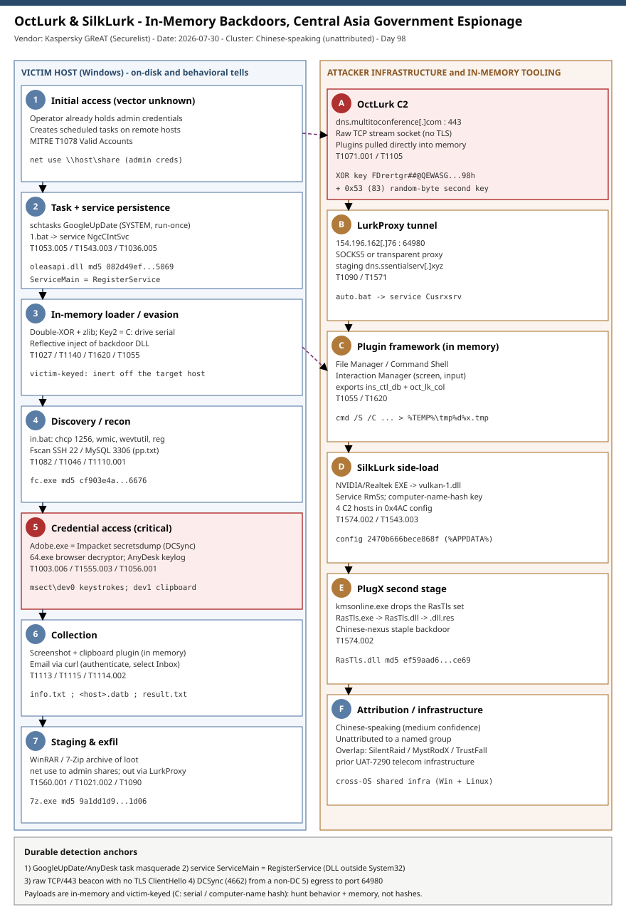

# OctLurk & SilkLurk: In-Memory, Victim-Keyed Backdoors Hitting Central Asian Governments

## TL;DR
Kaspersky's GReAT disclosed (2026-07-30) two new, heavily obfuscated backdoors - **OctLurk** and
**SilkLurk** - plus a proxy utility, **LurkProxy**, used since January 2025 against government
organizations across Central Asia (Afghanistan, Kyrgyzstan, Tajikistan, Uzbekistan, Kazakhstan)
and the Syrian Arab Republic, spanning ministries of foreign affairs, law enforcement,
healthcare, research, logistics, urban planning and education. Both backdoors run **primarily in
memory**, leaving only a minimal loader on disk that decodes its payload with **machine-specific
keys** (OctLurk uses the C: drive serial number; SilkLurk uses a hash of the computer name),
which defeats automated sandboxing and cross-victim signaturing. They pull plugins straight into
memory for shells, keylogging, browser-credential theft, DCSync-style hash dumping, network
scanning, screen/clipboard capture and email collection. Kaspersky assesses with **medium
confidence** that a single **Chinese-speaking** actor runs both, but does not tie it to any named
group; the campaign shares infrastructure with the C++ implant **SilentRaid (aka MystRodX /
TrustFall)** from a prior telecom-focused intrusion set. It matters today because this is a live,
government-targeted espionage framework whose durable detections are behavioral, not hash-based.

## Attribution and confidence
- **Cluster:** OctLurk/SilkLurk/LurkProxy operator. **Aliases:** none assigned; unattributed.
- **Nexus:** Chinese-speaking actor (medium confidence per Kaspersky). No link to any known named
  group at time of publication; attribution to a specific APT is **low/none**.
- **Vendor / date:** Kaspersky GReAT (Saurabh Sharma, Yaroslav Kikel), Securelist, 2026-07-30;
  amplified by The Hacker News (2026-07-31) and Kaspersky press.
- **Confidence:** medium that one actor operates both backdoors and is Chinese-speaking; the
  initial-access vector is **unknown**. Victimology (Central Asia + Syria government) is stated
  with high confidence from telemetry.

| Overlap signal | Detail | Weight |
|---|---|---|
| Shared operator across OctLurk + SilkLurk | Some SilkLurk victims also carry OctLurk; shared plugin framework | medium |
| Language | Chinese-speaking artifacts (Kaspersky assessment) | medium |
| Infra overlap with SilentRaid (MystRodX/TrustFall) | Same infrastructure as a prior C++ implant / UAT-7290 telecom campaign; cross-OS | medium |
| PlugX second stage | SilkLurk drops PlugX (RasTls side-load) - a staple of Chinese-nexus groups | supporting |

**Genealogy with previous repo cases.** This is the first repo case on OctLurk/SilkLurk. It sits
in the China-nexus espionage line alongside Day 77 (UAT-7810 / LapDogs ORB, China-nexus relay
infrastructure) but is a distinct cluster with its own toolset; the SilentRaid/MystRodX/TrustFall
overlap ties it to telecom-sector intrusions rather than the ORB tradecraft of LapDogs. It differs
from the recent Iran-nexus Day 92 (SpearSpecter / APT42) purely by nexus and toolchain. The PlugX
tail connects it to the broad Chinese-nexus PlugX ecosystem the repo has referenced but not
centered before.

## Kill chain — summary table
| Stage | MITRE | Detail |
|---|---|---|
| Initial access (vector unknown) | T1078 | Kaspersky could not confirm entry; operator already holds admin credentials to create remote tasks |
| Execution & persistence | T1053.005, T1543.003 | schtasks `GoogleUpDate` (SYSTEM, run-once) runs `1.bat`; batch creates service `NgcCIntSvc` loading `oleasapi.dll` |
| In-memory loader / evasion | T1027, T1140, T1620, T1055 | Double-XOR (Key1 hard-coded + Key2 = C: drive serial) then zlib; reflective inject of backdoor DLL |
| Command & control | T1071.001, T1105 | OctLurk to `dns.multitoconference[.]com` raw TCP/443 stream socket; plugins loaded to memory |
| Proxy tunneling | T1090, T1571 | LurkProxy to `154.196.162[.]76:64980`, SOCKS5 or transparent |
| Discovery | T1082, T1046, T1110.001 | `in.bat` fingerprint (`chcp 1256`, wmic/wevtutil); Fscan scans SSH 22 / MySQL 3306 with `pp.txt` |
| Credential access | T1003.006, T1555.003, T1056.001 | `Adobe.exe` secretsdump (DCSync-style); `64.exe` Chrome/Firefox decryptor; `AnyDesk.exe` keylogger |
| Collection | T1115, T1113, T1114.002 | Clipboard + screenshot plugin; email harvest via curl (authenticate, select Inbox) |
| Staging & exfil | T1560.001, T1021.002 | `net use` to admin shares; WinRAR/7-Zip archive; exfil through LurkProxy tunnel |
| Second stage | T1574.002 | SilkLurk drops PlugX via `RasTls.exe` -> `RasTls.dll` -> `RasTls.dll.res` |



The diagram's left lane is the victim host (task -> service -> in-memory loader -> plugin
framework -> credential/collection actions); the right lane is attacker infrastructure (OctLurk
C2, LurkProxy, SilkLurk side-load chain, PlugX). The strongest detection anchors are the
`GoogleUpDate`/`AnyDesk` task masquerade, the `ServiceMain=RegisterService` loader pattern, and
the raw-socket beacon to the C2 on 443 (no TLS ClientHello).

## Stage-by-stage detail

### Initial access (vector unknown)
Kaspersky states the initial access vector is currently unknown. By the first observed action the
operator already possesses administrative credentials, which they use to create scheduled tasks on
remote machines. Treat lateral movement into new hosts as credential-based (`net use` to shares
with admin creds is observed later).

### Execution and persistence - OctLurk
The operator creates a scheduled task `GoogleUpDate` that runs once with SYSTEM privileges
immediately after creation, executing a batch script:
```
C:\Users\<username>\Videos\1.bat   (MD5 6ecf84fb18f6747ed08d7598364d853a)
```
`1.bat` creates a service `NgcCIntSvc` that loads the loader DLL:
```
oleasapi.dll   (MD5 082d49ef9f14e6811d68c7e0e82e5069)
```
The service registry `ServiceMain` parameter is set to invoke the DLL export `RegisterService`.
MITRE: T1053.005 (Scheduled Task/Job: Scheduled Task), T1543.003 (Create or Modify System
Process: Windows Service), T1036.005 (Masquerading: Match Legitimate Name or Location).

### In-memory loader and obfuscation
The loader exports `Refresh` and `RegisterService`; the service calls `RegisterService`, which
calls `Refresh` (the malicious code). To locate its payload the loader **double-XOR-decrypts and
zlib-decompresses** a hard-coded byte blob:
```
Key 1: hard-coded in the loader
Key 2: derived from the serial number of the C: drive   <-- victim-tailored
```
The backdoor DLL is then reflectively injected into memory; exports are called by name or ordinal
(also decoded with the same double-XOR/zlib). MITRE: T1027 (Obfuscated Files or Information),
T1140 (Deobfuscate/Decode), T1620 (Reflective Code Loading), T1055 (Process Injection).

### Command and control - OctLurk
OctLurk creates a stream socket to a hard-coded C2 and port:
```
dns.multitoconference[.]com : 443   (raw TCP stream socket - not TLS/HTTP)
```
Its data-at-rest crypto uses a hard-coded XOR key
`FDrertgr##@QEWASGkio865ehyf98foidsjzhug874392dfsREFDfdsAGH43wea98h`, then generates `0x53` (83)
random bytes as a second XOR key; victim data is zlib-deflated then XORed twice. A 16-char pseudo
random header prefixes packets. Plugins are pulled from the C2 directly into memory (each exports
`ins_ctl_db` and `oct_lk_col`): File Manager, Command Shell, Interaction Manager. MITRE: T1071.001
(Application Layer Protocol: Web Protocols), T1105 (Ingress Tool Transfer).

The Command Shell plugin runs:
```
C:\Windows\System32\cmd.exe /S /C "<command_string>" > %TEMP%\tmp%d%x.tmp
```

### Discovery and recon
The `GoogleUpDate` task also runs a fingerprinting batch:
```
C:\windows\temp\in.bat   (MD5 45cf5916fab4272a1313c26e67aa9220 / 4e6d5c4770d5a822d7fcce6a74f7ad73)
```
Output is saved to `info.txt`, `<hostname>.datb`, `<hostname>_logs.datb` under `%TEMP%`. Recon
starts with `chcp 1256` (Arabic code page) then a battery of `powershell`/`wmic`/`wevtutil`/
`reg query`/`netstat`. Network scanning uses Fscan:
```
%TEMP%\fc.exe   (MD5 cf903e4a1629aa0582fd0363b5786676)  -> result.txt ; pp.txt password list ; ports 22, 3306
```
MITRE: T1082 (System Information Discovery), T1046 (Network Service Discovery), T1110.001
(Brute Force: Password Guessing).

### Credential access
```
Adobe.exe   (MD5 32a5985543433a4f60da2fafd873b927)  - portable Impacket secretsdump; harvests hashes from DCs
64.exe      (MD5 37dc84e4bcad92fa28f1e7778d088283)  - browser password decryptor (Chrome -help, Firefox -exit)
AnyDesk.exe (MD5 2a571f6cee42a17d873f4c942649813f)  - keylogger; task AnyDesk runs on logon
```
The keylogger writes `C:\Users\Public\Libraries\msect\dev0` (keystrokes) and `...\dev1`
(clipboard); captured bytes are encoded by subtracting 2 from each byte. MITRE: T1003.006 (OS
Credential Dumping: DCSync), T1555.003 (Credentials from Web Browsers), T1056.001 (Keylogging),
T1115 (Clipboard Data).

### Collection, remote access and exfil
The Interaction Manager plugin captures screenshots and synthesizes mouse/keyboard events
(T1113 Screen Capture). Email is harvested with `curl` (connect + authenticate + select Inbox;
T1114.002 Remote Email Collection). Remote access is established with the **Pandora RC** agent via
`1.bat` (MD5 5e26df131ff0a679a0a2699b723b46e3; EHORUS args; T1219 Remote Access Software).
Data is proxied out through LurkProxy:
```
auto.bat (MD5 b874123a80fc4f40e06872b9cb54ebc6) -> service Cusrxsrv -> msbasesysdc.dll
LurkProxy C2: 154.196.162[.]76 : 64980  (SOCKS5 or transparent)  (staging domain dns.ssentialserv[.]xyz)
```
MITRE: T1090 (Proxy), T1571 (Non-Standard Port).

### SilkLurk and PlugX second stage
SilkLurk is launched by DLL side-loading: legitimate NVIDIA/Realtek binaries
(`NetSetSvc.exe`, `nvgwls.exe`, `RtkSmbus.exe`, `RtkNGUI64.exe`) load malicious loader DLLs
(`nvml.dll`, `vulkan-1.dll`, `RtkSmbusLoc.dll`, `RtkNGUI64Loc.dll`), which inject SilkLurk into
memory. SilkLurk relocates its payload (`OneDrive.dat`) to `C:\ProgramData\Microsoft OneDrive\
setup`, persists via service `RmSs`, and decrypts using a **32-bit hash of the victim computer
name** (import names use single-byte XOR `0xD9`). Its config (`0x4AC` bytes; first 16 bytes are a
mutex; filenames like `2470b666bece868f`, `27879a4df1a740ff` in `%APPDATA%`) holds up to four C2
hosts and two proxy credential sets. Post-compromise it uses `cmd.exe`->PowerShell, `net use` to
admin shares, WinRAR (`RecordedTV.exe`/`recordutil.exe`, MD5 18dc8bff47cc282508354771d0c8cf8c) and
7-Zip (`C:\windows\vss\7z.exe`, MD5 9a1dd1d96481d61934dcc2d568971d06), then side-loads PlugX:
```
kmsonline.exe (MD5 3c9a1ba8e0c7475706adc6376e9d7b7c) drops:
  C:\ProgramData\Symantec\RasTls.exe      (MD5 62944e26b36b1dcace429ae26ba66164 - legit host)
  C:\ProgramData\Symantec\RasTls.dll      (MD5 ef59aad625eebda8650aec5820d6ce69 - PlugX loader)
  C:\ProgramData\Symantec\RasTls.dll.res  (PlugX encrypted payload)
```
MITRE: T1574.002 (DLL Side-Loading), T1560.001 (Archive via Utility), T1021.002 (SMB/Windows
Admin Shares).

## Detection strategy

### Telemetry that matters
- **Sysmon** EID 1 (process create: schtasks, cmd `/S /C ... > %TEMP%\tmp*.tmp`, masqueraded
  tool names), EID 7 (image load: signed NVIDIA/Realtek/Symantec EXE loading an unsigned DLL from
  ProgramData/Network\Connections), EID 13 (registry set: `Services\*\Parameters ServiceMain =
  RegisterService`), EID 3 (network: 443 raw socket, port 64980), EID 11 (file: `msect\dev0/dev1`).
- **Windows Security/System**: 4698 (task created), 7045 (service installed), 4662 (DS replication
  rights for the secretsdump/DCSync step).
- **Defender XDR**: `DeviceProcessEvents`, `DeviceImageLoadEvents`, `DeviceRegistryEvents`,
  `DeviceNetworkEvents`, `DeviceFileEvents`.
- **Network**: Zeek `conn`/`ssl` to separate real TLS on 443 from raw stream sockets (no
  ClientHello) - the OctLurk beacon tell; NetFlow egress to 64980.

### Detection coverage
| Engine | File | Logic |
|---|---|---|
| Sigma | sigma/proc_octlurk_scheduled_task_masquerade.yml | schtasks /create task GoogleUpDate/AnyDesk with .bat action under Videos/Desktop/Public/ProgramData |
| Sigma | sigma/proc_octlurk_command_shell_plugin_tmp_redirect.yml | cmd /S /C output redirected to %TEMP%\tmp*.tmp; or chcp 1256 recon lead-in |
| Sigma | sigma/reg_octlurk_service_registerservice_loader.yml | service ServiceMain=RegisterService / names NgcCIntSvc, Cusrxsrv, RmSs / ServiceDll oleasapi/msbasesysdc |
| KQL | kql/octlurk_scheduled_task_masquerade.kql | DeviceProcessEvents schtasks masquerade |
| KQL | kql/octlurk_masqueraded_tooling_in_libraries.kql | Adobe.exe/AnyDesk.exe/64.exe/fc.exe from user paths |
| KQL | kql/octlurk_lurkproxy_c2_network.kql | DeviceNetworkEvents to C2 domains/IP and port 64980 |
| YARA | yara/octlurk_silklurk.yar | OctLurk hard-coded XOR key + RegisterService/curl_easy_escape; SilkLurk CONNECT UA + side-load DLLs |
| Suricata | suricata/octlurk_silklurk.rules | DNS/TLS SNI multitoconference.com + ssentialserv.xyz; TCP to 154.196.162.76 and port 64980; CONNECT UA |

### Threat hunting hypotheses
- **H1** - GoogleUpDate/AnyDesk scheduled-task masquerade across the fleet. See
  hunts/peak_h1_scheduled_task_masquerade.md.
- **H2** - service-loader DLLs (ServiceMain=RegisterService) and NVIDIA/Realtek/Symantec
  side-loading. See hunts/peak_h2_service_loader_sideload.md.
- **H3** - OctLurk raw-socket C2 / LurkProxy 64980 beacon plus masqueraded tooling and DCSync.
  See hunts/peak_h3_c2_beacon_masqueraded_tooling.md.

## Incident response playbook

### First 60 minutes (triage)
1. Identify hosts with a `GoogleUpDate` or `AnyDesk` scheduled task pointing at a `.bat`/EXE in a
   user path; snapshot the task XML and the referenced file before it self-cleans.
2. List services `NgcCIntSvc`, `Cusrxsrv`, `RmSs` and any service with ServiceMain=`RegisterService`.
3. Pull current network connections to `dns.multitoconference[.]com`, `154.196.162[.]76` and any
   egress to TCP 64980.
4. Check for masqueraded binaries: `Adobe.exe`, `64.exe`, `fc.exe`, `AnyDesk.exe` outside
   Program Files; capture `msect\dev0/dev1`.
5. Determine whether a DC saw replication rights exercised by a non-DC principal (secretsdump).

### Artifacts to collect
| Artifact | Path | Tool | Why |
|---|---|---|---|
| Scheduled task XML | C:\Windows\System32\Tasks\GoogleUpDate, \AnyDesk | file copy / schtasks /query /xml | Persistence + action path |
| Loader DLLs | oleasapi.dll, msbasesysdc.dll, vulkan-1.dll, RasTls.dll | file copy | Reflective loader + config keys |
| Service registry | HKLM\SYSTEM\CurrentControlSet\Services\{NgcCIntSvc,Cusrxsrv,RmSs} | reg export | ServiceMain=RegisterService |
| Keylogger stores | C:\Users\Public\Libraries\msect\dev0, dev1 | file copy | Keystrokes/clipboard (decode: +2) |
| Recon output | %TEMP%\info.txt, <host>.datb, result.txt, pp.txt | file copy | Discovery scope + creds tried |
| Process memory | injected/unbacked RX regions | comae/winpmem | In-memory backdoor + plugins |

### IR queries and commands
```powershell
# Scheduled tasks masquerading as GoogleUpDate/AnyDesk with a batch/user-path action
Get-ScheduledTask | Where-Object { $_.TaskName -in 'GoogleUpDate','AnyDesk' } |
  ForEach-Object { $_ | Select-Object TaskName, @{n='Action';e={($_.Actions.Execute + ' ' + $_.Actions.Arguments)}} }

# Services whose DLL loads via RegisterService or match the known names
Get-CimInstance Win32_Service | Where-Object { $_.Name -in 'NgcCIntSvc','Cusrxsrv','RmSs' } |
  Select-Object Name, PathName, StartName, State
```
```bash
# Zeek: 443 flows with bytes but no matching TLS handshake (raw-socket beacon heuristic)
zeek-cut id.orig_h id.resp_h id.resp_p service < conn.log | awk '$3==443 && $4!="ssl"'
```
```kql
DeviceNetworkEvents
| where RemoteUrl has "multitoconference.com" or RemoteIP == "154.196.162.76" or RemotePort == 64980
| summarize count(), makeset(RemoteIP), min(Timestamp), max(Timestamp) by DeviceName, InitiatingProcessFileName
```

### Containment, eradication, recovery
- **Contain:** isolate affected hosts; block the C2 domains/IP and port 64980 **after
  revalidation** (indicators decay - do not assume the IP is still live). Disable the abused
  admin account.
- **Eradicate:** remove the GoogleUpDate/AnyDesk tasks and the NgcCIntSvc/Cusrxsrv/RmSs services;
  delete the loader DLLs and staged tools; rotate all credentials exposed to keylogging/browser
  theft; if a DC was hit by secretsdump, rotate `krbtgt` twice and treat the domain as
  compromised.
- **Do NOT:** rely on hash blocklists alone - payloads are in-memory and victim-keyed, so the
  on-disk loader varies. Do NOT reset only one keystore; the actor deliberately spreads across
  accounts.
- **Recovery validation:** confirm no task/service persistence remains; verify no host reaches
  the C2 or 64980; hunt for reintroduction via new side-load pairs.

### Recovery validation
Re-run H1/H2/H3 after eradication; confirm zero GoogleUpDate/AnyDesk tasks, zero
ServiceMain=RegisterService services, and no egress to the C2/64980. Validate DC hygiene
(4662 replication rights only from DC machine accounts).

## IOCs
Top indicators (full list in `iocs.csv`). Types: md5, domain, ipv4, path, string, note.

| Type | Value | Context | Confidence | Source |
|---|---|---|---|---|
| md5 | 082d49ef9f14e6811d68c7e0e82e5069 | OctLurk loader oleasapi.dll (svc NgcCIntSvc) | high | Securelist 2026-07-30 |
| md5 | 6ecf84fb18f6747ed08d7598364d853a | OctLurk deploy 1.bat | high | Securelist 2026-07-30 |
| md5 | b874123a80fc4f40e06872b9cb54ebc6 | auto.bat LurkProxy deploy (svc Cusrxsrv) | high | Securelist 2026-07-30 |
| md5 | 32a5985543433a4f60da2fafd873b927 | Adobe.exe Impacket secretsdump | high | Securelist 2026-07-30 |
| md5 | 2a571f6cee42a17d873f4c942649813f | AnyDesk.exe keylogger | high | Securelist 2026-07-30 |
| md5 | 37dc84e4bcad92fa28f1e7778d088283 | 64.exe browser password decryptor | high | Securelist 2026-07-30 |
| md5 | cf903e4a1629aa0582fd0363b5786676 | fc.exe Fscan scanner | high | Securelist 2026-07-30 |
| md5 | 3c9a1ba8e0c7475706adc6376e9d7b7c | kmsonline.exe PlugX dropper | high | Securelist 2026-07-30 |
| md5 | ef59aad625eebda8650aec5820d6ce69 | RasTls.dll PlugX loader | high | Securelist 2026-07-30 |
| domain | dns.multitoconference.com | OctLurk C2 raw TCP/443 | high | Securelist 2026-07-30 |
| domain | dns.ssentialserv.xyz | LurkProxy staging domain | high | Securelist 2026-07-30 |
| ipv4 | 154.196.162.76 | LurkProxy C2 (TCP 64980) | high | Securelist 2026-07-30 |
| path | C:\Users\Public\Pictures\AnyDesk.exe | Keylogger location | high | Securelist 2026-07-30 |
| string | GoogleUpDate | Scheduled task name | high | Securelist 2026-07-30 |
| string | RmSs | SilkLurk persistence service | high | Securelist 2026-07-30 |

**CVE / KEV status:** none. This intrusion set uses valid credentials, native OS features
(scheduled tasks, services, DLL side-loading) and custom implants - no CVE is in scope, so there
is no `kev.md` for this case. Absence of a CVE is not absence of risk: the durable controls are
behavioral (task/service masquerade, in-memory loaders, raw-socket beacon), not patching.

## Secondary findings
- **Victim-keyed encryption defeats sandboxing.** OctLurk keys its payload to the C: drive serial
  number and SilkLurk to a hash of the computer name, so a sample detonated anywhere but the exact
  victim will not decrypt - automated detonation and cross-victim hash sharing both fail, pushing
  detection to behavior and memory.
- **Infrastructure overlap with SilentRaid (MystRodX / TrustFall).** Kaspersky found this campaign
  shares infrastructure with a prior C++ implant used against telecom targets (UAT-7290 lineage),
  suggesting one operator running multiple OS-targeting toolkits (Windows OctLurk/SilkLurk +
  cross-platform SilentRaid) - a reminder to pivot on infrastructure, not just malware family.
- **Masquerade-by-name is the connective tissue.** The task `GoogleUpDate`, keylogger `AnyDesk.exe`,
  secretsdump `Adobe.exe`, and PlugX `RasTls.exe` all lean on trusted names/paths; a name-vs-path
  vs-signature check across the estate surfaces the whole chain cheaply.

## Pedagogical anchors
- When a loader keys its payload to a machine-specific value (drive serial, computer-name hash),
  the sample is inert outside the victim; your durable detections must be behavioral and
  memory-based, not hash- or sandbox-based.
- `ServiceMain` pointing at an odd export (here `RegisterService`) plus a ServiceDll outside
  System32 is a compact, high-signal persistence tell that generalizes far beyond this actor.
- A raw TCP stream socket on 443 (no TLS ClientHello) is not "HTTPS" - teach analysts to
  distinguish port from protocol; Zeek `ssl.log` absence on a 443 flow is the giveaway.
- DCSync (4662 replication rights from a non-DC principal) is a shared end-state across unrelated
  intrusions; one robust detection there covers many entry paths.
- No CVE and no KEV entry does not mean low priority: credential-and-native-tooling espionage is
  exactly what patch-centric programs miss.

## What's in this folder
| File | Purpose | Link |
|---|---|---|
| README.md | This analysis (15 sections). | [README.md](./README.md) |
| kill_chain.svg | Two-lane kill chain (victim host vs attacker infrastructure). | [kill_chain.svg](./kill_chain.svg) |
| iocs.csv | Full indicator list (md5, domain, ipv4, path, string, note). | [iocs.csv](./iocs.csv) |
| sigma/proc_octlurk_scheduled_task_masquerade.yml | GoogleUpDate/AnyDesk task masquerade. | [file](./sigma/proc_octlurk_scheduled_task_masquerade.yml) |
| sigma/proc_octlurk_command_shell_plugin_tmp_redirect.yml | cmd /S /C temp-redirect + chcp 1256 recon. | [file](./sigma/proc_octlurk_command_shell_plugin_tmp_redirect.yml) |
| sigma/reg_octlurk_service_registerservice_loader.yml | ServiceMain=RegisterService loader / known service names. | [file](./sigma/reg_octlurk_service_registerservice_loader.yml) |
| kql/octlurk_scheduled_task_masquerade.kql | Defender XDR schtasks masquerade. | [file](./kql/octlurk_scheduled_task_masquerade.kql) |
| kql/octlurk_masqueraded_tooling_in_libraries.kql | Masqueraded secretsdump/decryptor/Fscan. | [file](./kql/octlurk_masqueraded_tooling_in_libraries.kql) |
| kql/octlurk_lurkproxy_c2_network.kql | C2 domains/IP + port 64980 beacons. | [file](./kql/octlurk_lurkproxy_c2_network.kql) |
| yara/octlurk_silklurk.yar | OctLurk XOR key + SilkLurk CONNECT UA / side-load DLLs. | [file](./yara/octlurk_silklurk.yar) |
| suricata/octlurk_silklurk.rules | DNS/TLS/TCP C2 and LurkProxy detections (6 sids). | [file](./suricata/octlurk_silklurk.rules) |
| hunts/peak_h1_scheduled_task_masquerade.md | PEAK H1 - task masquerade hunt. | [file](./hunts/peak_h1_scheduled_task_masquerade.md) |
| hunts/peak_h2_service_loader_sideload.md | PEAK H2 - service loader + side-loading hunt. | [file](./hunts/peak_h2_service_loader_sideload.md) |
| hunts/peak_h3_c2_beacon_masqueraded_tooling.md | PEAK H3 - C2 beacon + tooling hunt. | [file](./hunts/peak_h3_c2_beacon_masqueraded_tooling.md) |

## Sources
- [OctLurk and SilkLurk: new backdoors in Central Asia - Kaspersky Securelist](https://securelist.com/octlurk-silklurk-backdoors-central-asia/120840/)
- [Suspected Chinese-Speaking Hackers Target Central Asian Governments With OctLurk and SilkLurk - The Hacker News](https://thehackernews.com/2026/08/suspected-chinese-speaking-hackers.html)
- [Kaspersky uncovers victim-tailored backdoors in Central Asia - Kaspersky press](https://www.kaspersky.com/about/press-releases/kaspersky-uncovers-victim-tailored-backdoors-in-central-asia-targeting-government-healthcare-and-research)
- [OctLurk and SilkLurk Backdoors Target Central Asian Governments - GBHackers](https://gbhackers.com/octlurk-and-silklurk-backdoors/)
- [New Backdoors Let Hackers Keylog, Steal Passwords and Control Government Computers - Cyber Security News](https://cybersecuritynews.com/new-backdoors-let-hackers-keylog/)
