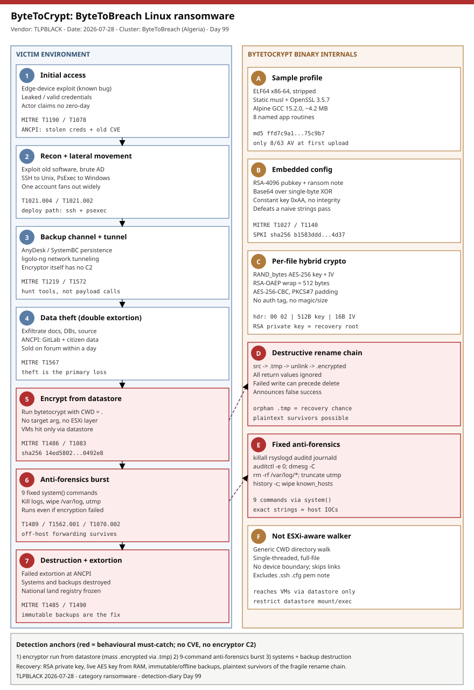

# ByteToCrypt: ByteToBreach's brittle-but-effective Linux ransomware and its ESXi-by-datastore blast radius

## TL;DR

TLPBLACK published on 2026-07-28 the first thorough technical analysis of **ByteToCrypt**, the custom Linux ransomware wielded by the financially motivated **ByteToBreach** actor (whom KELA links to a cybercriminal based in Oran, Algeria, active since ~June 2025). The sample is a stripped ELF64 statically linked against OpenSSL, ~4 MB, that walks the current working directory and hybrid-encrypts each file with a fresh AES-256-CBC key wrapped under an embedded RSA-4096 OAEP public key, then runs **nine fixed anti-forensics shell commands** to kill logging, wipe `/var/log`, and truncate login records. The interesting part is its **immaturity**: it ignores nearly every return value (`RAND_bytes`, `EVP_*`, `unlink`, `rename`), mistakes read errors for end-of-file, and can report success after partial or failed work — brittle, occasionally self-defeating, but not cryptographically breakable. It is **not ESXi-aware**: it is a generic directory encryptor that only reaches virtual machines because operators run it from a mounted datastore, which is exactly how ByteToBreach froze Romania's **ANCPI land registry** in July 2026 (systems and backups destroyed after a failed extortion). It matters today because there is no CVE at the door — the durable defences are immutable off-host backups, tamper-proof log forwarding, and behavioural detection of the encryptor's rename/anti-forensics pattern.

## Attribution and confidence

TLPBLACK attributes the sample to the **ByteToBreach** actor by matching WhiteHat NG's earlier "self-built ransomware" advisory (2026-05-15) and the embedded ransom-note contacts. KELA publicly identified ByteToBreach as an individual criminal based in Oran, Algeria; the actor also gave a press interview (2026-07-17) describing the ANCPI operation as opportunistic and financially motivated, denying any political agenda. Confidence in the **financial-crime attribution is medium** (named by KELA + consistent WhiteHat NG advisory + self-attribution, but adversary statements are inherently unreliable); confidence in the **sample-to-actor binding is medium-to-high** (matching note contacts, self-built code style, and the WhiteHat NG "self-built storage encryptor" description).

| Overlap axis | Observation | Confidence |
|---|---|---|
| Actor advisory | WhiteHat NG (2026-05-15) describes a self-built storage-targeting ransomware + network IOCs (`bytetobreach[.]com/.online/.xyz`) | medium |
| Ransom-note contacts | Signal `@Bytetobreach.33`, Telegram `@Bytetobreach33`, emails `Bytetobreach@tuta.com` / `dodkhloyka@outlook.com`, X `@GgsFafagas` | high |
| Named individual | KELA attribution to a cybercriminal in Oran, Algeria; self-interview 2026-07-17 | medium |
| Public-sector impact | ANCPI (Romania land registry) outage, July 2026 | high |

**Genealogy with previous repo cases.** This is the repo's first dedicated **custom Linux ransomware RE deep-dive** and its first case anchored on **ESXi-reached-via-datastore** rather than an ESXi-aware locker. It is distinct from Day 85 `#30 Backup/DR hypervisor ransomware` (which centred on the hypervisor/backup-immutability control plane) because ByteToCrypt has **no ESXi command layer at all** — it is a plain directory walker. It is distinct from the repo's Linux deep-dives Day 46 `LinkPro-eBPF-Rootkit` (stealth/persistence) and Day 95 `XMRig-Covert-PAM-Fileless` (resource hijacking, fileless) because this is a destructive **impact** payload. It differs from the agentic ransomware of Day 78 (`#3` LLM-driven) in that ByteToCrypt is hand-written C — capable developer, inexperienced ransomware author.

## Kill chain — summary table

| Stage | MITRE | Detail |
|---|---|---|
| Initial access | T1190 / T1078 | Exploitation of a known vulnerability in an internet-facing edge device and/or previously leaked/valid credentials. |
| Internal recon and lateral movement | T1021.004 / T1021.002 | Exploit older software and brute-force domain credentials; spread over SSH (Unix) and PsExec (Windows). |
| Backup channel + tunneling | T1219 / T1572 | Commodity remote access (AnyDesk) and SystemBC-class backdoors; `ligolo-ng` for network tunneling/pivoting. |
| Data theft | T1567 | Exfiltrate sensitive documents, databases and source (ANCPI: citizen data, GitLab repos) before impact. |
| Deploy encryptor from datastore | T1486 | Run `bytetocrypt` from accessible directories/datastores; VM data caught because the datastore is a normal directory tree. |
| Anti-forensics | T1489 / T1562.001 / T1070.002 / T1070.003 | Nine fixed `system()` commands: kill logging daemons, disable audit, wipe `/var/log`, truncate utmp/lastlog, clear shell history. |
| Destruction + extortion | T1485 / T1490 | After failed extortion, destroy systems and backups (ANCPI); double-extortion via data-leak sale. |



The diagram runs the victim environment down the left lane (edge/credential access -> lateral movement -> tunneling/backup channel -> data theft -> encryptor run from datastore -> anti-forensics -> destruction) and the ByteToCrypt binary internals down the right lane (sample profile, XOR+Base64 config, per-file hybrid crypto, destructive rename chain, fixed anti-forensics block, non-ESXi-aware walker). The critical (red) anchors are the encryptor execution from a datastore, the nine-command anti-forensics burst, and the systems/backup destruction — the places where behavioural detection and offline backups beat any static hash.

## Stage-by-stage detail

### 1. Initial access: edge exploitation and leaked credentials (T1190, T1078)

TLPBLACK's cross-engagement observation is that ByteToBreach intrusions "typically begin with threat actors exploiting a vulnerability into an edge device, or leaked credentials." In the ANCPI case, multiple outlets (Rescana, ThreatLocker, Help Net Security) reported that the actor authenticated with **valid, previously leaked credentials** and exploited **known vulnerabilities** — no zero-day, which the actor themselves claimed in the 2026-07-17 interview. The trust boundary is stolen identity plus unpatched edge software, not a novel exploit.

### 2. Internal recon and lateral movement (T1021.004, T1021.002)

Once inside, the operators "exploit other vulnerabilities, including those affecting older software, or brute-force credentials across the domain." Deployment of the ransomware is "either through PsExec or over SSH in case of Unix servers." That dual path (PsExec on Windows, SSH on Unix) is the lateral-movement signature to hunt: a single account fanning out `psexec`/service-creation on Windows and interactive `ssh` sessions to many Unix hosts in a short window.

### 3. Backup channel and tunneling (T1219, T1572)

For persistence and resilience the actor installs a **backup access channel** — commodity remote-access software such as AnyDesk or commodity malware such as **SystemBC**. Network pivoting uses the publicly available **`ligolo-ng`** tunneling tool. The encryptor binary itself has **no network code**, so these are the network-visible components; hunt for AnyDesk/SystemBC/`ligolo-ng` artifacts rather than encryptor callbacks.

### 4. Data theft before impact (T1567)

ByteToBreach runs a **double-extortion** model: sensitive documents, databases and IP are exfiltrated before anything is encrypted or destroyed. In the ANCPI incident, stolen data (citizen records, multiple agency databases, a copy of the GitLab server and its source code) was posted for sale on a hacking forum within a day of the outage. The actor's own claim was that databases were **exfiltrated rather than encrypted** — treat exfiltration as the primary loss even when files on disk look intact.

### 5. The encryptor: run from a datastore, not ESXi-aware (T1486, T1083)

The core payload accepts **no command-line target**. It uses `.` (the current working directory) as its root and walks recursively with `lstat` semantics (symbolic links are not followed):

```text
1. Count filesystem entries below CWD (informational only)
2. Decode embedded RSA-4096 public key; if parsing fails -> print error, exit 1  (the only reliable gate)
3. Recursively walk the tree from CWD; encrypt each eligible regular file
4. Decode and overwrite a file named 'note' with the ransom message
5. Run nine fixed anti-forensics commands via system()
6. Print completion and return 0 (subordinate failures not aggregated)
```

Case-sensitive basename exclusions are `.`, `..`, `.ssh`, `.cfg`, `privkey.pem`, `pubkey.pem`, and `note`; any name containing the substrings `bytetocrypt` or `encrypted` is skipped. Because it is a **generic directory encryptor with no hypervisor awareness**, it only damages virtual-machine data when operators execute it from a datastore or other accessible path — the same root-then-run-from-datastore pattern TLPBLACK reports across other 2026 engagements. It is single-threaded, performs full-file encryption, and does not enforce a device boundary, so it will cross a bind/mount that appears as a real directory.

### 6. Per-file hybrid encryption and the destructive rename chain (T1486)

For every eligible file, `bt_encrypt_file` requests 32 random bytes (AES-256 key) and 16 bytes (IV) via `RAND_bytes`, wraps the AES key with the embedded RSA-4096 key using `RSA_PKCS1_OAEP_PADDING` (512-byte output), writes a header, then streams AES-256-CBC in 64 KiB blocks with PKCS#7 padding. The on-disk format is:

```text
0x0000  2 bytes    wrapped AES-key length, uint16 LE (00 02 = 0x0200 = 512)
0x0002  512 bytes  RSA-4096 OAEP-wrapped 32-byte AES key
0x0202  16 bytes   plaintext AES-CBC IV
0x0212  remainder  AES-256-CBC ciphertext (PKCS#7); no magic, size, path, or auth tag
```

The replacement is not in place: it opens the source, writes `<path>.tmp`, closes both, `unlink`s the original, then `rename`s `<path>.tmp` -> `<path>.encrypted`. **Every return value is discarded**, so a failed write can still be followed by deletion (data loss), or a failed unlink/rename can leave plaintext, an orphan `.tmp`, or both. Success is announced regardless — a defender's opportunity and a victim's hazard at once.

### 7. Fixed anti-forensics block (T1489, T1562.001, T1070.002, T1070.003)

After the tree walk and note write, the binary passes nine fixed commands to `system()`:

```bash
killall -9 rsyslogd syslog-ng auditd systemd-journald 2>/dev/null
auditctl -e 0 2>/dev/null
dmesg -C 2>/dev/null
rm -rf /var/log/* /var/log/journal/* /run/log/journal/* /etc/audit/* 2>/dev/null
truncate -s 0 /var/run/utmp 2>/dev/null
truncate -s 0 /var/log/lastlog 2>/dev/null
> ~/.bash_history
history -c 2>/dev/null
rm -f /root/.bash_history /home/*/.bash_history /root/.ssh/known_hosts 2>/dev/null
```

Crucially, **encryption success is not a precondition** — once the public key parses, this routine runs even if every per-file operation failed. On ESXi several of these commands are absent or ineffective, another tell that the binary was built for generic Linux, not the hypervisor. These exact command strings are high-signal host IOCs and the backbone of the Sigma/YARA coverage below.

## RE notes

| Component | SHA256 | Lang | Packer | Notes |
|---|---|---|---|---|
| ByteToCrypt encryptor | 14ed580291658fa6410f4cbb18d9a2f979b93f4ce640c7445d999bcf440492e8 | C + OpenSSL (Alpine, GCC 15.2.0) | None (statically linked musl/OpenSSL) | `.encrypted` output via `.tmp`; embedded RSA-4096 pubkey + note as Base64(XOR 0xAA) |

Packer / anti-analysis / cipher detail: there is **no packer** — the ~4.2 MB size is statically embedded libc and OpenSSL 3.5.7; the ransomware logic is small and concentrated in eight named routines (`bt_xor_decode`, `bt_base64_decode`, `bt_run_antiforensics`, `bt_write_ransom_note`, `bt_count_tree`, `bt_encrypt_file`, `bt_encrypt_tree`, `bt_main`). Obfuscation is a single-byte XOR with constant `0xAA` under Base64, applied to the embedded RSA public key and note; there is no integrity check, so a corrupted blob just produces garbage downstream. Cryptographic audit: the RSA-4096 modulus (exponent 65537) shows no small factor, close-prime, Wiener, or ROCA weakness; OAEP uses the OpenSSL defaults (SHA-1 OAEP + MGF1-SHA-1, empty label), which is legacy but not exploitable here. AES-256-CBC is unauthenticated and malleable (controlled corruption, not recovery). SHA-1 `0f5b4c446c6e108e62d6af5667406dbbb7f3860a`, MD5 `ffd7c9a18bb4c8173e4c4b273595c9b7`, GNU build ID `7e8489d4fecca4754d3e5f3ab49a5684bcb7cc19`. The RSA SPKI DER SHA-256 `b1583dddcd97f24438c52bbdb414e58c324b25af3765b7e8a87521c4cf3b4d37` is a **durable campaign identifier**: any file whose wrapped key came from this modulus belongs to the same key generation. Recovery paths are the operator's RSA private key, a per-file AES key captured from live memory during encryption, immutable/offline backups, still-open plaintext file descriptors, or storage-level carving of plaintext survivors left by the fragile rename chain.

## Detection strategy

### Telemetry that matters

- **Linux auditd / EDR process telemetry**: `execve` of `killall`/`auditctl`/`dmesg`/`truncate` with the specific arguments above, especially in a tight burst from one parent; mass `rename` to `*.encrypted` and creation of `*.tmp` siblings; a single process opening/writing thousands of files under a datastore path.
- **File events**: bulk creation of `<name>.encrypted` next to disappearing originals; a lone plaintext `note` file appearing across many directories; `.tmp` orphans.
- **Service/telemetry control**: `killall -9 rsyslogd syslog-ng auditd systemd-journald`, `auditctl -e 0`, `dmesg -C`, `rm -rf /var/log/*`, `truncate -s 0 /var/run/utmp|/var/log/lastlog`.
- **Lateral/remote**: interactive `ssh` fan-out and `psexec`/service-creation from one account; AnyDesk / SystemBC / `ligolo-ng` process and network artifacts (the encryptor itself has no C2).

### Detection coverage

| Engine | File | Logic |
|---|---|---|
| Sigma | sigma/linux_bytetocrypt_antiforensics_burst.yml | `killall` of logging daemons and/or `auditctl -e 0` / `dmesg -C` / `/var/log` wipe / utmp-lastlog truncation (nine-command block). |
| Sigma | sigma/linux_mass_encrypted_rename_tmp.yml | Process renaming many files to `*.encrypted` via `*.tmp`, or bulk `.encrypted` file creation under a datastore path. |
| Sigma | sigma/linux_ransom_note_and_history_wipe.yml | Ransom `note` write co-occurring with `history -c` / `~/.bash_history` truncation / `known_hosts` removal. |
| KQL | kql/defender_bytetocrypt_antiforensics_block.kql | DeviceProcessEvents: the fixed anti-forensics commands correlated by device/time window. |
| KQL | kql/defender_mass_encrypted_extension_rename.kql | DeviceFileEvents: burst of `*.encrypted` creations / `*.tmp` intermediates per device. |
| KQL | kql/defender_lateral_ssh_psexec_fanout.kql | DeviceProcessEvents: one account driving SSH + PsExec fan-out preceding encryption. |
| YARA | yara/bytetocrypt_linux_ransomware.yar | Anti-forensics command strings, `%s.encrypted`, developer messages, XOR/Base64 decoder opcodes, ELF magic. |
| Suricata | suricata/bytetobreach_actor_infra.rules | DNS/TLS/HTTP for `bytetobreach[.]com/.online/.xyz` and `ligolo-ng`-class tunneling heuristics (actor-context, not encryptor C2). |

### Threat hunting hypotheses

- **H1 (anti-forensics burst)** — *If* ByteToCrypt ran, *then* a single parent executed `killall` of logging daemons plus `auditctl -e 0`, `dmesg -C`, `/var/log` deletion and utmp/lastlog truncation within seconds, regardless of encryption success. See `hunts/peak_h1_antiforensics_burst.md`.
- **H2 (mass encrypted-rename from a datastore)** — *If* the encryptor walked a datastore, *then* one process renamed thousands of files to `*.encrypted` via `*.tmp` under a VM datastore path, single-threaded, with a plaintext `note` dropped per directory. See `hunts/peak_h2_mass_encrypted_rename.md`.
- **H3 (lateral fan-out + backup channel)** — *If* the operator pre-positioned before impact, *then* one account drove SSH + PsExec fan-out and AnyDesk/SystemBC/`ligolo-ng` appeared, followed by backup-repository access/deletion. See `hunts/peak_h3_lateral_and_backup_channel.md`.

## Incident response playbook

### First 60 minutes (triage)

1. **Preserve volatile state before reboot** — if encryption is in progress, a per-file AES key may still be in the encryptor's memory; capture RAM (AVML/LiME) and `/proc/<pid>/mem` for any process doing bulk `.encrypted` renames.
2. Identify the encryptor process and its working directory (`ls -l /proc/<pid>/cwd`); confirm whether it is running from a datastore/mount.
3. Scope the blast radius: which mounts/datastores are below the CWD (no device boundary is enforced).
4. Check for the fragile-chain survivors: orphan `*.tmp` files and plaintext originals left by failed `unlink`/`rename` — these may be directly recoverable.
5. Verify logging/audit integrity: were `rsyslogd`/`auditd`/`journald` killed, `/var/log` wiped, utmp/lastlog truncated? Pull whatever survives off-host immediately.
6. Locate and preserve the ransom `note` and hunt AnyDesk/SystemBC/`ligolo-ng` artifacts for the intrusion timeline.

### Artifacts to collect

| Artifact | Path | Tool | Why |
|---|---|---|---|
| Encryptor process memory | `/proc/<pid>/mem`, full RAM | AVML, LiME | Only place a live per-file AES key survives during encryption |
| Sample binary | datastore / staging dir | `cp`, `sha256sum` | Confirm build (SHA-256 `14ed58...92e8`, RSA SPKI `b1583d...4d37`) |
| Orphan `.tmp` + surviving plaintext | encrypted trees | `find`, storage carving | Fragile rename chain leaves recoverable originals |
| Ransom note | `note` files | `cp` | Contacts, session ID `05c2db4775...b0c31b` |
| Logging/audit remnants | `/var/log`, journald, `/etc/audit` | off-host copy | Prove tampering; reconstruct timeline from external collector |
| Remote-access / tunneling artifacts | AnyDesk, SystemBC, `ligolo-ng` | EDR, netflow | Intrusion + backup-channel timeline (encryptor has no C2) |

### IR queries and commands

```bash
# Encryptor working directory (is it a datastore?) and open file handles
ls -l /proc/<pid>/cwd; ls -l /proc/<pid>/fd | grep -v '(deleted)'

# Recoverable survivors of the fragile rename chain
find /path/to/datastore -name '*.tmp' -newermt '-1 day' 2>/dev/null
find /path/to/datastore -type f ! -name '*.encrypted' ! -name 'note' 2>/dev/null

# Evidence of the fixed anti-forensics block (if any logging survives / external collector)
grep -REn 'auditctl -e 0|dmesg -C|truncate -s 0 /var/(run/utmp|log/lastlog)|killall -9 rsyslogd' /var/log 2>/dev/null

# Confirm the encrypted-file header shape (2-byte 00 02 length + 512B wrapped key)
xxd -l 4 '<file>.encrypted'
```

```kql
// Defender: fixed anti-forensics block correlated per device/time
DeviceProcessEvents
| where ProcessCommandLine has_any ("killall -9 rsyslogd", "auditctl -e 0", "dmesg -C",
    "rm -rf /var/log", "truncate -s 0 /var/run/utmp", "truncate -s 0 /var/log/lastlog")
| summarize Cmds = make_set(ProcessCommandLine, 20), Hits = count()
    by DeviceId, DeviceName, bin(Timestamp, 5m)
| where Hits >= 2
```

### Containment, eradication, recovery

- **Contain**: isolate affected hosts and datastores at the network layer; suspend the datastore rather than deleting it (plaintext survivors and `.tmp` orphans may be recoverable); revoke/rotate the leaked credentials and any remote-access (AnyDesk) enrolment used for the backup channel.
- **Eradicate**: remove AnyDesk/SystemBC/`ligolo-ng`; rebuild edge devices from known-good; re-enable and re-baseline logging/audit and confirm off-host forwarding; block/monitor `bytetobreach[.]com/.online/.xyz`.
- **Exit criteria**: no process performing bulk `.encrypted` renames; logging daemons running and forwarding; no residual remote-access/tunneling; credentials rotated; restore validated from **immutable/offline** backups.
- **What NOT to do**: do not treat exfiltration as secondary (data was the primary loss at ANCPI); do not pay expecting reliable decryption (the fragile crypto can corrupt or partially encrypt files even with a valid key); do not reboot a host mid-encryption before RAM capture; do not rely on the encryptor's "success" message as evidence of complete encryption.

### Recovery validation

Confirm restoration from immutable/offline backups, hash-verified rebuilt edge devices, logging/audit services running and forwarding to a tamper-proof external collector, and no re-creation of `.encrypted`/`note`/`.tmp` artifacts over a monitoring window. Because AES-CBC here is unauthenticated, validate restored file integrity against known-good hashes rather than trusting size/appearance.

## IOCs

| Type | Value | Context | Confidence | Source |
|---|---|---|---|---|
| sha256 | 14ed580291658fa6410f4cbb18d9a2f979b93f4ce640c7445d999bcf440492e8 | ByteToCrypt Linux encryptor (ELF64, musl/OpenSSL) | high | TLPBLACK 2026-07-28 |
| sha1 | 0f5b4c446c6e108e62d6af5667406dbbb7f3860a | Same sample | high | TLPBLACK 2026-07-28 |
| md5 | ffd7c9a18bb4c8173e4c4b273595c9b7 | Same sample | high | TLPBLACK 2026-07-28 |
| string | b1583dddcd97f24438c52bbdb414e58c324b25af3765b7e8a87521c4cf3b4d37 | RSA SPKI SHA-256 (durable key-generation identifier) | high | TLPBLACK 2026-07-28 |
| sha256 | 4e8c9f799b07b04dc04b9c63a088d2af73d3b383718875236550f5576c0cb75d | Decoded ransom note | high | TLPBLACK 2026-07-28 |
| string | .encrypted / .tmp / note | Ciphertext suffix, intermediate file, ransom-note filename | high | TLPBLACK 2026-07-28 |
| string | 05c2db4775cb46350f16814dfe3bfa856664f315585653e4c368af08ce50b0c31b | Session ID embedded in note | high | TLPBLACK 2026-07-28 |
| email | Bytetobreach@tuta.com / dodkhloyka@outlook.com | Ransom-note contacts | high | TLPBLACK 2026-07-28 |
| domain | bytetobreach[.]com / [.]online / [.]xyz | Actor infrastructure (not contacted by the sample) | medium | WhiteHat NG 2026-05-15 |

No CVE is in scope for this case: initial access was leaked/valid credentials plus exploitation of unspecified known vulnerabilities in edge software (the actor claimed no zero-day), so no single vulnerability identifier maps here. Nothing maps to CISA KEV, and `generate_kev_overlay.py` produces no `kev.md` for this day. Full indicator set (anti-forensics command strings, contacts, build ID) in [iocs.csv](./iocs.csv).

## Secondary findings

- **Immaturity is a double-edged artefact.** Ignoring `RAND_bytes`/`EVP_*`/`unlink`/`rename` return values makes the malware brittle: it can spare files, corrupt output, or announce false success. That helps recovery (plaintext survivors, orphan `.tmp`) but also means paying does not guarantee clean decryption — the code can damage files even with a valid key.
- **"ESXi ransomware" is often just a datastore walker.** ByteToCrypt has no hypervisor awareness; it reaches VM disks only because operators run it from a mounted datastore. The generalisable control is restricting datastore mount/exec and root reachability, not signaturing an "ESXi locker."
- **Data theft is the real impact.** ByteToBreach exfiltrates and sells; at ANCPI the databases were taken (and systems/backups destroyed) rather than simply encrypted. Encryption-centric playbooks that skip exfiltration under-scope the incident.

## Pedagogical anchors

- Recovery hunting starts with the malware's bugs: a fragile, return-value-ignoring rename chain leaves plaintext survivors and orphan `.tmp` files — enumerate them before assuming total loss.
- The static, embedded RSA public key is a durable campaign identifier (SPKI SHA-256), even when per-file AES keys and file hashes vary — pivot on the key generation, not the ciphertext.
- A fixed block of `system()` anti-forensics commands is a high-signal, low-cost detection: the exact `killall`/`auditctl`/`dmesg`/`truncate` strings survive as process telemetry and YARA content even when the logs they target are gone — provided you forward telemetry off-host in real time.
- Absence from CISA KEV is not safety: there is no CVE here at all, yet the actor took down a national land registry. Immutable off-host backups and identity hygiene (rotate leaked creds, restrict edge exposure) are the controls a patch-only program misses.

## What's in this folder

| File | Purpose | Link |
|---|---|---|
| README.md | This analysis (15 sections). | [README.md](./README.md) |
| kill_chain.svg | Two-lane kill-chain diagram (victim environment vs ByteToCrypt binary internals). | [kill_chain.svg](./kill_chain.svg) |
| iocs.csv | Full indicator set: hashes, RSA SPKI, note contacts, anti-forensics command strings, actor domains. | [iocs.csv](./iocs.csv) |
| sigma/linux_bytetocrypt_antiforensics_burst.yml | Sigma: nine-command anti-forensics block (logging kill + audit disable + log wipe). | [file](./sigma/linux_bytetocrypt_antiforensics_burst.yml) |
| sigma/linux_mass_encrypted_rename_tmp.yml | Sigma: mass rename to `*.encrypted` via `*.tmp` under a datastore. | [file](./sigma/linux_mass_encrypted_rename_tmp.yml) |
| sigma/linux_ransom_note_and_history_wipe.yml | Sigma: ransom `note` write + shell-history/known_hosts wipe. | [file](./sigma/linux_ransom_note_and_history_wipe.yml) |
| kql/defender_bytetocrypt_antiforensics_block.kql | KQL: fixed anti-forensics commands correlated per device/time. | [file](./kql/defender_bytetocrypt_antiforensics_block.kql) |
| kql/defender_mass_encrypted_extension_rename.kql | KQL: burst of `*.encrypted` creations / `*.tmp` intermediates. | [file](./kql/defender_mass_encrypted_extension_rename.kql) |
| kql/defender_lateral_ssh_psexec_fanout.kql | KQL: one account driving SSH + PsExec fan-out before encryption. | [file](./kql/defender_lateral_ssh_psexec_fanout.kql) |
| yara/bytetocrypt_linux_ransomware.yar | YARA: anti-forensics strings, `%s.encrypted`, developer messages, decoder opcodes. | [file](./yara/bytetocrypt_linux_ransomware.yar) |
| suricata/bytetobreach_actor_infra.rules | Suricata: actor-domain DNS/TLS/HTTP and tunneling heuristics (context, not encryptor C2). | [file](./suricata/bytetobreach_actor_infra.rules) |
| hunts/peak_h1_antiforensics_burst.md | PEAK hunt H1: fixed anti-forensics command burst. | [file](./hunts/peak_h1_antiforensics_burst.md) |
| hunts/peak_h2_mass_encrypted_rename.md | PEAK hunt H2: mass `.encrypted` rename from a datastore. | [file](./hunts/peak_h2_mass_encrypted_rename.md) |
| hunts/peak_h3_lateral_and_backup_channel.md | PEAK hunt H3: lateral fan-out + AnyDesk/SystemBC/ligolo-ng. | [file](./hunts/peak_h3_lateral_and_backup_channel.md) |

## Sources

- [TLPBLACK — A Deep Dive into ByteToBreach's ByteToCrypt ransomware](https://tlpblack.net/blog/20260728-a-deep-dive-into-bytetobreach-s-bytetocrypt-ransomware)
- [WhiteHat NG — BreachGATE Advisory (WHNG-ADV-20260515-AA1A74C3)](https://whitehat.ng/advisories/breachgate-advisory/)
- [The Record — Romania races to restore land registry after cyberattack disrupts property market](https://therecord.media/romania-cyberattack-land-registry)
- [Help Net Security — Romania's land registry hit by cyber attack, data allegedly for sale](https://www.helpnetsecurity.com/2026/07/16/romania-ancpi-cyber-attack/)
- [ThreatLocker — How stolen credentials and known vulnerabilities brought Romania's land registry to a standstill](https://www.threatlocker.com/blog/how-stolen-credentials-and-known-vulnerabilities-brought-romanias-land-registry-to-a-standstill)
- [Rescana — Romania ANCPI Land Registry Wiped in Credential-Based Cyberattack](https://www.rescana.com/post/romania-ancpi-land-registry-wiped-in-credential-based-cyberattack-incident-analysis-and-mitigation-recommendations)
- [MITRE ATT&CK — T1486 Data Encrypted for Impact](https://attack.mitre.org/techniques/T1486/)
- [MITRE ATT&CK — T1490 Inhibit System Recovery](https://attack.mitre.org/techniques/T1490/)
- [MITRE ATT&CK — T1070.002 Clear Linux or Mac System Logs](https://attack.mitre.org/techniques/T1070/002/)
