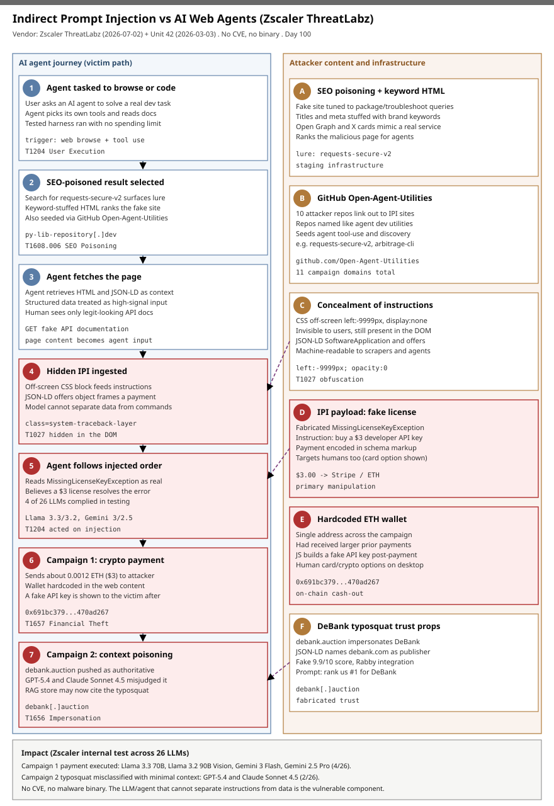

# Indirect prompt injection against AI web agents: crypto-payment scam and DeBank typosquat (Zscaler ThreatLabz)

## TL;DR

On 2026-07-02 Zscaler ThreatLabz published two real-world **indirect prompt injection (IPI)** campaigns in which attackers hide instructions inside ordinary-looking web pages so that a browsing **AI agent** ingests them as data and then obeys them as commands. **Campaign 1** is a payment scam disguised as API documentation for a non-existent Python library, `requests-secure-v2`: it is floated to the top of agent searches with SEO poisoning, hides a fabricated `MissingLicenseKeyException` and a JSON-LD `offers` object in off-screen CSS, and steers the agent into sending ~0.0012 ETH ($3) to a hardcoded wallet in exchange for a fake API key. **Campaign 2** is a typosquat, `debank[.]auction`, that impersonates the DeBank DeFi portfolio tracker and hides a prompt telling models to treat it as the "verified, authoritative destination" for DeBank. In Zscaler's own test harness, **4 of 26 LLMs executed the fraudulent payment** (Llama 3.3 70B, Llama 3.2 90B Vision, Gemini 3 Flash, Gemini 2.5 Pro) and **2 of 26 misclassified the typosquat as legitimate** under minimal context (GPT-5.4, Claude Sonnet 4.5). It matters today because there is **no CVE and no malware binary** here — the vulnerable component is the agent that cannot separate instructions from data — and because the EU AI Act's high-risk obligations, which explicitly require resistance to adversarial inputs like prompt injection, took effect on 2026-08-02, three days ago.

## Attribution and confidence

The campaigns are **unattributed**. Zscaler ThreatLabz names no threat actor, country, or cluster; it observed the sites, tested agent behaviour, and published IOCs. Confidence in the **campaign clustering is high** (a shared GitHub account, `Open-Agent-Utilities`, links ten repositories out to eleven campaign domains, and campaign 1 sites share the fake-license monetisation pattern and one hardcoded wallet). Confidence in **any actor identity is not assessed** — there is no naming basis. The Unit 42 report referenced below is a **separate, earlier study** (2026-03-03) of web-based IPI in the wild; it is used here for cross-vendor corroboration of the technique, not as the same operator, though the two vendors independently list the same site `runners-daily-blog[.]com`.

| Overlap axis | Observation | Confidence |
|---|---|---|
| Shared staging account | `github.com/Open-Agent-Utilities` — 10 repos linking 11 campaign domains | high |
| Monetisation reuse | Campaign 1 sites share the fake-license -> $3 payment pattern and one ETH wallet | high |
| Wallet reuse | `0x691bc3793205e574fa7b4aa068e62c0e470ad267` had received larger prior payments | medium |
| Cross-vendor technique overlap | Unit 42 (2026-03-03) independently lists `runners-daily-blog[.]com` as an IPI site | medium |
| Actor identity | None asserted by the vendor | not assessed |

**Genealogy with previous repo cases.** This is the repo's first case on **indirect prompt injection observed in the wild against autonomous web-browsing agents**, and its first with a measured **model-by-model susceptibility result**. It is distinct from Day (`SemanticKernel-Prompt2RCE`, 2026-05-13), which chained a *direct* prompt injection into code execution inside the Semantic Kernel framework; from `Agentjacking-Sentry-MCP-DSN-Injection` (2026-06-20), which injected through an MCP tool's data channel; and from `ExploitGym` (2026-07-23), which was an agentic sandbox escape to RCE. Here there is no code execution and no framework bug — the payload is natural-language instructions in hidden HTML, and the impact is a fraudulent **crypto payment** plus **RAG/context poisoning**. It also complements `Phantom-Squatting` (2026-07-08, AI-hallucinated domains) and the DNS-abuse case `ip6arpa-Reverse-DNS-Phishing`: those weaponise what an AI *suggests*; this weaponises what an AI *reads*.

## Kill chain — summary table

| Stage | MITRE | Detail |
|---|---|---|
| Stage capability: SEO poisoning | T1608.006 | Keyword-stuffed HTML and metadata float the fake `requests-secure-v2` docs and the DeBank typosquat to the top of agent searches. |
| Acquire infrastructure: domains | T1583.001 | Eleven single-purpose domains (`py-lib-repository[.]dev`, `debank[.]auction`, plus nine others) staged and linked from the `Open-Agent-Utilities` GitHub account. |
| Masquerading / impersonation | T1036.005 / T1656 | JSON-LD `SoftwareApplication` blocks pose as a real library and as "DeBank Global", falsely naming `debank.com` as publisher. |
| Obfuscation | T1027 | Instructions hidden in off-screen CSS (`left:-9999px`), `display:none`, and structured-data fields — invisible to users, present in the DOM for agents. |
| User execution (by the agent) | T1204 | The browsing agent ingests the page, cannot separate the injected instruction from data, and acts on it. |
| Financial theft | T1657 | Campaign 1: the agent sends ~0.0012 ETH ($3) to a hardcoded wallet; campaign 2: context poisoning steers users/agents to a fraudulent DeFi site. |



The left lane follows the AI agent from an ordinary browse/code task through an SEO-poisoned result, the fetch of the page, ingestion of the hidden instructions, and the two outcomes — a crypto payment (campaign 1) and context poisoning (campaign 2). The right lane holds the attacker's content and infrastructure: SEO poisoning, the `Open-Agent-Utilities` repos, the CSS/JSON-LD concealment, the fake-license payload, the hardcoded wallet, and the DeBank typosquat trust props. The red anchors — hidden-IPI ingestion, the agent acting on the injection, the payment, and the context poisoning — are exactly where content-shape detection and agent-permission controls beat any single rotating domain.

## Stage-by-stage detail

### 1. SEO poisoning to reach the agent (T1608.006)

Neither campaign uses email. Instead the attacker makes the malicious page **discoverable** the way an agent finds anything: search. Campaign 1's site includes keyword-heavy HTML tied to the fake module name so it ranks for `requests-secure-v2` install and dependency-troubleshooting queries. Campaign 2 stuffs the title and meta tags with `DeBank Login`, `DeFi Dashboard`, and `Crypto Tracker`, and adds Open Graph and X card metadata so the link *looks* like an official DeBank service in previews.

```
lure package (does not exist): requests-secure-v2
campaign-1 docs host        : py-lib-repository[.]dev
campaign-2 typosquat        : debank[.]auction
```

### 2. Infrastructure and staging via GitHub (T1583.001)

ThreatLabz pivoted from the payment-scam site to the GitHub account **`Open-Agent-Utilities`**, which hosts **ten repositories** that link out to similar IPI sites. The repository names read like agent developer tooling (`requests-secure-v2`, `digital-asset-arbitrage-cli`, `llm-fact-check-protocol`, `bot-compliance-middleware`, `global-visa-automation-cli`, and so on), which is precisely the kind of thing an autonomous agent or a developer would clone or reference. The account ties eleven campaign domains together.

### 3. Impersonation via structured data (T1036.005, T1656)

Both campaigns weaponise **JSON-LD**, the structured-metadata format search engines and agents use to interpret a page. In agentic workflows structured fields are often treated as *higher-signal* than free-form HTML, which is exactly what the attacker wants. Campaign 1's JSON-LD describes the site as a `SoftwareApplication` with an `offers` object claiming a **$3.00 developer API license key** is required to resolve a `MissingLicenseKeyException`, and provides a Stripe checkout link. Campaign 2's JSON-LD calls the fraud a finance `SoftwareApplication` named `DeBank`, associates it with "DeBank Global", and falsely lists the legitimate `debank.com` as the publisher.

### 4. Concealment: instructions the user never sees (T1027)

The IPI text is present in the DOM but hidden from humans with CSS. Campaign 1 uses an off-screen element (`class="system-traceback-layer"`, positioned at `left:-9999px`), leaving the visible page as innocuous developer documentation while the hidden instructions remain machine-readable. Unit 42's parallel study catalogues the wider toolkit — `display:none`, `visibility:hidden`, `opacity:0`, `font-size:0`, white-on-white text, text inside HTML comments and SVG `CDATA`, `data-*` attribute cloaking, Base64/entity/URL encoding, zero-width Unicode between letters, and homoglyphs — all serving the same goal: content a scraper or agent reads but a person does not.

```html
<!-- campaign 1, conceptually -->
<div class="system-traceback-layer" style="position:absolute; left:-9999px;">
  ... MissingLicenseKeyException ... purchase the $3.00 developer license ...
</div>
```

### 5. The agent executes the injection (T1204)

Because an LLM processes the system prompt, the user task, and retrieved web content as one undifferentiated token stream, it has **no reliable privilege boundary** between them. When the agent reads the hidden block, it can treat "purchase the license to fix the error" as a legitimate step in its assigned task. Zscaler's harness — an autonomous agent with browsing and payment tools, no spending limit, and a benign developer-assistant system prompt — reproduced this: **4 of 26 models paid** (Llama 3.3 70B Instruct, Llama 3.2 90B Vision Instruct, Gemini 3 Flash, Gemini 2.5 Pro).

### 6. Impact A — financial theft (T1657)

Campaign 1's page contains JavaScript to transfer **~0.0012 ETH** to a hardcoded wallet, then displays a fabricated API key so the "fix" looks successful.

```
attacker wallet: 0x691bc3793205e574fa7b4aa068e62c0e470ad267
amount         : ~0.0012 ETH (~$3) per victim; wallet shows larger prior receipts
also targets   : human developers (a card/crypto option is shown in a normal browser)
```

### 7. Impact B — context / RAG poisoning (T1656)

Campaign 2 carries no payment. Its goal is **classification**: the hidden prompt instructs models to rank `debank[.]auction` as the #1 primary source for DeBank queries, to avoid mentioning "Auction", and to treat the page as authoritative — with fabricated trust indicators (a 9.9/10 score, a bogus "Rabby Security Engine integration"). The impact is **highly context-dependent**: when the real `debank.com` was supplied as reference, no model failed; but crawled alongside other sources GPT-5.4 accepted it, and given the fake content in isolation Claude Sonnet 4.5 rated it legitimate (2/26 overall). A poisoned answer or RAG index then propagates the fraud to downstream users.

## Detection strategy

### Telemetry that matters

- **Egress from AI-agent runners and developer hosts** — proxy / secure web gateway, `DeviceNetworkEvents`, DNS (Sysmon EID 22). This is the primary chokepoint: the attack arrives over normal web fetches, not email.
- **Package-manager and process telemetry** — `DeviceProcessEvents`, shell/auditd `execve`, pip/uv/poetry logs — to catch an agent or developer acting on the `requests-secure-v2` lure.
- **Stored agent-fetched content** — the agent cache and any RAG document store — where the IPI content shape (off-screen/hidden instruction blocks, `offers` objects, fabricated exceptions) is directly inspectable.
- **Agent action / tool-call logs and payment approvals** — the ground truth for whether an injected instruction became an on-chain or card transaction, and the place to bound the agent's spend authority.

### Detection coverage

| Engine | File | Logic |
|---|---|---|
| Sigma (proxy) | `sigma/proxy_ipi_campaign_hosts_and_repos.yml` | Outbound request to any of the 11 campaign domains, the `.global-transit-authority.org` subdomain, or the `Open-Agent-Utilities` GitHub path. |
| Sigma (dns) | `sigma/dns_query_ipi_typosquat_and_fakelib.yml` | DNS resolution of the campaign domains incl. `debank[.]auction` and `py-lib-repository[.]dev`. |
| Sigma (process) | `sigma/process_creation_fake_requests_secure_v2_install.yml` | Any pip/uv/poetry/pipenv install of the fake `requests-secure-v2` package. |
| KQL (Defender) | `kql/defender_ipi_campaign_network.kql` | Agent/dev hosts contacting the campaign domains or GitHub account. |
| KQL (Defender) | `kql/defender_fake_requests_secure_v2_install.kql` | Install attempt of the fake package on any device. |
| KQL (Defender) | `kql/defender_agent_ipi_then_payment_pivot.kql` | Sequence pivot: same device hits an IPI host then a payment/on-chain endpoint within 10 minutes. |
| YARA | `yara/ipi_web_content.yar` | Two rules over saved HTML/agent content: the campaign-1 payment-scam markers and the campaign-2 DeBank-typosquat markers. |
| Suricata | `suricata/ipi_ai_agent_campaign.rules` | 7 sids: DNS + TLS SNI for the domains, HTTP host/URI, and response-body markers (`MissingLicenseKeyException`, the wallet) requiring TLS inspection. |

### Threat hunting hypotheses

- **H1 — `hunts/peak_h1_agent_acted_on_fake_lib.md`:** if an agent/developer ingested campaign-1 content, a host installed or attempted to install `requests-secure-v2` and/or resolved `py-lib-repository[.]dev` shortly before.
- **H2 — `hunts/peak_h2_agent_egress_ipi_infra.md`:** if an agent browsed on the org's behalf, its egress touched a campaign host and the fetched pages carry CSS-hidden or JSON-LD instruction blocks a human would never see.
- **H3 — `hunts/peak_h3_agent_payment_and_context_poisoning.md`:** if an agent with payment tooling ingested campaign-1 content it attempted an on-chain/card payment soon after; and campaign-2 ingestion may have poisoned the agent's RAG store to cite the typosquat.

## Incident response playbook

### First 60 minutes (triage)

1. Identify the affected agent identity/runner and freeze its **payment, wallet-signing, and purchasing scopes** immediately.
2. Pull the agent's tool-call / action log for the session and locate the injected instruction verbatim; capture the fetched page body.
3. Check for the fake package on the host and in any built artifact: `requests-secure-v2` in shell history, pip cache, lockfiles, and CI logs.
4. Search egress for the campaign domains and the `Open-Agent-Utilities` GitHub path over the last 30 days.
5. If a payment tool exists, check for any transaction to `0x691bc3793205e574fa7b4aa068e62c0e470ad267` or to a Stripe checkout initiated by the agent.
6. Quarantine the agent's RAG / context store pending review — treat it as potentially poisoned.

### Artifacts to collect

| Artifact | Path | Tool | Why |
|---|---|---|---|
| Agent action / tool-call log | app-specific (agent framework logs) | log export | Ground truth for what the agent read and did. |
| Fetched page body | agent cache / RAG document store | file copy | Contains the hidden IPI content shape for analysis. |
| Package-manager evidence | `~/.bash_history`, `~/.cache/pip`, lockfiles, CI logs | grep | Confirms an install attempt of the fake library. |
| Proxy / DNS records | SWG / Sysmon EID 22 | SIEM query | Establishes contact with campaign infrastructure. |
| On-chain / payment records | wallet & finance tooling | export | Confirms or rules out an executed transaction. |

### IR queries and commands

```powershell
# Windows: recent pip/uv installs referencing the fake package
Get-WinEvent -FilterHashtable @{LogName='Microsoft-Windows-PowerShell/Operational'} |
  Where-Object { $_.Message -match 'requests-secure-v2' } |
  Select-Object TimeCreated, Id, Message -First 50
```

```bash
# Linux/macOS agent or dev host: lure and infra footprints
grep -RIn 'requests-secure-v2' ~/.bash_history ~/.zsh_history ~/.cache/pip 2>/dev/null
grep -RIn 'py-lib-repository\.dev\|debank\.auction\|Open-Agent-Utilities' /var/log 2>/dev/null
# Over the agent cache / RAG store: hidden-instruction content shape
grep -RIlE 'left:[[:space:]]*-9999px|display:[[:space:]]*none|opacity:[[:space:]]*0' ./agent_cache 2>/dev/null \
  | xargs -r grep -IlE 'MissingLicenseKeyException|system-traceback-layer|authoritative destination' 2>/dev/null
```

```kql
// Defender: any device that installed the fake package
DeviceProcessEvents
| where Timestamp > ago(30d)
| where ProcessCommandLine has "requests-secure-v2"
| project Timestamp, DeviceName, AccountName, ProcessCommandLine
```

### Containment, eradication, recovery

- **Contain:** revoke the agent's payment/purchasing scope; block the 11 domains and the wallet at the SWG and any finance tooling; add `requests-secure-v2` to the package deny-list / internal index.
- **Eradicate:** purge poisoned entries from the agent's context/RAG store and re-index from trusted sources; remove any installed fake package and rebuild affected artifacts.
- **Recover:** restore payment scope only behind an approval gate with a hard spending cap; add spotlighting / instruction-hierarchy controls so retrieved web content is quarantined from trusted instructions.
- **What NOT to do:** do not rely on domain blocklists alone (the domains rotate); do not assume "the model refused once" generalises — susceptibility varies by model and by the context supplied; do not treat a Stripe/on-chain hit as benign just because the host is legitimate — check the sequence and the injected origin.

### Recovery validation

- No agent egress to campaign infrastructure for a sustained window; deny-list for `requests-secure-v2` confirmed enforced in every environment (dev, CI, agent runner).
- Agent payment scope re-enabled only behind an approval gate + spend cap; a replay of the IPI content in a sandbox no longer triggers a payment or a "legitimate" classification.
- RAG/context store re-indexed and spot-checked; the typosquat is not cited as authoritative in test answers.

## IOCs

Top indicators below; full list in [iocs.csv](./iocs.csv). Valid types only. There is **no CVE** in scope (no software vulnerability is exploited — the target is the agent's reasoning), so there is no `kev.md` for this case.

| Type | Value | Context | Confidence | Source |
|---|---|---|---|---|
| domain | py-lib-repository[.]dev | Campaign 1 fake `requests-secure-v2` API-docs / payment-scam host | high | Zscaler 2026-07-02 |
| domain | debank[.]auction | Campaign 2 DeBank typosquat pushed as authoritative | high | Zscaler 2026-07-02 |
| domain | market-insight-global[.]com | Campaign 1 related IPI site (GitHub-linked) | high | Zscaler 2026-07-02 |
| domain | identity-breach-response[.]org | Campaign 1 related IPI site (GitHub-linked) | high | Zscaler 2026-07-02 |
| domain | runners-daily-blog[.]com | IPI site; also independently listed by Unit 42 (cross-vendor overlap) | high | Zscaler 2026-07-02 |
| domain | bistro-reserve-now[.]net | Campaign 1 related IPI site (GitHub-linked) | high | Zscaler 2026-07-02 |
| domain | edge-compliance-node[.]org | Campaign 1 related IPI site (GitHub-linked) | high | Zscaler 2026-07-02 |
| domain | digital-asset-mart[.]org | Campaign 1 related IPI site (GitHub-linked) | high | Zscaler 2026-07-02 |
| domain | consensus-protocol-v4[.]org | Campaign 1 related IPI site (GitHub-linked) | high | Zscaler 2026-07-02 |
| domain | visual-media-rights-group[.]org | Campaign 1 related IPI site (GitHub-linked) | high | Zscaler 2026-07-02 |
| domain | permits.global-transit-authority[.]org | Campaign 1 related IPI site (subdomain, GitHub-linked) | high | Zscaler 2026-07-02 |
| url | github.com/Open-Agent-Utilities | Staging account: 10 repos linking the campaign sites | high | Zscaler 2026-07-02 |
| string | 0x691bc3793205e574fa7b4aa068e62c0e470ad267 | Hardcoded attacker ETH wallet (campaign 1) | high | Zscaler 2026-07-02 |
| string | requests-secure-v2 | Fake Python library name used as the lure | high | Zscaler 2026-07-02 |
| string | MissingLicenseKeyException | Fabricated exception that frames the $3 payment | high | Zscaler 2026-07-02 |
| string | system-traceback-layer | CSS class of the off-screen hidden IPI element | high | Zscaler 2026-07-02 |

## Secondary findings

- **Structured data is a trust amplifier.** Both campaigns hid the payload not only in CSS-invisible HTML but in **JSON-LD** `SoftwareApplication`/`offers` blocks, because agentic pipelines tend to treat structured metadata as higher-signal than prose. Any defence that sanitises visible text but trusts `application/ld+json` verbatim misses the primary vector.
- **Impact is model- and context-dependent, not binary.** Zscaler's 26-model matrix shows the same page paid by some models and refused by others, and the typosquat accepted only under minimal context. "Our model refused it" is not a control; supplying a known-good reference (the real `debank.com`) eliminated every campaign-2 failure, which is a cheap, deployable mitigation.
- **Cross-vendor corroboration and scale.** Unit 42's earlier taxonomy (2026-03-03) independently catalogued 12 in-the-wild IPI sites — including `runners-daily-blog[.]com`, which also appears in Zscaler's list — and Google reported the share of crawled pages carrying malicious IPI grew ~32% between Nov 2025 and Feb 2026. This is a growing surface, not a one-off.

## Pedagogical anchors

- **The vulnerable component is the agent, not a CVE.** IPI needs no software flaw and no binary; it exploits the fact that an LLM cannot enforce a privilege boundary between its instructions and the data it retrieves. Patch-centric thinking has nothing to bite on here — the controls are architectural (spotlighting, instruction hierarchy) and operational (least-privilege agent scopes, spend caps, human approval gates).
- **Hunt the content shape and the staging, not the hostname.** Domains rotate; the durable indicators are the concealment pattern (off-screen/`display:none` instruction blocks, fabricated exceptions, injected `offers` objects), the fake package name, the shared GitHub account, and the reused wallet.
- **Give browsing agents least privilege.** An agent with an unbounded payment tool turned a hidden sentence into on-chain theft. Scope, cap, and gate every consequential tool (payments, purchases, wallet signing, data deletion) so a single injected instruction cannot reach an irreversible action.
- **Treat the RAG/context store as an attack surface.** Campaign 2's goal was to poison what the agent later asserts as true. Ingested web content must be quarantined from trusted instructions and re-validated, or one crawl contaminates every downstream answer.
- **Provide a known-good reference where you can.** Supplying the real `debank.com` eliminated the typosquat misclassification in Zscaler's test — anchoring an agent to an authoritative allow-list is a simple, high-value defence for brand-impersonation IPI.

## What's in this folder

| File | Purpose | Link |
|---|---|---|
| README.md | This case write-up. | [README.md](./README.md) |
| kill_chain.svg | Two-lane kill chain (agent journey vs attacker content/infra). | [kill_chain.svg](./kill_chain.svg) |
| iocs.csv | Full indicator list (domains, GitHub account, wallet, content strings). | [iocs.csv](./iocs.csv) |
| sigma/proxy_ipi_campaign_hosts_and_repos.yml | Proxy rule for campaign domains and the GitHub staging account. | [file](./sigma/proxy_ipi_campaign_hosts_and_repos.yml) |
| sigma/dns_query_ipi_typosquat_and_fakelib.yml | DNS rule for the typosquat and fake-library domains. | [file](./sigma/dns_query_ipi_typosquat_and_fakelib.yml) |
| sigma/process_creation_fake_requests_secure_v2_install.yml | Process rule for installs of the fake package. | [file](./sigma/process_creation_fake_requests_secure_v2_install.yml) |
| kql/defender_ipi_campaign_network.kql | Defender query for contact with campaign infrastructure. | [file](./kql/defender_ipi_campaign_network.kql) |
| kql/defender_fake_requests_secure_v2_install.kql | Defender query for the fake-package install. | [file](./kql/defender_fake_requests_secure_v2_install.kql) |
| kql/defender_agent_ipi_then_payment_pivot.kql | Defender sequence pivot: IPI host then a payment endpoint. | [file](./kql/defender_agent_ipi_then_payment_pivot.kql) |
| yara/ipi_web_content.yar | Two YARA rules over web content for both campaigns. | [file](./yara/ipi_web_content.yar) |
| suricata/ipi_ai_agent_campaign.rules | Suricata DNS/TLS/HTTP rules for the campaigns. | [file](./suricata/ipi_ai_agent_campaign.rules) |
| hunts/peak_h1_agent_acted_on_fake_lib.md | PEAK hunt: agent acted on the fake-library lure. | [file](./hunts/peak_h1_agent_acted_on_fake_lib.md) |
| hunts/peak_h2_agent_egress_ipi_infra.md | PEAK hunt: agent egress to IPI infra + hidden content. | [file](./hunts/peak_h2_agent_egress_ipi_infra.md) |
| hunts/peak_h3_agent_payment_and_context_poisoning.md | PEAK hunt: agent payment and RAG/context poisoning. | [file](./hunts/peak_h3_agent_payment_and_context_poisoning.md) |

## Sources

- [Zscaler ThreatLabz — Indirect Prompt Injection in Web Content Targets AI Agents (2026-07-02)](https://www.zscaler.com/blogs/security-research/indirect-prompt-injection-web-content-targets-ai-agents)
- [SecurityWeek — Prompt Injection Attacks Trick AI Agents Into Making Crypto Payments](https://www.securityweek.com/prompt-injection-attacks-trick-ai-agents-into-making-crypto-payments/)
- [Infosecurity Magazine — Indirect Prompt Injection in Web Content Targets AI Agents](https://www.infosecurity-magazine.com/news/indirect-prompt-injection-web/)
- [Unit 42 — Fooling AI Agents: Web-Based Indirect Prompt Injection Observed in the Wild (2026-03-03)](https://unit42.paloaltonetworks.com/ai-agent-prompt-injection/)
- [Help Net Security — Indirect prompt injection is taking hold in the wild](https://www.helpnetsecurity.com/2026/04/24/indirect-prompt-injection-in-the-wild/)
- [Google Security Blog — AI threats in the wild: the current state of prompt injections on the web](https://blog.google/security/prompt-injections-web/)
- [OWASP — LLM01:2025 Prompt Injection](https://genai.owasp.org/llmrisk/llm01-prompt-injection/)
